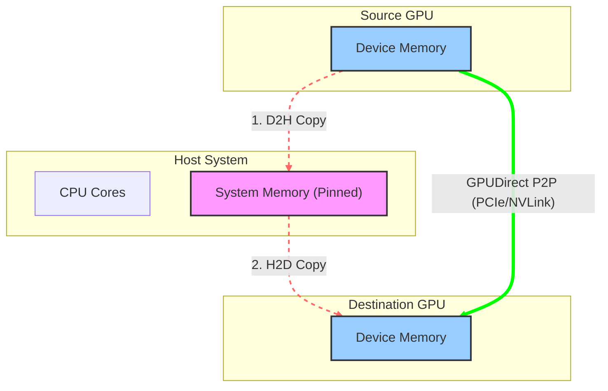

# NVIDIA GPUDirect P2P 技术详解：节点内 GPU 高速互联

## 1. 引言

在单机多卡（Single Node Multi-GPU）的深度学习训练和高性能计算场景中，GPU 之间频繁的数据交换是不可避免的。传统的 GPU 间通信（P2P, Peer-to-Peer）如果通过 CPU 系统内存中转，会带来显著的延迟和带宽瓶颈。

**GPUDirect P2P (Peer-to-Peer)** 技术允许同一节点内的 GPU 直接访问彼此的显存，无需将数据拷贝到 CPU 主机内存。这是构建高效多卡并行计算的基础，也是 GPUDirect 家族中最基础且应用最广泛的技术之一。

---

## 2. 技术原理

GPUDirect P2P 的核心在于绕过 CPU 和系统内存，利用 PCIe 总线的 **Peer-to-Peer TLP (Transaction Layer Packet) 转发**机制或 **NVLink 高速互连**协议，在 GPU 之间建立直接的 DMA (Direct Memory Access) 通路。

### 2.1 数据路径与延迟模型

通过对比传统的数据回弹（Bounce Buffer）路径与 GPUDirect P2P 的直接传输路径，我们可以清晰地看到延迟与带宽利用率的差异。



- **传统路径 (Bounce Buffer)**：

  1. **D2H (Device-to-Host)**：源 GPU 通过 DMA 将数据写入 CPU 系统内存（通常是 Pinned Memory）。
  2. **H2D (Host-to-Device)**：目标 GPU 通过 DMA 从系统内存读取数据。

  - **瓶颈**：数据在 PCIe 总线上往返两次，增加了延迟；且受限于系统内存带宽和 CPU 内存控制器效率。

- **GPUDirect P2P 路径**：

  1. **D2D (Device-to-Device)**：源 GPU 的 DMA 引擎直接向目标 GPU 的物理地址发起写操作。

  - **优势**：数据仅经过 PCIe Switch 或 NVLink 互连，无需经过 Root Complex (在同一 Switch 下) 或 CPU 内存，实现了真正的零拷贝 (Zero-Copy)。

### 2.2 关键技术支撑

GPUDirect P2P 的实现依赖于软硬件的紧密协同，包括软件层的**统一虚拟寻址** (UVA) 以及硬件层的 PCIe/NVLink 互连机制。

#### 2.2.1 统一虚拟寻址 (UVA) 与页表映射

CUDA 4.0 引入的 **UVA** (Unified Virtual Addressing) 是 P2P 的软件基础。

- **单一地址空间**：UVA 将 CPU 内存和所有 GPU 的显存映射到同一个 64 位虚拟地址空间。
- **MMU 协同**：当开启 P2P (`cudaDeviceEnablePeerAccess`) 后，CUDA 驱动程序会修改 GPU 的页表 (Page Table)。它将目标 GPU (Peer GPU) 的物理地址范围映射到当前 GPU (Current GPU) 的虚拟地址空间中。
- **直接寻址**：因此，CUDA Kernel 可以直接解引用一个指向 Peer GPU 显存的指针。GPU MMU 会自动将该虚拟地址翻译为目标 GPU 的物理地址，并发起通过 PCIe/NVLink 的访问请求。

#### 2.2.2 PCIe P2P 机制与 BAR 空间

对于基于 PCIe 的 P2P，其底层依赖于 PCIe 规范中的 **Base Address Register (BAR)** 机制。

- **BAR 映射**：每个 GPU 在启动时都会将其显存的一部分（通常是几百 MB 到全部显存，取决于 Resizable BAR 设置）映射到 PCIe 总线物理地址空间。
- **TLP 路由**：当源 GPU 发起对目标 GPU BAR 地址的写操作时，PCIe Switch 会根据地址路由 TLP 包。
  - **同一 Switch 下**：Switch 直接将 TLP 转发给目标 GPU，不经过 CPU Root Complex。
  - **跨 Switch/Root Port**：TLP 可能需要经过 Root Complex，此时需要 **ACS (Access Control Services)** 允许 P2P 转发，否则会被 IOMMU 拦截或重定向。

#### 2.2.3 NVLink 高速互连

NVLink 是 NVIDIA 专有的互连协议，专为多 GPU 通信优化。

- **高带宽与低延迟**：相比 PCIe，NVLink 提供了更高的带宽（例如 H100 上的 NVLink 4.0 双向带宽达 900 GB/s）和更低的协议开销。
- **内存语义**：NVLink 原生支持 Load/Store 内存语义，使得 GPU 间访问更接近于访问本地显存。
- **拓扑结构**：通过 NVSwitch，可以构建全互联 (All-to-All) 的 GPU 网络，使得任意两个 GPU 之间的 P2P 性能一致，消除了 PCIe 树状拓扑带来的 NUMA 效应。

---

## 3. 核心优势与性能对比

GPUDirect P2P 不仅是对传输路径的物理缩短，更是对计算系统 IO 模型的根本性优化。通过消除 Host 端的内存拷贝和 CPU 干预，它将 GPU 互联从“以 CPU 为中心”的星型拓扑转变为“以 GPU 为中心”的网状拓扑。

### 3.1 性能对比表

| 指标           | 传统路径 (Without P2P)                 | GPUDirect P2P                               |
| :------------- | :------------------------------------- | :------------------------------------------ |
| **数据路径**   | GPU A -> System Memory -> GPU B        | GPU A -> GPU B (Direct)                     |
| **传输跳数**   | 2 跳 (Device-to-Host + Host-to-Device) | 1 跳 (Device-to-Device)                     |
| **CPU 参与度** | 高 (需管理系统内存缓冲区)              | 低 (仅建立连接，不参与数据搬运)             |
| **延迟**       | 高 (PCIe 往返 + 系统内存开销)          | 低 (直接通过 PCIe Switch 或 NVLink)         |
| **带宽瓶颈**   | 受限于 PCIe 带宽及系统内存带宽         | 受限于 PCIe 或 NVLink (NVLink 可达 900GB/s) |

### 3.2 核心优势详情

GPUDirect P2P 在带宽、延迟、CPU 效率以及开发体验上都带来了显著的提升，以下是具体的优势分析：

#### 3.2.1 突破性的带宽提升

传统的 PCIe 路径受限于 PCIe 总线带宽（例如 PCIe Gen5 x16 双向约为 128 GB/s）。而 GPUDirect P2P 结合 **NVLink** 技术，可以提供数量级提升的互联带宽。

**NVLink 优势**：在 NVIDIA H100 GPU 上，NVLink 4.0 提供高达 **900 GB/s** 的双向聚合带宽，是 PCIe Gen5 的 7 倍以上。这对于参数量巨大的大模型训练（如 Transformer 架构）至关重要，因为 `AllReduce` 等集合通信操作是带宽敏感型的。

#### 3.2.2 极致的低延迟体验

通过消除 **Bounce Buffer**（系统内存中转），P2P 显著降低了端到端延迟。

- **物理路径缩短**：数据不再需要经过 Root Complex 和 CPU 内存控制器，减少了物理链路长度。
- **协议开销降低**：省去了 CPU 端的内存分配、锁页（Pinning）以及两次 DMA 描述符的建立过程。对于小包通信（Latency-sensitive），这种延迟优化尤为明显。

#### 3.2.3 CPU 算力解放 (CPU Offloading)

在传统模式下，CPU 需要花费大量周期来搬运数据（Memcpy）。开启 P2P 后：

- **控制流与数据流分离**：CPU 仅需负责发射指令（Launch Kernels/MemcpyAsync），繁重的数据搬运工作完全由 GPU 的 Copy Engine (DMA) 或 SM (通过 NVLink Load/Store) 完成。
- **重叠执行**：CPU 可以立即返回执行其他逻辑，从而更容易实现计算与通信的重叠 (Compute-Communication Overlap)。

#### 3.2.4 编程模型的简化与统一

P2P 支持 **Direct Memory Access (DMA)**，这意味着开发者可以将所有 GPU 的显存视为一个统一的地址空间。

- **零代码迁移**：对于使用 Unified Memory (`cudaMallocManaged`) 的应用，驱动程序会自动利用 P2P 路径加速页迁移，无需修改任何代码。
- **内核级访问**：CUDA Kernel 可以直接读写 Peer GPU 显存，这使得编写自定义的细粒度通信算法（如环形 AllReduce）变得非常直观。

---

## 4. 开发者指南：API 与代码示例

使用 GPUDirect P2P 主要涉及 CUDA Runtime API。开发者通常需要关注三个核心步骤：**查询拓扑**、**启用访问**、**执行传输**。

### 4.1 启用 P2P 访问 (P2P Initialization)

P2P 访问并非默认开启。必须显式检查硬件支持并在每一对 GPU 之间建立连接。

> **注意**：`cudaDeviceEnablePeerAccess` 是一个昂贵的操作（可能涉及 TLB 刷新和页表修改），通常只需在应用程序启动时执行一次。

```cpp
#include <stdio.h>
#include <cuda_runtime.h>

// 简易错误检查宏
#define CHECK(call) \
{ \
    const cudaError_t error = call; \
    if (error != cudaSuccess) { \
        printf("Error: %s:%d, ", __FILE__, __LINE__); \
        printf("code:%d, reason: %s\n", error, cudaGetErrorString(error)); \
        exit(1); \
    } \
}

int main() {
    int gpuid0 = 0;
    int gpuid1 = 1;
    int can_access_peer_0_1, can_access_peer_1_0;

    // 1. 双向检查硬件支持
    CHECK(cudaDeviceCanAccessPeer(&can_access_peer_0_1, gpuid0, gpuid1));
    CHECK(cudaDeviceCanAccessPeer(&can_access_peer_1_0, gpuid1, gpuid0));

    if (can_access_peer_0_1 && can_access_peer_1_0) {
        printf("P2P Access supported between GPU %d and GPU %d.\n", gpuid0, gpuid1);

        // 2. 双向启用 P2P 访问
        // 注意：必须切换到源设备来授权对目标设备的访问

        // GPU 0 可以访问 GPU 1
        CHECK(cudaSetDevice(gpuid0));
        CHECK(cudaDeviceEnablePeerAccess(gpuid1, 0));

        // GPU 1 可以访问 GPU 0
        CHECK(cudaSetDevice(gpuid1));
        CHECK(cudaDeviceEnablePeerAccess(gpuid0, 0));

        printf("Bidirectional P2P Access enabled.\n");
    } else {
        printf("P2P Access NOT supported.\n");
    }

    return 0;
}
```

### 4.2 P2P 数据拷贝 (Async Copy)

推荐使用 **异步拷贝 (`cudaMemcpyPeerAsync`)** 替代同步拷贝，以充分利用 Copy Engine 并实现计算与通信的重叠。

```cpp
// 分配显存
void *d_src, *d_dst;
cudaSetDevice(gpuid0);
cudaMalloc(&d_src, size);
cudaSetDevice(gpuid1);
cudaMalloc(&d_dst, size);

// 创建流
cudaStream_t stream;
cudaSetDevice(gpuid0);
cudaStreamCreate(&stream);

// P2P 异步拷贝：从 GPU 0 (src) 到 GPU 1 (dst)
// 此时 CPU 不会被阻塞，可以继续处理其他任务
cudaMemcpyPeerAsync(d_dst, gpuid1, d_src, gpuid0, size, stream);

// 同步流（等待传输完成）
cudaStreamSynchronize(stream);
```

### 4.3 P2P 直接寻址 (Direct Access Kernel)

在 Kernel 中直接读写远程 GPU 内存是最灵活的方式。利用 `__restrict__` 关键字可以帮助编译器优化加载指令。

```cpp
// Kernel: 运行在 GPU 0 上，读取 GPU 1 的数据
__global__ void p2p_add_kernel(float* __restrict__ local_data,
                               const float* __restrict__ remote_data,
                               int N) {
    int idx = blockIdx.x * blockDim.x + threadIdx.x;
    if (idx < N) {
        // 直接读取远程 GPU (remote_data) 的数据
        // 这一行代码会触发通过 NVLink/PCIe 的远程 Read 事务
        local_data[idx] += remote_data[idx];
    }
}

// Host 端调用
void launch_p2p_kernel(float* d_ptr0, float* d_ptr1, int N, cudaStream_t stream) {
    // 假设已开启 P2P 访问
    cudaSetDevice(gpuid0);

    // d_ptr1 是 GPU 1 上的指针
    // 得益于 UVA，GPU 0 的 Kernel 可以直接使用该指针
    int threads = 256;
    int blocks = (N + threads - 1) / threads;

    p2p_add_kernel<<<blocks, threads, 0, stream>>>(d_ptr0, d_ptr1, N);
}
```

---

## 5. 性能考量与注意事项

在实际部署 GPUDirect P2P 时，为了获得理论峰值带宽并避免潜在的性能陷阱，需要重点关注硬件拓扑、PCIe 配置及编程模型限制。

### 5.1 硬件拓扑与 NUMA 亲和性

硬件连接方式直接决定了 P2P 的性能上限。

- **拓扑检测**：使用 `nvidia-smi topo -m` 查看矩阵。
  - **最佳路径 (`NV#`)**：通过 NVLink 连接，提供最高带宽（如 H100 上单向 450GB/s）和最低延迟。
  - **次优路径 (`PIX`)**：通过同一 PCIe Switch 连接。支持全速 PCIe P2P，但受限于 PCIe 代数（Gen4/Gen5）带宽。
  - **受限路径 (`PHB`/`PXB`)**：跨 Host Bridge（即跨 CPU Socket）连接。数据需经过 CPU 间的互连总线（如 Intel UPI/AMD xGMI），不仅带宽受限，还会显著增加延迟。
- **NUMA 亲和性**：务必将控制 GPU 的 CPU 线程绑定到与该 GPU 最近的 NUMA 节点，以减少控制路径的延迟。

### 5.2 PCIe ACS (Access Control Services) 瓶颈

在纯 PCIe 环境中，ACS 是影响 P2P 性能的常见隐形杀手。

- **问题现象**：如果 PCIe Switch 开启了 ACS 转发隔离（通常为了虚拟化安全），P2P TLP 可能会被禁止直接转发，被迫路由到 Root Complex 再折回（P2P over Root Complex）。
- **性能影响**：这会导致有效带宽减半，并大幅增加延迟。
- **解决方案**：在裸机（Bare Metal）高性能计算环境中，应在 BIOS 或操作系统层面禁用 PCIe Switch 下行端口的 ACS 转发限制。

### 5.3 原子操作 (Atomic Operations) 的非对称性

PCIe 和 NVLink 对原子操作的支持存在本质差异：

- **NVLink**：原生支持所有 CUDA 原子操作（如 `atomicAdd`, `atomicCAS`），硬件一致性保证了远程原子操作的高性能。
- **PCIe**：GPUDirect P2P over PCIe 对原子操作支持有限。通常不支持远程原子操作，或者性能极低（因为需要锁定总线或回退到 Host 处理）。
- **建议**：在使用 PCIe P2P 时，避免对远程内存执行频繁的原子操作；应先将数据拉取到本地（Register/Shared Memory）计算后再写回。

### 5.4 系统级优化

- **IOMMU 开销**：虽然 P2P 绕过了 CPU 数据拷贝，但 IOMMU 的地址翻译（IOTLB Miss）仍可能引入开销。在可信集群环境中，通常建议开启 PCIe Passthrough 或使用 `iommu=pt` (Passthrough) 模式。
- **Unified Memory**：使用 `cudaMallocManaged` 分配的统一内存也会利用 P2P 机制。当 `cudaDeviceEnablePeerAccess` 激活时，Driver 会优先使用 P2P 链路处理缺页（Page Fault）和预取。

---

## 6. 总结

GPUDirect P2P 不仅仅是一项数据传输技术，更是现代高性能计算和深度学习系统的**节点内通信基石**。通过构建 GPU 间的直连高速公路（PCIe/NVLink），它彻底打破了传统以 CPU 为中心的冯·诺依曼瓶颈，实现了计算与通信的深度融合。

- **核心价值**：
  - **零拷贝与低延迟**：消除 Host 内存中转，显著降低通信开销。
  - **硬件协同**：充分利用 NVLink 的高带宽（900GB/s+）和原子操作特性，支撑大模型张量并行（Tensor Parallelism）。
  - **编程范式革新**：支持 Unified Memory 和直接指针访问，简化了多卡编程复杂度。
- **扩展路径**：
  - **节点内**：P2P 结合 NVSwitch 构建了单机超级计算机（如 DGX/HGX 系统）。
  - **节点间**：当通信跨越服务器边界时，GPUDirect P2P 的理念通过 [GPUDirect RDMA](./gpudirect_technology.md#2-gpudirect-rdma-技术) 延伸至网络，实现跨节点的零拷贝通信。

---

## 7. 参考资料

- **CUDA C++ Programming Guide**: [Peer Device Memory Access](https://docs.nvidia.com/cuda/cuda-c-programming-guide/index.html#peer-device-memory-access)  
  官方编程指南，详细解释了 UVA、P2P 寻址和内存一致性模型。
- **CUDA Runtime API Reference**: [Peer Device Memory Access](https://docs.nvidia.com/cuda/cuda-runtime-api/group__CUDART__PEER.html)  
  API 文档，包含 `cudaDeviceEnablePeerAccess` 和 `cudaMemcpyPeer` 的详细参数说明。
- **NVIDIA Developer Blog**: [Peer-to-Peer & Unified Virtual Addressing](https://developer.nvidia.com/blog/cuda-pro-tip-always-set-current-device-avoid-multithreading-bugs/)  
  虽然是一篇关于设置设备最佳实践的博客，但其中深入探讨了 UVA 和 P2P 上下文的重要性。
- **NVIDIA GPUDirect Overview**: [GPUDirect Technology](https://developer.nvidia.com/gpudirect)  
  GPUDirect 技术家族的总览页面。
