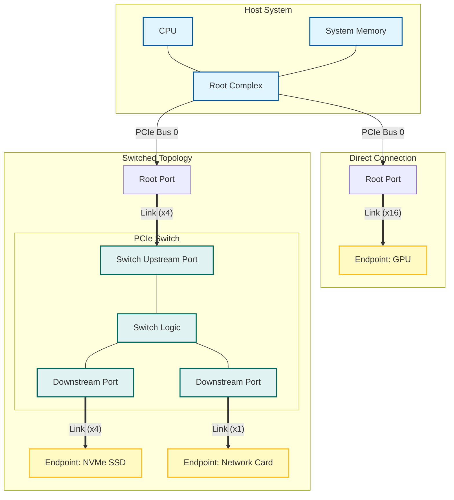

# PCIe 总线技术大全

> 本文基于 [Felix 的 PCIe 扫盲系列博文](http://blog.chinaaet.com/justlxy/p/5100053251) 及维基百科内容整理而成，旨在为读者提供一份从 PCI 到 PCIe 的全面技术指南。

---

## 1. 前言：PCIe 简介

本章将简要介绍 PCIe 的起源、核心优势以及从 Gen1 到 Gen7 的技术演进路线，帮助读者建立对 PCIe 技术的宏观认识。

### 1.1 什么是 PCIe

**PCI Express (Peripheral Component Interconnect Express)**，简称 **PCIe** 或 **PCI-E**，是继 ISA 和 PCI 总线之后的第三代 I/O 总线标准（3GIO）。它由 Intel 在 2001 年的 IDF 上提出，并由 PCI-SIG 组织发布。

目前 PCIe 已经发展到 Gen5、Gen6 甚至更高版本，但其核心架构依然保持向后兼容。

### 1.2 PCIe 的核心优势

PCIe 的主要优势在于：

- **高速率**：提供极高的数据传输带宽。
- **点对点传输**：取代了 PCI 的共享总线架构。
- **串行传输**：抗干扰能力强，传输距离远，信号完整性更好。
- **低功耗**：支持先进的电源管理。
- **软件兼容性**：在软件层面上完全兼容 PCI/PCI-X 设备。

### 1.3 PCIe 版本演进与性能对比

PCIe 规范由 PCI-SIG 组织维护，大约每 3-4 年更新一代，带宽通常翻倍。以下是各版本的关键参数对比：

| 版本    | 发布年份 | 传输速率 (GT/s) | 编码方式      | x1 带宽 (GB/s) | x16 带宽 (GB/s) | 备注                        |
| :------ | :------- | :-------------- | :------------ | :------------- | :-------------- | :-------------------------- |
| **1.0** | 2003     | 2.5             | 8b/10b        | 0.25           | 4.0             | 初始版本                    |
| **2.0** | 2007     | 5.0             | 8b/10b        | 0.50           | 8.0             | 速率翻倍                    |
| **3.0** | 2010     | 8.0             | 128b/130b     | 0.985          | 15.75           | 编码效率提升至 98.5%        |
| **4.0** | 2017     | 16.0            | 128b/130b     | 1.969          | 31.51           | 保持 128b/130b 编码         |
| **5.0** | 2019     | 32.0            | 128b/130b     | 3.938          | 63.02           | 面向高性能计算和 AI         |
| **6.0** | 2021     | 64.0            | PAM-4 (1b/1b) | 7.56           | 121.0           | 引入 PAM-4 调制和 FLIT 模式 |
| **7.0** | 2025     | 128.0           | PAM-4         | 15.13          | 242.0           | 正式发布，带宽再次翻倍      |

> **注**：
>
> 1. **GT/s (Giga Transfers per second)**：表示每秒传输的次数。实际带宽 = 传输速率 × 编码效率 × 通道数。
> 2. **编码效率**：
>    - Gen1/Gen2 使用 8b/10b 编码，效率为 80%。
>    - Gen3-Gen5 使用 128b/130b 编码，效率约为 98.5%。
>    - Gen6+ 引入 PAM-4 (脉冲幅度调制) 和 FLIT (Flow Control Unit) 编码，采用固定包大小，在相同频率下传输更多数据。

---

## 2. PCI 总线回顾

在深入 PCIe 之前，了解 PCI 总线的基础对于理解 PCIe 的演进至关重要。

### 2.1 基本概念

**PCI (Peripheral Component Interconnect)** 是一种局部并行总线标准。

- **结构**：树型结构，独立于 CPU 总线。
- **主从设备**：PCI 总线上只允许有一个主设备（Initiator）拥有总线控制权，其他为从设备（Target）。
- **仲裁**：通过仲裁器（Arbiter）管理总线使用权，使用 `REQ#` 和 `GNT#` 信号。

### 2.2 典型的 PCI 总线周期

PCI 总线是**地址和数据复用**的（AD 信号线）。所有信号与时钟同步。
一个典型的数据读取周期包括：

1. **Arbitration**：主设备申请并获得总线使用权。
2. **Address Phase**：`FRAME#` 拉低，主设备发送地址和命令。
3. **Data Phase**：`IRDY#`（主设备就绪）和 `TRDY#`（从设备就绪）同时有效时，传输数据。
4. **Turn-around**：总线控制权交接时的三态周期。
5. **Termination**：传输结束，信号恢复空闲。

### 2.3 Reflected-Wave Signaling (反射波信号)

PCI 总线（33MHz）利用**反射波信号**技术来降低功耗。

- **原理**：发送端的驱动能力较弱（只能驱动一半电平），依靠信号在传输线末端的反射波与入射波叠加，达到逻辑电平要求。
- **限制**：要求总线长度和负载严格受限。随着频率提高（如 66MHz），反射机制成为瓶颈，限制了总线上可挂载的设备数量（66MHz 下通常只能挂载 1-2 个插槽）。

### 2.4 三种传输模式

1. **Programmed I/O (PIO)**：CPU 直接参与数据搬运，效率低，占用 CPU 资源。
2. **DMA (Direct Memory Access)**：由 DMA 控制器完成内存与外设间的数据传输，无需 CPU 干预，效率高。
3. **Peer-to-Peer**：两个 PCI 设备之间直接通信（一个作为主设备，一个作为从设备），无需通过内存中转。

### 2.5 中断与错误处理

- **中断信号**：PCI 使用 `INTA#`, `INTB#`, `INTC#`, `INTD#` 四根边带信号（Sideband Signals）进行中断请求。这些信号是电平触发的，且可以共享（线与）。
- **中断路由**：系统中通常通过中断路由表（Interrupt Routing Table）将 PCI 插槽的中断映射到中断控制器的 IRQ 引脚。

### 2.6 地址空间分配

PCI 支持三种地址空间：

1. **Memory Space**：内存地址空间（32位或64位）。
2. **I/O Space**：I/O 地址空间（x86 下限制为 64KB，已逐渐废弃）。
3. **Configuration Space**：配置空间。每个功能（Function）有 256 字节的配置空间。
   - 访问方式：x86 通过 `0xCF8` (地址端口) 和 `0xCFC` (数据端口) 间接访问。

### 2.7 66MHz 瓶颈与 PCI-X

为了提高带宽，PCI 升级到了 66MHz/64-bit。但由于反射波信号机制和非寄存器输入（Non-registered Input）的时序限制，66MHz 已接近并行 PCI 总线的物理极限。

**PCI-X (PCI eXtended)**：

- **Registered Input**：引入寄存器输入，放宽时序要求，频率提升至 133MHz。
- **Split Transaction (分割事务)**：解决从设备响应慢导致的等待问题。当从设备无法立即响应时，会通知主设备释放总线，待数据准备好后再重新申请总线，从而显著提高总线利用率。
- **DDR/QDR**：在 PCI-X 2.0 中引入双倍/四倍数据速率。
- 尽管性能提升，但并行总线的串扰、布线难度和引脚数量问题依然存在，最终被串行的 PCIe 取代。

---

## 3. PCIe 总线基础

本章将重点介绍 PCIe 的核心架构设计，包括其分层体系结构、点对点拓扑结构以及在软件层面如何保持与传统 PCI 的兼容性。

### 3.1 基本概念

PCIe 采用**高速串行点对点**连接。

- **Link & Lane**：两个设备之间的连接称为 Link。Link 由 1 到 32 个 Lane 组成（x1, x2, x4, x8, x16, x32）。
- **差分信号**：每个 Lane 包含两对差分线（一对发送 TX，一对接收 RX），实现全双工通信。
- **嵌入式时钟**：接收端从数据流中恢复时钟（8b/10b 或 128b/130b 编码），无需独立时钟线。
- **拓扑结构**：
  - **Root Complex (RC)**：PCIe 树状结构的根节点，集成在 CPU 或北桥中。它负责 CPU/内存子系统与 PCIe 设备之间的事务生成与转换。
  - **Switch (交换机)**：具有一个上游端口 (Upstream Port) 和多个下游端口 (Downstream Port)。它提供了扇出能力，并在内部支持点对点的数据包转发（类似于网络交换机）。
  - **Endpoint (EP)**：拓扑结构的末端设备（如 NVMe SSD、显卡）。
    - **Legacy Endpoint**：支持 IO 事务，兼容旧式 PCI 操作。
    - **Native Endpoint**：仅支持 Memory 映射，通过 MSI/MSI-X 中断，性能更优。

为了更直观地理解，下图展示了一个典型的 PCIe 树状拓扑结构：

### 3.2 软件兼容性

PCIe 在硬件物理层上与 PCI 完全不同，但在**软件层**上保持兼容。

- PCIe 保留了 PCI 的配置空间定义（Header Type 0/1）。
- 操作系统依然可以通过枚举 PCI 总线的方式发现和配置 PCIe 设备，无需修改驱动模型。
- PCIe 扩展了配置空间至 4KB（前 256 字节与 PCI 兼容）。

### 3.3 体系结构概览

PCIe 采用分层结构：

1. **应用层 (Software/Application Layer)**：处理用户请求。
2. **事务层 (Transaction Layer)**：生成和解析 TLP (Transaction Layer Packet)，负责 QoS、流控、排序。
3. **数据链路层 (Data Link Layer)**：生成和解析 DLLP，负责数据完整性（CRC）、ACK/NAK 重传机制。
4. **物理层 (Physical Layer)**：负责链路训练、编解码（8b/10b）、串行化/解串、差分驱动。

---

## 4. PCIe 事务层 (Transaction Layer)

事务层是 PCIe 体系结构的核心，负责 TLP 包的构建与处理。

### 4.1 通信机制 (Request & Completion)

PCIe 通信基于**请求（Request）**和**完成（Completion）**模型。所有事务均由 Requester 发起，Completer 响应（如果需要）。

- **Requester**：发起请求的设备（如 RC 读取 EP 数据）。
- **Completer**：响应请求的设备（如 EP 返回数据给 RC）。

### 4.2 TLP 类型与 Posted/Non-Posted

根据是否需要对方返回响应，PCIe 事务分为两类：

1. **Non-Posted Transaction (非派发事务)**：
   - Requester 发送请求后，**必须**等待 Completer 返回 Completion 包。
   - 典型类型：**Memory Read**, **I/O Read/Write**, **Configuration Read/Write**。
   - 目的：确保数据已正确读取或写入（对于 I/O 和 Config 写入，需要确认完成以保证时序）。

2. **Posted Transaction (派发事务)**：
   - Requester 发送请求后，**不需要**等待 Completion 包，类似于“发射后不管”。
   - 典型类型：**Memory Write**, **Message**。
   - 优势：极大提高了总线效率，避免了写操作的等待延迟。

### 4.3 TLP 包结构

一个 TLP 包主要由 Header、Data Payload 和 ECRC 组成：

- **Header (包头)**：长度为 3 DW (12字节) 或 4 DW (16字节)。
  - **Fmt (Format)**：指定 TLP 长度（3DW/4DW）及是否包含数据。
  - **Type**：指定事务类型（Memory, I/O, Cfg, Msg）。
  - **Length**：数据载荷长度（以 DW 为单位，最大 1024 DW 即 4KB）。
  - **Requester ID**：由 Bus Number (8b) + Device Number (5b) + Function Number (3b) 组成，用于路由响应。
  - **Address**：64-bit 或 32-bit 地址。
- **Data Payload (数据载荷)**：仅在 Write 请求或 Read 完成包中存在，最大 4KB。
- **ECRC (End-to-End CRC)**：可选的 32-bit 校验，确保数据在穿越 Switch 时的端到端完整性。

### 4.4 QoS 与流量控制 (Flow Control)

PCIe 采用基于**信用 (Credit)** 的流控机制，而非简单的忙/闲状态。

- **Traffic Class (TC)**：TLP Header 中的 3-bit 字段，定义 8 个优先级（TC0-TC7）。
- **Virtual Channel (VC)**：物理缓冲区，TC 映射到 VC。不同 VC 独立仲裁，防止低优先级阻塞高优先级流量。
- **Flow Control Credits**：
  - 接收端定期向发送端广播当前可用的缓冲区空间（Credits）。
  - Credit 分为 3 类：**Posted (P)**, **Non-Posted (NP)**, **Completion (Cpl)**。
  - 每类又分为 **Header (H)** 和 **Data (D)** 两种信用。
  - 发送端只有在拥有足够 Credit 时才发送 TLP，从根本上消除了接收端缓冲区溢出导致的丢包。

---

## 5. PCIe 数据链路层 (Data Link Layer)

数据链路层位于事务层和物理层之间，负责链路管理和数据完整性。

### 5.1 主要功能

1. **TLP 组包与拆包**：为上层 TLP 增加 Sequence Number (2 Bytes) 和 LCRC (4 Bytes)。
2. **数据完整性校验**：通过 LCRC 确保 TLP 在链路传输中未出错。
3. **重传机制 (ACK/NAK)**：保证数据可靠传输。

### 5.2 DLLP (Data Link Layer Packet)

数据链路层会产生仅在相邻设备间传输的数据链路层包 (DLLP)，不包含数据载荷，长度固定（通常 6 字节）。常见类型：

- **ACK/NAK DLLP**：用于确认 TLP 接收状态。
- **InitFC1/InitFC2/UpdateFC**：用于流量控制信用的初始化和更新。
- **PM (Power Management)**：电源管理相关交互。

### 5.3 ACK/NAK 重传协议

- **Transmitter**：发送 TLP 后，将其副本保存在 **Replay Buffer** 中。
- **Receiver**：收到 TLP 后校验 LCRC 和 Sequence Number。
  - **校验通过**：返回 **ACK**，发送端清除 Replay Buffer 中对应的 TLP。
  - **校验失败**：返回 **NAK**，发送端重发 Replay Buffer 中的所有 TLP。
- 这种机制确保了即使物理层偶发误码，上层软件也无需干预，看到的是一条无错链路。

---

## 6. PCIe 物理层 (Physical Layer)

物理层负责逻辑与电气信号的转换，是 PCIe 协议栈的最底层。

### 6.1 逻辑子层与电气子层

- **逻辑子层 (Logical Sub-block)**：
  - **Byte Striping**：将数据流分发到多个 Lane 上（x1, x4, x16...）。
  - **Scrambling (扰码)**：通过异或操作打散数据规律，降低 EMI（电磁干扰）。
  - **Encoding (编码)**：
    - **8b/10b** (Gen1/2)：每 8-bit 数据编码为 10-bit 符号，引入 20% 开销。
    - **128b/130b** (Gen3/4/5)：每 128-bit 数据增加 2-bit 同步头，开销降至 ~1.5%。
    - **PAM-4/1b/1b** (Gen6+)：采用 4 电平脉冲调制和 FLIT 编码。
- **电气子层 (Electrical Sub-block)**：
  - **SerDes**：负责并行数据与高频串行信号的转换。
  - **Differential Driver/Receiver**：驱动差分对，实现低压差分信号传输。

### 6.2 链路训练与状态机 (LTSSM)

PCIe 链路的初始化和管理由 **LTSSM (Link Training and Status State Machine)** 控制。主要状态包括：

1. **Detect**：检测接收端是否连接了设备（通过检测终端电阻）。
2. **Polling**：发送训练序列（TS1/TS2），确立 Bit Lock 和 Symbol Lock。
3. **Configuration**：协商链路宽度（Link Width）和通道编号（Lane Numbering），处理 Lane Reversal。
4. **L0**：**正常工作状态**，传输数据。
5. **Recovery**：当链路出错或需要改变速率（Speed Change）时进入此状态，重新训练。
6. **L1/L2**：低功耗状态，暂停数据传输以省电。

---

## 7. 实例分析：Memory Read 操作

为了更好地理解上述概念，我们看一个 **Endpoint 向 System Memory 读取数据** 的过程（Non-Posted）：

1. **Requester (Endpoint)**：
   - 事务层构建 **MRd (Memory Read)** TLP，包含目标地址、Requester ID、Tag 等。
   - 数据链路层增加 Sequence Number 和 LCRC，暂存入 Replay Buffer。
   - 物理层进行编码、串行化，通过 Link 发送给 Switch/Root Complex。

2. **Switch/Root Complex**：
   - 接收并校验 TLP（物理层 -> 数据链路层）。
   - 若无误，返回 ACK DLLP（Endpoint 收到后释放 Replay Buffer）。
   - 路由逻辑将 TLP 转发至目标（System Memory 控制器）。

3. **Completer (System Memory)**：
   - 读取内存数据。
   - 构建 **CplD (Completion with Data)** TLP，包含请求的数据、Completer ID，并复制请求中的 Requester ID 和 Tag 以便匹配。

4. **返回路径**：
   - CplD TLP 经过反向路径路由回 Endpoint。
   - Endpoint 的事务层接收 CplD，利用 Tag 匹配原始请求，完成读取操作。

---

> **总结**：PCIe 通过分层架构、串行差分传输、流控和重传机制，完美解决了并行 PCI 总线的速度瓶颈和可靠性问题，成为现代计算机系统的基石。
