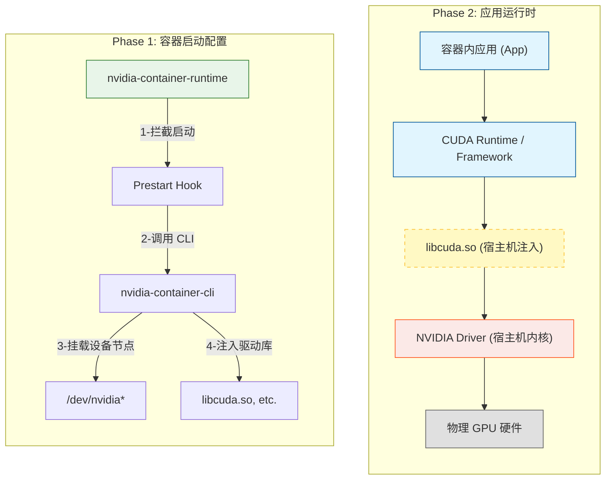

# NVIDIA GPU 容器环境：原理与构建指南

## 1. 总体原则

在 GPU 容器化环境中，核心原则是职责分离：**宿主机 (Host) 负责“驱动与设备管理”，容器 (Container) 负责“运行时库与应用本身”**。两者通过 NVIDIA Container Toolkit 进行解耦与衔接。

---

## 2. 宿主机组件安装

宿主机是 GPU 资源的物理载体，必须安装用于管理硬件的基础软件。

### 2.1 NVIDIA GPU Driver（必须）

NVIDIA GPU Driver 是管理物理 GPU 的核心组件，提供内核态与用户态接口，并对外暴露 `/dev/nvidia*` 设备文件与 `libcuda.so` 动态链接库。

该组件**只能安装在宿主机**，容器中不可也不应安装。

**主要包含内容：**

- **内核模块（Kernel Modules）：**

  ```bash
  # 核心驱动模块
  nvidia.ko
  # 统一内存管理模块
  nvidia_uvm.ko
  # 显示模式设置模块
  nvidia_modeset.ko
  ```

- **用户态库（User-space Libraries）：**

  ```bash
  # CUDA 驱动库
  libcuda.so
  # NVIDIA 管理库（用于 nvidia-smi 等）
  libnvidia-ml.so
  ```

- **管理工具：**

  ```bash
  # GPU 状态监控工具
  nvidia-smi
  ```

### 2.2 NVIDIA Container Toolkit（必须）

NVIDIA Container Toolkit 是实现容器使用 GPU 的关键组件（旧称 `nvidia-docker`）。它提供了一个 OCI 兼容的运行时包装器，用于在容器启动前自动配置 GPU 环境。

**核心组件与架构：**

1. **nvidia-container-runtime**: 一个轻量级的 Wrapper，它包裹了系统的原生运行时（如 runC）。它并不直接运行容器，而是拦截容器启动请求，注入 `prestart hook`。
2. **nvidia-container-toolkit (Hook)**: 作为 prestart hook 被调用，它读取容器配置（如环境变量、Mounts），并调用 CLI 工具。
3. **nvidia-ctk**: (v1.11.0+ 引入) 新一代命令行工具，用于配置生成和 CDI (Container Device Interface) 规范管理，逐步取代部分旧组件功能。
4. **libnvidia-container / nvidia-container-cli**: 核心执行组件。它负责与操作系统内核交互，执行具体的设备挂载和库文件注入。

**NVIDIA Container Runtime 的具体职责（Under the Hood）：**

当你在 Docker 中执行命令启动 GPU 容器时，Runtime 实际上在幕后完成了以下动作：

1. **拦截启动**：`nvidia-container-runtime` 拦截 runC 的启动指令。
2. **注入 Hook**：在 OCI 规范的 `prestart` 阶段注入 `nvidia-container-toolkit` 钩子。
3. **设备挂载 (Mount Devices)**：解析 `--gpus` 参数，找到对应的 GPU 设备节点（如 `/dev/nvidia0`, `/dev/nvidiactl`），并将其挂载到容器内的 `/dev/` 目录。
4. **库注入 (Inject Libraries)**：将宿主机上的驱动库（如 `libcuda.so`, `libnvidia-ml.so`）挂载到容器内，通常通过 `ld.so.conf` 机制确保容器内应用能加载到这些库。
5. **Cgroups 配置**：配置设备控制组（Device Cgroup），确保容器内进程只能访问被允许的 GPU 设备，实现资源隔离。

> **深度阅读**：关于 NVIDIA Container Toolkit 的源码级深度解析（含 CDI 规范、Hook 机制代码分析），请参考 [NVIDIA Container Toolkit 原理分析与代码深度解析](../../04_cloud_native_ai_platform/k8s/Nvidia%20Container%20Toolkit%20原理分析.md)。

### 2.3 Docker / Container Runtime（必须）

宿主机需要安装支持 OCI 标准的容器运行时，如 Docker、containerd 或 CRI-O。

- **Docker 19.03+**：原生支持 `--gpus` 参数，推荐使用。
- **Containerd / CRI-O**：通常通过配置 CDI 或 Runtime Class 来支持 GPU。

### 2.4 Kubernetes / GPU Operator（可选）

在 Kubernetes 集群环境中，推荐使用 GPU Operator。它可以实现：

- 自动化安装 NVIDIA Driver；
- 自动化注入 Container Runtime 配置；
- 自动化管理 GPU 节点的生命周期。

> **注**：即使使用 GPU Operator，本质上驱动仍然是安装在宿主机内核中，Operator 只是实现了部署的自动化。

### 2.5 宿主机最小安装清单总结

| 组件                         | 必须性 | 说明                         |
| :--------------------------- | :----- | :--------------------------- |
| **Linux Kernel**             | 必须   | 操作系统内核                 |
| **NVIDIA GPU Driver**        | 必须   | 硬件驱动，提供内核模块       |
| **NVIDIA Container Toolkit** | 必须   | 容器运行时扩展，用于挂载 GPU |
| **Docker / containerd**      | 必须   | 容器运行时                   |

---

## 3. 容器镜像组件安装

容器镜像应保持轻量，仅包含应用运行所需的依赖。

### 3.1 CUDA Runtime / Toolkit（按需）

通常基于 NVIDIA 官方提供的 CUDA 基础镜像构建：`nvidia/cuda:<version>-<variant>-<os>`。

**Variant 版本选择指南：**

| Variant     | 包含内容                             | 典型使用场景                   |
| :---------- | :----------------------------------- | :----------------------------- |
| **base**    | `libcudart` (CUDA Runtime API)       | 仅运行已编译好的二进制程序     |
| **runtime** | `base` + `cuBLAS`, `cuDNN` 等数学库  | 深度学习推理、训练任务         |
| **devel**   | `runtime` + `nvcc`, 头文件, 开发工具 | 编译 CUDA 程序、构建自定义算子 |

### 3.2 深度学习框架与上层库（按需）

根据业务需求，在容器内安装相应的框架和库：

- **深度学习框架：** PyTorch, TensorFlow 等
- **推理引擎：** TensorRT, ONNX Runtime 等
- **通信库：** NCCL (通常集成在框架中)
- **服务框架：** Triton Inference Server Client 等

**所有这些上层应用库必须安装在容器内。**

### 3.3 应用程序（必须）

- 业务代码（Python 脚本、C++ 源码等）
- 编译后的二进制程序
- 模型文件（或运行时挂载）

### 3.4 开发工具（可选）

仅在构建阶段（Build Stage）或开发调试镜像中保留，生产镜像建议移除以减小体积：

- `gcc` / `make` / `cmake`
- `git`
- Python 开发包 (`python-dev`)

### 3.5 容器内禁装组件

以下组件**严禁**安装在容器镜像中，它们应由宿主机通过 NVIDIA Container Runtime 动态注入：

- ❌ **NVIDIA Driver** (包括 `.run` 安装包)
- ❌ **内核模块** (`nvidia.ko` 等)
- ❌ **DKMS**
- ❌ **libcuda.so** (特定于驱动版本的库，动态注入的目标是 `libcuda.so.1` 及其软链)

---

## 4. 实战示例：启动 GPU 容器

本章通过具体的 Docker 命令演示如何验证 GPU 环境的可用性，并展示不同场景下的资源分配与控制方法。

### 4.1 基础验证

最简单的验证命令，用于检查容器是否能识别 GPU。

```bash
# 使用所有 GPU
# 注：nvidia-smi 二进制文件由 NVIDIA Container Runtime 从宿主机动态注入，基础镜像本身无需包含此工具
docker run --rm --gpus all nvidia/cuda:12.1.1-base-ubuntu22.04 nvidia-smi
```

### 4.2 指定特定 GPU

当主机有多张卡时，可以指定容器只使用其中的一部分。

```bash
# 仅使用 0 号和 2 号 GPU
docker run --rm --gpus '"device=0,2"' nvidia/cuda:12.1.1-base-ubuntu22.04 nvidia-smi
```

### 4.3 环境变量控制 (推荐调试用)

除了 `--gpus` 参数，也可以通过环境变量 `NVIDIA_VISIBLE_DEVICES` 控制（需配合 `--runtime=nvidia` 或默认配置）。

```bash
# 效果等同于 --gpus '"device=0"'
docker run --rm --runtime=nvidia -e NVIDIA_VISIBLE_DEVICES=0 nvidia/cuda:12.1.1-base-ubuntu22.04 nvidia-smi
```

### 4.4 检查驱动能力 (Capabilities)

有些场景（如只需图形渲染或只需计算）可以指定驱动能力，减少注入的内容。

```bash
# 仅注入计算和工具相关的库（通常用于 AI 任务）
docker run --rm --gpus 'all,"capabilities=compute,utility"' nvidia/cuda:12.1.1-base-ubuntu22.04 nvidia-smi
```

---

## 5. 职责边界与调用链

为了深入理解容器化 GPU 的工作原理，我们需要清晰地划分宿主机与容器的职责边界，并掌握从应用层到硬件层的完整调用链路。

### 5.1 职责边界对照表

| 组件              | 宿主机 (Host) | 容器 (Container) | 备注                                                  |
| :---------------- | :-----------: | :--------------: | :---------------------------------------------------- |
| **NVIDIA Driver** |      ✅       |        ❌        | 驱动必须与内核匹配                                    |
| **nvidia-smi**    |      ✅       |        ❌        | 容器内可用，但由宿主机注入                            |
| **libcuda.so**    |      ✅       |        ❌        | 容器内可用，但由宿主机注入（通常映射为 libcuda.so.1） |
| **CUDA Runtime**  |      ❌       |        ✅        | 应用依赖，必须在镜像中                                |
| **CUDA Toolkit**  |      ❌       |        ✅        | 编译依赖，按需安装                                    |
| **cuDNN / NCCL**  |      ❌       |        ✅        | 框架依赖，必须在镜像中                                |
| **PyTorch / TF**  |      ❌       |        ✅        | 业务框架                                              |
| **应用程序**      |      ❌       |        ✅        | 业务逻辑                                              |

### 5.2 运行时调用链

掌握从容器启动配置到运行时应用调用的完整链路，是深入理解 GPU 容器化工作机制的关键：



1. **准备阶段**：`nvidia-container-runtime` 拦截容器启动，调用 `nvidia-container-cli` 将宿主机的设备文件和驱动库挂载到容器文件系统中。
2. **应用层**：容器内的应用调用 PyTorch 或 CUDA Runtime API。
3. **接口层**：调用请求被传递给容器内的 `libcuda.so`（该文件实际上是容器启动时从宿主机挂载进来的）。
4. **驱动层**：`libcuda.so` 通过系统调用与宿主机内核中的 NVIDIA Driver 通信。
5. **硬件层**：NVIDIA Driver 指挥物理 GPU 执行计算。

---

## 6. 总结

构建稳定高效的 GPU 容器环境，关键在于明确 **“宿主机管理硬件，容器管理应用”** 的分界线。宿主机只需保证驱动和容器运行时的就绪，而容器镜像则应专注于应用运行所需的 CUDA 运行时环境和依赖库。这种架构不仅保证了环境的隔离性，也最大化了镜像的可移植性。
