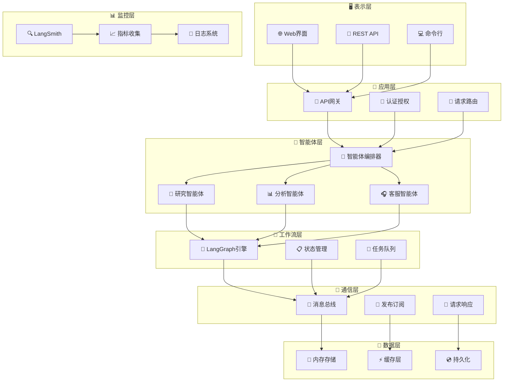

# 企业级多智能体 AI 系统

> 基于《多智能体 AI 系统基础：理论与框架》构建的生产级多智能体 AI 系统，集成现代 AI 工具链和企业级特性。

## 1. 项目概述

本项目是一个**生产就绪**的企业级多智能体 AI 系统，采用现代软件架构设计原则，实现了：

- **BDI 认知架构**：完整的信念-愿望-意图循环实现
- **智能体协作**：专业化智能体间的高效协作机制
- **工作流编排**：基于 LangGraph 的复杂业务流程自动化
- **全链路监控**：LangSmith 集成的性能追踪和分析
- **企业级特性**：高可用、可扩展、可观测的系统设计

## 2. 核心特性

### 2.1 架构设计

- **BDI 认知架构**：完整的信念-愿望-意图认知循环
- **事件驱动架构**：异步消息处理和响应式设计
- **微服务架构**：松耦合、高内聚的模块化设计
- **SOLID 原则**：遵循面向对象设计最佳实践

### 2.2 智能体能力

- **专业化智能体**：研究、分析、客服等领域专家
- **协作机制**：智能体间的高效协作和任务分配
- **插件化扩展**：支持自定义智能体和能力扩展
- **角色适配**：动态角色切换和能力组合

### 2.3 技术栈

- **LangGraph 工作流**：复杂业务流程的可视化编排
- **LangSmith 监控**：全链路追踪和性能分析
- **FastAPI 框架**：高性能异步 Web API
- **容器化部署**：Docker + Kubernetes 生产部署（demo 采用 docker compose）

### 2.4 企业级特性

- **高可用性**：故障恢复和负载均衡
- **安全认证**：API 密钥和访问控制
- **可观测性**：日志、指标、链路追踪
- **高性能**：异步处理和资源优化

---

## 3. 项目结构

```bash
multi_agent_system/
├── 📂 src/                           # 核心源代码
│   ├── 🤖 agents/                    # 智能体模块
│   │   ├── base_agent.py            # 🧠 BDI基础智能体架构
│   │   ├── research_agent.py        # 🔬 研究专家智能体
│   │   └── analysis_agent.py        # 📊 分析专家智能体
│   ├── 📡 communication/             # 通信中间件
│   │   └── message_bus.py           # 🚌 企业级消息总线
│   ├── 🔄 workflows/                 # 工作流引擎
│   │   └── langgraph_workflow.py    # 🌊 LangGraph工作流编排
│   ├── 🎯 examples/                  # 应用示例
│   │   └── customer_service_system.py # 🎧 智能客服系统
│   └── 🚀 main.py                   # 主应用入口
├── 🧪 tests/                        # 测试套件
│   ├── test_system.py              # 🔍 系统集成测试
│   ├── test_interactions.py        # 🔄 交互功能测试
│   ├── test_api_server.py          # 🚀 API 服务器测试
│   └── test_api_client.py          # 📡 API 客户端测试
├── ⚙️ config.json                   # 系统配置文件
├── 📦 requirements.txt              # Python依赖清单
├── 🐳 Dockerfile                    # 容器化配置
├── 🐙 docker-compose.yml           # 多服务编排
└── 📖 README.md                     # 项目文档
```

### 3.1 目录说明

| 目录/文件            | 功能描述       | 关键特性                               |
| -------------------- | -------------- | -------------------------------------- |
| `src/agents/`        | 智能体核心实现 | BDI 架构、专业化能力、协作机制         |
| `src/communication/` | 通信基础设施   | 消息总线、发布订阅、请求响应           |
| `src/workflows/`     | 工作流引擎     | LangGraph 集成、流程编排、状态管理     |
| `src/examples/`      | 业务应用示例   | 智能客服、研究分析、最佳实践           |
| `tests/`             | 测试覆盖       | 单元测试、集成测试、性能测试、API 测试 |
| `config.json`        | 配置管理       | 环境配置、API 密钥、系统参数           |

---

## 4. 系统架构

### 4.1 分层架构设计



### 4.2 核心组件说明

| 层级         | 组件           | 职责               | 技术栈                |
| ------------ | -------------- | ------------------ | --------------------- |
| **表示层**   | Web 界面/API   | 用户交互、接口暴露 | FastAPI, Streamlit    |
| **应用层**   | API 网关       | 请求路由、认证授权 | FastAPI, JWT          |
| **智能体层** | 专业智能体     | 业务逻辑、AI 推理  | LangChain, OpenAI     |
| **工作流层** | LangGraph 引擎 | 流程编排、状态管理 | LangGraph, StateGraph |
| **通信层**   | 消息总线       | 异步通信、事件驱动 | asyncio, Queue        |
| **数据层**   | 存储管理       | 数据持久化、缓存   | Redis, PostgreSQL     |
| **监控层**   | 可观测性       | 追踪、指标、日志   | LangSmith, Prometheus |

---

## 5. 快速开始

### 5.1 一键启动

```bash
# 克隆项目
git clone <repository-url>
cd multi_agent_system
```

#### 5.1.1 方式一：Docker Compose 启动（较复杂）

```bash
# 启动所有服务
docker-compose up -d

# 查看服务状态
docker-compose ps
```

**可访问的服务：**

| 服务                | 地址                         | 用途                   |
| ------------------- | ---------------------------- | ---------------------- |
| 🌐 Web 界面         | <http://localhost:8501>      | Streamlit 用户界面     |
| 🚀 API 文档         | <http://localhost:8000/docs> | FastAPI Swagger 文档   |
| 📊 Grafana 面板     | <http://localhost:3000>      | 监控面板 (admin/admin) |
| 🔍 Prometheus       | <http://localhost:9090>      | 指标收集               |
| 📝 Jupyter Notebook | <http://localhost:8888>      | 开发环境               |
| 🌐 Nginx 代理       | <http://localhost:80>        | 反向代理               |

#### 5.1.2 方式二：Python 本地启动（交互式方式）

```bash
# 安装依赖
pip install -r requirements.txt

# 启动主应用
python main.py

# 或指定参数启动
python main.py --log-level INFO --demo research
python main.py --demo customer_service
python main.py --metrics
python main.py --interactive
```

**系统功能：**

| 功能            | 描述           | 用途                 |
| --------------- | -------------- | -------------------- |
| 🤖 多智能体系统 | 核心智能体框架 | 智能体协作、任务处理 |
| 📊 消息总线     | 智能体间通信   | 消息传递、事件处理   |
| 🔄 工作流引擎   | LangGraph 集成 | 复杂任务编排         |
| 📈 监控追踪     | LangSmith 集成 | 性能监控、调试追踪   |

**注意：** Python 本地启动方式启动多智能体系统核心服务，不包含 Web API 接口。如需 API 服务，请使用方式三的 API 服务器测试启动。

#### 5.1.3 方式三：API 服务器测试启动

如果您需要专门启动 FastAPI 服务器进行 API 测试，可以使用以下命令：

```bash
# 激活虚拟环境
source venv/bin/activate

# 启动 API 服务器（专用于测试）
python tests/test_api_server.py
```

**服务器功能：**

- 🌐 完整的 FastAPI Web 服务器
- 📡 所有 RESTful API 接口
- 📊 实时系统监控和指标
- 🔍 自动生成的 API 文档
- 🎯 健康检查和状态端点

**可访问地址：**

| 服务        | 地址                            | 用途            |
| ----------- | ------------------------------- | --------------- |
| 🚀 API 服务 | <http://localhost:8000>         | 主要 API 接口   |
| 🚀 API 文档 | <http://localhost:8000/docs>    | Swagger 文档    |
| 📖 备用文档 | <http://localhost:8000/redoc>   | ReDoc 文档      |
| 📊 健康检查 | <http://localhost:8000/health>  | 系统状态        |
| 📈 系统指标 | <http://localhost:8000/metrics> | Prometheus 指标 |

**适用场景：**

- API 接口开发和测试
- 前端开发时的后端服务
- API 文档查看和调试
- 系统集成测试

### 5.2 环境配置

**必需环境：**

- Python 3.11+
- Docker（推荐）

**API 密钥配置：**

```bash
# 设置环境变量
export OPENAI_API_KEY="your-openai-key"
export LANGSMITH_API_KEY="your-langsmith-key"

# 或编辑 config.json
{
  "openai_api_key": "your-openai-key",
  "langsmith_api_key": "your-langsmith-key"
}
```

### 5.3 服务访问说明

根据启动方式不同，可访问的服务也有所区别：

**Docker Compose 启动（完整服务）：**

- 🌐 **Web 界面**：<http://localhost:8501> - Streamlit 用户界面
- 🚀 **API 文档**：<http://localhost:8000/docs> - FastAPI Swagger 文档
- 📊 **Grafana 面板**：<http://localhost:3000> - 监控面板 (admin/admin)
- 🔍 **Prometheus**：<http://localhost:9090> - 指标收集
- 📝 **Jupyter Notebook**：<http://localhost:8888> - 开发环境
- 🌐 **Nginx 代理**：<http://localhost:80> - 反向代理

**Python 本地启动（核心服务）：**

- 🚀 **API 服务**：<http://localhost:8000> - 主要 API 接口
- 🚀 **API 文档**：<http://localhost:8000/docs> - Swagger 文档
- 📊 **健康检查**：<http://localhost:8000/health> - 系统状态
- 📈 **指标接口**：<http://localhost:8000/metrics> - Prometheus 指标

### 5.4 验证安装

```bash
# 检查系统状态
curl http://localhost:8000/health

# 运行所有测试
python -m pytest tests/ -v

# 运行特定测试
python tests/test_interactions.py      # 基础交互测试
python tests/test_api_server.py        # 启动 API 服务器
python tests/test_api_client.py        # API 客户端测试
```

### 5.4.1 测试文件说明

项目包含完整的测试套件，验证系统的各个功能模块：

#### 5.5.1 🔄 test_interactions.py - 基础交互测试

验证多智能体系统的核心交互功能：

```bash
# 运行基础交互测试
cd /path/to/multi_agent_system
source venv/bin/activate
python tests/test_interactions.py
```

**测试内容：**

- ✅ 系统启动和关闭
- ✅ 智能体创建和配置
- ✅ 基础任务执行
- ✅ 错误处理机制
- ✅ 性能指标收集

#### 5.5.2 🚀 test_api_server.py - API 服务器测试

启动完整的 FastAPI 服务器进行测试：

```bash
# 启动 API 服务器（阻塞模式）
python tests/test_api_server.py
```

**服务器功能：**

- 🌐 FastAPI Web 服务器
- 📡 RESTful API 接口
- 📊 实时系统监控
- 🔍 API 文档生成
- 🎯 健康检查端点

**可访问地址：**

- API 文档：<http://localhost:8000/docs>
- 备用文档：<http://localhost:8000/redoc>
- 健康检查：<http://localhost:8000/health>
- 系统指标：<http://localhost:8000/metrics>

#### 5.5.3 📡 test_api_client.py - API 客户端测试

验证所有 API 接口的功能：

```bash
# 运行 API 客户端测试（需要先启动服务器）
python tests/test_api_client.py
```

**测试接口：**

- ✅ 健康检查 (`GET /health`)
- ✅ 创建研究任务 (`POST /tasks`)
- ✅ 查询任务状态 (`GET /tasks/{task_id}`)
- ✅ 数据分析 (`POST /analysis`)
- ✅ 智能客服对话 (`POST /chat`)
- ✅ 系统监控 (`GET /metrics`)

#### 5.5.4 🔍 test_system.py - 系统集成测试

原有的系统集成测试，使用 pytest 框架：

```bash
# 运行 pytest 测试
python -m pytest tests/test_system.py -v
```

#### 5.5.5 📋 测试执行顺序建议

1. **基础功能验证**：

   ```bash
   python tests/test_interactions.py
   ```

2. **启动 API 服务器**（新终端）：

   ```bash
   python tests/test_api_server.py
   ```

3. **验证 API 接口**（另一个新终端）：

   ```bash
   python tests/test_api_client.py
   ```

4. **运行完整测试套件**：

   ```bash
   python -m pytest tests/ -v
   ```

> 💡 **提示**：API 客户端测试需要先启动 API 服务器，建议在不同终端窗口中运行。

## 5.5 使用指南

### 5.5.1 核心功能

| 功能        | 接口             | 示例               |
| ----------- | ---------------- | ------------------ |
| 🔬 研究任务 | `POST /tasks`    | 市场分析、技术调研 |
| 📊 数据分析 | `POST /analysis` | 用户行为、趋势预测 |
| 🎧 智能客服 | `POST /chat`     | 问答、工单处理     |
| 📈 系统监控 | `GET /metrics`   | 性能指标、健康检查 |

### 6.2 API 使用示例

#### 6.2.1 认证配置

**环境变量设置：**

```bash
# 设置 API 密钥
export OPENAI_API_KEY="your-openai-api-key"
export LANGSMITH_API_KEY="your-langsmith-api-key"

# 或使用配置文件
cp config.json.example config.json
# 编辑 config.json 文件，填入相应的 API 密钥
```

**API 请求头：**

```bash
# 所有 API 请求都需要包含以下请求头
-H "Content-Type: application/json"
-H "Accept: application/json"
```

#### 6.2.2 研究任务 API

**创建研究任务：**

```bash
curl -X POST "http://localhost:8000/tasks" \
  -H "Content-Type: application/json" \
  -H "Accept: application/json" \
  -d '{
    "type": "research",
    "query": "人工智能在医疗领域的应用前景",
    "priority": "high",
    "context": {
      "domain": "healthcare",
      "timeframe": "2024-2025",
      "depth": "comprehensive"
    }
  }'
```

**成功响应示例：**

```json
{
  "status": "success",
  "data": {
    "task_id": "task_12345",
    "type": "research",
    "status": "created",
    "priority": "high",
    "created_at": "2024-01-15T10:30:00Z",
    "estimated_completion": "2024-01-15T10:35:00Z"
  },
  "message": "研究任务创建成功"
}
```

**查询任务状态：**

```bash
curl -X GET "http://localhost:8000/tasks/task_12345" \
  -H "Accept: application/json"
```

**任务状态响应示例：**

```json
{
  "status": "success",
  "data": {
    "task_id": "task_12345",
    "type": "research",
    "status": "completed",
    "progress": 100,
    "result": {
      "summary": "人工智能在医疗领域展现出巨大潜力...",
      "key_findings": [
        "AI 诊断准确率提升 15-20%",
        "药物研发周期缩短 30%",
        "医疗成本降低 25%"
      ],
      "recommendations": ["加强 AI 医疗监管框架建设", "推进医疗数据标准化"]
    },
    "created_at": "2024-01-15T10:30:00Z",
    "completed_at": "2024-01-15T10:34:23Z"
  }
}
```

#### 6.2.3 数据分析 API

**创建分析任务：**

```bash
curl -X POST "http://localhost:8000/analysis" \
  -H "Content-Type: application/json" \
  -d '{
    "data_source": "user_behavior",
    "analysis_type": "trend_prediction",
    "parameters": {
      "time_range": "last_30_days",
      "metrics": ["engagement", "conversion", "retention"],
      "prediction_horizon": "next_7_days"
    }
  }'
```

**分析结果响应示例：**

```json
{
  "status": "success",
  "data": {
    "analysis_id": "analysis_67890",
    "type": "trend_prediction",
    "results": {
      "current_trends": {
        "engagement": { "trend": "increasing", "rate": 12.5 },
        "conversion": { "trend": "stable", "rate": 3.2 },
        "retention": { "trend": "decreasing", "rate": -5.1 }
      },
      "predictions": {
        "next_7_days": {
          "engagement": { "predicted_change": "+8.3%", "confidence": 0.87 },
          "conversion": { "predicted_change": "+1.2%", "confidence": 0.92 },
          "retention": { "predicted_change": "-2.1%", "confidence": 0.79 }
        }
      },
      "insights": [
        "用户参与度持续上升，建议加大内容投入",
        "留存率下降需要关注，建议优化用户体验"
      ]
    },
    "generated_at": "2024-01-15T11:15:30Z"
  }
}
```

#### 6.2.4 智能客服 API

**发起客服对话：**

```bash
curl -X POST "http://localhost:8000/chat" \
  -H "Content-Type: application/json" \
  -d '{
    "message": "我想了解你们的企业版定价方案",
    "user_id": "user_123456",
    "session_id": "session_abc789",
    "context": {
      "user_tier": "premium",
      "previous_interactions": 3,
      "preferred_language": "zh-CN"
    }
  }'
```

**客服响应示例：**

```json
{
  "status": "success",
  "data": {
    "response": "您好！我很乐意为您介绍企业版定价方案。我们提供三个企业版套餐：\n\n1. **标准企业版**：￥999/月，支持 50 个智能体\n2. **专业企业版**：￥2999/月，支持 200 个智能体\n3. **旗舰企业版**：￥5999/月，无限智能体\n\n所有企业版都包含：7x24 技术支持、私有部署选项、定制化开发服务。\n\n您的团队规模大概是多少人呢？我可以为您推荐最适合的方案。",
    "intent": "pricing_inquiry",
    "sentiment": "neutral",
    "confidence": 0.94,
    "suggested_actions": [
      "schedule_demo",
      "send_pricing_details",
      "connect_sales_team"
    ],
    "session_id": "session_abc789",
    "timestamp": "2024-01-15T11:20:15Z"
  }
}
```

#### 6.2.5 系统监控 API

**获取系统指标：**

```bash
curl -X GET "http://localhost:8000/metrics" \
  -H "Accept: application/json"
```

**系统指标响应示例：**

```json
{
  "status": "success",
  "data": {
    "system_health": {
      "status": "healthy",
      "uptime": "72h 15m 30s",
      "version": "1.0.0"
    },
    "performance": {
      "cpu_usage": 45.2,
      "memory_usage": 68.7,
      "disk_usage": 23.1,
      "network_io": {
        "bytes_sent": 1024000,
        "bytes_received": 2048000
      }
    },
    "agents": {
      "total_agents": 12,
      "active_agents": 8,
      "idle_agents": 4,
      "average_response_time": "1.2s"
    },
    "tasks": {
      "total_tasks": 156,
      "completed_tasks": 142,
      "pending_tasks": 8,
      "failed_tasks": 6,
      "success_rate": 91.0
    },
    "timestamp": "2024-01-15T11:25:00Z"
  }
}
```

#### 6.2.6 错误处理

**常见错误响应格式：**

```json
{
  "status": "error",
  "error": {
    "code": "INVALID_REQUEST",
    "message": "请求参数无效",
    "details": {
      "field": "query",
      "issue": "查询内容不能为空"
    }
  },
  "timestamp": "2024-01-15T11:30:00Z"
}
```

**HTTP 状态码说明：**

| 状态码 | 含义       | 说明               |
| ------ | ---------- | ------------------ |
| 200    | 成功       | 请求处理成功       |
| 201    | 已创建     | 资源创建成功       |
| 400    | 请求错误   | 请求参数无效       |
| 401    | 未授权     | API 密钥无效或缺失 |
| 403    | 禁止访问   | 权限不足           |
| 404    | 未找到     | 资源不存在         |
| 429    | 请求过多   | 超出速率限制       |
| 500    | 服务器错误 | 内部服务器错误     |
| 503    | 服务不可用 | 服务暂时不可用     |

### 6.3 Python SDK

#### 6.3.1 基础使用

```python
from src.main import MultiAgentSystem
import asyncio
import json

async def main():
    # 初始化系统（使用默认配置）
    system = MultiAgentSystem()

    try:
        # 启动系统
        await system.start()
        print("✅ 多智能体系统启动成功")

        # 等待系统完全初始化
        await asyncio.sleep(2)

        # 运行示例任务
        await run_examples(system)

    except Exception as e:
        print(f"❌ 系统错误：{e}")
    finally:
        # 优雅关闭系统
        await system.shutdown()
        print("🔄 系统已关闭")

async def run_examples(system):
    """运行各种示例任务"""

    # 1. 研究任务示例
    print("\n🔬 执行研究任务...")
    research_result = await system.run_research_demo()
    print(f"研究结果：{research_result}")

    # 2. 客服系统示例
    print("\n🎧 执行客服对话...")
    customer_result = await system.run_customer_service_demo()
    print(f"客服结果：{customer_result}")

    # 3. 系统指标查看
    print("\n📊 查看系统指标...")
    await system.show_metrics()

if __name__ == "__main__":
    asyncio.run(main())
```

#### 6.3.2 自定义配置

```python
import json
from pathlib import Path
from src.main import MultiAgentSystem

# 加载自定义配置
config_path = Path("config.json")
with open(config_path, 'r', encoding='utf-8') as f:
    custom_config = json.load(f)

# 修改配置参数
custom_config.update({
    "system": {
        "name": "My Custom AI System",
        "log_level": "DEBUG",
        "debug": True
    },
    "agents": {
        "max_concurrent_tasks": 10,
        "default_timeout": 60
    }
})

# 使用自定义配置初始化系统
system = MultiAgentSystem(config=custom_config)
```

#### 6.3.3 智能体交互

```python
from src.agents.research_agent import ResearchAgent
from src.agents.analysis_agent import AnalysisAgent
from src.communication.message_bus import Message, MessageType, MessagePriority

async def agent_interaction_example(system):
    """智能体交互示例"""

    # 获取已注册的智能体
    research_agent = system.agents.get("research_agent")
    analysis_agent = system.agents.get("analysis_agent")

    if research_agent and analysis_agent:
        # 创建研究任务
        research_task = {
            "query": "2024年人工智能发展趋势",
            "domain": "technology",
            "depth": "comprehensive"
        }

        # 执行研究
        research_result = await research_agent.execute(research_task)
        print(f"🔬 研究结果：{research_result.data}")

        # 将研究结果传递给分析智能体
        analysis_task = {
            "data": research_result.data,
            "analysis_type": "trend_analysis",
            "output_format": "structured"
        }

        # 执行分析
        analysis_result = await analysis_agent.execute(analysis_task)
        print(f"📊 分析结果：{analysis_result.data}")

        return {
            "research": research_result.data,
            "analysis": analysis_result.data
        }
```

#### 6.3.4 工作流编排

```python
from src.workflows.langgraph_workflow import EnterpriseWorkflowEngine, EnhancedAgentState

async def workflow_example(system):
    """工作流编排示例"""

    # 创建工作流引擎
    workflow_engine = EnterpriseWorkflowEngine(
        tracer=system.tracer,
        message_bus=system.message_bus
    )

    # 定义初始状态
    initial_state = EnhancedAgentState(
        task_id="workflow_001",
        task_type="comprehensive_analysis",
        input_data={
            "topic": "企业数字化转型策略",
            "requirements": [
                "市场调研",
                "竞争分析",
                "技术评估",
                "实施建议"
            ]
        },
        context={"priority": "high", "deadline": "2024-01-20"}
    )

    # 执行工作流
    try:
        final_state = await workflow_engine.execute(initial_state)
        print(f"🌊 工作流执行完成：{final_state.output_data}")
        return final_state.output_data
    except Exception as e:
        print(f"❌ 工作流执行失败：{e}")
        return None
```

#### 6.3.5 消息总线使用

```python
from src.communication.message_bus import MessageBus, Message, MessageType, MessagePriority

async def message_bus_example(system):
    """消息总线使用示例"""

    message_bus = system.message_bus

    # 订阅消息
    async def task_completed_handler(message: Message):
        print(f"📨 收到任务完成消息：{message.payload}")

    await message_bus.subscribe("task.completed", task_completed_handler)

    # 发布消息
    completion_message = Message(
        type=MessageType.EVENT,
        topic="task.completed",
        payload={
            "task_id": "task_123",
            "status": "success",
            "result": "任务执行成功"
        },
        priority=MessagePriority.NORMAL,
        sender="system"
    )

    await message_bus.publish(completion_message)

    # 等待消息处理
    await asyncio.sleep(1)
```

#### 6.3.6 性能监控

```python
from src.monitoring.langsmith_integration import EnterpriseTracing, TraceLevel

async def monitoring_example(system):
    """性能监控示例"""

    tracer = system.tracer

    # 创建追踪会话
    with tracer.trace_session("custom_operation", TraceLevel.INFO) as session:
        # 执行被监控的操作
        session.log("开始执行自定义操作")

        # 模拟一些工作
        await asyncio.sleep(2)

        session.log("操作执行完成")
        session.add_metadata({
            "operation_type": "custom",
            "duration": "2s",
            "status": "success"
        })

    # 获取性能指标
    metrics = await system._collect_system_metrics()
    print(f"📈 系统性能指标：{json.dumps(metrics, indent=2, ensure_ascii=False)}")
```

#### 6.3.7 错误处理和重试

```python
import asyncio
from typing import Optional, Dict, Any

class AgentTaskManager:
    """智能体任务管理器"""

    def __init__(self, system: MultiAgentSystem):
        self.system = system
        self.max_retries = 3
        self.retry_delay = 1.0

    async def execute_with_retry(self,
                               agent_id: str,
                               task_data: Dict[str, Any],
                               max_retries: Optional[int] = None) -> Optional[Dict[str, Any]]:
        """带重试机制的任务执行"""

        max_retries = max_retries or self.max_retries

        for attempt in range(max_retries + 1):
            try:
                agent = self.system.agents.get(agent_id)
                if not agent:
                    raise ValueError(f"智能体 {agent_id} 不存在")

                result = await agent.execute(task_data)

                if result.success:
                    print(f"✅ 任务执行成功（尝试 {attempt + 1}/{max_retries + 1}）")
                    return result.data
                else:
                    raise Exception(f"任务执行失败：{result.error}")

            except Exception as e:
                print(f"❌ 尝试 {attempt + 1}/{max_retries + 1} 失败：{e}")

                if attempt < max_retries:
                    await asyncio.sleep(self.retry_delay * (2 ** attempt))  # 指数退避
                else:
                    print(f"🚫 任务最终失败，已达到最大重试次数")
                    return None

# 使用示例
async def retry_example(system):
    task_manager = AgentTaskManager(system)

    result = await task_manager.execute_with_retry(
        agent_id="research_agent",
        task_data={
            "query": "量子计算发展现状",
            "timeout": 30
        },
        max_retries=5
    )

    if result:
        print(f"🎯 最终结果：{result}")
    else:
        print("💥 任务执行失败")
```

## 7. 监控和调试

**Docker Compose 启动时可用：**

- **Grafana 面板**：<http://localhost:3000> (admin/admin)
- **Prometheus 指标**：<http://localhost:9090>
- **API 文档**：<http://localhost:8000/docs>
- **LangSmith 追踪**：<https://smith.langchain.com>

**Python 本地启动时可用：**

- **API 文档**：<http://localhost:8000/docs>
- **健康检查**：<http://localhost:8000/health>
- **指标接口**：<http://localhost:8000/metrics>
- **LangSmith 追踪**：<https://smith.langchain.com>

---

> 💡 **提示**：本项目基于《多智能体 AI 系统基础：理论与框架》实现，展示了理论到实践的完整转化过程。
