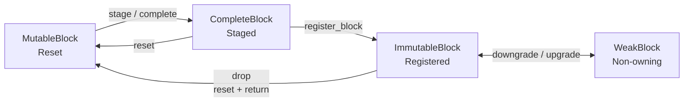
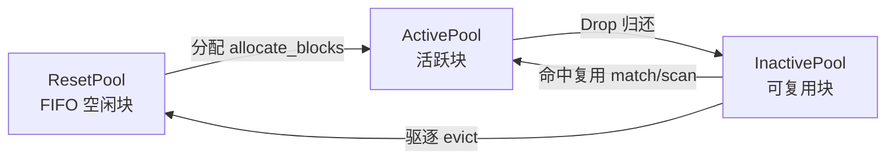

# KV Block Manager (KVBM) 深度解析

KV Block Manager (KVBM) 是 NVIDIA Dynamo 项目中的核心组件，负责在大语言模型（LLM）推理任务中高效管理 Key-Value (KV) Cache。本文将深入分析 KVBM 的功能特性、架构设计及核心源码实现。

## 1. 功能概述

KVBM 旨在解决异构和分布式环境下的内存管理挑战，作为 vLLM 和 TensorRT-LLM 等推理框架的统一内存层。其主要功能包括：

- **统一内存 API (Unified Memory API)**：提供跨越 GPU 显存 (HBM)、主机内存 (Pinned Host Memory)、本地 SSD 及远程存储的统一访问接口。
- **分层存储管理 (Storage Tiering)**：支持 G1 (Device/GPU), G2 (Host/CPU), G3 (Disk/NVMe), G4 (Remote) 多级存储层级，并支持基于策略的动态数据迁移。
- **块生命周期管理 (Block Lifecycle)**：通过严格的状态机管理 KV Block 的分配、填充、注册、共享及回收，确保内存安全和高效复用。
- **NIXL 集成 (NIXL Integration)**：利用 NVIDIA Inference Transfer Library (NIXL) 实现高性能的数据传输（如 GPU Direct Storage, RDMA），优化跨层级和跨节点的数据移动。

---

## 2. 架构设计

KVBM 的架构设计遵循分层解耦的原则。本节将从核心组件、数据流转和状态机设计三个维度进行解析。

### 2.1 核心组件

KVBM 的整体架构在逻辑上主要分为三层：

1. **LLM Inference Runtime Layer**: 顶层接口，通过 Connector 与 vLLM 或 TensorRT-LLM 集成，将推理运行时的请求转换为 KVBM 的块操作。
2. **KVBM Logic Layer**: 核心逻辑层，负责块的逻辑管理。分为两个子层：
   - **kvbm-logical**（纯逻辑层，单泛型参数 `T: BlockMetadata`）：
     - **BlockManager**: 编排块生命周期，内部管理三级 Pool（ResetPool / ActivePool / InactivePool）和 BlockRegistry。
     - **BlockRegistry**: 基于 `PositionalRadixTree` 的全局索引，支持序列前缀匹配、块去重和可选的 TinyLFU 频率追踪。
     - **InactivePool**: 支持可插拔的驱逐后端（HashMap / LRU / MultiLRU / Lineage）。
   - **lib/llm**（运行时集成层，三泛型参数 `S: Storage, L: LocalityProvider, M: BlockMetadata`）：
     - **KvBlockManager**: 对外暴露的 Facade，封装 `KvBlockManagerState`。
     - **ManagedBlockPool**: 管理特定存储介质（GPU、CPU、Disk）的块池，处理块的分配和回收。
     - **OffloadManager**: 负责异步的数据传输任务，处理 Offload (Device -> Host/Disk) 和 Onboard (Disk/Host -> Device) 请求。
3. **NIXL Layer**: 底层传输与存储抽象层，处理实际的内存拷贝和 I/O 操作。

### 2.2 数据流转

KVBM 的数据流转机制是其实现分层存储的核心。通过 `OffloadManager` 组件，KVBM 支持在不同存储介质之间高效、异步地迁移数据。

#### 2.2.1 Offload (卸载) 流程

当 GPU 显存 (G1) 不足，或者某些 KV Block 变为非活跃状态（例如长文本对话中的历史上下文）时，KVBM 会触发 Offload 操作。

- **触发条件**: 当 Block 通过 `ManagedBlockPool::register_blocks` 注册时，会自动发送到 OffloadManager 进行迁移调度。此外，显存水位预警和主动释放策略也可触发卸载。
- **传输路径**:
  - **Device -> Host (G1 -> G2)**: 将数据从 GPU 显存拷贝到 CPU Pinned Memory。这是最常见的路径，利用 PCIe 带宽，延迟较低。
  - **Device -> Disk (G1 -> G3)**: 支持 Bypass CPU Memory，直接通过 GDS (GPU Direct Storage) 或系统 I/O 将数据写入本地 NVMe SSD。这在 CPU 内存受限时非常有用。
  - **CPU 内存旁路 (CPU Memory Bypass)**: 通过配置 `bypass_cpu_mem` 选项，可以启用直接从 G1 到 G3 的传输路径，绕过 G2 层级，减少数据传输步骤。
- **优先级管理**: Offload 任务并非先进先出，而是基于优先级队列管理。系统会优先卸载那些“最不可能近期被访问”的 Block，或者为了腾出空间给高优先级请求而进行的紧急卸载。

#### 2.2.2 Onboard (加载) 流程

当推理请求命中已被卸载到 G2 或 G3 的 KV Block 时（Cache Hit），系统需要将其重新加载到 GPU 显存中。

- **触发机制**: 在 Cache 命中检查阶段，如果发现 Block 在 Host 或 Disk 上，则生成 Onboard 请求。
- **异步流水线**: Onboard 操作通常与 GPU 计算重叠 (Overlap)。在 Prefill 或 Decode 阶段开始前，KVBM 预先启动数据传输，掩盖 PCIe/NVMe 的延迟。
- **路径**:
  - **Host -> Device (G2 -> G1)**: 从 CPU 内存加载。
  - **Disk -> Device (G3 -> G1)**: 从 SSD 加载，同样支持 GDS 加速。

### 2.3 状态机设计

KVBM 利用 Rust 强大的类型系统（Type State Pattern）构建了严格的块生命周期状态机。这种设计在编译期强制执行了正确的状态流转，杜绝了未初始化读取、重复释放或并发读写冲突等常见内存错误。

**状态机总览**：



主要状态及流转过程如下：

1. **MutableBlock (Reset 状态)**
   - **描述**: 通过 `BlockManager::allocate_blocks` 分配出的初始状态，优先从 Reset Pool 获取，不足时驱逐 Inactive Pool 中的块来补充。此时 Block 拥有独占的可变访问权限。
   - **操作**: 用于填充新的 KV 数据。
   - **流转**: 数据填充完毕后，通过 `stage()` 方法（传入预计算的 Sequence Hash）或 `complete()` 方法（从 `TokenBlock` 中提取 Hash）流转为 `CompleteBlock`。如果操作被丢弃，自动归还至 Reset Pool。

2. **CompleteBlock (Staged 状态)**
   - **描述**: 数据已就绪，Hash 已计算，但尚未对其他 Sequence 可见。
   - **操作**: 准备注册到全局索引。
   - **流转**: 通过 `BlockManager::register_block` 注册到全局索引中，流转为 `ImmutableBlock`。或者调用 `reset()` 回退为 `MutableBlock`。

3. **ImmutableBlock (Registered 状态)**
   - **描述**: 已注册的共享状态。Block 变为只读，且通过 `Arc` 引用计数被多个 Sequence (如 Beam Search 中的不同分支) 安全共享。
   - **操作**: 此时 Block 可能会被 `OffloadManager` 异步迁移到 Host 或 Disk。
   - **流转**: 可以通过 `downgrade()` 转换为 `WeakBlock`，也可以直接从注册表中获取。当所有强引用被 Drop 时，底层 Block 会先被归还至 Inactive Pool（可被复用或驱逐）；当从 Inactive Pool 被驱逐时，最终 reset 并归还至 Reset Pool。

4. **WeakBlock (非拥有引用)**
   - **描述**: 非拥有权的弱引用状态。它不阻止 Block 被 Evictor (如 LRU 策略) 回收。
   - **操作**: 用于实现缓存命中 (`Cache Hit`) 逻辑。
   - **流转**: 如果再次被访问且未被驱逐，可通过 `upgrade()` 转换回 `ImmutableBlock`（支持快速路径直接升级和慢速路径通过 `BlockRegistry` 查找两种策略）；若升级失败，说明该块已被驱逐，底层资源已被回收至 Reset Pool。

---

## 3. 源码解析

以下基于 `lib/llm` 和 `lib/kvbm-logical` 目录下的核心代码进行解析。

### 3.1 代码结构 (Code Structure)

KVBM 的代码主要分布在 `lib/llm`（运行时集成）和 `lib/kvbm-logical`（逻辑管理）等模块中。下表列出了关键源码文件的路径及其职责说明：

| 路径                                                                              | 描述                                                                                                                                     |
| :-------------------------------------------------------------------------------- | :--------------------------------------------------------------------------------------------------------------------------------------- |
| [`lib/llm/src/block_manager.rs`](../lib/llm/src/block_manager.rs)                 | 定义了 `KvBlockManager` 入口结构体。                                                                                                     |
| [`lib/llm/src/block_manager/state.rs`](../lib/llm/src/block_manager/state.rs)     | 实现了 `KvBlockManagerState`，管理各级 BlockPool 和 OffloadManager。                                                                     |
| [`lib/llm/src/block_manager/pool/`](../lib/llm/src/block_manager/pool/)           | 实现了通用的 `ManagedBlockPool`，处理块的分配与回收逻辑。                                                                                |
| [`lib/llm/src/block_manager/offload.rs`](../lib/llm/src/block_manager/offload.rs) | 实现了 `OffloadManager`，负责异步的数据传输任务。                                                                                        |
| [`lib/kvbm-logical/src/blocks/`](../lib/kvbm-logical/src/blocks/)                 | 定义了状态机类型 (`MutableBlock`, `CompleteBlock`, `ImmutableBlock`, `WeakBlock`) 及内部 RAII Guard (`PrimaryBlock`, `DuplicateBlock`)。 |
| [`lib/kvbm-logical/src/manager/`](../lib/kvbm-logical/src/manager/)               | 实现了 kvbm-logical 层的 `BlockManager`，编排三级 Pool 与 BlockRegistry。                                                                |
| [`lib/kvbm-logical/src/registry/`](../lib/kvbm-logical/src/registry/)             | 实现了 `BlockRegistry`，基于 `PositionalRadixTree` 的全局索引与去重。                                                                    |
| [`lib/kvbm-logical/src/pools/`](../lib/kvbm-logical/src/pools/)                   | 实现了三级 Pool（ResetPool / ActivePool / InactivePool）及可插拔驱逐后端。                                                               |
| [`lib/kvbm-logical/src/tinylfu.rs`](../lib/kvbm-logical/src/tinylfu.rs)           | Count-Min Sketch 频率追踪器，为 MultiLRU 驱逐策略提供访问频率数据。                                                                      |

### 3.2 核心数据结构

KVBM 的数据结构设计体现了其对内存安全和并发性能的追求。以下是系统中几个最核心的数据结构及其相互关系：

#### 3.2.1 KvBlockManager & KvBlockManagerState

`KvBlockManager` 是 KVBM 对外暴露的顶级入口，它封装了内部复杂的管理状态，通过 `Arc` 指针持有 `KvBlockManagerState`，确保了跨线程的安全访问。

`KvBlockManagerState` 则是系统的大脑，它集中管理了所有存储层级的 Block Pool（Device, Host, Disk）以及负责数据调度的 Offload Manager。

```rust
// lib/llm/src/block_manager.rs

#[derive(Debug)]
pub struct KvBlockManager<Locality: LocalityProvider, Metadata: BlockMetadata> {
    // 内部状态管理器，使用 Arc 实现线程安全共享
    state: Arc<state::KvBlockManagerState<Locality, Metadata>>,
    // 用于优雅停机的取消令牌
    _cancellation_token: Arc<CancelOnLastDrop>,
    block_size: usize,
}

// lib/llm/src/block_manager/state.rs

#[allow(dead_code)]
pub struct KvBlockManagerState<Locality: LocalityProvider, Metadata: BlockMetadata> {
    resources: Arc<Resources>,
    // 各层级的块池，使用 Option 管理，因为某些层级可能未启用（如 Disk）
    disk_pool: Option<Arc<dyn BlockPool<DiskStorage, Locality, Metadata>>>,
    host_pool: Option<Arc<dyn BlockPool<PinnedStorage, Locality, Metadata>>>,
    device_pool: Option<Arc<dyn BlockPool<DeviceStorage, Locality, Metadata>>>,
    // 负责异步数据迁移（Offload/Onboard）的核心组件
    offload_manager: Arc<OffloadManager<Locality, Metadata>>,
    // ...
}
```

#### 3.2.2 ManagedBlockPool

`ManagedBlockPool` 是 lib/llm 层所有 Block Pool 的通用实现模板。它并不直接管理物理内存，而是封装了底层 kvbm-logical 的 `BlockManager`，通过异步消息通道将分配/注册等请求转发给逻辑层处理。

- **ActiveBlockPool**: 追踪当前正在被 Inference 任务使用的 Block。
- **InactiveBlockPool**: 管理空闲或可被复用的 Block，通常配合 LRU 策略进行回收。

```rust
// lib/llm/src/block_manager/pool/managed.rs

pub struct ManagedBlockPool<S: Storage, L: LocalityProvider, M: BlockMetadata> {
    // 异步消息通道，用于处理高优先级的操作请求（如分配、注册）
    priority_tx: tokio::sync::mpsc::UnboundedSender<PriorityRequest<S, L, M>>,
    // 控制平面通道，用于状态查询和重置等低频操作
    ctrl_tx: tokio::sync::mpsc::UnboundedSender<ControlRequest<S, L, M>>,
    // 实时监控指标：可用块数量
    available_blocks_counter: Arc<AtomicU64>,
    // 实时监控指标：总块数量
    total_blocks_counter: Arc<AtomicU64>,
    // 默认的去重策略
    default_duplication_setting: BlockRegistrationDuplicationSetting,
    // ...
}
```

#### 3.2.3 OffloadManager 与 TransferManager

`OffloadManager` 是数据流转的调度中心，负责管理不同存储层级之间的数据传输。它内部使用通用的 `LocalTransferManager<Source, Target, Locality, Metadata>` 结合 `TransferBatcher` 来处理具体的数据迁移任务。通过泛型参数指定不同的 Source/Target 存储类型，同一个 `LocalTransferManager` 可以处理以下所有路径：

- **Device -> Host**: 使用 CUDA API 实现 GPU 显存到 CPU 内存的异步拷贝。
- **Host -> Disk**: 通过 NIXL Agent 实现 CPU 内存到 NVMe SSD 的写入，支持 POSIX I/O。
- **Device -> Disk (直连)**: 当启用 `bypass_cpu_mem` 时，直接从 GPU 到 Disk 的传输路径，支持 GDS 加速。

`OffloadManager` 维护了针对不同目标的优先级队列（`device_offload_tx`、`host_offload_tx`、`device_to_disk_offload_tx`），确保关键路径的数据迁移（如 GPU 显存释放）能够被优先处理。底层通过 `LocalTransferManager` 调用 NIXL Agent 执行实际的数据拷贝操作。

```rust
// lib/src/block_manager/offload.rs/llm

pub struct OffloadManager<Locality: LocalityProvider, Metadata: BlockMetadata> {
    // 持有各层级 Pool 的引用，以便在迁移完成后更新 Block 状态
    disk: Option<Arc<dyn BlockPool<DiskStorage, Locality, Metadata>>>,
    host: Option<Arc<dyn BlockPool<PinnedStorage, Locality, Metadata>>>,
    device: Option<Arc<dyn BlockPool<DeviceStorage, Locality, Metadata>>>,

    // Device -> Offload 目标（Host/Disk）的请求队列
    device_offload_tx: mpsc::UnboundedSender<OffloadRequest<DeviceStorage, Locality, Metadata>>,
    // Host -> Offload 目标（Disk）的请求队列
    host_offload_tx: mpsc::UnboundedSender<OffloadRequest<PinnedStorage, Locality, Metadata>>,
    // Device -> Disk 直连 Offload 请求队列 (Bypass CPU)
    device_to_disk_offload_tx: mpsc::UnboundedSender<OffloadRequest<DeviceStorage, Locality, Metadata>>,
    // ...
}
```

#### 3.2.4 BlockRegistry 与 PositionalRadixTree

`BlockRegistry` 是 KVBM 的全局索引中心，负责块的去重和序列哈希查找。它使用 `PositionalRadixTree<Weak<BlockRegistrationHandleInner>>` 作为底层数据结构，天然支持 LLM 场景中的序列前缀复用。

核心设计特点：

- **弱引用自清理**: 树中存储的是 `Weak<BlockRegistrationHandleInner>`，不会阻止块被回收。当 Handle 的所有强引用被 Drop 时，`BlockRegistrationHandleInner::Drop` 自动从树中移除对应条目，无需后台 GC。
- **Typed Attachment 系统**: 每个 Handle 携带一个 `AttachmentStore`，支持挂载任意类型的元数据（如 Presence Marker、WeakBlockEntry）。这使得跨 Pool 的块状态共享无需修改 Handle 结构体本身。
- **TinyLFU 频率追踪**: 可选集成 Count-Min Sketch 频率追踪器（4 个哈希函数，4-bit 计数器，可配置衰减策略）。每次注册和查找时自动更新频率计数，为 MultiLRU 驱逐后端提供决策依据。

```rust
// lib/kvbm-logical/src/registry/mod.rs

pub struct BlockRegistry {
    // 基于 PositionalRadixTree 的序列哈希索引，支持前缀匹配
    prt: Arc<PositionalRadixTree<Weak<BlockRegistrationHandleInner>>>,
    // 可选的 TinyLFU 频率追踪器
    frequency_tracker: Option<Arc<dyn FrequencyTracker<u128>>>,
    // 可选的事件管理器（用于块注册/变更通知）
    events_manager: Option<EventsManager>,
}

// 注册序列哈希：若已存在则返回既有 Handle，否则创建新的
// 内部自动触发 TinyLFU 频率更新
pub fn register_sequence_hash(&self, seq_hash: SequenceHash)
    -> BlockRegistrationHandle

// 前缀匹配查找：利用 Radix Tree 高效定位已注册的序列
pub fn match_sequence_hash(&self, seq_hash: SequenceHash, touch: bool)
    -> Option<BlockRegistrationHandle>
```

#### 3.2.5 kvbm-logical 三级 Pool 与可插拔驱逐后端

kvbm-logical 层的 `BlockManager` 内部管理三个独立的 Pool，形成一个完整的块生命周期循环：



- **ResetPool**: FIFO 队列，存储空闲的 `Block<T, Reset>`。支持可插拔的 `BlockAllocator` 接口，默认使用 `VecDeque`。
- **ActivePool**: 轻量封装，通过 `BlockRegistry` 的弱引用追踪当前活跃块。提供 `find_matches`（前缀匹配，首次未命中即停止）和 `scan_matches`（全量扫描，不停止）两种查找策略。
- **InactivePool**: 存储已注册但无活跃引用的块，可被复用或驱逐。核心亮点是**可插拔的驱逐后端**：

| 后端         | 驱逐策略                                                                 | 适用场景       |
| ------------ | ------------------------------------------------------------------------ | -------------- |
| **HashMap**  | 通过可插拔的 `ReusePolicy` 决定驱逐顺序                                  | 自定义策略     |
| **LRU**      | 经典最近最少使用                                                         | 简单通用场景   |
| **MultiLRU** | 4 级频率分层 (Cold/Warm/Hot/Very Hot)，结合 TinyLFU 追踪，优先驱逐最冷层 | 频率敏感的负载 |
| **Lineage**  | 基于序列哈希血缘关系的驱逐                                               | 前缀复用场景   |

后端通过 `BlockManager::builder()` 在构建时选择：

```rust
// lib/kvbm-logical/src/manager/builder.rs

let manager = BlockManager::builder()
    .block_count(1000)
    .registry(registry)
    .with_multi_lru_backend()  // 或 .with_lru_backend(), .with_lineage_backend() 等
    .build()?;
```

### 3.3 关键流程

KVBM 的运行时行为依赖于几个关键的流程控制。本节将详细分析块生命周期的流转逻辑以及数据的异步迁移机制。

#### 3.3.1 块生命周期流转

KVBM 的核心亮点之一是其类型安全的生命周期管理。代码中通过 `MutableBlock` (Reset 状态) -> `CompleteBlock` (Staged 状态) -> `ImmutableBlock` (Registered 状态) 的类型转换，强制开发者遵循正确的操作顺序。通过 `downgrade()` 和 `upgrade()` 方法，还支持 `ImmutableBlock` 与 `WeakBlock` 之间的双向转换。

```rust
// === 阶段 1: 写入完成 (Write Completion) ===
// 来源: lib/kvbm-logical/src/blocks/mutable.rs
// 将 MutableBlock 转换为 CompleteBlock (Staged 状态)
// stage() 接受预计算的 SequenceHash；complete() 从 TokenBlock 中提取 Hash
impl<T: BlockMetadata> MutableBlock<T> {
    // 直接指定 SequenceHash，需同时传入 block_size 做校验
    pub fn stage(self, seq_hash: SequenceHash, block_size: usize)
        -> Result<CompleteBlock<T>, BlockError<MutableBlock<T>>>
    // 从 TokenBlock 中提取 SequenceHash，自动校验大小
    pub fn complete(self, token_block: &TokenBlock)
        -> Result<CompleteBlock<T>, BlockError<MutableBlock<T>>>
}

// === 阶段 2: 注册 (Registration) ===
// 来源 (kvbm-logical 层): lib/kvbm-logical/src/manager/mod.rs
// 来源 (lib/llm 层): lib/llm/src/block_manager/pool/managed.rs
// 将 Staged 状态的 Block 注册到全局索引中，转换为 ImmutableBlock (Registered 状态)
// 此时 Block 变为只读，可以安全地在多个 Request 之间共享
//
// kvbm-logical 层通过 BlockManager::register_block 完成单块注册
// lib/llm 层通过 BlockPool trait 的 register_blocks 完成批量注册
impl<S, L, M> BlockPool<S, L, M> {
    async fn register_blocks(&self, blocks: Vec<MutableBlock<S, L, M>>)
        -> Result<Vec<ImmutableBlock<S, L, M>>, BlockPoolError>
}

// === 阶段 3: 弱引用转换 ===
// 来源: lib/kvbm-logical/src/blocks/immutable.rs
// 将 ImmutableBlock 转换为 WeakBlock，不阻止块被回收
impl<T: BlockMetadata> ImmutableBlock<T> {
    pub fn downgrade(&self) -> WeakBlock<T>
}

// === 阶段 4: 弱引用升级 ===
// 来源: lib/kvbm-logical/src/blocks/immutable.rs
// 将 WeakBlock 转换回 ImmutableBlock，如果块仍然存在
impl<T: BlockMetadata> WeakBlock<T> {
    pub fn upgrade(&self) -> Option<ImmutableBlock<T>>
}
```

#### 3.3.2 异步卸载与加载

数据的迁移不是同步阻塞的，而是通过 `enqueue_offload_block` 提交任务。这种设计允许推理计算与数据传输并行执行 (Compute-Copy Overlap)，从而掩盖 IO 延迟。

```rust
// lib/llm/src/block_manager/state.rs

impl<Locality: LocalityProvider, Metadata: BlockMetadata> KvBlockManagerState<Locality, Metadata> {
    // 异步提交 Offload 任务
    // priority 参数决定了该 Block 在队列中的处理顺序，通常基于 LRU 或访问频率计算
    pub(crate) async fn enqueue_offload_block<S: Storage + 'static>(
        &self,
        block: &ImmutableBlock<S, Locality, Metadata>,
        priority: u64,
    ) -> Result<()> {
        // 将任务推送到 OffloadManager 的队列中，立即返回
        self.offload_manager.offload(block, priority).await?;
        Ok(())
    }
}
```

#### 3.3.3 块去重与竞态处理

在并发场景下，多个请求可能同时产生相同内容的 Block。KVBM 通过 **PrimaryBlock / DuplicateBlock 去重机制** 和 **WeakBlockEntry 竞态处理** 确保内存效率和正确性。

当注册时发现相同 `SequenceHash` 的 Block 已存在，系统根据 `BlockDuplicationPolicy` 决定行为：

- **Allow**: 创建 `DuplicateBlock`，与已有的 `PrimaryBlock` 共存。`DuplicateBlock` Drop 时直接 reset 并归还 ResetPool（释放物理内存），而不进入 InactivePool。
- **Reject**: 直接复用已有 Block，新 Block 被 reset 归还 ResetPool，实现零冗余去重。

这一设计确保只有全局唯一的 PrimaryBlock 会进入 InactivePool 被复用，避免了重复数据占用缓存空间。

```rust
// lib/kvbm-logical/src/registry/registration.rs

// PrimaryBlock Drop → 归还 InactivePool（可复用）
// DuplicateBlock Drop → reset + 归还 ResetPool（释放资源）
fn register_block_inner<T: BlockMetadata + Sync>(
    handle: &BlockRegistrationHandle,
    block: Block<T, Staged>,
    // ...
) -> Arc<dyn RegisteredBlock<T>> {
    // 先检查是否已存在相同哈希的 Block
    if let Some(existing) = try_find_existing_block(handle, inactive_pool, &attachments) {
        match duplication_policy {
            Allow => DuplicateBlock::new(block.register(), existing, reset_fn),
            Reject => { reset_fn(block.reset()); existing }
        }
    } else {
        PrimaryBlock::new_attached(Arc::new(block.register()), pool_fn)
    }
}
```

在 Pool 转换窗口期（如 PrimaryBlock Drop 中、正从 ActivePool 转入 InactivePool），Block 可能短暂不在任何 Pool 中。系统通过以下策略处理：

- **双弱引用探测**: `WeakBlockEntry` 同时持有 `Weak<Block<T, Registered>>`（原始块）和 `Weak<PrimaryBlock<T>>`（主要块）。先尝试 `primary_block.upgrade()`（快速路径），失败时再尝试 `raw_block.upgrade()`（慢速路径，重建 PrimaryBlock）。
- **Presence Marker 快速排除**: 每个类型 `T` 在 Handle 上有对应的 Presence Marker，记录“是否曾有该类型的 Block 注册”。没有 Marker 则直接跳过检查，避免不必要的锁竞争。
- **有界重试**: 当 Presence Marker 存在但块未找到时，说明正在 Pool 转换中。系统通过 `spin_loop` + `MAX_RETRIES`（100 次）等待转换完成，超过限制则放弃并记录警告。

---

## 4. 与 LMCache 的关系

Dynamo 平台支持多种 KV Cache 管理后端，其中包括 KVBM 和 LMCache。

### 4.1 集成关系

KVBM 和 LMCache 在 Dynamo 的 vLLM 后端中通过统一的连接器框架进行集成，支持多种部署模式：

- **独立使用**: KVBM 和 LMCache 可以作为独立的 KV Cache 管理后端，通过 `--kv-transfer-config` 参数选择，**但同一 vLLM 实例只能激活一个主要的 KV 管理后端**：
  - KVBM: `{"kv_connector":"DynamoConnector","kv_role":"kv_both"}`
  - LMCache: `{"kv_connector":"LMCacheConnectorV1","kv_role":"kv_both"}`

  **注意**: 在独立使用模式下，KVBM 和 LMCache 是互斥的，不能同时激活。用户必须在启动时选择一个作为主要的后端。

- **PdConnector 混合模式**: Dynamo 提供 PdConnector 支持在分离式服务（PD Disaggregated Serving）中同时使用 KVBM/LMCache 和 NIXL 连接器：

  ```json
  {
    "kv_connector": "PdConnector",
    "kv_role": "kv_both",
    "kv_connector_extra_config": {
      "connectors": [
        { "kv_connector": "DynamoConnector", "kv_role": "kv_both" },
        { "kv_connector": "NixlConnector", "kv_role": "kv_both" }
      ]
    },
    "kv_connector_module_path": "kvbm.vllm_integration.connector"
  }
  ```

  在这种模式下，第一个连接器（KVBM 或 LMCache）负责本地的 KV 缓存管理，第二个连接器（NIXL）负责在 Prefill 和 Decode 节点之间传输 KV 数据。

  **PdConnector 工作机制**：
  - **严格顺序要求**: PdConnector 要求恰好配置两个连接器，第一个必须是 KVBM 或 LMCache，第二个必须是 NIXL
  - **角色分工**: Prefill 工作节点使用第一个连接器进行 KV 缓存的卸载和加载，Decode 工作节点使用第二个连接器从 Prefill 节点获取 KV 数据
  - **生命周期管理**: 每个连接器独立管理自己的 KV 块生命周期，通过统一的接口协调工作

- **运行时选择**: 用户通过 `--kv-transfer-config` 参数指定连接器配置，vLLM 在启动时根据配置实例化对应的连接器，运行时不可动态切换。

### 4.2 特性对比

| 特性         | KVBM (Dynamo Built-in)                                            | LMCache (Open Source Integration)                                    |
| :----------- | :---------------------------------------------------------------- | :------------------------------------------------------------------- |
| **定位**     | Dynamo 原生的高性能分层存储管理器                                 | 强调 "prefill-once, reuse-everywhere" 的缓存层                       |
| **层级管理** | G1 (GPU) <-> G2 (Host) <-> G3 (Disk) <-> G4 (Remote)              | GPU <-> CPU <-> Disk <-> Redis <-> GDS <-> Cloud                     |
| **核心优势** | 深度集成 NIXL，极致的单机/集群内 Tiering 性能，严格的生命周期安全 | 跨实例共享 (Shared Context)，支持 Redis 等分布式后端，适合长文本复用 |
| **适用场景** | 高性能推理，需要精细控制内存层级，追求低 TTFT 和高吞吐            | RAG，多轮对话，需要跨不同推理实例共享 KV Cache 的场景                |

---

## 5. 总结

KVBM 通过精巧的架构设计，实现了高性能、可扩展的 KV Cache 管理。其核心优势在于：

1. **安全性**：利用 Rust Type State Pattern 和 RAII Guard 保证了块生命周期的编译期正确性。
2. **灵活性**：可插拔的驱逐后端、分层的逻辑/运行时架构，以及统一的存储接口支持多种存储后端和策略组合。
3. **高性能**：集成了 NIXL 和异步传输机制，最大化了异构硬件的带宽利用率；TinyLFU + MultiLRU 频率感知驱逐提升了缓存命中率。
4. **并发安全**：PrimaryBlock/DuplicateBlock 去重、WeakBlockEntry 双弱引用探测和有界重试，确保了高并发下的正确性和内存效率。

这使得 Dynamo 能够在显存受限的情况下，通过利用 CPU 内存和 SSD 扩展上下文长度，支持更长的对话和更高的并发。
