# KV Cache 层级流水线并行

**层级流水线并行** (Layer-wise Pipelining) 是 LMCache 和 DualPath 等先进 LLM 推理系统为了解决 **KV Cache 存取延迟** 和 **显存容量限制** 而采用的核心优化机制。其核心思想是将 KV Cache 的加载/存储与 GPU 的模型层级计算进行 **并行化处理**，从而掩盖 I/O 延迟并最大化系统吞吐量。

本文基于 LMCache 源码解读文档 [1] 和 DeepSeek DualPath 论文 [2] 对该技术进行详细阐述。

## 1. 核心概念

层级流水线并行是一种 **计算与 I/O 重叠 (Computation-I/O Overlap)** 的策略，在长上下文推理场景中，它常被具体化为 **层级预填充 (Layerwise Prefill)** 技术。

### 1.1 背景与动机

在处理长上下文的预填充 (Prefill) 阶段时，GPU 的 HBM 容量往往会成为瓶颈。

- **传统方式**: 需要将整个批次 (Batch) 中所有层的激活值 (Activations) 和 KV Cache 都驻留在显存中。
- **导致后果**: 这限制了可以同时处理的批次大小，导致 GPU 计算单元无法被填满，**GPU 利用率低下**。

**层级流水线** 则利用了 LLM **逐层计算 (Layer-by-Layer Execution)** 的特性：

- 在 GPU 计算第 $i$ 层时，系统在后台 **同步加载** 第 $i+1$ 层的数据；
- 或者在后台 **异步持久化** 第 $i-1$ 层的数据。

下图展示了普通推理与层级流水线推理的时间线对比：

```mermaid
gantt
    dateFormat  s
    axisFormat  %S
    title 推理模式对比：串行 vs 层级流水线

    section 串行模式
    加载 Layer 0-N     :a1, 0, 5s
    计算 Layer 0-N     :a2, after a1, 5s
    存储 Layer 0-N     :a3, after a2, 5s

    section 层级流水线
    加载 Layer 0       :b1, 0, 1s
    计算 Layer 0       :b2, after b1, 1s
    加载 Layer 1       :b3, 1, 1s
    计算 Layer 1       :b4, after b2, 1s
    存储 Layer 0       :b5, after b2, 1s
    加载 Layer 2       :b6, 2, 1s
    计算 Layer 2       :b7, after b4, 1s
    存储 Layer 1       :b8, after b4, 1s
```



> **注**：在流水线模式中，"计算 Layer $i$" 的时间被用来掩盖 "加载 Layer $i+1$" 和 "存储 Layer $i-1$" 的 I/O 延迟。

---

## 2. 基本原理

层级流水线并行的实现依赖于 LLM 推理的计算局部性、硬件资源的解耦以及显存管理的优化。

1. **计算局部性 (Locality) 与 逐层分配**:
   在模型的前向传播中，**每一层仅需要其对应的层特定 KV Cache**。这意味着系统不需要在显存中同时保存所有层的 KV Cache。
   - **逐层分配与释放**: KV Cache 可以在处理到特定层时才分配，并在该层计算完成后立即释放。
   - **显存复用**: GPU 在每一时刻仅需要持有当前正在计算的那一层的前向批次 KV Cache，极大地降低了峰值显存需求。

2. **资源解耦 (Resource Decoupling)**:
   - 利用 GPU 的 **DMA 引擎** 进行显存与主机内存 (H2D/D2H) 的传输；
   - 利用 **存储网卡 (SNIC)** 进行主机与远程存储的 I/O；
   - 利用 **计算网卡 (CNIC)** (如 RDMA) 进行节点间传输。
     这些 I/O 操作可以与 GPU 的 Tensor Core 计算 **异步执行**，互不干扰。

3. **显存节省 (Memory Savings)**:
   通过逐层分配和释放 KV Cache 空间，显存只需持有当前正在计算的那一层 (或几层) 数据。这显著降低了显存占用，使得系统能够支持更大的 Batch Size (以 token 为单位，吞吐量提升约等于模型层数的倍数)，从而提高 GPU 计算单元的利用率。


### 2.1 层的生命周期 (Life Cycle of a Layer)

在流水线中，每一层的 KV Cache 都会经历以下标准生命周期：

1. **预分配 (Pre-allocate)**: 在推理开始前，在 CPU 内存中预留缓冲区。
2. **预取 (Prefetch)**: 在计算前 $k$ 步触发加载任务，数据从 L3/L4 存储流向 L1 CPU 内存。
3. **上传 (H2D)**: 在计算当前层前，通过 PCIe/NVLink 将数据上传至 GPU 显存。
4. **计算 (Compute)**: 参与 Attention 计算，生成新的 KV。
5. **卸载/释放 (Offload/Free)**:
   - 若需持久化，则通过 D2H 回传至 CPU 并写入存储。
   - 若仅为推理，计算完成后立即释放显存空间给后续层使用。

---

## 3. LMCache 中的工程实现

LMCache [1] 在集成到 vLLM 等引擎时，通过以下技术手段实现了这一机制，主要侧重于 **降低首字延迟 (TTFT)**。

### 3.1 生成器模式 (Generator Pattern)

LMCache 的存储和检索接口 (如 `store_layer` 和 `retrieve_layer`) 并不执行单一的阻塞操作，而是采用 Python 的 `yield` 机制构建流水线。

- **存储流程**: 将存储任务拆解为细粒度步骤嵌入在模型每一层的计算循环中：
  1. 初始化 (计算 Hash)；
  2. 等待上一层 D2H 完成；
  3. 启动当前层 D2H；
  4. 提交持久化任务。

- **检索流程**: 构建 **"生产者-消费者"** 模型。
  - **生产者**: 负责从后端 (L1-L4 存储) 读取数据；
  - **消费者**: GPU 连接器 (GPU Connector) 负责将数据拷贝至显存。

```python
# 伪代码示例：LMCache 的层级检索生成器
def retrieve_layer(self, tokens):
    # 启动阶段：预取第 0 层和第 1 层 (Prefetch-2 策略)
    prefetch(0); prefetch(1)

    for i in range(num_layers):
        # 消费者：等待第 i 层数据就绪 (可能已经在后台加载完毕)
        layer_data = wait_for_layer(i)

        # 生产者：触发第 i+2 层的预取 (保持流水线充盈)
        # 当前在计算 i，利用计算时间掩盖 i+2 的 I/O
        if i + 2 < num_layers:
            prefetch(i + 2)

        # 将第 i 层数据 yield 给计算引擎，进入计算阶段
        yield layer_data
```

### 3.2 预取策略 (Prefetching)

为了最大化重叠效果，LMCache 采用了 **"Prefetch-2"** 策略，即始终保持 **2 层** 的预取深度：

1. **启动阶段 (Warmup)**: 在开始计算前，立即触发 **第 0 层** 和 **第 1 层** 的加载任务。这是为了防止流水线初期出现 "气泡" (Bubble)。
2. **掩盖延迟 (Overlap)**:
   - 当 GPU 开始计算 **Layer 0** 时，I/O 系统已经在后台加载 **Layer 2**。
   - 理想情况下，计算 Layer $i$ 的时间 $T_{comp}$ 应大于或等于加载 Layer $i+2$ 的时间 $T_{io}$。
3. **流式协调 (Synchronization)**: 后续通过 `wait_for_layer_load` 在每一层计算前进行流式协调，确保数据就绪。如果 $T_{io} > T_{comp}$，则流水线会发生阻塞 (Stall)。

### 3.3 显存与内存管理

为了确保流水线在数据传输过程中不会因为频繁的内存分配而抖动，LMCache 实施了严格的内存管理策略：

- **全局预分配 (Global Pre-allocation)**: 在流水线启动前，LMCache 会一次性预分配所有层所需的 CPU 内存 (`MemoryObj`)，避免在推理关键路径上因频繁申请内存导致抖动。
- **同位置约束 (Same-location Constraint)**: 为了保证流水线的稳定性，系统强制要求同一 Key 的所有层级数据必须存储在同一个后端位置 (如都在磁盘或都在远程)，不支持跨介质碎片化存储。这简化了预取逻辑，避免了多源数据合并带来的复杂性。

---

## 4. DualPath 中的演进

DualPath [2] 将层级流水线并行从 **单机 I/O 优化** 扩展到了 **集群级带宽调度**，并针对分布式场景下的**数据碎裂**与**流量竞争**问题进行了深度优化。

### 4.1 核心问题：存储 I/O 瓶颈与数据碎裂

- **存储带宽瓶颈**: 在长上下文场景中，Prefill 阶段的 KV Cache 加载导致 Prefill 节点的存储网卡 (SNIC) 饱和。
- **数据碎裂**: 层级执行会将 KV Cache 切分为大量细粒度的块 (fine-grained blocks)，这可能带来传输和存储管理上的挑战。

### 4.2 双路径加载 (Dual-Path Loading)

为了平衡存储 I/O 压力，DualPath 引入了第二条加载路径，利用空闲的 Decode 节点带宽来辅助加载数据。两条路径的对比如下：

| 特性         | **PE Read Path** (传统路径)                          | **DE Read Path** (新增路径)                              |
| :----------- | :--------------------------------------------------- | :------------------------------------------------------- |
| **数据流向** | Storage $\rightarrow$ PE Buffer $\rightarrow$ PE HBM | Storage $\rightarrow$ **DE Buffer** $\rightarrow$ PE HBM |
| **涉及网卡** | Prefill 节点 SNIC                                    | **Decode 节点 SNIC** + 计算网络 (RDMA)                   |
| **瓶颈资源** | Prefill 节点存储带宽                                 | Decode 节点存储带宽 + 节点间 RDMA 带宽                   |
| **适用场景** | 标准加载，小 Batch 或低负载                          | 高负载、长上下文，Prefill 节点 I/O 饱和时                |

### 4.3 块布局优化 (Block Layout Optimization)

为了兼顾存储效率和传输效率，DualPath 设计了两种块布局：

1. **Full Block (全块)**: 包含所有层的数据。用于分布式存储交互，减少元数据开销。
2. **Layer Block (层块)**: 仅包含单层的数据。用于层级流式加载到显存中，支持细粒度的流水线执行。

### 4.4 流量隔离 (Traffic Isolation)

由于层级加载引入了复杂的计算网络流量，DualPath 采用以下技术确保 KV Cache 的搬运不会干扰对延迟敏感的模型推理通信：

- **CNIC 中心化管理**: 采用 **计算网卡 (CNIC)** 进行中心化流量调度。
- **虚拟信道 (VL)**: 利用 RDMA 的 Virtual Lanes 技术进行优先级划分，确保关键通信路径的低延迟。

---

## 5. 挑战与局限性

尽管层级流水线并行带来了显著的性能提升，但在实际工程落地中也面临诸多挑战：

1. **同步开销 (Synchronization Overhead)**:
   流水线需要精细的同步机制 (如 CUDA Events, Python AsyncIO)。过多的同步点可能会引入 CPU 开销，抵消部分重叠带来的收益。

2. **网络抖动 (Network Jitter)**:
   在依赖远程存储 (L4) 或 DualPath 跨节点传输时，网络延迟的波动可能导致流水线 "气泡" (Bubble)。一旦 I/O 延迟超过计算时间，GPU 就必须空转等待数据。

3. **显存碎片 (Memory Fragmentation)**:
   频繁的逐层分配和释放显存容易导致显存碎片。解决方案通常是使用预分配的内存池 (Memory Pool) 或 PyTorch 的 Caching Allocator。

4. **复杂性 (Complexity)**:
   将原本简单的串行加载逻辑重构为异步流水线，极大地增加了代码的复杂度和调试难度，特别是在处理异常 (如 I/O 失败) 和状态回滚时。

---

## 6. 性能收益

通过层级流水线并行及相关的架构优化，系统获得了显著的性能提升：

1. **降低首字延迟 (TTFT)**: LMCache 通过 I/O 与计算的重叠，消除了显式的数据加载等待时间。
2. **提升吞吐量**:
   - **显存效率**: 逐层加载释放了显存压力，允许更大的 Batch Size (有效批次大小提升约等于模型层数的倍数)。
   - **带宽利用率**: DualPath 通过聚合集群内所有节点的存储带宽，解决了单节点 I/O 瓶颈。
3. **实测数据**:
   - **JCT 优化**: 在 DualPath 系统中引入层级预填充后，平均可将作业完成时间 (JCT) 减少约 **17.21%**。
   - **整体提升**: 在智能体 (Agentic) 等高缓存命中率场景下，DualPath 配合该技术将端到端吞吐量提升了高达 **1.87 倍** (离线推理) 和 **1.96 倍** (在线服务) [2]。

## 7. 总结

层级流水线并行是一项从硬件底层出发、深入推理引擎内部的系统级优化技术。

- **核心价值**: 它将原本串行的 "I/O 等待" 时间转化为有效的 "计算重叠" 时间，打破了存储带宽与计算延迟之间的硬性耦合。
- **演进路径**: 从 LMCache 的单机显存优化，到 DualPath 的集群级带宽调度，该技术展示了在不同规模下解决 KV Cache 瓶颈的通用性。
- **未来展望**: 随着大模型上下文长度的持续增长 (如 1M+ Context)，层级流水线将成为未来推理系统的标配，并可能进一步结合预测性预取 (Speculative Prefetching) 和异构存储分层，以应对更极端的性能挑战。

## 8. 参考文献

1. LMCache Documentation: [LMCache 架构概览](lmcache/lmcache_overview.md), [LMCacheEngine 核心引擎代码分析](lmcache/lmcache_engine.md).
2. DualPath Paper: _DualPath: Rethinking KV Cache Loading for Agentic LLM Inference_ (arXiv:2602.21548v2).
