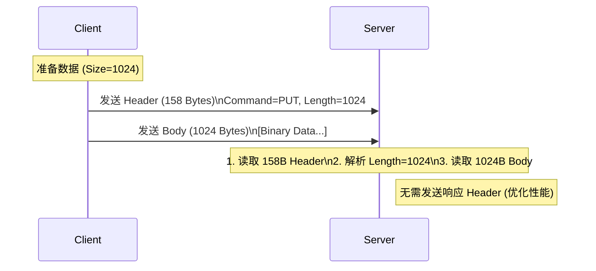

# LMCache Server 源码分析

[< 返回架构概览](./lmcache_overview.md)

**LMCache Server** 是 LMCache 项目自带的一个轻量级、高性能的远程 KV 存储服务。它设计用于在没有部署 Redis 或 Mooncake 等复杂分布式存储系统的环境中，快速提供跨实例的 KV Cache 共享能力。

> **核心定位**: 它是 "**集中式共享** (Centralized Sharing)" 模式下的默认数据平面 (Data Plane) 组件，与 LMCache Client 通过自定义的 TCP 协议进行通信。

代码主要位于 `lmcache/v1/server/` 目录下。

---

## 1. 架构与组件

LMCache Server 采用经典的 **多线程阻塞 I/O (Threaded Blocking I/O)** 模型，包含如下核心组件：

1. **LMCacheServer (`__main__.py`)**

   - **角色**: 服务端入口与连接管理器。
   - **职责**: 监听 TCP 端口，接受客户端连接，并为每个连接创建一个独立的线程 (`threading.Thread`) 进行处理。
   - **设计**: 这种 Thread-per-Client 模型在客户端数量较少（数百个）时表现良好，且代码逻辑简单清晰。

2. **LMSBackendInterface (`server_storage_backend/abstract_backend.py`)**

   - **角色**: 存储后端抽象层。
   - **职责**: 定义了标准的存储接口 (`put`, `get`, `contains`, `list_keys`, `close`)，使得底层存储实现与网络层解耦。

3. **具体存储实现**

   - **LMSLocalBackend (`server_storage_backend/local_backend.py`)**: 基于内存的存储实现，使用 Python 的 `OrderedDict` 存储数据。
   - **LMSLocalDiskBackend (`server_storage_backend/local_backend.py`)**: 基于磁盘的存储实现，数据持久化到文件系统，内存中仅维护元数据。

4. **通信协议 (`protocol.py`)**

   - 定义了客户端和服务端交互的二进制消息格式，包括 `ClientMetaMessage` 和 `ServerMetaMessage`。

---

## 2. 通信协议

LMCache Server 使用一套紧凑的自定义二进制协议，代码定义位于 [`lmcache/v1/protocol.py`](../lmcache/v1/protocol.py)。

### 2.1 协议设计 (Protocol)

该协议的核心设计思想是 **"定长 Header + 变长 Body"**。这种设计允许接收端先读取固定长度的元数据（包含 Body 长度），再精确读取后续的数据载荷，从而有效解决了 TCP 粘包问题并支持零拷贝读取。

协议主要包含两种消息类型：客户端发起的请求消息 (`ClientMetaMessage`) 和服务端回复的响应消息 (`ServerMetaMessage`)。

#### 2.1.1 客户端请求消息 (ClientMetaMessage)

所有客户端请求都以一个固定的 **158 字节** 的 Header 开始。

- **总长度**: 158 Bytes
- **格式字符串**: `ii150s` (对应 `struct.pack`)

| 偏移 (Offset) | 长度 (Bytes) | 字段名    | 类型      | 说明                                                                        |
| :------------ | :----------- | :-------- | :-------- | :-------------------------------------------------------------------------- |
| 0             | 4            | `command` | int32     | 指令类型 (1=PUT, 2=GET, 3=EXIST, 4=LIST)                                    |
| 4             | 4            | `length`  | int32     | 后续 Body (数据载荷) 的字节长度。对于无 Payload 的请求 (如 GET)，此值为 0。 |
| 8             | 150          | `key`     | char[150] | KV Cache 的 Key。使用 UTF-8 编码，不足 150 字节时**必须**补齐。             |

```python
# 序列化代码示例
packed_bytes = struct.pack(
    f"ii{MAX_KEY_LENGTH}s",
    self.command.value,
    self.length,
    self.key.encode().ljust(MAX_KEY_LENGTH), # 关键：必须补齐到 150 字节
)
```

#### 2.1.2 服务端响应消息 (ServerMetaMessage)

服务端对每个请求都会回复一个固定的 **8 字节** 的 Header。

- **总长度**: 8 Bytes
- **格式字符串**: `ii`

| 偏移 (Offset) | 长度 (Bytes) | 字段名   | 类型  | 说明                              |
| :------------ | :----------- | :------- | :---- | :-------------------------------- |
| 0             | 4            | `code`   | int32 | 状态码 (200=SUCCESS, 400=FAIL)    |
| 4             | 4            | `length` | int32 | 后续 Body (返回数据) 的字节长度。 |

### 2.2 指令交互流程

目前支持以下四种指令，每种指令的交互流程如下表所示：

| 指令 (Command) | 值  | 描述              | 请求流程 (Client -> Server)                          | 响应流程 (Server -> Client)                                                    |
| :------------- | :-- | :---------------- | :--------------------------------------------------- | :----------------------------------------------------------------------------- |
| **PUT**        | 1   | 上传 KV Cache     | **[Header]** (length=N) -> **[Body]** (N bytes Data) | 无响应 (由 Client 直接发送)                                                    |
| **GET**        | 2   | 下载 KV Cache     | **[Header]** (length=0)                              | **[Header]** (code=200/400, length=N) -> **[Body]** (N bytes Data, if success) |
| **EXIST**      | 3   | 检查 Key 是否存在 | **[Header]** (length=0)                              | **[Header]** (code=200/400, length=0)                                          |
| **LIST**       | 4   | 列出所有 Key      | **[Header]** (length=0)                              | **[Header]** (code=200, length=N) -> **[Body]** (N bytes Text)                 |

**交互时序图解 (以 PUT 为例)**：



---

## 3. 关键功能实现分析

本章将深入分析 LMCache Server 的核心代码实现，包括消息处理循环、内存存储后端以及磁盘存储后端的设计细节。这些实现决定了 Server 的并发性能、数据一致性以及扩展能力。

### 3.1 协议解析与消息循环

在 `LMCacheServer.handle_client` 中，服务端运行一个死循环来处理长连接上的请求。该方法负责解析定长 Header，根据 Command 分发请求，并处理数据传输。

```python
    def handle_client(self, client_socket):
        try:
            while True:
                # 1. 接收固定长度的 Header (ClientMetaMessage.packlength() = 158字节)
                header = self.receive_all(client_socket, ClientMetaMessage.packlength())
                if not header:
                    break

                # 2. 反序列化 Header
                meta = ClientMetaMessage.deserialize(header)

                # 3. 根据 Command 分发处理
                match meta.command:
                    case ClientCommand.PUT:
                        t0 = time.perf_counter()
                        # 接收 Body 数据
                        s = self.receive_all(client_socket, meta.length)
                        t1 = time.perf_counter()
                        # 写入存储
                        self.data_store.put(meta.key, s)
                        t2 = time.perf_counter()
                        # 注意：此处源码中注释掉了发送响应的代码，Client 发送完即视为成功
                        # client_socket.sendall(ServerMetaMessage(ServerReturnCode.SUCCESS, 0).serialize())
                        print(
                            f"Time to receive data: {t1 - t0}, time to store "
                            f"data: {t2 - t1}"
                        )

                    case ClientCommand.GET:
                        t0 = time.perf_counter()
                        # 从存储获取数据
                        data_string = self.data_store.get(meta.key)
                        t1 = time.perf_counter()
                        if data_string is not None:
                            # 发送成功 Header (包含数据长度)
                            client_socket.sendall(
                                ServerMetaMessage(
                                    ServerReturnCode.SUCCESS, len(data_string)
                                ).serialize()
                            )
                            t2 = time.perf_counter()
                            # 发送 Body 数据
                            client_socket.sendall(data_string)
                            t3 = time.perf_counter()
                            print(
                                f"Time to get data: {t1 - t0}, time to send "
                                f"meta: {t2 - t1}, time to send data: {t3 - t2}"
                            )
                        else:
                            # 发送失败 Header
                            client_socket.sendall(
                                ServerMetaMessage(ServerReturnCode.FAIL, 0).serialize()
                            )

                    case ClientCommand.EXIST:
                        # 检查 Key 是否存在
                        code = (
                            ServerReturnCode.SUCCESS
                            if meta.key in self.data_store.list_keys()
                            else ServerReturnCode.FAIL
                        )
                        client_socket.sendall(ServerMetaMessage(code, 0).serialize())

                    case ClientCommand.LIST:
                        # 获取所有 Key 并拼接为字符串
                        keys = list(self.data_store.list_keys())
                        data = "\n".join(keys).encode()
                        client_socket.sendall(
                            ServerMetaMessage(
                                ServerReturnCode.SUCCESS, len(data)
                            ).serialize()
                        )
                        client_socket.sendall(data)

        finally:
            client_socket.close()
```

**代码亮点**:

- **定长 Header**: `ClientMetaMessage.packlength()` 返回固定的 158 字节 (`4 + 4 + 150`)。这使得服务端可以先精确读取 Header，解析出 Body 长度 (`meta.length`)，再精确读取 Body。这种设计避免了粘包问题。
- **性能优化 (PUT)**: 在 PUT 操作中，服务端接收并存储数据后，**不再发送任何响应**。这种设计减少了一次网络往返 (RTT)，显著提升了写入吞吐量。

### 3.2 内存存储后端 (LMSLocalBackend)

这是默认的后端实现，核心是一个线程安全的字典，代码位于 `lmcache/server/server_storage_backend/local_backend.py`。

```python
class LMSLocalBackend(LMSBackendInterface):
    def __init__(self):
        self.dict: OrderedDict[str, bytearray] = OrderedDict()
        self.update_lock = threading.Lock()
        self.evictor = DummyEvictor()  # 默认使用哑驱逐器

    def put(self, key, kv_chunk_bytes, blocking=True):
        if not blocking:
            logger.warn("Non-blocking is not implemented for local backend")

        self.update_lock.acquire()
        # 1. 尝试触发驱逐 (目前 DummyEvictor 不做任何事)
        evict_keys, put_status = self.evictor.update_on_put(
            self.dict, self.evictor.get_size(kv_chunk_bytes)
        )

        # Abort put if cache too big
        if put_status == PutStatus.ILLEGAL:
            self.update_lock.release()
            return

        # Evict caches
        for evict_key in evict_keys:
            self.remove(evict_key)

        # 2. 写入字典
        self.dict[key] = kv_chunk_bytes
        self.update_lock.release()

    def get(self, key):
        self.update_lock.acquire()
        # 获取数据
        kv_chunk = self.dict.get(key, None)

        # 更新访问记录 (用于 LRU 等)
        if kv_chunk is not None:
            self.evictor.update_on_get(key, self.dict)

        self.update_lock.release()
        return kv_chunk
```

**分析**:

- **全局大锁 (`update_lock`)**: 所有的读写操作 (`put`, `get`, `list_keys`, `contains`) 都由一把锁保护。这简化了并发控制，但在高并发下会成为瓶颈（所有客户端线程争抢这把锁）。
- **Evictor 机制**: 虽然架构上设计了 `evictor` 接口，但目前默认使用的是 `DummyEvictor` (`lmcache/storage_backend/evictor/base_evictor.py`)，它**不会驱逐任何数据**。这意味着如果数据量超过内存限制，服务进程将最终 OOM。

### 3.3 磁盘存储后端 (LMSLocalDiskBackend)

如果启动时指定了路径，则使用此后端。其代码同样位于 `lmcache/server/server_storage_backend/local_backend.py`。该后端通过文件系统持久化数据，同时在内存中维护元数据索引。

#### 3.3.1 核心数据结构

与内存后端不同，磁盘后端的 `self.dict` 存储的是元数据对象 `DiskCacheMetadata`。

> **元数据定义**: [`lmcache/utils.py`](../lmcache/utils.py) 中的 `DiskCacheMetadata` 类。

```python
@dataclass
class DiskCacheMetadata:
    path: str               # 数据文件的绝对路径
    size: int               # 数据大小 (Bytes)
    # ... 其他字段 (shape, dtype 等)
```

在 `LMSLocalDiskBackend` 中：

```python
class LMSLocalDiskBackend(LMSBackendInterface):
    def __init__(self, path: str):
        # ...
        # 确保目录存在
        if not os.path.exists(self.path):
            os.makedirs(self.path)
        # 索引：Key -> DiskCacheMetadata
        self.dict: OrderedDict[str, DiskCacheMetadata] = OrderedDict()
```

#### 3.3.2 读写流程

磁盘后端的读写操作涉及内存索引更新和文件 I/O 两个步骤。虽然逻辑简单，但需要注意其同步 I/O 特性。

- **写入 (PUT)**:

1. 生成文件路径：`_key_to_path(key)` 将 Key 中的 `/` 替换为 `-` 并添加 `.bin` 后缀。
2. 触发驱逐：与内存后端一致，先检查是否需要腾出空间（但目前 `DummyEvictor` 不生效）。
3. **写文件**: 使用 `open(path, "wb")` 将二进制数据写入磁盘。
4. **更新索引**: 在 `self.dict` 中记录文件路径和大小。

```python
def put(self, key, kv_chunk_bytes, blocking=True):
    path = self._key_to_path(key)
    # ... Eviction 逻辑 ...

    # 写磁盘
    with open(path, "wb") as binary_file:
        binary_file.write(kv_chunk_bytes)

    # 更新内存索引
    self.dict[key] = DiskCacheMetadata(path, self.evictor.get_size(kv_chunk_bytes))
```

- **读取 (GET)**:
  1. 查索引：从 `self.dict` 获取元数据 `DiskCacheMetadata`。
  2. **读文件**: 根据元数据中的 `path` 读取文件内容。

#### 3.3.3 设计局限性 (Deep Dive)

尽管 `LMSLocalDiskBackend` 提供了持久化存储能力，但其当前的实现偏向于“简单验证”而非“生产就绪”。以下是几个关键的设计局限：

1. **元数据非持久化**: `DiskCacheMetadata` 仅存在于内存中。服务重启后，`__init__` 会创建一个空的 `OrderedDict`，而**不会扫描磁盘加载已有文件**。这意味着重启后，虽然磁盘上有数据文件，但服务无法通过 Key 访问它们（实际上数据丢失）。
2. **同步 I/O**: `put` 和 `get` 操作均使用标准的文件 `open/read/write`，会阻塞 Server 线程。在磁盘 I/O 繁忙时，可能导致处理线程长时间阻塞。
3. **文件名冲突风险**: 简单的 `key.replace("/", "-")` 转换可能在某些极端 Key 模式下产生冲突，或者生成过长的文件名导致文件系统报错。

---

## 4. 深度思考与设计权衡

LMCache Server 的设计在简单性、性能和可靠性之间做了明确的取舍。本章将探讨这些设计决策背后的逻辑，以及它们对实际应用场景的影响。

### 4.1 I/O 模型选择: Threading vs Asyncio

在并发模型的选择上，LMCache Server 采用了传统的多线程模型，而非目前流行的异步 I/O (Asyncio)。这一决策基于以下考量：

- **现状**: 采用 `socketserver` 风格的多线程阻塞 I/O 模型。
- **权衡**:
  - **优势**: 实现极其简单，符合 Python 同步编程直觉。更重要的是，目前的磁盘后端 (`LMSLocalDiskBackend`) 使用标准文件 I/O (`open/write`)，这些操作在 Python 中是阻塞的。如果使用 `asyncio`，必须配合 `aiofiles` 等异步文件库才能避免阻塞事件循环，增加了实现复杂度。
  - **适用性**: 在 KV Cache 共享场景下，连接数通常与 GPU 实例数挂钩（通常在几十到几百量级），远未达到 C10K 问题的规模，因此线程开销不是主要矛盾。

### 4.2 协议效率与零拷贝 (Zero-Copy)

LMCache 的协议设计初衷是支持零拷贝，但在目前的 Python 实现中，尚未完全发挥这一潜力。

- **设计目标**: 协议采用 "Header + Body" 结构，理论上支持零拷贝接收（直接将 Socket 数据读入 Tensor 的显存或内存缓冲区）。
- **实现差距**: 当前 Python 实现中使用了 `bytearray` 和 `data.extend`，这实际上涉及了多次内存拷贝（Kernel -> Python Bytes -> Python ByteArray）。
- **优化方向**: 未来可以利用 `socket.recv_into` 配合 `memoryview` 或预分配的 Tensor Buffer，实现真正的应用层零拷贝。

### 4.3 可靠性与性能的取舍 (PUT 无响应)

在 PUT 操作的设计中，LMCache Server 采取了一种激进的策略：**Fire-and-Forget**。

- **现状**: `PUT` 操作在服务端接收完数据后**不发送任何响应**，客户端发送完毕即认为成功。
- **权衡**:
  - **收益**: 节省了一个 RTT (Round-Trip Time)，在跨地域或高延迟网络下能显著降低写入延迟。
  - **风险**: 牺牲了应用层的可靠性确认。如果服务端在接收数据后发生 OOM 或 crash，客户端无法感知，可能导致后续读取失败（Cache Miss）。这符合 LMCache "Soft State"（软状态）的设计哲学——缓存丢失是可以接受的，重新计算即可。

### 4.4 锁机制与并发瓶颈

为了保证数据一致性，当前的存储后端采用了最简单的全局锁机制。

- **现状**: `LMSLocalBackend` 使用一把全局大锁 (`update_lock`) 保护所有操作。
- **瓶颈**: 读 (`GET`) 和写 (`PUT`) 操作互斥。在模型并行 (TP) 场景下，多个 Worker 可能同时请求相同的 KV Cache，全局锁将导致严重的串行化等待。
- **改进**: 引入读写锁 (Reader-Writer Lock) 或分段锁 (Sharded Locks) 是必要的优化方向。

### 4.5 生产环境缺失特性

尽管 LMCache Server 功能完备，但要将其部署到生产环境，仍需填补以下关键特性的空白。

1. **内存驱逐 (Eviction)**: `DummyEvictor` 的存在使得 Server 实际上是一个无限增长的内存黑洞，生产环境必须替换为 `LRUEvictor`。
2. **故障恢复 (Recovery)**: 磁盘后端虽然持久化了数据，但缺乏重启加载元数据的逻辑。这意味着重启后的 Server 无法服务已有的磁盘数据，仅能作为新数据的存储地。

---

## 5. 总结

LMCache Server 的定位非常明确：**轻量级、开箱即用的 KV Cache 共享组件**。它填补了在没有复杂基础设施（如 Redis Cluster, RDMA 网络）环境下的能力空白。

| 场景                      | 推荐度     | 理由                                                                                                             |
| :------------------------ | :--------- | :--------------------------------------------------------------------------------------------------------------- |
| **开发调试 / POC**        | ⭐⭐⭐⭐⭐ | 零依赖启动，协议简单，非常适合快速验证 LMCache 的跨实例共享逻辑。                                                |
| **单机多卡共享**          | ⭐⭐⭐⭐   | 利用本地 Loopback 网络，延迟极低，可作为简单的 "Shared Memory" 替代方案。                                        |
| **中小规模集群 (数节点)** | ⭐⭐⭐     | 在总 KV Cache 大小可控的前提下，可作为低成本的共享后端。                                                         |
| **生产级大规模服务**      | ⭐         | **不推荐**。缺乏驱逐策略 (OOM 风险)、无高可用 (HA) 保障、单点性能瓶颈。建议使用 **Redis** 或 **Mooncake** 后端。 |
