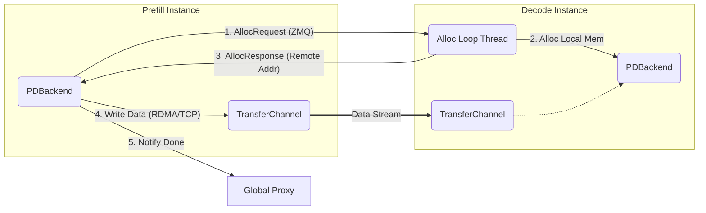

# PDBackend (预填充-解码分离后端) 源码分析

[< 返回存储架构概览](./lmcache_storage_overview.md)

`PDBackend` (Prefill-Decode Backend) 是 LMCache 专为 **预填充-解码分离 (Prefill-Decode Disaggregation)** 架构设计的核心存储后端。在此模式下，计算负载被拆分为两个阶段：

1. **Prefill (预填充)**: 负责处理输入的 Prompt，生成 KV Cache。通常由高算力节点（如 H100）承担。
2. **Decode (解码)**: 负责逐个生成 Token。通常由低显存带宽节点（如 A10/L40）承担。

`PDBackend` 的核心职责是实现 KV Cache 从 Prefill 实例到 Decode 实例的**低延迟、高吞吐、主动推送 (Push-based)** 传输。

> **架构定位**: 它不仅是一个存储后端 (Storage Backend)，还取代了 `LocalCPUBackend` 充当 **内存分配器 (Allocator)** 的角色，直接管理 Host 内存以实现零拷贝传输。

---

## 1. 核心架构设计

本章将从宏观视角解析 PDBackend 的设计理念。与传统的 P2PBackend（基于 Pull 模式，即“缺页中断”式拉取）不同，PDBackend 采用 **Push 模式**：Prefill 节点在生成 KV Cache 后，主动将其推送到 Decode 节点。这种设计消除了 Decode 阶段的首个 Token 生成延迟 (TTFT)，确保推理计算无缝衔接。

### 1.1 角色分工

`PDBackend` 根据配置 (`pd_role`) 分为两种角色，分别对应 PD 分离架构的两端：

- **Sender (Prefiller)**:

  - **行为**: 生产者。不保留任何 KV Cache，生成数据后立即推送到 Receiver。
  - **关键逻辑**: 远程内存申请 -> 数据推送 -> 通知 Proxy。
  - **存储**: 本地 `self.data` 始终为空，不进行本地存储。

- **Receiver (Decoder)**:
  - **行为**: 消费者。被动接收来自 Sender 的数据，并存储在本地内存中供推理引擎读取。
  - **关键逻辑**: 监听内存申请请求 -> 分配本地内存 -> 返回地址 -> 等待数据写入。
  - **存储**: 维护 `self.data`，保存接收到的 KV Cache。

### 1.2 通信协议

PD 模式引入了一套基于 MsgPack 的轻量级控制平面协议，用于协调内存分配。

- **AllocRequest**: Sender 向 Receiver 申请内存。包含 Key 列表、Shape、Dtype、Format、Last Chunk Tokens 等元数据。
- **AllocResponse**: Receiver 返回分配结果。包含 `remote_indexes` (接收端内存地址/索引) 和 `already_sent_indexes` (已存在的 Key，避免重复传输)。
- **ProxyNotif**: Sender 通知全局 Proxy 传输完成，Proxy 随后调度 Decode 请求给 Receiver。

### 1.3 组件交互流程

下图展示了 PD 模式下 KV Cache 的流转过程：



---

## 2. 核心代码解析

本章深入剖析 `PDBackend` 的实现细节。作为系统中最复杂的后端组件，`PDBackend` 不仅实现了标准的存储接口，还集成了 **内存分配器 (Allocator)**、**ZMQ 控制平面** 与 **数据传输平面**。接下来的分析将围绕 Sender (Prefiller) 与 Receiver (Decoder) 的状态流转展开，揭示其如何通过协同工作实现高效的 KV Cache 推送。

代码位于 [`lmcache/v1/storage_backend/pd_backend.py`](../lmcache/v1/storage_backend/pd_backend.py)。

### 2.1 初始化与配置

`PDConfig` 类负责解析配置并确定节点角色。

- **Sender**: 需要配置 `proxy_host/port` 以通知调度器。
- **Receiver**: 需要配置 `peer_host/port` 以绑定监听端口。
- **Buffer Device**: 自动检测并设置 CUDA 设备，用于 GPU-CPU 内存传输。

```python
# 初始化时根据 role 分支处理
if self.pd_config.role == "sender":
    self._init_sender()
    # Sender 需要记录已初始化的 Peer 和对应的内存分配 Socket
    self.initialized_peers: set[str] = set()
    self.mem_alloc_sockets: dict[str, zmq.Socket] = {}
elif self.pd_config.role == "receiver":
    self._init_receiver()
```

### 2.2 Sender (Prefiller) 实现

Sender 的核心逻辑在 `batched_submit_put_task` 中，它重写了标准 StorageBackend 的 put 行为。

#### 2.2.1 远程内存分配

在发送数据前，Sender 必须先知道“往哪里写”。它通过 ZMQ 向 Receiver 发送 `AllocRequest`。

```python
def batched_submit_put_task(self, keys, memory_objs, transfer_spec):
    # 1. 建立/确认连接 (Lazy Connection)
    # 根据 transfer_spec 中的目标信息建立数据面和控制面连接
    self._ensure_peer_connection(...)

    # 2. 发送分配请求 (AllocRequest)
    # 根据 memory_objs 的 shape/dtype/fmt 构造请求
    alloc_request = self._get_remote_alloc_request(keys, memory_objs)
    # 阻塞等待 Receiver 返回分配结果
    alloc_response = self._remote_allocate(receiver_id, alloc_request)

    # 3. 解析响应
    already_sent_indexes = alloc_response.already_sent_indexes
    remote_indexes = alloc_response.remote_indexes # 目标物理地址列表
```

#### 2.2.2 数据推送

获得目标地址后，Sender 过滤掉已存在的 Key，利用 `TransferChannel` 直接将数据写入 Receiver 内存。

```python
    # 4. 过滤无需发送的数据
    mem_objs_to_send = []
    for idx, mem_obj in enumerate(memory_objs):
        if idx in already_sent_indexes:
            mem_obj.ref_count_down() # 释放本地引用
        else:
            mem_objs_to_send.append(mem_obj)

    if mem_objs_to_send:
        # 5. 构造传输规范
        channel_transfer_spec = {
            "receiver_id": receiver_id,
            "remote_indexes": remote_indexes, # 关键：告诉底层往哪写
        }

        # 6. 执行零拷贝传输 (RDMA Write / TCP Send)
        self.transfer_channel.batched_write(
            objects=mem_objs_to_send,
            transfer_spec=channel_transfer_spec,
        )
```

#### 2.2.3 通知代理

传输完成后，Sender 通知 Proxy，标志着 Prefill 阶段彻底完成，Decode 实例可以开始工作。

```python
    if transfer_spec.is_last_prefill:
        # 发送 ProxyNotif 消息
        notif_msg = ProxyNotif(req_id=transfer_spec.req_id)
        notif_msg_bytes = msgspec.msgpack.encode(notif_msg)
        self.proxy_side_channel.send(notif_msg_bytes)
```

### 2.3 Receiver (Decoder) 实现

Receiver 启动一个后台线程 `_mem_alloc_loop` 专门处理分配请求。

#### 2.3.1 内存分配循环

```python
def _mem_alloc_loop(self):
    while self.running:
        try:
            # 1. 接收请求 (MsgPack 解码)
            alloc_req_bytes = self.alloc_side_channel.recv()
            alloc_req = msgspec.msgpack.decode(alloc_req_bytes, type=PDMsg)

            # 2. 分配内存并注册到 backend
            alloc_resp = self._allocate_and_put(alloc_req)

            # 3. 返回响应 (包含分配到的内存地址)
            self.alloc_side_channel.send(msgspec.msgpack.encode(alloc_resp))
        except Exception as e:
            logger.error(...)
```

#### 2.3.2 预先注册与忙等待

`_allocate_and_put` 方法不仅分配内存，还提前将 `MemoryObj` 放入 `self.data` 字典中。如果分配失败（显存不足），会进入**忙等待 (Busy Loop)**。

```python
def _allocate_and_put(self, alloc_request):
    # ...
    # 尝试分配内存
    mem_obj = self.allocate(...)

    # 如果分配失败，进入忙等待 (重试直到成功)
    # TODO: 这里可能会阻塞 Alloc Loop，导致死锁，未来需要优化
    wait_time = 0.01
    while mem_obj is None:
        time.sleep(wait_time)
        mem_obj = self.allocate(...)

    # 获取物理地址 (供 Sender 写入)
    alloc_indexes.append(mem_obj.meta.address)

    # 注册到本地存储 (Key -> MemoryObj)
    # 注意：此时数据尚未到达，但容器已就绪
    self.put(key, mem_obj)

    return AllocResponse(..., remote_indexes=alloc_indexes)
```

> **注意**: 这里存在一个隐式的同步假设。Receiver 提前 `put` 了空的 MemoryObj，如果 Decode 引擎立即读取，可能会读到空数据。因此，**全局 Proxy 的调度至关重要**——它必须确保 Sender 发送完 `ProxyNotif` 后，才向 Receiver 发送推理请求。

---

## 3. 内存分配器实现细节

与 `LocalCPUBackend` 类似，`PDBackend` 也实现了 `AllocatorBackendInterface`，这意味着它不仅仅是 KV Cache 的存储者，更是物理内存的管理者。然而，由于 PD 场景的特殊性（高吞吐、单向流动），其内存管理策略与 L1 CPU 缓存有显著差异。

### 3.1 Allocator 的核心职责

在 PD 架构中，Allocator 负责管理 **数据传输缓冲区**。

- **对于 Sender**: 分配的内存作为**发送缓冲区**。数据从计算流生成后，暂存于此，随后被 RDMA/TCP 引擎读取并发送。
- **对于 Receiver**: 分配的内存作为**接收缓冲区**。这块内存的物理地址会被发送给 Sender，以便远程节点直接进行 RDMA Write 操作。

### 3.2 实现逻辑

`PDBackend` 复用了 `PagedCpuGpuMemoryAllocator`，通过指定 `allocator_type="gpu"` 来直接管理显存（或 Pinned Memory），以支持 GPUDirect RDMA 技术。

```python
def allocate(self, shapes, dtypes, ...):
    """
    PDBackend 的内存分配逻辑
    """
    # 直接调用底层的 PagedCpuGpuMemoryAllocator
    # allocator_type="gpu" 确保分配的是适合 RDMA 传输的显存或 Pinned 内存
    return self.memory_allocator.allocate(
        shapes,
        dtypes,
        fmt,
        allocator_type="gpu"
    )
```

### 3.3 与 LocalCPUBackend 的区别

虽然两者都扮演 Allocator 的角色，但设计目标截然不同：

| 特性                    | LocalCPUBackend                                                       | PDBackend                                                                                 |
| :---------------------- | :-------------------------------------------------------------------- | :---------------------------------------------------------------------------------------- |
| **管理介质**            | 主要管理 Host Memory (CPU RAM)                                        | 主要管理 Device Memory (GPU VRAM) 或 Pinned Host Memory                                   |
| **逐出策略 (Eviction)** | **支持**。内存不足时，通过 LRU 策略逐出旧数据 (Allocate-Evict Loop)。 | **不支持**。PD 模式下的数据通常是一次性的流式数据，不涉及长期缓存，因此不进行复杂的逐出。 |
| **使用场景**            | 通用 L1 缓存，服务于反复访问的热点数据。                              | 专用的流式传输通道，服务于一次性的 Prefill-to-Decode 传输。                               |

> **注意**: PD 模式下通常不进行 Eviction。如果显存不足，分配请求会直接失败或阻塞，这依赖于上层调度器（Proxy）精确控制并发量，避免“爆显存”。

### 3.4 关于共存性的说明

**Q: 启用 PD 模式后，是否还需要 `LocalCPUBackend`？**

A: **不需要，两者在架构设计上是互斥的。**

这不仅仅是功能重叠的问题，更核心的原因在于 **KV Cache 在 PD 场景下的角色发生了根本转变**：

1. **流式传输 vs 静态缓存**:

   - 在 PD 架构中，KV Cache 是连接 Prefill 和 Decode 阶段的 **一次性数据流 (Transient Stream)**。Sender 生成数据后立即推送，Receiver 接收后立即使用，整个过程不涉及“缓存复用”。

2. **分配器 (Allocator) 的排他性**:
   - LMCache 系统要求内存分配器是唯一的。PD 模式下，KV Cache 的生命周期（申请->传输->释放）由 `PDBackend` 全权管理。`LocalCPUBackend` 的 LRU 逐出策略并不适用于这种流式场景。

---

## 4. 总结

`PDBackend` 作为 LMCache 对分离式推理架构的深度定制，体现了“存储服务于计算”的设计哲学：

1. **消灭首字延迟 (TTFT)**: 采用 **Push-based** 主动推送机制，将 KV Cache 的传输隐藏在调度间隙中。相比于 P2P 的“按需拉取 (Pull)”，它彻底消除了首次解码时的网络 I/O 等待。
2. **极致传输效率**: 通过 **控制面 (ZMQ) 与数据面 (RDMA/TCP) 分离**，配合地址预协商机制，实现了 Sender 显存到 Receiver 显存的 **零拷贝 (Zero-Copy)** 直达，最大化利用物理带宽。
3. **深度调度协同**: 突破了传统存储后端的被动边界，通过 ProxyNotif 机制与全局调度器紧密耦合，确保了“数据到位即计算开始”的流水线并行能力。
