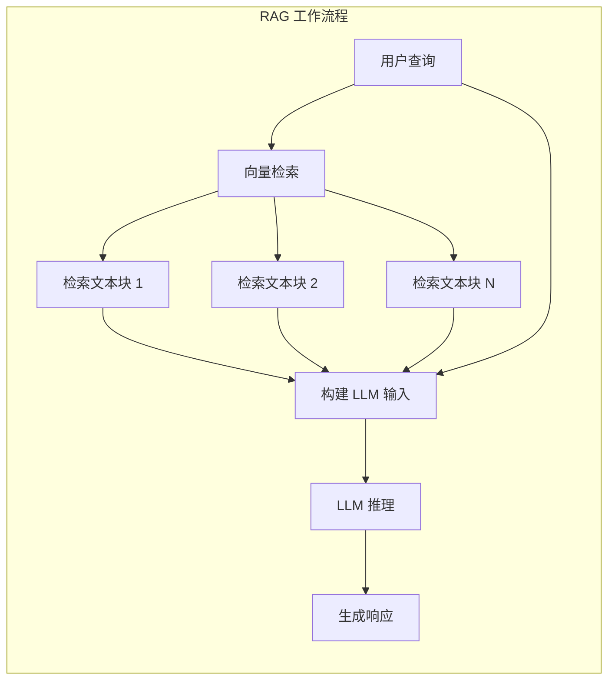
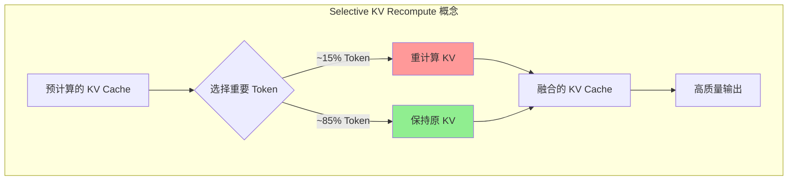

# CacheBlend 技术详解：RAG 场景下的 KV Cache 动态融合机制与源码剖析

本文档旨在深入剖析 CacheBlend 技术在 LMCache 项目中的工程实现。基于 EuroSys '25 论文 _CacheBlend: Fast Large Language Model Serving for RAG with Cached Knowledge Fusion_ 的理论基础，本文将结合 LMCache 源码，详细解读如何通过“选择性重算与融合”机制，在检索增强生成 (RAG) 场景下突破 Prefix Caching 的限制，实现非前缀 KV Cache 的高效复用与推理加速。

## 1. 论文核心思想概述

**论文标题**: _CacheBlend: Fast Large Language Model Serving for RAG with Cached Knowledge Fusion_ (arXiv:2405.16444)
**会议**: EuroSys ‘25
**代码**: [GitHub - LMCache](https://github.com/LMCache/LMCache)

### 1.1 导论与背景

在检索增强生成 (RAG) 等现代 LLM 应用中，为了确保回复的准确性和一致性，模型输入通常由用户查询 (Query) 和多个检索到的文本块 (Chunks) 拼接而成。这些文本块为模型提供了必要的领域知识或上下文信息。然而，随着上下文长度的增加，这种模式给 LLM 推理系统带来了严峻的性能挑战。



**RAG 场景面临的核心矛盾**:

1. **极高的 Prefill 开销 (High TTFT)**:
   LLM 的 Prefill 阶段计算复杂度随序列长度呈超线性增长。处理长上下文（例如 4000+ tokens）需要消耗大量的 GPU 算力与时间，导致用户面临极高的首字延迟 (Time-to-First-Token, TTFT)。例如，在 NVIDIA A40 GPU 上，Llama-2-70B 处理 4000 tokens 可能需要数秒钟，严重影响交互体验。

2. **动态位置的文本复用 (Reuse at Arbitrary Positions)**:
   在 RAG 场景中，相同的文档块（Chunk）经常被不同的查询复用，但它们在 Prompt 中的位置通常是不固定的。它们可能作为前缀出现，也可能被拼接在其他上下文之后。

3. **现有缓存技术的局限性 (Failure of Prefix Caching)**:
   现有的 **Prefix Caching** 技术存在严格限制：它要求被复用的文本必须位于输入的最前端（前缀）。对于 RAG 中常见的“非前缀复用”（Non-Prefix Reuse）场景，由于 Token 的 KV 值依赖于前序上下文（Cross-Attention），直接复用会导致严重的计算错误。这使得 RAG 系统难以享受到 KV Cache 复用带来的性能红利。

### 1.2 核心挑战：Cross-Attention 的影响

现有的 KV Cache 复用技术（如 Prefix Caching）存在严重局限性：**它们要求被复用的文本必须严格位于输入的最前端（前缀）**。

然而，在 RAG 中，文档块的位置可能是任意的。根据 Transformer 的 Self-Attention 机制，一个 Token 的 KV 值不仅取决于其自身的 Embedding，还取决于它与**所有前序 Token** 的交互（Cross-Attention）。
一旦文本块的位置发生变化（例如从前缀变为中间部分），其前序上下文改变，导致预计算的 KV Cache 失效。直接复用这些 KV Cache 会导致严重的精度损失，生成完全错误的回复。

让我们通过一个具体例子来说明跨块注意力为何重要：

**场景设置**：

- **Chunk 1**: “Lionel Messi scored 13 goals at FIFA World Cups.”
- **Chunk 2**: “Cristiano Ronaldo scored 8 goals at FIFA World Cups.”
- **Query**: “Who scored more goals at FIFA World Cups, Messi or Ronaldo?”

```mermaid
graph TB
    subgraph "Full KV Recompute - 正确答案"
        A1[Chunk 1: Messi 13 球] --> A2[Chunk 2: Ronaldo 8 球]
        A2 --> AQ[Query: 谁进球更多?]
        AQ --> AA["✓ Messi 进球比 Ronaldo 多"]

        A1 -.->|"Cross-Attention<br>建立关联"| A2
    end

    subgraph "Full KV Reuse - 错误答案"
        B1["KV: Messi 13 球"]
        B2["KV: Ronaldo 8 球"]
        BQ[Query: 谁进球更多?]
        B1 --> BC[直接拼接]
        B2 --> BC
        BQ --> BC
        BC --> BA["✗ 无法正确比较<br>答非所问"]

        B1 -.x|"无 Cross-Attention"| B2
    end

    style AA fill:#90EE90
    style BA fill:#ff9999

```

**Attention Matrix（注意力矩阵）对比**：

Full KV Recompute 的注意力矩阵包含完整的 Cross-Attention 区域，而 Full KV Reuse 的注意力矩阵在 Cross-Attention 区域为零（从未计算）。

```text
Full KV Recompute:          Full KV Reuse:
┌─────────────────┐         ┌─────────────────┐
│ █████           │         │ █████           │
│ █████           │         │ █████           │
│ █████████████   │  vs     │ █████ 00000     │  ← Cross-Attention
│ █████████████   │         │ █████ 00000     │    区域缺失
│ ███████████████ │         │ █████ █████████ │
└─────────────────┘         └─────────────────┘
   Chunk1  Chunk2              Chunk1  Chunk2

```

### 1.3 CacheBlend 解决方案

为了解决上述挑战，CacheBlend 提出了一种**选择性重算与融合 (Selective Recomputation & Fusion)** 机制。该机制的核心思想是：**以极小的计算代价（重算少量关键 Token），换取对非前缀 KV Cache 的高精度复用**。



**关键洞察 (Key Insight)**:
尽管 Cross-Attention 使得 Token 的 KV 值依赖于前文，但研究表明这种依赖具有**稀疏性**：绝大多数 Token 的 KV 值对上下文变化不敏感，仅有少部分“关键 Token”（通常是注意力机制中的 Hub Token 或语义转折点）的 KV 值会发生剧烈漂移。

基于此，CacheBlend 设计了三阶段处理流程：

1. **全量检索与融合 (Full Retrieval & Fusion)**:
   系统首先假设所有 Token 的 KV Cache 都是可用的，直接从存储后端（如磁盘/网络）检索并加载预计算好的 KV Cache。无论文本块在当前 Prompt 中处于何种位置，都将其视为初始状态。

2. **动态差异检测 (Dynamic Divergence Detection)**:
   为了识别受上下文影响最大的 Token，CacheBlend 会在推理的早期层（Check Layer，通常为 Layer 1）执行一次“全量计算+比对”：
   - **差异计算**: 计算当前上下文下生成的 Key 值与检索到的旧 Key 值之间的 L2 距离。
   - **关键 Token 筛选**: 根据差异大小，动态选取 Top-K 个（如 15%）偏差最大的 Token 作为“重算集合”。

3. **稀疏重算与原地修补 (Sparse Recomputation & In-place Patching)**:
   在后续层中，系统**仅对筛选出的关键 Token 进行 KV 重算**（理想情况下），并将新计算的 KV 值“打补丁”到检索到的 Cache 中。最终，Attention 层使用的是一个混合了“大部分旧值”和“少部分新值”的 KV Cache，从而在保持高精度的同时显著减少了计算量。

### 1.4 性能收益

通过这种机制，CacheBlend 在保证生成质量（Perplexity 和任务准确率与全量计算相当）的前提下，显著提升了推理性能：

- **TTFT 降低**: 相比全量重算，首字延迟降低 **2.2x - 3.3x**。
- **吞吐量提升**: 推理吞吐量提升 **2.8x - 5x**。
- **存储与计算权衡**: 允许利用较慢但容量大的存储介质（如 CPU 内存/磁盘）存储海量 KV Cache，通过计算（重算部分 Token）换取 I/O 带宽的节省。

---

## 2. 架构设计与实现原理

LMCache 在 `lmcache/v1/compute/blend/` 模块中完整实现了 CacheBlend 的核心算法。其架构设计不仅关注算法本身的正确性，还深度优化了工程实现，特别是与 vLLM 推理引擎的耦合以及 I/O 流水线的调度。

### 2.1 核心组件与架构

LMCache 的 CacheBlend 实现采用高度模块化的设计，将计算逻辑（Blender）与存储逻辑（Cache Engine）解耦，并通过元数据（Metadata）进行状态同步。整个架构旨在实现计算与 I/O 的最大化重叠（Overlap），从而在不阻塞 GPU 推理的前提下完成复杂的 KV Cache 融合操作。以下是该系统的核心组件及其职责：

- **LMCBlender (`blender.py`)**: 核心控制器。
  - 负责协调 GPU 计算（通过 `vllm_model`）和存储 I/O（通过 `cache_engine`）。
  - 维护混合状态 (`LMCBlendMetadata`)。
- **LMCBlendCommonMetadata (`metadata.py`)**: 静态配置元数据。
  - 存储 `check_layers`, `recomp_ratios`, `thresholds` 等全局配置。
- **LMCBlendMetadata (`metadata.py`)**: 动态运行时元数据。
  - 存储当前请求的 `imp_indices` (关键 Token 索引)、`positions` (位置信息) 等。
  - 在层与层之间传递状态（例如第 1 层计算出的 `imp_indices` 会被后续层复用）。
- **Layerwise Pipeline**:
  - 将模型的层级计算抽象为生成器 (Generator)，实现细粒度的 I/O 与计算重叠。

### 2.2 关键配置参数

LMCache 通过 `LMCacheEngineConfig` (`config.py`) 管理 CacheBlend 相关配置，并在初始化时进行校验：

- **`enable_blending`**: 总开关。开启后会强制设置 `save_unfull_chunk=True`，确保未满的 Chunk 也能被保存和复用（这对于 RAG 场景的不定长文本块至关重要）。
- **`blend_check_layers`**: 差异检测层列表（如 `[1]`）。
- **`blend_recompute_ratios`**: 重算比例列表（如 `[0.15]`）。
- **`blend_min_tokens`**: 触发 Blending 的最小 Token 数（默认 256）。避免对过短的文本进行复杂的混合操作。
- **`blend_thresholds`**: (Future) 基于阈值的动态重算策略配置。

### 2.3 初始化与模型推断

`LMCBlender` 在初始化阶段会根据 vLLM 的模型结构构建一个“层级化模型执行器”。

```python
# blender.py L24-L50
def __init__(self, cache_engine, gpu_connector, vllm_model, config):
    # ...
    # 1. 推断模型结构，构建支持逐层执行的 Wrapper
    # enable_sparse 支持稀疏注意力 (Sparse Attention)
    self.layerwise_model = infer_model_from_vllm(vllm_model, self, enable_sparse)

    # 2. 加载静态配置
    self.common_metadata = LMCBlendCommonMetadata(
        check_layers=config.blend_check_layers,
        recomp_ratios=config.blend_recompute_ratios,
        thresholds=config.blend_thresholds,
    )

    # 3. 初始化动态元数据容器
    self.metadata = LMCBlendMetadata(...)
```

### 2.4 核心逻辑：Process QKV

`process_qkv` 是 CacheBlend 算法的执行主体，它被注入到模型的 Attention 计算层中。

**关键步骤解析**：

1. **位置编码 (Rotary Embedding)**:
   在计算差异之前，必须先对 Q/K 进行旋转位置编码 (RoPE)。这是因为存储在 Cache 中的 `old_k` 通常是经过 RoPE 处理的。

   ```python
   # blender.py L86
   q, k = attn_layer.rotary_emb(self.metadata.positions, q, k)
   ```

2. **差异检测 (Diff Calculation)**:
   在 Check Layer（如第 1 层），计算新旧 Key 的 L2 距离（的平方）。

   ```python
   # blender.py L88-L91
   if layer_id in self.common_metadata.check_layers:
       diff_k = torch.sum(
           (k.to(torch.float32) - old_k.to(torch.float32)) ** 2, dim=[1]
       )
   ```

3. **Top-K 选择 (Token Selection)**:
   根据配置的 `recomp_ratios` 选取误差最大的 Token，并确保至少选取 1 个且索引有序。

   ```python
   # blender.py L97-L101
   topk_num = int(total_len * self.common_metadata.recomp_ratios[0])
   topk_num = max(topk_num, 1) # 至少重算 1 个 Token

   top_indices = torch.topk(diff_k, k=topk_num).indices
   top_indices, _ = torch.sort(top_indices) # 保持索引有序

   # 更新元数据，供后续层使用
   self.metadata.imp_indices = top_indices
   ```

   > **注意**: 代码中存在 TODO `remove [0] hardcode`，表明目前仅支持单一比例配置，未来可能支持逐层动态比例。

4. **混合 (Blending)**:
   使用 In-place Update 更新 `old_k`/`old_v`。

   ```python
   # blender.py L115-L117
   if self.metadata.imp_indices is not None:
       old_k[self.metadata.imp_indices] = k
       old_v[self.metadata.imp_indices] = v
       # 返回混合后的结果
       return q, old_k, old_v, ...
   ```

### 2.5 流水线调度：Blend Layer

`blend_layer` 函数展示了 LMCache 如何利用 Python 生成器实现精细的流水线控制，通过 I/O 与计算的重叠（Overlap）最大化吞吐量。

```python
# blender.py L124-L150
def blend_layer(
    self,
    tokens: torch.Tensor,
    mask: Optional[torch.Tensor] = None,
    **kwargs,
):
    """
    Perform layerwiese retrieve + blending.
    """

    # 1. 创建计算和 I/O 的生成器
    layerwise_model_executor = self.layerwise_model.compute_layer(tokens)
    layerwise_retriever = self.cache_engine.retrieve_layer(tokens, mask, **kwargs)

    # 2. 预取第一层 (Prefetch)
    # 启动第 0 层的 KV 检索
    next(layerwise_retriever)
    yield

    # 3. 交替执行 (Interleaving)
    for i in range(self.num_layers):
        # 触发下一层的 I/O (非阻塞/异步)
        # 当计算第 i 层时，预取第 i+1 层的 KV Cache
        next(layerwise_retriever)

        # 执行当前层的计算 (包含 process_qkv)
        next(layerwise_model_executor)
        yield

    # 4. 尾部清理
    # 完成最后一次检索生成器的迭代
    next(layerwise_retriever)

    # 清理动态元数据（如 imp_indices），为下一次请求做准备
    self.metadata.clean()
    yield
```

**设计亮点**:

- **隐藏 I/O 延迟**: 采用了典型的流水线并行思想。在 GPU 密集计算第 `i` 层时，CPU/IO 线程并发地从存储后端检索第 `i+1` 层的数据。理想情况下，I/O 延迟被计算时间完全掩盖。
- **状态管理**: `self.metadata` 在层间共享，确保 Check Layer 选出的 `imp_indices` 能正确应用到后续所有层。
- **生成器控制**: 通过 `yield` 暂停和恢复执行，使得外部调度器（如 `LMCBlender.blend`）能够精确控制每一层的执行节奏，并与 vLLM 的调度循环无缝对接。

---

## 3. 如何在 LMCache 中使用 CacheBlend

要使用 CacheBlend 功能，用户需要配置 LMCache 并在构建 Prompt 时遵循特定的格式（插入分隔符）。以下结合 `examples/blend_kv_v1/blend.py` 示例进行说明。

### 3.1 环境配置

可以通过环境变量或 YAML 配置文件开启 CacheBlend。

**方式一：环境变量**：

```bash
# 启用 Blending 功能
export LMCACHE_ENABLE_BLENDING="True"

# 启用层级传输 (Blending 的基础，必须开启)
export LMCACHE_USE_LAYERWISE="True"

# 指定 Chunk 之间的分隔符 (用于逻辑切分)
# 注意：这个字符串需要和 Prompt 中实际插入的分隔符一致
export LMCACHE_BLEND_SPECIAL_STR=" # # "

# 指定在第几层进行差异检测 (通常为 1)
export LMCACHE_BLEND_CHECK_LAYERS="1"

# 指定重算 Token 的比例 (如 0.15 表示重算 15% 的 Token)
export LMCACHE_BLEND_RECOMPUTE_RATIOS="0.15"
```

**方式二：YAML 配置文件**：

创建 `lmcache_config.yaml` (参考 `examples/blend_kv/example_blending.yaml`):

```yaml
chunk_size: 256
local_device: "cpu"

# Enables KV blending
enable_blending: True
# 必须开启 Layerwise 传输以支持 Blending
use_layerwise: True

# Blending 详细配置
blend_check_layers: [1]
blend_recompute_ratios: [0.15]
blend_special_str: " # # "
```

### 3.2 代码示例

在使用 vLLM 进行推理时，需要手动在不同的文档块（Chunks）之间插入配置好的分隔符（`LMCACHE_BLEND_SPECIAL_STR`），以便 LMCache 识别边界。

以下代码片段展示了如何构建支持 CacheBlend 的 Prompt：

```python
# 引用自 examples/blend_kv_v1/blend.py

# 1. 获取分隔符 Token (必须与环境变量 LMCACHE_BLEND_SPECIAL_STR 一致)
# 注意：这里 [1:] 是为了去除 tokenizer 自动添加的 BOS token (如果存在)
blend_special_str_token = tokenizer.encode(" # # ")[1:]

# 2. 构建 Prompt
# 格式: <SysPrompt> <Separator> <Chunk1> <Separator> <Chunk2> ...
prompt_token_ids = (
    sys_prompt_tokens
    + blend_special_str_token
    + chunk1_tokens
    + blend_special_str_token
    + chunk2_tokens
    + blend_special_str_token
    + user_query_tokens
)

# 3. 发送给 vLLM
llm.generate(prompts={"prompt_token_ids": prompt_token_ids}, ...)
```

### 3.3 运行逻辑验证

参考 `examples/blend_kv_v1/blend.py` 的逻辑，CacheBlend 的生效流程如下：

1. **初始化**: 启动 vLLM 引擎，并配置 `KVTransferConfig` 以启用 LMCache。
2. **首次请求 (Chunk Cache Warmup)**: 发送包含 `Chunk1 + Chunk2` 的 Prompt。LMCache 会计算并缓存这些 Chunk 的 KV。
3. **位置变化请求**: 发送包含 `Chunk2 + Chunk1` (顺序颠倒) 的 Prompt。
4. **触发 Blending**: LMCache 会自动检测到 Chunk 内容已缓存但位置发生了变化，触发“选择性重算与融合”逻辑，从而加速推理并降低 TTFT。

---

## 4. 总结

CacheBlend 是 LMCache 为应对 RAG 场景中复杂多变的 KV Cache 复用需求而提出的一项关键技术。通过本文的源码分析，我们可以看到 LMCache 如何将学术论文中的理论创新转化为高效的工程实现：

1. **突破 Prefix Caching 限制**: CacheBlend 通过“选择性重算与融合”机制，成功解决了非前缀（Non-Prefix）Chunk 因 Cross-Attention 导致的 KV 失效问题，使得 RAG 系统可以灵活地复用任意位置的文档块缓存。

2. **高效的工程架构**:
   - **LMCBlender 控制器**: 作为核心大脑，协调了差异检测、Token 选择和混合更新的全过程。
   - **In-place Update**: 采用原地更新策略，最大限度地复用已加载的 KV 数据，仅对关键 Token 进行“修补”，极大地节省了计算资源。
   - **Layerwise Pipeline**: 将混合逻辑深度嵌入到 I/O 流水线中，实现了计算与数据加载的完美重叠，掩盖了 I/O 延迟。

3. **易用性与灵活性**:
   - 提供了环境变量和 YAML 两种配置方式，方便用户集成。
   - 通过特定的分隔符机制，让开发者能够以极低的侵入性改造现有的 Prompt 构建流程。

4. **未来展望**:
   - 源码中预留的 TODO（如基于阈值的动态重算、逐层差异化比例）表明 CacheBlend 仍有进一步优化的空间，未来可能会引入更智能的自适应策略，以在更复杂的场景下平衡精度与性能。

总而言之，CacheBlend 不仅是 LMCache 的一项高级特性，更是 RAG 推理优化的重要里程碑。它在保证生成质量的前提下，通过巧妙的计算与存储权衡，显著降低了首字延迟 (TTFT) 并提升了系统吞吐量，为构建高性能、低成本的 RAG 服务提供了强有力的支持。

---

## 附录 A: 关键设计决策

### A.1 为什么选择 Layer 1 作为检测层？

CacheBlend 默认在 Layer 1 进行关键 Token 选择。这是一种在**准确性**和**开销**之间的权衡：Layer 1 已经过一次完整的 Attention 计算，能够捕获 Token 间的上下文依赖；同时，实验表明 Layer 1 选出的关键 Token 与后续层高度一致，因此无需逐层检测，从而节省计算资源。

### A.2 为什么使用 Value 差异？

在衡量 KV Cache 失效程度时，CacheBlend 选择计算 **Value 向量的 L2 距离**。这是因为 Value 向量直接参与最终的加权求和，其变化直接反映了输出内容的差异。相比之下，Key 的变化不一定直接导致输出变化，且同时计算 K 和 V 的差异会带来双倍开销。

### A.3 重计算比例 (16%) 的选择

默认 16% 的重计算比例基于对 Attention 稀疏性的观察。在 RAG 场景中，绝大多数注意力权重集中在少部分 Token 上。16% 是一个经验值，处于质量-开销曲线的拐点，既能覆盖绝大多数关键 Token（如语义转折点），又能保证较低的重计算延迟。

### A.4 流水线优化

为了进一步降低延迟，CacheBlend 采用了双线程流水线设计，将下一层的 KV Cache 加载与当前层的计算并行化，从而有效掩盖了 I/O 开销。

## 附录 B: 常见问题 (FAQ)

**Q: CacheBlend 适用于哪些模型？**
A: 核心机制适用于所有使用 **RoPE (旋转位置编码)** 的 Transformer 模型（如 Llama, Mistral, Qwen 等）。

**Q: CacheBlend 与 Prefix Caching 有何区别？**
A: 两者是互补的。**Prefix Caching** 仅适用于完全匹配的前缀复用；**CacheBlend** 专门解决文本块位置变化（非前缀）导致的复用难题。两者结合可最大化 RAG 系统的性能。

**Q: 会增加显存开销吗？**
A: 会。CacheBlend 本质上是以空间换时间，需要存储预计算好的 KV Cache。显存占用量取决于缓存的文本块数量和长度，约等于模型推理时的 KV Cache 大小。
