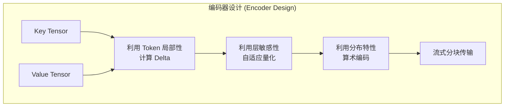

# CacheGen 技术详解：KV Cache 的高效压缩与流式传输

本文档旨在从源码层面深入剖析 **CacheGen** 在 **LMCache** 中的工程落地。基于 SIGCOMM 2024 顶会论文 _CacheGen: KV Cache Compression and Streaming for Fast Large Language Model Serving_，我们将详细解读其核心机制——**自适应量化 (Adaptive Quantization)** 与 **流式算术编码 (Streaming Arithmetic Coding)** 的代码实现。通过分析 Python 控制层与 CUDA 算子层的交互，揭示 LMCache 如何在保证模型推理精度的前提下，实现极致的 KV Cache 压缩比与传输吞吐量。

---

## 1. 论文核心思想概述

**论文标题**: _CacheGen: KV Cache Compression and Streaming for Fast Large Language Model Serving_
**会议**: SIGCOMM '24
**代码**: [GitHub - LMCache](https://github.com/LMCache/LMCache)

### 1.1 导论与背景


随着 LLM 在复杂任务（如法律助理、代码分析、长对话）中的广泛应用，用户输入的上下文越来越长。为了减少重复计算，现有系统通常会存储并复用 KV 缓存。然而，在云端服务器间传输巨大的张量数据会产生严重的 **网络带宽瓶颈**。

**CacheGen** 将 KV 缓存视为一种类似视频的流媒体数据，通过深度压缩和流式传输技术，显著减小数据体积并降低传输延迟。

### 1.2 核心挑战与解决方案

**核心挑战：长文本带来的“网络墙”**：

1. **KV 缓存体积惊人**: 以 Llama-34B 模型为例，处理 8 万 token 时产生的 KV 缓存高达 **19GB**，足以媲美模型自身的大小。
2. **网络带宽成为新瓶颈**: 在常规云服务器单位数 Gbps 的带宽下，加载这些缓存的延迟（TTFT）可能超过 **10秒**，甚至超过了重新计算的时间。
3. **精度敏感性**: 有损压缩必须严格控制误差，以免影响模型生成的准确性。

**CacheGen 的核心设计**:



1. **Token 局部性 (Token-wise Locality)**:
   相邻 Token 的 K/V 张量值非常相似。CacheGen 通过计算 Delta (差值) 而非原始值来进行编码，从而显著降低数据方差。
2. **层敏感度差异 (Layer-wise Sensitivity)**:
   LLM 的浅层 (Earlier Layers) 对量化损失更敏感，而深层则不那么敏感。因此，CacheGen 对浅层应用更精细的量化（更多 bins），对深层应用更激进的量化（更少 bins）。
3. **算术编码 (Arithmetic Coding)**:
   基于通道和层的分布特性，利用 GPU 并行算术编码实现接近熵极限的无损压缩。

### 1.3 主要实验结果

CacheGen 实现了 **3.7 倍的性能飞跃**，具体表现如下：

- **延迟大幅降低**: 相比于量化基准方法，CacheGen 将首字延迟 (TTFT) 降低了 **3.2-3.7 倍**。
- **存储与带宽节省**: CacheGen 将 KV 缓存体积缩小了 **4.3 倍**。
- **质量损失极小**: 压缩对 LLM 响应质量的影响可以忽略不计（准确率下降通常小于 2%）。

**KV 缓存压缩效果对比 (基于 Mistral-7B 模型)**：

| 技术方案                | KV 缓存大小 (MB) | 生成准确率 |
| :---------------------- | :--------------- | :--------- |
| **8-bit 量化 (基准)**   | 622              | 1.00       |
| **CacheGen**            | **176**          | **0.98**   |
| **CacheGen + H2O 增强** | **71**           | **0.97**   |

---

## 2. 架构设计与实现原理

LMCache 中的 CacheGen 实现采用了分层架构，将 Python 层的逻辑控制与 CUDA 层的高性能算子分离。

### 2.1 核心组件与架构

- **CacheGenConfig (`cachegen_basics.py`)**: 静态配置管理。
  - 定义了不同模型（如 Llama-3, Mistral）的分层量化策略。
- **CacheGenSerializer (`cachegen_encoder.py`)**: 编码器入口。
  - 负责数据预处理、量化、CDF 计算及调用底层编码算子。
- **CacheGenDeserializer (`cachegen_decoder.py`)**: 解码器入口。
  - 负责接收数据流、调用 GPU 并行解码算子及反量化。
- **CUDA Kernels (`csrc/`)**: 核心算子。
  - `ac_enc.cu` / `ac_dec.cu`: 并行算术编解码。
  - `cal_cdf.cu`: 并行 CDF 计算。

### 2.2 核心数据结构：CacheGenConfig

配置类 `CacheGenConfig` 定义在 [cachegen_basics.py](lmcache/storage_backend/serde/cachegen_basics.py) 中，用于精细化管理量化策略。它支持根据模型名称自动加载预定义的配置。

```python
# lmcache/storage_backend/serde/cachegen_basics.py

@dataclass
class QuantizationSpec:
    start_layer: int
    end_layer: int
    bins: int

@dataclass
class CacheGenConfig:
    nlayers: int
    kspecs: List[QuantizationSpec]
    vspecs: List[QuantizationSpec]

    @staticmethod
    def from_model_name(model_name: str) -> "CacheGenConfig":
        # 针对不同模型家族应用不同的量化策略
        if model_name in family_7b:
             return CacheGenConfig(
                nlayers=32,
                kspecs=[
                    QuantizationSpec(start_layer=0, end_layer=10, bins=32), # 浅层高精度
                    QuantizationSpec(start_layer=10, end_layer=32, bins=16), # 深层低精度
                ],
                # ...
            )
```

### 2.3 编码流程 (Encoder Pipeline)

编码逻辑主要封装在 `CacheGenSerializer` 类及其调用的辅助函数中。

**关键步骤解析**：

1. **向量化自适应量化 (Vectorized Adaptive Quantization)**:
   代码中并未采用论文提及的"基于锚点的差值计算 (Change-based Encoding)"，而是通过 `torch_quant_vectorized` 函数对分组内的 Token 进行直接量化。
   - **原理**: 计算每组 (Group) 的最大绝对值 (`max1`)，将浮点值归一化并映射到 `[0, bins]` 的整数区间。
   - **分层配置 (Layer-wise Configuration)**: 通过 `CacheGenConfig` 为不同层级设置不同的量化精度 (bins)。例如对于 Llama-3.1-8B 模型：
     - **前 10 层**: Key 使用 32 bins (约 5 bit)，Value 使用 32 bins。
     - **后 22 层**: Key 使用 16 bins (约 4 bit)，Value 使用 16 bins。
   这种分层设计在保证关键层精度的同时实现了深层的激进压缩。

   ```python
   # lmcache/storage_backend/serde/cachegen_encoder.py
   def torch_quant_vectorized(bins: torch.Tensor, input_groups: torch.Tensor):
       MAX = (bins // 2 - 1)[:, None, None]
       max1 = torch.amax(torch.abs(input_groups), dim=-1, keepdim=True)
       factor = MAX / max1
       # 归一化并映射到 [0, 2*MAX] 区间 (包含偏移)
       xq = torch.round(input_groups * factor + MAX).to(torch.int8)
       return xq, max1
   ```

2. **计算 CDF (Compute CDF)**:
   算术编码需要知道每个符号出现的概率。`lmc_ops.calculate_cdf` (CUDA 算子) 在 GPU 上高效统计量化符号的频率并生成累积分布函数（CDF）。这一步是高度并行的，确保了编码准备阶段的低延迟。

   ```python
   # lmcache/storage_backend/serde/cachegen_encoder.py

   # 使用 CUDA 算子高效计算 CDF
   new_cdf_key = lmc_ops.calculate_cdf(new_key, int(key_bins.max()))
   ```

3. **分块编码 (Chunked Encoding)**:
   为了支持流式传输并快速响应网络带宽波动，KV 缓存被切分为多个 Chunk。
   - **Chunk Size**: 虽然论文可能提及 1.5K tokens，但在 `cachegen_basics.py` 中，源码默认配置 `CACHEGEN_GPU_MAX_TOKENS_PER_CHUNK = 256`。
   - **优势**: 更细粒度的分块允许系统在网络波动时更敏捷地进行自适应调整。

### 2.4 解码流程 (Decoder Pipeline)

解码是编码的逆过程，核心在于利用 GPU 并行恢复量化索引并还原浮点数值。

1. **GPU 并行解码**:
   `decode_function_gpu` 接收压缩的比特流，利用编码时传输的 CDF 信息，并行还原出整数索引。

2. **反量化 (Dequantization)**:
   利用编码阶段保存的 `max_tensors`（最大值张量），将解码得到的整数索引还原为浮点数。此步骤会撤销编码时的偏移和缩放。

   ```python
   # lmcache/storage_backend/serde/cachegen_decoder.py
   def do_dequantize(t, bins, maxtensors):
       """
       执行反量化操作。
       Args:
           t (torch.Tensor): 量化后的整数索引
           bins (torch.Tensor): 量化级别
           maxtensors (torch.Tensor): 编码时保存的最大值
       Returns:
           torch.Tensor: 还原后的浮点张量
       """
       # 逆向操作：撤销偏移 -> 归一化 -> 恢复幅度
       C = (bins // 2 - 1)[:, None, None]
       t = t - C      # 撤销偏移，恢复到 [-MAX, MAX]
       t = t.float() / C
       t = t * maxtensors
       return t
   ```

---

## 3. 如何在 LMCache 中使用 CacheGen

要使用 CacheGen 功能，用户主要通过配置文件或环境变量进行开启。

### 3.1 环境配置

可以通过修改 `lmcache_config.yaml` 或设置环境变量来启用 CacheGen。

**方式一：YAML 配置文件**：

```yaml
# lmcache_config.yaml
chunk_size: 256
remote_serde: "cachegen" # 核心配置：指定序列化/反序列化方式为 cachegen
```

**方式二：环境变量**：

```bash
export LMCACHE_REMOTE_SERDE="cachegen"
```

### 3.2 验证与测试

可以通过编写简单的 Python 脚本来验证 CacheGen 序列化器是否正常工作。

```python
import torch
from lmcache.config import LMCacheEngineConfig, LMCacheEngineMetadata
from lmcache.storage_backend.serde.cachegen_encoder import CacheGenSerializer

# 1. 准备配置与元数据
config = LMCacheEngineConfig.from_defaults(chunk_size=256, remote_serde="cachegen")
# 注意：需根据实际情况填写 metadata，此处仅为示例
metadata = LMCacheEngineMetadata(
    model_name="mistralai/Mistral-7B-Instruct-v0.2",
    world_size=1, worker_id=0, fmt="vllm",
    kv_dtype=torch.float16, kv_shape=(32, 2, 256, 8, 128)
)

# 2. 初始化序列化器
serializer = CacheGenSerializer(config, metadata)

# 3. 创建模拟 KV 数据
if torch.cuda.is_available():
    # 模拟一个 256 tokens 的 KV Cache
    kv_tensor = torch.rand((32, 2, 256, 8, 128), device="cuda", dtype=torch.float16)

    # 4. 执行压缩
    compressed_bytes = serializer.to_bytes(kv_tensor)

    original_size = kv_tensor.nelement() * 2
    compressed_size = len(compressed_bytes)
    print(f"Original size: {original_size / 1024 / 1024:.2f} MB")
    print(f"Compressed size: {compressed_size / 1024 / 1024:.2f} MB")
    print(f"Compression ratio: {original_size / compressed_size:.2f}x")
else:
    print("CacheGen requires CUDA to run.")
```

---

## 4. 总结

CacheGen 不仅是 LMCache 项目中的一个高级特性，更是解决分布式大模型推理中 **KV Cache 传输瓶颈** 的关键技术方案。通过本文的源码分析，我们可以得出以下核心结论：

1. **架构设计的精妙平衡**：
   LMCache 采用了 **Python 控制流与 CUDA 计算流分离** 的设计模式。`CacheGenConfig` 提供了灵活的策略配置，而底层的 `csrc` 算子则充分利用 GPU 的并行计算能力，实现了 **高吞吐量的实时编解码**。

2. **深度优化的流式传输**：
   从数据结构设计到分块处理逻辑，CacheGen 的实现天然契合 **流式传输 (Streaming)** 场景。它允许在推理过程中边计算、边压缩、边传输，最大程度地掩盖了网络延迟。

3. **开箱即用的工程实践**：
   LMCache 将复杂的压缩算法封装为简单的配置项 (`remote_serde="cachegen"`)。用户无需深入了解算术编码细节，即可在现有推理服务中无缝启用这一高级压缩特性。

---

## 附录 A: 常见问题 (FAQ)

### A.1 CacheGen 支持哪些模型？

CacheGen 的核心算法是通用的，但在配置层面 (`CacheGenConfig`) 目前主要针对 **Llama-2/3**, **Mistral**, **Qwen** 等主流模型进行了参数调优。对于新模型，可以通过调整 `QuantizationSpec` 来适配。

### A.2 CacheGen 会影响模型精度吗？

会，但影响极小。CacheGen 是一种**有损压缩**算法。通过“层敏感性”策略，它在对精度敏感的浅层保留了更多信息，而在深层进行更激进的压缩。实验表明，在绝大多数任务中，模型准确率的下降幅度小于 2%，用户几乎无法感知。

### A.3 为什么需要 CUDA 环境？

CacheGen 的核心压缩算法（特别是算术编码）是计算密集型的。为了满足实时流式传输的需求（即压缩速度 > 网络传输速度），LMCache 使用了高度优化的 CUDA Kernel 进行并行加速。因此，CacheGen 必须在支持 CUDA 的 GPU 环境下运行。
