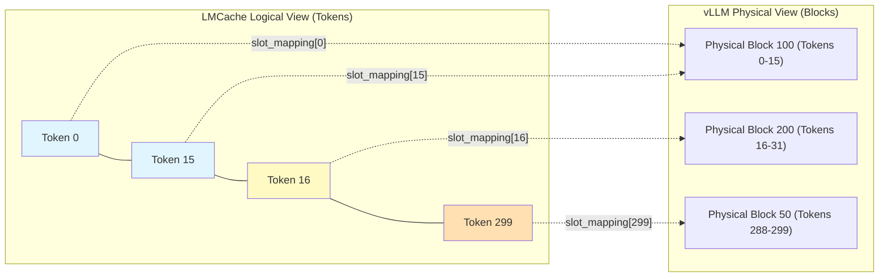

# LMCacheConnector (vLLM 集成) 代码分析

[< 返回架构概览](./lmcache_overview.md)

**LMCacheConnector** 是 LMCache 架构中负责与 vLLM 计算引擎深度集成的核心适配层。它作为 vLLM 的 `KVConnectorBase_V1` 接口实现，驻留在 vLLM 的进程空间内，充当了 vLLM **基于 Block 的物理内存视图**与 LMCache **基于 Token 的逻辑存储视图**之间的智能转换器与调度器。

本文档深入剖析 `LMCacheConnector` 的设计原理与实现细节。作为连接计算与存储的枢纽，它不仅负责基础的数据转换，还通过**层级流水线 (Layerwise Pipelining)**、**异步 I/O 编排**和**混合加载 (Blending)** 等高级机制，实现了 KV Cache 的零开销存取，确保了推理性能不受存储延迟的影响。

文档将按照以下逻辑展开：

1. **架构与组件**: 介绍连接器的核心类及其初始化流程。
2. **视图转换机制**: 详述 PagedAttention 物理地址到 LMCache 逻辑 Key 的映射算法。
3. **加载流水线**: 分析如何通过预取和掩码对齐实现高效的数据加载。
4. **存储流水线**: 剖析非阻塞的层级存储机制及其与后端的交互。

---

## 1. 连接器架构与初始化

代码主要位于 [lmcache/integration/vllm/vllm_v1_adapter.py](../lmcache/integration/vllm/vllm_v1_adapter.py)。本章介绍连接器的核心组件构成及其初始化流程。

### 1.1 核心组件

连接器由以下几个核心类协同工作，共同完成 vLLM 与 LMCache 之间的数据桥接：

- **LMCacheConnectorV1Impl**: 核心实现类，实现了 vLLM 的 `KVConnectorBase_V1` 接口，负责具体的加载与存储逻辑调度。
- **RequestTracker**: 负责跟踪每个请求的动态状态（如 Token ID 列表、分配的物理 Block ID、已持久化的 Token 数量等）。
- **ReqMeta**: 静态的请求元数据快照，包含核心的 `slot_mapping`，定义了逻辑 Token ID 与 vLLM 物理内存 Block 之间的映射关系。
- **LMCBlender**: 混合器组件，用于处理多源 KV Cache 的混合（Blending），目前主要用于特定的生成场景。

### 1.2 初始化与配置

初始化过程由 `LMCacheConnectorV1Impl.__init__` 和辅助函数 `_init_lmcache_engine` 完成。

- **引擎初始化**: `_init_lmcache_engine` 负责创建 `LMCacheEngine` 单例。它会自动检测硬件环境（CUDA/XPU）并配置合适的 GPU 连接器。对于 **MLA (Multi-Level Attention)** 模型，它会强制开启 `save_unfull_chunk` 以确保数据的完整性。
- **插件加载**: 如果配置了插件，`RuntimePluginLauncher` 会在 Worker 0 上启动运行时插件。
- **可观测性**: 初始化 `LMCStatsMonitor` 和 `PrometheusLogger`，用于采集连接器级别的指标（如 `connector_load_specs_count`）。

```python
# lmcache/integration/vllm/vllm_v1_adapter.py

def _init_lmcache_engine(lmcache_config, vllm_config, role):
    # ...
    # 自动检测 MLA 并调整配置
    if use_mla and not lmcache_config.save_unfull_chunk:
        lmcache_config.save_unfull_chunk = True

    # 自动检测设备 (CUDA/XPU)
    if current_platform.is_cuda_alike():
        # ...
```

---

## 2. 核心机制：状态跟踪与视图转换

vLLM 的内存管理基于 **PagedAttention** 机制，将 KV Cache 存储在物理上不连续的内存块 (Block) 中，类似于操作系统的分页管理。然而，LMCache 的存储和检索接口是基于逻辑连续的 **Token 序列** 的。

为了弥合这种“内存视图”的差异，`RequestTracker` 和 `ReqMeta` 充当了关键的转换层：

1. **RequestTracker**: 维护请求层面的状态，记录了该请求分配到了哪些物理 Block ID (`allocated_block_ids`)。它还负责处理**请求抢占 (Preemption)**、**Decode 阶段** 的状态更新，以及**多模态 (Multimodal)** 和**存算分离 (Disaggregation)** 的相关状态。
2. **ReqMeta**: 负责生成核心的 `slot_mapping`。这是一个从“逻辑 Token 索引”到“物理显存地址 (Slot ID)”的映射表。

### 2.1 核心转换原理

连接器的核心机制在于实现 vLLM **物理存储视图**与 LMCache **逻辑索引视图**之间的精确转换。这一过程主要包含以下两个关键步骤：

#### 2.1.1 物理视图转换 (Block Address -> Physical Slot)

vLLM 使用 Block Table 记录逻辑块到物理块的映射。LMCache 需要直接访问物理显存。`ReqMeta` 通过以下公式计算全局物理 Slot 索引：

$$ \text{Physical Slot ID} = \text{Block ID} \times \text{Block Size} + \text{Offset} $$

这通过 PyTorch 的广播操作高效实现，生成了 `slot_mapping` 张量，供底层的 CUDA Kernel 直接寻址。

#### 2.1.2 逻辑键值生成 (Token Sequence -> Cache Key)

LMCache 根据 Token 序列定位 KV Cache 的机制依赖于底层组件 **`TokenDatabase`** (位于 `lmcache.v1.token_database`)。

该组件不直接存储数据，而是负责核心的**索引生成**工作：

1. **切分 (Chunking)**: 将 `RequestTracker` 提供的连续 Token 序列切分为固定大小的 Chunk（默认 256 tokens）。
2. **哈希 (Hashing)**: 对每个 Chunk 计算 Hash 值。LMCache 使用**前缀哈希 (Prefix Hash)** 机制，即当前 Chunk 的 Hash 值不仅取决于自身的 Token 内容，还取决于前一个 Chunk 的 Hash。
3. **键生成 (Key Generation)**: 将计算出的 Hash 封装为 `CacheEngineKey`，这是 LMCache 在后端存储中查找 KV 数据的唯一凭证。

> **注意**: `TokenDatabase` 本身不存储 KV 数据，其存储内容包括：hash 算法配置、`LMCacheEngineMetadata` 引用、`save_only_first_rank` 标识（MLA 场景使用）和 `NONE_HASH` 初始哈希值。KV 数据由 `StorageManager` 管理，而 Token 序列的状态由 vLLM 的 `Scheduler` 和连接器的 `RequestTracker` 维护。

#### 2.1.3 转换案例图解

为了更直观地理解 vLLM 的 PagedAttention 与 LMCache 的 Token 视图如何交互，我们来看一个具体的例子。

**假设场景**:

- 当前请求共有 **300 个 Token**。
- **vLLM 配置**: `block_size = 16`。
- **LMCache 配置**: `chunk_size = 256`。

**1. vLLM 的物理视图 (PagedAttention)**
vLLM 将 300 个 Token 切分为 $\lceil 300/16 \rceil = 19$ 个逻辑块。这些逻辑块被映射到显存中不连续的物理块上。

| 逻辑块 ID        | Token 范围     | 物理块 ID (示例)       |
| :--------------- | :------------- | :--------------------- |
| Logical Block 0  | Tokens 0-15    | **Physical Block 100** |
| Logical Block 1  | Tokens 16-31   | **Physical Block 200** |
| ...              | ...            | ...                    |
| Logical Block 18 | Tokens 288-299 | **Physical Block 50**  |

**2. LMCache 的逻辑视图 (Chunking)**
LMCache 不关心物理块，它只关心连续的 Token 序列。

- **Chunk 0**: 包含 Tokens 0-255。生成唯一的 Cache Key。
- **Chunk 1**: 包含 Tokens 256-299。生成另一个 Cache Key。

**3. 核心转换 (Slot Mapping)**
`ReqMeta` 生成的 `slot_mapping` 是一个长度为 300 的一维张量，它告诉 CUDA Kernel：“第 i 个 Token 的 KV 数据在显存的哪个位置”。

- `slot_mapping[0]` (第 0 个 Token) $\rightarrow$ `Physical Block 100` $\times$ 16 + 0 = **1600**
- `slot_mapping[16]` (第 16 个 Token) $\rightarrow$ `Physical Block 200` $\times$ 16 + 0 = **3200**

**图示**:



通过这种映射，LMCache 的存储引擎（`store_layer`）可以线性地遍历 Token 序列（0 到 299），同时利用 `slot_mapping` 快速“跳跃”到显存中正确的物理位置读取数据，将其拼接成连续的 Chunk 进行存储。

### 2.2 辅助控制结构

为了精细控制加载与存储行为，连接器引入了几个辅助 Spec 类：

- **LoadSpec**: 定义加载行为。包含 vLLM 已缓存的 Token 数、LMCache 中已缓存的 Token 数，以及是否允许加载。
- **SaveSpec**: 定义存储行为。指定跳过的起始 Token 数（避免重复存储）以及是否允许存储。
- **DisaggSpec**: 存算分离场景下的传输规格。记录接收端信息 (Host, Port) 和传输状态。

```python
@dataclass
class LoadSpec:
    vllm_cached_tokens: int
    lmcache_cached_tokens: int
    can_load: bool

@dataclass
class SaveSpec:
    skip_leading_tokens: int
    can_save: bool

@dataclass
class DisaggSpec:
    req_id: str
    receiver_id: str
    receiver_host: str
    receiver_init_port: int
    receiver_alloc_port: int
    is_last_prefill: bool = False
    num_transferred_tokens: int = 0
```

### 2.3 RequestTracker 实现

RequestTracker 是连接器中状态管理的核心。

```python
# lmcache/integration/vllm/vllm_v1_adapter.py

@dataclass
class RequestTracker:
    req_id: str
    prompt_len: int
    token_ids: list[int]
    allocated_block_ids: list[int] # vLLM 分配的物理块 ID
    num_saved_tokens: int = 0      # 记录已持久化到 LMCache 的 Token 数
    disagg_spec: Optional[DisaggSpec] = None
    mm_hashes: Optional[list[str]] = None
    mm_positions: Optional[list["PlaceholderRange"]] = None
    request_configs: Optional[dict] = None
    is_decode_phase = False
    skip_save: bool = False

    @staticmethod
    def from_new_request(...):
        # 初始化请求跟踪，提取 block_ids 和 token_ids
        # 处理 DisaggSpec 和多模态特征 (mm_hashes)
        pass

    def update(self, new_token_ids, new_block_ids, preempted=False, ...):
        # 处理请求更新
        if preempted:
            # 如果请求被抢占，重置 block_ids 和 num_saved_tokens
            # 需要从 all_token_ids 恢复 token_ids 以确保一致性
            self.allocated_block_ids = new_block_ids
            self.num_saved_tokens = lmcache_cached_tokens
            num_computed_tokens = max(lmcache_cached_tokens, vllm_cached_tokens)
            num_tokens_needed = max(
                num_computed_tokens + len(new_token_ids),
                lmcache_cached_tokens,
            )
            self.token_ids = all_token_ids[:num_tokens_needed]
        else:
            # 正常 decode 步进，追加新的 block 和 token
            self.allocated_block_ids.extend(new_block_ids)
            self.token_ids.extend(new_token_ids)

        if len(new_token_ids) == 1:
            self.is_decode_phase = True
```

### 2.4 ReqMeta 实现

`ReqMeta.from_request_tracker` 不仅负责生成 `slot_mapping`，还包含决定是否跳过存储的逻辑 (`skip_save`) 以及多模态 Hash 的应用。

1. **Slot Mapping 计算**: 利用 PyTorch 的广播机制，通过 Block ID 和 Block Offset 计算全局物理 Slot ID。
2. **存储策略**: 检查是否满足存储条件（如 Chunk 边界、Decode 阶段策略、配置覆盖等）。
3. **多模态处理**: 如果存在多模态 Hash，将其应用到 Token ID 上。

```python
# lmcache/integration/vllm/vllm_v1_adapter.py

def from_request_tracker(tracker, block_size, ...):
    # 1. 存储策略判断 (skip_save)
    # 不存储的情况：
    # - 存算分离 (Disaggregation) 的接收端通常不存储 (除非显式配置)
    # - 用户配置了 skip_save
    # - 已存储过且新增 Token 未达到 Chunk 边界
    # - Decode 阶段且未开启 save_decode_cache
    skip_save = tracker.disagg_spec is None and (
        tracker.skip_save
        or (tracker.num_saved_tokens > 0 and input_token_len < chunk_boundary)
        or (tracker.is_decode_phase and not save_decode_cache)
        or request_skip
    )

    # ... (计算 num_tokens_to_save)

    # 2. 多模态 Hash 应用
    if tracker.mm_hashes:
        # 将多模态 Hash 应用到 Token ID，以便 LMCache 能正确索引多模态内容
        apply_mm_hashes_to_token_ids(
            token_ids, tracker.mm_hashes, tracker.mm_positions
        )

    # 3. 计算 slot_mapping：将逻辑 Token 索引映射到物理显存偏移量
    # 对应前文 2.1.1 的公式：Physical Slot ID = Block ID * Block Size + Offset
    block_ids = torch.tensor(tracker.allocated_block_ids, dtype=torch.long)
    block_offsets = torch.arange(0, block_size, dtype=torch.long)

    # 广播计算每个 Token 的物理 Slot 索引
    # block_ids: [num_blocks, 1]
    # block_offsets: [1, block_size]
    # result: [num_blocks, block_size] -> flatten -> [total_slots]
    slot_mapping = (
        block_offsets.reshape((1, block_size))
        + block_ids.reshape((num_blocks, 1)) * block_size
    )

    # 截取有效 Token 对应的 slot_mapping
    return ReqMeta(..., slot_mapping=slot_mapping.flatten()[:len(token_ids)], ...)
```

---

## 3. 加载流程

`start_load_kv` 是 vLLM 调度器调用的标准接口，用于将 LMCache 中的 KV 数据预热到 GPU 显存。为了优化加载延迟和灵活性，该方法内置了对 **层级流水线 (Layerwise Pipelining)** 和 **混合加载 (Blending)** 的支持。

### 3.1 掩码对齐 (Mask Alignment)

vLLM 的内存管理是基于 Block 的（通常较小，如 16 Tokens），而 LMCache 的存储和索引粒度是基于 **Chunk** 的（通常较大，如 256 Tokens）。这就产生了一个粒度不匹配的问题：

- **场景**: 假设一个 Chunk 包含 Token [0, 256)。vLLM 可能已经计算并缓存了前 100 个 Token ([0, 100))，只需要加载剩余的 [100, 256)。
- **冲突**: LMCache 的存储引擎通常不支持“读取半个 Chunk”的操作，或者这样做效率极低。更重要的是，直接覆盖加载可能会导致数据一致性问题。

为了解决上述问题，连接器采用了**向下对齐 (Down-alignment)** 的策略：

1. **计算**: 代码计算 `token_mask` 时，会强制将加载范围对齐到 Chunk 边界 (`// chunk_size * chunk_size`)。
2. **决策**: **只要 vLLM 已经缓存了某个 Chunk 内的任意一部分数据，LMCache 就选择跳过整个 Chunk 的加载**。
3. **后果**: 那些被跳过的、vLLM 尚未计算的剩余 Token（如上例中的 [100, 256)），将留给 vLLM 的推理引擎通过**重算 (Recompute)** 来填补。

这种策略虽然牺牲了少量的加载机会，但极大地简化了系统复杂度，保证了数据的一致性和加载的高效性。

### 3.2 层级流水线

层级流水线是 LMCache 的核心优化机制，专为 vLLM 等逐层推理引擎设计。其基本原理是**计算与 I/O 重叠**：在 GPU 计算第 $i$ 层时，后台并行加载第 $i+1$ 层的数据。这能显著降低 KV Cache 的访问延迟。

**实现机制：预取 (Prefetching)**：

在连接器层面，`lmcache_engine.retrieve_layer` 返回一个生成器。连接器通过立即调用两次 `next()` 来启动流水线：

- 第一次 `next()`: 触发 **第 0 层** 的加载任务（将数据从 CPU/Disk/Remote 拉取到 GPU 缓冲区）。
- 第二次 `next()`: 触发 **第 1 层** 的加载任务。

这种 "Prefetch-2" 的策略确保了在 vLLM 开始计算第 0 层时，第 0 层的数据已经在传输中，且第 1 层的 I/O 请求也已发出，从而最大化 I/O 与计算的重叠。

### 3.3 混合加载 (Blending)

当 `enable_blending` 开启时，连接器使用混合模式。此模式是一种高级的缓存复用策略，旨在解决部分缓存命中或缓存内容需要更新的场景。

其核心思想是：**检索旧的 KV Cache，同时计算新的 KV，通过对比两者差异，智能地选择保留旧值或更新为新值**。

具体流程如下：

1. **并行执行**: LMCache 启动层级检索的同时，vLLM 开始计算当前 Token 序列的 KV。
2. **差异检测**: 在指定的“检查层” (Check Layers)，计算新生成的 K (Key) 与检索到的 K 之间的差异 (L2 距离)。
3. **重要性采样**: 选取差异最大的 Top-K 个 Token（即“重要”Token）。
4. **混合更新**: 对于这些重要 Token，使用新计算的 KV 覆盖检索到的旧值；其余 Token 继续复用旧值。

这种机制能够在保证推理准确性的前提下，最大化利用已有的缓存，特别适用于长 Context 场景下的微调或内容修正。

> **注意**: 目前 Blending 机制与 Prefix Caching 功能尚不兼容，开启时需权衡。

### 3.4 核心代码逻辑

以下是 `start_load_kv` 的核心实现，涵盖了上述三种机制的调度：

```python
# lmcache/integration/vllm/vllm_v1_adapter.py

def start_load_kv(self, forward_context, **kwargs):
    # 1. 准备：获取 KV Cache 指针
    if len(self.kv_caches) == 0:
        self._init_kv_caches_from_forward_context(forward_context)

    # 2. 遍历所有请求
    for request in metadata.requests:
        tokens = request.token_ids

        # 计算需要加载的 Token 掩码 (token_mask)
        # 排除掉 vLLM 已经在内存中缓存的部分
        token_mask = torch.ones(len(tokens), dtype=torch.bool)
        masked_token_count = (
            request.load_spec.vllm_cached_tokens
            // self._lmcache_chunk_size
            * self._lmcache_chunk_size
        )
        token_mask[:masked_token_count] = False

        # 3. 调用 LMCacheEngine 进行检索
        if self.use_layerwise:
            # 混合模式 (Blending)
            if self.enable_blending:
                # 注意：目前 Blending 与 Prefix Caching 尚不兼容
                self.blender.blend(
                    tokens[:lmcache_cached_tokens],
                    token_mask[:lmcache_cached_tokens],
                    kvcaches=kvcaches,
                    slot_mapping=slot_mapping[:lmcache_cached_tokens],
                )
            # 层级流水线模式 (Layerwise Pipelining)
            else:
                # 创建 retrieve_layer 生成器
                layerwise_retriever = self.lmcache_engine.retrieve_layer(
                    tokens[:lmcache_cached_tokens],
                    token_mask[:lmcache_cached_tokens],
                    kvcaches=kvcaches,
                    slot_mapping=slot_mapping[:lmcache_cached_tokens],
                    sync=sync,
                )
                # 预取前两层，启动流水线
                next(layerwise_retriever)
                next(layerwise_retriever)
                self.layerwise_retrievers.append(layerwise_retriever)
        else:
            # 普通模式：一次性检索
            self.lmcache_engine.retrieve(...)
```

### 3.5 错误处理与重算

LMCache 的检索是**尽力而为 (Best-Effort)** 的。由于缓存驱逐、网络抖动或存储故障，某些请求的 Block 可能无法被成功加载。

`retrieve` 方法会返回实际加载成功的 Token 掩码 (`ret_mask`)。如果它与预期掩码 (`expected_mask`) 不符，连接器必须精确地识别出哪些 Block 加载失败。

`record_failed_blocks` 函数执行了一个关键的反向查找逻辑：

1. **计算缺失掩码**: `missing_mask = expected_mask & ~ret_mask`，找出预期加载但未成功的 Token。
2. **定位物理 Block**: 通过 `slot_mapping` 将缺失的 Token 索引映射回 vLLM 的物理 Block ID。
3. **返回失败集合**: 返回一个包含所有失败 Block ID 的集合。

**后续处理**: vLLM 调度器接收到这些失败的 Block ID 后，会将它们标记为未就绪，从而触发 vLLM 内置的推理引擎对这部分数据进行**重算 (Recompute)**，确保推理结果的正确性。

```python
# lmcache/integration/vllm/vllm_v1_adapter.py

def record_failed_blocks(self, request_id, expected_mask, ret_mask, slot_mapping):
    # 计算缺失的 mask
    missing_mask = expected_mask & ~ret_mask

    # 获取缺失的 slot 索引
    missing_indices = torch.nonzero(missing_mask, as_tuple=False).view(-1)

    # 根据 slot_mapping 反推 Block ID
    missing_blocks_tensor = torch.unique(
        slot_mapping[missing_indices] // self._block_size
    )

    return {int(block.item()) for block in missing_blocks_tensor}
```

### 3.6 运行时同步 (Runtime Synchronization)

为了确保计算时数据已经就绪，vLLM 会在每一层计算前调用 `wait_for_layer_load`。此时，LMCache Connector 会推进所有 Retrieve 生成器，确保当前层的数据传输已完成，并预取下一层数据。

1. **生成器推进 (Generator Advancement)**:

   - 与存储流程类似，加载流程也使用 Python 生成器 (`yield`) 来管理状态。
   - 每次调用 `next(layerwise_retriever)`，都会在底层触发 CUDA Stream 的同步或异步提交，确保计算流 (Compute Stream) 在访问当前层 KV Cache 时，数据传输流 (H2D Stream) 已经完成写入。

2. **流水线深度维持**:

   - 结合 3.2 节提到的预取机制，`wait_for_layer_load` 的调用维持了“计算一层，预取下一层”的流水线深度。

3. **流式协调 (Stream Coordination)**:
   - 通过 `torch.cuda.stream` 分离计算流与传输流，并利用 `synchronize` 确保数据一致性。
   - 这种机制避免了 Python 层的复杂锁竞争，允许 GPU 在执行当前层计算的同时，DMA 引擎并行传输下一层数据，最大化硬件利用率。

```python
# lmcache/integration/vllm/vllm_v1_adapter.py

    @_lmcache_nvtx_annotate
    def wait_for_layer_load(self, layer_name: str) -> None:
        """Blocking until the KV for a specific layer is loaded into vLLM's
        paged buffer.
        """
        if self.layerwise_retrievers:
            logger.debug(f"Waiting for layer {self.current_layer} to be loaded")

        # 推进所有 retrieval 生成器
        # 1. 确认当前层 (Layer N) 数据已就绪 (H2D 完成)
        # 2. 触发下一层 (Layer N+1) 的预取或传输
        for layerwise_retriever in self.layerwise_retrievers:
            ret_token_mask = next(layerwise_retriever)

            # 如果是最后一层，记录检索到的 Token 总数
            if self.current_layer == self.num_layers - 1:
                assert ret_token_mask is not None
                num_retrieved_tokens = ret_token_mask.sum().item()
                logger.info(f"Retrieved {num_retrieved_tokens} tokens")

        return
```

---

## 4. 存储流程

`save_kv_layer` 是连接器中负责数据持久化的核心入口。它并不执行单一的阻塞操作，而是采用了**生成器 (Generator) 模式**，将存储任务拆解为细粒度的步骤，并嵌入到 vLLM 的模型层级计算循环中。

### 4.1 核心机制：层级交织 (Layerwise Interleaving)

LMCache 利用 Python 生成器的 `yield` 机制，实现了计算与 I/O 的精细交织。

1. **初始化阶段 (Layer 0)**:
   当 vLLM 开始计算第 0 层时，`save_kv_layer` 会为每个请求初始化一个 `store_layer` 生成器。

   - **Key 生成**: 内部调用 `TokenDatabase` 计算 Token 序列的哈希并生成 `CacheEngineKey`。
   - **内存分配**: 通过 `StorageManager` 在 CPU 端预分配用于接收数据的 `MemoryObj`。

2. **推进阶段 (Per-Layer Step)**:
   在每一层计算结束后，`save_kv_layer` 会遍历所有活跃的生成器并调用 `next()`，形成高效的流水线效应：

   - **等待上一层 D2H (Wait)**: 如果不是第一层，首先等待 **上一层 (Layer N-1)** 的 D2H 拷贝完成，确保资源安全。
   - **启动当前层 D2H (Copy)**: 触发 `gpu_connector` 将 **当前层 (Layer N)** 的 KV 数据从 GPU 异步拷贝到 CPU。
   - **提交当前层 I/O (Submit)**: 将正在拷贝的 **当前层 (Layer N)** 数据提交给 `StorageManager` 进行异步持久化。
   - **非阻塞**: 利用 CUDA Stream 和异步 I/O，整个过程尽可能减少对 vLLM 主计算流的阻塞。

3. **收尾阶段 (Finalization)**:
   所有层计算完成后，vLLM 调用 `wait_for_save`，再次推进生成器以完成 **最后一层** 的数据提交并释放资源。

```python
# lmcache/integration/vllm/vllm_v1_adapter.py

def save_kv_layer(self, layer_name, kv_layer, ...):
    # 1. 仅在第一层时初始化所有请求的存储生成器
    if self.current_layer == 0:
        self.layerwise_storers = []
        is_first = True  # 第一个请求用于同步流

        for request in connector_metadata.requests:
            # 计算并对齐跳过的 Token (按 Chunk 对齐)
            skip_leading_tokens = request.save_spec.skip_leading_tokens
            # ... (alignment logic) ...

            # 创建 mask，跳过不需要保存的前缀
            store_mask = torch.ones(len(token_ids), dtype=torch.bool)
            store_mask[:skip_leading_tokens] = False

            # 创建 store_layer 生成器
            layerwise_storer = self.lmcache_engine.store_layer(
                token_ids,
                mask=store_mask,
                kvcaches=kvcaches,
                slot_mapping=slot_mapping,
         发      sync=is_first,  # 仅首个请求需同步
                req_id=request.req_id,
                ...
            )
            self.layerwise_storers.append(layerwise_storer)
            is_first = False

    # 2. 推进所有存储生成器到下一层
    # 这会触当前前层的 D2H 拷贝 (通过 gpu_connector.batched_from_gpu)
    # 并提交上一层数据的存储任务
    for layerwise_storer in self.layerwise_storers:
        next(layerwise_storer)

    self.current_layer += 1
```

### 4.2 后端交互与存储管理

虽然 `save_kv_layer` 负责编排层级流水线，但数据的实际路由与持久化由 **`StorageManager`** 统一管理。它是连接计算层 (Cache Engine) 与存储层 (Storage Backends) 的枢纽。

#### 4.2.1 存储管理器的角色

`StorageManager` 屏蔽了底层存储的复杂性，向连接器提供统一的 `batched_put` 接口。

- **统一调度**: 同时管理多个后端（如 `LocalDiskBackend`, `S3Backend`），支持数据的多级存储。
- **内存桥接**: 维护 `LocalCPUBackend` 作为分配器 (Allocator)，管理从 GPU 传输下来的中间态内存对象 (`MemoryObj`)，避免频繁的系统调用开销。

#### 4.2.2 异步写入流程

当 `store_layer` 生成器调用 `yield` 时，`StorageManager` 会触发以下非阻塞流程：

1. **任务分发**: `StorageManager` 遍历所有配置的后端，识别出需要持久化的目标。
2. **任务提交**: 调用各后端的 `batched_submit_put_task` 方法。
   - 以 **LocalDiskBackend** 为例，它会将 I/O 任务提交给内部的 `LocalDiskWorker`。
   - `LocalDiskWorker` 使用 **基于优先级的线程池 (AsyncPQThreadPoolExecutor)**，确保关键路径操作（如读取/预取）的优先级高于写入操作 (Prefetch > Delete > Put)。
3. **引用管理与回收**:
   - 任务提交时，后端会增加 `MemoryObj` 的引用计数以保持数据有效。
   - `StorageManager` 随即释放其持有的引用。
   - 当后台线程完成写入后，后端释放引用，触发内存块自动回收至内存池。

这种架构确保了即使后端存储（如磁盘或网络）速度较慢，也不会反压阻塞 vLLM 的 GPU 计算流水线。

---
