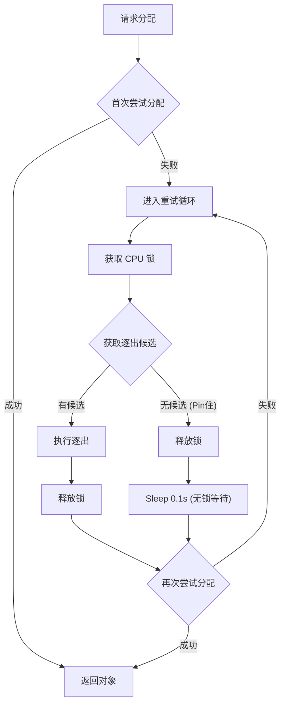

# LocalCPUBackend 源码分析

[< 返回存储架构概览](./lmcache_storage_overview.md)

`LocalCPUBackend` 构成了 LMCache 多级存储架构中的 **L1 本地内存缓存层**。它利用主机内存（Host Memory）作为最高速的缓存介质，提供微秒级的数据访问延迟。

更关键的是，`LocalCPUBackend` 在系统中不仅仅是一个存储后端，它还承担了 **核心内存分配器 (Core Memory Allocator)** 的重任。无论是本地磁盘的 I/O 中转，还是远程数据的网络传输，所有涉及内存对象（MemoryObj）创建的操作，最终都依赖于该模块进行物理内存的分配与管理。

> **架构定位**: 在 `lmcache_storage_overview.md` 定义的层级中，它是 L1 层。它是整个存储系统的“内存池”，直接对接 GPU 的 H2D/D2H 拷贝操作，并负责驱动下层存储（L2/L3/L4）的数据流转。
>
> **注意**: 在 Prefill-Decode 分离架构中，L1 层和 Allocator 的角色由 `PDBackend` 承担（详见 [PDBackend 源码分析](./pd_backend.md)），两者互斥。

---

## 1. 核心架构与组件

`LocalCPUBackend` 的设计核心围绕着“高效内存管理”与“低延迟索引”展开。它主要由以下三个核心组件构成：

1. **元数据索引 (`hot_cache`)**: 一个线程安全的字典，维护 Key 到 `MemoryObj` 的映射。
2. **内存分配器 (`memory_allocator`)**: 负责底层物理内存（Tensor）的分配与回收。
3. **缓存策略 (`cache_policy`)**: 决定内存不足时淘汰哪些数据的决策引擎（如 LRU）。

### 1.1 初始化与分配器选择

在初始化阶段，`LocalCPUBackend` 不仅负责加载配置，还会利用 `NUMADetector` 探测系统的 NUMA 拓扑结构（[L349](../lmcache/v1/storage_backend/local_cpu_backend.py#L349)），以确保后续分配的物理内存位于性能最优的计算节点上。

随后，代码会根据配置参数（参考 [initialize_allocator](../lmcache/v1/storage_backend/local_cpu_backend.py#L327-L424)）实例化以下三种内存分配器之一：

- **LazyMixedMemoryAllocator (重构中)**: 仅在真正写入数据时才通过 `torch.empty` 分配物理内存。目前正在重构中，暂不可用。
- **MixedMemoryAllocator (默认)**: 传统的预分配策略，在初始化时即占用固定大小的内存池。
- **PagedCpuGpuMemoryAllocator**: 专为 P2P 场景设计，要求内存块大小对齐，以便于 RDMA 或其他零拷贝传输。

### 1.2 动态容量与安全限制

为了规避 OOM（Out Of Memory）风险并保障系统稳定性，`LocalCPUBackend` 实现了**动态容量校准机制**。

参考代码 [\_calculate_effective_cpu_size](../lmcache/v1/storage_backend/local_cpu_backend.py#L271-L326)，系统能够实时探测宿主机的可用物理内存，在扣除配置的预留空间（`reserve_local_cpu_size`）后，动态计算出当前环境下的安全缓存容量上限。

```python
# Effective memory: min(configured_size, available_memory - reserve_size)
effective_cpu_size = min(configured_cpu_size, max_usable_memory)
```

---

## 2. 内存分配与自动逐出

`LocalCPUBackend` 最复杂的逻辑在于 `allocate` 方法。它是上层获取内存对象的唯一入口，同时也是触发缓存逐出（Eviction）的源头。

当上层模块（如 `StorageManager`）需要存储新的 KV Cache 时，必须首先向 `LocalCPUBackend` 申请物理内存。如果当前内存池已满，系统必须根据 LRU 策略“腾出”空间，这一过程被称为 **Allocate-Evict Loop**。

### 2.1 分配-逐出循环 (Allocate-Evict Loop)

为了确保**关键路径**的内存请求（如推理时的 Cache Miss 加载）总是能得到满足，`allocate` 采用了**阻塞式重试**机制（即代码中的 `while True` 循环）。该方法会持续尝试“逐出-分配”流程，直到获得足够的物理内存，绝不返回失败。

核心流程如下图所示：



代码参考 [allocate](../lmcache/v1/storage_backend/local_cpu_backend.py#L426-L526)：

```python
    def allocate(self, shapes, dtypes, ...):
        # 1. 快速路径：直接尝试分配 (无锁)
        memory_obj = self.memory_allocator.allocate(shapes, dtypes, fmt)
        if memory_obj is not None:
            return memory_obj

        # 2. 慢速路径：内存不足，进入逐出循环
        while True:
            # 2.1 获取并执行逐出 (Critical Section)
            # 仅在操作元数据时持有锁，最大化并发度
            with self.cpu_lock:
                evict_keys = self.cache_policy.get_evict_candidates(
                    self.hot_cache, num_candidates=1
                )

                if evict_keys:
                    # 逻辑删除：释放物理内存，移除索引
                    self.batched_remove(evict_keys, force=False)

            # 2.2 再次尝试分配 (无锁)
            # 注意：内存分配本身可能耗时，必须在锁外进行
            memory_obj = self.memory_allocator.allocate(shapes, dtypes, fmt)
            if memory_obj is not None:
                break

            # 2.3 忙等待 (无锁)
            # 如果刚才没能逐出任何数据（例如都被 Pin 住），则短暂休眠避免 CPU 空转
            if not evict_keys:
                time.sleep(0.1)
```

**关键逻辑深度解析**：

1. **极简临界区 (Critical Section Minimization)**:

   - 代码清晰地展示了 `with self.cpu_lock` 仅包裹了 `get_evict_candidates` 和 `batched_remove`。
   - **关键点**: 耗时的物理内存分配 (`allocate`) 和线程休眠 (`sleep`) 均在**锁外**执行。这不仅避免了阻塞其他读写请求，更是防止死锁（Deadlock）的必要条件。

2. **Pin 机制与资源死锁**:

   - `get_evict_candidates` 会自动跳过 `pin_count > 0` 的对象。
   - **典型场景**: 当 VLLM 正在读取某个 KV Cache 块时，会临时增加其 Pin 计数。此时该块不可被逐出。
   - 如果所有内存都被 Pin 住（极高负载），循环将进入 `sleep` 状态，等待其他线程释放引用（`ref_count_down` 或 `unpin`）。

3. **批量回收 (Batch Eviction)**:
   - 虽然示例展示了单次回收，但架构设计支持批量逐出（`num_candidates > 1`）。这有助于减少“分配-逐出-分配”的震荡频率，平滑内存压力。

### 2.2 架构优势：Write-All 策略下的零开销逐出

LMCache 采用的 **Write-All (全写)** 策略是提升 L1 性能的关键。在该架构下，KV Cache 在生成的瞬间便被异步推送到 L3 磁盘或 L4 远程存储，这意味着 L1 缓存中的数据始终是“干净”的（Clean）。

因此，`LocalCPUBackend` 的逐出过程无需承担昂贵的磁盘回写（Write-Back）开销，仅需执行内存释放操作。二者的性能差异在数量级上是巨大的：

- **传统架构 (Write-Back)**: 需等待磁盘 I/O 完成才能释放内存，耗时通常在 **毫秒级 (ms)**。
- **LMCache (Write-All)**: 仅涉及内存指针操作，耗时仅为 **微秒级 (μs)**。

这种设计确保了即便在内存压力极大的情况下，逐出操作也不会阻塞推理请求。此外，系统仅需发送轻量级的 `OpType.EVICT` 信号（用于一致性维护），进一步保证了系统的高吞吐量。

---

## 3. 缓存操作与生命周期管理

作为 LMCache 的最前端缓存，`LocalCPUBackend` 负责处理所有针对本地内存的高频访问请求。本章将深入剖析缓存对象的生命周期流转，包括数据的写入（Put）、读取（Get）、引用计数管理以及为了性能优化而设计的延迟更新机制。

这些操作的设计核心在于：**在保证多线程安全（Thread-Safety）的前提下，将临界区（Critical Section）的耗时降至最低**。

### 3.1 写入 (Put)

写入操作非常轻量，主要是更新索引和缓存策略。

代码参考 [submit_put_task](../lmcache/v1/storage_backend/local_cpu_backend.py#L142-L165)：

1. **加锁 (`cpu_lock`)**: 保护 `hot_cache`。
2. **更新索引**: `self.hot_cache[key] = memory_obj`。
3. **引用计数**: `memory_obj.ref_count_up()`，确保对象被 L1 持有。
4. **更新策略**: `cache_policy.update_on_put(key)`，如将 Key 移到 LRU 队列头部。

### 3.2 读取 (Get) 与 引用计数

读取操作通过 `get_blocking` 实现。为了防止在读取过程中数据被后台线程逐出，LMCache 严格依赖引用计数机制。

代码参考 [get_blocking](../lmcache/v1/storage_backend/local_cpu_backend.py#L183-L195)：

```python
    def get_blocking(self, key: CacheEngineKey) -> Optional[MemoryObj]:
        with self.cpu_lock:
            if key not in self.hot_cache:
                return None
            memory_obj = self.hot_cache[key]

            # 关键：增加引用计数
            # 防止 Caller 在使用前，对象被 Eviction 线程回收
            memory_obj.ref_count_up()
            return memory_obj
```

### 3.3 延迟策略更新 (Lazy Touch)

为了减少锁竞争，`LocalCPUBackend` 在读取命中（Hit）时，并不会立即更新 LRU 链表，而是采用了 **Lazy Touch** 机制。

- **记录**: 命中时仅将 Key 记录到 `self.keys_in_request` 列表中（参考 [contains](../lmcache/v1/storage_backend/local_cpu_backend.py#L119-L127)）。
- **批量更新**: 在请求结束时，显式调用 `touch_cache()` 方法，批量更新所有命中 Key 的 LRU 位置。

代码参考 [touch_cache](../lmcache/v1/storage_backend/local_cpu_backend.py#L129-L135)：

```python
    def touch_cache(self):
        # flip the order of the keys in the request
        with self.cpu_lock:
            # 这里的 reversed 很关键，因为 keys_in_request 是按访问顺序追加的
            # 我们需要保持这个顺序更新 LRU
            for key in reversed(self.keys_in_request):
                self.cache_policy.update_on_hit(key, self.hot_cache)
            self.keys_in_request = []
```

这种设计显著减少了高并发读取时的锁冲突，提升了吞吐量。

---

## 4. 并发控制与设计分析

`LocalCPUBackend` 使用一把粗粒度的互斥锁 `self.cpu_lock` 来保护元数据索引和缓存策略。

### 4.1 为什么使用粗粒度锁？

与 `LocalDiskBackend` 使用细粒度锁不同，`LocalCPUBackend` 选择了粗粒度锁。这是基于以下考量：

1. **纯内存操作**: L1 的所有操作（索引查找、LRU 更新）都是纯内存操作，耗时极短（微秒级）。
2. **Python GIL**: 在 Python 环境下，对于极短的临界区，复杂的细粒度锁管理开销可能超过其带来的并发收益。
3. **避免复杂性**: 粗粒度锁大大简化了内存回收（Eviction）时的并发处理，避免了 `MemoryObj` 在多线程下状态不一致的问题。

### 4.2 避免死锁

在 `allocate` 的忙等待（Busy Loop）期间，如果需要 `sleep` 等待内存释放，代码会确保**不持有锁**，从而避免死锁。

```python
    # do not hold the lock during sleep
    time.sleep(time_to_wait)
```

---

## 5. 关键配置参数

`LocalCPUBackend` 的行为由 `config.py` 中的以下参数控制，合理配置这些参数对性能至关重要。

配置文件：[config.py](../lmcache/v1/config.py)

| 配置项                             | 类型  | 默认值 | 说明                                                                                                                                  |
| :--------------------------------- | :---- | :----- | :------------------------------------------------------------------------------------------------------------------------------------ |
| `max_local_cpu_size`               | float | 5.0    | 本地 CPU 缓存的最大容量 (GB)。这是 L1 缓存的“硬上限”。(注：在 MLA 模式下，First Rank 可通过 `first_rank_max_local_cpu_size` 单独配置) |
| `reserve_local_cpu_size`           | float | 0.0    | 预留给系统的内存 (GB)。`effective_size = min(max_size, available - reserve)`。                                                        |
| `enable_lazy_memory_allocator`     | bool  | False  | 是否启用延迟内存分配器。目前建议保持关闭 (False)，因为该功能正在重构中。                                                              |
| `lazy_memory_initial_ratio`        | float | 0.2    | 延迟分配器的初始内存比例。初始时只占用少部分物理内存。                                                                                |
| `lazy_memory_expand_trigger_ratio` | float | 0.5    | 触发扩容的阈值。当使用量达到当前池的 50% 时，触发扩容。                                                                               |
| `enable_p2p`                       | bool  | False  | 是否启用 P2P 传输。开启后将强制使用 `PagedCpuGpuMemoryAllocator` 以支持零拷贝。                                                       |
