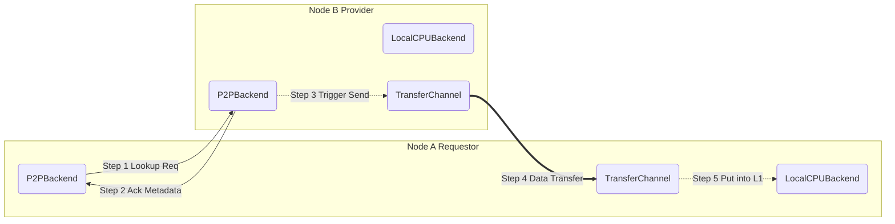

# P2PBackend 源码分析

[< 返回存储架构概览](./lmcache_storage_overview.md)

`P2PBackend` 构成了 LMCache 多级存储架构中的 **L2 弹性互联层**。它的核心理念是打破单机内存的物理隔离，通过高速网络（如 RDMA 或 TCP）将集群中其他节点的空闲内存汇聚成一个巨大的共享缓存池。

当本地 L1 内存未命中时，系统会优先尝试从邻居节点（Peer）“借用”数据，而不是直接回退到慢速的 L3 磁盘。

> **架构定位**: 在 `lmcache_storage_overview.md` 定义的层级中，它是 L2 层。它位于 L1 (Local CPU) 和 L3 (Local Disk) 之间，起到承上启下的作用。

---

## 1. 核心架构设计

`P2PBackend` 的设计遵循 **控制流与数据流分离** 的原则，以实现低延迟信令和高吞吐数据传输。

### 1.1 双平面架构

LMCache 将 P2P 通信解耦为两个独立的平面，分别处理元数据信令和实际数据传输。这种设计消除了队头阻塞 (HOL Blocking)，并允许针对不同类型的流量进行独立优化（例如，控制流追求低延迟，数据流追求高吞吐）。

1. **控制平面 (Control Plane)**:

   - **通信机制**: 基于 ZeroMQ (ZMQ) 的请求-响应模式。
   - **职责**: 处理元数据查询、握手（Handshake）、锁定资源、发送传输指令。
   - **关键组件**: `peer_lookup_url` (监听端口), `_handle_peer_requests` (请求处理循环)。

2. **数据平面 (Data Plane)**:

   - **通信机制**: 抽象化的 `TransferChannel`，支持多种底层实现（如 TCP Socket, RDMA/Nixl）。
   - **职责**: 负责 KV Cache Payload 的批量、零拷贝传输。
   - **关键组件**: `TransferChannel`, `async_batched_write`, `async_batched_read`.

### 1.2 组件交互图

下图展示了 P2P 数据检索的完整生命周期。整个过程分为两个阶段：

1. **控制平面交互**（步骤 1-2）：Requestor 向 Provider 发送元数据查询请求，确认数据位置和准备状态。
2. **数据平面传输**（步骤 3-5）：Provider 触发传输通道，通过高性能网络（RDMA/TCP）将数据块“推送”给 Requestor，并最终由 Requestor 写入 L1 缓存。



---

## 2. 核心代码解析

`P2PBackend` 类位于 [`lmcache/v1/storage_backend/p2p_backend.py`](../lmcache/v1/storage_backend/p2p_backend.py)，它继承自 `StorageBackendInterface`。

### 2.1 初始化与连接管理

P2P 连接是**惰性初始化** 的。系统启动时不会立即建立全互联，而是等到需要访问某个 Peer 时才建立连接。

```python
# lmcache/v1/storage_backend/p2p_backend.py

async def _ensure_peer_connection(self, target_peer_init_url: str, ...):
    # ... (省略部分代码)
    async with self.update_peer_lock:
        # ...
        # 1. 通过 TransferChannel 进行握手 (Handshake)
        init_ret_msg = await self.transfer_channel.async_lazy_init_peer_connection(...)

        # 2. 建立 ZMQ 控制连接 (控制平面)
        peer_lookup_url = init_ret_msg.peer_lookup_url
        lookup_socket = get_zmq_socket_with_timeout(...)

        # 3. 缓存连接信息
        self.target_peer_info_mapping[target_peer_init_url] = PeerInfo(...)
```

这种设计显著减少了大规模集群启动时的信令风暴。

### 2.2 数据检索全链路分析

本节详细解析了第一章所述 **5 步交互流程** 的代码实现。

#### 2.2.1 预备阶段：定位 Peer (Step 0)

在发起 P2P 请求前，首先需要知道数据在哪个节点。`batched_async_contains` 负责这一步（通常查询中心化 Controller）。

```python
# lmcache/v1/storage_backend/p2p_backend.py

async def batched_async_contains(self, lookup_id, keys, ...):
    # ... 发送查询请求 ...
    ret_msg = await self.lmcache_worker.async_put_and_wait_msg(msg)
    # ... 获取 target_peer_init_url ...

    if num_hit_chunks > 0:
        # 建立连接 (如果尚未建立)
        await self._ensure_peer_connection(target_peer_init_url)
        # 记录映射，供后续 Get 使用
        self.lookup_id_to_peer_mapping[lookup_id] = (target_peer_init_url, location)
```

#### 2.2.2 控制平面交互 (Step 1 & 2)

Requestor 确定目标后，通过 **控制平面 (ZMQ)** 发起请求并等待确认。这涵盖了交互图的 **Step 1 (Lookup Req)** 和 **Step 2 (Ack Metadata)**。

```python
# lmcache/v1/storage_backend/p2p_backend.py (Requestor Side)

async def batched_get_non_blocking(self, lookup_id, keys, ...):
    # 1. 预备接收缓冲区 (Step 5 预留)
    mem_objs = [self.local_cpu_backend.allocate(...) for key in keys]

    # 2. 获取内存地址索引 (供 RDMA 写入)
    local_indexes = self.transfer_channel.get_local_mem_indices(mem_objs)

    # 3. 构造请求消息 (Step 1: Lookup Req)
    msg = BatchedLookupAndGetMsg(
        lookup_id=lookup_id,
        receiver_id=self.peer_init_url,
        keys=str_keys,
        mem_indexes=local_indexes, # 关键：告诉 Peer 数据写到哪里
    )

    # 4. 发送 ZMQ 请求 (Step 1)
    peer_info = self.target_peer_info_mapping[target_peer_init_url]
    await peer_info.lookup_socket.send(...)

    # 5. 等待 Peer 确认 (Step 2: Ack Metadata)
    # 注意：这里的 recv() 实际上是在等待 Provider 确认"我已经收到请求并准备开始传输"
    resp = await peer_info.lookup_socket.recv()
```

#### 2.2.3 数据平面传输 (Step 3 & 4)

Provider 收到请求后，触发 **数据平面 (TransferChannel)** 的传输。这对应交互图的 **Step 3 (Trigger Send)** 和 **Step 4 (Data Transfer)**。

```python
# lmcache/v1/storage_backend/p2p_backend.py (Provider Side)

async def _handle_batched_lookup_and_get(self, msg):
    # 1. 从本地 L1 获取数据
    mem_objs = await self.local_cpu_backend.batched_get_non_blocking(...)

    # 2. 构建传输规范 (指向 Requestor 提供的地址)
    channel_transfer_spec = {
        "receiver_id": msg.receiver_id,
        "remote_indexes": msg.mem_indexes,
    }

    # 3. 触发零拷贝传输 (Step 3 & 4)
    # 底层由 RDMA/TCP 直接将数据写入 Requestor 的内存
    await self.transfer_channel.async_batched_write(
        objects=mem_objs,
        transfer_spec=channel_transfer_spec,
    )
```

#### 2.2.4 本地接收与完成 (Step 5)

得益于 `TransferChannel` 的零拷贝机制，数据直接抵达 `Step 1` 中预分配的 `mem_objs`。Requestor 等待传输完成信号即可。

```python
# lmcache/v1/storage_backend/p2p_backend.py

    # ... (接上文 await lookup_socket.recv())

    # 1. 解码响应消息
    ret_msg = msgspec.msgpack.decode(ret_msg_bytes, type=P2PMsg)

    # 2. 确认命中数量
    # 此时，Provider 已经通过 RDMA 将数据写入了 mem_objs 指向的内存区域
    num_hit_chunks = ret_msg.num_hit_chunks

    # 3. 返回就绪的内存对象
    hit_mem_objs = mem_objs[:num_hit_chunks]

    # 清理未命中的内存预分配
    for missed_mem_obj in mem_objs[num_hit_chunks:]:
        missed_mem_obj.ref_count_down()

    return hit_mem_objs
```

---

## 3. TransferChannel 抽象

为了适配不同的网络环境（TCP, RDMA, etc.），`P2PBackend` 使用 `TransferChannel` 隔离了底层传输细节。

代码位置: [`lmcache/v1/transfer_channel/`](../lmcache/v1/transfer_channel/)

### 3.1 接口定义

`BaseTransferChannel` (在 [`abstract.py`](../lmcache/v1/transfer_channel/abstract.py) 中定义) 是所有传输通道的基类。所有具体的传输通道都必须实现此接口，定义了初始化和批量读写的基本行为。

核心接口方法如下：

- `lazy_init_peer_connection`: 懒加载方式初始化与 Peer 的连接。
- `async_batched_write`: 将本地 objects 发送到远端（Push 模式）。
- `async_batched_read`: 从远端读取数据到本地 buffers。

```python
# lmcache/v1/transfer_channel/abstract.py

class BaseTransferChannel(metaclass=abc.ABCMeta):
    @abc.abstractmethod
    def lazy_init_peer_connection(
        self,
        local_id: str,
        peer_id: str,
        peer_init_url: str,
        init_side_msg: Optional[InitSideMsgBase] = None,
    ) -> Optional[InitSideRetMsgBase]:
        """懒加载方式初始化与 Peer 的连接"""
        raise NotImplementedError

    @abc.abstractmethod
    async def async_batched_write(self, objects, transfer_spec):
        """将本地 objects 发送到远端"""
        pass

    @abc.abstractmethod
    async def async_batched_read(self, buffers, transfer_spec):
        """从远端读取数据到本地 buffers"""
        pass
```

### 3.2 具体实现概览

LMCache 目前提供了以下三种 `TransferChannel` 实现，分别针对不同的使用场景：

**1. PySocketChannel**：

- **代码**: [`py_socket_channel.py`](../lmcache/v1/transfer_channel/py_socket_channel.py)
- **定位**: 基础实现 / 控制平面参考
- **描述**: 目前主要实现了基于 ZMQ 的控制平面握手与初始化逻辑。它通常作为其他 Channel 的基类（例如 `MockMemoryChannel`），用于复用标准的连接建立流程。未来计划扩展支持基于原生 TCP Socket 的数据传输能力。

**2. NixlChannel**：

- **代码**: [`nixl_channel.py`](../lmcache/v1/transfer_channel/nixl_channel.py)
- **定位**: 高性能生产级通道
- **描述**: 基于 [UCX](https://openucx.org/) (通过 `nixl` 库封装) 的高性能传输实现。它支持 RDMA 等高速网络协议，利用零拷贝（Zero-copy）和内存注册（Memory Registration）技术，在不同节点的 CPU/GPU 内存间实现低延迟、高吞吐的数据传输。这是生产环境中推荐的配置。

**3. MockMemoryChannel**：

- **代码**: [`mock_memory_channel.py`](../lmcache/v1/transfer_channel/mock_memory_channel.py)
- **定位**: 测试与调试
- **描述**: 继承自 `PySocketChannel`，但在数据平面使用进程内的全局字典 (`_GLOBAL_DATA_STORE`) 来模拟数据传输。它仅适用于单进程环境下的功能验证、单元测试或调试，不具备跨进程或跨网络传输能力。

### 3.3 NIXL 简介

NIXL (Network Interface for X-Layer) 是 LMCache 为了解决异构硬件环境下的高性能通信问题而引入的底层通信库。它向下屏蔽了具体的网络传输细节（如 RDMA/IB, RoCE, TCP, GPUDirect 等），向上提供统一的内存注册和数据搬运接口。

1. **统一抽象**: 无论底层是 UCX, GDS (GPUDirect Storage) 还是普通的 POSIX Socket，NIXL 都通过统一的 API 暴露给上层。
2. **零拷贝 (Zero-Copy)**: 通过 DMA (Direct Memory Access) 技术，数据可以直接从发送端的内存/显存传输到接收端的内存/显存，无需 CPU 参与数据拷贝。
3. **内存注册管理**: 自动处理内存区域的 Pin (锁定) 和 Registration (注册)，生成可供远端直接访问的句柄 (RKey)。

### 3.4 NixlChannel 实现详解

`NixlChannel` 是 LMCache 中适配 NIXL 库的具体实现类。它持有 `NixlAgent` 实例，负责将 LMCache 的 P2P 请求转化为 NIXL 的底层操作。

它的核心机制如下：

1. **内存注册 (Memory Registration)**:
   在 P2P 连接建立时 (`lazy_init_peer_connection`)，双方会交换内存区域的元数据 (`local_xfer_dlist_bytes`)。这允许底层网卡（如 RDMA NIC）直接访问注册的内存区域，实现 RDMA Write/Read。

   ```python
   # lmcache/v1/transfer_channel/nixl_channel.py

   def lazy_init_peer_connection(self, ...):
       # 1. 交换 Agent 元数据
       nixl_init_req = NixlInitRequest(local_meta_bytes=...)
       # ...

       # 2. 交换内存描述符 (Memory Descriptors)
       nixl_mem_reg_req = NixlMemRegRequest(
           local_xfer_dlist_bytes=self.nixl_agent.get_serialized_descs(...)
       )
       # ...

       # 3. 准备传输句柄 (Prepare Transfer Handles)
       remote_xfer_handlers = self.nixl_agent.prep_xfer_dlist(...)
       self.remote_xfer_handlers_dict[peer_id] = remote_xfer_handlers
   ```

2. **多后端支持**:
   NIXL 作为一个统一的传输抽象层，支持多种后端 (`UCX`, `GDS`, `POSIX` 等)，允许 LMCache 在不同硬件环境下（如支持 GPUDirect 的集群或普通以太网环境）无缝切换。

---

## 4. 关键设计思考

`P2PBackend` 的设计不仅要解决“数据传输”的问题，更要在高性能（低延迟、高吞吐）和高可用（容错、弹性）之间寻找平衡。以下是几个关键的设计决策及其背后的考量。

### 4.1 为什么需要双层 Lookup?

P2P 检索分为 Tier 2 (Controller) 和 Tier 3 (Peer Local)。

- **Tier 2**: Controller 拥有全局视图，能快速告诉 Client 哪台机器有数据，避免广播查询（Broadcast）。
- **Tier 3**: 虽然 Controller 认为数据在 Node B，但 Node B 可能刚将其驱逐。因此 Node B 在处理请求时会再次检查本地 Cache (`local_cpu_backend.batched_get_non_blocking`)，确保数据一致性。

### 4.2 数据传输模式: 为什么 Get 是 "Push"?

在分布式存储中，数据传输通常有两种模式：

- **Pull (Read)**: 接收方主动从发送方读取数据。
- **Push (Write)**: 发送方主动将数据写入接收方。

LMCache 在最核心的 **Get (Retrieval)** 流程中选择了 **Push** 模式（即 Sender 执行 RDMA Write），主要基于以下考量：

1. **减少网络交互 (RTT)**:
   - **Push 模式**: Requestor 在请求中直接携带“接收缓冲区地址” (`mem_indexes`)。Provider 找到数据后，直接写入该地址并发送完成信号。流程为：`Req -> Write + Done` (1.5 RTT)。
   - **Pull 模式**: Requestor 发送请求 -> Provider 锁定数据并返回“数据地址” -> Requestor 读取数据 -> Requestor 发送释放锁请求。流程繁琐，交互次数多。
2. **安全性**: 接收方暴露空白缓冲区供写入，比暴露源数据内存更安全。

而在 **Put (Migration)** 流程中，LMCache 使用 **Pull** 模式（Receiver 执行 RDMA Read）。因为接收方需要先分配内存，确信有足够空间后，再主动从发送方拉取数据，这更有利于接收方的内存管理。

### 4.3 故障恢复 (Failure Recovery)

LMCache 在 P2P 通信中实现了双端容错机制，确保在节点抖动或网络瞬断时的稳定性。

**1. Server 端 (Provider)**：

`_run_peer_request_handler_with_recovery` 封装了请求处理循环。如果 ZMQ Socket 崩溃，它会尝试重建 Socket。

```python
# lmcache/v1/storage_backend/p2p_backend.py

async def _run_peer_request_handler_with_recovery(self):
    while self.running.is_set():
        try:
            await self._handle_peer_requests()
        except Exception as e:
            logger.error("Peer request handler crashed: %s", e)
            await asyncio.sleep(0.1)
            # 关闭旧连接，准备重建
            self.async_peer_socket.close()
```

**2. Client 端 (Requestor)**：

在 `batched_get_non_blocking` 中，Requestor 具备重试与自动重连机制。

```python
# lmcache/v1/storage_backend/p2p_backend.py

    while retry_count < self.max_retry_count:
        try:
            # 发送请求...
            await lookup_socket.send(...)
        except zmq.ZMQError:
            # 捕获网络错误，尝试重连
            await self._ensure_peer_connection(target_peer_init_url, True)
            retry_count += 1
```

### 4.4 零拷贝与内存 Pinning

为了实现 RDMA 零拷贝，物理内存地址必须固定。因此，LMCache 在传输期间会 **Pin (锁定)** 相关内存页。

- **Requestor**: 在分配接收缓冲区时，底层 Allocator 会自动处理注册。
- **Provider**: 在处理 Get 请求时，会显式调用 `pin=True` 来查找数据。这不仅锁定了内存页，还会增加引用计数，防止数据在传输过程中被 LRU 策略驱逐。传输完成后，必须在 `finally` 块中 `unpin`，释放资源。

```python
# lmcache/v1/storage_backend/p2p_backend.py

    # Provider 处理 Get 请求
    num_hit_chunks = await self.local_cpu_backend.batched_async_contains(
        lookup_id=lookup_id,
        keys=keys,
        pin=True, # <--- 关键：锁定内存，防止被驱逐
    )
    # ... 执行传输 ...
    # finally: mem_obj.unpin()
```

---

## 5. NixlChannel 配置指南

NixlChannel 是基于 NIXL (Network Interface for X-Layer) 库实现的高性能传输通道，专为异构硬件环境（如 RDMA、RoCE、GPUDirect）设计。通过 NixlChannel，LMCache 可以实现节点间的零拷贝数据传输。

### 5.1 环境准备

在使用 NixlChannel 之前，请确保环境满足以下要求：

1. **硬件要求**

   - **网卡**：支持 RDMA 的网卡（如 NVIDIA ConnectX 系列），支持 InfiniBand 或 RoCE 协议。
   - **GPU（可选）**：如果使用 GPUDirect RDMA (GDR)，需要支持 GDR 的 NVIDIA GPU。

2. **软件依赖**

   - **LMCache**：已安装 LMCache。
   - **NIXL 库**：需要从 [NIXL GitHub 仓库](https://github.com/ai-dynamo/nixl) 编译并安装 NIXL。
   - **驱动与库**：
     - `libibverbs`, `librdmacm` (RDMA 基础库)
     - `ucx` (可选，如果使用 UCX 后端)
     - NVIDIA 驱动与 CUDA Toolkit (如果涉及 GPU)

3. **系统权限**
   - **内存锁定 (Memlock)**：RDMA 需要锁定物理内存。请确保用户的 `ulimit -l` 设置为 `unlimited` 或足够大。
   - **网络权限**：通常需要 `CAP_NET_RAW` 和 `CAP_NET_ADMIN` 权限以进行用户态网络操作。

### 5.2 LMCache 配置

在 LMCache 的配置文件（如 `config.yaml`）中，需要显式启用 P2P 并指定传输通道为 `nixl`。

#### 5.2.1 关键配置项

| 配置项               | 类型      | 默认值    | 说明                                                             |
| :------------------- | :-------- | :-------- | :--------------------------------------------------------------- |
| `enable_p2p`         | bool      | `False`   | 必须设置为 `True` 以启用 P2P 功能。                              |
| `transfer_channel`   | str       | `None`    | 必须设置为 `"nixl"` 以启用 NixlChannel。                         |
| `nixl_buffer_size`   | int       | -         | NIXL 传输缓冲区大小（字节）。建议至少设置为 1GB (`1073741824`)。 |
| `nixl_buffer_device` | str       | -         | 缓冲区所在设备。`"cpu"` 表示主机内存，`"cuda"` 表示 GPU 显存。   |
| `nixl_backends`      | list[str] | `["UCX"]` | 指定 NIXL 使用的底层后端，如 `["UCX"]` 或 `["GDS"]`。            |

#### 5.2.2 配置文件示例 (config.yaml)

```yaml
chunk_size: 256
local_device: "cuda:0"
# 启用 P2P 和 Controller
enable_p2p: true
enable_controller: true
controller_url: "http://localhost:8000" # 必须配置 Controller 以进行 Peer 发现

# P2P 网络配置
p2p_host: "192.168.1.10" # 本机 IP (用于被其他 Peer 访问)
p2p_init_ports: [50000] # 数据平面端口 (NixlChannel)
p2p_lookup_ports: [50001] # 控制平面端口 (ZMQ)

# NixlChannel 特有配置
transfer_channel: "nixl"
nixl_buffer_size: 1073741824 # 1GB RDMA 注册内存池
nixl_backends: ["UCX"] # 指定使用 UCX 后端
```

### 5.3 测试与验证

本节提供简单的 Ping-Pong 测试脚本，验证 NixlChannel 的连通性和性能。

> **注意**: 运行以下测试前，请确保：
>
> 1. 已启动 LMCache Controller (`lmcache-server`)。
> 2. 两台机器 (Instance A 和 Instance B) 网络互通，且端口未被占用。
> 3. 已正确安装 RDMA 驱动和依赖库。

#### 5.3.1 环境准备

在两台机器上分别创建配置文件 `config_a.yaml` 和 `config_b.yaml`，主要区别在于 `p2p_host`。

**Instance A (Sender):**

```yaml
# ... (其他配置同上)
p2p_host: "192.168.1.10"
```

**Instance B (Receiver):**

```yaml
# ... (其他配置同上)
p2p_host: "192.168.1.11"
```

#### 5.3.2 测试脚本

**Sender (Instance A):**

```python
from lmcache.v1.storage_backend import LMCacheEngine
from lmcache.v1.config import LMCacheEngineConfig
import time

# 加载配置
config = LMCacheEngineConfig.from_file("config_a.yaml")
engine = LMCacheEngine(config)

# 模拟生成并存入数据
key = "test_key"
data = b"x" * 1024 * 1024  # 1MB 数据 (实际场景中应为 Tensor)
# 注意：这里仅演示 put 触发本地存储和元数据上报
engine.put(key, data)
print(f"Put data for key: {key}")

# 保持进程存活以响应 P2P 请求
while True:
    time.sleep(1)
```

**Receiver (Instance B):**

```python
from lmcache.v1.storage_backend import LMCacheEngine
from lmcache.v1.config import LMCacheEngineConfig
import time

# 加载配置
config = LMCacheEngineConfig.from_file("config_b.yaml")
engine = LMCacheEngine(config)

# 等待 Sender 上报元数据到 Controller
time.sleep(2)

# 读取数据 (触发 P2P 查找和拉取)
key = "test_key"
retrieved_data = engine.get(key)

if retrieved_data:
    print(f"Successfully retrieved {len(retrieved_data)} bytes via NixlChannel")
else:
    print("Failed to retrieve data")
```

#### 5.3.3 常见问题排查

- **`ibv_open_device failed`**: 检查 RDMA 网卡驱动是否安装，以及是否有权限访问 `/dev/infiniband/uverbs*` 设备。
- **`Memory registration failed`**: 检查 `ulimit -l` 是否受限。
- **连接超时**: 检查防火墙设置，确保 `p2p_init_ports` 和 `p2p_lookup_ports` 端口开放，以及 RDMA 网络是否连通（使用 `ib_write_bw` 等工具测试）。
- **NIXL 日志**: 查看 LMCache 日志，确认是否有与 NIXL 相关的错误或警告。
