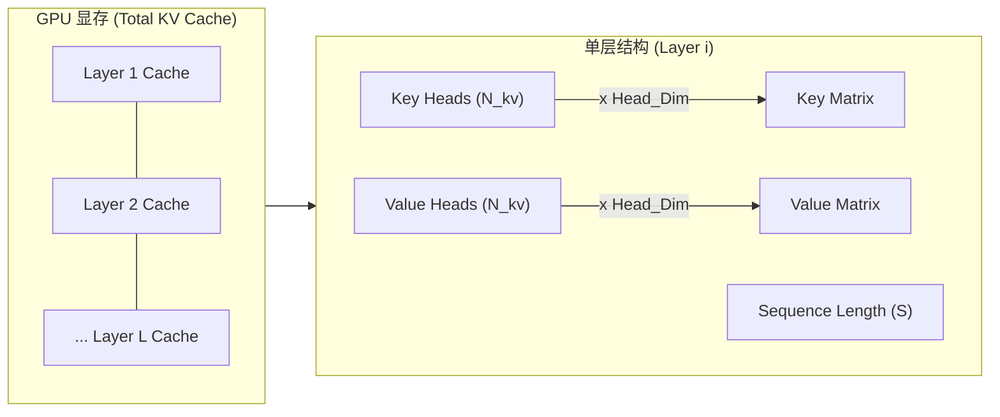

# LLM 模型推理显存占用深度的分析

在 LLM 的推理与部署中，**显存**通常是最先触达的系统性瓶颈：它同时约束了单卡可加载的模型规模、可服务的**并发请求数**（Batch Size），以及可支持的**上下文长度**（Context Window）。尤其在**自回归生成**（autoregressive decoding）场景中，显存会随输入与输出 Token 的累积而持续增长，进而影响吞吐与延迟的稳定性。

## 1. 推理显存的构成

与训练过程不同，推理过程不需要**存储梯度**（Gradients）和**优化器状态**（Optimizer States）。在主流 LLM 推理系统中，显存占用可以拆解为三类：

1. **模型权重（Model Weights）**：静态占用，取决于模型参数量和精度。
2. **KV Cache（Key-Value Cache）**：动态占用，随着序列长度和 Batch Size 线性增长。
3. **中间激活（Intermediate Activations）**：动态占用，推理时的临时计算缓冲区，通常较小。

需要强调的是，上述仅为理论显存占用。实际部署时还会有框架运行时开销（如 CUDA 上下文、算子 workspace、内存分配器碎片等），因此在估算总显存时应预留一定 buffer。

---

## 2. 模型权重（Model Weights）

这是显存占用的“基本盘”。无论是否进行推理，加载模型本身就需要占用这部分显存。

近似估算公式：

$$
\text{Memory}_{\text{weights}} \approx P \times b_{w}
$$

其中：

- $P$：模型参数量（Parameters）。
- $b_{w}$：每个参数占用的字节数（Bytes per parameter）。

常见精度下：

- FP16/BF16： $b_{w}=2$；
- INT8： $b_{w}=1$；
- INT4： $b_{w}=0.5$。

注：INT8/INT4 的估算通常未计入量化权重的 metadata（如 scale / zero-point 或 per-group scaling 参数），实际占用会略高，且不同推理框架的存储格式可能不同。

以 “Qwen3-0.6B” 为例（数量级估算）：

- FP16： $0.6 \times 10^9 \times 2 \approx 1.2 \times 10^9\,\text{Bytes} \approx 1.12\,\text{GiB}$（十进制约 1.2 GB； $1\,\text{GiB} = 1024^3\,\text{Bytes}$）。
- INT8：约为 FP16 的一半。
- INT4：约为 FP16 的四分之一。

---

## 3. 关键模型参数说明

在深入计算 KV Cache 之前，我们需要先明确几个决定显存占用的核心模型参数。以 Hugging Face `transformers` 库中常见的 `config.json` 为例（参考 [Qwen3-0.6B](https://huggingface.co/Qwen/Qwen3-0.6B/blob/main/config.json)）：

- **hidden_size ($H$)**：模型隐藏层的维度大小。
  - 它定义了 Token Embedding 的大小，通常也决定了注意力头的维度： $d_{head} = H / N_{attn}$。
  - 直接影响模型权重大小和 KV Cache 的总容量。
- **num_hidden_layers ($L$)**：模型的层数（Transformer Blocks）。层数越多，需要缓存的 KV 对就越多。
- **num_attention_heads ($N_{attn}$)**：注意力头的总数量。
- **num_key_alue_heads ($N_{kv}$)**：用于 Key 和 Value 的头数量。
  - 在标准 **MHA** (Multi-Head Attention) 中， $N_{kv} = N_{attn}$。
  - 在 **GQA** (Grouped-Query Attention) 或 **MQA** (Multi-Query Attention) 中， $N_{kv} < N_{attn}$，这能显著降低 KV Cache 的显存占用。
- **max_position_embeddings**：模型支持的最大上下文窗口长度。这是 $S$ (Sequence Length) 的理论上限。
- **vocab_size**：词表大小。
  - 主要影响 Embedding 层和最后的 LM Head 层的参数量。
  - 注：若配置中 `tie_word_embeddings: true`，则这两层共享参数。
- **intermediate_size**：MLP 层（Feed Forward Network）的中间维度。
  - 在传统结构（如 BERT/GPT-2）中通常为 $4H$。
  - 在现代使用 SwiGLU 激活的模型（如 Llama, Qwen）中，该值通常设定为 $\frac{8}{3}H$ 的近似值。
  - **特例**：在 Qwen3-0.6B 中，该值为 **3072** ($3H$)。这直接影响模型权重大小。

理解这些参数对于准确估算显存至关重要，尤其是在处理使用了 GQA 技术的现代大模型（如 Llama-2-70B, Qwen1.5-72B 等）时。

---

## 4. KV Cache 显存

KV Cache 是 LLM 推理优化中“空间换时间”的关键技术。在自回归生成阶段，如果不缓存历史 Token 的 Key/Value，则每一步解码都需要重复计算前缀部分的注意力相关结果，导致计算复杂度显著上升。实际系统通常采用 KV Cache 以换取更低的计算量与更稳定的延迟。

### 4.1 KV Cache 的物理结构与推导过程

为了理解 KV Cache 的显存公式，我们需要深入到模型内部，看一个 Token 在进入显存时究竟发生了什么。

#### 4.1.1 显存中的 KV Cache 结构

对于每一个 Token，在每一层，模型都会生成对应的 Key 和 Value 张量。假设模型的隐藏层维度为 $H$，注意力头总数为 $N_{attn}$，则每个头的维度 $D_{head} = H / N_{attn}$。

- **Key Tensor**: 形状为 `[N_kv, D_head]`
- **Value Tensor**: 形状为 `[N_kv, D_head]`

其中 $N_{kv}$ 是用于存储 KV 的头数（在 MHA 中等于 $N_{attn}$，在 GQA 中小于 $N_{attn}$）。

我们可以将整个 KV Cache 想象成一个巨大的三维矩阵，随着生成的 Token 数量增加，这个矩阵在“序列长度”方向上不断变长：



#### 4.1.2 逐步推导公式

**1. 单层、单 Token 的大小**：
   我们需要存储 Key 和 Value 两个矩阵。

```math
\text{Size}_{\text{layer, token}} = 2 \times N_{kv} \times D_{head} \times \text{Precision}
```

**2. 引入模型参数 $H$**：

利用关系 $D_{head} = \frac{H}{N_{attn}}$，替换上式中的 $D_{head}$：

```math
\text{Size}_{\text{layer, token}} = 2 \times N_{kv} \times \frac{H}{N_{attn}} \times \text{Precision}
```

整理后：

```math
\text{Size}_{\text{layer, token}} = 2 \times H \times \frac{N_{kv}}{N_{attn}} \times \text{Precision}
   ```

**3. 扩展到全模型（$L$ 层）**：

```math
\text{Size}_{\text{model, token}} = L \times \text{Size}_{\text{layer, token}} = 2 \times L \times H \times \frac{N_{kv}}{N_{attn}} \times \text{Precision}
```

**4. 扩展到总并发 ($B$) 和总长度 ($S$)**：

```math
\text{Total KV Memory} = B \times S \times \text{Size}_{\text{model, token}}
```

最终得到我们熟知的通用公式。

### 4.2 KV Cache 的通用估算公式

考虑到现代 LLM 普遍采用 MHA（多头注意力）或 GQA（分组查询注意力），我们将 KV Cache 的显存计算公式展开为包含模型核心参数的形式：

$$
\text{Memory}_{KV} \approx 2 \times b_{kv} \times L \times B \times S \times H \times \frac{N_{kv}}{N_{attn}}
$$

其中：

- **$2$**：同时缓存 Key 和 Value 矩阵。
- **$b_{kv}$**：KV 数据的精度（Bytes）。通常 FP16/BF16 为 2。
- **$L$**：模型层数（num_hidden_layers，见第 3 节定义）。
- **$B$**：并发请求数（Batch Size）。
- **$S$**：当前上下文总长度（Prompt + Generated），最大不超过 max_position_embeddings。
- **$H$**：模型隐藏层维度（hidden_size，见第 3 节定义）。
- **$N_{kv} / N_{attn}$**：GQA/MQA 的优化系数（KV 头数与总头数之比）。
  - 对于 MHA（如 Llama-1/Qwen-1），该比值为 1。
  - 对于 GQA/MQA，该比值在不同模型间差异很大（例如有的模型为 1/8 或 1/4，也存在 1/2 的配置），会线性影响 KV Cache 的显存占用。

对于 FP16/BF16 ($b_{kv}=2$)，公式可简化为：

$$
\text{Memory}_{KV} \approx 4 \times L \times H \times B \times S \times \frac{N_{kv}}{N_{attn}}
$$

### 4.3 每 Token 的 KV Cache 体积

为了计算**单个并发请求下，每增加 1 个 Token** 所带来的显存开销（即 KV Cache 的单位密度），我们将 $B=1$（单并发）和 $S=1$（单 Token）代入上式（FP16/BF16）：

$$
\text{Size}_{KV,\text{per-token}} \approx 4 \times L \times H \times \frac{N_{kv}}{N_{attn}}
$$

这条公式非常关键：它说明 KV Cache 的显存与序列长度、并发呈严格线性关系，而 GQA 技术通过降低 $N_{kv}/N_{attn}$ 比率直接减少了该系数。

### 4.4 例：Qwen3-0.6B 的单 Token KV Cache

以 Qwen3-0.6B 为例，根据其模型配置（见第 3 节），我们可以计算出极其紧凑的单 Token 显存占用：

- $L = 28$
- $H = 1024$
- $N_{attn} = 16$
- $N_{kv} = 8$ (GQA, ratio = 0.5)
- 单 Token KV Cache： $4 \times 28 \times 1024 \times (8/16) = 57{,}344\,\text{Bytes} \approx 56\,\text{KiB}$

相比于传统的 13B 级模型（单 Token 约 0.8 MB），小模型配合 GQA 技术使得 KV Cache 极小，这意味着在同样的显存预算下可以支持极大的并发或超长的上下文。

---

## 5. 中间激活与临时缓冲

在推理过程中，除了权重和 KV Cache，还需要显存来存储算子计算的中间结果（如 Attention 的打分矩阵、MLP 第一层的扩维输出等）。与 KV Cache 不同，这些中间张量通常在一次前向计算后即可释放，因此一般不会随生成 Token 累积。

- **特点**：用完即弃，不随序列长度累积，但受 Batch Size 和上下文长度影响较大。
- **阶段差异**：Prefill 阶段一次性处理完整 Prompt，中间张量规模通常更大；Decode 阶段每步仅处理 1 个新 Token，中间开销通常更小（仅存储单层激活）。

**工程估算建议**：

显存中的“非权重、非 KV”部分实际上包含两块：

1. **固定系统开销**：CUDA Context、框架运行时（如 PyTorch 的 CUDA 初始化与内存分配器元数据）、算子 workspace 等。该值受驱动版本、CUDA 版本、框架版本与算子选择影响较大，业界没有统一的“固定值”。实践中常见量级为数百 MB 到 1 GB+，建议以实际环境 `nvidia-smi`/框架统计为准（机制说明见参考资料 3-4）。
2. **动态激活**：与 Batch Size 呈线性关系。

因此，原本“权重显存的 20%”这一经验法则在不同推理框架/模型结构下并不稳健，且对小模型尤其容易低估固定开销。对于 Qwen3-0.6B 这样的小模型，更建议预留 **1 GB ~ 2 GB** 的固定余量作为工程 buffer（并在上线前以真实工作负载压测校准），而不是按权重比例计算。

$$
\text{Memory}_{\text{overhead}} \approx 1~\text{GiB} + \alpha \times B
$$

在容量规划时，为安全起见，我们通常建议：**总显存预算 - 权重 - 2GB = 可用 KV Cache**。这 2GB 包含了系统开销、激活值以及碎片冗余。
在工程实践中，也可将该项理解为 “减去 1 GB ~ 2 GB 的固定 buffer（保守取 2 GB）”。

---

## 6. 端到端估算流程（容量规划）

在做推理容量规划时，建议按如下步骤计算，并明确每一步的假设：

1. 确定权重精度与并行方式，估算 $\text{Memory}_{weights}$。
2. 选定服务侧目标：最大并发 $B$、最大总长度 $S$（Prompt + Output），估算 $\text{Memory}_{KV}$。
3. 预留系统开销与中间激活: $\text{Memory}_{overhead}$ 。
   - 大模型（>7B）：可按权重的 20% 估算。
   - 小模型（<1B）：建议直接预留 1 GB ~ 2 GB 固定值（保守取 2 GB），并在真实负载下校准。
4. 检查是否满足：

$$
\text{Memory}_{\text{weights}} + \text{Memory}_{KV} + \text{Memory}_{overhead} \le \text{GPU Memory Budget}
$$

下面给出一段伪代码，描述如何将上述公式落地到估算器中（示例仅用于说明计算流程）：

```python
# 输入：模型结构与服务目标 (Qwen3-0.6B)
P = 0.6e9         # 参数量（Parameters）
L = 28            # 层数（num_hidden_layers）
H = 1024          # 隐藏维度（hidden_size）
B = 32            # 并发（Batch Size）
S_prompt = 512    # 输入长度（prompt tokens）
S_gen = 512       # 输出长度（generated tokens）
N_attn = 16       # 注意力头数
N_kv = 8          # KV 头数 (GQA)

# 权重与 KV 精度
bw = 2            # FP16/BF16：2 bytes
bkv = 2           # FP16/BF16：2 bytes

# 计算：权重显存（Bytes）
mem_weights = P * bw

# 计算：KV Cache 显存（Bytes）
# 注意：引入 GQA 系数 N_kv / N_attn
S_total = S_prompt + S_gen
mem_kv = 2 * bkv * L * B * S_total * H * (N_kv / N_attn)

# 计算：系统开销与中间激活（Bytes）
# 对于小模型，通常建议预留固定 buffer（例如 1.5 GB ≈ 1.4 GiB）涵盖 CUDA Context + Activation + 碎片冗余
mem_overhead = 1.4 * 1024**3

mem_total = mem_weights + mem_kv + mem_overhead
```

## 7. 案例：A100-40G + Qwen3-0.6B（FP16）

假设单卡 A100-40G，运行 Qwen3-0.6B（BF16），并以“KV Cache 为主要可增长项”的场景来理解并发与长度的约束关系。下文为便于手算，使用 **GiB** 作为容量单位，并将“显存预算”视为 `nvidia-smi` 可见的总显存（实际可用预算还会因驱动/显示/多进程等因素而略小）。

### 7.1 静态门槛

- 权重显存：约 1.12 GiB（即 1.2 GB）。
- 系统开销预留：约 1.4 GiB（即 1.5 GB，含 CUDA Context + Activation + 余量）。
- **可用显存**： $40 - 1.12 - 1.4 \approx 37.48\,\text{GiB}$（其中 “40” 为示例预算，工程上请以实际机器 `nvidia-smi` 读数替换该值）。

### 7.2 并发与长度的约束（KV Cache 主导近似）

用“可用于 KV 的显存预算 / 单 Token KV”来估算可容纳的 Token 总量：

$$
\text{Max Token Capacity} \approx \frac{\text{Available Memory}}{\text{Size}_{KV,\text{per-token}}}
$$

沿用上文 $56\,\text{KiB}$ ($57{,}344\,\text{Bytes}$) 的单 Token KV Cache，预算为 37.48 GiB：

$$
\text{Max Token Capacity} \approx \frac{37.48 \times 1024^3}{57{,}344} \approx 701{,}842
$$

这意味着我们可以同时在显存中容纳超过 70 万个 Token！

这些 Token 需要分配给全部并发请求，因此最大并发可估算为：

$$
B_{max} \approx \frac{\text{Max Token Capacity}}{S}
$$

给出几个典型 $S$ 下的理论最大并发：

1. $S = 512$： $B_{max} \approx 701{,}842 / 512 \approx 1370$。
2. $S = 4096$： $B_{max} \approx 701{,}842 / 4096 \approx 171$。
3. $S = 32k$ ($32768$)： $B_{max} \approx 701{,}842 / 32768 \approx 21$。

**结论**：对于 0.6B 这样的小参数模型，配合 GQA 技术，显存几乎不再是瓶颈。在 A100 这样的硬件上，主要的瓶颈可能会转移到**计算能力**或**显存带宽**，而不是显存容量。这也解释了为什么小模型非常适合部署在端侧设备或消费级显卡上。

---

## 8. 速查公式（用于估算）

在估算 LLM 推理资源需求时，可使用以下速查公式：

1. 总显存需求（预算）：

   ```math
   M_{\text{total}} = M_{\text{weights}} + M_{\text{kv cache}} + M_{\text{overhead}}
   ```

2. KV Cache 估算（单卡、FP16/BF16）：

   ```math
   M_{\text{kv}} (\text{GiB}) \approx \frac{4 \times L \times H \times B \times S}{1024^3} \times \frac{N_{kv}}{N_{attn}}
   ```

3. 最大并发数估算（KV 主导近似）：

   ```math
   B_{\text{max}} \approx \frac{\text{GPU Mem Budget} - M_{\text{weights}} - M_{\text{overhead}}}{(4LH \cdot \frac{N_{kv}}{N_{attn}}) \times S}
   ```

其中 $\text{GPU Mem Budget}, M_{\text{weights}}, M_{\text{overhead}}$ 的单位需要与分母保持一致（推荐统一使用 Bytes，或统一使用 GiB 并在分子分母同时除以 $1024^3$）。

通过深入理解显存构成，我们可以更科学地进行硬件选型和系统优化，在成本与性能之间找到最佳平衡点。

---

## 参考资料

1. Tw93, “llm 参数量-计算量-显存占用分析”, URL: <https://www.armcvai.cn/2024-09-20/llm-params-flops.html>
2. LMCache, "KV Cache Size Calculator", URL: <https://github.com/LMCache/LMCache/tree/dev/examples/kv_cache_calculator>
3. PyTorch Documentation, "CUDA memory management", URL: <https://pytorch.org/docs/stable/notes/cuda.html#cuda-memory-management>
4. NVIDIA, "CUDA C++ Programming Guide", URL: <https://docs.nvidia.com/cuda/cuda-c-programming-guide/index.html>
