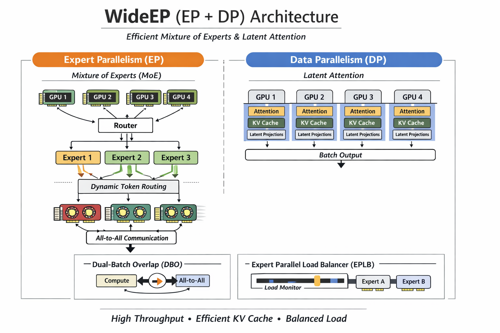

# 从 H200 到 Blackwell 的飞跃：vLLM 助力 DeepSeek 吞吐量飙升 5 倍的五大技术内幕

> 原文链接：[Driving vLLM WideEP and Large-Scale Serving Toward Maturity on Blackwell (Part I)](https://blog.vllm.ai/2026/02/03/dsr1-gb200-part1.html)

## 1. 引言：打破大模型推理的“算力墙”

在大语言模型（LLM）的生产级部署中，高性能推理服务正面临前所未有的挑战。特别是以 DeepSeek-V3/R1 为代表的超大规模混合专家架构（MoE）模型，其复杂的注意力机制与海量的参数量对计算密度、内存带宽以及集群通信提出了极高要求。

为了攻克这些瓶颈，vLLM 团队与 Meta、NVIDIA 展开深度合作，在 NVIDIA Blackwell (GB200) 平台上实现了推理性能的代际飞跃。通过将 Blackwell 的硬件革新与 vLLM 的底层软件栈深度融合，我们不仅刷新了性能基准，更重新定义了大规模推理的经济性。本文将深入解析 vLLM 助力 DeepSeek 实现 5 倍吞吐量提升背后的五个关键技术秘密。

---

## 2. 性能实测：不只是硬件的胜利

在 DeepSeek-V3/R1 的实际工作负载（2K 输入 / 2K 输出 tokens）下，GB200 展现出了近乎统治级的性能优势。

**核心 Benchmark 数据解析：**

- **Prefill 阶段**：GB200 达到了惊人的 26.2K TPGS（每 GPU 每秒 Token 数）。
- **Decode 阶段**：GB200 达到了 10.1K TPGS。
- **5 倍飞跃的验证**：相比于之前在 H200 上实现的 2.2K tok/s 解码吞吐量，GB200 在 vLLM 的优化下实现了约 4.6 倍（近 5 倍）的性能跨越。

**规模经济与部署密度提升**：
这种提升直接转化为了显著的成本优势。在处理同等规模的 DeepSeek-V3/R1 工作负载时：

- **Prefill**：GB200 仅需 **8 张卡**（4 个实例，每个实例 2 张卡），而 H200 需要 16 张卡。
- **Decode**：GB200 仅需 **8 张卡**（1 个实例），而 H200 则需要 32 张卡。

这意味着在解码场景下，GB200 将单节点的推理足迹缩减了 **4 倍**。配合 8 TB/s 的内存带宽（远超 H200 的 4.8 TB/s）以及 FP4 Tensor Core 的算力释放，超大规模模型的实时、低成本商业化服务已成现实。

---

## 3. 核心架构：WideEP —— 专为 DeepSeek 定制的并行策略

在深入 GB200 的硬件优化之前，我们需要理解 vLLM 针对 DeepSeek 模型设计的核心架构——**WideEP (Wide Expert Parallelism)**。

**MLA 的 KV Cache 挑战与 WideEP 的解法**：
DeepSeek-V3/R1 采用了 MLA（Multi-head Latent Attention）架构，虽然其 KV Cache 显著小于传统 MHA，但在传统的 Tensor Parallel (TP) 模式下，Latent Attention 的投影计算在不同 GPU 分片间存在大量重复，导致显存利用率低下。

vLLM 推出的 **WideEP (EP + DP)** 方案巧妙解决了这一问题，实现了“各司其职”：

- **Expert Parallelism (EP)**：让一组专家在多个 Rank 间共享，Token 被动态路由到对应专家计算，解决了稀疏激活带来的计算不均问题。
- **Data Parallelism (DP)**：在 DP 模式下，Attention 层被复制，使得 Latent Projections 在不同 Rank 间独立计算，从而提升了有效 Batch Size 和 KV Cache 的利用效率。

**配套的软件栈优化**：
为了支撑 WideEP 的高效运行，vLLM 引入了两项关键技术，如同为数据流搭建了“高速公路”和“智能调度中心”：

1. **Dual-batch Overlap (DBO)**：在 Decode 阶段，将通信（All-to-All）与计算交错推进。就像在繁忙的路口多开了一条通道，让数据流与计算流并行不悖，极大提高了 GPU 利用率。
2. **Expert Parallel Load Balancer (EPLB)**：针对推理请求中 Token 路由不均导致的“专家忙闲不均”问题，EPLB 通过滑动窗口统计负载，动态调整专家映射权重，实现了“不重启模型也能热迁移”的负载均衡。

---

## 4. 精度优化：NVFP4 与 FP8 的混合精度艺术

Blackwell 架构引入了革命性的 FP4 支持。vLLM 针对 DeepSeek 独特的模型拓扑，在 WideEP 部署中实施了差异化的精度策略，力求“好钢用在刀刃上”：

- **NVFP4 GEMM (MoE 专家权重与 O-proj)**：
  DeepSeek 的 MoE 专家权重和输出投影层采用了 4-bit 打包格式存储。vLLM 集成了 FlashInfer 的 TRTLLM-Gen GEMM 算子，在 Tensor Core 内部实现即时反量化，从而在维持模型生成质量的同时，最大化释放近乎原生的 FP4 吞吐潜力。

- **FP8 GEMM for MLA**：
  DeepSeek 的多头潜在注意力（MLA）架构涉及复杂的从潜在空间（Latent Space）到完整 Query 维度的上投影。由于该环节对精度高度敏感，vLLM 选择了 FP8 而非 FP4，在大幅提升计算速度的同时确保了注意力机制的精确性。

- **NVFP4 MoE Dispatch**：
  在 WideEP 模式下，专家并行带来的跨 GPU 通信是核心瓶颈。vLLM 实现了 NVFP4 Dispatch 技术，将 Token 激活量量化为 FP4 后再进行 All-to-All 通信。

> “通过将通信量减少 4 倍，NVFP4 dispatch 显著降低了 EP 部署中跨 GPU 的通信延迟，相比节省的巨大通信带宽，量化带来的开销微乎其微。”

---

## 5. 算子融合：打破内存带宽的桎梏

在推理过程中，频繁的内存读写（I/O）往往比计算本身更耗时。vLLM 通过精细的 Kernel Fusion 技术，将多级算子合并，最大程度减少中间结果对显存带宽的占用，消灭这一“隐形杀手”。

- **全链路融合**：
  针对 Decode 阶段，实现了 RoPE + Quant + Q Write 的三合一融合；针对 Prefill 阶段，则应用了 RoPE + Quant 融合。这消除了多次中间内存往返，显著提升了算子启动效率。

- **Concat K 优化**：
  DeepSeek MLA 架构将 Key 向量拆分为非位置嵌入（k_nope）和旋转位置嵌入（k_rope）。vLLM 利用 FlashInfer 的 `concat_mla_k` 算子，通过以下手段优化了拼接过程：
  1. **基于 Warp 的并行**：每个 Warp 处理 16 个头，确保高并发性。
  2. **向量化访问**：采用 8 字节/4 字节向量加载，吞吐量最大化。
  3. **软件流水线与 L2 预取**：在处理当前行时预取下一行，隐藏显存延迟。
  4. **寄存器复用**：共享的 RoPE 值仅加载一次至寄存器，避免 128 个头重复读取。

---

## 6. 显存策略：Weight Offloading v2 —— 以退为进的智慧

作为资深架构师，我们发现了一个反直觉的结论：**减少 GPU 数量反而能提升 Prefill 吞吐量**。

**逻辑解析**：
当 Prefill 任务的 Batch Size 达到 64K tokens 时，计算利用率已接近饱和。此时如果继续增加 GPU 数量，性能提升将面临边际效应，而 NCCL 集合通信（All-gather/Reduce-scatter）的开销却会随卡数增加。通过将 GPU 规模从 4 缩减至 2，我们可以使通信开销减半，从而获得更高的整体效率。

**Weight Offloading v2 的赋能**：
为了在更少的 GPU 上容纳庞大的 DeepSeek 模型，vLLM 引入了 v2 版权重卸载：

- **机制改进**：不同于 v1 版通过低效的 PCIe/UVA 访问 CPU 权重，v2 版采用异步预取（Asynchronous Prefetching）。在执行当前层计算时，利用独立的 CUDA 流提前将下一层权重从 CPU 加载（Onload）至 GPU。
- **GB200 核心优势**：Blackwell 的 NVLink-C2C 互联技术提供了极高的 CPU-GPU 吞吐，使得这种异步加载的延迟能够被计算过程完美隐藏，实现了真正的“无损”存储扩展。
- **配置参数**：用户可通过 `group_size`（层分组）、`num_in_group`（组内卸载层数）和 `prefetch_step`（预取步数）进行精细化调优。

---

## 7. 避坑指南：GB200 专属配置清单

在大规模 Batch 处理中，错误的配置会导致严重的“GPU 气泡”（计算空闲时间）。针对 GB200 的硬件特性，我们建议对 vLLM 的分块（Chunking）策略进行如下调整：

| 配置维度             | 默认设置 (V1 Engine) | GB200 推荐优化值           | 优化逻辑                              |
| :------------------- | :------------------- | :------------------------- | :------------------------------------ |
| MoE DP Chunk         | 开启 (1)             | 关闭 (0) (Prefill)         | 减少 DP 秩次间的同步频率，消除气泡    |
| DP Chunk Size        | 256                  | 等同于 Batch Size (Decode) | 减少分发/组合开销，最大化吞吐         |
| MoE Activation Chunk | 开启 (1)             | 关闭 (0)                   | 利用 GB200 大内存，直接处理全量 Batch |
| Output Proc Chunk    | 128                  | 2048 (Decode)              | 降低异步路径开销，显著提升解码效率    |

---

## 8. 结语：迈向 GB300 的新征程

vLLM 在 Blackwell 平台上的成功，是硬件极限算力与软件极致优化深度协同的结果。通过精度、算子、通信和显存管理的全面重构，我们成功释放了 DeepSeek 模型在 GB200 上的恐怖潜能。

展望未来，我们的工作重点将转向更复杂的专家负载均衡、极致的计算-通信重叠（Overlap），并致力于将 WideEP 架构推向即将到来的 GB300 平台。届时，凭借更强的 HBM 性能，我们将再次挑战 AI 推理的成本边界。

**启发性问题**：当硬件互联带宽（NVLink-C2C）不再是阻碍权重点对点流动的瓶颈时，软件栈的深度优化将如何重新定义大模型推理的每 Token 成本极限？这正是我们不断探索的终极命题。
