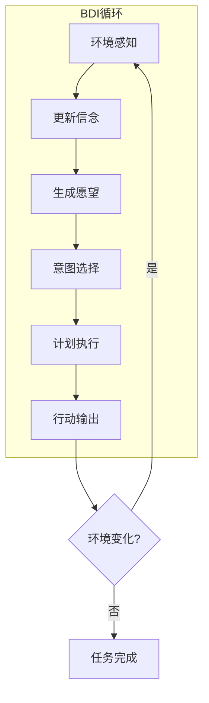
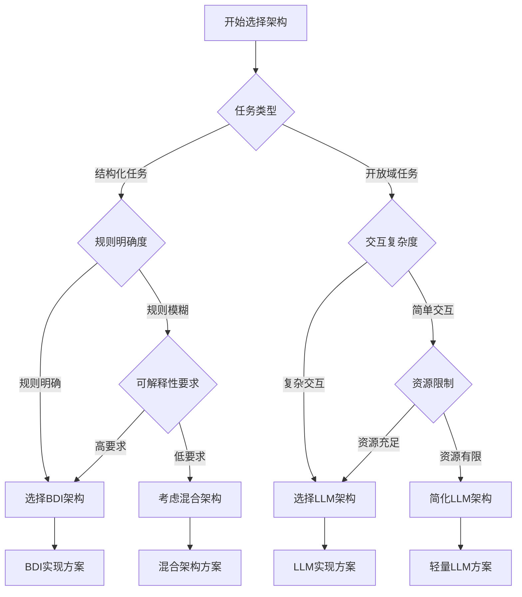

# 第一天：多智能体系统理论基础

## 学习目标

通过本课程的学习，学员将能够：

1. 多智能体系统概论

   - 理解多智能体系统的基本概念和定义
   - 掌握智能体的四大核心特征
   - 了解多智能体系统与传统单体应用的区别

2. 智能体架构模式深度解析

   - 深入理解 BDI（信念-愿望-意图）架构
   - 掌握现代 LLM 驱动的智能体架构
   - 学会根据应用场景选择合适的架构模式

3. 智能体通信与协作机制
   - 掌握多种智能体通信模式
   - 理解协调策略和任务分配机制
   - 学习 A2A 通信协议标准

## 参考项目

**💡 实际代码参考**：本课程的理论概念在项目中都有对应的实现，主要参考文件包括：

- `multi_agent_system/main.py` - 多智能体系统主架构
- `multi_agent_system/src/agents/base_agent.py` - BDI 智能体基础类
- `multi_agent_system/src/core/message_bus.py` - 智能体通信机制
- `multi_agent_system/src/coordination/` - 协调策略实现
- `customer_service_system.py` - 企业级客服系统案例

基于实际项目 `multi_agent_system/` 的架构设计，我们的多智能体系统采用了以下核心架构：

> **💡 代码参考**：完整的系统架构实现请参考 [main.py](../../../../08_agentic_system/multi_agent/multi_agent_system/main.py), 该文件包含了多智能体系统的核心架构设计和智能体注册机制。

**核心架构组件：**

- **AgentType 枚举**：定义智能体类型（协调者、专业智能体、监控智能体、网关智能体）
- **SystemArchitecture**：系统架构配置类，包含最大智能体数量、消息队列大小等配置
- **MultiAgentSystemCore**：系统核心类，负责智能体注册、消息总线管理、协调和监控

---

## 1. 多智能体系统概论（2 学时）

### 1.1 多智能体系统核心概念

多智能体系统（Multi-Agent System, MAS）是一个由多个自主智能体组成的分布式计算系统，这些智能体通过协作、竞争或协商的方式共同解决复杂问题。与传统的单体应用不同，MAS 体现了"分而治之"的设计哲学。

**核心定义：**

- **智能体（Agent）**：具有自主性、社会性、反应性和主动性的计算实体
- **多智能体系统（MAS）**：多个智能体协同工作的分布式系统
- **环境（Environment）**：智能体运行和交互的外部环境
- **协作（Cooperation）**：智能体间为实现共同目标的合作机制

### 1.2 智能体的四大核心特征

| 特征                         | 详细说明                                                                     | 技术实现                                             | 应用示例                                           |
| ---------------------------- | ---------------------------------------------------------------------------- | ---------------------------------------------------- | -------------------------------------------------- |
| **自主性（Autonomy）**       | 智能体能够在没有外部直接控制的情况下独立运行，根据内部状态和环境信息做出决策 | 基于规则引擎、机器学习模型或强化学习算法实现决策逻辑 | 智能客服机器人自主判断用户意图并选择合适的回复策略 |
| **社会性（Social Ability）** | 智能体具备与其他智能体或人类用户进行有效交互的能力                           | 通过消息传递、API 调用、共享内存等方式实现通信       | 多个分析智能体协作完成市场研究报告                 |
| **反应性（Reactivity）**     | 智能体能够感知环境变化并及时做出适当响应                                     | 事件驱动架构、实时数据流处理、传感器集成             | 风险监控智能体检测到异常交易立即触发告警           |
| **主动性（Pro-activeness）** | 智能体不仅被动响应，还能主动采取行动以实现既定目标                           | 目标导向的规划算法、主动学习机制                     | 内容创作智能体主动收集热点话题并生成相关内容       |

### 1.3 多智能体系统的应用场景

**1. 智能客服系统：**

- 接待智能体：用户接待与意图识别
- 专家智能体：专业问题解答
- 管理智能体：任务协调与质量控制

**2. 金融分析系统：**

- 数据收集智能体：市场数据实时采集
- 分析智能体：技术分析与基本面分析
- 风险控制智能体：风险评估与预警

**3. 内容创作平台：**

- 研究智能体：热点话题收集与分析
- 创作智能体：内容生成与优化
- 审核智能体：内容质量检查与合规性审核

### 1.4 与传统单体应用的对比

| 维度         | 传统单体应用     | 多智能体系统                   |
| ------------ | ---------------- | ------------------------------ |
| **架构模式** | 集中式、单一进程 | 分布式、多智能体协作           |
| **扩展性**   | 垂直扩展为主     | 水平扩展，动态增减智能体       |
| **容错性**   | 单点故障风险     | 分布式容错，局部故障不影响整体 |
| **专业化**   | 功能耦合度高     | 智能体专业化分工，职责明确     |
| **维护性**   | 修改影响全局     | 模块化维护，影响范围可控       |
| **复杂度**   | 业务逻辑集中     | 分布式复杂度，但单个智能体简单 |

### 1.5 实践环节

**案例分析：智能客服系统：**

让我们分析一个典型的智能客服系统，理解多智能体系统的实际应用：

> **💡 代码参考**：完整的智能客服系统实现请参考 [customer_service_system.py](../../../../08_agentic_system/multi_agent/multi_agent_system/src/examples/customer_service_system.py)，该文件展示了多智能体协作处理客户咨询的完整流程。

**系统架构：**

- **ReceptionAgent（接待智能体）**：负责用户接待和意图识别
- **ExpertAgents（专家智能体群）**：包括技术专家、销售专家、账务专家
- **SupervisorAgent（管理智能体）**：负责质量监控和流程管理
- **MessageBus（通信总线）**：智能体间的消息传递机制

**处理流程：**

1. 接待智能体分析用户意图
2. 路由到合适的专家智能体
3. 管理智能体监控响应质量

**小组讨论题目：**

1. 在您的业务领域中，哪些场景适合使用多智能体系统？
2. 如何设计智能体的分工和协作机制？
3. 多智能体系统相比传统方案有哪些优势和挑战？

---

## 2. 智能体架构模式深度解析（3 学时）

### 2.1 经典 BDI 架构详解

BDI（Belief-Desire-Intention）架构是智能体系统的经典理论框架，由 Michael Bratman 在 1987 年提出，基于实用推理理论构建。

#### 2.1.1 BDI 三大核心组件

| 组件                   | 定义                               | 特征                         | 技术实现                     | 应用示例                                  |
| ---------------------- | ---------------------------------- | ---------------------------- | ---------------------------- | ----------------------------------------- |
| **信念（Beliefs）**    | 智能体对环境状态的认知和知识表示   | 动态更新、可能不完整或不准确 | 知识库、事实数据库、环境模型 | "当前股价为 100 元"、"用户偏好科技类新闻" |
| **愿望（Desires）**    | 智能体希望达到的目标状态或期望结果 | 可能相互冲突、需要优先级排序 | 目标栈、偏好函数、效用模型   | "最大化投资收益"、"提高用户满意度"        |
| **意图（Intentions）** | 智能体承诺执行的具体行动计划       | 从愿望中筛选、具有执行承诺性 | 计划序列、行动队列、执行策略 | "购买 100 股科技股"、"推荐 5 篇相关文章"  |

> **💡 实际代码参考**：完整的 BDI 架构实现可参考项目中的 `base_agent.py` 文件，该文件提供了企业级的 BDI 智能体基础类，包含完整的信念、愿望、意图管理机制。

#### 2.1.2 BDI 认知循环



#### 2.1.3 企业级 BDI 智能体实现

**代码引用**: 完整实现请参考 `multi_agent_system/src/agents/base_agent.py`

企业级 BDI 智能体的核心实现特点：

**核心数据结构**：

- `AgentStatus`: 智能体状态枚举（空闲、思考、行动、通信、错误）
- `Belief`: 信念数据结构，包含置信度、来源和时间戳
- `Desire`: 愿望数据结构，支持优先级和条件设定
- `Intention`: 意图数据结构，包含执行计划和资源分配

**BDI 核心循环**：

1. **感知(Perceive)**: 从环境获取信息并更新信念库
2. **思考(Deliberate)**: 基于信念生成和优先排序愿望
3. **规划(Plan)**: 将愿望转化为可执行的意图
4. **执行(Execute)**: 实施意图并监控执行状态

**企业级特性**：

- 信念过期机制，确保信息时效性
- 性能指标监控，支持系统优化
- 异常处理和错误恢复
- 资源分配和截止时间管理
- 日志记录和调试支持

**实现特点**：

- **完整的 BDI 循环**：感知 → 思考 → 规划 → 执行
- **企业级特性**：错误处理、性能监控、资源管理
- **可扩展设计**：抽象方法支持不同应用场景
- **状态管理**：完整的智能体生命周期管理

### 2.3 现代 LLM 驱动架构详细解析

现代 LLM 驱动的智能体架构代表了人工智能发展的最新趋势，以大型语言模型为核心，结合记忆系统和工具集成，实现更加灵活和强大的智能体能力。

#### 2.3.1 核心组件架构

| 组件             | 功能描述                 | 技术特点                           | 实现技术                                  | 典型应用                       |
| ---------------- | ------------------------ | ---------------------------------- | ----------------------------------------- | ------------------------------ |
| **LLM 推理引擎** | 自然语言理解、推理、生成 | 端到端学习、上下文感知、多模态支持 | Transformer 架构、注意力机制、预训练+微调 | GPT-4、Claude、LLaMA           |
| **记忆系统**     | 信息存储与检索           | 多层次记忆、动态更新、关联检索     | 向量数据库、图数据库、关系数据库          | 对话历史、用户偏好、知识图谱   |
| **工具集成框架** | 外部能力扩展             | 动态调用、结果整合、错误处理       | 函数调用、插件系统、微服务架构            | API 调用、代码执行、多模态处理 |

#### 2.3.2 记忆系统层次结构

| 记忆类型     | 存储内容                 | 生命周期 | 访问模式   | 技术实现             |
| ------------ | ------------------------ | -------- | ---------- | -------------------- |
| **短期记忆** | 当前对话上下文、临时状态 | 会话级别 | 快速读写   | 内存缓存、Redis      |
| **工作记忆** | 任务相关中间结果         | 任务级别 | 结构化访问 | 临时数据库、文件系统 |
| **长期记忆** | 历史交互、学习偏好       | 持久化   | 语义检索   | 向量数据库、知识图谱 |

#### 2.3.3 LLM 智能体实现

```python
import openai
from typing import Dict, List, Any, Optional
from dataclasses import dataclass

@dataclass
class MemoryItem:
    """记忆项数据结构"""
    content: str
    timestamp: datetime
    importance: float
    tags: List[str]

class ConversationMemory:
    """对话记忆管理"""

    def __init__(self, max_size: int = 1000):
        self.max_size = max_size
        self.short_term: List[MemoryItem] = []
        self.long_term: Dict[str, MemoryItem] = {}

    def add_memory(self, content: str, importance: float = 0.5):
        """添加记忆"""
        memory = MemoryItem(
            content=content,
            timestamp=datetime.now(),
            importance=importance,
            tags=self.extract_tags(content)
        )

        self.short_term.append(memory)

        # 重要记忆转入长期记忆
        if importance > 0.8:
            key = self.generate_key(content)
            self.long_term[key] = memory

    def retrieve_relevant(self, query: str, limit: int = 5) -> List[MemoryItem]:
        """检索相关记忆"""
        # 实现语义相似度检索
        relevant_memories = []
        # ... 检索逻辑
        return relevant_memories

class LLMAgent:
    """LLM驱动的智能体"""

    def __init__(self, name: str, role: str, model: str = "gpt-4"):
        self.name = name
        self.role = role
        self.model = model
        self.memory = ConversationMemory()
        self.tools = self.load_tools()
        self.context = {}

    async def process(self, input_data: Dict[str, Any]) -> Dict[str, Any]:
        """智能体主处理流程"""

        # 1. 上下文理解
        context = await self.understand_context(input_data)

        # 2. 记忆检索
        relevant_memories = self.memory.retrieve_relevant(
            input_data.get('query', ''), limit=5
        )

        # 3. LLM推理
        response = await self.llm_reasoning(context, relevant_memories)

        # 4. 工具调用（如需要）
        if self.needs_tool_call(response):
            tool_results = await self.call_tools(response)
            response = await self.integrate_tool_results(response, tool_results)

        # 5. 记忆更新
        self.memory.add_memory(
            f"Input: {input_data}, Output: {response}",
            importance=self.calculate_importance(input_data, response)
        )

        return response

    async def llm_reasoning(self, context: Dict, memories: List[MemoryItem]) -> str:
        """LLM推理过程"""

        # 构建提示词
        prompt = self.build_prompt(context, memories)

        # 调用LLM
        response = await openai.ChatCompletion.acreate(
            model=self.model,
            messages=[
                {"role": "system", "content": f"You are {self.role}"},
                {"role": "user", "content": prompt}
            ],
            temperature=0.7
        )

        return response.choices[0].message.content

    def build_prompt(self, context: Dict, memories: List[MemoryItem]) -> str:
        """构建LLM提示词"""
        prompt_parts = [
            f"Role: {self.role}",
            f"Context: {context}",
            "Relevant memories:"
        ]

        for memory in memories:
            prompt_parts.append(f"- {memory.content}")

        prompt_parts.append("Please provide a helpful response based on the above information.")

        return "\n".join(prompt_parts)
```

### 2.4 架构对比与选择指南

#### 2.4.1 详细对比分析

| 维度         | BDI 架构           | 现代 LLM 架构      |
| ------------ | ------------------ | ------------------ |
| **理论基础** | 实用推理理论       | 深度学习理论       |
| **知识表示** | 符号化、结构化     | 分布式、向量化     |
| **推理方式** | 逻辑推理、规则匹配 | 神经网络、模式识别 |
| **学习能力** | 有限的规则学习     | 强大的端到端学习   |
| **可解释性** | 高（逻辑链清晰）   | 低（黑盒模型）     |
| **实时性**   | 中等（推理开销）   | 高（并行计算）     |
| **扩展性**   | 低（手工设计）     | 高（自动学习）     |
| **适用场景** | 确定强劲、规则明确 | 开放域、复杂交互   |
| **典型应用** | 工业控制、专家系统 | 对话助手、内容生成 |
| **开发成本** | 高（专业知识）     | 中（模型调用）     |
| **运行成本** | 低（轻量计算）     | 高（GPU 资源）     |

#### 2.4.2 选择决策树



### 2.5 实践环节

#### 2.5.1 代码演示：BDI 架构实现

```python
# 演示：智能投资顾问的BDI实现
class InvestmentAdvisorAgent(BDIAgent):
    """智能投资顾问智能体"""

    def generate_desires(self, beliefs: Dict[str, Belief]) -> List[Desire]:
        """根据市场信念生成投资愿望"""
        desires = []

        # 检查市场趋势belief
        if 'market_trend' in beliefs:
            trend = beliefs['market_trend'].value
            if trend == 'bullish':
                desires.append(Desire(
                    goal="increase_stock_allocation",
                    priority=8,
                    conditions={'risk_tolerance': 'moderate'}
                ))
            elif trend == 'bearish':
                desires.append(Desire(
                    goal="increase_bond_allocation",
                    priority=9,
                    conditions={'preserve_capital': True}
                ))

        return desires

# 使用示例
advisor = InvestmentAdvisorAgent("advisor_001")

# 感知市场环境
market_data = {
    'market_trend': 'bullish',
    'volatility': 'low',
    'interest_rate': 2.5
}
advisor.perceive(market_data)

# 执行BDI循环
advisor.deliberate()
advisor.plan()
advisor.execute()
```

#### 2.5.2 动手实验：LLM 智能体构建

```python
# 实验：构建简单的LLM客服智能体
class CustomerServiceAgent(LLMAgent):
    """客服智能体"""

    def __init__(self):
        super().__init__(
            name="CustomerService",
            role="Professional customer service representative",
            model="gpt-3.5-turbo"
        )
        self.knowledge_base = self.load_knowledge_base()

    async def handle_customer_query(self, query: str) -> str:
        """处理客户查询"""

        # 分析查询意图
        intent = await self.analyze_intent(query)

        # 检索相关知识
        knowledge = self.search_knowledge(intent)

        # 生成回复
        response = await self.process({
            'query': query,
            'intent': intent,
            'knowledge': knowledge
        })

        return response['content']

    async def analyze_intent(self, query: str) -> str:
        """分析用户意图"""
        prompt = f"Analyze the intent of this customer query: {query}"
        # 调用LLM分析意图
        return "billing_inquiry"  # 简化示例

    def search_knowledge(self, intent: str) -> List[str]:
        """搜索相关知识"""
        return self.knowledge_base.get(intent, [])

# 使用示例
async def demo():
    agent = CustomerServiceAgent()
    response = await agent.handle_customer_query(
        "I have a question about my monthly bill"
    )
    print(f"Agent response: {response}")
```

#### 2.5.3 架构设计练习

**练习题：为特定场景选择合适架构：**

**场景 1：智能制造系统：**

- 需求：控制生产线、质量检测、故障诊断
- 特点：规则明确、实时性要求高、安全关键
- 推荐架构：BDI 架构
- 理由：规则明确、可解释性强、实时响应

**场景 2：内容创作助手：**

- 需求：文章写作、创意生成、多语言支持
- 特点：开放域任务、创造性要求高、用户交互复杂
- 推荐架构：LLM 架构
- 理由：强大的语言能力、创造性、适应性强

**场景 3：金融风控系统：**

- 需求：风险评估、合规检查、决策解释
- 特点：规则与 AI 结合、高可解释性、准确性要求高
- 推荐架构：混合架构
- 理由：结合规则的可解释性和 AI 的学习能力

---

## 3. 智能体协作机制（3 学时）

## 3. 智能体通信与协作机制（3 学时）

### 3.1 通信模式与实现

智能体间的有效通信是多智能体系统成功的关键。不同的通信模式适用于不同的应用场景。

#### 3.1.1 主要通信模式对比

| 通信模式      | 适用场景             | 优势                 | 劣势           | 实现复杂度 |
| ------------- | -------------------- | -------------------- | -------------- | ---------- |
| **直接通信**  | 私密交互、实时协作   | 低延迟、高效率       | 连接管理复杂   | 中等       |
| **发布-订阅** | 事件广播、松耦合系统 | 可扩展性强、解耦合   | 消息顺序难保证 | 低         |
| **共享内存**  | 高性能数据共享       | 访问速度快           | 并发控制复杂   | 高         |
| **消息队列**  | 异步处理、负载均衡   | 可靠性高、支持持久化 | 增加系统复杂度 | 中等       |

#### 3.1.2 通信模式实现示例

**1. 直接通信实现：**

```python
import asyncio
from typing import Dict, Any, Callable

class DirectCommunication:
    """直接通信实现"""

    def __init__(self):
        self.agents: Dict[str, 'Agent'] = {}
        self.connections: Dict[str, Dict[str, bool]] = {}

    def register_agent(self, agent_id: str, agent: 'Agent'):
        """注册智能体"""
        self.agents[agent_id] = agent
        self.connections[agent_id] = {}

    def establish_connection(self, sender_id: str, receiver_id: str):
        """建立连接"""
        if sender_id in self.connections:
            self.connections[sender_id][receiver_id] = True

    async def send_message(self, sender_id: str, receiver_id: str, message: Dict[str, Any]):
        """发送消息"""
        if (sender_id in self.connections and
            receiver_id in self.connections[sender_id] and
            receiver_id in self.agents):

            await self.agents[receiver_id].receive_message(sender_id, message)
            return True
        return False

# 使用示例
class Agent:
    def __init__(self, agent_id: str):
        self.agent_id = agent_id
        self.message_handlers: Dict[str, Callable] = {}

    async def receive_message(self, sender_id: str, message: Dict[str, Any]):
        """接收消息"""
        [message_type](sender_id, message) = message.get('type', 'default')
        if message_type in self.message_handlers:
            await self.message_handlersmessage_type
        else:
            print(f"Agent {self.agent_id} received message from {sender_id}: {message}")
```

**2. 发布-订阅模式实现：**

```python
from collections import defaultdict
from typing import Set, Callable

class PubSubSystem:
    """发布-订阅系统"""

    def __init__(self):
        self.subscribers: Dict[str, Set[str]] = defaultdict(set)
        self.agents: Dict[str, 'Agent'] = {}

    def register_agent(self, agent_id: str, agent: 'Agent'):
        """注册智能体"""
        self.agents[agent_id] = agent

    def subscribe(self, agent_id: str, topic: str):
        """订阅主题"""
        self.subscribers[topic].add(agent_id)

    def unsubscribe(self, agent_id: str, topic: str):
        """取消订阅"""
        self.subscribers[topic].discard(agent_id)

    async def publish(self, topic: str, message: Dict[str, Any]):
        """发布消息"""
        if topic in self.subscribers:
            tasks = []
            for agent_id in self.subscribers[topic]:
                if agent_id in self.agents:
                    task = self.agents[agent_id].handle_event(topic, message)
                    tasks.append(task)

            if tasks:
                await asyncio.gather(*tasks)

# 使用示例
class EventDrivenAgent(Agent):
    def __init__(self, agent_id: str, pubsub: PubSubSystem):
        super().__init__(agent_id)
        self.pubsub = pubsub
        self.pubsub.register_agent(agent_id, self)

    def subscribe_to_events(self, topics: List[str]):
        """订阅事件"""
        for topic in topics:
            self.pubsub.subscribe(self.agent_id, topic)

    async def handle_event(self, topic: str, message: Dict[str, Any]):
        """处理事件"""
        print(f"Agent {self.agent_id} handling event {topic}: {message}")

    async def publish_event(self, topic: str, data: Dict[str, Any]):
        """发布事件"""
        await self.pubsub.publish(topic, {
            'sender': self.agent_id,
            'timestamp': datetime.now().isoformat(),
            'data': data
        })
```

### 3.2 协调策略与算法

多智能体系统中的协调策略决定了智能体如何协同工作以实现共同目标。

#### 3.2.1 主要协调策略

| 协调策略       | 核心机制           | 适用场景             | 优势               | 挑战                 |
| -------------- | ------------------ | -------------------- | ------------------ | -------------------- |
| **合作型协调** | 共识决策、任务分解 | 目标一致的团队任务   | 全局最优、协同效应 | 通信开销大、决策缓慢 |
| **竞争型协调** | 拍卖机制、市场竞争 | 资源稀缺、质量要求高 | 效率高、质量保证   | 可能次优、协调成本   |
| **混合型协调** | 动态策略选择       | 复杂多变环境         | 灵活适应、平衡效果 | 策略选择复杂         |
| **层次化协调** | 分层管理、权限分级 | 大规模系统           | 可扩展性强         | 层级通信延迟         |

#### 3.2.2 协调算法实现

**1. 合作型协调 - 共识算法：**

```python
from typing import List, Dict, Any
import asyncio

class ConsensusCoordinator:
    """共识协调器"""

    def __init__(self, agents: List['Agent']):
        self.agents = agents
        self.proposals: Dict[str, Any] = {}
        self.votes: Dict[str, Dict[str, bool]] = {}

    async def reach_consensus(self, proposal_id: str, proposal: Dict[str, Any]) -> bool:
        """达成共识"""

        # 1. 广播提案
        await self.broadcast_proposal(proposal_id, proposal)

        # 2. 收集投票
        votes = await self.collect_votes(proposal_id)

        # 3. 统计结果
        approval_rate = sum(votes.values()) / len(votes)
        consensus_reached = approval_rate >= 0.67  # 2/3多数

        # 4. 广播结果
        await self.broadcast_result(proposal_id, consensus_reached)

        return consensus_reached

    async def broadcast_proposal(self, proposal_id: str, proposal: Dict[str, Any]):
        """广播提案"""
        tasks = []
        for agent in self.agents:
            task = agent.evaluate_proposal(proposal_id, proposal)
            tasks.append(task)
        await asyncio.gather(*tasks)

    async def collect_votes(self, proposal_id: str) -> Dict[str, bool]:
        """收集投票"""
        votes = {}
        for agent in self.agents:
            vote = await agent.cast_vote(proposal_id)
            votes[agent.agent_id] = vote
        return votes
```

**2. 竞争型协调 - 拍卖机制：**

```python
from dataclasses import dataclass
from typing import Optional

@dataclass
class Bid:
    """投标数据结构"""
    agent_id: str
    amount: float
    quality_score: float
    delivery_time: int

class AuctionCoordinator:
    """拍卖协调器"""

    def __init__(self):
        self.active_auctions: Dict[str, Dict] = {}

    async def conduct_auction(self, task_id: str, task_description: Dict[str, Any],
                            agents: List['Agent']) -> Optional[str]:
        """进行拍卖"""

        # 1. 发布任务
        await self.announce_task(task_id, task_description, agents)

        # 2. 收集投标
        bids = await self.collect_bids(task_id, agents)

        # 3. 评估投标
        winner = self.evaluate_bids(bids)

        # 4. 宣布结果
        if winner:
            await self.announce_winner(task_id, winner, agents)

        return winner.agent_id if winner else None

    def evaluate_bids(self, bids: List[Bid]) -> Optional[Bid]:
        """评估投标"""
        if not bids:
            return None

        # 综合评分：价格(40%) + 质量(40%) + 时间(20%)
        best_bid = None
        best_score = -1

        for bid in bids:
            # 归一化分数计算
            price_score = 1 / (1 + bid.amount / 1000)  # 价格越低分数越高
            quality_score = bid.quality_score / 10      # 质量分数
            time_score = 1 / (1 + bid.delivery_time / 24)  # 时间越短分数越高

            total_score = (price_score * 0.4 +
                          quality_score * 0.4 +
                          time_score * 0.2)

            if total_score > best_score:
                best_score = total_score
                best_bid = bid

        return best_bid
```

### 3.4 智能任务分配机制

任务分配是多智能体系统性能的关键因素，需要综合考虑多个维度。

#### 3.4.1 分配策略对比

| 分配策略     | 核心算法       | 优化目标   | 适用场景   | 复杂度 |
| ------------ | -------------- | ---------- | ---------- | ------ |
| **负载均衡** | 最小负载优先   | 系统吞吐量 | 同质化任务 | O(n)   |
| **能力匹配** | 技能相似度计算 | 任务质量   | 专业化任务 | O(n×m) |
| **动态优化** | 多目标优化算法 | 综合性能   | 复杂环境   | O(n²)  |
| **预测分配** | 机器学习预测   | 未来性能   | 长期任务   | O(n×k) |

#### 3.4.2 任务分配算法实现

```python
from typing import List, Dict, Tuple
import numpy as np
from dataclasses import dataclass

@dataclass
class Task:
    """任务数据结构"""
    task_id: str
    required_skills: List[str]
    priority: int
    estimated_duration: int
    deadline: datetime

@dataclass
class AgentCapability:
    """智能体能力数据结构"""
    agent_id: str
    skills: Dict[str, float]  # 技能名称 -> 熟练度(0-1)
    current_load: float       # 当前负载(0-1)
    availability: bool        # 是否可用

class TaskAllocator:
    """智能任务分配器"""

    def __init__(self):
        self.agents: Dict[str, AgentCapability] = {}
        self.allocation_history: List[Dict] = []

    def register_agent(self, capability: AgentCapability):
        """注册智能体能力"""
        self.agents[capability.agent_id] = capability

    def allocate_tasks(self, tasks: List[Task], strategy: str = "balanced") -> Dict[str, str]:
        """分配任务"""
        allocation = {}

        if strategy == "load_balanced":
            allocation = self.load_balanced_allocation(tasks)
        elif strategy == "skill_matched":
            allocation = self.skill_matched_allocation(tasks)
        elif strategy == "optimized":
            allocation = self.optimized_allocation(tasks)

        # 记录分配历史
        self.allocation_history.append({
            'timestamp': datetime.now(),
            'strategy': strategy,
            'allocation': allocation
        })

        return allocation

    def load_balanced_allocation(self, tasks: List[Task]) -> Dict[str, str]:
        """负载均衡分配"""
        allocation = {}

        # 按优先级排序任务
        sorted_tasks = sorted(tasks, key=lambda t: t.priority, reverse=True)

        for task in sorted_tasks:
            # 找到负载最低的可用智能体
            best_agent = min(
                [agent for agent in self.agents.values() if agent.availability],
                key=lambda a: a.current_load,
                default=None
            )

            if best_agent:
                allocation[task.task_id] = best_agent.agent_id
                # 更新负载
                estimated_load = task.estimated_duration / 480  # 假设8小时工作日
                best_agent.current_load += estimated_load

        return allocation

    def skill_matched_allocation(self, tasks: List[Task]) -> Dict[str, str]:
        """技能匹配分配"""
        allocation = {}

        for task in tasks:
            best_agent = None
            best_match_score = 0

            for agent in self.agents.values():
                if not agent.availability:
                    continue

                # 计算技能匹配度
                match_score = self.calculate_skill_match(task, agent)

                if match_score > best_match_score:
                    best_match_score = match_score
                    best_agent = agent

            if best_agent and best_match_score > 0.5:  # 最低匹配阈值
                allocation[task.task_id] = best_agent.agent_id

        return allocation

    def calculate_skill_match(self, task: Task, agent: AgentCapability) -> float:
        """计算技能匹配度"""
        if not task.required_skills:
            return 1.0

        total_match = 0
        for skill in task.required_skills:
            skill_level = agent.skills.get(skill, 0)
            total_match += skill_level

        return total_match / len(task.required_skills)

    def optimized_allocation(self, tasks: List[Task]) -> Dict[str, str]:
        """多目标优化分配"""
        # 使用遗传算法或其他优化算法
        # 这里简化为启发式算法

        allocation = {}
        available_agents = [a for a in self.agents.values() if a.availability]

        # 构建成本矩阵
        cost_matrix = self.build_cost_matrix(tasks, available_agents)

        # 使用匈牙利算法求解最优分配
        assignment = self.hungarian_algorithm(cost_matrix)

        for task_idx, agent_idx in enumerate(assignment):
            if agent_idx < len(available_agents):
                allocation[tasks[task_idx].task_id] = available_agents[agent_idx].agent_id

        return allocation

    def build_cost_matrix(self, tasks: List[Task], agents: List[AgentCapability]) -> np.ndarray:
        """构建成本矩阵"""
        matrix = np.zeros((len(tasks), len(agents)))

        for i, task in enumerate(tasks):
            for j, agent in enumerate(agents):
                # 综合成本：技能不匹配成本 + 负载成本 + 时间成本
                skill_cost = 1 - self.calculate_skill_match(task, agent)
                load_cost = agent.current_load
                time_cost = max(0, (task.estimated_duration - 240) / 240)  # 超过4小时的惩罚

                matrix[i][j] = skill_cost * 0.5 + load_cost * 0.3 + time_cost * 0.2

        return matrix

    def hungarian_algorithm(self, cost_matrix: np.ndarray) -> List[int]:
        """匈牙利算法实现（简化版）"""
        # 这里使用scipy的实现
        from scipy.optimize import linear_sum_assignment
        row_indices, col_indices = linear_sum_assignment(cost_matrix)
        return col_indices.tolist()
```

### 3.5 A2A 通信协议标准

Agent-to-Agent（A2A）通信协议是多智能体系统中智能体间标准化通信的基础。

#### 3.5.1 A2A 协议层次结构

| 协议层次   | 功能描述           | 关键技术               | 标准规范  |
| ---------- | ------------------ | ---------------------- | --------- |
| **传输层** | 消息可靠传输       | TCP/UDP、WebSocket     | RFC 6455  |
| **会话层** | 连接管理、身份认证 | TLS、OAuth 2.0         | RFC 8446  |
| **表示层** | 数据序列化、压缩   | JSON、Protocol Buffers | RFC 7159  |
| **应用层** | 业务逻辑、语义理解 | FIPA-ACL、自定义协议   | FIPA 标准 |

#### 3.5.2 A2A 消息结构标准

```python
from enum import Enum
from typing import Optional, Dict, Any
from dataclasses import dataclass, asdict
import json
import uuid
from datetime import datetime

class MessageType(Enum):
    """消息类型枚举"""
    REQUEST = "request"
    RESPONSE = "response"
    NOTIFICATION = "notification"
    ERROR = "error"

class Priority(Enum):
    """消息优先级"""
    LOW = "low"
    MEDIUM = "medium"
    HIGH = "high"
    URGENT = "urgent"

@dataclass
class MessageHeader:
    """消息头部"""
    message_id: str
    sender_id: str
    receiver_id: str
    timestamp: str
    message_type: MessageType
    correlation_id: Optional[str] = None  # 用于关联请求和响应

@dataclass
class MessagePayload:
    """消息载荷"""
    [action](message.payload.parameters): str
    parameters: Optional[Dict[str, Any]] = None
    data: Optional[Dict[str, Any]] = None

@dataclass
class MessageMetadata:
    """消息元数据"""
    priority: Priority = Priority.MEDIUM
    ttl: Optional[int] = None  # 生存时间(秒)
    encryption: Optional[str] = None
    signature: Optional[str] = None

@dataclass
class A2AMessage:
    """A2A标准消息"""
    header: MessageHeader
    payload: MessagePayload
    metadata: MessageMetadata

    @classmethod
    def create_request(cls, sender_id: str, receiver_id: str,
                      action: str, parameters: Optional[Dict] = None,
                      priority: Priority = Priority.MEDIUM) -> 'A2AMessage':
        """创建请求消息"""
        message_id = str(uuid.uuid4())

        return cls(
            header=MessageHeader(
                message_id=message_id,
                sender_id=sender_id,
                receiver_id=receiver_id,
                timestamp=datetime.now().isoformat(),
                message_type=MessageType.REQUEST
            ),
            payload=MessagePayload(
                action=action,
                parameters=parameters
            ),
            metadata=MessageMetadata(priority=priority)
        )

    @classmethod
    def create_response(cls, request_msg: 'A2AMessage',
                       data: Optional[Dict] = None) -> 'A2AMessage':
        """创建响应消息"""
        response_id = str(uuid.uuid4())

        return cls(
            header=MessageHeader(
                message_id=response_id,
                sender_id=request_msg.header.receiver_id,
                receiver_id=request_msg.header.sender_id,
                timestamp=datetime.now().isoformat(),
                message_type=MessageType.RESPONSE,
                correlation_id=request_msg.header.message_id
            ),
            payload=MessagePayload(
                action=f"response_to_{request_msg.payload.action}",
                data=data
            ),
            metadata=MessageMetadata(priority=request_msg.metadata.priority)
        )

    def to_json(self) -> str:
        """序列化为JSON"""
        return json.dumps(asdict(self), default=str, ensure_ascii=False)

    @classmethod
    def from_json(cls, json_str: str) -> 'A2AMessage':
        """从JSON反序列化"""
        data = json.loads(json_str)

        # 重构枚举类型
        data['header']['message_type'] = MessageType(data['header']['message_type'])
        data['metadata']['priority'] = Priority(data['metadata']['priority'])

        return cls(
            header=MessageHeader(**data['header']),
            payload=MessagePayload(**data['payload']),
            metadata=MessageMetadata(**data['metadata'])
        )

# A2A协议处理器
class A2AProtocolHandler:
    """A2A协议处理器"""

    def __init__(self, agent_id: str):
        self.agent_id = agent_id
        self.message_handlers: Dict[str, Callable] = {}
        self.pending_requests: Dict[str, asyncio.Future] = {}

    def register_handler(self, action: str, handler: Callable):
        """注册消息处理器"""
        self.message_handlers[action] = handler

    async def send_request(self, receiver_id: str, action: str,
                          parameters: Optional[Dict] = None,
                          timeout: int = 30) -> Dict[str, Any]:
        """发送请求并等待响应"""

        # 创建请求消息
        request = A2AMessage.create_request(
            sender_id=self.agent_id,
            receiver_id=receiver_id,
            action=action,
            parameters=parameters
        )

        # 创建Future等待响应
        future = asyncio.Future()
        self.pending_requests[request.header.message_id] = future

        try:
            # 发送消息
            await self.send_message(request)

            # 等待响应
            response = await asyncio.wait_for(future, timeout=timeout)
            return response

        except asyncio.TimeoutError:
            raise TimeoutError(f"Request {request.header.message_id} timed out")
        finally:
            # 清理
            self.pending_requests.pop(request.header.message_id, None)

    async def handle_message(self, message: A2AMessage):
        """处理接收到的消息"""

        if message.header.message_type == MessageType.REQUEST:
            await self.handle_request(message)
        elif message.header.message_type == MessageType.RESPONSE:
            await self.handle_response(message)
        elif message.header.message_type == MessageType.NOTIFICATION:
            await self.handle_notification(message)

    async def handle_request(self, message: A2AMessage):
        """处理请求消息"""
        action = message.payload.action

        if action in self.message_handlers:
            try:
                # 调用处理器
                result = await self.message_handlersaction

                # 发送响应
                response = A2AMessage.create_response(message, data=result)
                await self.send_message(response)

            except Exception as e:
                # 发送错误响应
                error_response = A2AMessage.create_response(
                    message,
                    data={'error': str(e)}
                )
                error_response.header.message_type = MessageType.ERROR
                await self.send_message(error_response)
        else:
            # 未知操作
            error_response = A2AMessage.create_response(
                message,
                data={'error': f'Unknown action: {action}'}
            )
            error_response.header.message_type = MessageType.ERROR
            await self.send_message(error_response)

    async def handle_response(self, message: A2AMessage):
        """处理响应消息"""
        correlation_id = message.header.correlation_id

        if correlation_id in self.pending_requests:
            future = self.pending_requests[correlation_id]
            if not future.done():
                future.set_result(message.payload.data)

    async def send_message(self, message: A2AMessage):
        """发送消息（需要具体实现）"""
        # 这里需要根据具体的传输层实现
        pass
```

### 3.6 实践环节

#### 3.6.1 通信协议设计练习

**练习 1：设计客服系统通信协议：**

```python
# 客服系统专用消息类型
class CustomerServiceActions:
    ROUTE_INQUIRY = "route_inquiry"
    HANDLE_COMPLAINT = "handle_complaint"
    ESCALATE_ISSUE = "escalate_issue"
    UPDATE_KNOWLEDGE = "update_knowledge"

# 使用示例
async def customer_service_demo():
    # 创建协议处理器
    reception_handler = A2AProtocolHandler("reception_agent")
    expert_handler = A2AProtocolHandler("expert_agent")

    # 注册处理器
    expert_handler.register_handler(
        CustomerServiceActions.HANDLE_COMPLAINT,
        handle_complaint
    )

    # 发送请求
    response = await reception_handler.send_request(
        receiver_id="expert_agent",
        action=CustomerServiceActions.HANDLE_COMPLAINT,
        parameters={
            "customer_id": "12345",
            "complaint": "Product quality issue",
            "priority": "high"
        }
    )

    print(f"Expert response: {response}")

async def handle_complaint(parameters: Dict[str, Any]) -> Dict[str, Any]:
    """处理投诉"""
    customer_id = parameters.get("customer_id")
    complaint = parameters.get("complaint")

    # 处理逻辑
    solution = f"Solution for customer {customer_id}: {complaint}"

    return {
        "status": "resolved",
        "solution": solution,
        "follow_up_required": False
    }
```

#### 3.6.2 任务分配算法实现

**练习 2：实现智能客服任务分配：**

```python
# 客服智能体能力定义
customer_service_agents = [
    AgentCapability(
        agent_id="tech_expert",
        skills={"technical_support": 0.9, "product_knowledge": 0.8},
        current_load=0.3,
        availability=True
    ),
    AgentCapability(
        agent_id="billing_expert",
        skills={"billing": 0.95, "account_management": 0.7},
        current_load=0.5,
        availability=True
    ),
    AgentCapability(
        agent_id="general_support",
        skills={"customer_service": 0.8, "communication": 0.9},
        current_load=0.2,
        availability=True
    )
]

# 客服任务定义
customer_tasks = [
    Task(
        task_id="tech_issue_001",
        required_skills=["technical_support"],
        priority=8,
        estimated_duration=60,
        deadline=datetime.now() + timedelta(hours=2)
    ),
    Task(
        task_id="billing_query_001",
        required_skills=["billing"],
        priority=6,
        estimated_duration=30,
        deadline=datetime.now() + timedelta(hours=1)
    )
]

# 执行分配
allocator = TaskAllocator()
for agent in customer_service_agents:
    allocator.register_agent(agent)

allocation = allocator.allocate_tasks(customer_tasks, strategy="skill_matched")
print(f"Task allocation: {allocation}")
```

#### 3.6.3 协作场景模拟

**练习 3：多智能体协作解决复杂问题：**

```python
async def collaborative_problem_solving():
    """协作问题解决演示"""

    # 创建智能体
    research_agent = Agent("research_agent")
    analysis_agent = Agent("analysis_agent")
    decision_agent = Agent("decision_agent")

    # 创建协调器
    coordinator = ConsensusCoordinator([research_agent, analysis_agent, decision_agent])

    # 问题：市场投资决策
    investment_proposal = {
        "action": "invest_in_tech_stocks",
        "amount": 1000000,
        "risk_level": "medium",
        "expected_return": 0.12
    }

    # 达成共识
    consensus = await coordinator.reach_consensus("investment_001", investment_proposal)

    if consensus:
        print("Investment proposal approved by consensus")
        # 执行投资决策
    else:
        print("Investment proposal rejected")
        # 重新评估或修改提案
```

这些实践环节帮助学员深入理解智能体协作机制的实际应用，为后续的 LangGraph 框架学习打下坚实基础。
