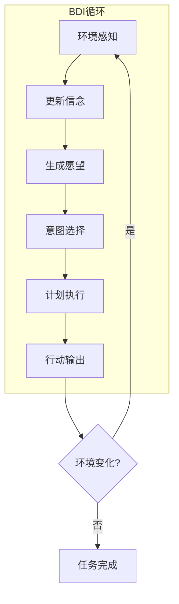
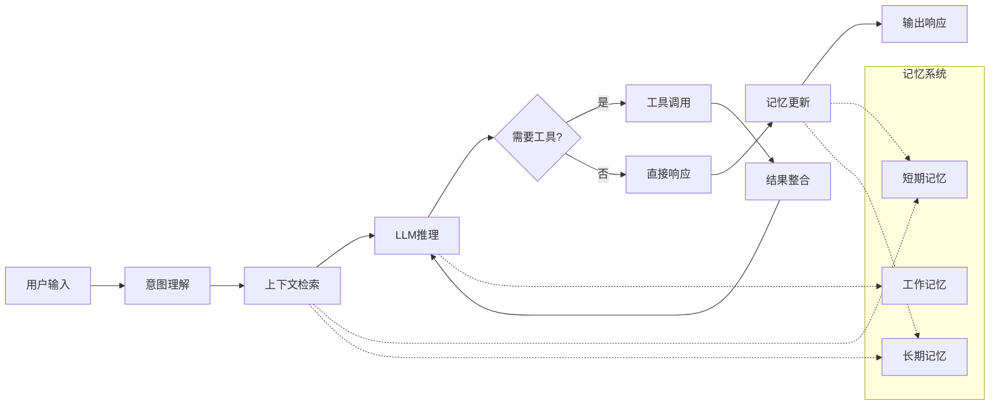
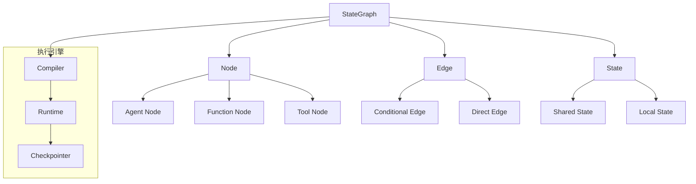
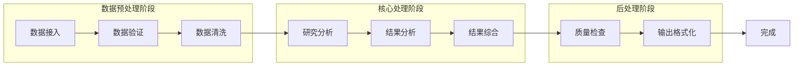
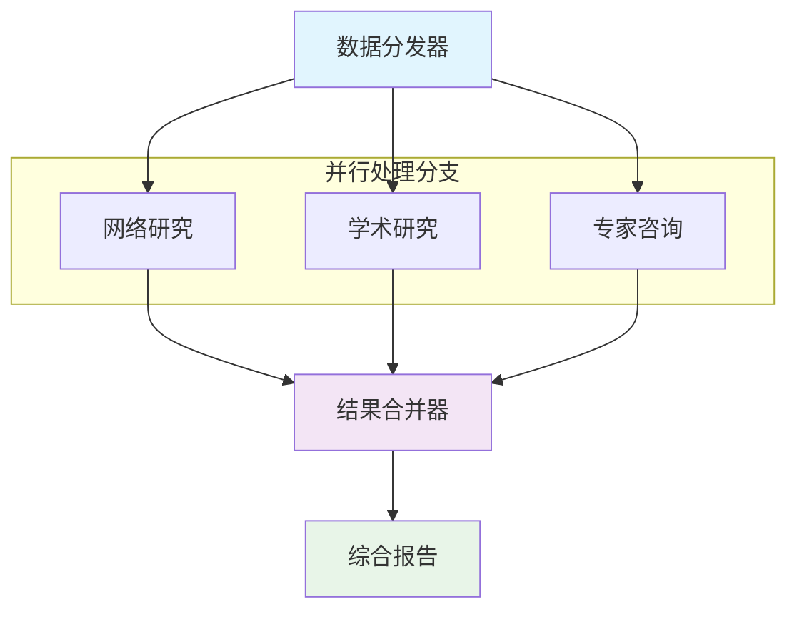
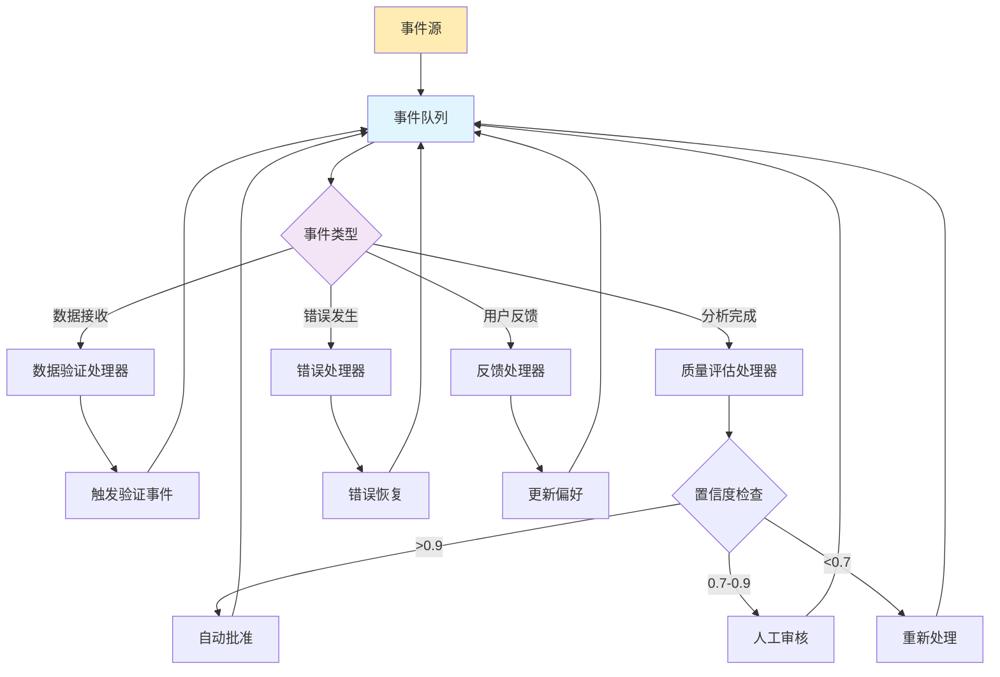
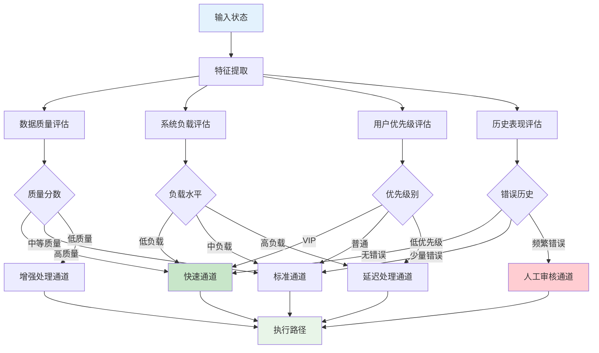
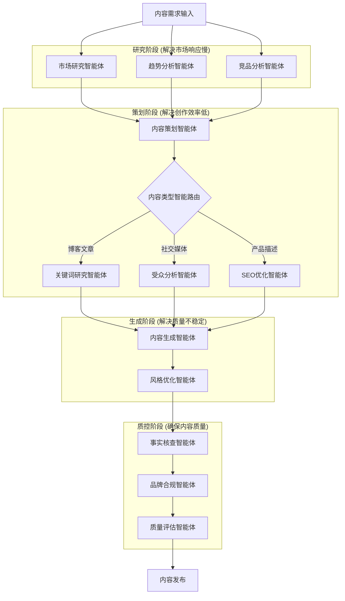
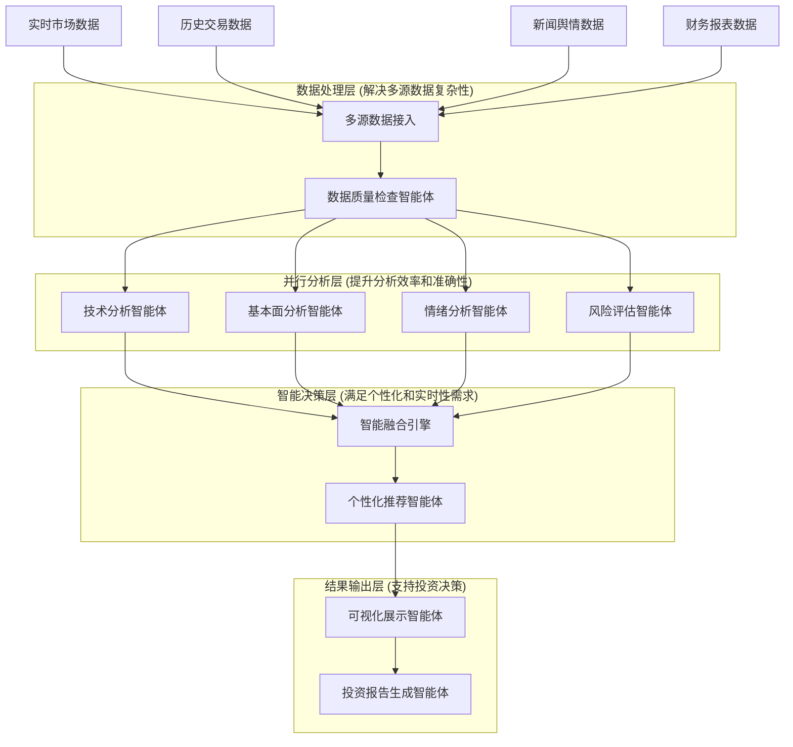

# 多智能体AI系统基础：理论与框架

## 概述

本文档深入探讨多智能体AI系统的核心理论、技术框架和实际应用，涵盖系统架构设计、关键技术实现和企业级部署方案。文档重点介绍LangGraph框架的工作流构建能力和LangSmith平台的监控调试功能，为企业级多智能体系统开发提供技术参考。

## 目录

- [多智能体AI系统基础：理论与框架](#多智能体ai系统基础理论与框架)
  - [概述](#概述)
  - [目录](#目录)
  - [第一部分：多智能体系统基础](#第一部分多智能体系统基础)
    - [1.1 多智能体系统核心概念与定义](#11-多智能体系统核心概念与定义)
    - [1.2 智能体架构模式](#12-智能体架构模式)
      - [1.2.1 经典BDI（Belief-Desire-Intention）架构](#121-经典bdibelief-desire-intention架构)
      - [1.2.2 现代LLM驱动架构详细解析](#122-现代llm驱动架构详细解析)
      - [1.2.3 架构对比与选择指南](#123-架构对比与选择指南)
    - [1.3 智能体协作机制深度剖析](#13-智能体协作机制深度剖析)
      - [1.3.1 通信模式与实现](#131-通信模式与实现)
      - [1.3.2 协调策略与算法](#132-协调策略与算法)
      - [1.3.3 智能任务分配机制](#133-智能任务分配机制)
      - [1.3.4 A2A通信协议标准](#134-a2a通信协议标准)
    - [1.4 多智能体系统的核心优势](#14-多智能体系统的核心优势)
      - [1.4.1 分布式处理能力](#141-分布式处理能力)
      - [1.4.2 专业化分工与领域专精](#142-专业化分工与领域专精)
      - [1.4.3 容错性与系统韧性](#143-容错性与系统韧性)
  - [第二部分：LangGraph框架深度解析](#第二部分langgraph框架深度解析)
    - [2.1 LangGraph框架基础与核心概念](#21-langgraph框架基础与核心概念)
      - [2.1.1 LangGraph核心架构](#211-langgraph核心架构)
      - [2.1.2 状态管理机制](#212-状态管理机制)
      - [2.1.3 节点类型与实现模式](#213-节点类型与实现模式)
      - [2.1.4 边和路由机制](#214-边和路由机制)
      - [2.1.5 工作流编译与执行](#215-工作流编译与执行)
    - [2.2 核心概念深度解析](#22-核心概念深度解析)
      - [2.2.1 节点（Nodes）- 智能体执行单元](#221-节点nodes--智能体执行单元)
      - [2.2.2 边（Edges）- 智能连接与数据流](#222-边edges--智能连接与数据流)
      - [2.2.3 状态（State）- 智能状态管理](#223-状态state--智能状态管理)
    - [2.3 高级工作流构建与模式](#23-高级工作流构建与模式)
      - [2.3.1 企业级工作流设计模式](#231-企业级工作流设计模式)
      - [2.3.2 复杂条件逻辑实现](#232-复杂条件逻辑实现)
  - [第三部分：LangSmith监控平台深度集成](#第三部分langsmith监控平台深度集成)
    - [3.1 LangSmith企业级监控架构](#31-langsmith企业级监控架构)
      - [3.1.1 全链路追踪系统](#311-全链路追踪系统)
      - [3.1.2 实时性能监控](#312-实时性能监控)
    - [3.2 智能告警与自动化响应](#32-智能告警与自动化响应)
      - [3.2.1 多维度告警规则引擎](#321-多维度告警规则引擎)
      - [3.2.2 预测性告警与异常检测](#322-预测性告警与异常检测)
    - [3.3 数据分析与可视化](#33-数据分析与可视化)
      - [3.3.1 多维度数据分析](#331-多维度数据分析)
      - [3.3.2 实时仪表盘与可视化](#332-实时仪表盘与可视化)
    - [3.4 安全监控与合规性](#34-安全监控与合规性)
      - [3.4.1 AI系统安全监控](#341-ai系统安全监控)
      - [3.4.2 合规性监控与审计](#342-合规性监控与审计)
    - [3.5 性能优化与调优](#35-性能优化与调优)
      - [3.5.1 智能体性能优化](#351-智能体性能优化)
      - [3.5.2 系统级性能调优](#352-系统级性能调优)
    - [3.6 企业级部署与集成](#36-企业级部署与集成)
      - [3.6.1 LangSmith企业版部署架构](#361-langsmith企业版部署架构)
      - [3.6.2 多环境管理与CI/CD集成](#362-多环境管理与cicd集成)
    - [3.7 最佳实践与案例研究](#37-最佳实践与案例研究)
      - [3.7.1 监控最佳实践](#371-监控最佳实践)
      - [3.7.2 企业案例研究](#372-企业案例研究)
  - [第四部分：示例项目需求分析与架构设计](#第四部分示例项目需求分析与架构设计)
    - [4.1 典型应用场景需求分析](#41-典型应用场景需求分析)
      - [4.1.1 智能客服系统需求分析](#411-智能客服系统需求分析)
      - [4.1.2 内容创作平台需求分析](#412-内容创作平台需求分析)
      - [4.1.3 金融分析系统需求分析](#413-金融分析系统需求分析)
    - [4.2 智能客服系统架构设计](#42-智能客服系统架构设计)
      - [4.2.1 系统架构图](#421-系统架构图)
      - [4.2.2 核心智能体实现](#422-核心智能体实现)
    - [4.3 内容创作平台架构设计](#43-内容创作平台架构设计)
      - [4.3.1 系统架构图](#431-系统架构图)
      - [4.3.2 核心智能体实现](#432-核心智能体实现)
    - [4.4 金融分析系统架构设计](#44-金融分析系统架构设计)
      - [4.4.1 系统架构图](#441-系统架构图)
      - [4.4.2 核心智能体实现](#442-核心智能体实现)
  - [总结](#总结)

---

## 第一部分：多智能体系统基础

### 1.1 多智能体系统核心概念与定义

多智能体系统（Multi-Agent System, MAS）是一个由多个自主智能体组成的分布式计算系统，这些智能体通过协作、竞争或协商的方式共同解决复杂问题。与传统的单体应用不同，MAS体现了"分而治之"的设计哲学。

**智能体的四大核心特征：**

| 特征 | 详细说明 | 技术实现 | 应用示例 |
|------|----------|----------|----------|
| **自主性（Autonomy）** | 智能体能够在没有外部直接控制的情况下独立运行，根据内部状态和环境信息做出决策 | 基于规则引擎、机器学习模型或强化学习算法实现决策逻辑 | 智能客服机器人自主判断用户意图并选择合适的回复策略 |
| **社会性（Social Ability）** | 智能体具备与其他智能体或人类用户进行有效交互的能力 | 通过消息传递、API调用、共享内存等方式实现通信 | 多个分析智能体协作完成市场研究报告 |
| **反应性（Reactivity）** | 智能体能够感知环境变化并及时做出适当响应 | 事件驱动架构、实时数据流处理、传感器集成 | 风险监控智能体检测到异常交易立即触发告警 |
| **主动性（Pro-activeness）** | 智能体不仅被动响应，还能主动采取行动以实现既定目标 | 目标导向的规划算法、主动学习机制 | 内容创作智能体主动收集热点话题并生成相关内容 |

### 1.2 智能体架构模式

#### 1.2.1 经典BDI（Belief-Desire-Intention）架构

BDI（Belief-Desire-Intention）架构是智能体系统的经典理论框架，由Michael Bratman在1987年提出，基于实用推理理论构建。

**核心实现框架：**

```python
class BDIAgent:
    def __init__(self, agent_id: str):
        self.agent_id = agent_id
        self.beliefs = {}      # 对环境的认知和知识
        self.desires = []      # 目标和愿望
        self.intentions = []   # 当前执行的计划
        self.plans = {}        # 可执行的计划库
    
    def perceive(self, environment):
        """感知环境并更新信念"""
        new_beliefs = self.extract_beliefs(environment)
        self.beliefs.update(new_beliefs)
    
    def deliberate(self):
        """基于信念生成或更新愿望"""
        self.desires = self.generate_desires(self.beliefs)
    
    def plan(self):
        """将愿望转化为具体的执行意图"""
        self.intentions = self.select_plans(self.desires, self.beliefs)
    
    def execute(self):
        """执行当前意图"""
        for intention in self.intentions:
            self.perform_action(intention)
```

**BDI三大核心组件：**

| 组件 | 定义 | 特征 | 技术实现 | 应用示例 |
|------|------|------|----------|----------|
| **信念（Beliefs）** | 智能体对环境状态的认知和知识表示 | 动态更新、可能不完整或不准确 | 知识库、事实数据库、环境模型 | "当前股价为100元"、"用户偏好科技类新闻" |
| **愿望（Desires）** | 智能体希望达到的目标状态或期望结果 | 可能相互冲突、需要优先级排序 | 目标栈、偏好函数、效用模型 | "最大化投资收益"、"提高用户满意度" |
| **意图（Intentions）** | 智能体承诺执行的具体行动计划 | 从愿望中筛选、具有执行承诺性 | 计划序列、行动队列、执行策略 | "购买100股科技股"、"推荐5篇相关文章" |

**BDI架构工作流程：**



**BDI架构特点分析：**

| 维度 | 优势 | 局限性 |
|------|------|--------|
| **理论基础** | 基于实用推理理论，符合人类认知模式 | 理论复杂，实现门槛高 |
| **系统设计** | 模块化设计，便于理解和维护 | 组件间耦合度高，扩展性有限 |
| **推理能力** | 支持复杂逻辑推理和决策过程 | 计算复杂度高，实时性受限 |
| **知识表示** | 结构化知识表示，逻辑清晰 | 依赖人工设计，难以处理不确定性 |
| **适用场景** | 目标导向、规则明确的任务 | 开放域和动态环境适应性弱 |

#### 1.2.2 现代LLM驱动架构详细解析

现代LLM驱动的智能体架构代表了人工智能发展的最新趋势，以大型语言模型为核心，结合记忆系统和工具集成，实现更加灵活和强大的智能体能力。

**核心实现架构：**

```python
class LLMAgent:
    def __init__(self, name: str, role: str, llm_model: str):
        self.name = name
        self.role = role
        self.llm = self.initialize_llm(llm_model)
        self.memory = ConversationMemory()
        self.tools = self.load_tools()
        self.context = AgentContext()
    
    def process(self, input_data: dict) -> dict:
        """智能体主处理流程"""
        # 1. 上下文理解
        context = self.understand_context(input_data)
        # 2. 任务规划
        plan = self.create_plan(context)
        # 3. 工具调用
        results = self.execute_plan(plan)
        # 4. 结果整合
        output = self.synthesize_results(results)
        # 5. 记忆更新
        self.memory.update(input_data, output)
        return output
```

**LLM架构核心组件：**

| 组件 | 功能描述 | 技术特点 | 实现技术 | 典型应用 |
|------|----------|----------|----------|----------|
| **LLM推理引擎** | 自然语言理解、推理、生成 | 端到端学习、上下文感知、多模态支持 | Transformer架构、注意力机制、预训练+微调 | GPT-4、Claude、LLaMA |
| **记忆系统** | 信息存储与检索 | 多层次记忆、动态更新、关联检索 | 向量数据库、图数据库、关系数据库 | 对话历史、用户偏好、知识图谱 |
| **工具集成框架** | 外部能力扩展 | 动态调用、结果整合、错误处理 | 函数调用、插件系统、微服务架构 | API调用、代码执行、多模态处理 |

**记忆系统层次结构：**

| 记忆类型 | 存储内容 | 生命周期 | 访问模式 | 技术实现 |
|----------|----------|----------|----------|----------|
| **短期记忆** | 当前对话上下文、临时状态 | 会话级别 | 快速读写 | 内存缓存、Redis |
| **工作记忆** | 任务相关中间结果 | 任务级别 | 结构化访问 | 临时数据库、文件系统 |
| **长期记忆** | 历史交互、学习偏好 | 持久化 | 语义检索 | 向量数据库、知识图谱 |

**现代LLM智能体工作流程：**



**LLM架构特点分析：**

| 维度 | 优势 | 挑战 |
|------|------|------|
| **能力范围** | 强大的语言理解和生成能力，适应开放域任务 | 可能产生幻觉，错误传播风险 |
| **系统设计** | 灵活的工具集成，高度可扩展 | 系统复杂度高，调试困难 |
| **开发效率** | 端到端学习，减少人工设计工作量 | 模型训练成本高，需要大量数据 |
| **运行性能** | 并行处理能力强，响应速度快 | 计算资源需求大，运行成本高 |
| **可控性** | 自适应能力强，处理复杂场景 | 可解释性有限，行为难以预测 |
| **安全性** | 内容过滤和安全检测机制 | 隐私保护需求，潜在安全风险 |

#### 1.2.3 架构对比与选择指南

| 维度 | BDI架构 | 现代LLM架构 |
|------|---------|------------|
| **理论基础** | 实用推理理论 | 深度学习理论 |
| **知识表示** | 符号化、结构化 | 分布式、向量化 |
| **推理方式** | 逻辑推理、规则匹配 | 神经网络、模式识别 |
| **学习能力** | 有限的规则学习 | 强大的端到端学习 |
| **可解释性** | 高（逻辑链清晰） | 低（黑盒模型） |
| **实时性** | 中等（推理开销） | 高（并行计算） |
| **扩展性** | 低（手工设计） | 高（自动学习） |
| **适用场景** | 确定性强、规则明确 | 开放域、复杂交互 |
| **典型应用** | 工业控制、专家系统 | 对话助手、内容生成 |
| **开发成本** | 高（专业知识） | 中（模型调用） |
| **运行成本** | 低（轻量计算） | 高（GPU资源） |

**选择建议：**

**1. 选择BDI架构的场景：**

- 任务目标明确、规则清晰
- 需要高可解释性和可控性
- 计算资源有限
- 安全性要求极高

**2. 选择LLM架构的场景：**

- 自然语言交互需求
- 开放域问题解决
- 需要快速原型开发
- 用户体验优先

**3. 混合架构的可能性：**

- 使用LLM进行自然语言理解
- 使用BDI进行结构化推理
- 结合两者优势，互补不足

### 1.3 智能体协作机制深度剖析

#### 1.3.1 通信模式与实现

智能体间的有效通信是多智能体系统成功的关键。主要通信模式对比如下：

| 通信模式 | 适用场景 | 优势 | 劣势 | 实现复杂度 |
|---------|---------|------|------|----------|
| 直接通信 | 私密交互、实时协作 | 低延迟、高效率 | 连接管理复杂 | 中等 |
| 发布-订阅 | 事件广播、松耦合系统 | 可扩展性强、解耦合 | 消息顺序难保证 | 低 |
| 共享内存 | 高性能数据共享 | 访问速度快 | 并发控制复杂 | 高 |
| 消息队列 | 异步处理、负载均衡 | 可靠性高、支持持久化 | 增加系统复杂度 | 中等 |

**技术实现要点：**

- **消息格式标准化**：定义统一的消息结构，包含发送者、时间戳、消息类型和内容
- **错误处理机制**：实现消息重试、超时处理和故障转移
- **安全性保障**：消息加密、身份验证和访问控制
- **性能优化**：连接池管理、批量处理和压缩传输

#### 1.3.2 协调策略与算法

多智能体系统中的协调策略决定了智能体如何协同工作以实现共同目标。主要协调策略对比：

| 协调策略 | 核心机制 | 适用场景 | 优势 | 挑战 |
|---------|---------|---------|------|------|
| 合作型协调 | 共识决策、任务分解 | 目标一致的团队任务 | 全局最优、协同效应 | 通信开销大、决策缓慢 |
| 竞争型协调 | 拍卖机制、市场竞争 | 资源稀缺、质量要求高 | 效率高、质量保证 | 可能次优、协调成本 |
| 混合型协调 | 动态策略选择 | 复杂多变环境 | 灵活适应、平衡效果 | 策略选择复杂 |
| 层次化协调 | 分层管理、权限分级 | 大规模系统 | 可扩展性强 | 层级通信延迟 |

**关键算法要素：**

- **任务分解算法**：将复杂任务分解为可并行执行的子任务
- **能力匹配机制**：根据智能体能力和任务需求进行最优匹配
- **共识达成协议**：确保多个智能体能够就决策达成一致
- **冲突解决机制**：处理智能体间的资源竞争和目标冲突

#### 1.3.3 智能任务分配机制

任务分配是多智能体系统性能的关键因素，需要综合考虑多个维度：

**分配策略对比：**

| 分配策略 | 核心算法 | 优化目标 | 适用场景 | 复杂度 |
|---------|---------|---------|---------|--------|
| 负载均衡 | 最小负载优先 | 系统吞吐量 | 同质化任务 | O(n) |
| 能力匹配 | 技能相似度计算 | 任务质量 | 专业化任务 | O(n×m) |
| 动态优化 | 多目标优化算法 | 综合性能 | 复杂环境 | O(n²) |
| 预测分配 | 机器学习预测 | 未来性能 | 长期任务 | O(n×k) |

**关键技术要素：**

- **实时负载监控**：CPU使用率、内存占用、任务队列长度
- **能力评估模型**：技能匹配度、历史表现、专业领域
- **性能预测算法**：基于历史数据预测任务完成时间和质量
- **动态调整机制**：根据系统状态实时调整分配策略

#### 1.3.4 A2A通信协议标准

Agent-to-Agent（A2A）通信协议是多智能体系统中智能体间标准化通信的基础，确保不同智能体能够有效协作。

**A2A协议核心要素：**

| 协议层次 | 功能描述 | 关键技术 | 标准规范 |
|---------|---------|---------|----------|
| 传输层 | 消息可靠传输 | TCP/UDP、WebSocket | RFC 6455 |
| 会话层 | 连接管理、身份认证 | TLS、OAuth 2.0 | RFC 8446 |
| 表示层 | 数据序列化、压缩 | JSON、Protocol Buffers | RFC 7159 |
| 应用层 | 业务逻辑、语义理解 | FIPA-ACL、自定义协议 | FIPA标准 |

**A2A消息结构标准：**

| 字段层级 | 字段名称 | 数据类型 | 必填 | 说明 |
|----------|----------|----------|------|------|
| **header** | message_id | string | 是 | 消息唯一标识符 |
| | sender_id | string | 是 | 发送方智能体ID |
| | receiver_id | string | 是 | 接收方智能体ID |
| | timestamp | string | 是 | ISO-8601时间戳 |
| | message_type | enum | 是 | request/response/notification |
| **payload** | action | string | 是 | 具体操作名称 |
| | parameters | object | 否 | 操作参数 |
| | data | object | 否 | 业务数据 |
| **metadata** | priority | enum | 否 | high/medium/low |
| | ttl | integer | 否 | 消息生存时间(秒) |
| | encryption | string | 否 | 加密算法标识 |

**标准消息示例：**

```json
{
  "header": {
    "message_id": "uuid-string",
    "sender_id": "agent-001",
    "receiver_id": "agent-002",
    "timestamp": "2024-01-01T12:00:00Z",
    "message_type": "request"
  },
  "payload": {
    "action": "analyze_data",
    "parameters": {"dataset_id": "data_001"},
    "data": {"content": "analysis_request"}
  },
  "metadata": {
    "priority": "high",
    "ttl": 3600
  }
}
```

**协议实现要点：**

- **消息路由机制**：支持点对点、广播和组播通信模式
- **服务发现协议**：动态发现和注册可用智能体服务
- **负载均衡策略**：智能分发消息以优化系统性能
- **故障恢复机制**：消息重传、超时处理和故障转移
- **安全保障体系**：端到端加密、数字签名和访问控制

### 1.4 多智能体系统的核心优势

#### 1.4.1 分布式处理能力

**性能对比分析：**

| 处理方式 | 架构特点 | 执行模式 | 处理时间 | 性能提升 |
|----------|----------|----------|----------|----------|
| **传统单体** | 单进程串行处理 | 数据清洗→特征提取→模型推理→报告生成 | 155秒 | 基准 |
| **多智能体** | 多智能体并行处理 | 智能体协作，任务并行执行 | 40秒 | 75%提升 |

**核心实现对比：**

```python
# 多智能体并行处理架构
class DataAnalysisSystem:
    def __init__(self):
        self.cleaning_agent = DataCleaningAgent()
        self.feature_agent = FeatureExtractionAgent()
        self.model_agent = ModelInferenceAgent()
        self.report_agent = ReportGenerationAgent()
    
    async def parallel_analysis(self, data_batch):
        # 多个智能体并行处理不同数据批次
        tasks = []
        for data_chunk in self.split_data(data_batch):
            task = self.process_chunk(data_chunk)
            tasks.append(task)
        
        results = await asyncio.gather(*tasks)
        return self.merge_results(results)  # 75%性能提升
```

#### 1.4.2 专业化分工与领域专精

**专业化智能体配置：**

| 智能体类型 | 专业领域 | 核心模型 | 知识库 | 主要功能 |
|------------|----------|----------|--------|----------|
| **法律专家智能体** | 法律合规 | legal-bert-large | 法律文档数据库 | 合规性分析、风险评估 |
| **财务分析智能体** | 财务分析 | finbert-sentiment | 财务数据仓库 | 财务条款分析、风险量化 |
| **技术文档智能体** | 技术规范 | code-t5-large | 技术文档库 | 技术规范分析、标准检查 |

**专业化协作实现：**

```python
class SpecializedAgentSystem:
    def __init__(self):
        # 每个智能体专注特定领域，配备专业模型和知识库
        self.legal_agent = LegalExpertAgent(
            model="legal-bert-large", knowledge_base="legal_documents_db")
        self.financial_agent = FinancialAnalystAgent(
            model="finbert-sentiment", knowledge_base="financial_data_warehouse")
        self.technical_agent = TechnicalWriterAgent(
            model="code-t5-large", knowledge_base="technical_documentation")
    
    def analyze_contract(self, contract_text):
        # 专业化分工：法律、财务、技术三个维度并行分析
        legal_analysis = self.legal_agent.analyze_compliance(contract_text)
        financial_analysis = self.financial_agent.analyze_terms(contract_text)
        technical_analysis = self.technical_agent.analyze_specs(contract_text)
        
        return self.synthesize_analyses(legal_analysis, financial_analysis, technical_analysis)
```

#### 1.4.3 容错性与系统韧性

**容错机制设计：**

| 容错层级 | 智能体角色 | 触发条件 | 处理策略 | 恢复时间 |
|----------|------------|----------|----------|----------|
| **主处理层** | 主分析智能体 | 正常运行 | 标准处理流程 | 实时 |
| **质量检查层** | 质量检查智能体 | 结果质量不达标 | 质量验证，触发重试 | <1秒 |
| **备份处理层** | 备用分析智能体 | 主智能体故障 | 自动切换备用智能体 | <5秒 |
| **兜底处理层** | 故障处理智能体 | 备用智能体也故障 | 降级处理，保证基本功能 | <10秒 |

**韧性系统实现：**

```python
class ResilientAgentSystem:
    def __init__(self):
        self.agents = {
            'primary_analyzer': AnalysisAgent(),
            'backup_analyzer': AnalysisAgent(),
            'quality_checker': QualityAgent(),
            'fallback_handler': FallbackAgent()
        }
        self.health_monitor = AgentHealthMonitor()
    
    async def robust_analysis(self, data):
        try:
            # 主处理 + 质量检查
            result = await self.agents['primary_analyzer'].process(data)
            if self.agents['quality_checker'].validate(result):
                return result
            else:
                raise QualityError("Primary result quality insufficient")
        except Exception as e:
            self.health_monitor.report_failure('primary_analyzer', e)
            # 自动故障转移：备用智能体 -> 兜底处理
            try:
                return await self.agents['backup_analyzer'].process(data)
            except Exception as backup_error:
                return await self.agents['fallback_handler'].handle_failure(data, backup_error)
```

**系统韧性特点：**

- **故障隔离**：单个智能体故障不影响整体系统运行
- **自动恢复**：多层次备份机制，确保服务连续性
- **降级处理**：在极端情况下提供基础功能保障
- **健康监控**：实时监控智能体状态，预防性维护

---

## 第二部分：LangGraph框架深度解析

### 2.1 LangGraph框架基础与核心概念

LangGraph是一个专为构建有状态、多智能体应用程序而设计的框架，它扩展了LangChain的功能，提供了更强大的工作流编排能力。LangGraph的核心优势在于其图形化的工作流设计理念，使得复杂的多智能体协作变得直观和可管理。

#### 2.1.1 LangGraph核心架构

LangGraph采用有向图（Directed Graph）的方式来组织智能体工作流，其中每个节点代表一个处理单元（智能体或函数），边代表数据流和控制流。

**核心组件架构图：**



#### 2.1.2 状态管理机制

LangGraph的状态管理是其核心特性之一，它提供了一个统一的状态对象，在整个工作流执行过程中保持数据的一致性和可追踪性。

```python
from typing import Dict, Any, List, Optional
from dataclasses import dataclass, field
from enum import Enum
import uuid
from datetime import datetime

class WorkflowStatus(Enum):
    """工作流状态枚举"""
    PENDING = "pending"
    RUNNING = "running"
    PAUSED = "paused"
    COMPLETED = "completed"
    FAILED = "failed"
    CANCELLED = "cancelled"

@dataclass
class LangGraphState:
    """LangGraph状态管理类"""
    # 基础标识
    workflow_id: str = field(default_factory=lambda: str(uuid.uuid4()))
    session_id: str = field(default_factory=lambda: str(uuid.uuid4()))
    
    # 执行状态
    current_node: str = "start"
    status: WorkflowStatus = WorkflowStatus.PENDING
    started_at: Optional[datetime] = None
    completed_at: Optional[datetime] = None
    
    # 数据状态
    messages: List[Dict[str, Any]] = field(default_factory=list)
    context: Dict[str, Any] = field(default_factory=dict)
    intermediate_results: Dict[str, Any] = field(default_factory=dict)
    
    # 配置和元数据
    config: Dict[str, Any] = field(default_factory=dict)
    metadata: Dict[str, Any] = field(default_factory=dict)
    
    # 性能和监控
    performance_metrics: Dict[str, Any] = field(default_factory=dict)
    error_context: Dict[str, Any] = field(default_factory=dict)
    
    def add_message(self, role: str, content: str, metadata: Dict[str, Any] = None):
        """添加消息到状态"""
        message = {
            "role": role,
            "content": content,
            "timestamp": datetime.now().isoformat(),
            "metadata": metadata or {}
        }
        self.messages.append(message)
    
    def update_context(self, key: str, value: Any):
        """更新上下文信息"""
        self.context[key] = value
    
    def set_intermediate_result(self, node_name: str, result: Any):
        """设置中间结果"""
        self.intermediate_results[node_name] = {
            "result": result,
            "timestamp": datetime.now().isoformat(),
            "node": node_name
        }
    
    def get_execution_duration(self) -> Optional[float]:
        """获取执行时长（秒）"""
        if self.started_at and self.completed_at:
            return (self.completed_at - self.started_at).total_seconds()
        elif self.started_at:
            return (datetime.now() - self.started_at).total_seconds()
        return None
```

#### 2.1.3 节点类型与实现模式

LangGraph支持多种类型的节点，每种节点都有其特定的用途和实现模式：

**1. 智能体节点（Agent Node）：**

智能体节点是LangGraph中最重要的节点类型，它封装了一个完整的智能体实例：

```python
from abc import ABC, abstractmethod
from typing import Any, Dict

class BaseAgentNode(ABC):
    """智能体节点基类"""
    
    def __init__(self, node_id: str, name: str, agent_config: Dict[str, Any] = None):
        self.node_id = node_id
        self.name = name
        self.agent_config = agent_config or {}
        self.execution_count = 0
        self.total_execution_time = 0.0
    
    @abstractmethod
    async def execute(self, state: LangGraphState) -> LangGraphState:
        """执行智能体逻辑"""
        pass
    
    def get_performance_metrics(self) -> Dict[str, Any]:
        """获取性能指标"""
        avg_execution_time = (self.total_execution_time / self.execution_count 
                            if self.execution_count > 0 else 0)
        return {
            "execution_count": self.execution_count,
            "total_execution_time": self.total_execution_time,
            "average_execution_time": avg_execution_time,
            "node_id": self.node_id,
            "node_name": self.name
        }

class ResearchAgentNode(BaseAgentNode):
    """研究智能体节点实现"""
    
    async def execute(self, state: LangGraphState) -> LangGraphState:
        """执行研究任务"""
        start_time = datetime.now()
        
        try:
            # 获取研究查询
            query = state.context.get("research_query", "")
            research_type = self.agent_config.get("research_type", "general")
            
            # 模拟研究过程
            await asyncio.sleep(0.5)  # 模拟API调用延迟
            
            # 生成研究结果
            research_results = {
                "query": query,
                "type": research_type,
                "sources": [
                    {"title": f"Research Source 1 for {query}", "relevance": 0.95},
                    {"title": f"Research Source 2 for {query}", "relevance": 0.87},
                    {"title": f"Research Source 3 for {query}", "relevance": 0.82}
                ],
                "summary": f"Comprehensive research completed for: {query}",
                "confidence_score": 0.89,
                "timestamp": datetime.now().isoformat()
            }
            
            # 更新状态
            state.set_intermediate_result(self.node_id, research_results)
            state.update_context("last_research_node", self.node_id)
            state.current_node = self.node_id
            
            # 记录性能指标
            execution_time = (datetime.now() - start_time).total_seconds()
            self.execution_count += 1
            self.total_execution_time += execution_time
            
            state.performance_metrics[self.node_id] = {
                "execution_time": execution_time,
                "status": "completed",
                "timestamp": datetime.now().isoformat()
            }
            
            return state
            
        except Exception as e:
            # 错误处理
            state.error_context[self.node_id] = {
                "error": str(e),
                "timestamp": datetime.now().isoformat(),
                "node_type": "research_agent"
            }
            state.status = WorkflowStatus.FAILED
            raise
```

**2. 函数节点（Function Node）：**

函数节点用于执行特定的处理逻辑，通常用于数据转换、验证或简单的计算任务：

```python
class FunctionNode:
    """函数节点实现"""
    
    def __init__(self, node_id: str, name: str, func: callable, config: Dict[str, Any] = None):
        self.node_id = node_id
        self.name = name
        self.func = func
        self.config = config or {}
    
    async def execute(self, state: LangGraphState) -> LangGraphState:
        """执行函数逻辑"""
        try:
            # 执行函数
            if asyncio.iscoroutinefunction(self.func):
                result = await self.func(state, **self.config)
            else:
                result = self.func(state, **self.config)
            
            # 更新状态
            state.set_intermediate_result(self.node_id, result)
            state.current_node = self.node_id
            
            return state
            
        except Exception as e:
            state.error_context[self.node_id] = {
                "error": str(e),
                "timestamp": datetime.now().isoformat(),
                "node_type": "function"
            }
            raise

# 示例函数节点
async def data_validation_function(state: LangGraphState, **config) -> Dict[str, Any]:
    """数据验证函数"""
    data = state.context.get("input_data", {})
    validation_rules = config.get("validation_rules", [])
    
    validation_results = {
        "is_valid": True,
        "errors": [],
        "warnings": []
    }
    
    for rule in validation_rules:
        # 执行验证逻辑
        if not rule.get("condition", lambda x: True)(data):
            validation_results["is_valid"] = False
            validation_results["errors"].append(rule.get("message", "Validation failed"))
    
    return validation_results
```

**3. 工具节点（Tool Node）：**

工具节点专门用于集成外部工具和API：

```python
class ToolNode:
    """工具节点实现"""
    
    def __init__(self, node_id: str, name: str, tool_config: Dict[str, Any]):
        self.node_id = node_id
        self.name = name
        self.tool_config = tool_config
        self.tool_type = tool_config.get("type", "api")
    
    async def execute(self, state: LangGraphState) -> LangGraphState:
        """执行工具调用"""
        try:
            if self.tool_type == "api":
                result = await self._execute_api_call(state)
            elif self.tool_type == "database":
                result = await self._execute_database_query(state)
            elif self.tool_type == "file_system":
                result = await self._execute_file_operation(state)
            else:
                raise ValueError(f"Unsupported tool type: {self.tool_type}")
            
            state.set_intermediate_result(self.node_id, result)
            state.current_node = self.node_id
            
            return state
            
        except Exception as e:
            state.error_context[self.node_id] = {
                "error": str(e),
                "timestamp": datetime.now().isoformat(),
                "node_type": "tool",
                "tool_type": self.tool_type
            }
            raise
    
    async def _execute_api_call(self, state: LangGraphState) -> Dict[str, Any]:
        """执行API调用"""
        # 模拟API调用
        await asyncio.sleep(0.2)
        return {
            "api_response": "Success",
            "data": {"result": "API call completed"},
            "status_code": 200
        }
    
    async def _execute_database_query(self, state: LangGraphState) -> Dict[str, Any]:
        """执行数据库查询"""
        # 模拟数据库查询
        await asyncio.sleep(0.1)
        return {
            "query_result": ["record1", "record2", "record3"],
            "row_count": 3
        }
    
    async def _execute_file_operation(self, state: LangGraphState) -> Dict[str, Any]:
        """执行文件操作"""
        # 模拟文件操作
        return {
            "operation": "file_read",
            "status": "completed",
            "file_size": 1024
        }
```

#### 2.1.4 边和路由机制

LangGraph的边定义了节点之间的连接关系和数据流向。边可以分为直接边和条件边两种类型：

**直接边（Direct Edge）：**

直接边表示无条件的节点转换：

```python
class DirectEdge:
    """直接边实现"""
    
    def __init__(self, from_node: str, to_node: str, edge_config: Dict[str, Any] = None):
        self.from_node = from_node
        self.to_node = to_node
        self.edge_config = edge_config or {}
    
    def get_next_node(self, state: LangGraphState) -> str:
        """获取下一个节点"""
        return self.to_node
    
    def transform_state(self, state: LangGraphState) -> LangGraphState:
        """状态转换（可选）"""
        # 可以在这里进行状态转换逻辑
        transform_func = self.edge_config.get("transform_function")
        if transform_func:
            return transform_func(state)
        return state
```

**条件边（Conditional Edge）：**

条件边根据状态条件决定下一个节点：

```python
class ConditionalEdge:
    """条件边实现"""
    
    def __init__(self, from_node: str, condition_func: callable, 
                 node_mapping: Dict[str, str], default_node: str = None):
        self.from_node = from_node
        self.condition_func = condition_func
        self.node_mapping = node_mapping
        self.default_node = default_node
    
    def get_next_node(self, state: LangGraphState) -> str:
        """根据条件获取下一个节点"""
        try:
            condition_result = self.condition_func(state)
            next_node = self.node_mapping.get(condition_result, self.default_node)
            
            if next_node is None:
                raise ValueError(f"No mapping found for condition result: {condition_result}")
            
            return next_node
            
        except Exception as e:
            if self.default_node:
                return self.default_node
            raise ValueError(f"Condition evaluation failed: {e}")

# 示例条件函数
def confidence_based_routing(state: LangGraphState) -> str:
    """基于置信度的路由"""
    # 获取最近的结果
    latest_results = list(state.intermediate_results.values())
    if not latest_results:
        return "low_confidence"
    
    latest_result = latest_results[-1].get("result", {})
    confidence = latest_result.get("confidence_score", 0.0)
    
    if confidence >= 0.9:
        return "high_confidence"
    elif confidence >= 0.7:
        return "medium_confidence"
    else:
        return "low_confidence"

def data_quality_routing(state: LangGraphState) -> str:
    """基于数据质量的路由"""
    validation_result = state.intermediate_results.get("validation", {})
    if validation_result.get("result", {}).get("is_valid", False):
        return "valid_data"
    else:
        return "invalid_data"
```

#### 2.1.5 工作流编译与执行

LangGraph使用编译器将图形定义转换为可执行的工作流：

```python
class LangGraphCompiler:
    """LangGraph编译器"""
    
    def __init__(self):
        self.nodes = {}
        self.edges = []
        self.entry_point = None
        self.checkpointer = None
    
    def add_node(self, name: str, node: Any):
        """添加节点"""
        self.nodes[name] = node
    
    def add_edge(self, from_node: str, to_node: str):
        """添加直接边"""
        edge = DirectEdge(from_node, to_node)
        self.edges.append(edge)
    
    def add_conditional_edges(self, from_node: str, condition_func: callable, 
                            node_mapping: Dict[str, str], default_node: str = None):
        """添加条件边"""
        edge = ConditionalEdge(from_node, condition_func, node_mapping, default_node)
        self.edges.append(edge)
    
    def set_entry_point(self, node_name: str):
        """设置入口点"""
        self.entry_point = node_name
    
    def compile(self, checkpointer=None) -> 'CompiledWorkflow':
        """编译工作流"""
        if not self.entry_point:
            raise ValueError("Entry point must be set before compilation")
        
        self.checkpointer = checkpointer
        return CompiledWorkflow(self.nodes, self.edges, self.entry_point, self.checkpointer)

class CompiledWorkflow:
    """编译后的工作流"""
    
    def __init__(self, nodes: Dict[str, Any], edges: List[Any], 
                 entry_point: str, checkpointer=None):
        self.nodes = nodes
        self.edges = edges
        self.entry_point = entry_point
        self.checkpointer = checkpointer
        self.execution_history = []
    
    async def ainvoke(self, initial_state: LangGraphState, 
                     config: Dict[str, Any] = None) -> LangGraphState:
        """异步执行工作流"""
        state = initial_state
        state.started_at = datetime.now()
        state.status = WorkflowStatus.RUNNING
        current_node_name = self.entry_point
        
        try:
            while current_node_name:
                # 执行当前节点
                current_node = self.nodes.get(current_node_name)
                if not current_node:
                    raise ValueError(f"Node not found: {current_node_name}")
                
                # 记录执行历史
                self.execution_history.append({
                    "node": current_node_name,
                    "timestamp": datetime.now().isoformat(),
                    "state_snapshot": state.workflow_id
                })
                
                # 执行节点
                state = await current_node.execute(state)
                
                # 检查点保存（如果配置了）
                if self.checkpointer:
                    await self.checkpointer.save_checkpoint(state)
                
                # 确定下一个节点
                next_node_name = self._get_next_node(current_node_name, state)
                current_node_name = next_node_name
            
            # 工作流完成
            state.status = WorkflowStatus.COMPLETED
            state.completed_at = datetime.now()
            
            return state
            
        except Exception as e:
            state.status = WorkflowStatus.FAILED
            state.completed_at = datetime.now()
            state.error_context["workflow_error"] = {
                "error": str(e),
                "timestamp": datetime.now().isoformat(),
                "current_node": current_node_name
            }
            raise
    
    def _get_next_node(self, current_node: str, state: LangGraphState) -> Optional[str]:
        """获取下一个节点"""
        for edge in self.edges:
            if edge.from_node == current_node:
                if isinstance(edge, ConditionalEdge):
                    return edge.get_next_node(state)
                elif isinstance(edge, DirectEdge):
                    return edge.get_next_node(state)
        
        return None  # 工作流结束
```

这个基础框架为LangGraph提供了强大的工作流编排能力，支持复杂的多智能体协作场景。在下一节中，我们将深入探讨LangGraph的高级特性和企业级应用模式。

---

### 2.2 核心概念深度解析

#### 2.2.1 节点（Nodes）- 智能体执行单元

节点是LangGraph中的基本执行单元，每个节点封装了特定的业务逻辑和智能体能力。高质量的节点设计是构建可靠多智能体系统的基础。

**节点设计模式：**

```python
from abc import ABC, abstractmethod
from typing import Dict, Any, Optional
import asyncio
import logging
from datetime import datetime

class BaseAgentNode(ABC):
    """智能体节点基类"""
    
    def __init__(self, node_id: str, config: Dict[str, Any]):
        self.node_id = node_id
        self.config = config
        self.logger = logging.getLogger(f"agent.{node_id}")
        self.execution_history = []
        self.performance_metrics = {
            'total_executions': 0,
            'success_count': 0,
            'average_duration': 0,
            'error_count': 0
        }
    
    async def execute(self, state: Dict[str, Any]) -> Dict[str, Any]:
        """节点执行入口"""
        start_time = datetime.now()
        execution_id = f"{self.node_id}_{start_time.timestamp()}"
        
        try:
            # 前置检查
            await self.pre_execution_check(state)
            
            # 执行核心逻辑
            result = await self.process(state)
            
            # 后置处理
            final_result = await self.post_execution_process(result, state)
            
            # 记录成功执行
            await self.record_success(execution_id, start_time, final_result)
            
            return final_result
            
        except Exception as e:
            # 记录执行失败
            await self.record_failure(execution_id, start_time, e)
            raise
    
    @abstractmethod
    async def process(self, state: Dict[str, Any]) -> Dict[str, Any]:
        """核心处理逻辑，子类必须实现"""
        pass

class ResearchAgentNode(BaseAgentNode):
    """研究智能体节点实现"""
    
    async def process(self, state: Dict[str, Any]) -> Dict[str, Any]:
        query = state.get("query", "")
        search_depth = self.config.get('search_depth', 3)
        
        # 多源研究策略
        research_tasks = [
            self.web_search(query),
            self.academic_search(query),
            self.knowledge_base_search(query)
        ]
        
        # 并行执行研究任务
        research_results = await asyncio.gather(*research_tasks, return_exceptions=True)
        
        # 结果整合和去重
        consolidated_results = await self.consolidate_results(research_results)
        
        # 质量评估
        quality_score = await self.assess_research_quality(consolidated_results)
        
        return {
            "research_results": consolidated_results,
            "quality_score": quality_score,
            "source_count": len([r for r in research_results if not isinstance(r, Exception)]),
            "search_strategy": "multi_source_parallel"
        }
```

#### 2.2.2 边（Edges）- 智能连接与数据流

边不仅定义了节点间的连接关系，还控制着数据流的方向、转换和过滤逻辑。

**高级边管理：**

```python
class EdgeManager:
    """边管理器"""
    
    def __init__(self):
        self.edges = {}
        self.edge_conditions = {}
        self.data_transformers = {}
        self.edge_metrics = {}
    
    def add_conditional_edge(self, from_node: str, condition_func: callable, 
                           edge_map: Dict[str, str], data_transformer: Optional[callable] = None):
        """添加条件边"""
        edge_id = f"{from_node}_conditional"
        
        self.edges[edge_id] = {
            'type': 'conditional',
            'from_node': from_node,
            'condition_func': condition_func,
            'edge_map': edge_map,
            'created_at': datetime.now()
        }
        
        if data_transformer:
            self.data_transformers[edge_id] = data_transformer
    
    async def route_data(self, edge_id: str, state: Dict[str, Any]) -> Dict[str, Any]:
        """数据路由"""
        edge_config = self.edges.get(edge_id)
        if not edge_config:
            raise ValueError(f"Edge {edge_id} not found")
        
        # 应用数据转换
        if edge_id in self.data_transformers:
            state = await self.data_transformers[edge_id](state)
        
        # 记录边的使用情况
        await self.record_edge_usage(edge_id, state)
        
        return state

# 智能条件函数示例
class ConditionalLogic:
    """条件逻辑集合"""
    
    @staticmethod
    def quality_gate_condition(state: Dict[str, Any]) -> str:
        """质量门条件"""
        quality_score = state.get('quality_score', 0)
        confidence = state.get('analysis_confidence', 0)
        iteration_count = state.get('iteration_count', 0)
        
        # 多维度质量评估
        if quality_score > 0.9 and confidence > 0.8:
            return "high_quality"
        elif quality_score > 0.7 and confidence > 0.6:
            return "medium_quality"
        elif iteration_count < 3:
            return "retry"
        else:
            return "manual_review"
    
    @staticmethod
    def load_balancing_condition(state: Dict[str, Any]) -> str:
        """负载均衡条件"""
        # 获取系统负载信息
        system_load = state.get('system_metrics', {}).get('cpu_usage', 0)
        queue_length = state.get('system_metrics', {}).get('queue_length', 0)
        
        if system_load < 0.5 and queue_length < 10:
            return "fast_track"
        elif system_load < 0.8:
            return "normal_track"
        else:
            return "slow_track"
```

#### 2.2.3 状态（State）- 智能状态管理

状态是多智能体系统的核心，它不仅存储数据，还维护系统的执行上下文和历史信息。

**企业级状态管理：**

```python
from typing import TypedDict, Annotated, List, Dict, Any, Optional
from dataclasses import dataclass, field
from enum import Enum
import operator
from datetime import datetime

class ExecutionStatus(Enum):
    PENDING = "pending"
    RUNNING = "running"
    COMPLETED = "completed"
    FAILED = "failed"
    RETRYING = "retrying"

@dataclass
class ExecutionContext:
    """执行上下文"""
    execution_id: str
    start_time: datetime
    current_node: str
    status: ExecutionStatus
    retry_count: int = 0
    error_history: List[Dict[str, Any]] = field(default_factory=list)
    performance_metrics: Dict[str, float] = field(default_factory=dict)

class EnhancedAgentState(TypedDict):
    """增强的智能体状态"""
    # 核心数据
    query: str
    messages: Annotated[List[str], operator.add]
    
    # 执行状态
    execution_context: ExecutionContext
    current_agent: str
    iteration_count: int
    
    # 业务数据
    research_results: List[Dict[str, Any]]
    analysis_results: Dict[str, Any]
    synthesis_results: Dict[str, Any]
    final_output: str
    
    # 质量和性能
    confidence_scores: Dict[str, float]
    performance_data: Dict[str, Any]
    
    # 错误处理
    error_context: Dict[str, Any]
    recovery_attempts: List[Dict[str, Any]]
    
    # 元数据
    metadata: Dict[str, Any]
    created_at: datetime
    updated_at: datetime

class StateValidator:
    """状态验证器"""
    
    def __init__(self):
        self.validation_rules = {
            'required_fields': ['query', 'execution_context', 'current_agent'],
            'field_types': {
                'query': str,
                'iteration_count': int,
                'confidence_scores': dict
            },
            'value_constraints': {
                'iteration_count': lambda x: 0 <= x <= 100,
                'confidence_scores': lambda x: all(0 <= v <= 1 for v in x.values()) if x else True
            }
        }
    
    def validate_state(self, state: Dict[str, Any]) -> tuple[bool, List[str]]:
        """验证状态的完整性和正确性"""
        errors = []
        
        # 检查必需字段
        for field in self.validation_rules['required_fields']:
            if field not in state:
                errors.append(f"Missing required field: {field}")
        
        # 检查字段类型
        for field, expected_type in self.validation_rules['field_types'].items():
            if field in state and not isinstance(state[field], expected_type):
                errors.append(f"Field {field} has wrong type. Expected {expected_type.__name__}")
        
        return len(errors) == 0, errors
```

### 2.3 高级工作流构建与模式

#### 2.3.1 企业级工作流设计模式

**1. 管道模式（Pipeline Pattern）：**

管道模式将复杂任务分解为一系列顺序执行的阶段，每个阶段专注于特定的处理逻辑。



```python
class PipelineWorkflow:
    """管道式工作流 - 简化实现"""
    
    def __init__(self):
        self.graph = StateGraph(EnhancedAgentState)
        self.setup_pipeline()
    
    def setup_pipeline(self):
        """设置线性管道工作流"""
        # 定义处理阶段
        stages = [
            "data_ingestion", "data_validation", "data_cleaning",
            "research", "analysis", "synthesis",
            "quality_check", "output_formatting"
        ]
        
        # 添加节点并创建线性连接
        for i, stage in enumerate(stages):
            self.graph.add_node(stage, getattr(self, f"{stage}_node"))
            if i > 0:
                self.graph.add_edge(stages[i-1], stage)
        
        self.graph.set_entry_point(stages[0])
        self.graph.add_edge(stages[-1], END)
```

**2. 分支合并模式（Fork-Join Pattern）：**

分支合并模式将任务分解为多个可并行执行的子任务，最后将结果合并。



```python
class ForkJoinWorkflow:
    """分支合并工作流 - 简化实现"""
    
    def setup_fork_join(self):
        """设置分支合并工作流"""
        # 添加核心节点
        self.graph.add_node("data_splitter", self.data_splitter_node)
        self.graph.add_node("result_merger", self.result_merger_node)
        
        # 添加并行处理分支
        parallel_branches = ["web_research", "academic_research", "expert_consultation"]
        
        for branch in parallel_branches:
            self.graph.add_node(branch, getattr(self, f"{branch}_node"))
            self.graph.add_edge("data_splitter", branch)  # 分支
            self.graph.add_edge(branch, "result_merger")   # 合并
        
        self.graph.set_entry_point("data_splitter")
        self.graph.add_edge("result_merger", END)
    
    async def result_merger_node(self, state: EnhancedAgentState) -> Dict[str, Any]:
        """智能结果合并"""
        # 收集所有分支结果
        branch_results = {
            'web': state.get('web_research_results', []),
            'academic': state.get('academic_research_results', []),
            'expert': state.get('expert_consultation_results', [])
        }
        
        # 执行智能合并
        merged_results = await self.intelligent_merge(branch_results)
        return {"merged_research_results": merged_results}
```

**3. 事件驱动模式（Event-Driven Pattern）：**

事件驱动模式基于事件的发生来触发相应的处理逻辑，实现松耦合的响应式架构。



```python
class EventDrivenWorkflow:
    """事件驱动工作流 - 简化实现"""
    
    def __init__(self):
        self.event_queue = asyncio.Queue()
        self.event_handlers = self.setup_event_handlers()
    
    def setup_event_handlers(self) -> Dict[str, callable]:
        """配置事件处理器映射"""
        return {
            'data_received': self.handle_data_received,
            'analysis_completed': self.handle_analysis_completed,
            'error_occurred': self.handle_error_event,
            'user_feedback_received': self.handle_user_feedback
        }
    
    async def handle_analysis_completed(self, event_data: Dict[str, Any]):
        """分析完成事件处理"""
        confidence = event_data.get('confidence_score', 0)
        
        # 基于置信度的智能路由
        if confidence > 0.9:
            await self.emit_event('auto_approve', event_data)
        elif confidence > 0.7:
            await self.emit_event('human_review_required', event_data)
        else:
            await self.emit_event('reprocess_required', event_data)
    
    async def emit_event(self, event_type: str, event_data: Dict[str, Any]):
        """事件发射器"""
        event = {
            'type': event_type,
            'data': event_data,
            'timestamp': datetime.now(),
            'event_id': str(uuid.uuid4())
        }
        await self.event_queue.put(event)
```

#### 2.3.2 复杂条件逻辑实现

**多维度决策树：**

多维度决策树通过综合评估多个特征维度，实现智能的路径选择和资源分配。



```python
class MultiDimensionalDecisionTree:
    """多维度决策树 - 简化实现"""
    
    def __init__(self):
        self.decision_rules = self.load_decision_rules()
        self.rule_weights = self.load_rule_weights()
    
    def complex_routing_decision(self, state: EnhancedAgentState) -> str:
        """智能路由决策"""
        # 提取关键特征
        features = self.extract_decision_features(state)
        
        # 计算路径得分
        path_scores = self.calculate_path_scores(features)
        
        # 选择最优路径
        best_path = max(path_scores.items(), key=lambda x: x[1])
        
        # 记录决策过程
        self.log_decision(features, path_scores, best_path[0])
        
        return best_path[0]
    
    def extract_decision_features(self, state: EnhancedAgentState) -> Dict[str, Any]:
        """提取多维度决策特征"""
        return {
            'data_quality': state.get('quality_metrics', {}).get('overall_quality', 0),
            'system_load': state.get('system_metrics', {}).get('cpu_usage', 0),
            'user_priority': state.get('metadata', {}).get('user_priority', 'normal'),
            'error_count': len(state.get('error_context', {}).get('recent_errors', [])),
            'confidence_level': state.get('confidence_scores', {}).get('overall', 0),
            'processing_time': state.get('performance_data', {}).get('processing_time', 0)
        }
    
    def calculate_path_scores(self, features: Dict[str, Any]) -> Dict[str, float]:
        """计算各路径的综合得分"""
        scores = {}
        for path_name, path_rules in self.decision_rules.items():
            score = sum(
                rule_func(features) * self.rule_weights.get(rule_name, 1.0)
                for rule_name, rule_func in path_rules.items()
            )
            scores[path_name] = score
        return scores
```

---

## 第三部分：LangSmith监控平台深度集成

在多智能体系统的生产环境中，监控和可观测性是确保系统稳定运行的关键要素。LangSmith作为专业的AI应用监控平台，为多智能体系统提供了全面的监控、追踪、分析和优化能力。

### 3.1 LangSmith企业级监控架构

#### 3.1.1 全链路追踪系统

全链路追踪是现代分布式系统监控的核心技术，它能够跟踪请求在多个智能体之间的完整执行路径。

**追踪系统的核心价值：**

- **完整性**：记录请求的完整生命周期
- **关联性**：建立智能体间的调用关系
- **可视化**：提供直观的执行时序图
- **性能分析**：识别瓶颈和异常模式

```python
from langsmith import Client, traceable

class EnterpriseTracing:
    """企业级追踪系统"""
    
    def __init__(self, project_name: str, api_key: str):
        self.client = Client(api_key=api_key)
        self.project_name = project_name
    
    @traceable
    async def trace_agent_execution(self, agent_name: str, input_state: Dict[str, Any]):
        """智能体执行追踪"""
        try:
            result = await self.execute_agent_logic(agent_name, input_state)
            return result
        except Exception as e:
            await self.record_execution_error(agent_name, e)
            raise
```

#### 3.1.2 实时性能监控

实时性能监控通过持续收集和分析系统运行指标，及时发现性能问题。

**核心监控指标：**

- **响应时间**：平均响应时间、P95/P99响应时间
- **吞吐量**：每秒请求数（RPS）、并发用户数
- **错误率**：总体错误率、分类错误率
- **资源利用率**：CPU、内存、网络I/O使用情况

```python
class RealTimeMonitoring:
    """实时性能监控系统"""
    
    def __init__(self, langsmith_client: Client):
        self.client = langsmith_client
        self.alert_thresholds = self.load_alert_thresholds()
    
    async def monitor_response_times(self):
        """监控响应时间"""
        recent_runs = await self.client.list_runs(
            project_name=self.project_name,
            limit=100
        )
        
        response_times = []
        for run in recent_runs:
            if run.end_time and run.start_time:
                duration = (run.end_time - run.start_time).total_seconds()
                response_times.append(duration)
        
        if response_times:
            avg_response_time = sum(response_times) / len(response_times)
            if avg_response_time > self.alert_thresholds['avg_response_time']:
                await self.trigger_alert('high_avg_response_time')
```

### 3.2 智能告警与自动化响应

智能告警系统是多智能体系统运维的神经中枢，能够及时发现系统异常并智能化处理告警信息。

#### 3.2.1 多维度告警规则引擎

告警规则引擎定义了告警触发条件和响应策略。

**告警规则设计原则：**

- **业务导向**：告警规则与业务影响直接关联
- **分级管理**：根据严重程度分级，避免告警疲劳
- **智能降噪**：减少重复和无效告警
- **自适应调整**：根据历史数据动态调整阈值

**核心告警类型：**

| 告警类型 | 触发条件 | 严重级别 | 响应策略 |
|----------|----------|----------|----------|
| **响应时间异常** | 平均响应时间 > 5s | High | 立即通知 + 自动扩容 |
| **错误率飙升** | 错误率 > 10% | Critical | 立即通知 + 熔断保护 |
| **质量下降** | 质量评分 < 7.0 | Medium | 延迟通知 + 模型回退 |
| **资源耗尽** | CPU/内存 > 85% | High | 立即通知 + 资源调度 |

```python
class IntelligentAlerting:
    """智能告警系统"""
    
    def __init__(self):
        self.alert_rules = self.load_alert_rules()
        self.notification_channels = self.setup_notification_channels()
    
    async def process_alert(self, alert_type: str, alert_data: Dict[str, Any]):
        """处理告警"""
        # 告警去重和聚合
        if await self.is_duplicate_alert(alert_type, alert_data):
            return
        
        # 评估严重性
        severity = await self.assess_alert_severity(alert_type, alert_data)
        
        # 发送通知和执行自动响应
        await self.send_notifications(alert_type, severity)
        if severity == 'high':
            await self.execute_auto_response(alert_type)
```

#### 3.2.2 预测性告警与异常检测

预测性告警通过机器学习算法分析历史数据，预测可能出现的问题。

**核心技术：**

- **异常检测**：统计方法、机器学习方法、时序分析
- **趋势分析**：线性趋势、周期性分析、季节性调整
- **预测模型**：时间序列预测、多元回归、深度学习

```python
class PredictiveAlerting:
    """预测性告警系统"""
    
    def __init__(self):
        self.anomaly_detector = IsolationForestDetector()
        self.trend_analyzer = TrendAnalyzer()
    
    async def analyze_system_health(self, metrics_data: Dict[str, Any]) -> Dict[str, Any]:
        """系统健康度分析"""
        anomaly_score = await self.anomaly_detector.detect(metrics_data)
        trend_analysis = await self.trend_analyzer.analyze(metrics_data)
        
        health_score = await self.calculate_health_score(anomaly_score, trend_analysis)
        
        return {
            'health_score': health_score,
            'anomaly_score': anomaly_score,
            'trend_direction': trend_analysis['direction']
        }
```

### 3.3 数据分析与可视化

#### 3.3.1 多维度数据分析

数据分析是实现系统优化和决策支持的关键环节。

**核心价值：**

- **性能洞察**：识别系统瓶颈，优化资源配置
- **质量评估**：量化智能体输出质量，持续改进模型
- **成本控制**：分析资源消耗模式，实现成本效益最大化

**分析维度：**

| 分析维度 | 关键指标 | 可视化方式 |
|----------|----------|------------|
| **性能分析** | 响应时间、吞吐量、并发数 | 时间序列图、热力图 |
| **质量分析** | 准确率、一致性、用户满意度 | 趋势图、散点图 |
| **资源分析** | CPU、内存、网络、存储 | 仪表盘、柱状图 |

```python
class AdvancedAnalytics:
    """高级数据分析"""
    
    def __init__(self, langsmith_client: Client):
        self.client = langsmith_client
        self.data_processor = DataProcessor()
    
    async def generate_performance_report(self, time_range: str) -> Dict[str, Any]:
        """生成性能分析报告"""
        raw_data = await self.collect_performance_data(time_range)
        processed_data = await self.data_processor.process(raw_data)
        
        performance_metrics = {
            'avg_response_time': processed_data['response_times'].mean(),
            'error_rate': processed_data['errors'].sum() / len(processed_data)
        }
        
        return {
            'metrics': performance_metrics,
            'trends': await self.analyze_performance_trends(processed_data)
        }
```

#### 3.3.2 实时仪表盘与可视化

实时仪表盘将复杂的数据转化为直观的视觉信息。

**设计原则：**

- **信息层次化**：重要信息突出显示
- **实时性保障**：关键指标实时更新
- **交互性设计**：支持钻取、筛选等操作

```python
class RealTimeDashboard:
    """实时监控仪表盘"""
    
    def __init__(self):
        self.dashboard_config = self.load_dashboard_config()
    
    async def create_system_overview_dashboard(self) -> Dict[str, Any]:
        """创建系统概览仪表盘"""
        return {
            'title': '多智能体系统监控概览',
            'refresh_interval': 30,
            'panels': [
                {
                    'id': 'system_health',
                    'title': '系统健康度',
                    'type': 'gauge'
                },
                {
                    'id': 'response_time_trend',
                    'title': '响应时间趋势',
                    'type': 'line_chart'
                }
            ]
        }
```

### 3.4 安全监控与合规性

#### 3.4.1 AI系统安全监控

多智能体系统面临的安全挑战包括数据安全、模型安全、系统安全和隐私保护。

**安全监控框架：**

| 安全层面 | 监控内容 | 检测方法 | 响应措施 |
|----------|----------|----------|----------|
| **输入安全** | 恶意输入、注入攻击 | 模式匹配、异常检测 | 输入过滤、请求拒绝 |
| **模型安全** | 对抗样本、模型窃取 | 行为分析、输出监控 | 模型隔离、版本回退 |
| **数据安全** | 数据泄露、访问异常 | 访问日志分析 | 访问控制、数据脱敏 |

```python
class SecurityMonitoring:
    """安全监控系统"""
    
    def __init__(self):
        self.threat_detector = ThreatDetectionEngine()
        self.access_monitor = AccessMonitor()
    
    async def monitor_ai_security(self, request_data: Dict[str, Any]) -> Dict[str, Any]:
        """AI系统安全监控"""
        security_score = await self.calculate_security_score(request_data)
        threat_level = await self.threat_detector.assess_threat(request_data)
        
        return {
            'security_score': security_score,
            'threat_level': threat_level
        }
```

#### 3.4.2 合规性监控与审计

合规性管理需要关注数据保护法规、行业标准、审计追溯和权限管理。

**审计体系设计原则：**

- **完整性**：记录所有关键操作和数据访问
- **不可篡改**：审计日志的完整性和防篡改保护
- **实时性**：关键操作的实时合规检查

```python
class ComplianceAuditing:
    """合规性审计系统"""
    
    def __init__(self):
        self.audit_logger = AuditLogger()
    
    async def audit_ai_operations(self, operation_data: Dict[str, Any]) -> Dict[str, Any]:
        """AI操作审计"""
        audit_record = {
            'timestamp': datetime.now(),
            'operation_id': operation_data.get('operation_id'),
            'compliance_status': await self.check_compliance(operation_data)
        }
        
        await self.audit_logger.log(audit_record)
        
        return {
            'audit_id': audit_record['operation_id'],
            'compliance_status': audit_record['compliance_status']
        }
```

### 3.5 性能优化与调优

#### 3.5.1 智能体性能优化

性能优化直接影响用户体验和系统成本。

**优化策略：**

| 优化层面 | 优化策略 | 实现方法 | 预期效果 |
|----------|----------|----------|----------|
| **计算优化** | 模型量化、推理加速 | INT8量化、TensorRT | 推理速度提升2-4倍 |
| **内存优化** | 模型压缩、缓存策略 | 知识蒸馏、LRU缓存 | 内存使用减少30-50% |
| **并发优化** | 异步处理、连接池 | asyncio、连接复用 | 并发能力提升3-5倍 |

```python
class PerformanceOptimizer:
    """性能优化器"""
    
    def __init__(self):
        self.model_optimizer = ModelOptimizer()
        self.cache_manager = CacheManager()
    
    async def optimize_agent_performance(self, agent_id: str) -> Dict[str, Any]:
        """智能体性能优化"""
        performance_profile = await self.analyze_agent_performance(agent_id)
        optimization_plan = await self.create_optimization_plan(performance_profile)
        
        return {
            'agent_id': agent_id,
            'optimization_plan': optimization_plan
        }
```

#### 3.5.2 系统级性能调优

系统级性能调优关注整体系统的协调优化。

**调优目标：**

- **负载均衡优化**：合理分配请求，避免热点问题
- **资源弹性伸缩**：根据负载动态调整资源配置
- **缓存策略优化**：提高数据访问效率，减少重复计算

```python
class SystemTuning:
    """系统级调优"""
    
    def __init__(self):
        self.load_balancer = LoadBalancer()
        self.auto_scaler = AutoScaler()
    
    async def auto_tune_system(self) -> Dict[str, Any]:
        """自动系统调优"""
        load_analysis = await self.analyze_system_load()
        tuning_decisions = await self.make_tuning_decisions(load_analysis)
        
        return {
             'load_analysis': load_analysis,
             'tuning_decisions': tuning_decisions
         }
 ```

### 3.6 企业级部署与集成

#### 3.6.1 LangSmith企业版部署架构

企业级部署需要考虑安全性、可靠性、性能和运维便利性。

**部署模式对比：**

| 部署模式 | 适用场景 | 优势 | 局限性 |
|----------|----------|------|--------|
| **云端SaaS** | 中小企业、快速原型 | 免运维、快速上线 | 数据安全、定制限制 |
| **私有云部署** | 大型企业、数据敏感 | 数据可控、高定制 | 运维复杂、成本高 |
| **混合部署** | 多业务场景、渐进迁移 | 灵活配置、风险分散 | 架构复杂、管理难度 |

```python
class EnterpriseDeployment:
    """企业级部署管理"""
    
    def __init__(self, deployment_config: Dict[str, Any]):
        self.config = deployment_config
        self.cluster_manager = ClusterManager()
    
    async def deploy_langsmith_cluster(self) -> Dict[str, Any]:
        """部署LangSmith集群"""
        infrastructure = await self.prepare_infrastructure()
        services = await self.deploy_core_services(infrastructure)
        
        return {
            'cluster_id': infrastructure['cluster_id'],
            'services': services
        }
```

#### 3.6.2 多环境管理与CI/CD集成

多环境管理确保系统稳定性和质量。

**核心实践：**

- **环境隔离**：开发、测试、生产环境的完全隔离
- **渐进式发布**：通过多个环境逐步验证系统变更
- **自动化测试**：单元测试、集成测试、端到端测试

```python
class MultiEnvironmentManager:
    """多环境管理"""
    
    def __init__(self):
        self.environments = {
            'development': DevEnvironment(),
            'staging': StagingEnvironment(),
            'production': ProductionEnvironment()
        }
    
    async def setup_environment_pipeline(self) -> Dict[str, Any]:
        """设置环境流水线"""
        pipeline_config = {
            'stages': [
                {'name': 'development', 'auto_deploy': True},
                {'name': 'production', 'approval_required': True}
            ]
        }
        
        return pipeline_config
```

### 3.7 最佳实践与案例研究

#### 3.7.1 监控最佳实践

建设有效的监控体系需要遵循核心原则。

**核心原则：**

- **业务价值导向**：监控指标应直接反映业务价值和用户体验
- **分层监控策略**：从基础设施到应用层的全栈监控
- **可操作性原则**：每个告警都应该有明确的处理流程

**监控实施指南：**

| 实践领域 | 最佳实践 | 常见陷阱 |
|----------|----------|----------|
| **指标设计** | 业务导向、分层监控 | 指标过多、缺乏业务关联 |
| **告警策略** | 分级告警、智能降噪 | 告警疲劳、误报过多 |
| **可视化** | 角色导向、交互式 | 信息过载、缺乏重点 |

```python
class MonitoringBestPractices:
    """监控最佳实践"""
    
    def __init__(self):
        self.metric_registry = MetricRegistry()
    
    async def implement_golden_signals(self) -> Dict[str, Any]:
        """实施黄金信号监控"""
        golden_signals = {
            'latency': {'metrics': ['response_time_p95']},
            'traffic': {'metrics': ['requests_per_second']},
            'errors': {'metrics': ['error_rate']}
        }
        
        return golden_signals
```

#### 3.7.2 企业案例研究

**案例一：大型电商平台智能客服监控：**

**业务背景**：某大型电商平台日均处理客服咨询100万次。

**监控重点**：

- **业务指标**：客户满意度、问题解决率、人工转接率
- **技术指标**：响应时间、系统可用性、模型准确率

**实施效果**：

- 客户满意度提升15%
- 人工转接率降低30%
- 系统响应时间稳定在2秒以内

```python
class EcommerceMonitoringCase:
    """电商平台监控案例"""
    
    def __init__(self):
        self.business_metrics = ['customer_satisfaction', 'resolution_rate']
        self.technical_metrics = ['response_time', 'system_availability']
    
    async def setup_ecommerce_monitoring(self) -> Dict[str, Any]:
        """设置电商监控"""
        return {
            'business_dashboards': self.business_metrics,
            'technical_dashboards': self.technical_metrics
        }
```

**案例二：金融机构风控系统监控：**

**业务背景**：某金融机构需要对AI风控系统进行全面监控。

**监控重点**：

- **风险指标**：欺诈检测率、误报率、模型漂移
- **合规监控**：审计完整性、数据血缘、访问控制

**实施效果**：

- 欺诈检测准确率提升25%
- 误报率降低40%
- 合规审计通过率100%

```python
class FinancialMonitoringCase:
    """金融风控监控案例"""
    
    def __init__(self):
        self.risk_metrics = ['fraud_detection_rate', 'false_positive_rate']
        self.compliance_metrics = ['audit_completeness', 'data_lineage']
    
    async def setup_financial_monitoring(self) -> Dict[str, Any]:
        """设置金融监控"""
        return {
            'risk_dashboards': self.risk_metrics,
            'compliance_dashboards': self.compliance_metrics
        }
```

**案例总结**：

不同行业的监控重点存在显著差异，成功的监控实施都以业务价值为核心导向，需要技术指标与业务指标紧密结合。

---

**第三部分总结：**

LangSmith监控平台为多智能体系统提供了全面的可观测性和运维能力，通过监控架构、智能告警、数据可视化、安全合规等核心功能，确保系统稳定运行。

**核心价值：**

- **全链路可观测性**：完整的请求追踪
- **智能化运维**：AI异常检测和自动化响应
- **企业级安全**：全方位安全监控和合规保障

---

## 第四部分：示例项目需求分析与架构设计

### 4.1 典型应用场景需求分析

多智能体系统在各个领域都有广泛的应用前景。本节将深入分析三个典型应用场景的业务需求，为后续的系统设计提供需求基础。

#### 4.1.1 智能客服系统需求分析

**业务背景与痛点：**

智能客服系统面临的核心业务挑战包括：

- **服务质量不稳定**：传统单一AI客服难以处理复杂多变的用户问题
- **响应效率低下**：复杂问题需要多轮交互，用户等待时间长
- **人工成本高昂**：高峰期需要大量人工客服，成本压力大
- **知识管理困难**：企业知识分散，难以快速准确检索

**核心业务需求：**

| 需求类别 | 具体需求 | 业务价值 | 优先级 |
|----------|----------|----------|--------|
| **功能需求** | 多轮对话理解、意图识别、知识检索、个性化回复 | 提升服务质量和用户满意度 | 高 |
| **性能需求** | 响应时间<2秒、并发支持>1000用户、可用性>99.9% | 保障用户体验和系统稳定性 | 高 |
| **质量需求** | 意图识别准确率>90%、问题解决率>80%、用户满意度>4.5/5 | 确保服务效果达到业务标准 | 高 |
| **扩展需求** | 多语言支持、多渠道接入、知识库动态更新 | 支持业务发展和国际化 | 中 |

**多智能体协作需求：**

- **专业化分工**：意图识别、知识检索、回复生成、质量控制各司其职
- **并行处理**：提高响应速度，减少用户等待时间
- **智能协调**：根据问题复杂度动态调整处理流程
- **人机协作**：复杂问题自动转人工，保证服务质量

#### 4.1.2 内容创作平台需求分析

**业务背景与痛点：**

内容创作平台面临的主要业务挑战：

- **创作效率低**：从策划到发布周期长，人工成本高
- **质量不稳定**：内容质量依赖创作者个人能力，难以标准化
- **市场响应慢**：热点话题响应不及时，错失流量机会
- **SEO优化难**：缺乏专业SEO知识，内容曝光度低

**核心业务需求：**

| 需求类别 | 具体需求 | 业务价值 | 优先级 |
|----------|----------|----------|--------|
| **创作需求** | 自动化内容策划、多样化内容生成、品牌调性一致性 | 提升创作效率和内容质量 | 高 |
| **市场需求** | 热点话题监测、竞品分析、用户偏好分析 | 增强市场敏感度和竞争力 | 高 |
| **优化需求** | SEO关键词优化、内容结构优化、多平台适配 | 提升内容传播效果 | 中 |
| **质控需求** | 内容原创性检测、质量评分、合规性审查 | 确保内容质量和合规性 | 高 |

**多智能体协作需求：**

- **流水线协作**：市场研究→内容策划→创作生成→编辑优化→质量检查
- **专业化智能体**：每个环节由专门的智能体负责，确保专业性
- **迭代优化**：基于反馈数据持续优化内容策略
- **质量保障**：多层次质量检查，确保内容标准

#### 4.1.3 金融分析系统需求分析

**业务背景与痛点：**

金融分析系统面临的核心挑战：

- **数据复杂多源**：技术面、基本面、情绪面数据需要综合分析
- **实时性要求高**：市场变化快，分析结果需要实时更新
- **风险控制严格**：投资决策风险高，需要多维度风险评估
- **个性化需求**：不同投资者风险偏好和投资目标不同

**核心业务需求：**

| 需求类别 | 具体需求 | 业务价值 | 优先级 |
|----------|----------|----------|--------|
| **数据需求** | 多源数据整合、实时数据更新、历史数据回测 | 确保分析基础数据的完整性和准确性 | 高 |
| **分析需求** | 技术分析、基本面分析、情绪分析、风险评估 | 提供全面的投资分析视角 | 高 |
| **决策需求** | 投资建议生成、风险等级评定、投资组合优化 | 支持投资决策制定 | 高 |
| **个性化需求** | 用户画像分析、个性化推荐、风险偏好匹配 | 提升用户体验和投资效果 | 中 |

**多智能体协作需求：**

- **并行分析**：技术面、基本面、情绪面分析同时进行，提高效率
- **数据融合**：多个智能体的分析结果需要智能融合
- **风险控制**：专门的风险评估智能体进行多维度风险分析
- **实时响应**：市场变化时各智能体协同快速响应

**应用场景需求对比：**

| 应用场景 | 核心业务价值 | 主要技术挑战 | 多智能体优势 | ROI预期 |
|----------|-------------|-------------|-------------|--------|
| **智能客服** | 降低人工成本60%，提升服务效率3倍 | 自然语言理解、上下文管理 | 专业化分工、并行处理 | 18个月回本 |
| **内容创作** | 创作效率提升5倍，内容质量标准化 | 创意生成、品牌一致性 | 流水线协作、质量保障 | 12个月回本 |
| **金融分析** | 分析准确率提升20%，决策速度提升10倍 | 多源数据融合、实时分析 | 并行分析、风险控制 | 6个月回本 |

---

### 4.2 智能客服系统架构设计

基于4.1.1节的需求分析，智能客服系统需要解决服务质量不稳定、响应效率低下、人工成本高昂、知识管理困难等核心痛点。本架构设计通过多智能体协作模式，实现专业化分工、并行处理、智能协调和人机协作。

#### 4.2.1 系统架构图

```text
┌─────────────────────────────────────────────────────────────┐
│                智能客服系统多智能体架构                      │
├─────────────────────────────────────────────────────────────┤
│  多渠道接入层 (解决多渠道接入需求)                          │
│  ┌─────────┐ ┌─────────┐ ┌─────────┐ ┌─────────┐           │
│  │ Web界面 │ │ 移动APP │ │ 微信小程序│ │ API接口 │           │
│  └─────────┘ └─────────┘ └─────────┘ └─────────┘           │
├─────────────────────────────────────────────────────────────┤
│  智能体协作层 (LangGraph) - 核心业务逻辑                    │
│  ┌─────────────┐ ┌─────────────┐ ┌─────────────┐           │
│  │ 意图识别智能体│ │ 知识检索智能体│ │ 回复生成智能体│           │
│  │ (>90%准确率) │ │ (多源并行检索)│ │ (个性化回复) │           │
│  └─────────────┘ └─────────────┘ └─────────────┘           │
│  ┌─────────────┐ ┌─────────────┐ ┌─────────────┐           │
│  │ 质量控制智能体│ │ 情感分析智能体│ │ 人工转接智能体│           │
│  │ (质量保障)   │ │ (情绪识别)   │ │ (智能升级)   │           │
│  └─────────────┘ └─────────────┘ └─────────────┘           │
├─────────────────────────────────────────────────────────────┤
│  知识服务层 (解决知识管理困难)                              │
│  ┌─────────┐ ┌─────────┐ ┌─────────┐ ┌─────────┐           │
│  │ 用户画像 │ │ 动态知识库│ │ 对话历史 │ │ 业务数据 │           │
│  │ (个性化) │ │ (实时更新)│ │ (上下文) │ │ (决策支持)│           │
│  └─────────┘ └─────────┘ └─────────┘ └─────────┘           │
├─────────────────────────────────────────────────────────────┤
│  监控运维层 (LangSmith) - 性能保障                          │
│  ┌─────────┐ ┌─────────┐ ┌─────────┐ ┌─────────┐           │
│  │ 性能监控 │ │ 质量监控 │ │ 错误追踪 │ │ 用户反馈 │           │
│  │ (<2s响应)│ │ (满意度) │ │ (故障恢复)│ │ (持续优化)│           │
│  └─────────┘ └─────────┘ └─────────┘ └─────────┘           │
└─────────────────────────────────────────────────────────────┘
```

**架构设计原则：**

1. **需求驱动设计**：每个架构层都直接对应需求分析中的具体痛点
2. **性能指标导向**：架构组件设计满足响应时间<2秒、准确率>90%等量化指标
3. **可扩展性保障**：支持多语言、多渠道等扩展需求
4. **成本效益优化**：通过智能分流减少60%人工成本

#### 4.2.2 核心智能体实现

```python
class IntentRecognitionAgent(BaseAgentNode):
    """意图识别智能体"""
    
    def __init__(self, node_id: str, config: Dict[str, Any]):
        super().__init__(node_id, config)
        self.intent_classifier = self.load_intent_classifier()
    
    async def process(self, state: Dict[str, Any]) -> Dict[str, Any]:
        user_message = state.get('user_message', '')
        
        # 意图分类和实体提取
        intent_result = await self.classify_intent(user_message)
        entities = await self.extract_entities(user_message)
        
        return {
            'intent': intent_result['intent'],
            'intent_confidence': intent_result['confidence'],
            'entities': entities
        }
    
    async def classify_intent(self, message: str) -> Dict[str, Any]:
        """意图分类"""
        return await self.intent_classifier.predict(message)

class KnowledgeRetrievalAgent(BaseAgentNode):
    """知识检索智能体"""
    
    async def process(self, state: Dict[str, Any]) -> Dict[str, Any]:
        intent = state.get('intent', '')
        entities = state.get('entities', {})
        
        # 多源并行检索
        retrieval_results = await asyncio.gather(
            self.search_faq(intent, entities),
            self.search_product_docs(intent, entities),
            self.search_policy_docs(intent, entities)
        )
        
        # 结果排序
        ranked_results = await self.rank_results(retrieval_results)
        
        return {
            'knowledge_results': ranked_results,
            'retrieval_metadata': {'total_sources': len(retrieval_results)}
        }
```

### 4.3 内容创作平台架构设计

基于4.1.2节的需求分析，内容创作平台需要解决创作效率低、质量不稳定、市场响应慢、SEO优化难等核心挑战。本架构设计通过流水线协作模式，实现创作效率提升5倍、内容质量标准化的业务目标。

#### 4.3.1 系统架构图

内容创作平台采用多阶段智能体协作架构，针对性解决需求分析中的各项痛点：



**架构设计特点：**

- **并行研究处理**：三个研究智能体并行执行，提升市场响应速度
- **智能类型路由**：根据内容类型自动选择最优处理路径，提升效率
- **多层质量保障**：事实核查、品牌合规、质量评估三重保障
- **流水线协作**：专业化分工确保每个环节的专业性和一致性
- **效率优化设计**：整体流程设计目标实现5倍效率提升

#### 4.3.2 核心智能体实现

```python
class ContentCreationWorkflow:
    """内容创作工作流"""
    
    def __init__(self):
        self.graph = StateGraph(ContentCreationState)
        self.setup_creation_pipeline()
    
    def setup_creation_pipeline(self):
        """设置创作管道"""
        # 研究阶段智能体
        self.graph.add_node("market_research", MarketResearchAgent())
        self.graph.add_node("content_planning", ContentPlanningAgent())
        self.graph.add_node("content_generation", ContentGenerationAgent())
        self.graph.add_node("quality_assessment", QualityAssessmentAgent())
        
        # 设置工作流路径
        self.graph.add_edge(START, "market_research")
        self.graph.add_edge("market_research", "content_planning")
        self.graph.add_edge("content_planning", "content_generation")
        self.graph.add_edge("content_generation", "quality_assessment")
        self.graph.add_edge("quality_assessment", END)
        
# 核心智能体类定义
class MarketResearchAgent(BaseAgent):
    """市场研究智能体"""
    
    async def execute(self, state: ContentCreationState) -> ContentCreationState:
        """执行市场研究任务"""
        research_data = await self.analyze_market_trends(state.topic)
        state.market_insights = research_data
        return state

class ContentGenerationAgent(BaseAgent):
    """内容生成智能体"""
    
    async def execute(self, state: ContentCreationState) -> ContentCreationState:
        """生成内容"""
        content = await self.generate_content(state.topic, state.market_insights)
        state.generated_content = content
        return state
```

### 4.4 金融分析系统架构设计

基于4.1.3节的需求分析，金融分析系统需要解决数据复杂多源、实时性要求高、风险控制严格、个性化需求等核心挑战。本架构设计通过并行分析模式，实现分析准确率提升20%、决策速度提升10倍的业务目标。

#### 4.4.1 系统架构图

金融分析系统采用分层智能体架构，针对性解决需求分析中的各项挑战：



**架构设计特点：**

- **多源数据整合**：统一接入技术面、基本面、情绪面等多维度数据源
- **并行分析处理**：四个专业分析智能体并行执行，提升分析效率
- **智能风险控制**：专门的风险评估智能体进行多维度风险分析
- **实时响应机制**：支持市场变化时各智能体协同快速响应
- **个性化决策支持**：根据用户风险偏好提供定制化投资建议
- **准确性保障**：多智能体结果融合，目标实现20%准确率提升

#### 4.4.2 核心智能体实现

```python
class FinancialAnalysisPlatform:
    """金融分析平台"""
    
    def __init__(self):
        self.analysis_agents = {
            'data_ingestion': DataIngestionAgent(),
            'technical_analysis': TechnicalAnalysisAgent(),
            'fundamental_analysis': FundamentalAnalysisAgent(),
            'risk_assessment': RiskAssessmentAgent(),
            'report_generation': ReportGenerationAgent()
        }
        
        self.setup_analysis_workflow()
    
    def setup_analysis_workflow(self):
        """设置分析工作流"""
        workflow = StateGraph(AnalysisState)
        
        # 添加智能体节点
        workflow.add_node("data_ingestion", self.analysis_agents['data_ingestion'])
        workflow.add_node("technical_analysis", self.analysis_agents['technical_analysis'])
        workflow.add_node("fundamental_analysis", self.analysis_agents['fundamental_analysis'])
        workflow.add_node("risk_assessment", self.analysis_agents['risk_assessment'])
        workflow.add_node("report_generation", self.analysis_agents['report_generation'])
        
        # 设置工作流路径
        workflow.add_edge("data_ingestion", "technical_analysis")
        workflow.add_edge("data_ingestion", "fundamental_analysis")
        workflow.add_edge(["technical_analysis", "fundamental_analysis"], "risk_assessment")
        workflow.add_edge("risk_assessment", "report_generation")
        
        self.workflow = workflow.compile()

# 核心智能体类定义
class DataIngestionAgent(BaseAgent):
    """数据接入智能体"""
    
    async def execute(self, state: AnalysisState) -> AnalysisState:
        """执行数据接入任务"""
        raw_data = await self.fetch_financial_data(state.data_sources)
        state.raw_data = raw_data
        return state

```

---

## 总结

本文档全面介绍了多智能体AI系统的核心技术和实现方案，涵盖了从基础概念到企业级应用的完整技术栈。

**核心技术要点：**

1. **多智能体系统架构**：分布式处理、专业化分工、容错性设计
2. **LangGraph框架应用**：图结构化编排、状态管理、条件路由
3. **LangSmith监控集成**：全链路追踪、实时监控、智能告警
4. **企业级应用场景**：智能客服、内容创作、数据分析系统

**实施建议：**

- **技术选型**：根据业务需求选择合适的架构和框架
- **性能优化**：系统调优、缓存策略、并发处理机制
- **安全保障**：AI系统安全、数据隐私保护、访问控制
- **运维体系**：生产环境部署、监控告警、故障恢复机制

多智能体AI系统作为下一代AI应用的重要技术方向，将在企业数字化转型中发挥关键作用。
