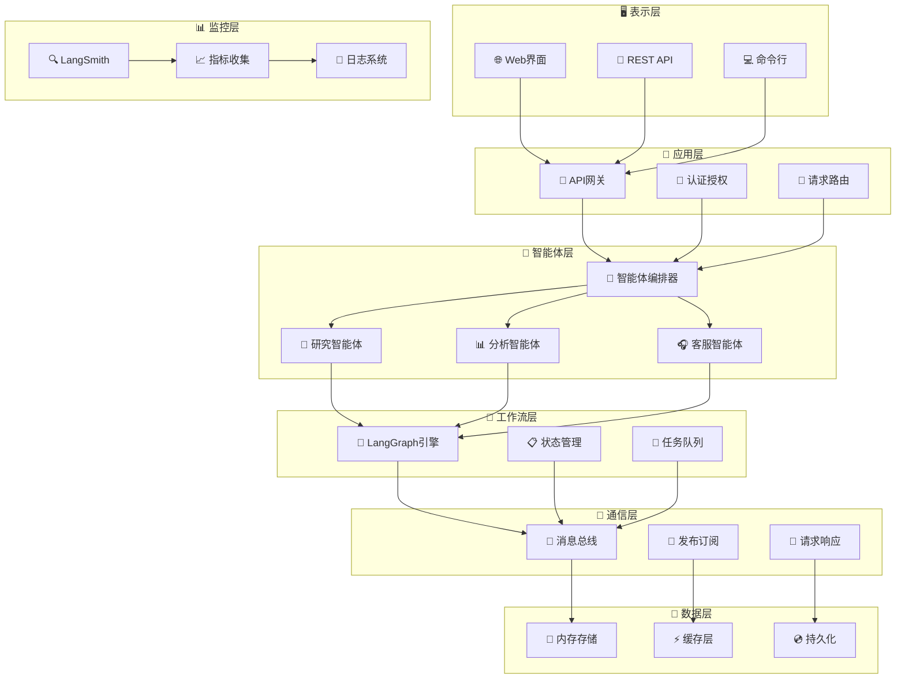

# 🤖 企业级多智能体AI系统

> 基于《多智能体AI系统基础：理论与框架》构建的生产级多智能体AI系统，集成现代AI工具链和企业级特性。

## 🎯 项目概述

本项目是一个**生产就绪**的企业级多智能体AI系统，采用现代软件架构设计原则，实现了：

- 🧠 **BDI认知架构**：完整的信念-愿望-意图循环实现
- 🤝 **智能体协作**：专业化智能体间的高效协作机制
- 🔄 **工作流编排**：基于LangGraph的复杂业务流程自动化
- 📊 **全链路监控**：LangSmith集成的性能追踪和分析
- 🏢 **企业级特性**：高可用、可扩展、可观测的系统设计

## ✨ 核心特性

### 🏗️ 架构设计

- 🧠 **BDI认知架构**：完整的信念-愿望-意图认知循环
- 🔄 **事件驱动架构**：异步消息处理和响应式设计
- 🎯 **微服务架构**：松耦合、高内聚的模块化设计
- 📐 **SOLID原则**：遵循面向对象设计最佳实践

### 🤖 智能体能力

- 🔬 **专业化智能体**：研究、分析、客服等领域专家
- 🤝 **协作机制**：智能体间的高效协作和任务分配
- 🧩 **插件化扩展**：支持自定义智能体和能力扩展
- 🎭 **角色适配**：动态角色切换和能力组合

### 🔧 技术栈

- 🌊 **LangGraph工作流**：复杂业务流程的可视化编排
- 📊 **LangSmith监控**：全链路追踪和性能分析
- 🚀 **FastAPI框架**：高性能异步Web API
- 🐳 **容器化部署**：Docker + Kubernetes生产部署

### 🛡️ 企业级特性

- 📈 **高可用性**：故障恢复和负载均衡
- 🔒 **安全认证**：API密钥和访问控制
- 📊 **可观测性**：日志、指标、链路追踪
- ⚡ **高性能**：异步处理和资源优化

## 📁 项目结构

```bash
multi_agent_system/
├── 📂 src/                           # 核心源代码
│   ├── 🤖 agents/                    # 智能体模块
│   │   ├── base_agent.py            # 🧠 BDI基础智能体架构
│   │   ├── research_agent.py        # 🔬 研究专家智能体
│   │   └── analysis_agent.py        # 📊 分析专家智能体
│   ├── 📡 communication/             # 通信中间件
│   │   └── message_bus.py           # 🚌 企业级消息总线
│   ├── 🔄 workflows/                 # 工作流引擎
│   │   └── langgraph_workflow.py    # 🌊 LangGraph工作流编排
│   ├── 🎯 examples/                  # 应用示例
│   │   └── customer_service_system.py # 🎧 智能客服系统
│   └── 🚀 main.py                   # 主应用入口
├── 🧪 tests/                        # 测试套件
│   └── test_system.py              # 🔍 系统集成测试
├── ⚙️ config.json                   # 系统配置文件
├── 📦 requirements.txt              # Python依赖清单
├── 🐳 Dockerfile                    # 容器化配置
├── 🐙 docker-compose.yml           # 多服务编排
└── 📖 README.md                     # 项目文档
```

### 📋 目录说明

| 目录/文件 | 功能描述 | 关键特性 |
|-----------|----------|----------|
| `src/agents/` | 智能体核心实现 | BDI架构、专业化能力、协作机制 |
| `src/communication/` | 通信基础设施 | 消息总线、发布订阅、请求响应 |
| `src/workflows/` | 工作流引擎 | LangGraph集成、流程编排、状态管理 |
| `src/examples/` | 业务应用示例 | 智能客服、研究分析、最佳实践 |
| `tests/` | 测试覆盖 | 单元测试、集成测试、性能测试 |
| `config.json` | 配置管理 | 环境配置、API密钥、系统参数 |

## 🏗️ 系统架构

### 📐 分层架构设计



### 🔧 核心组件说明

| 层级 | 组件 | 职责 | 技术栈 |
|------|------|------|--------|
| **表示层** | Web界面/API | 用户交互、接口暴露 | FastAPI, Streamlit |
| **应用层** | API网关 | 请求路由、认证授权 | FastAPI, JWT |
| **智能体层** | 专业智能体 | 业务逻辑、AI推理 | LangChain, OpenAI |
| **工作流层** | LangGraph引擎 | 流程编排、状态管理 | LangGraph, StateGraph |
| **通信层** | 消息总线 | 异步通信、事件驱动 | asyncio, Queue |
| **数据层** | 存储管理 | 数据持久化、缓存 | Redis, PostgreSQL |
| **监控层** | 可观测性 | 追踪、指标、日志 | LangSmith, Prometheus |

## 🚀 快速开始

### ⚡ 一键启动

```bash
# 克隆项目
git clone <repository-url>
cd multi_agent_system

# 方式1：Docker启动（推荐）
docker-compose up -d

# 方式2：本地启动
pip install -r requirements.txt
python main.py
```

### 🔧 环境配置

**必需环境：**

- Python 3.11+
- Docker（推荐）

**API密钥配置：**

```bash
# 设置环境变量
export OPENAI_API_KEY="your-openai-key"
export LANGSMITH_API_KEY="your-langsmith-key"

# 或编辑 config.json
{
  "openai_api_key": "your-openai-key",
  "langsmith_api_key": "your-langsmith-key"
}
```

### 📱 访问界面

启动后可通过以下方式访问：

| 服务 | 地址 | 用途 |
|------|------|------|
| 🌐 Web界面 | <http://localhost:8501> | 用户友好界面 |
| 🚀 API文档 | <http://localhost:8000/docs> | REST API |
| 📊 监控面板 | <http://localhost:3000> | 系统监控 |

### ✅ 验证安装

```bash
# 检查系统状态
curl http://localhost:8000/health

# 运行测试
python -m pytest tests/ -v
```

## 💻 使用指南

### 🎯 核心功能

| 功能 | 接口 | 示例 |
|------|------|------|
| 🔬 研究任务 | `POST /tasks` | 市场分析、技术调研 |
| 📊 数据分析 | `POST /analysis` | 用户行为、趋势预测 |
| 🎧 智能客服 | `POST /chat` | 问答、工单处理 |
| 📈 系统监控 | `GET /metrics` | 性能指标、健康检查 |

### 🔧 API使用示例

**创建研究任务：**

```bash
curl -X POST "http://localhost:8000/tasks" \
  -H "Content-Type: application/json" \
  -d '{
    "type": "research",
    "query": "人工智能发展趋势",
    "priority": "high"
  }'
```

**查询任务状态：**

```bash
curl "http://localhost:8000/tasks/{task_id}"
```

**智能客服对话：**

```bash
curl -X POST "http://localhost:8000/chat" \
  -H "Content-Type: application/json" \
  -d '{
    "message": "我想了解产品价格",
    "user_id": "user123"
  }'
```

### 🐍 Python SDK

```python
from src.main import MultiAgentSystem
import asyncio

async def main():
    # 初始化系统
    system = MultiAgentSystem()
    await system.start()
    
    # 创建研究任务
    result = await system.create_task(
        task_type="research",
        query="分析市场趋势"
    )
    
    print(f"任务结果：{result}")
    await system.stop()

asyncio.run(main())
```

### 📊 监控和调试

- **Grafana面板**：<http://localhost:3000> (admin/admin)
- **API文档**：<http://localhost:8000/docs>
- **LangSmith追踪**：<https://smith.langchain.com>

## 🔧 核心组件

### 🧠 智能体架构

- **BDI基础智能体**：信念-愿望-意图认知循环
- **研究智能体**：信息收集和研究分析
- **分析智能体**：数据分析和洞察提取
- **客服智能体**：客户服务和问题解决

### 🚌 通信中间件

- **消息总线**：发布-订阅和请求-响应模式
- **优先级队列**：任务优先级管理
- **错误处理**：自动重试和故障恢复

### 🌊 工作流引擎

- **LangGraph集成**：可视化流程编排
- **状态管理**：工作流状态持久化
- **条件路由**：智能决策分支
- **并行执行**：多任务并发处理

## 🎯 应用示例

### 🔬 研究分析任务

```python
# 创建研究任务
result = await system.create_task(
    task_type="research",
    query="人工智能发展趋势分析",
    depth="comprehensive"
)
```

### 🎧 智能客服系统

```python
# 处理客户咨询
response = await customer_service.handle_inquiry(
    inquiry="我想了解产品价格",
    customer_id="customer_123"
)
```

### 📊 数据分析工作流

```python
# 运行分析工作流
analysis = await system.run_analysis(
    data_source="user_behavior_logs",
    analysis_type="trend_prediction"
)
```

## ⚙️ 配置管理

**config.json 主要配置：**

```json
{
  "openai_api_key": "your-api-key",
  "langsmith_api_key": "your-langsmith-key",
  "log_level": "INFO",
  "max_concurrent_tasks": 10
}
```

## 🧪 测试

```bash
# 运行测试
python -m pytest tests/ -v

# 测试覆盖率
python -m pytest tests/ --cov=src
```

## 🤝 贡献

欢迎提交 Issue 和 Pull Request！

## 📄 许可证

MIT License

---

> 💡 **提示**：本项目基于《多智能体AI系统基础：理论与框架》实现，展示了理论到实践的完整转化过程。
