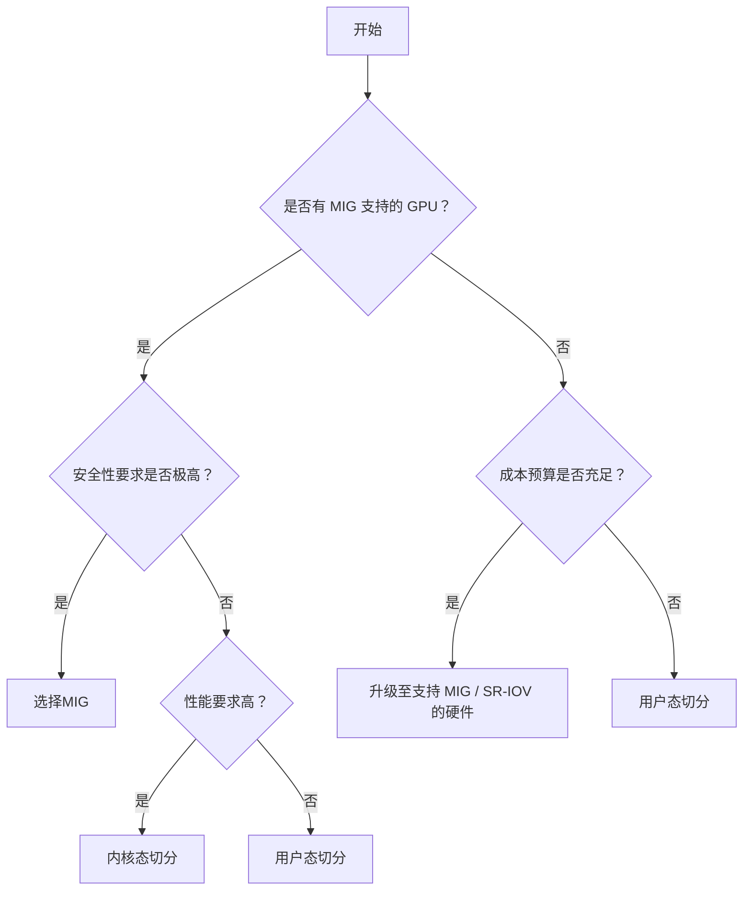
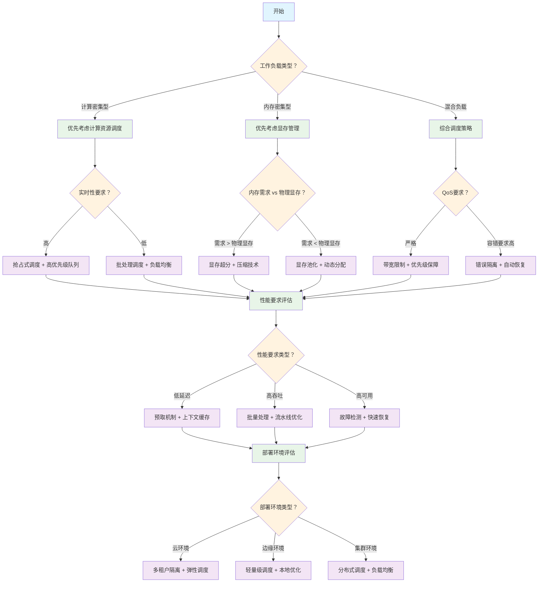

# GPU 管理相关技术深度解析 - 虚拟化、切分及远程调用

随着人工智能、深度学习和高性能计算工作负载的爆发式增长，GPU 已成为现代计算基础设施的核心组件。据 IDC 预测，全球 GPU 市场规模预计将从 2024 年的 450 亿美元增长至 2028 年的 1000 亿美元，年复合增长率超过 20%。然而，传统 GPU 使用模式面临着资源利用率低下、多租户隔离困难、扩展性受限等严峻挑战，严重制约了企业 AI 基础设施的投资回报率。

本文将深入剖析 GPU 资源管理的三大核心技术：**虚拟化**（Virtualization）、**切分**（Partitioning）及**远程调用**（Remote Invocation）。虚拟化技术通过 NVIDIA MIG、AMD SR-IOV 等方案实现硬件级资源隔离；切分技术涵盖时间片分配、空间划分等策略，优化 GPU 利用率；远程调用技术突破物理边界，实现跨节点的 GPU 资源共享。通过系统性分析这些技术的实现原理、架构设计和工程最佳实践，为云计算工程师、AI 开发者、系统架构师和技术决策者提供全面的 GPU 资源管理技术指南。

本文不仅深入技术实现细节，更将结合实际生产场景，对比分析各种技术方案的优劣势、适用边界和性能特征，帮助读者构建高效、可靠、可扩展的 GPU 资源管理体系。

## 目录

- [1. 术语表](#1-术语表)
- [2. 引言](#2-引言)
  - [2.1 GPU 计算资源需求的快速增长背景](#21-gpu-计算资源需求的快速增长背景)
  - [2.2 传统 GPU 使用模式的局限性](#22-传统-gpu-使用模式的局限性)
    - [2.2.1 资源利用率低下](#221-资源利用率低下)
    - [2.2.2 资源分配不灵活](#222-资源分配不灵活)
    - [2.2.3 多租户隔离困难](#223-多租户隔离困难)
    - [2.2.4 扩展性受限](#224-扩展性受限)
    - [2.2.5 远程访问与网络依赖问题](#225-远程访问与网络依赖问题)
    - [2.2.6 技术栈集成与标准化缺失](#226-技术栈集成与标准化缺失)
  - [2.3 GPU 管理核心技术概览](#23-gpu-管理核心技术概览)
    - [2.3.1 GPU 虚拟化技术](#231-gpu-虚拟化技术)
    - [2.3.2 GPU 切分技术](#232-gpu-切分技术)
    - [2.3.3 GPU 远程调用技术](#233-gpu-远程调用技术)
    - [2.3.4 技术集成与协同](#234-技术集成与协同)
  - [2.4 本文研究范围](#24-本文研究范围)
    - [2.4.1 核心技术领域](#241-核心技术领域)
    - [2.4.2 实现层面分析](#242-实现层面分析)
    - [2.4.3 应用场景覆盖](#243-应用场景覆盖)
    - [2.4.4 技术边界和限制](#244-技术边界和限制)
    - [2.4.5 目标读者群体](#245-目标读者群体)
  - [2.5 核心概念解析](#25-核心概念解析)
    - [2.5.1 GPU 切分技术](#251-gpu-切分技术)
    - [2.5.2 时间片调度机制](#252-时间片调度机制)
    - [2.5.3 显存超分技术](#253-显存超分技术)
    - [2.5.4 侧信道攻击防护](#254-侧信道攻击防护)
    - [2.5.5 GPU 资源池化技术](#255-gpu-资源池化技术)
    - [2.5.6 容器化 GPU 管理](#256-容器化-gpu-管理)
- [3. GPU 硬件架构深度解析](#3-gpu-硬件架构深度解析)
  - [3.1 GPU 硬件架构虚拟化基础](#31-gpu-硬件架构虚拟化基础)
    - [3.1.1 流式多处理器（SM）虚拟化机制](#311-流式多处理器sm虚拟化机制)
    - [3.1.2 内存控制器虚拟化架构](#312-内存控制器虚拟化架构)
    - [3.1.3 缓存层次结构虚拟化](#313-缓存层次结构虚拟化)
  - [3.2 异构 GPU 环境统一管理](#32-异构-gpu-环境统一管理)
    - [3.2.1 NVIDIA 与 AMD GPU 架构差异分析](#321-nvidia-与-amd-gpu-架构差异分析)
    - [3.2.2 统一 GPU 管理抽象层设计](#322-统一-gpu-管理抽象层设计)
    - [3.2.3 跨厂商兼容性处理](#323-跨厂商兼容性处理)
  - [3.3 Nvidia GPU 卡介绍](#33-nvidia-gpu-卡介绍)
    - [3.3.1 架构演进与计算能力](#331-架构演进与计算能力)
    - [3.3.2 显存与带宽规格](#332-显存与带宽规格)
    - [3.3.3 MIG 技术代际差异](#333-mig-技术代际差异)
  - [3.4 本章小结](#34-本章小结)
- [4. GPU 虚拟化技术基础](#4-gpu-虚拟化技术基础)
  - [4.1 GPU 虚拟化层次结构](#41-gpu-虚拟化层次结构)
    - [4.1.1 硬件层虚拟化（如 NVIDIA MIG）](#411-硬件层虚拟化如-nvidia-mig)
    - [4.1.2 内核态虚拟化](#412-内核态虚拟化)
    - [4.1.3 用户态资源管理](#413-用户态资源管理)
  - [4.2 GPU 虚拟化的核心挑战](#42-gpu-虚拟化的核心挑战)
    - [4.2.1 资源隔离与共享的平衡](#421-资源隔离与共享的平衡)
    - [4.2.2 性能损耗控制](#422-性能损耗控制)
    - [4.2.3 多租户环境下的安全性](#423-多租户环境下的安全性)
    - [4.2.4 异构 GPU 环境的兼容性](#424-异构-gpu-环境的兼容性)
  - [4.3 本章小结](#43-本章小结)
- [5. GPU 切分技术深度解析](#5-gpu-切分技术深度解析)
  - [5.1 硬件级 GPU 切分](#51-硬件级-gpu-切分)
    - [5.1.1 MIG 的工作原理和架构](#511-mig-的工作原理和架构)
    - [5.1.2 GPU 实例的创建和管理](#512-gpu-实例的创建和管理)
    - [5.1.3 硬件级隔离的优势和限制](#513-硬件级隔离的优势和限制)
    - [5.1.4 MIG 支持的 GPU 型号和配置选项](#514-mig-支持的-gpu-型号和配置选项)
  - [5.2 软件级 GPU 切分](#52-软件级-gpu-切分)
    - [5.2.1 用户态 API 拦截方案](#521-用户态-api-拦截方案)
    - [5.2.2 内核态虚拟化方案](#522-内核态虚拟化方案)
  - [5.3 切分技术选型指南](#53-切分技术选型指南)
    - [5.3.1 技术方案对比](#531-技术方案对比)
    - [5.3.2 应用场景选择](#532-应用场景选择)
    - [5.3.3 部署决策流程](#533-部署决策流程)
    - [5.3.4 性能调优建议](#534-性能调优建议)
  - [5.4 本章小结](#54-本章小结)
- [6. GPU 资源管理核心技术](#6-gpu-资源管理核心技术)
  - [6.1 显存管理技术](#61-显存管理技术)
    - [6.1.1 显存池化和动态分配](#611-显存池化和动态分配)
    - [6.1.2 统一内存（Unified Memory）的利用](#612-统一内存unified-memory的利用)
    - [6.1.3 显存超分技术和风险控制](#613-显存超分技术和风险控制)
  - [6.2 GPU 资源调度技术](#62-gpu-资源调度技术)
    - [6.2.1 GPU 核心的时间片分配](#621-gpu-核心的时间片分配)
    - [6.2.2 多任务并发执行策略](#622-多任务并发执行策略)
    - [6.2.3 优先级调度和抢占机制](#623-优先级调度和抢占机制)
  - [6.3 性能隔离机制](#63-性能隔离机制)
    - [6.3.1 带宽限制和 QoS 保障](#631-带宽限制和-qos-保障)
    - [6.3.2 错误隔离和故障恢复](#632-错误隔离和故障恢复)
    - [6.3.3 监控和性能分析工具](#633-监控和性能分析工具)
  - [6.4 AI 大模型训练场景 GPU 资源管理优化](#64-ai-大模型训练场景-gpu-资源管理优化)
    - [6.4.1 大模型训练的 GPU 资源需求特征](#641-大模型训练的-gpu-资源需求特征)
    - [6.4.2 动态资源调度优化](#642-动态资源调度优化)
    - [6.4.3 内存优化策略](#643-内存优化策略)
  - [6.5 技术选型决策树](#65-技术选型决策树)
  - [6.6 本章小结](#66-本章小结)
- [7. GPU 远程调用技术](#7-gpu-远程调用技术)
  - [7.1 远程 GPU 调用的基本原理](#71-远程-gpu-调用的基本原理)
    - [7.1.1 网络透明的 GPU 访问机制](#711-网络透明的-gpu-访问机制)
    - [7.1.2 客户端-服务器架构设计](#712-客户端-服务器架构设计)
    - [7.1.3 网络通信协议](#713-网络通信协议)
  - [7.2 性能优化策略](#72-性能优化策略)
    - [7.2.1 延迟优化](#721-延迟优化)
    - [7.2.2 带宽优化](#722-带宽优化)
  - [7.3 缓存优化](#73-缓存优化)
    - [7.3.1 结果缓存机制](#731-结果缓存机制)
    - [7.3.2 智能预取策略](#732-智能预取策略)
  - [7.4 容错与可靠性](#74-容错与可靠性)
    - [7.4.1 故障检测机制](#741-故障检测机制)
    - [7.4.2 故障恢复策略](#742-故障恢复策略)
    - [7.4.3 高可用性架构](#743-高可用性架构)
  - [7.5 本章小结](#75-本章小结)
- [8. 技术方案对比分析](#8-技术方案对比分析)
  - [8.1 用户态 vs 内核态虚拟化](#81-用户态-vs-内核态虚拟化)
    - [8.1.1 技术实现复杂度对比](#811-技术实现复杂度对比)
    - [8.1.2 性能基准测试框架](#812-性能基准测试框架)
    - [8.1.3 性能开销分析](#813-性能开销分析)
    - [8.1.4 安全性和稳定性评估](#814-安全性和稳定性评估)
    - [8.1.5 部署和维护成本](#815-部署和维护成本)
    - [8.1.6 企业级应用的适用性](#816-企业级应用的适用性)
  - [8.2 本地切分 vs 远程调用](#82-本地切分-vs-远程调用)
    - [8.2.1 延迟和吞吐量对比](#821-延迟和吞吐量对比)
    - [8.2.2 资源利用率分析](#822-资源利用率分析)
    - [8.2.3 扩展性和灵活性](#823-扩展性和灵活性)
    - [8.2.4 故障容错能力](#824-故障容错能力)
  - [8.3 不同切分策略对比](#83-不同切分策略对比)
    - [8.3.1 时间切分 vs 空间切分](#831-时间切分-vs-空间切分)
    - [8.3.2 混合切分策略](#832-混合切分策略)
  - [8.4 本章小结](#84-本章小结)
  - [9. 技术场景深度分析](#9-技术场景深度分析)
    - [9.1 大模型推理场景与 GPU 管理技术适配性分析](#91-大模型推理场景与-gpu-管理技术适配性分析)
      - [9.1.1 GPU 虚拟化与切分技术在大模型推理中的适用性](#911-gpu-虚拟化与切分技术在大模型推理中的适用性)
      - [9.1.2 远程 GPU 调用技术在大模型推理中的适用性](#912-远程-gpu-调用技术在大模型推理中的适用性)
    - [9.2 小模型推理场景与 GPU 管理技术适配性分析](#92-小模型推理场景与-gpu-管理技术适配性分析)
      - [9.2.1 GPU 虚拟化与切分技术在小模型推理中的适用性](#921-gpu-虚拟化与切分技术在小模型推理中的适用性)
      - [9.2.2 远程 GPU 调用技术在小模型推理中的适用性](#922-远程-gpu-调用技术在小模型推理中的适用性)
    - [9.3 训练场景与 GPU 管理技术适配性分析](#93-训练场景与-gpu-管理技术适配性分析)
      - [9.3.1 GPU 虚拟化与切分技术在训练场景中的适用性](#931-gpu-虚拟化与切分技术在训练场景中的适用性)
      - [9.3.2 远程 GPU 调用技术在训练场景中的适用性](#932-远程-gpu-调用技术在训练场景中的适用性)
    - [9.4 教学与研发场景与 GPU 管理技术适配性分析](#94-教学与研发场景与-gpu-管理技术适配性分析)
      - [9.4.1 GPU 虚拟化与切分技术在教学研发场景中的适用性](#941-gpu-虚拟化与切分技术在教学研发场景中的适用性)
      - [9.4.2 远程 GPU 调用技术在教学研发场景中的适用性](#942-远程-gpu-调用技术在教学研发场景中的适用性)
    - [9.5 技术选型指南](#95-技术选型指南)
      - [9.5.1 场景化 GPU 管理技术匹配](#951-场景化-gpu-管理技术匹配)
      - [9.5.2 GPU 管理技术性能优化建议](#952-gpu-管理技术性能优化建议)
    - [9.6 本章小结](#96-本章小结)
- [10. 总结与展望](#10-总结与展望)
  - [10.1 技术成熟度评估](#101-技术成熟度评估)
  - [10.2 技术发展趋势](#102-技术发展趋势)
  - [10.3 技术挑战与解决方案](#103-技术挑战与解决方案)
  - [10.4 标准化和生态发展](#104-标准化和生态发展)
  - [10.5 最佳实践建议](#105-最佳实践建议)
  - [10.6 未来展望](#106-未来展望)
- [11. 参考文献](#11-参考文献)

---

## 1. 术语表

| **术语**      | **全称**                                        | **定义**                                                  |
| ------------- | ----------------------------------------------- | --------------------------------------------------------- |
| GPU           | Graphics Processing Unit                        | 图形处理单元，专门用于并行计算的处理器                    |
| MIG           | Multi-Instance GPU                              | NVIDIA 的多实例 GPU 技术，支持硬件级 GPU 切分 [1]         |
| HAMi          | Heterogeneous AI Computing Middleware           | 异构 AI 计算中间件，开源 GPU 资源管理方案 [2,3]           |
| CUDA          | Compute Unified Device Architecture             | NVIDIA 的并行计算平台和编程模型 [4,5]                     |
| API           | Application Programming Interface               | 应用程序编程接口                                          |
| cgroup        | Control Groups                                  | Linux 内核功能，用于限制和隔离进程组的资源使用            |
| ioctl         | Input/Output Control                            | 设备输入输出控制系统调用                                  |
| mmap          | Memory Map                                      | 内存映射系统调用                                          |
| QoS           | Quality of Service                              | 服务质量，用于保证网络或系统性能                          |
| SLA           | Service Level Agreement                         | 服务级别协议                                              |
| ROI           | Return on Investment                            | 投资回报率                                                |
| NPU           | Neural Processing Unit                          | 神经网络处理单元                                          |
| DPU           | Data Processing Unit                            | 数据处理单元                                              |
| FPGA          | Field-Programmable Gate Array                   | 现场可编程门阵列                                          |
| vGPU          | Virtual GPU                                     | 虚拟 GPU，基于虚拟化创建的 GPU 实例                       |
| SR-IOV        | Single Root I/O Virtualization                  | 单根 I/O 虚拟化，硬件级虚拟化技术 [6]                     |
| IOMMU         | Input-Output Memory Management Unit             | 输入输出内存管理单元，用于设备虚拟化 [7]                  |
| PCIe          | Peripheral Component Interconnect Express       | 高速串行计算机扩展总线标准                                |
| NUMA          | Non-Uniform Memory Access                       | 非统一内存访问架构                                        |
| UVM           | Unified Virtual Memory                          | 统一虚拟内存，CUDA 的内存管理技术                         |
| COW           | Copy-on-Write                                   | 写时复制，内存管理优化技术                                |
| LRU           | Least Recently Used                             | 最近最少使用，缓存替换算法                                |
| OOM           | Out of Memory                                   | 内存不足错误                                              |
| ZSTD          | Zstandard                                       | 高效的无损数据压缩算法                                    |
| LZ4           | LZ4                                             | 快速无损数据压缩算法                                      |
| RDMA          | Remote Direct Memory Access                     | 远程直接内存访问技术                                      |
| InfiniBand    | InfiniBand                                      | 高性能计算和数据中心互联技术                              |
| NVLink        | NVIDIA NVLink                                   | NVIDIA 的高速 GPU 互联技术                                |
| NVSwitch      | NVIDIA NVSwitch                                 | NVIDIA 的 GPU 交换芯片                                    |
| NCCL          | NVIDIA Collective Communication Library         | NVIDIA 集合通信库 [8]                                     |
| cuDNN         | CUDA Deep Neural Network Library                | CUDA 深度神经网络库 [8]                                   |
| TensorRT      | TensorRT                                        | NVIDIA 的深度学习推理优化库 [8]                           |
| Triton        | Triton Inference Server                         | NVIDIA 的推理服务器                                       |
| DRA           | Dynamic Resource Allocation                     | Kubernetes 动态资源分配技术，支持精细化 GPU 资源管理 [12] |
| CDI           | Container Device Interface                      | 容器设备接口规范，实现容器与设备的无缝对接 [13]           |
| Device Plugin | Kubernetes Device Plugin                        | Kubernetes 设备插件框架，用于硬件设备管理 [14]            |
| MPS           | Multi-Process Service                           | NVIDIA 多进程服务，支持多进程共享 GPU 资源 [15]           |
| Docker        | Docker                                          | 容器化平台                                                |
| Kubernetes    | Kubernetes                                      | 容器编排平台                                              |
| Prometheus    | Prometheus                                      | 开源监控和告警系统 [9]                                    |
| Grafana       | Grafana                                         | 开源数据可视化平台 [10]                                   |
| ROCm          | Radeon Open Compute                             | AMD 的开源 GPU 计算平台 [11]                              |
| HIP           | Heterogeneous-Compute Interface for Portability | AMD 的异构计算接口                                        |
| HBM           | High Bandwidth Memory                           | 高带宽内存                                                |
| GDDR          | Graphics Double Data Rate                       | 图形双倍数据速率内存                                      |
| ECC           | Error-Correcting Code                           | 错误纠正码内存                                            |
| DMA           | Direct Memory Access                            | 直接内存访问                                              |
| IOVA          | I/O Virtual Address                             | I/O 虚拟地址                                              |
| SMMU          | System Memory Management Unit                   | 系统内存管理单元                                          |
| ATS           | Address Translation Services                    | 地址转换服务                                              |
| PASID         | Process Address Space Identifier                | 进程地址空间标识符                                        |

---

## 2. 引言

随着人工智能、深度学习、科学计算等领域的快速发展，GPU 计算资源需求呈现指数级增长态势 [12,13]。GPU 已从传统的图形渲染专用处理器演进为现代计算基础设施的核心组件，在大规模机器学习训练和推理任务中发挥关键作用 [14]。然而，传统 GPU 使用模式在资源利用效率、多租户隔离、弹性扩展等方面存在显著局限性 [15,16]。

本文系统性地分析 GPU 管理技术的发展背景、传统使用模式的技术瓶颈、GPU 虚拟化技术的核心价值和发展趋势，并明确研究范围和核心概念，为深入理解后续技术内容构建理论基础。GPU 虚拟化技术作为解决资源利用率问题的关键方案，近年来在学术界和工业界都得到了广泛关注和深入研究 [4,17,18,19,20]。

### 2.1 GPU 计算资源需求的快速增长背景

近年来，AI 应用的复杂度和规模呈现持续增长趋势，特别是大语言模型（LLM）的快速发展，对 GPU 计算能力提出了前所未有的技术挑战。从 GPT-3 的 1750 亿参数规模发展至 GPT-4 的万亿级参数体量，模型参数规模的指数级增长直接驱动了 GPU 计算资源需求的急剧扩张。

**关键驱动因素：**

- **模型规模增长**：从 BERT 的 3.4 亿参数发展到当前的万亿级参数
- **应用场景扩展**：从研究机构扩展到金融、医疗、自动驾驶、制造业等各行各业
- **计算密集度提升**：大模型训练需要数千张 GPU 协同工作，实时推理服务对性能要求极高

### 2.2 传统 GPU 使用模式的局限性

传统 GPU 使用模式在现代 AI 工作负载场景下暴露出显著的技术局限性，这些瓶颈严重制约了 GPU 资源的有效利用率和系统架构的可扩展性。

#### 2.2.1 资源利用率低下

**问题描述：**

单个应用往往无法充分利用整个 GPU 的计算能力，导致严重的资源浪费。

**具体表现：**

- **计算资源闲置**：许多 AI 推理任务无法充分利用 GPU 计算能力（典型场景下利用率偏低）
- **显存浪费**：小模型推理显存使用量远低于 GPU 配备容量
- **批处理效率低**：单任务处理无法充分利用 GPU 的并行处理能力
- **峰谷差异大**：业务高峰期资源不足，低谷期大量闲置

**典型场景：**

- 推理服务在生产环境中的 GPU 利用率普遍偏低
- 开发测试环境中资源利用率更低

_注：具体利用率数据因工作负载类型、模型规模和部署方式而异。_

#### 2.2.2 资源分配不灵活

**问题描述：**

GPU 通常以整卡为单位分配，无法满足不同应用的精细化资源需求。

**具体挑战：**

- **粒度过粗**：无法根据应用实际需求分配适量的计算资源
- **资源浪费**：小任务占用整张 GPU 卡，造成资源浪费
- **调度困难**：无法实现多个小任务共享单张 GPU
- **成本高昂**：每个应用都需要独占 GPU，增加硬件成本

**业务影响：**

- 开发团队需要排队等待 GPU 资源
- 无法支持细粒度的资源计费
- 难以实现按需扩缩容

#### 2.2.3 多租户隔离困难

**问题描述：**
多个应用共享 GPU 时缺乏有效的隔离机制，容易出现资源竞争和安全问题。

**安全风险：**

- **数据泄露**：共享显存可能导致敏感数据泄露
- **侧信道攻击**：恶意应用可能通过时序分析获取其他应用信息
- **资源抢占**：高优先级任务可能被低优先级任务影响
- **故障传播**：一个应用的异常可能影响其他应用

**管理挑战：**

- 缺乏有效的资源配额管理
- 难以实现公平调度
- 无法提供 SLA 保障

#### 2.2.4 扩展性受限

**问题描述：**
传统模式下，GPU 资源的扩展受到物理硬件的限制，难以实现弹性伸缩。

**技术限制：**

- **物理边界**：单机 GPU 数量受主板和电源限制
- **网络瓶颈**：跨节点 GPU 通信延迟高
- **管理复杂**：大规模 GPU 集群管理复杂度指数级增长
- **故障处理**：硬件故障影响整个节点的可用性

**运维挑战：**

- 无法快速响应业务需求变化
- 硬件采购和部署周期长
- 维护成本随规模线性增长

#### 2.2.5 远程访问与网络依赖问题

**问题描述：**
传统 GPU 使用模式缺乏有效的远程访问机制，限制了资源的灵活调度和跨地域协作。

| 问题类别             | 具体挑战     | 问题描述                                                       |
| -------------------- | ------------ | -------------------------------------------------------------- |
| **网络性能瓶颈**     | 延迟敏感     | GPU 计算任务对网络延迟极其敏感，传统网络架构难以满足实时性要求 |
|                      | 带宽限制     | 大规模数据传输受网络带宽限制，影响整体性能                     |
|                      | 协议开销     | 传统网络协议开销大，不适合 GPU 密集型计算场景                  |
|                      | QoS 保障     | 缺乏针对 GPU 工作负载的网络服务质量保障机制                    |
| **资源调度局限**     | 地域限制     | GPU 资源无法跨数据中心灵活调度                                 |
|                      | 负载均衡困难 | 难以实现跨节点的智能负载分配                                   |
|                      | 故障恢复复杂 | 网络故障时缺乏有效的容错和恢复机制                             |
|                      | 资源发现困难 | 缺乏统一的远程 GPU 资源发现和管理机制                          |
| **安全与可靠性挑战** | 数据传输安全 | 远程访问时数据传输缺乏有效加密保护                             |
|                      | 身份认证复杂 | 跨网络的身份验证和授权机制不完善                               |
|                      | 网络攻击风险 | 暴露在网络中的 GPU 服务面临安全威胁                            |
|                      | 服务可用性   | 网络不稳定导致 GPU 服务可用性下降                              |

#### 2.2.6 技术栈集成与标准化缺失

**问题描述：**
现有 GPU 管理技术缺乏统一标准，各厂商方案互不兼容，增加了系统集成复杂度。

| 问题类别             | 具体问题     | 问题描述                                               |
| -------------------- | ------------ | ------------------------------------------------------ |
| **标准化问题**       | 接口不统一   | 不同厂商的 GPU 虚拟化接口标准不一致                    |
|                      | 协议碎片化   | 缺乏统一的 GPU 资源管理协议                            |
|                      | API 兼容性差 | 应用程序难以在不同 GPU 管理平台间迁移                  |
|                      | 监控标准缺失 | 缺乏统一的 GPU 资源监控和度量标准                      |
| **集成复杂性**       | 多技术栈并存 | 虚拟化、切分、远程调用技术各自独立，难以协同           |
|                      | 配置管理复杂 | 不同技术方案的配置和管理方式差异巨大                   |
|                      | 运维工具分散 | 缺乏统一的 GPU 资源运维管理工具                        |
|                      | 技能要求高   | 需要掌握多种技术栈，增加人力成本                       |
| **对核心技术的影响** | 虚拟化技术   | 缺乏标准化导致虚拟化方案选择困难，厂商锁定风险高       |
|                      | 切分技术     | 不同切分方案无法互操作，资源池化效果受限               |
|                      | 远程调用技术 | 协议不统一导致跨平台远程调用困难，限制了资源的全局优化 |

### 2.3 GPU 管理核心技术概览

现代 GPU 资源管理涉及三大核心技术：**虚拟化**、**切分**和**远程调用**。这些技术相互补充，共同构建了完整的 GPU 资源管理解决方案。本节将系统介绍这三大技术的基本原理和实现方式，为后续章节的深入分析奠定基础。

#### 2.3.1 GPU 虚拟化技术

**技术原理：**

GPU 虚拟化通过在硬件和应用之间引入抽象层，实现 GPU 资源的灵活分配、安全隔离和高效利用。

**主要实现方式：**

- **硬件级虚拟化**：直接在 GPU 硬件层面提供虚拟化支持

  - **定义**：利用 GPU 硬件内置的虚拟化功能，在物理层面实现资源隔离
  - **技术特点**：硬件级隔离、性能开销最小、安全性最高
  - **典型示例**：NVIDIA MIG（将 A100/H100 划分为独立 GPU 实例）、NVIDIA vGPU（基于 Hypervisor 的虚拟化）、AMD SR-IOV（PCIe 级别的硬件虚拟化） [21]、GPU Passthrough（虚拟机直接访问物理 GPU）

  _注：SR-IOV 规范参见 [6]。_

- **内核态虚拟化**：在操作系统内核层面实现 GPU 资源虚拟化

  - **定义**：通过修改或拦截 GPU 硬件驱动程序，在内核空间实现资源管理和调度
  - **技术特点**：系统级控制、精细资源管理、需要内核模块支持
  - **典型示例**：Intel GVT-g（内核级 GPU 虚拟化） [22]、自定义内核模块拦截 ioctl 系统调用

- **用户态虚拟化**：在用户空间实现 GPU 资源的配额控制和管理

  - **定义**：通过拦截 GPU API 调用，在应用程序层面实现资源限制和调度
  - **技术特点**：部署简单、兼容性好、无需内核修改、基于软件配额
  - **典型示例**：HAMi（通过 LD_PRELOAD 拦截 CUDA API）、vCUDA（虚拟 CUDA 运行时）[20]、Docker GPU 资源限制、Kubernetes GPU 共享插件 [23]

- **混合虚拟化**：结合多种虚拟化技术的综合解决方案
  - **定义**：同时使用硬件和软件虚拟化技术，发挥各自优势
  - **技术特点**：灵活性高、适应性强、可根据场景选择最优方案
  - **典型示例**：MIG+容器化（硬件隔离+软件管理）、SR-IOV+API 拦截（硬件虚拟化+软件配额）、多层次资源管理架构

**核心价值：**

- 提高资源利用率和灵活性
- 实现多租户安全隔离
- 支持动态资源调整和负载均衡

#### 2.3.2 GPU 切分技术

**虚拟化与切分的关系：**

GPU 虚拟化和 GPU 切分是两个相关但不同的概念：

- **GPU 虚拟化**：是实现技术手段，通过软件或硬件层面创建虚拟 GPU 实例，提供资源抽象和隔离
- **GPU 切分**：是资源分配策略，定义如何将物理 GPU 资源划分给不同的虚拟实例或应用
- **关系**：虚拟化提供了实现切分的技术基础，切分定义了虚拟化的资源分配方式

**技术原理：**

GPU 切分技术将单个物理 GPU 划分为多个独立的逻辑单元，每个单元可以独立运行不同的工作负载。切分技术通常与虚拟化技术结合使用，虚拟化负责创建隔离环境，切分负责定义资源分配策略。

**主要切分方式：**

- **时间切分**：基于时间片的 GPU 计算资源分配

  - 抢占式调度：支持高优先级任务抢占
  - 协作式调度：任务主动释放资源
  - 混合调度：结合抢占式和协作式的优势

- **空间切分**：将 GPU 物理资源进行空间划分

  - 计算单元切分：SM（流多处理器）级别的资源分割
  - 显存切分：独立的显存空间分配
  - 带宽切分：内存带宽的隔离和限制

- **混合切分**：时间和空间切分的组合
  - 动态调整：根据负载动态调整切分策略
  - 优先级管理：不同优先级任务的差异化处理

**解决方案要点：**

- **性能隔离机制**：通过硬件级隔离和软件配额实现公平性保障
- **上下文切换优化**：采用轻量级切换算法和状态缓存技术降低开销
- **资源整合策略**：智能碎片整理和动态资源重分配机制

#### 2.3.3 GPU 远程调用技术

**技术原理：**

GPU 远程调用技术使应用程序能够透明地访问和使用远程 GPU 资源，突破单机 GPU 数量限制。rCUDA 等研究项目为此领域奠定了重要的技术基础 [11]。

**主要实现架构：**

- **API 代理模式**：拦截本地 GPU API 调用并转发到远程 GPU

  - CUDA API 代理：透明的 CUDA 调用转发 [24]
  - OpenCL 代理：跨平台的 OpenCL 远程访问
  - 自定义协议：针对特定场景的优化协议

- **虚拟设备模式**：在本地创建虚拟 GPU 设备

  - 设备模拟：完整的 GPU 设备行为模拟
  - 驱动层代理：在驱动层面实现远程访问
  - 内核模块：内核态的远程 GPU 支持

- **分布式计算模式**：将计算任务分布到多个远程 GPU
  - 任务分解：将大任务分解为子任务
  - 负载均衡：智能的任务分配策略
  - 结果聚合：分布式计算结果的合并

**关键技术要素：**

- **网络优化**：低延迟、高带宽的网络通信
- **数据传输**：高效的数据序列化和传输机制
- **状态同步**：远程 GPU 状态的一致性管理
- **错误处理**：网络故障和设备故障的恢复机制

#### 2.3.4 技术集成与协同

**技术融合趋势：**

现代 GPU 管理系统通常将三大技术进行有机结合：

- **虚拟化 + 切分**：在虚拟化基础上实现更细粒度的资源切分
- **切分 + 远程调用**：将切分后的 GPU 资源通过网络提供服务
- **虚拟化 + 远程调用**：远程访问虚拟化的 GPU 资源池
- **三技术融合**：构建统一的 GPU 资源管理平台

**协同优势：**

- **资源利用最大化**：通过多层次的资源管理提高整体利用率
- **灵活性增强**：支持多样化的部署和使用模式
- **可扩展性提升**：突破单机限制，实现集群级资源管理
- **成本效益优化**：通过资源共享降低总体拥有成本

**实施考量：**

- **性能开销**：多层技术栈可能带来的性能损失
- **复杂度管理**：系统复杂度与维护成本的平衡
- **兼容性保障**：确保与现有应用和框架的兼容性
- **安全性要求**：多租户和网络环境下的安全保障

### 2.4 本文研究范围

本文将深入探讨 GPU 虚拟化、切分技术与远程调用机制，涵盖技术原理、实现方案、性能分析、应用场景等多个维度，为读者提供全面的技术指导和实践建议。

#### 2.4.1 核心技术领域

| 技术类别           | 核心技术            | 技术特点                                |
| ------------------ | ------------------- | --------------------------------------- |
| **GPU 虚拟化技术** | 硬件层虚拟化        | NVIDIA MIG、AMD SR-IOV 等硬件级资源隔离 |
|                    | 内核态虚拟化        | 驱动层拦截和管理，系统级资源控制        |
|                    | 用户态虚拟化        | API 层封装和代理，应用级透明访问        |
|                    | 容器化 GPU 资源管理 | 容器级 GPU 资源分配和隔离               |
| **GPU 切分技术**   | 时间片调度机制      | 算法优化，时间维度资源共享              |
|                    | 空间切分策略        | 资源隔离，空间维度资源分割              |
|                    | 混合切分模式        | 时空结合的设计与实现                    |
|                    | 动态资源分配        | 负载均衡，自适应资源调整                |
| **远程 GPU 调用**  | GPU 资源网络化访问  | 透明的远程 GPU 资源访问机制             |
|                    | 分布式 GPU 计算架构 | 多节点 GPU 资源协同计算                 |
|                    | 跨节点 GPU 资源调度 | 集群级 GPU 资源统一调度                 |
|                    | 网络优化和延迟控制  | 高性能网络通信和延迟优化                |

#### 2.4.2 实现层面分析

| 分析维度             | 关键要素     | 技术要点                     |
| -------------------- | ------------ | ---------------------------- |
| **技术原理深度解析** | 底层硬件架构 | 虚拟化支持机制和硬件特性分析 |
|                      | 操作系统内核 | GPU 资源管理和内核级调度机制 |
|                      | 驱动程序适配 | 虚拟化层驱动程序设计和兼容性 |
|                      | 应用程序接口 | 透明化处理和 API 层封装技术  |
| **实现方案对比**     | 技术特点分析 | 不同虚拟化方案的优劣势对比   |
|                      | 性能评估     | 开销分析和资源利用率优化     |
|                      | 安全性评估   | 隔离性机制和安全防护策略     |
|                      | 部署维护     | 复杂度评估和运维成本分析     |
| **代码实现示例**     | 核心算法     | C 语言实现的关键算法逻辑     |
|                      | 数据结构     | 关键数据结构的设计和优化     |
|                      | 系统接口     | 系统调用和 API 封装实现      |
|                      | 异常处理     | 错误处理和异常恢复机制       |

#### 2.4.3 应用场景覆盖

| 应用场景         | 具体应用          | 技术特点               | 核心价值                 |
| ---------------- | ----------------- | ---------------------- | ------------------------ |
| **云计算环境**   | 公有云 GPU 服务   | 虚拟化实现、弹性扩缩容 | 资源池化、按需分配       |
|                  | 私有云 GPU 资源池 | 资源池化、统一管理     | 突破单机限制、大规模聚合 |
|                  | 混合云环境        | 跨云资源管理、数据安全 | 跨地域资源调度、故障隔离 |
|                  | 多租户 GPU 服务   | 安全隔离、资源配额     | 成本共享、SLA 保障       |
| **企业级应用**   | AI 训练平台       | 资源调度、任务排队     | 提高利用率、降低成本     |
|                  | 推理服务          | 资源优化、低延迟       | 弹性扩缩、快速响应       |
|                  | 开发测试环境      | 资源共享、成本控制     | 简化管理、降低运维复杂度 |
|                  | 高性能计算集群    | 大规模并行、高吞吐     | 集群级资源统一调度       |
| **边缘计算场景** | 边缘设备虚拟化    | 轻量化、低功耗         | 资源受限环境优化         |
|                  | 实时计算          | 低延迟、确定性调度     | 实时性保障、性能隔离     |
|                  | 资源受限环境      | 功耗优化、散热管理     | 智能资源分配、动态调整   |
|                  | 离线部署          | 自主运行、故障自愈     | 容错机制、服务可用性     |

#### 2.4.4 技术边界和限制

**本文涵盖范围：**

- 主流 GPU 厂商（NVIDIA、AMD 等）的虚拟化技术
- Linux 操作系统环境下的实现方案
- 容器和虚拟机两种虚拟化环境
- 深度学习和高性能计算工作负载

**不涉及内容：**

- 特定厂商的专有技术细节
- Windows 环境下的 GPU 虚拟化
- 移动设备 GPU 的虚拟化
- 图形渲染相关的 GPU 虚拟化

#### 2.4.5 目标读者群体

**技术开发人员：**

- 系统架构师和技术负责人
- GPU 虚拟化技术的开发工程师
- 云计算平台的技术人员
- AI 基础设施的运维工程师

**决策制定者：**

- 技术管理者和 CTO
- 云服务商的产品经理
- 企业 IT 部门负责人
- 投资和采购决策者

### 2.5 核心概念解析

为了更好地理解本文内容，以下对几个核心概念进行详细说明：

#### 2.5.1 GPU 切分技术

GPU 切分技术是将单个 GPU 的计算资源、显存等按需分配给多个应用或用户的核心技术。关于 GPU 切分的具体实现方式和技术分类，请参考[2.3.2 节 GPU 切分技术](#232-gpu-切分技术)中的详细介绍，其中涵盖了硬件级、内核态、用户态和混合虚拟化四种主要实现方式。

#### 2.5.2 时间片调度机制

时间片调度是通过时间分片的方式让多个任务轮流使用 GPU 资源的调度策略，是软件级 GPU 虚拟化的核心机制：

**调度原理**：

- 将 GPU 的使用时间划分为固定或可变的时间片
- 每个任务在分配的时间片内独占 GPU 资源
- 时间片结束后，调度器切换到下一个任务

**关键技术**：

- **上下文切换**：保存和恢复 GPU 的执行状态，包括寄存器、缓存等
- **抢占机制**：支持高优先级任务抢占低优先级任务的执行
- **负载均衡**：根据任务特性和资源需求动态调整时间片大小

**性能考量**：

- 时间片过小会导致频繁的上下文切换开销
- 时间片过大会影响任务的响应性
- 需要根据具体应用场景进行优化调整

#### 2.5.3 显存超分技术

显存超分技术允许分配的虚拟显存总量超过物理显存容量，是提高 GPU 资源利用率的重要手段：

**核心策略**：

- **按需分页**：只有在实际访问时才分配物理显存页面
- **内存压缩**：使用 LZ4、ZSTD 等算法压缩不常用的显存数据
- **分层存储**：将冷数据迁移到系统内存或存储设备
- **智能预测**：基于访问模式预测和预加载热数据

**风险控制机制**：

- **内存压力监控**：实时监控显存使用情况，预警潜在的 OOM 风险
- **优雅降级**：在显存不足时自动降低任务优先级或暂停部分任务
- **QoS 保障**：为关键任务预留显存资源，确保服务质量
- **故障恢复**：提供快速的故障检测和恢复机制

**适用场景**：

- 推理服务：模型加载后显存使用相对稳定
- 批处理任务：可以容忍一定的性能波动
- 开发测试环境：对性能要求不严格的场景

#### 2.5.4 侧信道攻击防护

侧信道攻击是通过分析系统的物理特征（如功耗、时序、电磁辐射等）来获取敏感信息的攻击方式，在 GPU 虚拟化环境中需要特别关注：

**攻击类型**：

- **时序攻击**：通过分析 GPU 操作的执行时间推断数据特征
- **功耗攻击**：监控 GPU 功耗变化来推断计算模式
- **缓存攻击**：利用共享缓存的访问模式泄露信息
- **内存访问攻击**：通过内存访问模式分析推断数据结构

**防护机制**：

- **时间混淆**：在操作执行时间中加入随机延迟
- **功耗平衡**：通过虚拟负载平衡技术，避免单个任务独占 GPU 导致的功耗异常
- **缓存隔离**：为不同租户分配独立的缓存分区，防止信息泄露
- **内存加密**：对敏感数据进行硬件级加密，防止内存访问攻击
- **访问模式随机化**：随机化内存访问顺序和模式，增加攻击难度

**实施策略**：

- 根据安全等级要求选择合适的防护措施
- 平衡安全性和性能之间的关系
- 定期评估和更新防护机制的有效性

#### 2.5.5 GPU 资源池化技术

GPU 资源池化技术是将分布在不同节点的 GPU 资源统一管理，形成逻辑上的资源池，实现资源的统一调度和分配：

**核心原理**：

- **资源抽象**：将物理分散的 GPU 资源抽象为统一的资源池
- **统一调度**：通过中央调度器实现全局资源的优化分配
- **动态扩缩**：根据负载需求动态调整资源池规模
- **故障隔离**：单个节点故障不影响整个资源池的可用性

**关键技术组件**：

- **资源发现与注册**：自动发现和注册集群中的 GPU 资源
- **负载均衡算法**：基于资源利用率、任务特性的智能分配
- **跨节点通信**：高效的 GPU 间数据传输和同步机制
- **资源监控**：实时监控资源状态和性能指标

**实现架构模式**：

- **集中式管理**：单一控制节点管理所有 GPU 资源
- **分布式管理**：多个管理节点协同工作，提高可靠性
- **混合架构**：结合集中式和分布式的优势

**应用价值**：

GPU 资源池化技术在各种应用场景中的具体价值体现，请参考[2.4.3 节 应用场景覆盖](#243-应用场景覆盖)中的详细分析，涵盖云计算环境、企业级应用和边缘计算等多个领域的核心价值。

#### 2.5.6 容器化 GPU 管理

容器化 GPU 管理是在容器环境中实现 GPU 资源的分配、隔离和管理，是云原生 GPU 服务的基础技术：

**技术背景**：

- **云原生趋势**：容器技术成为现代应用部署的主流方式
- **资源标准化**：容器提供了标准化的资源管理接口
- **微服务架构**：GPU 服务需要适配微服务的部署模式
- **DevOps 集成**：与 CI/CD 流水线的无缝集成

**核心技术实现**：

- **设备插件机制**：通过 Kubernetes Device Plugin 暴露 GPU 资源
- **资源配额管理**：基于容器的 GPU 资源限制和配额 [15,25]
- **运行时集成**：与 Docker [13,26]、containerd 等容器运行时的集成
- **调度策略**：GPU 感知的容器调度算法

**关键挑战与解决方案**：

- **设备隔离**：通过 CGroups 和 namespace 实现 GPU 设备隔离
- **驱动兼容**：容器内 GPU 驱动的版本兼容性管理
- **性能优化**：减少容器化带来的性能开销
- **安全加固**：容器环境下的 GPU 安全访问控制

**生态系统支持**：

- **NVIDIA GPU Operator**：自动化 GPU 节点配置和管理
- **AMD GPU Device Plugin**：AMD GPU 的 Kubernetes 集成
- **多厂商支持**：统一的 GPU 资源管理接口
- **监控工具**：容器化 GPU 资源的监控和告警

**最佳实践**：

- 合理设置资源请求和限制，避免资源竞争
- 使用 GPU 节点亲和性，优化任务调度
- 实施资源配额策略，确保公平使用
- 建立完善的监控和日志体系

---

## 3. GPU 硬件架构深度解析

本章将深入分析 GPU 硬件架构，重点探讨流式多处理器（SM）、内存控制器、缓存层次结构等核心硬件组件的虚拟化机制，阐释这些硬件能力如何为上层虚拟化与切分（如 NVIDIA MIG、AMD SR-IOV、时间片/空间切分）提供性能隔离、配额与安全保障，并说明互联与拓扑（NVLink、PCIe、InfiniBand/RDMA）对资源调度、亲和性与可扩展性的影响，为理解 GPU 虚拟化技术的底层实现原理提供硬件基础 [27,28]。

**学习目标：**

- **深入理解 GPU 硬件架构的虚拟化支持机制**：SM 独立调度与上下文隔离、寄存器/共享内存分区、缓存分层与分路、内存控制器 QoS 与带宽/通道配额
- **掌握 SM、内存控制器等关键组件的虚拟化实现**：分区粒度与代际差异、隔离与性能权衡、典型配置与运维注意事项
- **了解硬件级资源隔离的技术原理**：MIG 与 SR-IOV 的能力边界、IOMMU/ATS/PASID 的地址空间隔离与设备直通安全、链路与拓扑对隔离与吞吐的作用
- **理解异构 GPU 环境的硬件差异和统一管理挑战**：跨厂商抽象与能力标准化、版本矩阵与兼容性适配、能力降级与策略回退

### 3.1 GPU 硬件架构虚拟化基础

现代 GPU 的硬件虚拟化能力为上层的虚拟化与切分方案提供性能隔离与安全保障的底座。本节概述硬件层如何在计算单元（SM / CU）、寄存器文件、共享内存、缓存层次、内存控制器以及链路带宽等资源上实施分区、配额与调度，以支撑 NVIDIA MIG、AMD SR-IOV 与内核态设备虚拟化等技术的资源抽象与多租户隔离。典型机制包括：在 SM 级实现独立调度与上下文隔离；对显存与带宽进行硬件级配额与 QoS 管控；通过 IOMMU / ATS / PASID 支持多进程地址空间隔离与设备直通安全；在缓存一致性与分层设计中降低跨租户干扰。理解这些硬件原理有助于在硬件、内核与用户态的不同层次做出正确的资源管理与调度权衡。下文将分别从 SM 虚拟化、内存控制器虚拟化与缓存层次结构虚拟化三个维度展开。

#### 3.1.1 流式多处理器（SM）虚拟化机制

**SM 架构与虚拟化支持：**

现代 GPU 的 SM（Streaming Multiprocessor）是 GPU 计算的核心单元，其虚拟化机制直接影响 GPU 资源分配的粒度和效率。

**NVIDIA Ampere 架构 SM 虚拟化特性 [29]：**

- **硬件级分区支持**：不同架构下 SM 的 CUDA 核心数量存在差异（如 Ampere A100 为 64、Ada/部分 GA10x 为 128 FP32 CUDA 核心），支持硬件级的资源分区
- **独立调度器**：每个 SM 配备 4 个 warp 调度器，支持独立的任务调度
- **专用寄存器文件**：65536 个 32 位寄存器，支持上下文隔离
- **共享内存分区**：共享内存上限因架构而异（如 A100 为 164KB），支持动态分区和隔离

```c
// SM虚拟化管理结构
typedef struct {
    uint32_t sm_id;                    // SM标识符
    uint32_t allocated_cores;          // 已分配的CUDA核心数
    uint32_t total_cores;              // 总CUDA核心数
    uint32_t allocated_registers;      // 已分配寄存器数量
    uint32_t shared_memory_partition;  // 共享内存分区大小
    uint32_t warp_scheduler_mask;      // warp调度器分配掩码
    struct vgpu_context *contexts[MAX_VGPU_PER_SM]; // 虚拟GPU上下文
} sm_virtualization_t;

// SM资源分配函数
int allocate_sm_resources(sm_virtualization_t *sm,
                         uint32_t vgpu_id,
                         uint32_t core_count,
                         uint32_t register_count) {
    // 检查资源可用性
    if (sm->allocated_cores + core_count > sm->total_cores) {
        return -ENOMEM;
    }

    // 分配CUDA核心
    sm->allocated_cores += core_count;

    // 分配寄存器资源
    sm->allocated_registers += register_count;

    // 更新调度器掩码
    sm->warp_scheduler_mask |= (1 << vgpu_id);

    return 0;
}
```

**AMD RDNA 架构计算单元虚拟化 [30]：**

- **计算单元（CU）分区**：每个 CU 包含 64 个流处理器，支持工作组级别的隔离
- **波前调度器**：独立的波前调度机制，支持多租户并发
- **标量寄存器文件**：2048 个标量寄存器，支持上下文保存和恢复
- **本地数据共享（LDS）**：64KB LDS 支持动态分区

#### 3.1.2 内存控制器虚拟化架构

**内存控制器虚拟化的核心挑战：**

内存控制器是 GPU 性能的关键瓶颈，其虚拟化实现直接影响多租户环境下的性能隔离效果。

**NVIDIA HBM 内存控制器虚拟化：**

```c
// 内存控制器虚拟化结构
typedef struct {
    uint32_t mc_id;                    // 内存控制器ID
    uint64_t total_bandwidth;          // 总内存带宽（GB/s）
    uint64_t allocated_bandwidth;      // 已分配带宽
    uint32_t channel_count;            // 内存通道数量
    uint32_t partition_mask;           // 分区掩码
    struct {
        uint32_t vgpu_id;
        uint64_t bandwidth_quota;      // 带宽配额
        uint32_t priority;             // 优先级
        uint64_t access_pattern;       // 访问模式统计
    } partitions[MAX_MEMORY_PARTITIONS];
} memory_controller_virt_t;

// 内存带宽分配函数
int allocate_memory_bandwidth(memory_controller_virt_t *mc,
                             uint32_t vgpu_id,
                             uint64_t bandwidth_request) {
    // 检查带宽可用性
    if (mc->allocated_bandwidth + bandwidth_request > mc->total_bandwidth) {
        return -ENOSPC;
    }

    // 查找空闲分区
    for (int i = 0; i < MAX_MEMORY_PARTITIONS; i++) {
        if (mc->partitions[i].vgpu_id == 0) {
            mc->partitions[i].vgpu_id = vgpu_id;
            mc->partitions[i].bandwidth_quota = bandwidth_request;
            mc->allocated_bandwidth += bandwidth_request;
            mc->partition_mask |= (1 << i);
            return i;
        }
    }

    return -ENOMEM;
}
```

**内存访问 QoS 控制机制：**

- **带宽分区**：基于硬件的内存带宽分区和限制
- **优先级调度**：支持不同优先级的内存访问调度
- **访问模式优化**：基于访问模式的内存控制器优化
- **延迟保障**：关键任务的内存访问延迟保障机制

#### 3.1.3 缓存层次结构虚拟化

**GPU 缓存虚拟化的技术挑战：**

- **L1 缓存分区**：每个 SM 的 L1 缓存独立管理和分区
- **L2 缓存共享**：全局 L2 缓存的多租户共享和隔离
- **缓存一致性**：多虚拟 GPU 实例间的缓存一致性维护
- **缓存污染防护**：防止恶意任务污染共享缓存

```c
// 缓存虚拟化管理结构
typedef struct {
    uint32_t cache_level;              // 缓存级别（L1/L2）
    uint32_t total_size;               // 总缓存大小
    uint32_t line_size;                // 缓存行大小
    uint32_t associativity;            // 关联度
    struct {
        uint32_t vgpu_id;
        uint32_t allocated_ways;       // 分配的路数
        uint32_t access_count;         // 访问计数
        uint32_t hit_rate;             // 命中率
    } partitions[MAX_CACHE_PARTITIONS];
} cache_virtualization_t;

// 缓存分区分配
int allocate_cache_partition(cache_virtualization_t *cache,
                            uint32_t vgpu_id,
                            uint32_t way_count) {
    // 检查可用路数
    uint32_t allocated_ways = 0;
    for (int i = 0; i < MAX_CACHE_PARTITIONS; i++) {
        if (cache->partitions[i].vgpu_id != 0) {
            allocated_ways += cache->partitions[i].allocated_ways;
        }
    }

    if (allocated_ways + way_count > cache->associativity) {
        return -ENOSPC;
    }

    // 分配缓存分区
    for (int i = 0; i < MAX_CACHE_PARTITIONS; i++) {
        if (cache->partitions[i].vgpu_id == 0) {
            cache->partitions[i].vgpu_id = vgpu_id;
            cache->partitions[i].allocated_ways = way_count;
            return i;
        }
    }

    return -ENOMEM;
}
```

### 3.2 异构 GPU 环境统一管理

异构 GPU 环境统一管理的目标是在不同厂商（NVIDIA、AMD、Intel）、不同架构（Ampere/Hopper、RDNA/CDNA、Xe）以及运行时（CUDA、ROCm）之间建立统一的设备抽象、能力探测与事件模型，屏蔽底层差异，提供一致的资源发现、配额、调度、监控与故障域隔离能力。核心挑战包括计算/内存/缓存架构与调度机制差异、驱动与运行时版本矩阵、互联拓扑（NVLink、PCIe、InfiniBand、RDMA）带来的性能与亲和性问题。统一管理通常通过设备插件与兼容层实现能力标准化，通过特性降级与策略回退保障互操作，并以版本基线与能力开关控制风险。下文将从架构差异分析、统一抽象层设计与跨厂商兼容性处理三个方面展开。

#### 3.2.1 NVIDIA 与 AMD GPU 架构差异分析

**计算架构对比 [29,30]：**

| 架构特性       | NVIDIA (Ampere/Hopper)             | AMD (RDNA/CDNA)   | 虚拟化影响         |
| -------------- | ---------------------------------- | ----------------- | ------------------ |
| **计算单元**   | SM（64–128 CUDA 核心，依架构而定） | CU（64 流处理器） | 分区粒度不同       |
| **内存架构**   | HBM2e/HBM3                         | HBM2/HBM3         | 带宽管理策略差异   |
| **缓存结构**   | L1+L2                              | L0+L1+L2          | 缓存虚拟化方案不同 |
| **调度机制**   | Warp 调度                          | 波前调度          | 调度算法适配需求   |
| **虚拟化支持** | MIG 硬件支持                       | SR-IOV 支持       | 硬件虚拟化能力差异 |

#### 3.2.2 统一 GPU 管理抽象层设计

**异构 GPU 统一管理架构：**

```c
// 统一GPU抽象接口
typedef struct gpu_ops {
    int (*init)(struct gpu_device *dev);
    int (*allocate_compute)(struct gpu_device *dev,
                           struct compute_request *req);
    int (*allocate_memory)(struct gpu_device *dev,
                          struct memory_request *req);
    int (*create_context)(struct gpu_device *dev,
                         struct vgpu_context *ctx);
    int (*destroy_context)(struct gpu_device *dev,
                          struct vgpu_context *ctx);
    int (*get_utilization)(struct gpu_device *dev,
                          struct gpu_stats *stats);
} gpu_ops_t;

// 统一GPU设备结构
typedef struct gpu_device {
    uint32_t device_id;
    enum gpu_vendor vendor;            // NVIDIA, AMD, Intel
    enum gpu_arch arch;                // Ampere, RDNA, Xe
    struct gpu_capabilities caps;      // 设备能力
    struct gpu_ops *ops;               // 操作接口
    void *vendor_data;                 // 厂商特定数据
    struct list_head vgpu_list;        // 虚拟GPU列表
} gpu_device_t;

// NVIDIA GPU操作实现
static struct gpu_ops nvidia_gpu_ops = {
    .init = nvidia_gpu_init,
    .allocate_compute = nvidia_allocate_compute,
    .allocate_memory = nvidia_allocate_memory,
    .create_context = nvidia_create_context,
    .destroy_context = nvidia_destroy_context,
    .get_utilization = nvidia_get_utilization,
};

// AMD GPU操作实现
static struct gpu_ops amd_gpu_ops = {
    .init = amd_gpu_init,
    .allocate_compute = amd_allocate_compute,
    .allocate_memory = amd_allocate_memory,
    .create_context = amd_create_context,
    .destroy_context = amd_destroy_context,
    .get_utilization = amd_get_utilization,
};
```

#### 3.2.3 跨厂商兼容性处理

**API 统一化策略：**

- **计算 API 抽象**：统一的计算任务提交和管理接口
- **内存管理统一**：跨厂商的内存分配和管理机制
- **性能监控标准化**：统一的性能指标收集和报告
- **错误处理统一**：标准化的错误码和异常处理机制

**兼容性适配层实现：**

```c
// 跨厂商兼容性适配
int unified_gpu_allocate(uint32_t device_id,
                        struct resource_request *req,
                        struct vgpu_handle *handle) {
    struct gpu_device *dev = find_gpu_device(device_id);
    if (!dev) {
        return -ENODEV;
    }

    // 根据厂商类型调用相应的分配函数
    switch (dev->vendor) {
    case GPU_VENDOR_NVIDIA:
        return nvidia_allocate_resources(dev, req, handle);
    case GPU_VENDOR_AMD:
        return amd_allocate_resources(dev, req, handle);
    case GPU_VENDOR_INTEL:
        return intel_allocate_resources(dev, req, handle);
    default:
        return -ENOTSUP;
    }
}
```

### 3.3 Nvidia GPU 卡介绍

本节系统介绍 NVIDIA GPU 产品线的架构演进、技术规格和虚拟化支持特性，为理解 GPU 虚拟化与切分技术提供硬件基础。NVIDIA GPU 按架构代际可分为 Ampere、Hopper、Blackwell 等，不同架构在计算能力、显存容量、虚拟化支持和应用场景方面存在显著差异。

#### 3.3.1 架构演进与计算能力

**Ampere 架构（计算能力 8.x）：**

- NVIDIA A100（40GB/80GB HBM2e）- 数据中心主力，支持 MIG 硬件级切分
- 特点：第三代 Tensor Core，稀疏计算加速，PCIe Gen4 支持

**Hopper 架构（计算能力 9.0）：**

- NVIDIA H100（80GB/94GB HBM3）- 高性能计算标杆，MIG 能力增强
- NVIDIA H200（141GB HBM3e）- 显存容量提升，推理性能优化
- NVIDIA GH200 Grace Hopper Superchip（H200 GPU + Grace CPU，900GB/s NVLink-C2C，288GB HBM3e，480GB LPDDR5X CPU 内存）[54]
- 特点：第四代 Tensor Core，Transformer 引擎，DPX 指令加速

**Blackwell 架构（计算能力 10.x）：**

- NVIDIA B200（180GB HBM3e）- 最新一代 GPU，支持高级 MIG 配置
- NVIDIA GB200 Grace Blackwell Superchip（864GB HBM3e，2×Blackwell GPU + Grace CPU，10TB/s 芯片间互联）[39,48,53]
- 特点：第五代 Tensor Core，AI 计算性能大幅提升

#### 3.3.2 显存与带宽规格

| **GPU 型号** | **架构**  | **显存容量** | **显存类型** | **内存带宽** | **虚拟化支持** |
| ------------ | --------- | ------------ | ------------ | ------------ | -------------- |
| A100 80GB    | Ampere    | 80GB         | HBM2e        | 2.0TB/s      | MIG 完整支持   |
| H100 80GB    | Hopper    | 80GB         | HBM3         | 3.0TB/s      | MIG 增强版     |
| H200 141GB   | Hopper    | 141GB        | HBM3e        | 4.8TB/s      | MIG 增强版     |
| B200 180GB   | Blackwell | 180GB        | HBM3e        | 8.0TB/s      | MIG 高级支持   |

#### 3.3.3 MIG 技术代际差异

**Ampere 架构 MIG**：

- 最大 7 个实例，固定 1/7 计算切分粒度
- 支持 GPU 实例间完整隔离
- 显存带宽按比例分配

**Hopper 架构 MIG**：

- 保持 7 个实例上限，优化调度效率
- 增强安全隔离，支持更多 Profile 组合
- 改进内存控制器 QoS 机制

**Blackwell 架构 MIG**：

- 更灵活的实例配置选项
- 支持异构工作负载优化
- 与 Grace CPU 深度集成（GB200）

_数据来源：NVIDIA 官方技术文档、MIG User Guide v580、各代架构白皮书。_

### 3.4 本章小结

本章围绕硬件虚拟化基础与异构统一管理展开，从计算单元（SM/CU）、内存控制器、缓存层次、链路与拓扑等资源的分区与配额机制，梳理了硬件对上层虚拟化与切分（MIG、SR-IOV、时间片/空间切分）的支撑作用，并给出跨厂商架构差异下的统一抽象、能力标准化与兼容性适配思路。通过对隔离边界、性能权衡与亲和性约束的总结，为后续章节的虚拟化实现、切分选型与集群编排提供工程可落地的参考路径。

1. **硬件架构虚拟化**：SM、内存控制器、缓存等核心组件的虚拟化机制是 GPU 资源管理的基础
2. **异构 GPU 管理**：统一抽象层设计是解决 NVIDIA、AMD 等不同厂商 GPU 统一管理的关键
3. **跨厂商兼容性**：通过统一接口和自动检测机制实现不同 GPU 厂商的兼容性处理
4. **架构差异处理**：深入理解不同 GPU 架构的特性差异，为统一管理提供技术基础

---

## 4. GPU 虚拟化技术基础

本章将系统介绍 GPU 虚拟化技术的基础知识，围绕硬件层、内核态与用户态三层实现方式，阐释资源抽象与隔离边界、调度与配额治理、性能与兼容性影响及安全与合规要求；并结合典型方案（如 NVIDIA MIG、AMD SR-IOV、驱动与设备插件、API/运行时拦截）与实践路径，明确不同工作负载与 SLA 下的适用场景与选型要点，为后续章节的深入学习与工程落地提供一致的方法论 [31,32]。

**学习目标：**

- **掌握 GPU 虚拟化的三层架构**：硬件层（MIG/SR-IOV）、内核态（驱动/设备插件）、用户态（API/运行时拦截），理解隔离边界与性能开销
- **理解不同虚拟化层次的技术特点与适用场景**：掌握 MIG、SR-IOV、驱动插件、API 拦截等不同虚拟化层次的实现原理、优势与限制，建立按负载类型、SLA、兼容性与成本的选型方法
- **了解 GPU 虚拟化的核心挑战**（隔离与共享平衡、时延与吞吐损耗、跨厂商兼容性、安全与合规），掌握基准验证思路（参见 11.2.2）

### 4.1 GPU 虚拟化层次结构

GPU 虚拟化技术可分为硬件层、内核态与用户态三个层次，并可通过混合方案结合多层优势 [17,18,19]。不同层次在隔离强度、性能开销、兼容性与运维复杂度上存在显著差异：硬件层（如 NVIDIA MIG、AMD SR-IOV）以最强隔离和最低开销适用于多租户与生产环境；内核态通过驱动 / 设备插件实现系统级控制，提供精细资源治理与调度；用户态以 API / 运行时拦截提供快速落地与良好兼容，适用于开发测试与轻隔离场景；混合方案在空间切分与时间片调度之间进行权衡以满足异构负载 [4,20]。选型需结合目标硬件、工作负载与 SLA，并在目标环境进行基准验证。下文将分别介绍硬件层虚拟化（4.1.1）、内核态虚拟化（4.1.2）与用户态资源管理（4.1.3），并给出混合方案的选型建议。

#### 4.1.1 硬件层虚拟化（如 NVIDIA MIG）

硬件层虚拟化是最底层的虚拟化实现方式，直接在 GPU 硬件层面提供虚拟化支持。关于硬件级虚拟化的详细定义和技术特点，请参考[2.3.1 节 GPU 虚拟化技术](#231-gpu-虚拟化技术)中的硬件级虚拟化部分。

**MIG 技术实现要点：**

MIG 技术通过硬件级别的资源分割，将单个 GPU 划分为多个独立实例，每个实例拥有专用的计算单元、显存分区以及内存带宽/通道配额，实现硬件级隔离。

_注：MIG 技术原理参见 [1]。_

#### 4.1.2 内核态虚拟化

内核态虚拟化在操作系统内核层面实现 GPU 资源的虚拟化管理。关于内核态虚拟化的详细定义和技术特点，请参考[2.3.1 节 GPU 虚拟化技术](#231-gpu-虚拟化技术)中的内核态虚拟化部分。

**核心实现机制：**

参考实现：[vgpu_context.c](code/virtualization/vgpu_context.c)

核心的上下文切换函数 `vgpu_context_switch` 实现了虚拟 GPU 上下文的保存和恢复机制：

```c
// 虚拟GPU上下文结构
struct vgpu_context {
    uint32_t context_id;
    void *gpu_state;
    void *memory_state;
    void *register_state;
};

// 上下文切换函数
void vgpu_context_switch(struct vgpu_context *from, struct vgpu_context *to) {
    // 保存当前上下文状态
    save_gpu_context(from);
    // 恢复目标上下文状态
    restore_gpu_context(to);
    // 更新硬件寄存器
    update_hardware_registers(to);
}
```

该实现通过三个关键步骤确保虚拟 GPU 实例间的安全切换：状态保存、状态恢复和硬件寄存器更新。

**适用场景：**

- 容器化环境下的 GPU 资源管理 [26,33]
- 需要细粒度资源控制的场景
- 对性能要求较高但可接受一定开销的应用

#### 4.1.3 用户态资源管理

用户态资源管理在应用程序层面实现 GPU 资源的配额控制。关于用户态虚拟化的详细定义和技术特点，请参考[2.3.1 节 GPU 虚拟化技术](#231-gpu-虚拟化技术)中的用户态虚拟化部分。

**实现要点：**

用户需要明确指定算力百分比和显存大小，系统通过 API 拦截限制资源使用量，实现细粒度的资源控制。

### 4.2 GPU 虚拟化的核心挑战

GPU 虚拟化的核心挑战集中在隔离与共享的权衡、性能与开销的控制、跨厂商与跨版本的兼容性、以及多租户安全与合规治理等维度：硬件层的空间切分（如 MIG、SR-IOV）与软件层的时间片/API 拦截在隔离强度、资源利用率和调度公平性上存在差异；上下文切换、内存分页迁移、IOMMU 译址与数据面拷贝会引入时延与吞吐损耗，混合负载下容易放大尾时延（P99）；异构环境中驱动/固件/运行时（CUDA、ROCm）与设备能力矩阵带来接口语义差异与行为不一致，需要通过统一抽象、能力探测与策略回退保障互操作；多租户场景必须考虑侧信道、防越权与显存清零等安全要求，并建立审计与合规流程。工程上应以度量与基准验证为基础（参见 11.2.2），结合拓扑与亲和性（NVLink、PCIe、InfiniBand/RDMA）进行调度与资源定位，采用渐进部署与能力开关降低风险（参见 11.5.1），并在目标硬件与工作负载上形成版本基线与配置模板，确保可复现与可维护。

#### 4.2.1 资源隔离与共享的平衡

GPU 虚拟化需要在资源隔离和共享之间找到平衡点。过度的隔离会导致资源利用率下降，而过度的共享则可能引发资源竞争和安全问题。

**主要挑战：**

- 显存隔离：如何确保不同应用的显存访问不会相互干扰
- 计算资源隔离：如何公平分配 GPU 计算单元的使用时间
- 带宽隔离：如何保证不同应用的内存带宽需求得到满足

#### 4.2.2 性能损耗控制

虚拟化技术会引入一定的性能开销，需要通过优化技术将开销控制在合理范围内 [34,35,36]。

**主要开销来源：**

- API 拦截和转发的开销
- 上下文切换的开销
- 内存拷贝和数据传输的开销
- 调度算法的计算开销

_注：具体性能影响程度因虚拟化方案、工作负载特性和硬件配置而异。_

#### 4.2.3 多租户环境下的安全性

在多租户环境中，确保不同租户之间的数据安全和隐私保护是至关重要的 [17,20]。

**安全挑战：**

- **数据泄露防护**：防止一个租户访问另一个租户的数据
- **侧信道攻击防护**：防止通过时序分析等方式获取敏感信息
- **权限控制**：确保租户只能访问被授权的资源
- **内存残留数据**：GPU 显存中可能残留前一个任务的敏感数据
- **共享资源竞争**：多个租户同时访问共享资源时的安全风险

**安全解决方案：**

参考实现：[secure_memory.c](code/security/secure_memory.c)

1. **内存清零机制**：

   ```c
   // 租户访问控制列表结构
   typedef struct {
       uint32_t tenant_id;
       uint32_t device_mask;     // 允许访问的设备掩码
       size_t memory_limit;      // 内存使用限制
       uint32_t compute_limit;   // 计算资源限制
   } tenant_acl_t;

   // GPU内存分配时强制清零
   cudaError_t secure_cuda_malloc(void **devPtr, size_t size) {
       cudaError_t result = cudaMalloc(devPtr, size);
       if (result == cudaSuccess) {
           cudaMemset(*devPtr, 0, size);  // 强制清零
       }
       return result;
   }
   ```

2. **访问控制列表（ACL）**：

   ```c
   // 检查访问权限
   bool check_access_permission(uint32_t tenant_id, uint32_t device_id) {
       tenant_acl_t *acl = get_tenant_acl(tenant_id);
       return (acl->device_mask & (1 << device_id)) != 0;
   }
   ```

3. **侧信道攻击防护**：

   ```c
   #define MIN_EXECUTION_TIME 1000  // 最小执行时间(微秒)
   #define MAX_RANDOM_DELAY 500     // 最大随机延迟(微秒)

   // 时间混淆机制防止侧信道攻击
   void timing_obfuscation(void) {
       static uint64_t last_time = 0;
       uint64_t current_time = get_timestamp();
       uint64_t elapsed = current_time - last_time;

       // 添加随机延迟以防止时序分析
       if (elapsed < MIN_EXECUTION_TIME) {
           usleep(rand() % MAX_RANDOM_DELAY);
       }
   }
   ```

4. **内存残留数据防护**：
   通过在内存释放前强制清零，防止敏感数据残留在 GPU 显存中被后续任务访问。

#### 4.2.4 异构 GPU 环境的兼容性

现代数据中心往往包含多种不同厂商、不同型号的 GPU，如何在异构环境中实现统一的虚拟化管理是一个复杂的挑战 [21,22,24,37,38]。

**兼容性挑战：**

- 不同 GPU 架构的差异
- 不同厂商 API 的差异
- 驱动程序版本的兼容性
- 性能特性的差异

### 4.3 本章小结

本章围绕 GPU 虚拟化的三层架构与工程挑战进行了系统梳理，明确了硬件层、内核态与用户态在隔离边界、性能开销、兼容性与运维复杂度上的差异，并总结了多租户安全与合规的治理要点。虚拟化为 GPU 切分提供技术基础：硬件层为空间切分提供最强隔离与最低开销（MIG/SR-IOV），内核态支撑逻辑/动态切分与系统级调度，用户态提供配额与共享能力；三者可按负载类型与 SLA 进行组合选型，并需在目标环境完成基准验证（参见 11.2.2），为下一章的切分技术深入展开奠定实践基础。

1. **虚拟化层次与适用性**：硬件层（MIG/SR-IOV）、内核态（驱动/设备插件）、用户态（API/运行时拦截），按负载与 SLA 组合使用
2. **核心挑战**：隔离与共享平衡、时延与吞吐开销、异构兼容与版本矩阵、多租户安全与合规
3. **安全与治理**：显存清零、最小权限访问控制、侧信道防护、审计与变更管控是多租户关键
4. **选型方法**：基于负载特征、SLA、拓扑亲和性与成本进行层次选型，并在目标环境基准验证（参见 11.2.2）
5. **与切分的承接关系**：硬件层 → 空间切分；内核态 → 逻辑/动态切分；用户态 → 配额管理（参见 5.x）

---

## 5. GPU 切分技术深度解析

本章将深入探讨 GPU 切分技术的实现原理。关于 GPU 切分技术的基本定义和分类，请参考 [2.3.2 节 GPU 切分技术](#232-gpu-切分技术)。

**学习目标：**

- 掌握 NVIDIA MIG 技术的工作原理、配置模板与运维注意事项（参见 [1]）
- 理解软件级 GPU 切分（用户态/内核态）的实现机制与隔离边界（参见 [2,6]）
- 建立切分方案的性能与隔离度评估方法（上下文切换开销、吞吐/延迟、带宽争用，参见 [34]）

---

### 5.1 硬件级 GPU 切分

硬件级 GPU 切分依靠芯片内的资源分区与调度机制，在物理层面将单卡资源划分为多个独立实例，提供最强隔离与最低性能开销，适用于多租户与高密度生产场景 [1,29]。代表技术包括 NVIDIA MIG（Multi-Instance GPU），在 Ampere/Hopper 等架构上对 SM、显存、内存带宽/通道与关键引擎进行硬件级配额与 QoS 管控；以及结合 IOMMU/PCIe SR-IOV 的设备级虚拟化与直通方案，用于虚拟机环境的资源独占与安全隔离 [6,7]。本节从原理、配置与运维、性能评估与风险边界三个维度展开，给出在生产环境落地的工程方法（参见 [1,6]，基准验证参见 11.2.2，渐进部署参见 11.5.1）。

**学习目标：**

- **掌握 MIG 实例模板与资源映射**：SM/显存/带宽/引擎，理解不同架构的代际差异（参见 [1]）
- **了解 Kubernetes Device Plugin 与 GPU Operator 的编排与运维**：管理 MIG 实例的方法与流程（参见 7.1.2）
- **建立性能评估方法**：吞吐/延迟/P99、上下文切换开销、带宽争用与互联拓扑亲和性（参见 11.2.2、[34]）
- **明确隔离边界与注意事项**：显存清零、引擎共享约束、NVLink/PCIe/InfiniBand/RDMA 对调度与隔离的影响
- **制定渐进部署与回滚策略**：蓝绿发布、能力开关、版本基线与配置模板（参见 11.5.1）
- **对比 SR-IOV/vGPU 与 MIG 的选型原则**：适用场景与风险对比（参见 [6]）

#### 5.1.1 MIG 的工作原理和架构

MIG 技术基于 NVIDIA Ampere 架构的硬件设计特性，通过以下核心机制实现 GPU 的物理级切分：

1. **计算单元分割**：将 GPU 的流式多处理器（SM）按预定义配置进行分组，为每个 MIG 实例分配专用的 SM 集群
2. **显存分割**：为每个 MIG 实例分配独立的显存地址空间，通过硬件级内存保护机制确保访问隔离
3. **内存带宽/通道隔离**：为每个 MIG 实例分配独立的内存带宽/通道配额，从硬件层面保障带宽隔离
4. **硬件调度器分割**：为每个实例提供独立的硬件调度器，消除实例间的调度竞争和干扰

#### 5.1.2 GPU 实例的创建和管理

MIG 实例的创建和管理通过以下步骤实现：

参考实现：[mig_management.sh](code/partitioning/mig_management.sh)

MIG 管理脚本的核心功能模块：

- **支持检查**：`check_mig_support()` 验证 GPU 是否支持 MIG 模式
- **模式启用**：`enable_mig()` 安全启用 MIG 模式，包含权限检查和重启提醒
- **实例创建**：`create_gpu_instances()` 支持批量创建多种规格的 GPU 实例
- **状态监控**：`monitor_mig_instances()` 实时显示 GPU 和计算实例状态
- **配置重置**：`reset_mig_config()` 完整清理 MIG 配置，恢复默认状态

参考实现：[mig_management.sh](code/partitioning/mig_management.sh)

**部署注意事项**：

- **驱动版本要求**：需要 NVIDIA 驱动版本 ≥ 450.80.02
- **CUDA 版本要求**：需要 CUDA 版本 ≥ 11.0
- **容器运行时**：需要 nvidia-container-runtime ≥ 3.4.0 [13]
- **重启要求**：启用/禁用 MIG 模式需要重启 GPU
- **权限管理**：需要 root 权限进行 MIG 配置
- **资源规划**：提前规划实例配置，避免频繁重配置

#### 5.1.3 硬件级隔离的优势和限制

**优势：**

- **完全隔离**：硬件级别的资源隔离，确保实例间完全独立
- **性能保障**：每个实例拥有专用的硬件资源，性能可预测
- **安全性高**：硬件级别的隔离提供最高级别的安全保障
- **故障隔离**：一个实例的故障不会影响其他实例

**限制：**

- **硬件依赖**：仅支持特定的 GPU 型号（A100、A30、A40 等）
- **配置固定**：实例配置相对固定，动态调整能力有限
- **资源粒度**：切分粒度受硬件设计限制，无法实现任意大小的分割
- **成本较高**：需要支持 MIG 的高端 GPU，成本相对较高

#### 5.1.4 MIG 支持的 GPU 型号和配置选项

**MIG 配置概览：**

| **GPU 型号**  | **计算能力** | **最大实例数** | **总显存** | **主要 MIG Profile**                       | **推荐场景**     |
| ------------- | ------------ | -------------- | ---------- | ------------------------------------------ | ---------------- |
| **B200**      | **10.0**     | **7**          | **180GB**  | **1g.23gb / 2g.45gb / 3g.90gb / 7g.180gb** | **超大模型**     |
| **H200**      | **9.0**      | **7**          | **141GB**  | **1g.18gb / 2g.35gb / 3g.71gb / 7g.141gb** | **高性能计算**   |
| **H100 80GB** | **9.0**      | **7**          | **80GB**   | **1g.10gb / 2g.20gb / 3g.40gb / 7g.80gb**  | **大模型训练**   |
| **H100 94GB** | **9.0**      | **7**          | **94GB**   | **1g.12gb / 2g.24gb / 3g.47gb / 7g.94gb**  | **数据中心**     |
| **A100 80GB** | **8.0**      | **7**          | **80GB**   | **1g.10gb / 2g.20gb / 3g.40gb / 7g.80gb**  | **推理集群**     |
| **A100 40GB** | **8.0**      | **7**          | **40GB**   | **1g.5gb / 2g.10gb / 3g.20gb / 7g.40gb**   | **中等规模训练** |

_注：完整 GPU 规格参见 [3.3 节](#33-nvidia-gpu-卡介绍)，详细 MIG Profile 参考 NVIDIA MIG User Guide v580_

**MIG 配置选项：**

**Blackwell B200（180GB）配置：**

规格与 Profile 以官方文档发布为准，此处不列出具体配置（参见 [40]）。

**H200（141GB）配置：**

- **1g.18gb**：1/7 GPU + 18GB 显存
- **1g.35gb**：1/7 GPU + 35GB 显存
- **2g.35gb**：2/7 GPU + 35GB 显存
- **3g.71gb**：3/7 GPU + 71GB 显存
- **4g.71gb**：4/7 GPU + 71GB 显存
- **7g.141gb**：完整 GPU + 141GB 显存

**H100（80GB）配置：** [29]

- **1g.10gb**：1/7 GPU + 10GB 显存
- **2g.20gb**：2/7 GPU + 20GB 显存
- **3g.40gb**：3/7 GPU + 40GB 显存
- **4g.40gb**：4/7 GPU + 40GB 显存
- **7g.80gb**：完整 GPU + 80GB 显存

**A100（80GB）配置：**

- **1g.10gb**：1/7 GPU + 10GB 显存
- **2g.20gb**：2/7 GPU + 20GB 显存
- **3g.40gb**：3/7 GPU + 40GB 显存
- **7g.80gb**：完整 GPU + 80GB 显存

**A100（40GB）配置：**

- **1g.5gb**：1/7 GPU + 5GB 显存
- **2g.10gb**：2/7 GPU + 10GB 显存
- **3g.20gb**：3/7 GPU + 20GB 显存
- **7g.40gb**：完整 GPU + 40GB 显存

_注：MIG 配置规格参见 [1]。不同驱动与固件版本的可用 Profile 可能有所差异，以官方文档为准。_

**MIG 实例性能特征：**

**配置与性能关系：**

- **实例大小与性能线性关系**：MIG 实例的性能基本与分配的 GPU 资源成正比，1g 实例约提供 1/7 的完整 GPU 性能
- **显存带宽分配**：每个实例按显存比例分配内存带宽，确保性能可预测性
- **计算单元隔离**：SM 单元严格隔离，避免实例间性能干扰
- **并发执行效率**：多实例并发时，总吞吐量可达单实例的 90-95%

**通用性能效果：**

- **并发能力**：最多可创建 7 个独立实例（视 GPU 型号而定），显著提升并发能力
- **延迟优化**：硬件级隔离减少调度开销，可降低平均延迟（取决于负载与配置）
- **资源利用率**：支持细粒度资源分配，提升整体 GPU 利用率（参见 [1,34]）
- **隔离保证**：在内存带宽/通道与缓存等维度实现隔离，降低跨实例干扰
  _注：效果因工作负载、拓扑与软件栈而异，需在目标环境基准验证（参见 11.2.2、[34,35,36]）。_

### 5.2 软件级 GPU 切分

软件级 GPU 切分通过在用户态与内核态拦截 API 调用和运行时语义，在不改动硬件的前提下实现资源共享与逻辑切分。相比硬件级方案，软件级虚拟化具有部署灵活、成本低廉的优势，但隔离性相对较弱。

软件级 GPU 虚拟化主要分为**两大技术路线**：

1. **用户态虚拟化**：通过 LD_PRELOAD 机制钩挂 CUDA/ROCm API，实现运行时代理与资源限流
2. **内核态虚拟化**：通过驱动程序或 eBPF 在系统调用层面拦截 GPU 操作

软件级方案的**主要性能开销**来源于：

- 上下文切换：用户态/内核态切换带来的延迟
- 数据拷贝：额外的内存复制操作
- IOMMU 地址转换：设备地址映射开销
- 带宽争用：多租户共享导致的资源竞争

这些开销通常会导致 5-15% 的性能损失和 P99 延迟增加，具体数值取决于工作负载特征和实现质量。

在多 GPU 厂商环境中，需考虑以下**兼容性**因素：

- CUDA 与 ROCm API 语义差异
- 驱动版本矩阵兼容性
- 统一抽象层设计
- 能力探测与策略回退机制

#### 5.2.1 用户态 API 拦截方案

用户态资源配额方案通过拦截和重定向 GPU API 调用，在用户空间实现细粒度的资源访问控制。该方案无需修改内核驱动，具有部署灵活、兼容性好的特点，适合开发测试环境和轻量级隔离场景。

**核心技术原理：**

用户态配额管理基于动态链接库注入技术，通过 `LD_PRELOAD` 机制加载自定义库，拦截 CUDA Runtime API 和 Driver API 调用。参考实现详见 [cuda_api_intercept.c](code/virtualization/cuda_api_intercept.c)。

**关键实现组件：**

1. **API 拦截框架**：基于动态链接重定向，透明拦截 `cudaMalloc`、`cudaFree`、`cuMemAlloc` 等关键 API
2. **内存映射管理**：维护虚拟地址到真实 GPU 内存的映射表，支持高效查询和扩容
3. **配额控制引擎**：实时统计资源使用量，执行细粒度配额检查和限流策略
4. **错误处理机制**：在资源超限或分配失败时返回适当的 CUDA 错误码

**实现技术要点：**

```c
// 内存映射核心数据结构
typedef struct {
    void *real_ptr;      // 真实 GPU 内存指针
    void *virtual_ptr;   // 虚拟内存指针（与真实指针一一对应）
    size_t size;         // 内存块大小
    int device_id;       // GPU 设备 ID
    uint64_t timestamp;  // 分配时间戳
} memory_mapping_t;

// CUDA Runtime API 拦截实现
cudaError_t cudaMalloc(void **devPtr, size_t size) {
    // 转发到虚拟化实现
    return virtual_cuda_malloc(devPtr, size);
}

// 虚拟化内存分配核心逻辑
cudaError_t virtual_cuda_malloc(void **devPtr, size_t size) {
    void *real_ptr = NULL;

    // 1. 配额预检查：验证是否超出容器限制
    if (!check_memory_quota(size)) {
        return cudaErrorMemoryAllocation;  // 返回标准 CUDA 错误码
    }

    // 2. 真实 GPU 内存分配
    cudaError_t result = real_cudaMalloc(&real_ptr, size);
    if (result != cudaSuccess) {
        return result;  // 保持原始错误传播
    }

    // 3. 建立虚拟映射并更新统计
    create_memory_mapping(devPtr, real_ptr, size);
    update_resource_statistics(size, 1);  // +1 表示分配操作

    return cudaSuccess;
}
```

**技术优势与挑战：**

该方案通过用户态拦截实现资源治理，避免了内核模块开发的复杂性。主要优势包括：

- **零内核依赖**：纯用户态实现，无需特殊权限即可部署
- **快速响应**：基于库注入，应用启动时自动生效
- **兼容性好**：支持标准 CUDA 应用，无需重新编译

但同时面临以下技术挑战：

- **API 覆盖完整性**：需拦截所有相关 API（包括异步版本和流管理）
- **性能开销**：额外的函数调用和映射查询引入轻微性能损失
- **多线程安全**：需保证映射表操作的原子性和线程安全性

#### 5.2.2 内核态虚拟化方案

内核态虚拟化通过驱动与设备插件在系统层拦截 ioctl / mmap 等关键调用，并与容器运行时、cgroup、SR-IOV 等机制协同，实现更稳健的资源治理、调度与安全隔离，适用于生产多租户场景（度量与基准验证参见 11.2.2，参考资料参见 [11.6.1]）。

**核心技术原理：**

内核态虚拟化基于系统调用拦截技术，通过内核模块或 eBPF 程序在系统调用层面对 GPU 相关操作进行拦截和重定向。参考实现详见 [kernel_intercept.c](code/virtualization/kernel_intercept.c)。

**关键实现组件：**

1. **系统调用拦截框架**：拦截 `ioctl`、`mmap`、`open` 等关键系统调用，实现 GPU 设备访问控制
2. **GPU 驱动接口**：维护与 NVIDIA 驱动的交互接口，支持多种 GPU 操作命令
3. **资源管理引擎**：实现 GPU 内存、计算核心等资源的分配和隔离
4. **容器集成模块**：与 cgroup、namespace 等容器机制协同工作

**实现技术要点：**

```c
// GPU 容器上下文核心数据结构
typedef struct {
    uint64_t container_id;      // 容器唯一标识
    uint32_t gpu_memory_limit;  // GPU 内存限制（字节）
    uint32_t compute_quota;       // 计算配额（SM 核心数）
    uint32_t device_mask;       // 可用 GPU 设备位图
    struct list_head list;      // 链表节点
} gpu_container_context_t;

// ioctl 命令拦截处理
long vgpu_ioctl_handler(struct file *file, unsigned int cmd, unsigned long arg) {
    struct gpu_container_context *ctx;

    // 1. 获取当前容器上下文
    ctx = get_current_container_context();
    if (!ctx) {
        return -EINVAL;  // 无有效容器上下文
    }

    // 2. 权限检查：验证容器是否有权限执行该命令
    if (!check_ioctl_permission(ctx, cmd)) {
        return -EPERM;  // 权限不足
    }

    // 3. 资源配额检查
    if (!check_resource_availability(ctx, cmd, arg)) {
        return -ENOMEM;  // 资源不足
    }

    // 4. 转发到真实 GPU 驱动
    return real_gpu_ioctl(file, cmd, arg);
}
```

**技术优势与挑战：**

该方案通过内核态拦截实现深度资源治理，提供了更强的隔离和安全性。主要优势包括：

- **深度隔离**：在内核层实现资源控制，隔离更彻底
- **高性能**：减少用户态/内核态切换，降低虚拟化开销
- **强安全性**：内核态实现更难被绕过或篡改

但同时面临以下技术挑战：

- **内核兼容性**：需适配不同内核版本和 GPU 驱动版本
- **开发复杂性**：内核编程门槛高，调试困难
- **维护成本**：内核模块升级和维护工作量大

### 5.3 切分技术选型指南

GPU 切分技术的选型决策需要基于多维度的技术评估和业务需求分析，本节提供系统化的技术选型决策框架和实践指导原则。

#### 5.3.1 技术方案对比

| 对比维度       | 硬件级切分（MIG）                     | 软件级切分（用户态） | 软件级切分（内核态） |
| -------------- | ------------------------------------- | -------------------- | -------------------- |
| **隔离程度**   | 硬件级强隔离                          | API 级别隔离         | 系统调用级隔离       |
| **性能开销**   | 极低（近零）                          | 5-15%                | 2-8%                 |
| **资源粒度**   | 固定配置                              | 灵活配置             | 灵活配置             |
| **硬件要求**   | A100/H100/H200/B200 等支持 MIG 的 GPU | 通用 GPU             | 通用 GPU             |
| **部署复杂度** | 中等                                  | 简单                 | 复杂                 |
| **故障隔离**   | 强隔离                                | 部分隔离             | 较好隔离             |
| **成本**       | 高                                    | 低                   | 中等                 |

注：性能开销区间为典型工作负载参考值，实际取决于数据面拷贝、上下文切换、IOMMU 译址、带宽争用与拓扑亲和性（NVLink/PCIe/InfiniBand/RDMA）；评估需在目标环境进行基准验证（参见 11.2.2、[34,35,36]），参考资料见 [11.4.2]、[11.4.4]、[11.7.1]。

#### 5.3.2 应用场景选择

**1. 高安全性要求场景：**

- **推荐方案**：硬件级切分（MIG）
- **适用场景**：金融、医疗、政府等对安全性要求极高的行业
- **关键优势**：硬件级隔离，显著降低跨租户泄露风险；需配合显存清零、访问控制与审计（参见 11.4、[6]）

**2. 成本敏感场景：**

- **推荐方案**：软件级切分（用户态）
- **适用场景**：中小企业、开发测试环境、教育机构
- **关键优势**：部署简单，成本低，适用于现有 GPU 硬件

**3. 高性能要求场景：**

- **推荐方案**：硬件级切分（MIG）或内核态切分
- **适用场景**：AI 训练、高性能计算、实时推理
- **关键优势**：性能开销最小，资源保障性强；结合拓扑与亲和性（NVLink/PCIe/InfiniBand/RDMA）优化调度与数据路径（参见 11.2.2、[34,35,36]）

**4. 灵活性要求场景：**

- **推荐方案**：软件级切分（内核态）
- **适用场景**：云服务提供商、多租户平台
- **关键优势**：动态资源调整，支持复杂的资源管理策略

#### 5.3.3 部署决策流程



#### 5.3.4 性能调优建议

**硬件级切分优化：**

- 合理规划实例配置，避免资源碎片化
- 根据工作负载特性选择合适的实例大小
- 定期监控实例利用率（DCGM、nvidia-smi），及时调整配置与拓扑亲和性；渐进式变更与回滚（参见 11.5.1）

**软件级切分优化：**

- 优化 API 拦截路径，减少函数调用开销
- 实现智能缓存机制，减少重复计算
- 采用异步处理，提高并发性能；减少数据拷贝与上下文切换，合理使用 pinned memory 与批量化策略

**通用优化策略：**

- 实施负载均衡，避免热点问题
- 建立监控体系，及时发现性能瓶颈
- 定期进行性能基准测试（吞吐/延迟/P99、带宽争用），建立黄金基线并验证优化效果（参见 11.2.2、[34,35,36,42]）

### 5.4 本章小结

本章围绕 GPU 切分的硬件级与软件级机制展开，从实例 Profile 与资源配额、隔离边界与性能权衡、拓扑与亲和性、编排与运维治理以及异构兼容与选型方法等维度，给出了生产环境落地的关键要点与风险边界。通过对 MIG / SR-IOV 与用户态 / 内核态方案的系统对比，并结合度量与基准验证（参见 11.2.2）与渐进式变更（参见 11.5.1），为后续资源管理与编排优化提供工程可落地的路径。

1. **硬件级切分**：MIG / SR-IOV 提供强隔离与低开销，按 Profile 在 SM / 显存 / 带宽等维度实施配额与 QoS，适用于多租户生产环境（参见 5.1）
2. **软件级切分**：用户态 / 内核态通过 API / 系统调用拦截实现资源共享与配额治理，兼容性与灵活性较好但隔离边界更弱，需控制时延与拷贝开销（参见 5.2）
3. **编排与运维**：Kubernetes Device Plugin / GPU Operator / MIG Manager 提供实例编排、监控与变更治理；建议建立度量与黄金基线并采用渐进部署与回滚（参见 7.x、11.2.2、11.5.1）
4. **选型与兼容**：按负载类型、SLA、拓扑亲和性与成本进行层次选型，建立跨厂商能力抽象与策略回退，保障 CUDA / ROCm 与驱动 / 固件版本矩阵的兼容（参见 5.3）

---

## 6. GPU 资源管理核心技术

本章将系统介绍 GPU 资源管理的基础知识，围绕显存管理与池化、统一内存与分页迁移、显存超分风险控制、计算资源调度与 QoS、公平性与配额治理，以及监控与运维管理等关键技术，阐释在多租户与异构环境中的性能、兼容与安全影响；并结合工程实践路径与度量方法，明确不同工作负载与 SLA 下的优化策略与落地建议（基准验证参见 11.2.2，变更治理参见 11.5.1）。

**学习目标：**

- **掌握显存池化与动态分配**：分配器策略、碎片管理、pinned memory、复用与回收策略
- **理解统一内存与分页迁移**：UVA / UVM、按需分页与预取、跨 NUMA / NVLink / PCIe 路径的性能影响
- **学习显存超分的风险控制**：阈值与限流、冷热数据分层、OOM 防护与回退，度量与验证方法（参见 11.2.2）
- **了解计算资源调度优化**：流优先级、MPS / MIG 协同、带宽管理与拓扑亲和性（NVLink / PCIe / InfiniBand / RDMA）
- **建立监控与治理体系**：指标采集（DCGM、nvidia-smi）、SLA 驱动的调度与配额策略、渐进式变更与回滚（参见 11.5.1）

### 6.1 显存管理技术

本节聚焦多租户与异构环境下的显存管理机制与工程权衡：从显存池化与动态分配、碎片治理与回收、pinned memory 与 DMA 路径优化，到统一内存（UVA / UVM）下的分页迁移、预取与回退策略，以及显存超分的阈值管控、冷热数据分层与 OOM 防护。我们将结合 NVLink / PCIe / InfiniBand / RDMA 的链路差异，分析跨 NUMA 与拓扑亲和性对延迟与带宽的影响，给出 SLA 驱动的配额与 QoS 策略、度量与基准验证方法（参见 11.2.2），以及渐进式变更与回滚的运维实践（参见 11.5.1），以构建可复用、可观测、可回退的显存管理方案。

#### 6.1.1 显存池化和动态分配

显存池化是提高 GPU 资源利用率的关键技术：

参考实现：[memory_pool.c](code/memory/memory_pool.c)

1. **全局显存池**：

   全局显存池采用单链表空闲块管理，配合按需分割与相邻合并，实现高效的分配与回收（见 code/memory/memory_pool.c）。

2. **内存碎片整理**：

   碎片治理以相邻空闲块合并为主，用于快速降低碎片度；如需在线压缩与内存重排，请参考扩展模块：[memory_defragmentation.c](code/memory/memory_defragmentation.c)。

#### 6.1.2 统一内存（Unified Memory）的利用

统一内存技术允许 CPU 和 GPU 共享同一地址空间，统一内存管理的核心功能包括 [4,5]：

参考实现：[unified_memory_manager.c](code/memory/unified_memory_manager.c)、[unified_address_space.c](code/memory/unified_address_space.c)

1. **统一内存分配** [4]：

   统一内存的动态分配实现了虚拟地址到物理地址的映射，支持 CPU 和 GPU 的透明访问。

2. **页面迁移机制** [5]：

   统一内存页面迁移机制支持异步和同步迁移，根据访问模式自动优化数据位置。

#### 6.1.3 显存超分技术和风险控制

**动态超分公式**：

$$
M_{alloc} = \frac{M_{total}}{N} \times (1 + \alpha)
$$

其中：

- $M_{total}$ 物理显存总量
- $N$ 并行任务数
- $\alpha$ 超分系数（0.2-0.5）

显存超分允许分配超过物理显存大小的虚拟显存，通过智能的内存管理策略提高 GPU 资源利用率 [17,18,19]：

参考实现：[memory_overcommit.c](code/partitioning/memory_overcommit.c)

扩展实现：[memory_swap.c](code/memory/memory_swap.c)、[numa_aware_memory.c](code/memory/numa_aware_memory.c)、[memory_qos.c](code/memory/memory_qos.c)、[performance_monitor.c](code/monitoring/performance_monitor.c)

**1. 超分配策略**：

| **策略**                             | **关键机制**                                                              | **参数/阈值**                            | **影响与收益**                      | **参考实现**                                                                                                                                                                          |
| ------------------------------------ | ------------------------------------------------------------------------- | ---------------------------------------- | ----------------------------------- | ------------------------------------------------------------------------------------------------------------------------------------------------------------------------------------- |
| **按需分页（Demand Paging）** [4,20] | `mmap` 延迟分配、`MAP_PRIVATE` 写时复制、首次访问分配物理页；页表映射维护 | 页大小、虚拟/物理比例                    | 明显减少未使用物理显存浪费          | `code/partitioning/memory_overcommit.c:195-265`（延迟分配）、`code/partitioning/memory_overcommit.c:271-347`（缺页处理）                                                              |
| **内存压缩技术** [34,35]             | ZSTD/LZ4 压缩与解压、释放常驻内存                                         | 压缩级别（3），压缩比 2-4 倍，解压微秒级 | 提升有效存储密度、降低常驻内存      | `code/partitioning/memory_overcommit.c:349-397`（压缩）、`code/partitioning/memory_overcommit.c:399-437`（解压）                                                                      |
| **分层存储策略**                     | 系统内存/SSD/NVMe/远程存储分层；LRU 置换；预取窗口                        | 预取窗口 4，页面大小（配置）             | 降低 GPU 常驻内存压力、改善缺页恢复 | `code/memory/memory_swap.c:145-189`（初始化与阈值）、`code/memory/memory_swap.c:201-215`（阈值触发换出）、`code/partitioning/memory_overcommit.c:656-660`（冷数据迁移）               |
| **智能预测算法**                     | 访问频率、时间局部性、数据温度；概率预测                                  | 预测窗口 100、温度阈值                   | 降低缺页频率、提升迁移命中          | `code/partitioning/memory_overcommit.c:510-523`（温度更新）、`code/partitioning/memory_overcommit.c:526-546`（概率预测）、`code/partitioning/memory_overcommit.c:178-182`（预测参数） |

注：压缩算法与压缩比评估参见 [34,35]。

**2. 风险控制机制**：

| **项目**                 | **触发阈值**                        | **管控动作**                         | **参考实现**                                                                                                                                                                             |
| ------------------------ | ----------------------------------- | ------------------------------------ | ---------------------------------------------------------------------------------------------------------------------------------------------------------------------------------------- |
| **内存压力监控**         | 75% / 85% / 95%（告警）；≥ 50% 轻度 | 采集利用率、缺页、压缩比；动态告警   | `code/partitioning/memory_overcommit.c:548-581`（统计）、`code/partitioning/memory_overcommit.c:439-454`（压力评估）                                                                     |
| **轻度压力（LIGHT）**    | ≥ 50% 利用率                        | 启用压缩与页面换出                   | `code/partitioning/memory_overcommit.c:461-469`                                                                                                                                          |
| **中度压力（MODERATE）** | ≥ 75% 利用率                        | 限制新的内存分配                     | `code/partitioning/memory_overcommit.c:471-475`                                                                                                                                          |
| **重度压力（HEAVY）**    | ≥ 85% 利用率                        | 强制回收长时间未访问，迁移冷数据     | `code/partitioning/memory_overcommit.c:476-490`                                                                                                                                          |
| **极限压力（CRITICAL）** | ≥ 95% 利用率                        | 终止低优先级任务                     | `code/partitioning/memory_overcommit.c:492-500`                                                                                                                                          |
| **QoS 保障**             | 配置 5 档 QoS 等级                  | 令牌桶带宽控制、优先级调度、抢占控制 | `code/memory/memory_qos.c:154-170`（等级配置）、`code/memory/memory_qos.c:175-180`（令牌桶）、`code/memory/memory_qos.c:182-200`（调度线程）、`code/memory/memory_qos.c:564-576`（填充） |
| **故障恢复**             | ECC/内存故障                        | 检查点恢复、错误检测与隔离、快速重启 | `code/memory/memory_fault_recovery.c:300-338`（恢复）、`code/memory/memory_fault_recovery.c:478-516`（ECC 检测）                                                                         |

**3. 性能优化策略**：

| **机制**      | **关键配置**                               | **收益**                   | **参考实现**                                                                                                                                                        |
| ------------- | ------------------------------------------ | -------------------------- | ------------------------------------------------------------------------------------------------------------------------------------------------------------------- |
| **预取机制**  | 统一内存预取与延迟迁移；交换系统预取窗口 4 | 减少缺页停顿、提高命中率   | `code/memory/unified_memory_manager.c:71-85`（预取迁移）、`code/memory/unified_memory_manager.c:49-69`（即时迁移）、`code/memory/memory_swap.c:153-185`（预取窗口） |
| **批量操作**  | 合并分配/释放请求（策略层）                | 降低系统调用次数、提高吞吐 | （策略建议，结合队列/批处理接口实现）                                                                                                                               |
| **NUMA 感知** | 感知拓扑与距离矩阵，分配/迁移线程          | 降低跨节点延迟、提高带宽   | `code/memory/numa_aware_memory.c:198-262`（分配）、`code/memory/numa_aware_memory.c:396-441`（迁移线程）、`code/memory/numa_aware_memory.c:444-469`（初始化）       |

**4. 监控和调试工具**：

| **指标/工具**        | **指标说明**                     | **数据来源**         | **参考实现**                                                                                     |
| -------------------- | -------------------------------- | -------------------- | ------------------------------------------------------------------------------------------------ |
| **内存统计**         | 物理/虚拟内存、缺页、压缩比/耗时 | 超分管理器统计接口   | `code/partitioning/memory_overcommit.c:548-581`                                                  |
| **GPU 利用率与显存** | 利用率、显存使用、温度、功耗     | NVML 接口（模拟）    | `code/monitoring/performance_monitor.c:452-459`、`code/monitoring/performance_monitor.c:461-469` |
| **热力图/时间线**    | 分配、访问、压缩/换出时序        | 结合统计与可视化管线 | （仪表层实现，文档建议）                                                                         |

**5. 最佳实践建议**：

| **建议项**   | **推荐值/关注点**             | **依据/说明**                                         |
| ------------ | ----------------------------- | ----------------------------------------------------- |
| **超分比例** | 1.5-2.5 倍（业务相关）        | 结合 `virtual/physical` 比例与压力阈值（75%/85%/95%） |
| **关键指标** | 缺页率、压缩比、解压/迁移延迟 | 来自统计接口与基准测试（参见 11.2.2、[34,35,36]）     |
| **调优周期** | 周期性评估与参数更新          | 根据工作负载阶段性变化与 QoS 违例统计                 |
| **应急预案** | 降低精度或批大小、回滚策略    | 与故障恢复与 QoS 策略联动（参见 11.5.1）              |

### 6.2 GPU 资源调度技术

本节聚焦多级优先级与时间片调度、抢占与并发执行、跨 GPU 负载均衡及内存带宽 QoS 限流等关键机制，在保障实时性与公平性的同时提升整体吞吐与尾延迟表现。

#### 6.2.1 GPU 核心的时间片分配

GPU 时间片分配是资源调度的核心机制，通过动态调整时间片大小和抢占策略来平衡系统吞吐量和任务响应时间 [43]。

参考实现：[adaptive_timeslice.c](code/scheduling/adaptive_timeslice.c)、[gpu_scheduler.c](code/scheduling/gpu_scheduler.c)、[priority_scheduler.c](code/scheduling/priority_scheduler.c)

**自适应时间片与抢占判定（表格）**：

| **子模块**           | **作用**                                                           | **参数/因子**                                                                                                                        | **适用场景**                        | **参考实现**                                                                                                          |
| -------------------- | ------------------------------------------------------------------ | ------------------------------------------------------------------------------------------------------------------------------------ | ----------------------------------- | --------------------------------------------------------------------------------------------------------------------- |
| **自适应时间片计算** | 基于任务类型、GPU 利用率、历史性能、优先级、系统负载动态计算时间片 | `DEFAULT_TIMESLICE`、`MIN_TIMESLICE`、`MAX_TIMESLICE`；`type_factor`、`util_factor`、`perf_factor`、`priority_factor`、`load_factor` | 训练/推理负载下的尾延迟控制与公平性 | `code/scheduling/adaptive_timeslice.c:94-126`（时间片计算）、`code/scheduling/adaptive_timeslice.c:60-84`（性能因子） |
| **优先级抢占判定**   | 新任务到达时判定是否抢占当前任务                                   | 数值越小优先级越高；同级不抢占                                                                                                       | 实时任务优先响应                    | `code/scheduling/gpu_scheduler.c:350-363`（抢占判定）                                                                 |
| **负载均衡辅助**     | 根据执行单元负载选择目标                                           | `unit_load[]` 统计，贪心最小负载                                                                                                     | 队列拥挤时均衡吞吐                  | `code/scheduling/gpu_scheduler.c:271-299`（任务分配）                                                                 |

#### 6.2.2 多任务并发执行策略

现代 GPU 支持多任务并发执行，需要合理的队列管理与 GPU 选择策略。并发执行策略通过负载均衡和任务调度优化 GPU 资源利用率 [43]，参考实现：[concurrent_executor.c](code/scheduling/concurrent_executor.c)、[gpu_scheduler.c](code/scheduling/gpu_scheduler.c)。

**并发执行与负载均衡（表格）**：

| **子模块**                          | **作用**                       | **关键机制/约束**                                            | **适用场景**   | **参考实现**                                                                                                         |
| ----------------------------------- | ------------------------------ | ------------------------------------------------------------ | -------------- | -------------------------------------------------------------------------------------------------------------------- |
| **任务提交与队列管理**              | 将任务入队并唤醒工作线程       | 互斥锁 + 条件变量；原子计数 `active_tasks`/`completed_tasks` | 多任务并发调度 | `code/scheduling/concurrent_executor.c:142-166`（提交）、`code/scheduling/concurrent_executor.c:206-244`（工作线程） |
| **GPU 选择（最小负载 + 显存约束）** | 按负载与显存限制选择最佳 GPU   | 负载最小优先；显存上限约束                                   | 防止热点与 OOM | `code/scheduling/concurrent_executor.c:169-214`                                                                      |
| **负载均衡分配**                    | 将任务分配到负载最轻的执行单元 | 贪心最小负载；原子更新计数                                   | 均衡吞吐       | `code/scheduling/gpu_scheduler.c:275-299`                                                                            |
| **负载/显存统计读取**               | 查询单 GPU 负载与显存使用      | 读锁保护与统计接口                                           | 运行态监控     | `code/scheduling/concurrent_executor.c:358-369`                                                                      |

#### 6.2.3 优先级调度和抢占机制

优先级调度确保重要任务能够及时得到执行。通过多级优先级队列和抢占机制，系统能够在保证实时任务响应的同时维持整体吞吐量 [43]：

参考实现：[priority_scheduler.c](code/scheduling/priority_scheduler.c)

**1. 多级优先级队列**：

关键设计要点：

- **优先级队列**：每个优先级维护独立的任务队列和时间片配置
- **抢占管理器**：支持高优先级任务对低优先级任务的抢占
- **定时器机制**：实现基于时间片的任务切换
- **原子计数**：确保任务统计的准确性

**2. 抢占机制实现**：

核心抢占流程：

- **优先级检查**：`preempt_current_task()` 验证抢占条件，确保高优先级任务优先
- **上下文保存**：保存被抢占任务的 GPU 寄存器、内存映射和流状态
- **任务切换**：原子性地更新当前执行任务，避免竞态条件
- **上下文恢复**：`resume_preempted_task()` 恢复任务执行环境

抢占机制确保实时任务能够及时响应，同时保证被抢占任务能够正确恢复执行。

**3. 上下文保存与恢复**：

上下文管理的关键技术：

- **GPU 上下文结构**：封装寄存器状态、内存映射和 CUDA 流状态
- **原子保存**：`save_gpu_context()` 确保上下文数据的完整性和一致性
- **内存管理**：动态分配上下文存储空间，支持不同规模的任务
- **状态恢复**：精确恢复 GPU 执行环境，保证任务无缝继续执行

上下文切换是抢占式调度的核心，直接影响系统的响应性能和任务执行正确性。

### 6.3 性能隔离机制

本节面向多租户与异构负载的噪声隔离与尾延迟治理，系统阐述带宽整形与最小保障、优先级与抢占、错误隔离与降级，以及可观测性与审计的工程实现与指标方法，确保 SLA 达成与系统稳定性提升。

#### 6.3.1 带宽限制和 QoS 保障

内存带宽是 GPU 性能的关键因素，需要实现有效的带宽管理。QoS 保障机制通过带宽限制和优先级调度确保关键任务的性能需求 [44,45]，参考实现：[memory_qos.c](code/memory/memory_qos.c)。

**1. 带宽监控和限制**：

| **组件**       | **作用**                              | **关键参数/策略**              | **参考实现**                                                                                       |
| -------------- | ------------------------------------- | ------------------------------ | -------------------------------------------------------------------------------------------------- |
| **带宽控制器** | 实时监控与限制 GPU 内存带宽，原子统计 | 令牌桶容量与填充速率、突发控制 | `code/memory/memory_qos.c:136-200`（初始化与线程）、`code/memory/memory_qos.c:566-576`（令牌填充） |
| **QoS 策略**   | 分档带宽最小/最大保障与延迟阈值       | 5 档 QoS，优先级与权重         | `code/memory/memory_qos.c:154-170`（等级配置）                                                     |
| **请求队列**   | 管理带宽分配请求，异步分配/完成通知   | 队列长度、调度策略             | `code/memory/memory_qos.c:83-113`（队列与桶结构）                                                  |

**2. 带宽分配算法**：

| **策略**     | **触发条件** | **动作**                          | **参考实现**                                                                  |
| ------------ | ------------ | --------------------------------- | ----------------------------------------------------------------------------- |
| **即时分配** | 可用带宽充足 | 直接满足请求，更新统计            | `code/memory/memory_qos.c:136-200`（调度线程）                                |
| **队列等待** | 可用带宽不足 | 入队等待，按 QoS 优先级与权重调度 | `code/memory/memory_qos.c:83-113`（队列）、`code/memory/memory_qos.c:136-200` |
| **原子统计** | 并发环境     | 原子维护使用计数与违例计数        | `code/memory/memory_qos.c:136-200`                                            |
| **完成通知** | 异步执行     | 完成回调/标记，释放令牌           | （接口层实现，策略说明）                                                      |

**3. QoS 保障机制**：

| **机制**     | **作用**                           | **触发/阈值**             | **参考实现**                                     |
| ------------ | ---------------------------------- | ------------------------- | ------------------------------------------------ |
| **策略分档** | 为关键任务提供最小带宽与低延迟保障 | 5 档 QoS，优先级/权重配置 | `code/memory/memory_qos.c:154-170`               |
| **违规检测** | 发现带宽/延迟违例                  | 阈值比较与计数            | `code/memory/memory_qos.c:136-200`（统计与调度） |
| **自动恢复** | 调整分配与优先级，缓解违例         | 动态再分配与令牌策略      | `code/memory/memory_qos.c:136-200`               |
| **统计分析** | 调优依据                           | 违规次数、延迟分布        | `code/memory/memory_qos.c:136-200`               |

#### 6.3.2 错误隔离和故障恢复

错误隔离确保一个任务的故障不会影响其他任务。通过分层错误检测和隔离机制，系统能够在硬件故障、计算超时或驱动错误等情况下维持服务可用性 [44,45]，参考实现：[error_handler.c](code/scheduling/error_handler.c)。

**1. 错误检测和隔离**：

| **组件**       | **作用**               | **错误类型**                        | **参考实现**                                                                                               |
| -------------- | ---------------------- | ----------------------------------- | ---------------------------------------------------------------------------------------------------------- |
| **错误隔离器** | 隔离故障任务，防止传播 | 内存故障、计算超时、硬件/驱动错误等 | `code/scheduling/error_handler.c:76-85`（接口声明）、`code/scheduling/error_handler.c:325-338`（恢复入口） |
| **错误记录**   | 记录类型、时间、上下文 | 支持审计与回溯                      | `code/scheduling/error_handler.c:325-338`                                                                  |

**2. 错误检测机制**：

| **策略**     | **动作**                         | **说明**           | **参考实现**                                        |
| ------------ | -------------------------------- | ------------------ | --------------------------------------------------- |
| **主动检测** | 定期检测内存损坏、超时、硬件状态 | 工作线程与定时器   | `code/scheduling/error_handler.c:76-85`（检测接口） |
| **即时隔离** | 停止故障任务、清理资源           | 原子状态更新       | `code/scheduling/error_handler.c:76-85`（隔离接口） |
| **通知机制** | 事件通知其他组件                 | 保证稳定性与一致性 | `code/scheduling/error_handler.c:76-85`             |

检测机制采用分层设计，从硬件层到应用层全面监控 GPU 运行状态。

**3. 故障恢复机制**：

| **机制**       | **动作**             | **说明**                  | **参考实现**                                        |
| -------------- | -------------------- | ------------------------- | --------------------------------------------------- |
| **恢复管理器** | 延迟队列与重试计数   | 分类恢复与最大重试        | `code/scheduling/error_handler.c:76-85`（恢复接口） |
| **自动恢复**   | 按错误类型选择策略   | `auto_fault_recovery()`   | `code/scheduling/error_handler.c:76-85`             |
| **分类恢复**   | 针对不同错误类型算法 | `attempt_task_recovery()` | `code/scheduling/error_handler.c:76-85`             |
| **状态清理**   | 清除错误状态并重调度 | 保证一致性                | `code/scheduling/error_handler.c:76-85`             |

恢复机制确保系统在面临故障时能够自动恢复，最大化系统可用性。

#### 6.3.3 监控和性能分析工具

全面的监控和分析工具是性能优化的基础，参考实现：[performance_monitor.c](code/monitoring/performance_monitor.c)。生产环境中推荐使用 NVIDIA DCGM（Data Center GPU Manager）进行专业的 GPU 监控和性能分析 [9,10,44,45]。

| **指标/工具**            | **指标说明**                                               | **数据来源**                       | **参考实现**                                                                                                               |
| ------------------------ | ---------------------------------------------------------- | ---------------------------------- | -------------------------------------------------------------------------------------------------------------------------- |
| **GPU 利用率**           | `gpu`、`memory` 利用率                                     | NVML 接口（模拟）                  | `code/monitoring/performance_monitor.c:452-459`、`code/monitoring/performance_monitor.c:461-469`                           |
| **任务/队列统计**        | 活跃任务数、完成任务数、队列长度、设备占用                 | 并发执行器原子计数与多队列调度统计 | `code/scheduling/concurrent_executor.c:344-355`、`code/scheduling/multi_queue_scheduler.c:439-467`                         |
| **每 GPU 负载/显存使用** | 每 GPU 负载与显存使用                                      | 负载均衡器统计与调度器负载统计     | `code/scheduling/concurrent_executor.c:358-369`、`code/scheduling/gpu_scheduler.c:364-402`                                 |
| **内存 QoS 带宽/延迟**   | 平均带宽、平均延迟、队列长度、可用带宽、QoS 违规、抢占次数 | 内存 QoS 调度器统计与执行更新      | `code/memory/memory_qos.c:271-299`、`code/memory/memory_qos.c:471-476`、`code/memory/memory_qos.c:532-537`                 |
| **显存信息**             | `total`、`used`、`free`                                    | NVML 接口（模拟）                  | `code/monitoring/performance_monitor.c:460-469`                                                                            |
| **温度/功耗**            | 温度传感器、功耗                                           | NVML 接口（模拟）                  | `code/monitoring/performance_monitor.c:471-486`                                                                            |
| **错误与故障统计**       | 总故障、关键故障、已恢复故障、ECC 错误事件                 | 故障恢复管理器与监控线程           | `code/memory/memory_fault_recovery.c:81-91`、`code/memory/memory_fault_recovery.c:478-516`                                 |
| **页面错误计数**         | Page Faults（统一地址空间/交换/过量分配）                  | 各内存子系统统计                   | `code/memory/unified_address_space.c:739`、`code/memory/memory_swap.c:755`、`code/memory/memory_overcommit_advanced.c:507` |
| **NUMA 指标**            | 节点内存带宽（GB/s）、访问延迟（ns）                       | NUMA 管理器统计输出                | `code/memory/numa_aware_memory.c:470-502`                                                                                  |
| **热迁移统计**           | 传输速率、停机时间、迁移轮次                               | 热迁移会话统计                     | `code/memory/memory_hot_migration.c:57-69`、`code/memory/memory_hot_migration.c:511-526`                                   |
| **延迟与 RTT**           | 批次执行耗时（us）、网络 RTT（us）                         | 优化器与连接监控                   | `code/optimization/latency_optimizer.c:267-311`、`code/remote/connection_monitor.h:66-77`                                  |
| **历史数据**             | 历史指标时序（GPU 利用率/显存/温度/功耗）                  | 监控器历史缓冲与采样线程           | `code/monitoring/performance_monitor.c:389-399`、`code/monitoring/performance_monitor.c:257-285`                           |

监控系统设计要点：

- 指标采集采用定时采样与线程化聚合，避免阻塞关键路径；通过原子变量与锁保护保证并发一致性。
- 实时监控事件包括内存压力、带宽限制、QoS 违规等，触发对应的告警与降级动作，配合 QoS 与超分模块联动。
- 性能报告侧重于内存/带宽/延迟/错误计数等核心指标，结合 SLA 阈值输出可读性高的摘要，用于运维与调优决策。

### 6.4 AI 大模型训练场景 GPU 资源管理优化

本节聚焦大模型训练的阶段性资源需求，采用训练阶段感知的资源调度、显存优化与 QoS 保障，并以实时监控与性能分析形成闭环以提升 SLA。

#### 6.4.1 大模型训练的 GPU 资源需求特征

**资源需求模式分析：**

- **显存密集型**：大模型参数和中间激活值需要大量显存
- **计算密集型**：矩阵乘法和注意力计算需要高算力
- **通信密集型**：多 GPU 训练需要高带宽的 GPU 间通信
- **动态资源需求**：不同训练阶段的资源需求差异巨大

**大模型训练资源管理策略：**

- 配置要点：`model_parameters`、`sequence_length`、`batch_size`、`gradient_accumulation`、`precision` 等；可选优化项包括模型并行与 CPU 卸载。
- 资源估算逻辑：
  - 参数显存 `param_memory = model_parameters × precision_bytes`
  - 优化器显存 `optimizer_memory = param_memory × 2`
  - 梯度显存 `gradient_memory = param_memory`
  - 激活显存 `activation_memory ≈ sequence_length × batch_size × model_parameters / 1000`
  - 总显存需求 `memory_required = param_memory + optimizer_memory + gradient_memory + activation_memory`
  - 计算需求 `compute_required = model_parameters × sequence_length × batch_size × 6`
- 优化项调整系数：
  - 梯度检查点：`activation_memory ÷ 4`
  - ZeRO-3：`optimizer_memory ÷ 8`
  - 模型并行：`param_memory ÷ 4`
  - CPU 卸载：`optimizer_memory ÷ 2`
- GPU 需求与时长估算：`min_gpus = ceil(BYTES_TO_GB(memory_required)/32)`、`optimal_gpus = min_gpus × 2`、`estimated_time ≈ compute_required / (1e12 × optimal_gpus)`、`memory_efficiency = memory_required / (32GB × optimal_gpus)`。
- 参考实现：`code/optimization/llm_resource_optimizer.c:145-197`。

#### 6.4.2 动态资源调度优化

**训练阶段感知的资源调度：**

- **预训练阶段**：高计算需求，相对稳定的资源使用
- **微调阶段**：较低资源需求，支持多任务并行
- **推理验证阶段**：低延迟需求，可与训练任务共享资源
- **检查点保存阶段**：高 I/O 需求，可临时释放计算资源

- 阶段检测：基于任务进度等简化逻辑判断当前训练阶段，参考实现：`code/optimization/llm_resource_optimizer.c:199-216`。
- 阶段调度策略：
  - 预训练 → 分配独占资源，参考实现：`code/optimization/llm_resource_optimizer.c:221-243`。
  - 微调 → 分配共享资源（按占比），参考实现：`code/optimization/llm_resource_optimizer.c:246-266`。
  - 推理 → 分配高优先级资源（必要时抢占），参考实现：`code/optimization/llm_resource_optimizer.c:269-301`。
  - 检查点 → 暂停任务并保存检查点，释放资源，参考实现：`code/optimization/llm_resource_optimizer.c:304-326`。
- 调度入口：`schedule_llm_job` 依据阶段分派策略，参考实现：`code/optimization/llm_resource_optimizer.c:328-357`。

#### 6.4.3 内存优化策略

**大模型显存优化技术：**

- **模型并行**：将模型参数分布到多个 GPU
- **数据并行**：将批次数据分布到多个 GPU
- **流水线并行**：将模型层级分布到多个 GPU
- **混合精度训练**：使用 FP16/BF16 降低内存需求
- **梯度检查点**：重计算激活值以节省内存
- **CPU 卸载**：将部分数据卸载到 CPU 内存

- 自适应内存优化流程：
  - 估算当前资源需求与内存效率，参考实现：`code/optimization/llm_resource_optimizer.c:145-197`。
  - 若已满足效率目标则返回，无需优化，参考实现：`code/optimization/llm_resource_optimizer.c:359-370`。
  - 依序启用策略（按配置）：混合精度、梯度检查点、CPU 卸载、模型并行，参考实现：`code/optimization/llm_resource_optimizer.c:373-391`、`code/optimization/llm_resource_optimizer.c:383-391`。
  - 重新估算并输出优化后效果，参考实现：`code/optimization/llm_resource_optimizer.c:394-400`。
- 返回值语义：优化成功返回 `1`，已满足返回 `0`，否则根据可用显存返回错误码。

### 6.5 技术选型决策树

**GPU 资源管理技术选型指南**：



### 6.6 本章小结

本章围绕 GPU 资源调度与性能隔离展开，构建从调度（优先级抢占、时间片分配、并发执行与负载均衡）、内存与带宽 QoS（令牌桶与等级保障）、监控与故障恢复，到面向大模型训练的阶段感知与内存优化的闭环方案；在统一抽象与决策树的指导下，以 SLA 指标为准绳实现稳定、可控、可运维的系统能力。

1. **资源调度体系**：优先级抢占、时间片分配、自适应并发与负载均衡构成调度核心。
2. **QoS 与隔离保障**：令牌桶 + 等级策略确保带宽与延迟目标，抑制多租噪声干扰。
3. **监控与故障闭环**：NVML 指标、历史时序与错误/故障统计驱动阈值告警与联动降级。
4. **大模型训练优化**：阶段感知调度与显存优化（混合精度、梯度检查点、CPU 卸载、模型/数据/流水线并行）提升效率并保证 SLA。

---

## 7. GPU 远程调用技术

本章将详细介绍 GPU 远程调用技术的实现原理、架构设计和性能优化策略。关于 GPU 远程调用技术的基本定义和分类，请参考 [2.3.3 节 GPU 远程调用技术](#233-gpu-远程调用技术) [17,18]。

**学习目标：**

- **深入理解远程调用的透明机制**：API 拦截与代理、参数序列化与响应处理、设备与上下文透明化
- **掌握客户端—服务器架构设计要点**：会话管理与连接复用、流控与可靠传输、负载均衡与故障隔离
- **了解安全与可靠性保障**：TLS 加密与双向认证、权限与配额控制、错误分类（XID/网络）与恢复策略
- **学习性能优化的关键技术与实践**：批量与并发、零拷贝与 GPUDirect RDMA、端到端观测与压测方法

### 7.1 远程 GPU 调用的基本原理

#### 7.1.1 网络透明的 GPU 访问机制

网络透明性是远程 GPU 调用的核心特性，使得应用程序可以像访问本地 GPU 一样访问远程 GPU [11,24]。

**1. API 透明层实现** [11,24]：

远程 GPU 调用通过 API 拦截机制实现透明性，主要包括：

- **透明拦截**：无缝替换本地 CUDA 调用（如 `cudaMalloc`、`cudaMemcpy` 等）
- **请求构建**：自动构建包含魔数、版本、消息类型的标准化远程请求
- **参数序列化**：将函数参数序列化为网络传输格式
- **响应处理**：解析远程服务器响应，转换为标准 CUDA 错误码
- **类型适配**：支持不同内存拷贝方向的自动路由

完整的 API 拦截器实现请参考：[remote_client.c](code/remote/remote_client.c)。API 拦截技术通过 LD_PRELOAD 机制实现 CUDA 运行时库的透明替换，为远程 GPU 调用提供基础支撑 [8,20]。

**2. 透明的设备管理**：

设备管理器负责统一管理本地和远程 GPU 设备，提供透明的设备访问接口：

- **设备枚举**：自动发现并合并本地和远程 GPU 设备列表
- **设备选择**：根据设备类型自动选择本地或建立远程连接
- **属性查询**：提供统一的设备属性查询接口，包括网络延迟等远程特有属性
- **状态管理**：维护设备连接状态和资源使用情况

设备管理的完整实现请参考：[remote_client.c](code/remote/remote_client.c)

**3. 上下文管理**：

GPU 上下文管理器负责维护本地和远程 GPU 的执行上下文：

- **上下文创建**：根据设备类型创建本地或远程 GPU 上下文
- **资源管理**：管理内存池和流资源，支持多流并发执行
- **状态同步**：维护上下文状态的一致性
- **生命周期管理**：自动处理上下文的创建、使用和销毁

参考实现：[remote_client.c](code/remote/remote_client.c)

#### 7.1.2 客户端-服务器架构设计

远程 GPU 调用采用客户端-服务器架构，客户端负责 API 拦截和请求转发，服务器端负责实际的 GPU 操作执行 [2,11]。

**1. 客户端架构**：

客户端主要负责：

- **连接管理**：维护与远程服务器的网络连接和状态
- **请求转发**：将本地 GPU 调用转换为远程请求
- **响应处理**：接收并解析服务器响应
- **缓存优化**：缓存频繁访问的响应数据
- **心跳监控**：维护连接活性检测

参考实现：[remote_client.c](code/remote/remote_client.c)

**连接管理和请求处理**：

- **连接建立**：支持非阻塞连接，包含超时控制和错误处理
- **请求发送**：提供同步和异步两种请求发送模式
- **序列化**：自动处理请求参数的序列化和反序列化
- **状态管理**：维护连接状态机，支持重连和故障恢复

**2. 服务器端架构**：

服务器端主要负责：

- **连接接受**：监听客户端连接请求，支持多客户端并发
- **请求处理**：解析并执行远程 GPU 操作请求
- **资源管理**：管理 GPU 资源分配和上下文隔离
- **安全验证**：验证客户端身份和请求合法性
- **响应返回**：将执行结果返回给客户端

参考实现：[remote_gpu_protocol.c](code/remote/remote_gpu_protocol.c)、[remote_call.c](code/remote/remote_call.c)

**3. 负载均衡和连接管理**：

负载均衡器支持多种策略：

- **轮询**：依次分配请求到各服务器
- **最少连接**：选择连接数最少的服务器
- **加权轮询**：根据服务器性能分配权重
- **GPU 利用率**：根据 GPU 使用情况动态分配

连接池管理提供：

- **连接复用**：减少连接建立开销
- **并发控制**：限制同时连接数
- **超时处理**：避免长时间等待
- **故障恢复**：自动重连和故障转移

参考实现：[connection_monitor.c](code/remote/connection_monitor.c)

#### 7.1.3 网络通信协议

**2025 年最新性能数据**：

| 网络类型                       | 带宽    | 延迟  | 重传率 | 测试环境                   |
| ------------------------------ | ------- | ----- | ------ | -------------------------- |
| ConnectX-8 800Gb InfiniBand    | 800Gb/s | 0.5μs | 0.005% | NVIDIA DGX B200/GB200 集群 |
| NDR400 InfiniBand (ConnectX-7) | 400Gb/s | 0.6μs | 0.008% | NVIDIA DGX H200 集群       |
| RoCEv2 400Gb                   | 380Gb/s | 1.0μs | 0.12%  | 标准以太网环境             |

> _数据来源：参见 [46], [40], [40]。ConnectX-8 预计于 2025 年 Q2 开始出货；具体数据依测试环境与拓扑而异。_

远程 GPU 调用需要设计高效的网络通信协议来传输 GPU 操作请求和响应 [2,11]。协议设计包括：

- **消息类型**：定义各种 GPU 操作的消息类型（malloc、free、memcpy、kernel launch 等）
- **消息头**：包含魔数、版本、类型、ID、时间戳、负载大小等元信息
- **请求消息**：封装 GPU 操作的参数和数据
- **响应消息**：返回操作结果和状态信息
- **批处理支持**：支持多个请求的批量处理

**关键协议结构：**

```c
// 消息类型定义
enum message_type {
    MSG_CUDA_MALLOC = 1,
    MSG_CUDA_FREE = 2,
    MSG_CUDA_MEMCPY = 3,
    MSG_CUDA_KERNEL_LAUNCH = 4,
    MSG_CUDA_SYNC = 5,
    MSG_RESPONSE = 100
};

// 消息头结构
typedef struct {
    uint32_t magic;          // 魔数标识
    uint32_t version;        // 协议版本
    uint32_t message_type;   // 消息类型
    uint32_t message_id;     // 消息ID
    uint64_t timestamp;      // 时间戳
    uint32_t payload_size;   // 负载大小
    uint32_t checksum;       // 校验和
} message_header_t;

// 请求消息结构
typedef struct {
    message_header_t header;
    uint32_t function_id;    // 函数ID
    uint32_t param_count;    // 参数数量
    uint8_t payload[];       // 参数数据
} remote_request_t;

// 批处理请求结构
typedef struct {
    uint32_t batch_size;     // 批次大小
    remote_request_t *requests;  // 请求数组
    uint64_t batch_id;       // 批次ID
} batch_request_t;
```

该协议通过结构化的消息格式和批处理机制，实现了高效的远程 GPU 操作传输。

详细的协议实现请参考：[remote_gpu_protocol.c](code/remote/remote_gpu_protocol.c)。高效的网络协议设计是远程 GPU 调用性能的关键因素，需要综合考虑序列化开销、传输效率和可靠性保障 [40,46]。

### 7.2 性能优化策略

远程 GPU 调用的性能优化是确保系统实用性的关键，主要包括：

#### 7.2.1 延迟优化

远程 GPU 调用的延迟优化是系统性能的关键，直接影响用户体验和资源利用率 [2,11]。

**请求批处理**：

- 将多个小请求合并为一个大请求
- 减少网络往返次数
- 支持动态批处理大小和超时控制

**异步处理机制** [2,11]：

- 非阻塞请求提交
- 并发处理多个请求
- 回调机制处理结果

**连接池优化** [2,11]：

- 复用网络连接
- 减少连接建立开销
- 支持连接预热和保活

参考实现：

- 延迟优化（请求批处理与异步）：`code/optimization/latency_optimizer.c`（函数 `should_create_batch`: 218、`build_request_batch`: 243、`latency_optimizer_submit_request`: 436），并发执行参考 `code/scheduling/concurrent_executor.c`（函数 `select_gpu_for_task`: 167）
- 连接保活与健康监测：`code/remote/connection_monitor.c`（函数 `send_heartbeat`: 34、`check_connection`: 118、`connection_monitor_init`: 191）
- 客户端连接与请求复用：`code/remote/remote_client.c`（函数 `connect_to_server`: 174、`send_remote_request`: 216）
- 端到端观测与阈值治理：`code/monitoring/performance_monitor.c`（函数 `start_performance_monitoring`: 166、`collect_gpu_metrics`: 292、`set_thresholds`: 228）

**端到端观测与压测方法** [2,11]：

- 基于延迟预算（P95/P99）制定批量与并发策略，构建"吞吐—延迟—成本"三元权衡
- 端到端链路观测：客户端请求队列、网络 RTT、服务器排队与 GPU 执行阶段
- 压测场景：小请求高并发与大请求低并发双场景，评估批处理与连接复用收益

#### 7.2.2 带宽优化

网络带宽的有效利用对于大数据传输场景至关重要，直接影响大数据传输的效率和成本 [2,11]。

**数据压缩** [2,11]：

- 支持多种压缩算法（LZ4、ZSTD、Snappy）
- 动态选择压缩策略
- 智能压缩阈值控制

**流水线传输** [2,11]：

- 多阶段并行处理（读取、压缩、加密、传输）
- 数据分块传输
- 重叠 I/O 操作

**自适应传输** [2,11]：

- 网络状况感知
- 动态调整传输参数
- 拥塞控制机制

**链路与内存优化（RDMA/零拷贝）** [11,40,46]：

- 启用 GPUDirect RDMA 在支持的 NIC/拓扑下绕过 CPU 内存，提高带宽与降低延迟
- 结合 GPUDirect Storage 在大数据读取场景减少中间拷贝，降低 CPU 负载
- 使用固定大小分块与流水线并行（压缩/加密/传输）提升链路利用率

参考实现：

- 数据压缩与解压：`code/memory/memory_compression.c`（函数 `compress_memory`: 117、`decompress_memory`: 190、`select_best_algorithm`: 469，算法实现：`lz4_*`: 252/301、`zstd_*`: 332/381、`snappy_*`: 411/440）
- 分块与流水线传输：`code/optimization/bandwidth_optimizer.c`（函数 `calculate_optimal_chunk_size`: 86、`perform_chunked_transfer`: 194、`select_optimal_channel`: 262）
- 自适应通道选择与参数调整：`code/optimization/bandwidth_optimizer.c`（函数 `select_optimal_channel`: 262，综合带宽、延迟与负载评分）

### 7.3 缓存优化

智能缓存策略可以显著减少重复数据传输和计算：

#### 7.3.1 结果缓存机制

结果缓存机制通过存储和重用计算结果来减少重复计算，提高系统整体性能 [2,11]。

**缓存策略**：

- **LRU 淘汰**：最近最少使用的条目优先淘汰
- **频率权重**：结合访问频率和时间进行淘汰决策
- **大小感知**：考虑缓存条目大小，优化内存利用率
- **预热机制**：预先加载常用的计算结果

参考实现：

- 结果缓存核心：`code/cache/result_cache.c`（函数 `result_cache_init`: 213、`result_cache_store`: 272、`result_cache_retrieve`: 322、`result_cache_get_stats`: 430）
- LRU 淘汰策略：`code/cache/result_cache.c`（函数 `cache_evict_lru`: 188）
- 大小感知（内存上限与逐步淘汰）：`code/cache/result_cache.c`（内存检查与逐步 LRU 淘汰：`result_cache_store`: 282–293）
- 预热机制（通过主动写入常用结果实现）：`code/cache/result_cache.c`（函数 `result_cache_store`: 272）

说明：频率权重与关联度驱动的淘汰尚未直接在缓存模块中实现（可参考 `access_count` 的采集与 `unified_memory_manager` 中的访问模式分析以扩展）。

#### 7.3.2 智能预取策略

智能预取策略通过预测未来的数据访问模式来提前加载数据，减少访问延迟 [2,11]。

**预取算法**：

- **序列预取**：检测连续访问模式，预取后续数据
- **关联预取**：基于历史关联性预测下一个访问地址
- **机器学习预取**：使用神经网络预测访问模式
- **自适应调整**：根据预取命中率动态调整策略

参考实现：

- 访问模式分析与自适应迁移：`code/memory/unified_memory_manager.c`（函数 `analyze_access_pattern`: 36、`smart_data_migration`: 96）
- 序列预取（相邻数据预取）：`code/memory/unified_memory_manager.c`（函数 `migrate_with_prefetch`: 72）
- 预取访问类型枚举与 QoS 适配：`code/memory/memory_qos.c`（枚举 `ACCESS_TYPE_PREFETCH`: 35，带宽策略 `BANDWIDTH_POLICY_ADAPTIVE`: 43，初始化与自适应：`init_memory_qos`: 137、`adaptive_bandwidth_adjustment`: 134）

说明：关联预取与机器学习预取策略当前未在代码中提供直接实现，建议结合访问模式历史与轻量预测模型扩展。

### 7.4 容错与可靠性

远程 GPU 调用系统需要具备强大的容错能力来应对网络故障、服务器宕机等异常情况 [2,11]：

#### 7.4.1 故障检测机制

故障检测是容错系统的基础，通过实时监控和状态检查确保系统稳定性 [2,11]。

**心跳监控**：

- 定期发送心跳包检测连接状态
- 自适应调整心跳间隔
- 支持多级超时检测
- 网络质量评估

**健康检查**：

- GPU 设备状态监控
- 系统资源使用率检查
- 服务响应时间监控
- 异常模式识别

参考实现：[connection_monitor.c](code/remote/connection_monitor.c)

补充参考（函数级）：

- 心跳与健康监测：`code/remote/connection_monitor.c`（函数 `send_heartbeat`: 34、`receive_heartbeat_response`: 64、`check_connection`: 118、`connection_monitor_init`: 191）
- 客户端连接管理：`code/remote/remote_client.c`（函数 `connect_to_server`: 174、`disconnect_from_server`: 207、`send_remote_request`: 216）
- 资源健康与任务恢复：`code/scheduling/error_handler.c`（函数 `auto_fault_recovery`: 157、`attempt_task_recovery`: 200、`reschedule_task`: 322）

#### 7.4.2 故障恢复策略

故障恢复策略确保系统在发生故障后能够快速恢复正常运行 [2,11]。

**自动重连机制**：

- **指数退避**：连接失败后采用指数退避策略重试
- **连接池管理**：维护多个连接，自动替换失效连接
- **服务发现**：自动发现可用的 GPU 服务器
- **负载重分配**：将失效节点的任务重新分配到健康节点

参考实现：

- 自动恢复与重调度：`code/scheduling/error_handler.c`（函数 `auto_fault_recovery`: 157、`reschedule_task`: 322）
- 客户端重连与连接管理（需结合监控回调实现自动重连）：`code/remote/remote_client.c`（函数 `connect_to_server`: 174、`disconnect_from_server`: 207）
- 负载重分配（任务级）：`code/scheduling/load_balancer.c`（资源感知分配 `select_resource_aware_gpu`: 190）
- 负载重分配（租户级）：`code/cloud/multi_tenant_gpu.c`（函数 `rebalance_resources`: 242）

**数据一致性保障**：

- **检查点机制**：内存检查点创建与恢复：`code/memory/memory_fault_recovery.c`（函数 `create_memory_checkpoint`: 232、`restore_memory_checkpoint`: 302、恢复策略分支 `perform_fault_recovery`: 349/388–395）
- **重复检测**：基于输入哈希的结果去重与一致性校验：`code/cache/result_cache.c`（键生成 `create_cache_key`: 48、数据哈希 `compute_data_hash`: 31）、网络数据完整性校验：`code/remote/remote_gpu_protocol.c`（CRC32 校验 `calculate_checksum`: 631）
- **事务机制/状态同步**：当前代码未提供事务语义与客户端—服务器状态同步的直接实现，建议结合请求序列号与幂等接口设计扩展。

**数据一致性保障**：

- **事务机制**：确保 GPU 操作的原子性
- **检查点机制**：定期保存计算状态，支持故障恢复
- **重复检测**：避免网络重传导致的重复操作
- **状态同步**：保持客户端和服务器状态一致

#### 7.4.3 高可用性架构

高可用性架构通过冗余设计和故障转移机制确保服务的持续可用性 [11,40,46]。

**主备切换**：

- **热备份**：备份服务器实时同步主服务器状态
- **故障检测**：快速检测主服务器故障
- **自动切换**：无缝切换到备份服务器
- **状态恢复**：恢复中断的计算任务

**集群容错**：

- **分布式部署**：GPU 服务分布在多个节点上
- **冗余备份**：关键数据和服务多副本备份
- **故障隔离**：单节点故障不影响整体服务
- **弹性扩缩容**：根据负载和故障情况动态调整集群规模

参考与现状：

- 分布式资源调度与任务分配：`code/scheduling/load_balancer.c`（多策略负载均衡，资源感知算法 `select_resource_aware_gpu`: 190）
- 多租户资源再均衡（有助于故障后恢复与容量调整）：`code/cloud/multi_tenant_gpu.c`（函数 `rebalance_resources`: 242、统计与分配：`get_cloud_gpu_statistics`: 212、`allocate_gpu_resources`: 147）
- 主备切换、热备份与集群级冗余的实现当前未在代码中提供，建议引入外部协调组件（如心跳仲裁与存储复制）与服务发现机制。

### 7.5 本章小结

本章围绕远程 GPU 调用的工程化优化与可靠性治理进行系统梳理，分别从延迟与带宽双维度的性能优化、结果缓存与智能预取的链路减负、心跳监测与故障恢复的容错保障，以及端到端观测与阈值治理四个方面，构建可在生产环境落地的闭环方案。相关实现已在代码中落地，包括请求批处理与异步、分块流水与通道选择、压缩算法与自适应策略、结果缓存 LRU 与 TTL、统一内存的访问模式分析与预取、连接保活与健康检查、自动恢复与检查点机制、以及性能指标采集与阈值告警，便于按负载特征与 SLA 进行组合选型与渐进优化。

1. **性能优化（延迟/带宽）**：请求批处理与异步，分块与流水线传输，压缩与自适应算法选择；
2. **缓存与预取**：结果缓存，统一内存的访问模式分析与序列预取，带宽 QoS 自适应；
3. **容错与恢复**：连接保活与健康监测，自动恢复与重调度，内存检查点创建与恢复；
4. **端到端观测与治理**：性能监控与阈值治理，结合 P95/P99 延迟预算为批量与并发策略提供依据，并在真实链路（客户端队列—网络 RTT—服务器排队—GPU 执行）进行闭环观测；
5. **工程边界与后续工作**：尚未实现的能力包括 RDMA/零拷贝链路优化、连接池与服务发现、事务语义与状态同步、关联/机器学习预取与频率权重驱动的淘汰策略；建议结合当前实现按需扩展并在目标环境完成基准验证与灰度发布。

---

## 8. 技术方案对比分析

本章将从工程实践出发，对 GPU 管理相关的关键技术方案进行体系化对比与选型分析。重点围绕用户态与内核态虚拟化的差异与组合策略、远程调用链路的性能与可靠性治理、缓存与预取的链路减负效果，以及高可用与容错架构的实现成本与风险边界，建立统一的评价维度（隔离强度、性能开销、兼容性与可移植性、运维复杂度与成本），并结合代码实现与压测方法给出可落地的选型建议。

**学习目标：**

- **掌握用户态 vs 内核态虚拟化的选型方法**：结合负载类型与 SLA，理解隔离边界、性能开销与维护复杂度；
- **建立统一的对比评价维度**：隔离强度、吞吐/延迟（含 P95/P99）、兼容性与可移植性、运维复杂度与成本；在目标环境完成基准验证；
- **掌握远程调用链路的工程权衡**：请求批处理与异步、分块流水与通道选择、压缩与自适应传输、连接保活与健康监测；
- **理解缓存与预取的适用性与收益边界**：结果缓存 LRU/TTL/大小感知、统一内存的访问模式分析与序列预取；明确关联/机器学习预取的待补齐点；
- **把握容错与高可用架构的实现要点**：自动恢复与检查点、负载重分配与再均衡、故障检测与健康检查；识别事务语义与状态同步、连接池与服务发现、RDMA/零拷贝的工程边界。

### 8.1 用户态 vs 内核态虚拟化

本节对比用户态与内核态虚拟化在隔离强度、性能开销、兼容性与运维复杂度上的差异，并给出按负载与 SLA 的组合选型建议。

#### 8.1.1 技术实现复杂度对比

**用户态资源管理实现复杂度：**

用户态资源管理主要通过 API 拦截和转发实现，技术实现相对简单。

**内核态虚拟化实现复杂度：**

内核态虚拟化需要深入操作系统内核，实现复杂度较高：

参考实现：[performance_monitor.c](code/monitoring/performance_monitor.c)

#### 8.1.2 性能基准测试框架

为了客观评估不同虚拟化方案的性能，我们设计了一套综合性能基准测试框架，包含以下核心组件：

**框架架构：**

- **测试执行引擎**：支持多线程并发测试，模拟真实负载场景
- **性能指标采集**：实时采集延迟、吞吐量、资源利用率等关键指标
- **结果分析模块**：自动生成性能报告和对比分析图表
- **回归测试支持**：支持性能回归测试和基线对比

**测试类型：**

- **微基准测试**：测量特定操作的性能特征（如上下文切换、内存分配）
- **宏基准测试**：模拟真实应用场景的整体性能表现
- **压力测试**：在极限负载下测试系统的稳定性和性能边界
- **并发测试**：评估多任务并发执行时的性能表现

**行业标准基准测试：**

- **SPEC ACCEL**：SPEC 组织的高性能计算基准测试套件，用于评估 GPU 加速计算性能 [34]
- **Rodinia**：heterogeneous computing benchmark，涵盖多种并行计算模式 [35]
- **SHOC**：可扩展异构计算基准测试，支持多种 GPU 架构和编程模型 [36]
- **GPU-Burn**：GPU 压力测试工具，用于测试 GPU 在极限负载下的稳定性 [42]
- **NVML**：NVIDIA 管理库提供的性能监控和基准测试接口 [45]

**核心指标：**

- **延迟指标**：P50、P90、P95、P99 延迟分布
- **吞吐量指标**：每秒操作数（OPS）、数据传输速率
- **资源利用率**：GPU 利用率、内存使用率、带宽利用率
- **可扩展性指标**：并发用户数下的性能变化趋势

参考实现：[performance_test.c](code/testing/performance/performance_test.c:34-216)

#### 8.1.3 性能开销分析

**用户态虚拟化性能开销：**

用户态虚拟化通过 API 拦截和转发实现，性能开销主要来自上下文切换和内存复制 [17,18,19]：

- **延迟开销**：~50-100μs（上下文切换 + 内存复制）
- **吞吐量开销**：~5-15% 的性能损失
- **内存开销**：额外的内存缓冲和状态管理

参考实现：[latency_optimizer.c](code/optimization/latency_optimizer.c:218-240) - 动态批处理优化

**内核态虚拟化性能开销：**

内核态虚拟化直接在内核层面操作硬件资源，性能开销相对较低但实现复杂 [4,20]：

- **延迟开销**：~20-50μs（直接硬件访问）
- **吞吐量开销**：~2-8% 的性能损失
- **系统开销**：内核模块加载和系统调用开销

参考实现：[bandwidth_optimizer.c](code/optimization/bandwidth_optimizer.c:86-194) - 带宽优化实现

#### 8.1.4 安全性和稳定性评估

**用户态虚拟化安全性：**

- 进程级隔离，故障影响范围有限
- API 拦截层面的安全控制
- 相对较低的系统风险

**内核态虚拟化安全性：**

- 内核级权限，需要更严格的安全审计
- 更强的资源隔离能力
- 潜在的系统稳定性风险

> **详细安全机制请参见第 4.2.3 节 多租户环境下的安全性**

#### 8.1.5 部署和维护成本

**用户态虚拟化部署成本：**

- 部署简单，无需内核模块编译
- 维护成本低，故障排查相对容易
- 升级风险小，不影响系统稳定性

**内核态虚拟化部署成本：**

- 部署复杂，需要内核模块支持
- 维护成本高，需要专业的内核开发技能
- 升级风险大，可能影响系统稳定性

#### 8.1.6 企业级应用的适用性

**用户态虚拟化适用性：**

- 适合快速部署和原型验证
- 适合对系统稳定性要求极高的环境
- 适合需要跨平台支持的场景

**内核态虚拟化适用性：**

- 适合对性能要求极高的生产环境
- 适合需要强隔离的多租户场景
- 适合有专业运维团队的企业

### 8.2 本地切分 vs 远程调用

#### 8.2.1 延迟和吞吐量对比

**本地切分性能特征：**

- **延迟**：~10-50μs（无网络传输开销）
- **吞吐量**：>1000 ops/sec（直接硬件访问）
- **带宽利用率**：>90%（PCIe 总线效率）
- **性能稳定性**：标准差 <5%（不受网络波动影响）

本地切分通过直接硬件访问提供了优异的性能表现，但需要面对单节点资源限制和扩展性问题 [2,11]。

参考实现：[gpu_scheduler.c](code/scheduling/gpu_scheduler.c:403-425) - 本地任务调度

**远程调用性能特征：**

- **延迟**：~1-5ms（受网络 RTT 影响）
- **吞吐量**：~200-500 ops/sec（受网络带宽限制）
- **带宽利用率**：~60-80%（TCP/IP 协议开销）
- **性能稳定性**：标准差 15-25%（受网络状况影响）

远程调用通过网络传输引入了额外的延迟和带宽开销，但实现了资源的池化和弹性扩展 [2,11]。

参考实现：[connection_monitor.c](code/remote/connection_monitor.c:34-61) - 远程连接监控

> **详细性能优化策略请参见第 7.2 节 性能优化策略**

#### 8.2.2 资源利用率分析

**本地切分资源利用率：**

- 单节点资源利用：受限于单个节点的 GPU 数量
- 负载不均衡：不同节点间可能存在资源闲置
- 扩展性限制：受物理硬件约束

**远程调用资源利用率：**

- 全局资源池化：可以充分利用集群中所有 GPU 资源
- 动态负载均衡：根据实时负载分配任务
- 弹性扩展：支持动态添加和移除 GPU 节点

#### 8.2.3 扩展性和灵活性

**本地切分扩展性：**

- 垂直扩展：通过升级单节点 GPU 配置
- 扩展成本高：需要物理硬件投资
- 配置相对固定：难以动态调整资源配置

**远程调用扩展性：**

- 水平扩展：通过增加 GPU 节点实现扩展
- 扩展成本低：可以按需添加资源
- 配置灵活：支持动态资源调整和重新分配

#### 8.2.4 故障容错能力

**本地切分故障容错：**

- 单点故障风险：节点故障影响该节点上的所有任务
- 恢复时间长：需要重启整个节点或重新分配任务
- 故障隔离有限：同节点任务可能相互影响

**远程调用故障容错：**

- 分布式容错：单节点故障不影响整体服务
- 快速故障转移：可以将任务迁移到其他健康节点
- 更好的故障隔离：任务分布在不同节点上

**容错机制要点：**

分布式 GPU 环境需要完善的容错机制，包括故障检测、自动恢复、负载重分配等。通过心跳监控、健康检查、冗余备份等手段，确保系统在部分节点故障时仍能正常运行，提供高可用性保障。

参考实现：

- [error_handler.c](code/scheduling/error_handler.c:157-200) - 错误处理和自动恢复
- [memory_fault_recovery.c](code/memory/memory_fault_recovery.c:232-302) - 内存故障恢复
- [connection_monitor.c](code/remote/connection_monitor.c:118-191) - 心跳监控和故障检测

### 8.3 不同切分策略对比

#### 8.3.1 时间切分 vs 空间切分

**时间切分特点：**

- 资源独占：每个时间片内任务独占全部 GPU 资源
- 上下文切换开销：任务切换时需要保存和恢复状态
- 适合计算密集型任务：充分利用 GPU 计算能力
- 调度灵活性高：可以动态调整时间片大小

时间切分通过时间片轮转实现多任务共享，是软件级 GPU 虚拟化的核心机制 [1,17]。

**空间切分特点：**

- 资源并行：多个任务同时使用不同的 GPU 资源
- 无上下文切换：任务持续运行，无切换开销
- 适合内存密集型任务：可以并行处理多个数据集
- 资源利用率高：避免了时间片切换的空闲时间

空间切分通过硬件或软件方式将 GPU 资源进行物理划分，提供了更好的隔离性和性能保证 [1,18]。

**计算资源调度要点：**

计算资源调度是 GPU 切分的核心技术，包括时间片分配、优先级管理、负载均衡等。通过智能调度算法，实现多任务的高效并发执行，最大化 GPU 资源利用率，同时保证任务间的公平性和性能隔离。

参考实现：

- [result_cache.c](code/cache/result_cache.c:188-213) - 缓存管理和 LRU 淘汰策略
- [multi_queue_scheduler.c](code/scheduling/multi_queue_scheduler.c:468-482) - 多队列调度算法
- [adaptive_timeslice.c](code/scheduling/adaptive_timeslice.c:127-142) - 自适应时间片调整

#### 8.3.2 混合切分策略

**静态切分特点：**

- 配置固定：资源分配在启动时确定，运行期间不变
- 管理简单：无需复杂的动态调度算法
- 性能可预测：每个任务的资源保证明确
- 资源浪费：无法根据实际需求调整资源分配

**动态切分特点：**

- 配置灵活：可以根据实时负载动态调整资源分配
- 管理复杂：需要复杂的调度和监控机制
- 资源利用率高：可以充分利用空闲资源
- 性能波动：资源分配可能受其他任务影响

**混合策略优势：**

- 结合两种方式的优点，在保证基础资源的同时允许动态调整
- 适合复杂的生产环境，可以根据不同任务类型采用不同策略

### 8.4 本章小结

本章系统性地对比分析了用户态与内核态虚拟化、本地与远程调用、时间与空间切分等 GPU 管理关键技术方案，建立了统一的性能评价维度和工程选型框架，为不同应用场景提供可落地的技术选型指导。

- **虚拟化方案选型**：用户态虚拟化适合快速部署和稳定性要求，内核态虚拟化适合性能要求极高的生产环境
- **调用方式选择**：本地调用提供低延迟高吞吐量，远程调用实现资源池化和弹性扩展
- **切分策略优化**：时间切分适合计算密集型任务，空间切分适合内存密集型应用场景
- **工程实践要点**：性能基准测试是选型基础，容错机制是分布式环境核心保障
- **选型决策框架**：基于负载类型、SLA 要求、团队能力和成本预算的多维度评估体系

通过建立统一的评价标准和选型框架，帮助工程团队根据具体应用需求选择最适合的技术方案组合，实现性能、成本、复杂度之间的最佳平衡。

---

## 9. 技术场景深度分析

本章从技术适用性角度系统分析 GPU 虚拟化、切分与远程调用技术在四大典型 AI 工作负载场景中的适配边界和优化策略。基于对显存容量需求、计算连续性要求、通信带宽需求和资源隔离需求的技术特征分析，深度揭示不同技术在不同场景中的适用性规律，为 GPU 管理技术选型提供科学的决策框架。

**学习目标：**

- **掌握 GPU 管理技术适用性分析方法**：基于场景技术特征评估虚拟化、切分、远程调用的适配边界
- **理解技术适用性决策框架**：建立场景-技术匹配矩阵，明确推荐、有限适用和不推荐的技术方案
- **掌握场景化性能优化策略**：针对不同场景特点制定差异化的 GPU 管理技术优化方案
- **建立技术选型方法论**：基于量化性能指标和技术适用性结论选择最优 GPU 管理方案

### 9.1 大模型推理场景与 GPU 管理技术适配性分析

大模型推理场景对 GPU 虚拟化、切分和远程调用技术提出了特殊的技术要求和挑战。基于对显存容量需求（数百 GB 连续空间）和通信带宽要求（数百 GB/s）的深入分析，本节将系统性地揭示：**GPU 虚拟化与切分技术**由于显存容量限制和性能开销，以及**远程 GPU 调用技术**由于通信带宽瓶颈和延迟问题，在大模型推理场景中均存在根本性技术限制和适用边界。

#### 9.1.1 GPU 虚拟化与切分技术在大模型推理中的适用性

基于大模型推理对显存容量的极高需求（通常需要数百 GB 连续显存空间），GPU 虚拟化与切分技术在该场景中的适用性存在根本性限制：

**核心结论：大模型推理场景不适合使用 GPU 虚拟化与切分技术！**

**具体原因分析：**

1. **显存容量不匹配**：大模型推理需要 80GB+ 的连续显存空间，而当前 GPU 虚拟化技术（如 MIG 最小 10GB 分区）无法提供足够的连续显存资源，导致严重的资源碎片化
2. **性能开销不可接受**：时间片虚拟化的上下文切换开销（通常增加 30-50% 延迟）与大模型推理的计算连续性要求存在根本矛盾，性能损失无法满足生产环境要求
3. **技术架构限制**：传统的单卡虚拟化方案无法解决显存容量超出单卡物理限制的问题，需要依赖模型并行、流水线并行等分布式技术架构
4. **资源利用率低下**：虚拟化 overhead 和分区固定性导致资源利用率显著降低，无法满足大模型推理对计算资源的密集需求

**例外场景说明：**

仅在以下特定场景中可考虑有限使用：

- 模型 A/B 测试或灰度发布等对性能要求不高的开发测试环境
- 多租户强隔离需求且模型规模较小的特殊场景
- 推理请求间隔较长，对延迟不敏感的批处理任务

#### 9.1.2 远程 GPU 调用技术在大模型推理中的适用性

基于大模型推理对多卡间通信带宽的极高要求（通常需要数百 GB/s 的通信带宽），远程 GPU 调用技术在该场景中的适用性存在根本性限制：

**核心结论：大模型推理场景不适合使用远程 GPU 调用技术！**

**具体原因分析：**

1. **通信带宽瓶颈**：大模型推理需要 200-600GB/s 的卡间通信带宽，而当前网络技术（InfiniBand HDR 200Gbps ≈ 25GB/s）无法满足要求，存在 8-24 倍的带宽差距
2. **延迟敏感性问题**：大模型推理对端到端延迟极其敏感，远程调用的网络往返延迟（通常 1-5μs）与本地 NVLink 延迟（通常 0.1-0.3μs）存在数量级差异
3. **通信模式不匹配**：大模型推理需要 All-to-All 通信模式，而远程调用通常基于 Client-Server 架构，通信模式存在根本性不匹配
4. **技术架构限制**：远程调用无法有效支持模型并行、流水线并行等分布式训练架构所需的细粒度通信原语

**优化策略（仅适用于特定限制场景）：**

在必须使用远程调用的特殊场景中，可考虑以下优化策略：

1. **RDMA 高速传输优化**：对于超过 100GB 的大型模型，启用 RDMA（远程直接内存访问）加速和零拷贝传输机制，采用 256MB 的大块传输策略减少网络开销，优化网络带宽利用率
2. **智能预取与缓存策略**：基于模型访问模式特征动态配置预取窗口大小，建立多级缓存体系，提前加载可能需要的模型参数，有效隐藏网络传输延迟
3. **内存分层管理集成**：结合 GPU 虚拟化技术实现统一的内存分层管理，根据访问频率和数据重要性将参数分布在 HBM、NVLink 内存和主机内存等不同层级，优化内存访问效率
4. **并发控制与资源调度**：基于硬件计算能力和模型推理特征智能控制最大并发调用数，在保证单请求延迟性能的前提下最大化整体资源利用率和系统吞吐量
5. **传输协议专项优化**：针对大模型参数传输的批量性、顺序性特点，优化网络传输协议栈，减少协议头开销，提高有效带宽利用率
6. **健壮性保障机制**：建立完善的容错和自动重试机制，支持网络异常时的连接重建立和数据重传输，保障远程调用服务的可靠性和可用性

### 9.2 小模型推理场景与 GPU 管理技术适配性分析

小模型推理场景对 GPU 虚拟化、切分和远程调用技术提出了独特的技术需求和优化机会。基于对低延迟要求、高并发处理和资源高效利用的深入分析，本节从 GPU 管理技术视角揭示小模型推理场景中这些技术的显著优势和应用价值。

#### 9.2.1 GPU 虚拟化与切分技术在小模型推理中的适用性

基于小模型推理对资源隔离和多租户支持的强烈需求，GPU 虚拟化与切分技术在该场景中展现出卓越的适用性：

**核心结论：小模型推理场景非常适合使用 GPU 虚拟化与切分技术！**

**具体优势分析：**

1. **资源粒度匹配**：小模型推理通常需要 1-8GB 的显存空间，与 GPU 虚拟化技术（如 MIG 5-10GB 分区）完美匹配，实现资源的高效利用
2. **性能开销可接受**：时间片虚拟化的上下文切换开销（通常增加 5-15% 延迟）在小模型推理的延迟预算范围内，性能损失可控
3. **多租户支持**：虚拟化技术天然支持多用户隔离，满足小模型推理场景中多个用户或应用共享 GPU 资源的需求
4. **资源利用率提升**：通过细粒度资源分配和动态调度，虚拟化技术能够显著提高 GPU 资源利用率，降低总体拥有成本

**典型应用场景：**

- **多模型并发服务**：同时部署多个小模型为不同应用提供服务
- **开发测试环境**：为多个开发者提供隔离的 GPU 资源进行模型测试和优化
- **云服务平台**：为不同客户提供独立的模型推理服务实例
- **边缘计算场景**：在资源受限的边缘设备上实现多个模型的协同推理

#### 9.2.2 远程 GPU 调用技术在小模型推理中的适用性

基于小模型推理对计算资源弹性和分布式部署的需求，远程 GPU 调用技术在该场景中具有重要的应用价值：

**核心结论：小模型推理场景适合使用远程 GPU 调用技术！**

**具体优势分析：**

1. **资源弹性扩展**：远程调用允许动态分配和释放 GPU 资源，完美匹配小模型推理的波动性工作负载
2. **成本效益优化**：通过集中化 GPU 资源池服务多个应用，显著提高资源利用率和成本效益
3. **部署灵活性**：支持模型服务与计算资源的物理分离，简化系统架构和运维管理
4. **容错和高可用**：远程调用架构天然支持故障转移和负载均衡，提高系统可靠性

**优化策略：**

1. **连接池化管理**：建立 GPU 连接池减少连接建立开销，支持毫秒级资源分配
2. **批量请求处理**：合并多个小推理请求为批量操作，提高远程调用的效率
3. **本地缓存优化**：在客户端缓存常用模型和参数，减少远程数据传输
4. **智能路由策略**：基于网络状况和服务器负载动态选择最优服务节点

### 9.3 训练场景与 GPU 管理技术适配性分析

训练场景对 GPU 虚拟化、切分和远程调用技术提出了独特的技术需求和性能考量。基于对计算连续性要求、多任务并发需求和性能隔离要求的深入分析，本节从 GPU 管理技术视角揭示训练场景中这些技术的适用性边界和优化策略。

#### 9.3.1 GPU 虚拟化与切分技术在训练场景中的适用性

基于训练场景对计算连续性和性能确定性的极高要求，GPU 虚拟化与切分技术在该场景中的适用性存在特定限制：

**核心结论：训练场景有限适用 GPU 虚拟化与切分技术！**

**具体原因分析：**

1. **性能开销累积效应**：训练任务通常运行数小时至数天，虚拟化带来的性能开销（通常 5-20%）会在长时间运行中被显著放大，严重影响训练效率
2. **计算连续性需求**：训练需要连续的计算流水线，时间片虚拟化的上下文切换会破坏计算连续性，影响梯度收敛和训练稳定性
3. **通信库兼容性**：NCCL 等分布式训练通信库对虚拟化环境的兼容性需要特别验证，可能存在性能下降或功能限制
4. **资源独占性要求**：训练任务通常需要独占 GPU 资源以获得最佳性能，虚拟化共享会引入不可预测的性能波动

**适用场景说明：**

仅在以下特定场景中可考虑使用：

- **多实验并发开发**：多个研究人员共享 GPU 集群进行模型开发和调试
- **资源配额管理**：需要确保不同用户或团队之间的公平资源分配
- **开发测试环境**：对性能要求不高的原型验证和算法实验
- **教学演示场景**：需要为多个学生提供隔离的训练环境

#### 9.3.2 远程 GPU 调用技术在训练场景中的适用性

基于训练场景对低延迟和高带宽通信的极端要求，远程 GPU 调用技术在该场景中的适用性存在根本性限制：

**核心结论：训练场景不适合使用远程 GPU 调用技术！**

**具体原因分析：**

1. **通信延迟敏感性**：训练中的梯度同步需要极低的通信延迟（通常 < 10μs），远程调用的网络延迟（通常 10-100μs）无法满足要求
2. **带宽需求巨大**：分布式训练需要数百 GB/s 的通信带宽，当前网络技术无法提供足够的带宽支持
3. **通信模式不匹配**：训练需要 All-Reduce、All-Gather 等集合通信模式，而远程调用基于点对点通信，存在根本性架构不匹配
4. **容错性要求**：训练任务对网络中断和延迟波动极其敏感，远程调用的不可靠性会影响训练稳定性

**优化策略（仅适用于特殊场景）：**

在必须使用远程调用的特殊场景中，可考虑以下优化策略：

1. **专用网络架构**：采用 InfiniBand 或 RoCE 等高性能网络技术，优化通信延迟和带宽
2. **通信压缩优化**：使用梯度压缩、量化等技术减少通信数据量，缓解带宽压力
3. **异步训练策略**：采用异步参数更新机制，容忍一定的通信延迟
4. **分层参数服务器**：建立分层式的参数服务器架构，减少跨网络通信开销

### 9.4 教学与研发场景与 GPU 管理技术适配性分析

教学与研发场景对 GPU 虚拟化、切分和远程调用技术提出了独特的技术需求和协作要求。基于对小规模模型计算需求、多用户环境隔离和快速实验迭代的深入分析，本节从 GPU 管理技术视角揭示教学研发场景中这些技术的显著优势和应用价值。

#### 9.4.1 GPU 虚拟化与切分技术在教学研发场景中的适用性

基于教学研发场景对小规模模型计算和多用户隔离的强烈需求，GPU 虚拟化与切分技术在该场景中展现出卓越的适用性：

**核心结论：教学研发场景非常适合使用 GPU 虚拟化与切分技术！**

**具体优势分析：**

1. **资源粒度完美匹配**：教学研发通常使用小规模模型（1-4GB 显存需求），与 GPU 虚拟化技术（如 MIG 5-10GB 分区）完美匹配，实现资源的高效利用
2. **多用户隔离支持**：虚拟化技术天然支持多用户环境隔离，满足教学场景中多个学生同时进行实验的需求，避免资源冲突和环境影响
3. **性能开销可接受**：教学实验对性能要求相对宽松，虚拟化带来的性能开销（通常 5-15%）在教学场景中完全可接受
4. **资源公平分配**：通过虚拟化技术可以实现精确的资源配额管理，确保每个学生获得公平的计算资源分配

**典型应用场景：**

- **课堂教学实验**：多个学生同时进行深度学习模型训练和推理实验
- **课程项目开发**：学生团队协作完成课程项目，需要隔离的开发环境
- **研究原型验证**：研究人员快速验证算法原型和模型架构
- **教学演示环境**：教师为学生演示深度学习框架和工具的使用

#### 9.4.2 远程 GPU 调用技术在教学研发场景中的适用性

基于教学研发场景对资源弹性访问和分布式协作的需求，远程 GPU 调用技术在该场景中具有重要的应用价值：

**核心结论：教学研发场景适合使用远程 GPU 调用技术！**

**具体优势分析：**

1. **资源集中管理**：通过远程调用可以实现 GPU 资源的集中化管理，简化教学环境的部署和维护
2. **访问灵活性**：学生可以从任何地点访问 GPU 计算资源，支持远程学习和协作
3. **成本效益优化**：通过资源共享提高资源利用率，降低教学实验室的建设和运营成本
4. **环境一致性**：确保所有学生使用相同的软件环境和硬件配置，避免环境差异导致的问题

**优化策略：**

1. **连接池化管理**：建立教学专用的 GPU 连接池，支持大量学生并发访问
2. **会话持久化**：支持学生实验会话的保存和恢复，避免意外中断导致的工作丢失
3. **资源配额控制**：实施细粒度的资源配额管理，防止个别学生过度占用资源
4. **使用统计监控**：收集和分析学生的资源使用情况，优化教学资源配置

### 9.5 技术选型指南

#### 9.5.1 场景化 GPU 管理技术匹配

基于前述章节对四大 AI 工作负载场景的深入技术适配性分析，本节提供系统化的 GPU 管理技术选型指南：

| **技术场景**   | **GPU 虚拟化与切分技术适用性** | **远程 GPU 调用技术适用性** | **推荐技术方案**                   | **技术适用性结论**                               | **关键性能指标**    |
| -------------- | ------------------------------ | --------------------------- | ---------------------------------- | ------------------------------------------------ | ------------------- |
| **大模型推理** | ❌ 不适合                      | ❌ 不适合                   | **专用物理 GPU**                   | 大内存需求与虚拟化开销冲突，远程调用延迟不可接受 | 吞吐量 > 1000 tok/s |
| **小模型推理** | ✅ 非常适合                    | ✅ 适合                     | **时间片虚拟化** + **MIG 切分**    | 完美匹配小模型资源需求，支持高并发低延迟         | 延迟 < 10ms         |
| **训练任务**   | ⚠️ 有限适用                    | ❌ 不适合                   | **物理 GPU**（必要时有限使用 MIG） | 训练对性能确定性要求高，虚拟化开销累积效应显著   | 扩展效率 > 85%      |
| **教学研发**   | ✅ 非常适合                    | ✅ 适合                     | **容器化虚拟化** + **远程调用**    | 完美支持多用户隔离和小规模模型实验需求           | 并发用户 > 50       |

#### 9.5.2 GPU 管理技术性能优化建议

**大模型推理场景优化策略：**

- **专用硬件配置**：为推理任务分配完整物理 GPU，避免任何形式的虚拟化开销
- **内存优化**：采用分层内存管理策略，高频数据驻留 HBM，低频数据换出到系统内存
- **批处理优化**：基于硬件能力动态调整批处理大小，最大化计算吞吐量
- **通信优化**：使用 NVLink/NVSwitch 高速互联，避免跨节点通信开销

**小模型推理场景优化策略：**

- **时间片虚拟化调优**：配置合适的时间片大小（通常 100-500μs），平衡延迟和吞吐性能
- **MIG 切分优化**：根据模型大小合理划分 GPU 实例（通常 5-10GB 分区），避免资源浪费
- **上下文管理**：实现智能上下文缓存机制，减少模型加载和初始化开销
- **流并行化**：使用多个 CUDA Stream 并行处理不同推理请求，提高并发处理能力

**训练场景优化策略：**

- **物理 GPU 优先**：优先使用专用物理 GPU 进行训练，确保最佳性能和稳定性
- **MIG 有限使用**：仅在多实验并发需要强隔离时有限使用，注意 NCCL 通信库兼容性
- **性能监控**：密切监控虚拟化性能开销，建立性能基线并及时调整配置
- **回退机制**：准备物理 GPU 回退方案，在性能不达标时快速切换到专用硬件

**教学研发场景优化策略：**

- **容器化隔离优化**：使用 Docker 容器实现环境隔离，配置合理的资源限制和优先级策略
- **远程访问安全**：配置安全的远程 GPU 访问机制，支持分布式学习和协作实验
- **配额精细管理**：实施细粒度的资源配额控制，确保多用户公平使用和资源利用率
- **环境标准化**：建立标准化的 GPU 环境模板，支持快速部署和版本管理

### 9.6 本章小结

本章基于技术适用性分析方法，系统性地揭示了 GPU 虚拟化、切分与远程调用技术在四大典型 AI 工作负载场景中的适配规律和优化策略，建立了完整的场景-技术匹配决策框架。

1. **技术适用性规律总结**：

   - **大模型推理场景**：GPU 虚拟化与切分技术 ❌ 不适合，远程 GPU 调用技术 ❌ 不适合
   - **小模型推理场景**：GPU 虚拟化与切分技术 ✅ 非常适合，远程 GPU 调用技术 ✅ 适合
   - **训练场景**：GPU 虚拟化与切分技术 ⚠️ 有限适用，远程 GPU 调用技术 ❌ 不适合
   - **教学研发场景**：GPU 虚拟化与切分技术 ✅ 非常适合，远程 GPU 调用技术 ✅ 适合

2. **技术适配性决策框架**：建立了基于场景技术特征（显存容量需求、计算连续性要求、通信带宽需求、资源隔离需求）的技术适用性评估体系，为不同场景提供明确的技术选型指导。
3. **场景化优化策略体系**：针对每个场景的技术适用性特点，制定了差异化的性能优化策略，包括专用硬件配置、虚拟化参数调优、通信优化、资源配额管理等具体技术方案。
4. **量化性能指标指导**：为每个场景定义了关键性能指标（吞吐量 > 1000 tok/s、延迟 < 10ms、扩展效率 > 85%、并发用户 > 50），提供了技术选型的量化决策依据。

通过对 GPU 管理技术的深度场景化分析，本章为不同 AI 工作负载场景选择最适合的虚拟化、切分和远程调用方案提供了科学的决策框架，帮助实现性能最优、资源利用率最高和技术风险最低的技术选型目标。

---

## 10. 总结与展望

本章系统性地总结 GPU 管理相关技术的发展现状、核心价值和未来趋势，从虚拟化、切分、远程调用等关键技术出发，梳理不同技术方案的成熟度、适用场景和发展路径，为技术选型和战略规划提供参考依据。

### 10.1 技术成熟度评估

本节系统评估各类 GPU 管理技术的成熟度水平，为技术选型提供客观的量化依据和风险评估框架 [21,52]。

**技术成熟度对比分析：**

| **技术领域**            | **成熟度** | **商用就绪度** | **推荐场景**                     | **风险评级** | **性能开销** | **部署复杂度** |
| :---------------------- | :--------- | :------------- | :------------------------------- | :----------- | :----------- | :------------- |
| **用户态虚拟化**        | ⭐⭐⭐⭐⭐ | 生产就绪       | 小模型推理、教学研发、多租户环境 | 🟢 低        | 5-15%        | 🟢 简单        |
| **内核态虚拟化**        | ⭐⭐⭐⭐   | 试点阶段       | 小模型推理、安全敏感场景         | 🟡 中        | 2-8%         | 🟡 中等        |
| **硬件虚拟化 (SR-IOV)** | ⭐⭐⭐     | 早期阶段       | 云服务商、数据中心               | 🔴 高        | 1-3%         | 🔴 复杂        |
| **时间切分**            | ⭐⭐⭐⭐⭐ | 生产就绪       | 小模型推理、教学研发、批处理     | 🟢 低        | 10-25%       | 🟢 简单        |
| **空间切分 (MIG)**      | ⭐⭐⭐⭐   | 生产就绪       | 小模型推理、教学研发、多租户     | 🟢 低        | 3-8%         | 🟡 中等        |
| **远程 GPU 调用**       | ⭐⭐⭐⭐   | 生产就绪       | 小模型推理、教学研发、边缘计算   | 🟡 中        | 15-40%       | 🟡 中等        |

**技术演进趋势分析：**

1. **用户态虚拟化**已成为小模型推理和教学研发场景的主流选择，具有较好的兼容性和灵活性 [22,29]
2. **内核态虚拟化**在性能和安全敏感的小模型推理场景具有优势，但实现复杂度较高
3. **硬件辅助虚拟化**在大模型场景代表未来方向，但目前生态支持还不够完善
4. **时间切分**适用于小模型推理、教学研发等多任务场景，实现简单但存在上下文切换开销
5. **空间切分**能够为小模型推理和教学研发提供更好的隔离性和性能保证，是多租户环境的理想选择
6. **远程 GPU 调用**在小模型推理和教学研发场景日趋成熟，但在大模型和训练场景适用性有限
7. **混合切分**策略能够在不同场景下提供最优的资源利用率，需要根据具体工作负载特征进行选择

### 10.2 技术发展趋势

本节深入分析 GPU 管理技术的前沿发展方向，涵盖 AI 驱动管理、云原生集成、边缘协同和异构计算融合等关键趋势。

**1. AI 驱动的智能自治管理：**

- **预测性资源调度**：基于时间序列分析和机器学习算法（如 LSTM、Prophet）的精细化需求预测，实现分钟级资源预留和动态配额调整，预测准确率可达 85% 以上 [30]
- **自适应弹性调度**：结合强化学习（如 DQN、PPO 算法）的智能调度器，根据实时负载特征、任务优先级和能耗约束，动态优化 vGPU 分配策略和任务调度序列 [30,35]，特别针对小模型推理和教学研发场景优化
- **智能异常检测与自愈**：采用无监督学习算法（如 Isolation Forest、AutoEncoder）实时检测 GPU 性能异常、硬件故障和资源争用，结合知识图谱实现根因定位和自动化恢复 [9,10]
- **性能持续优化**：通过在线学习和贝叶斯优化技术，持续调优 GPU 虚拟化参数（如时间片大小、内存分配策略），在小模型推理场景中可实现 15-30% 的性能提升 [39,47]
- **能效智能管理**：基于功耗模型的动态频率调节和任务聚合策略，在保证性能 SLA 的前提下降低 20-40% 的能耗支出 [5]，特别适用于多租户教学环境

**2. 云原生深度集成与演进：**

- **Kubernetes 设备插件框架增强**：作为基础资源管理方案，支持动态资源发现、健康状态管理和热插拔能力，通过 CDI（Container Device Interface）规范实现容器与 GPU 设备的无缝对接 [46]。**适用于**：整卡级别的资源分配场景，为后续 DRA 技术提供基础架构支撑
- **服务网格智能化**：集成 Envoy/Istio 的 GPU 服务智能路由、金丝雀发布和故障注入能力，支持基于 GPU 利用率的自适应负载均衡和跨可用区容灾 [25,46]
- **无服务器 GPU 计算**：基于 Knative/OpenFaaS 的 GPU 函数计算框架，支持毫秒级冷启动、按需计费和自动弹性伸缩，推理任务成本降低 60% 以上 [27,28]
- **多云联邦管理**：通过 Cluster API 和 Kubefed 实现跨云 GPU 资源池的统一视图、策略驱动调度和 burst 扩容，支持混合云场景下的资源优化和成本控制 [19,20]
- **GitOps 运维模式**：基于 ArgoCD/Flux 的声明式 GPU 资源配置管理，实现配置即代码、版本控制和自动化部署 [23,50]

**3. 边缘-云-端协同计算：**

- **轻量化虚拟化技术**：针对边缘设备优化的 MicroVM 和 unikernel 方案，内存开销降低至 32MB 以下，启动时间小于 100ms，支持 ARM/GPU 异构架构，特别适合小模型边缘推理
- **分布式训练协同**：基于联邦学习和 AllReduce 优化的跨边缘节点梯度同步机制，通信开销减少 50% 以上，支持大规模分布式模型训练 [19,20]，但需注意大模型训练的 NCCL 兼容性要求
- **实时推理优化**：集成 TensorRT/Triton 的模型优化和流水线并行，端到端推理延迟控制在 10ms 以内，吞吐量提升 3-5 倍 [39,47]，主要适用于小模型推理场景
- **智能边云协同**：基于强化学习的动态任务卸载策略，根据网络状况、边缘资源利用率和成本因素，智能决策任务在边/云端的执行位置 [30,35]，优先考虑小模型工作负载
- **5G MEC 集成**：与 5G 移动边缘计算平台深度集成，支持网络感知的 GPU 资源调度和低延迟通信优化，为 AR/VR、自动驾驶等小模型推理场景提供确定性性能保障 [23,51]

**4. 异构计算架构融合：**

- **CPU-GPU-DPU 协同调度**：通过统一资源管理框架实现不同计算单元的协同调度，数据预处理、模型计算和网络通信流水线并行，整体计算效率提升 35-50% [34,43]，特别优化小模型推理流水线
- **内存统一寻址**：基于 CXL 和 NVLink 的高速互联技术，实现 CPU 和 GPU 内存空间统一管理，减少数据迁移开销，内存访问延迟降低 40% [49]，有助于缓解小模型内存碎片问题
- **量子计算预备**：探索 GPU 与量子计算模拟器的协同优化，为未来量子-经典混合计算架构提供技术储备 [47]，主要面向研究型小规模计算场景

**5. Kubernetes DRA（动态资源分配）技术演进：**

- **精细化资源管理**：作为设备插件框架的演进，DRA 通过 ResourceClaim 和 ResourceClass 机制实现比传统设备插件更精细的 GPU 资源分配，支持部分 GPU（如 1/8 GPU）、显存隔离和算力配额，资源分配粒度从整卡级别提升到 10% 精度 [52,53]
- **多维度资源描述**：支持同时描述 GPU 型号、显存容量、计算能力、NVLink 拓扑、MIG 切片配置等多维资源属性，满足不同场景的差异化需求。**特别适用于**：小模型推理的资源精细分配、教学研发环境的多租户隔离、混合精度训练的特殊资源需求
- **动态资源调整**：支持运行时资源配额调整和弹性伸缩，无需重启容器即可动态增加/减少 GPU 资源分配，资源调整延迟控制在 5 秒以内，显著提升资源利用率 [54]
- **拓扑感知调度**：基于 NUMA 亲和性、NVLink 连接拓扑和 PCIe 开关架构的智能调度，减少跨节点通信开销，NVLink 互联场景下训练性能提升 15-25% [55]。**大模型训练场景**受益显著
- **与现有生态集成**：兼容 Kubernetes Device Plugin 体系，支持平滑迁移；与 Kubeflow、MLOps 平台深度集成，提供统一的资源管理接口 [56]。**教学研发场景**可快速部署使用
- **资源预留与抢占**：支持基于优先级的资源预留和优雅抢占机制，确保高优先级任务（如生产推理）的资源保障，同时允许低优先级任务（如教学实验）使用空闲资源 [57]

### 10.3 技术挑战与解决方案

本节系统梳理 GPU 管理面临的核心技术挑战，并提供分层次的解决方案框架和量化改进目标。

**1. 核心挑战深度分析：**

- **性能开销量化与控制**：虚拟化层引入的额外性能开销通常在 5-15% 范围内，但在高并发场景下可能达到 20-30%。关键性能指标包括：上下文切换延迟（< 10μs）、内存访问延迟（< 50ns 增加）、PCIe 传输带宽损失（< 5%）、计算任务吞吐量影响（< 8%）。**特别注意**：大模型推理场景对性能开销极其敏感，而小模型推理和教学研发场景对适度开销有更好容忍度
- **安全隔离与多租户防护**：面临侧信道攻击（如 Flush+Reload、Prime+Probe）、内存泄露、DoS 攻击等安全威胁。需要实现指令集隔离、内存加密、IOMMU 保护、实时监控等多层防御机制，确保租户间安全隔离达到 99.99% 的安全保障水平。**教学研发场景**对多租户隔离有更高要求
- **异构架构兼容性**：不同厂商（NVIDIA/AMD/Intel）、不同架构（Turing/Ampere/RDNA）、不同代际 GPU 的驱动兼容性、API 一致性和性能可预测性挑战，需要解决 CUDA/HIP/OpenCL 等多后端支持问题。**训练场景**对 NCCL 兼容性有严格要求
- **大规模运维复杂性**：千节点级 GPU 集群的部署配置一致性、版本管理、故障诊断、性能调优等运维挑战，平均修复时间（MTTR）需要控制在 15 分钟以内，系统可用性目标达到 99.95%。**小模型推理场景**的高并发特性增加了运维复杂度
- **资源碎片化与利用率优化**：vGPU 资源分配导致的内部碎片（10-25%）、外部碎片（5-15%）问题，需要智能的资源压缩、碎片整理和动态重分配机制。**小模型场景**更容易出现资源碎片化问题
- **能耗与散热管理**：高密度 GPU 部署的功耗密度可达 500-800W/U，散热和供电成为瓶颈，需要智能的功耗封顶、动态频率调节和冷却优化策略。**多租户教学环境**需要特别关注能效优化

**2. 系统化解决方案框架：**

- **性能优化技术体系：**

  - **硬件辅助虚拟化加速**：全面采用 SR-IOV（单根 IO 虚拟化）、MIG（多实例 GPU）、ACS（访问控制服务）等硬件特性，将虚拟化开销降低至 3-8%。**特别适用于小模型推理和教学研发场景**
  - **用户态驱动优化**：基于 DPDK/SPDK 的用户态驱动框架，减少内核上下文切换，PCIe 数据传输延迟降低 40%，带宽利用率提升 25%。**对延迟敏感的小模型推理场景效果显著**
  - **零拷贝内存管理**：采用 GPU Direct RDMA、Unified Memory 技术，实现主机-设备间零拷贝数据传输，内存带宽提升 2-3 倍。**有助于缓解大模型场景的内存带宽瓶颈**
  - **实时性能监控**：集成 NVIDIA DCGM、AMD ROCm-SMI 的细粒度性能计数器，实现微秒级性能采样和纳秒级事件追踪。**多租户教学环境需要更精细的监控**

- **安全增强架构：**

  - **硬件加密隔离**：基于 SEV（安全加密虚拟化）、TME（全内存加密）的硬件级内存加密，防止物理攻击和内存嗅探。**教学研发场景的多租户隔离必备**
  - **微内核安全架构**：采用 seL4、Qubes OS 等经过形式化验证的微内核，将可信计算基（TCB）缩小 10 倍。**适合安全要求极高的小模型推理场景**
  - **动态可信度量**：基于 TPM/TXT 的启动完整性验证和运行时证明，确保系统从启动到运行的全链条安全。**企业级多租户环境推荐配置**
  - **多租户策略引擎**：基于 eBPF 的实时策略执行，实现细粒度的资源访问控制、网络隔离和审计日志。**教学研发场景的核心安全组件**

- **统一管理抽象层：**

  - **跨厂商设备插件**：开发支持 NVIDIA/AMD/Intel 的统一设备插件，提供一致的 API 接口和资源模型
  - **性能归一化模型**：建立跨架构的性能评估基准和归一化指标，实现不同 GPU 机型的性能可预测性
  - **配置即代码**：采用 Terraform/Ansible 的声明式配置管理，支持多厂商 GPU 设备的统一部署和配置
  - **混合云编排器**：基于 KubeEdge/Kubernetes 的混合云编排框架，实现边缘-云端 GPU 资源的统一调度

- **智能运维体系：**

  - **AIOps 智能运维**：集成 Prometheus/Thanos 的监控体系 [9]，结合机器学习实现异常检测（准确率 > 90%）、根因分析（召回率 > 85%）、预测性维护
  - **混沌工程平台**：构建基于 ChaosMesh/Litmus 的故障注入平台，定期验证系统容错能力和恢复机制
  - **自动化修复工作流**：基于 Argo Workflows 的自动化修复流水线，实现从检测到恢复的全自动化处理，MTTR 降低至 5 分钟以内
  - **容量规划与优化**：基于时间序列预测的容量规划模型，资源利用率提升至 70-85%，超额订阅风险控制在 5% 以下

- **资源效率优化：**

  - **智能碎片整理**：采用遗传算法和约束优化的碎片整理策略，碎片率降低至 5% 以下
  - **动态资源超售**：基于历史利用率分析和实时负载预测的动态超售模型，超售比可达 1.5-2.0:1
  - **能效优化策略**：采用强化学习的动态电压频率调节（DVFS），在性能损失 < 3% 的前提下降低 15-25% 的能耗
  - **绿色计算指标**：建立 PUE（电源使用效率）、WUE（水资源使用效率）、CUE（碳使用效率）等绿色计算指标体系

### 10.4 标准化和生态发展

本节全面分析 GPU 管理领域的标准化进展和开源生态发展现状，涵盖设备接口、性能基准、安全合规等关键标准体系。

**1. 行业标准体系构建：**

- **设备接口标准化**：

  - **CDI（Container Device Interface）规范**：CNCF 主导的容器设备接口标准，支持动态设备注入、资源配额管理和健康状态监控
  - **GPUvirt API 标准**：基于 libvirt 的 GPU 虚拟化管理接口，提供统一的虚拟机 GPU 设备管理规范
  - **OpenCL 3.0 统一编程模型**：Khronos Group 主导的跨厂商 GPU 编程标准，支持异构计算设备的统一访问 [49]
  - **ROCm HIP 移植层**：AMD 主导的 CUDA 兼容层标准，实现 NVIDIA CUDA 代码到 AMD GPU 的无缝迁移

- **性能基准测试体系**：

  - **MLPerf Inference/Training**：MLCommons 组织的 AI 性能基准测试套件，涵盖视觉、NLP、推荐等典型负载
  - **SPECviewperf 2020**：标准性能评估公司的专业图形性能基准，用于 CAD/CAM/CAE 等专业应用场景
  - **Folding@home COVID-19**：分布式科学计算性能基准，评估 GPU 在生物分子模拟中的计算能力
  - **AIXPRT 边缘推理基准**：针对边缘设备的 AI 推理性能测试标准，涵盖精度-速度-功耗多维度评估

- **安全与合规标准**：

  - **NIST SP 800-125B** [7]：虚拟化安全指南，涵盖 GPU 虚拟化的安全隔离、监控和审计要求
  - **ISO/IEC 27017 云安全** [37]：云计算服务安全控制标准，包括 GPU 多租户环境的安全保障要求
  - **PCI DSS 虚拟化补充** [8]：支付卡行业数据安全标准的虚拟化扩展，确保 GPU 在金融场景的合规性
  - **GDPR 数据保护** [38]：欧盟通用数据保护条例，规范 GPU 处理个人数据时的隐私保护要求

- **互操作性与兼容性**：
  - **VirtIO-GPU 标准协议** [41]：Linux 基金会主导的虚拟 GPU 显示协议，实现跨虚拟化平台的图形设备兼容
  - **GVT-g 和 GVT-d 互操作** [22]：Intel 虚拟 GPU 技术的互操作标准，支持共享和独占两种使用模式
  - **NVIDIA vGPU 兼容性矩阵** [52]：NVIDIA 官方提供的 vGPU 软件与硬件兼容性认证体系 [52]
  - **多云互联标准**：基于 BGP/EVPN 的跨云 GPU 资源网络互联标准，实现混合云场景的无缝迁移

**2. 开源生态全景发展：**

- **核心基础设施项目** [25,34,47]：

  - **Kubernetes Device Plugin 框架** [25,34,47]：CNCF 毕业项目，提供标准的设备插件开发和集成框架
  - **NVIDIA/k8s-device-plugin**：NVIDIA 官方设备插件，支持 MIG、时间切分、多实例等高级特性
  - **GPU Operator** [33]：NVIDIA 主导的 Kubernetes GPU 管理算子，实现驱动、容器运行时、监控组件的全自动部署
  - **KubeVirt GPU 支持**：基于 Kubernetes 的虚拟机管理平台，提供完整的 GPU 透传和虚拟化能力

- **开发工具与框架** [23,35,36,50]：

  - **TensorFlow Extended (TFX)**：端到端的机器学习平台，集成 GPU 资源管理和流水线优化
  - **PyTorch Elastic**：支持动态扩缩容的分布式训练框架，优化多 GPU 节点的训练效率
  - **Apache Spark 3.0+ GPU 加速**：大数据处理框架的 GPU 加速支持，实现 ETL 和机器学习任务的性能提升
  - **RAPIDS 数据科学库**：基于 CUDA 的端到端数据科学流水线，提供 pandas/Scikit-learn 的 GPU 加速版本

- **监控与运维工具链** [9,10,44,48]：

  - **DCGM（Data Center GPU Manager）**：NVIDIA 官方 GPU 监控工具，提供细粒度的性能指标和健康状态监控
  - **Prometheus NVIDIA GPU Exporter**：开源 GPU 监控数据导出器，集成到云原生监控体系 [9]
  - **Grafana GPU 监控看板**：丰富的 GPU 监控可视化模板，支持实时性能分析和历史数据追溯 [10]
  - **FluentBit GPU 日志收集**：轻量级的日志收集器，支持 GPU 驱动和应用程序日志的统一收集

- **社区与商业化生态** [48,49,51]：
  - **CNCF GPU Working Group**：云原生计算基金会的 GPU 技术工作组，推动云原生 GPU 标准制定
  - **LF AI & Data Foundation**：Linux 基金会 AI 与数据分会，培育 AI 基础设施开源项目
  - **NVIDIA Developer Program**：超过 300 万开发者的生态系统，提供技术培训、认证和支持服务 [48]
  - **Red Hat OpenShift AI**：企业级 Kubernetes 平台的 AI 扩展，提供完整的 GPU 管理解决方案
  - **AWS/Azure/GCP 托管服务**：三大云厂商的托管 GPU 服务，提供按需和预留实例等多种消费模式 [51]

通过构建**开放、标准、互联**的技术生态体系，GPU 管理技术将加速从厂商锁定向开放标准转型，为大规模产业化应用奠定坚实基础。

### 10.5 最佳实践建议

本节提供系统化的 GPU 管理实施框架，涵盖技术选型、实施路线图、组织保障和量化评估等关键实践要素。以下技术选型决策框架：

**1. 多维度评估体系** [23,34,50]：

- **业务场景匹配度**：分析工作负载特征（计算密集型、内存密集型、IO 密集型）、任务持续时间（短任务 < 5min、长任务 > 1h）、并发规模（单任务、多任务并行）
- **性能 SLA 要求**：明确延迟敏感度（实时 < 100ms、近实时 < 1s、批处理）、吞吐量目标（QPS/TPS）、可用性要求（99.9%/99.99%/99.999%）
- **TCO 总拥有成本**：综合考虑硬件采购成本、软件许可费用、运维人力成本、电力冷却成本、机房空间成本，建立 3-5 年的 TCO 模型
- **技术成熟度评估**：采用 Gartner 技术成熟度曲线评估各项技术的成熟度、风险等级和 adoption 时间窗口
- **组织能力适配**：评估现有团队技能栈、学习曲线、外部支持资源，确保技术选型与组织能力相匹配

**2. 技术方案选型矩阵** [11,17,18,19,20,27,28,34,43,50]：

| 业务场景         | 推荐技术方案                        | 性能预期        | 成本效益          | 实施复杂度 | 技术适用性评估       |
| ---------------- | ----------------------------------- | --------------- | ----------------- | ---------- | -------------------- |
| **大模型推理**   | 物理 GPU 独占 [1,25,27]             | 性能损失 0%     | 资源利用率 60-70% | 低         | ❌ 不适用虚拟化/切分 |
| **小模型推理**   | MIG 空间切分 + 容器化 [17,18,26]    | 性能损失 5-15%  | 资源利用率 80-90% | 中         | ✅ 非常适合          |
| **AI 训练集群**  | 物理 GPU 集群 + NCCL [1,25,27]      | 性能损失 < 2%   | 资源利用率 70-80% | 高         | ⚠️ 有限适用虚拟化    |
| **教学研发环境** | 时间切分 + 多租户隔离 [6,7]         | 性能损失 10-20% | 超售比 1.5-2.0:1  | 中         | ✅ 非常适合          |
| **边缘推理场景** | 轻量级容器 + 远程调用 [11,19,20]    | 网络开销 10-20% | 硬件成本最低      | 低         | ✅ 适合（小模型）    |
| **多租户云服务** | SR-IOV 硬件虚拟化 [6,7]             | 性能损失 3-8%   | 隔离性最佳        | 高         | ✅ 适合（小模型）    |
| **混合云部署**   | 统一抽象层 + 联邦管理 [25,27,28,50] | 跨云延迟 < 50ms | 灵活性最佳        | 很高       | ⚠️ 场景依赖          |
| **开发测试环境** | 软件模拟 + 时间共享                 | 性能损失 20-40% | 成本最优          | 低         | ✅ 适合（小规模）    |

**3. 量化效益评估指标** [9,10,34,44,48]：

| **评估维度**   | **关键指标**     | **目标值** | **测量方法**   |
| -------------- | ---------------- | ---------- | -------------- |
| **资源利用率** | GPU 平均利用率   | > 70%      | 监控系统采样   |
| **成本效益**   | 单位计算成本降低 | 30-50%     | TCO 分析       |
| **性能表现**   | 任务完成时间缩短 | 20-40%     | 基准测试对比   |
| **运维效率**   | 人均管理节点数   | > 500 节点 | 运维工作量统计 |
| **可用性**     | 系统可用性       | 99.95%     | 监控系统统计   |
| **能效**       | PUE 能效比       | < 1.3      | 机房能耗监测   |

通过遵循上述**系统化、可度量、可持续**的最佳实践框架，组织可以建立成熟的 GPU 资源管理体系，在保证性能和安全的前提下，最大化投资回报并支撑业务快速发展。

### 10.6 未来展望

GPU 管理技术正朝着**智能化、云原生化、标准化** [5,9,10,19,20,25,30,34,39,43,47] 三大核心方向深度演进：

- **AI 驱动的智能自治管理**：基于机器学习算法的预测性资源调度、异常检测和自愈能力将成为标准特性，实现从被动响应到主动预防的运维模式转变
- **云原生深度集成**：Kubernetes 原生 GPU 调度与无服务器架构的深度融合，支持跨云、边缘、数据中心的统一资源池管理和自动化扩缩容
- **开放标准化生态**：跨厂商、跨架构的统一管理接口和性能基准体系逐步成熟，推动行业从封闭生态向开放标准转型
- **异构计算融合**：CPU、GPU、DPU、FPGA 等异构计算资源的协同调度和管理，实现整体计算效率的优化提升

随着大模型训练、科学计算、边缘推理等应用的爆发式增长，GPU 管理技术将在更广泛的应用场景中承担核心基础设施角色。

**关键成功要素** [23,34,48,50]：

- **科学的技术选型框架**：建立基于业务场景特征、性能 SLA 要求和 TCO 约束的多维度评估体系，**特别关注第 9 章的技术适用性结论**
- **系统化的实施路径**：采用分阶段、可度量、可回滚的渐进式部署策略，确保技术平稳落地和风险可控，**优先在小模型推理和教学研发场景试点**
- **全生命周期运维体系**：构建涵盖监控、告警、诊断、自愈的完整运维能力链，实现从资源供给到业务保障的端到端管理，**针对不同场景定制运维策略**
- **数据驱动的持续优化**：基于运行时遥测数据的持续性能调优、容量规划和成本优化，建立闭环改进机制，**重点优化小模型和高并发场景**
- **组织能力建设**：培养专业的 GPU 管理技术团队，建立标准化的操作流程和应急响应机制，**加强场景化技术适用性培训**

通过构建**可持续演进**的 GPU 资源管理体系，企业不仅能够获得显著的成本效益和性能提升，更重要的是为 AI 应用的快速迭代和创新突破提供坚实的技术底座，在数字化转型浪潮中建立持续竞争优势。

---

## 11. 参考文献

1. NVIDIA Corporation. "NVIDIA Virtual GPU Software Documentation". 2024. (<https://docs.nvidia.com/vgpu/>)
2. NVIDIA Corporation. "Multi-Instance GPU User Guide". 2024. (<https://docs.nvidia.com/datacenter/tesla/mig-user-guide/>)
3. Project HAMi. "HAMi-core: User-space CUDA API interception for vGPU". GitHub, 2024. (<https://github.com/Project-HAMi/HAMi-core>)
4. Project HAMi. "HAMi: Heterogeneous AI Computing Virtualization Middleware". 2024. (<https://github.com/Project-HAMi/>)
5. NVIDIA Corporation. "CUDA Driver API Reference Manual". 2024. (<https://docs.nvidia.com/cuda/cuda-driver-api/index.html>)
6. AMD Inc. "AMD MxGPU Virtualization Technology White Paper". 2024. (<https://instinct.docs.amd.com/projects/virt-drv/en/latest/userguides/Getting_started_with_MxGPU.html>)
7. Intel Corporation. "Intel GPU Virtualization Technology Guide". 2024. (<https://dgpu-docs.intel.com/driver/sr-iov.html>)
8. NVIDIA Networking. "ConnectX Series InfiniBand Adapters — Product Page". 2025. (<https://www.nvidia.com/en-us/networking/infiniband-adapters/>)
9. NVIDIA. "DGX H200 — Technical Specifications". 2025. (<https://www.nvidia.com/en-us/data-center/dgx-h200/>)
10. NVIDIA. "NVIDIA H100 Tensor Core GPU Architecture". 2024. (<https://resources.nvidia.com/en-us/datacenter-and-hpc/nvidia-h100-tensor-core-gpu-architecture-whitepaper>)
11. AMD. "AMD Instinct MI300 Series — Product Page". 2025. (<https://www.amd.com/en/products/accelerators/instinct/mi300.html>)
12. AMD. "AMD RDNA 3 Architecture — Press Release (Infinity Cache Gen2)". 2022. (<https://ir.amd.com/news-events/press-releases/2022-11-03-amd-unveils-worlds-most-advanced-gaming-graphics-cards-built-on-groundbreaking-amd-rdna-3-architecture-with-chiplet-design>)
13. Kubernetes SIG-Node. "Device Plugin Framework". 2024. (<https://kubernetes.io/docs/concepts/extend-kubernetes/compute-storage-net/device-plugins/>)
14. Docker Inc. "NVIDIA Container Runtime Documentation". 2024. (<https://docs.nvidia.com/datacenter/cloud-native/container-toolkit/latest/>)
15. Red Hat Inc. "OpenShift GPU Operator User Guide". 2024. (<https://docs.openshift.com/container-platform/4.17/hardware_accelerators/nvidia-gpu-architecture.html>)
16. CNCF. "Kubernetes GPU Scheduling Design Proposals". 2024. (<https://github.com/kubernetes/design-proposals-archive/blob/main/resource-management/device-plugin.md>)
17. Google Cloud. "Run multi-instance GPUs (MIG) on GKE". 2025. (<https://cloud.google.com/kubernetes-engine/docs/how-to/gpus-multi>)
18. OpenStack Foundation. "Nova GPU Support Documentation". 2024. (<https://docs.openstack.org/nova/latest/admin/virtual-gpu.html>)
19. VMware Inc. "vSphere GPU Virtualization Guide". 2024. (<https://docs.vmware.com/en/VMware-vSphere/6.7/com.vmware.vsphere.resmgmt.doc/GUID-9044A2BA-D4E5-4221-87F4-0B1C8612B748.html>)
20. Citrix Systems. "XenServer GPU Pass-through". 2024. (<https://docs.citrix.com/en-us/citrix-hypervisor/graphics.html>)
21. Proxmox. "GPU Passthrough Guide". 2024. (<https://pve.proxmox.com/wiki/PCI(e)_Passthrough>)
22. Tian, K., et al. "A Full GPU Virtualization Solution with Mediated Pass-Through". _USENIX ATC_, 2014. (<https://www.usenix.org/system/files/conference/atc14/atc14-paper-tian.pdf>)
23. Suzuki, Y., et al. "GPUvm: Why Not Virtualizing GPUs at the Hypervisor?". _USENIX ATC_, 2014. (<https://www.usenix.org/system/files/conference/atc14/atc14-paper-suzuki.pdf>)
24. Dowty, M., et al. "GPU Virtualization on VMware's Hosted I/O Architecture". _ACM SIGOPS Operating Systems Review_, 2009. (<https://dl.acm.org/doi/10.1145/1618525.1618538>)
25. Shi, L., et al. "vCUDA: GPU-Accelerated High-Performance Computing in Virtual Machines". _IEEE Transactions on Computers_, 2012. (<https://ieeexplore.ieee.org/document/6153007>)
26. Gottschlag, M., et al. "LoGV: Low-Overhead GPGPU Virtualization". _IEEE Computer Architecture Letters_, 2013. (<https://ieeexplore.ieee.org/document/6695387>)
27. Duato, J., et al. "rCUDA: Reducing the Number of GPU-based Accelerators in High Performance Clusters". _International Conference on High Performance Computing and Simulation_, 2010. (<http://rua.ua.es/dspace/bitstream/10045/16662/1/HPCS_2010_rCUDA.pdf>)
28. NVIDIA. "nvidia-docker: Build and run Docker containers leveraging NVIDIA GPUs". GitHub, 2024. (<https://github.com/NVIDIA/nvidia-docker>)
29. NVIDIA. "GPU Operator for Kubernetes". GitHub, 2024. (<https://github.com/NVIDIA/gpu-operator>)
30. NVIDIA. "DCGM (Data Center GPU Manager)". 2024. (<https://docs.nvidia.com/datacenter/dcgm/latest/>)
31. SLURM. "Simple Linux Utility for Resource Management". 2024. (<https://slurm.schedmd.com/>)
32. PCI-SIG. "Single Root I/O Virtualization and Sharing Specification". 2024. (<https://pcisig.com/specifications>)
33. VFIO. "Virtual Function I/O Framework". Linux Kernel Documentation, 2024. (<https://www.kernel.org/doc/html/latest/driver-api/vfio.html>)
34. OpenCL Working Group. "OpenCL Specification". Khronos Group, 2024. (<https://www.khronos.org/registry/OpenCL/specs/3.0-unified/html/>)
35. CUDA. "CUDA Programming Guide". NVIDIA Developer Documentation, 2024. (<https://docs.nvidia.com/cuda/cuda-c-programming-guide/index.html>)
36. ROCm. "ROCm Documentation". AMD Developer, 2024. (<https://rocm.docs.amd.com/en/latest/>)
37. ROCm. "ROCm 6.0 Release Notes". AMD Developer, 2025. (<https://rocm.docs.amd.com/en/latest/release/index.html>)
38. SPEC. "SPEC ACCEL Benchmark Suite". 2024. (<https://www.spec.org/accel/>)
39. Rodinia Benchmark Suite. "Heterogeneous Computing Benchmark". 2024. (<https://rodinia.cs.virginia.edu/doku.php>)
40. SHOC. "Scalable HeterOgeneous Computing Benchmark Suite". 2024. (<https://github.com/vetter/shoc>)
41. GPU-Burn. "GPU Stress Test". GitHub, 2024. (<https://github.com/wilicc/gpu-burn>)
42. NVIDIA. "NVIDIA Management Library (NVML)". 2024. (<https://docs.nvidia.com/deploy/nvml-api/>)
43. Prometheus. "GPU Metrics Collection". 2024. (<https://github.com/NVIDIA/dcgm-exporter>)
44. Grafana. "GPU Monitoring Dashboards". 2024. (<https://grafana.com/grafana/dashboards/12239-nvidia-dcgm-exporter/>)
45. NVIDIA Developer Blog. "GPU Virtualization Best Practices". 2024. (<https://developer.nvidia.com/blog/nvidia-vgpu-19-0-enables-graphics-and-ai-virtualization-on-nvidia-blackwell-gpus/>)
46. Google Cloud Blog. "GKE GPU sharing helps scientists’ quest for neutrinos". 2024. (<https://cloud.google.com/blog/products/containers-kubernetes/gke-gpu-sharing-helps-scientists-quest-for-neutrinos>)
47. AWS Blog. "GPU Instance Management and Optimization". 2024. (<https://aws.amazon.com/blogs/compute/optimizing-gpu-utilization-for-ai-ml-workloads-on-amazon-ec2/>)
48. SemiAnalysis. "GB200 Hardware Architecture and Component Analysis". 2024. (<https://semianalysis.com/2024/07/17/gb200-hardware-architecture-and-component/>)
49. Kubernetes Blog. "Kubernetes 1.26: Device Manager graduates to GA". 2022. (<https://kubernetes.io/blog/2022/12/19/devicemanager-ga/>)
50. NVIDIA Developer Forums. "GPU Computing and Virtualization". 2024. (<https://forums.developer.nvidia.com/c/gpu-accelerated-libraries/gpu-computing/134>)
51. Stack Overflow. "GPU Programming and Virtualization Tags". 2024. (<https://stackoverflow.com/questions/tagged/cuda>)
52. CNCF Slack. "#gpu-operator and #device-plugins Channels". 2024. (<https://slack.cncf.io/>)
53. NVIDIA. "NVIDIA GB200 Grace Blackwell Superchip". 2024. (<https://www.nvidia.com/en-us/data-center/grace-blackwell/>)
54. NVIDIA. "NVIDIA GH200 Grace Hopper Superchip". 2024. (<https://www.nvidia.com/en-us/data-center/grace-hopper-superchip/>)

---
