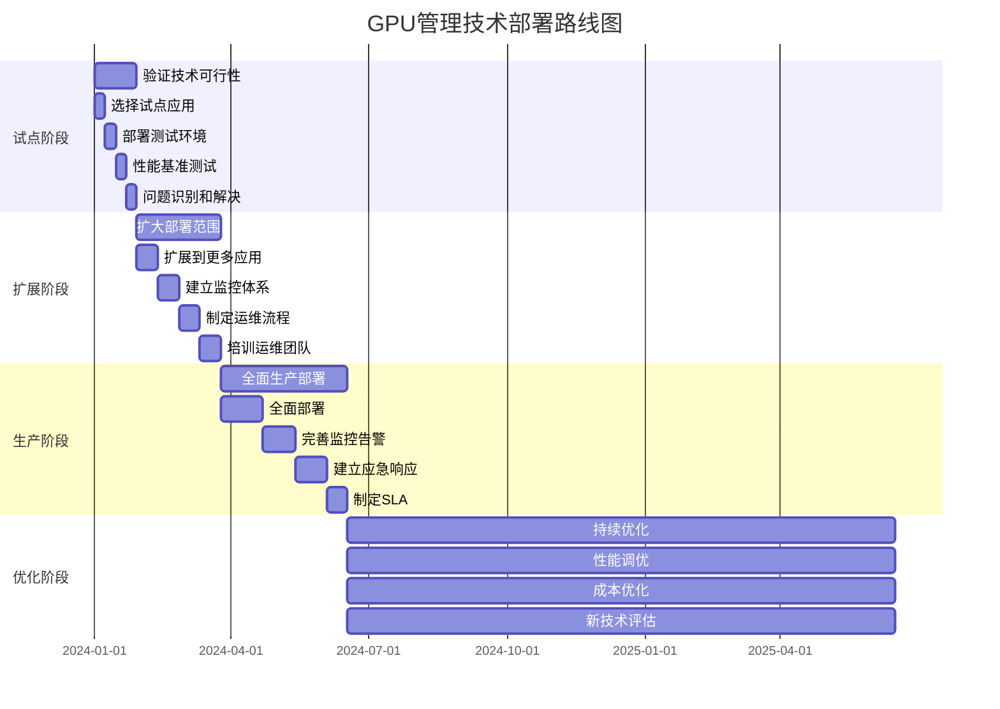

# GPU 管理相关技术深度解析 - 虚拟化、切分及远程调用

## 目录

- [GPU 管理相关技术深度解析 - 虚拟化、切分及远程调用](#gpu-管理相关技术深度解析---虚拟化切分及远程调用)
  - [目录](#目录)
  - [1. 术语表](#1-术语表)
  - [2. 引言](#2-引言)
    - [2.1 GPU 计算资源需求的快速增长背景](#21-gpu-计算资源需求的快速增长背景)
    - [2.2 传统 GPU 使用模式的局限性](#22-传统-gpu-使用模式的局限性)
    - [2.3 GPU 虚拟化技术的重要性和发展趋势](#23-gpu-虚拟化技术的重要性和发展趋势)
    - [2.4 本文研究范围](#24-本文研究范围)
    - [2.5 本章要点总结](#25-本章要点总结)
    - [2.6 延伸阅读](#26-延伸阅读)
  - [3. GPU 虚拟化技术基础](#3-gpu-虚拟化技术基础)
    - [3.1 GPU 虚拟化层次结构](#31-gpu-虚拟化层次结构)
      - [3.1.1 硬件层虚拟化（如 NVIDIA MIG）](#311-硬件层虚拟化如-nvidia-mig)
      - [3.1.2 内核态虚拟化](#312-内核态虚拟化)
      - [3.1.3 用户态资源管理](#313-用户态资源管理)
    - [3.2 GPU 虚拟化的核心挑战](#32-gpu-虚拟化的核心挑战)
      - [3.2.1 资源隔离与共享的平衡](#321-资源隔离与共享的平衡)
      - [3.2.2 性能损耗控制](#322-性能损耗控制)
      - [3.2.3 多租户环境下的安全性](#323-多租户环境下的安全性)
      - [3.2.4 异构 GPU 环境的兼容性](#324-异构-gpu-环境的兼容性)
    - [3.3 本章要点总结](#33-本章要点总结)
    - [3.4 延伸阅读](#34-延伸阅读)
  - [4. GPU 切分技术深度解析](#4-gpu-切分技术深度解析)
    - [4.1 硬件级 GPU 切分](#41-硬件级-gpu-切分)
      - [4.1.1 NVIDIA MIG（Multi-Instance GPU）技术](#411-nvidia-migmulti-instance-gpu技术)
        - [4.1.1.1 MIG 的工作原理和架构](#4111-mig-的工作原理和架构)
        - [4.1.1.2 GPU 实例的创建和管理](#4112-gpu-实例的创建和管理)
        - [4.1.1.3 硬件级隔离的优势和限制](#4113-硬件级隔离的优势和限制)
        - [4.1.1.4 支持的 GPU 型号和配置选项](#4114-支持的-gpu-型号和配置选项)
    - [4.2 软件级 GPU 切分](#42-软件级-gpu-切分)
      - [4.2.1 用户态资源配额方案](#421-用户态资源配额方案)
        - [4.2.1.1 CUDA API 拦截和转发机制](#4211-cuda-api-拦截和转发机制)
        - [4.2.2.2 ioctl、mmap 等系统调用的拦截](#4222-ioctlmmap-等系统调用的拦截)
        - [4.2.2.3 容器环境下的 GPU 资源分配](#4223-容器环境下的-gpu-资源分配)
    - [4.4 GPU 切分的关键技术](#44-gpu-切分的关键技术)
      - [4.4.1 显存管理技术](#441-显存管理技术)
        - [4.4.1.1 显存池化和动态分配](#4411-显存池化和动态分配)
        - [4.4.1.2 统一内存（Unified Memory）的利用](#4412-统一内存unified-memory的利用)
        - [4.4.1.3 显存超分技术和风险控制](#4413-显存超分技术和风险控制)
      - [4.4.2 计算资源调度](#442-计算资源调度)
        - [4.4.2.1 GPU 核心的时间片分配](#4421-gpu-核心的时间片分配)
        - [4.4.2.2 多任务并发执行策略](#4422-多任务并发执行策略)
        - [4.4.2.3 优先级调度和抢占机制](#4423-优先级调度和抢占机制)
      - [4.4.3 性能隔离机制](#443-性能隔离机制)
        - [4.4.3.1 带宽限制和 QoS 保障](#4431-带宽限制和-qos-保障)
        - [4.4.3.2 错误隔离和故障恢复](#4432-错误隔离和故障恢复)
        - [4.4.3.3 监控和性能分析工具](#4433-监控和性能分析工具)
  - [5. GPU 远程调用技术](#5-gpu-远程调用技术)
    - [5.1 远程 GPU 调用的基本原理](#51-远程-gpu-调用的基本原理)
      - [5.1.1 网络透明的 GPU 访问机制](#511-网络透明的-gpu-访问机制)
      - [5.1.2 客户端-服务器架构设计](#512-客户端-服务器架构设计)
      - [5.1.3 网络通信协议](#513-网络通信协议)
    - [5.2 性能优化策略](#52-性能优化策略)
      - [5.2.1 延迟优化](#521-延迟优化)
  - [6. 技术方案对比分析](#6-技术方案对比分析)
    - [6.1 用户态 vs 内核态虚拟化](#61-用户态-vs-内核态虚拟化)
      - [6.1.1 技术实现复杂度对比](#611-技术实现复杂度对比)
      - [6.1.2 性能基准测试框架](#612-性能基准测试框架)
      - [6.1.3 性能开销分析](#613-性能开销分析)
      - [6.1.4 安全性和稳定性评估](#614-安全性和稳定性评估)
      - [6.1.5 部署和维护成本](#615-部署和维护成本)
      - [6.1.6 企业级应用的适用性](#616-企业级应用的适用性)
    - [6.2 本地切分 vs 远程调用](#62-本地切分-vs-远程调用)
      - [6.2.1 延迟和吞吐量对比](#621-延迟和吞吐量对比)
      - [6.2.2 资源利用率分析](#622-资源利用率分析)
      - [6.2.3 扩展性和灵活性](#623-扩展性和灵活性)
      - [6.2.4 故障容错能力](#624-故障容错能力)
    - [6.3 不同切分策略对比](#63-不同切分策略对比)
      - [6.3.1 时间切分 vs 空间切分](#631-时间切分-vs-空间切分)
      - [6.3.2 混合切分策略](#632-混合切分策略)
  - [7. 实际应用场景分析](#7-实际应用场景分析)
    - [7.1 云计算环境](#71-云计算环境)
      - [7.1.1 多租户GPU资源管理](#711-多租户gpu资源管理)
      - [7.1.2 弹性伸缩机制](#712-弹性伸缩机制)
    - [7.2 边缘计算场景](#72-边缘计算场景)
      - [7.2.1 资源受限环境优化](#721-资源受限环境优化)
    - [7.3 高性能计算集群](#73-高性能计算集群)
      - [7.3.1 大规模并行任务调度](#731-大规模并行任务调度)
      - [7.3.2 跨节点GPU通信优化](#732-跨节点gpu通信优化)
  - [8. 技术发展趋势和挑战](#8-技术发展趋势和挑战)
    - [8.1 新兴技术趋势](#81-新兴技术趋势)
      - [8.1.1 AI驱动的GPU资源管理](#811-ai驱动的gpu资源管理)
    - [8.2 技术挑战](#82-技术挑战)
      - [8.2.1 性能开销和延迟问题](#821-性能开销和延迟问题)
      - [8.2.2 安全性和隔离挑战](#822-安全性和隔离挑战)
  - [9. 最佳实践和建议](#9-最佳实践和建议)
    - [9.1 部署策略](#91-部署策略)
      - [9.1.1 渐进式部署方案](#911-渐进式部署方案)
      - [9.1.2 蓝绿部署策略](#912-蓝绿部署策略)
    - [9.2 监控和运维](#92-监控和运维)
      - [9.2.1 全面监控体系](#921-全面监控体系)
      - [9.2.2 自动化运维](#922-自动化运维)
    - [9.3 性能调优指南](#93-性能调优指南)
      - [9.3.1 系统级优化](#931-系统级优化)
      - [9.3.2 应用级优化](#932-应用级优化)
    - [9.4 故障排除和调试](#94-故障排除和调试)
      - [9.4.1 常见问题诊断](#941-常见问题诊断)
  - [10. 总结](#10-总结)
    - [10.1 技术总结](#101-技术总结)
      - [10.1.1 虚拟化技术成熟度](#1011-虚拟化技术成熟度)
      - [10.1.2 切分技术的演进](#1012-切分技术的演进)
      - [10.1.3 远程调用的价值](#1013-远程调用的价值)
    - [10.2 发展趋势](#102-发展趋势)
      - [10.2.1 技术融合](#1021-技术融合)
      - [10.2.2 标准化进程](#1022-标准化进程)
    - [10.3 实践建议](#103-实践建议)
      - [10.3.1 技术选型指导](#1031-技术选型指导)
      - [10.3.2 部署策略最佳实践](#1032-部署策略最佳实践)
      - [10.3.3 性能优化实践](#1033-性能优化实践)
    - [10.4 未来展望](#104-未来展望)
      - [10.4.1 技术发展趋势](#1041-技术发展趋势)
      - [10.4.2 标准化和生态发展](#1042-标准化和生态发展)
  - [11. 参考资料](#11-参考资料)

## 1. 术语表

| 术语 | 全称 | 定义 |
|------|------|------|
| GPU | Graphics Processing Unit | 图形处理单元，专门用于并行计算的处理器 |
| MIG | Multi-Instance GPU | NVIDIA的多实例GPU技术，支持硬件级GPU切分 |
| HAMi | Heterogeneous AI Computing Middleware | 异构AI计算中间件，开源GPU资源管理方案 |
| CUDA | Compute Unified Device Architecture | NVIDIA的并行计算平台和编程模型 |
| API | Application Programming Interface | 应用程序编程接口 |
| cgroup | Control Groups | Linux内核功能，用于限制和隔离进程组的资源使用 |
| ioctl | Input/Output Control | 设备输入输出控制系统调用 |
| mmap | Memory Map | 内存映射系统调用 |
| QoS | Quality of Service | 服务质量，用于保证网络或系统性能 |
| SLA | Service Level Agreement | 服务级别协议 |
| ROI | Return on Investment | 投资回报率 |
| NPU | Neural Processing Unit | 神经网络处理单元 |
| DPU | Data Processing Unit | 数据处理单元 |
| FPGA | Field-Programmable Gate Array | 现场可编程门阵列 |

**重要概念说明：**

- **GPU切分**：将单个GPU的计算资源、显存等按需分配给多个应用或用户的技术
- **时间片调度**：通过时间分片的方式让多个任务轮流使用GPU资源
- **显存超分**：允许分配的虚拟显存总量超过物理显存容量的技术
- **侧信道攻击**：通过分析系统的物理特征（如功耗、时序）来获取敏感信息的攻击方式

## 2. 引言

**本章概览：**
本章将介绍GPU管理技术的发展背景、传统使用模式的局限性，以及GPU虚拟化技术的重要性和发展趋势。

**学习目标：**

- 理解GPU计算资源需求快速增长的背景
- 掌握传统GPU使用模式的主要问题
- 了解GPU虚拟化技术的核心价值
- 明确本文的研究范围和技术路线

随着人工智能、深度学习、科学计算等领域的快速发展，GPU 计算资源的需求呈现爆炸式增长。从早期的图形渲染到现在的大规模机器学习训练和推理，GPU 已经成为现代计算基础设施的核心组件。然而，传统的 GPU 使用模式面临着诸多挑战和局限性。

### 2.1 GPU 计算资源需求的快速增长背景

近年来，AI 应用的复杂度和规模不断提升，特别是大语言模型（LLM）的兴起，对 GPU 计算能力提出了前所未有的需求。从 GPT-3 的 1750 亿参数到 GPT-4 的万亿级参数，模型规模的指数级增长直接推动了对 GPU 资源的巨大需求。同时，企业级 AI 应用的普及使得 GPU 资源的需求从研究机构扩展到各行各业。

### 2.2 传统 GPU 使用模式的局限性

传统的 GPU 使用模式存在以下主要问题：

1. **资源利用率低**：单个应用往往无法充分利用整个 GPU 的计算能力，导致资源浪费
2. **资源分配不灵活**：GPU 通常以整卡为单位分配，无法满足不同应用的精细化资源需求
3. **多租户隔离困难**：多个应用共享 GPU 时缺乏有效的隔离机制，容易出现资源竞争和安全问题
4. **扩展性受限**：传统模式下，GPU 资源的扩展受到物理硬件的限制，难以实现弹性伸缩

### 2.3 GPU 虚拟化技术的重要性和发展趋势

GPU 虚拟化技术应运而生，旨在解决传统使用模式的局限性。通过虚拟化技术，可以实现：

- **资源池化**：将分散的 GPU 资源统一管理，提高整体利用率
- **细粒度分配**：支持按需分配 GPU 资源，满足不同应用的具体需求
- **多租户支持**：提供安全可靠的资源隔离机制
- **弹性扩展**：支持动态资源调整和跨节点资源调度

### 2.4 本文研究范围

本文将深入探讨 GPU 虚拟化、切分技术与远程调用机制，涵盖技术原理、实现方案、性能分析、应用场景等多个维度，为读者提供全面的技术指导和实践建议。

### 2.5 本章要点总结

1. **需求背景**：AI应用规模化推动GPU资源需求爆炸式增长
2. **传统局限**：资源利用率低、分配不灵活、多租户隔离困难、扩展性受限
3. **虚拟化价值**：实现资源池化、细粒度分配、多租户支持、弹性扩展
4. **技术路线**：从虚拟化基础到切分技术，再到远程调用的完整技术体系

### 2.6 延伸阅读

- [NVIDIA GPU虚拟化技术白皮书](https://www.nvidia.com/content/dam/en-zz/Solutions/design-visualization/technologies/turing-architecture/NVIDIA-Turing-Architecture-Whitepaper.pdf)
- [Kubernetes GPU资源管理最佳实践](https://kubernetes.io/docs/tasks/manage-gpus/scheduling-gpus/)
- [Docker GPU支持官方文档](https://docs.docker.com/config/containers/resource_constraints/#gpu)

---

## 3. GPU 虚拟化技术基础

**本章概览：**
本章将深入介绍GPU虚拟化技术的基础知识，包括不同层次的虚拟化实现方式、核心技术挑战，以及各种方案的适用场景。

**学习目标：**

- 掌握GPU虚拟化的三层架构：硬件层、内核态、用户态
- 理解不同虚拟化层次的技术特点和适用场景
- 了解GPU虚拟化面临的核心挑战
- 为后续章节的深入学习奠定基础

### 3.1 GPU 虚拟化层次结构

GPU 虚拟化技术可以从不同层次进行实现，每个层次都有其特定的技术特点和适用场景。

#### 3.1.1 硬件层虚拟化（如 NVIDIA MIG）

硬件层虚拟化是最底层的虚拟化实现方式，直接在 GPU 硬件层面提供虚拟化支持。NVIDIA 的 MIG（Multi-Instance GPU）技术是这一层次的典型代表。

**技术特点：**

- 硬件级别的资源隔离，提供最强的安全性和性能保障
- 支持将单个 GPU 划分为多个独立的 GPU 实例
- 每个实例拥有独立的显存、计算单元和内存带宽
- 实例间完全隔离，互不影响

**适用场景：**

- 对安全性和性能隔离要求极高的企业级应用
- 多租户云计算环境
- 需要严格 SLA 保障的生产环境

#### 3.1.2 内核态虚拟化

内核态虚拟化在操作系统内核层面实现 GPU 资源的虚拟化管理，通过拦截和管理内核态的 GPU 驱动调用来实现资源分配和调度。

**技术特点：**

- 在内核驱动层面进行资源管理和调度
- 支持细粒度的资源分配和时间片调度
- 可以实现跨进程的 GPU 资源共享
- 对应用程序透明，无需修改应用代码

**核心实现机制：**

```c
// 上下文切换
void vgpu_context_switch(struct vgpu_context *from, struct vgpu_context *to) {
    // 保存当前上下文状态
    save_gpu_context(from);

    // 恢复目标上下文状态
    restore_gpu_context(to);
    
    // 更新硬件寄存器
    update_hardware_registers(to);
}
```

**适用场景：**

- 容器化环境下的 GPU 资源管理
- 需要细粒度资源控制的场景
- 对性能要求较高但可接受一定开销的应用

#### 3.1.3 用户态资源管理

用户态资源管理在应用程序层面实现 GPU 资源的配额控制，通过拦截和转发 GPU API 调用来实现资源限制和调度。用户需要明确指定算力百分比和显存大小，系统通过API拦截限制资源使用量。

**技术特点：**

- 在用户空间实现，安全性高，不影响系统稳定性
- 支持跨网络的远程 GPU 访问
- 部署简单，对系统侵入性小
- 支持多种 GPU 厂商和型号

**适用场景：**

- 跨节点的 GPU 资源池化
- 远程 GPU 计算服务
- 对系统稳定性要求极高的环境
- 需要支持多种异构 GPU 的场景

### 3.2 GPU 虚拟化的核心挑战

#### 3.2.1 资源隔离与共享的平衡

GPU 虚拟化需要在资源隔离和共享之间找到平衡点。过度的隔离会导致资源利用率下降，而过度的共享则可能引发资源竞争和安全问题。

**主要挑战：**

- 显存隔离：如何确保不同应用的显存访问不会相互干扰
- 计算资源隔离：如何公平分配 GPU 计算单元的使用时间
- 带宽隔离：如何保证不同应用的内存带宽需求得到满足

#### 3.2.2 性能损耗控制

虚拟化技术不可避免地会引入一定的性能开销，如何将这种开销控制在可接受的范围内是一个重要挑战。

**性能开销来源：**

- API 拦截和转发的开销
- 上下文切换的开销
- 内存拷贝和数据传输的开销
- 调度算法的计算开销

#### 3.2.3 多租户环境下的安全性

在多租户环境中，确保不同租户之间的数据安全和隐私保护是至关重要的。

**安全挑战：**

- **数据泄露防护**：防止一个租户访问另一个租户的数据
- **侧信道攻击防护**：防止通过时序分析等方式获取敏感信息
- **权限控制**：确保租户只能访问被授权的资源
- **内存残留数据**：GPU显存中可能残留前一个任务的敏感数据
- **共享资源竞争**：多个租户同时访问共享资源时的安全风险

**安全解决方案：**

1. **内存清零机制**：

   ```c
   // GPU内存分配时强制清零
   cudaError_t secure_cuda_malloc(void **devPtr, size_t size) {
       cudaError_t result = cudaMalloc(devPtr, size);
       if (result == cudaSuccess) {
           cudaMemset(*devPtr, 0, size);  // 强制清零
       }
       return result;
   }
   ```

2. **访问控制列表（ACL）**：

   ```c
   typedef struct {
       uint32_t tenant_id;
       uint32_t device_mask;     // 允许访问的设备掩码
       size_t memory_limit;      // 内存使用限制
       uint32_t compute_limit;   // 计算资源限制
   } tenant_acl_t;
   
   bool check_access_permission(uint32_t tenant_id, uint32_t device_id) {
       tenant_acl_t *acl = get_tenant_acl(tenant_id);
       return (acl->device_mask & (1 << device_id)) != 0;
   }
   ```

3. **侧信道攻击防护**：

   ```c
   // 时间混淆机制
   void timing_obfuscation(void) {
       static uint64_t last_time = 0;
       uint64_t current_time = get_timestamp();
       uint64_t elapsed = current_time - last_time;
       
       // 添加随机延迟以防止时序分析
       if (elapsed < MIN_EXECUTION_TIME) {
           usleep(rand() % MAX_RANDOM_DELAY);
       }
       last_time = get_timestamp();
   }
   ```

#### 3.2.4 异构 GPU 环境的兼容性

现代数据中心往往包含多种不同厂商、不同型号的 GPU，如何在异构环境中实现统一的虚拟化管理是一个复杂的挑战。

**兼容性挑战：**

- 不同 GPU 架构的差异
- 不同厂商 API 的差异
- 驱动程序版本的兼容性
- 性能特性的差异

### 3.3 本章要点总结

1. **虚拟化层次**：硬件层（MIG）、内核态、用户态三层架构各有优势
2. **核心挑战**：资源隔离与共享平衡、性能损耗控制、多租户安全、异构兼容
3. **安全机制**：内存清零、访问控制、侧信道防护是多租户环境的关键
4. **技术选择**：需根据具体场景选择合适的虚拟化层次和实现方案

### 3.4 延伸阅读

- [NVIDIA MIG用户指南](https://docs.nvidia.com/datacenter/tesla/mig-user-guide/)
- [GPU虚拟化安全最佳实践](https://developer.nvidia.com/blog/improving-gpu-utilization-in-kubernetes/)
- [异构GPU管理框架设计](https://kubernetes.io/docs/concepts/extend-kubernetes/compute-storage-net/device-plugins/)

---

## 4. GPU 切分技术深度解析

**本章概览：**
本章将深入探讨GPU切分技术的实现原理，包括硬件级切分（MIG）和软件级切分的详细技术方案。

**学习目标：**

- 掌握NVIDIA MIG技术的工作原理和配置方法
- 理解软件级GPU切分的实现机制
- 了解不同切分方案的优势和适用场景
- 学习GPU资源管理和调度的最佳实践

### 4.1 硬件级 GPU 切分

#### 4.1.1 NVIDIA MIG（Multi-Instance GPU）技术

NVIDIA MIG 技术是硬件级 GPU 切分的代表性实现，它允许将单个 GPU 物理分割为多个独立的 GPU 实例。

##### 4.1.1.1 MIG 的工作原理和架构

MIG 技术基于 NVIDIA Ampere 架构的设计特性，通过以下机制实现 GPU 切分：

1. **计算单元分割**：将 GPU 的流式多处理器（SM）分组，每个 MIG 实例分配独立的 SM 组
2. **显存分割**：为每个 MIG 实例分配独立的显存空间，确保内存访问的完全隔离
3. **内存控制器分割**：每个 MIG 实例拥有独立的内存控制器，保证内存带宽的隔离
4. **硬件调度器分割**：每个实例拥有独立的硬件调度器，避免调度冲突

##### 4.1.1.2 GPU 实例的创建和管理

MIG 实例的创建和管理通过以下步骤实现：

1. **GPU 实例配置**：

   ```bash
   # 启用 MIG 模式
   nvidia-smi -i 0 -mig 1
   
   # 创建 GPU 实例
   nvidia-smi mig -i 0 -cgi 1g.5gb,2g.10gb
    
   # 创建计算实例
   nvidia-smi mig -i 0 -cci
   ```

2. **实例监控和管理**：

   ```bash
   # 查看 MIG 实例状态
   nvidia-smi -L
   
   # 监控实例使用情况
   nvidia-smi mig -i 0 -lgi
   
   # 查看详细配置信息
   nvidia-smi mig -i 0 -lgip
   ```

3. **错误处理和故障排除**：

   ```bash
   # 检查 MIG 支持状态
   nvidia-smi --query-gpu=mig.mode.current --format=csv
   
   # 重置 MIG 配置
   nvidia-smi mig -i 0 -dci
   nvidia-smi mig -i 0 -dgi
   
   # 验证实例创建
   nvidia-smi mig -i 0 -lgi | grep "GPU instance"
   ```

4. **部署注意事项**：

   - **驱动版本要求**：需要 NVIDIA 驱动版本 ≥ 450.80.02
   - **CUDA 版本要求**：需要 CUDA 版本 ≥ 11.0
   - **容器运行时**：需要 nvidia-container-runtime ≥ 3.4.0
   - **重启要求**：启用/禁用 MIG 模式需要重启 GPU
   - **权限管理**：需要 root 权限进行 MIG 配置
   - **资源规划**：提前规划实例配置，避免频繁重配置

##### 4.1.1.3 硬件级隔离的优势和限制

**优势：**

- **完全隔离**：硬件级别的资源隔离，确保实例间完全独立
- **性能保障**：每个实例拥有专用的硬件资源，性能可预测
- **安全性高**：硬件级别的隔离提供最高级别的安全保障
- **故障隔离**：一个实例的故障不会影响其他实例

**限制：**

- **硬件依赖**：仅支持特定的 GPU 型号（A100、A30、A40 等）
- **配置固定**：实例配置相对固定，动态调整能力有限
- **资源粒度**：切分粒度受硬件设计限制，无法实现任意大小的分割
- **成本较高**：需要支持 MIG 的高端 GPU，成本相对较高

##### 4.1.1.4 支持的 GPU 型号和配置选项

**支持的 GPU 型号：**

- NVIDIA A100（40GB/80GB）
- NVIDIA A30
- NVIDIA A40
- NVIDIA H100

**配置选项：**

- **1g.5gb**：1/7 GPU + 5GB 显存
- **2g.10gb**：2/7 GPU + 10GB 显存
- **3g.20gb**：3/7 GPU + 20GB 显存
- **4g.20gb**：4/7 GPU + 20GB 显存
- **7g.40gb**：完整 GPU + 40GB 显存

### 4.2 软件级 GPU 切分

#### 4.2.1 用户态资源配额方案

用户态资源配额通过在应用程序层面拦截和管理 GPU API 调用来实现资源限制。

##### 4.2.1.1 CUDA API 拦截和转发机制

用户态资源管理的核心是 API 拦截技术，主要包括：

1. **动态库替换**：

   ```c
   // 拦截 CUDA Runtime API
   cudaError_t cudaMalloc(void **devPtr, size_t size) {
       // 资源管理逻辑
       return virtual_cuda_malloc(devPtr, size);
   }
   
   // 拦截 CUDA Driver API
   CUresult cuMemAlloc(CUdeviceptr *dptr, size_t bytesize) {
       // 虚拟化处理
       return virtual_cu_mem_alloc(dptr, bytesize);
   }
   ```

2. **API 转发机制**：

   ```c
   typedef struct {
       void *real_ptr;      // 真实 GPU 内存指针
       void *virtual_ptr;   // 虚拟内存指针
       size_t size;         // 内存大小
       int device_id;       // 设备 ID
   } memory_mapping_t;
   
   // API 转发函数
   cudaError_t virtual_cuda_malloc(void **devPtr, size_t size) {
       // 1. 检查资源配额
       if (!check_memory_quota(size)) {
           return cudaErrorMemoryAllocation;
       }
       
       // 2. 分配真实 GPU 内存
       cudaError_t result = real_cudaMalloc(&real_ptr, size);
       
       // 3. 建立虚拟映射
       create_memory_mapping(devPtr, real_ptr, size);
       
       return result;
   }
   ```

##### 4.2.2.2 ioctl、mmap 等系统调用的拦截

内核态虚拟化需要拦截关键的系统调用来实现资源控制：

1. **ioctl 拦截**：

   ```c
   // ioctl 命令拦截表
   static const struct ioctl_handler ioctl_handlers[] = {
       {NVIDIA_IOCTL_CARD_INFO, handle_card_info},
       {NVIDIA_IOCTL_MEM_ALLOC, handle_mem_alloc},
       {NVIDIA_IOCTL_MEM_FREE, handle_mem_free},
       {NVIDIA_IOCTL_SUBMIT, handle_submit},
   };
   
   static long vgpu_ioctl_handler(struct file *file, unsigned int cmd, unsigned long arg) {
       for (int i = 0; i < ARRAY_SIZE(ioctl_handlers); i++) {
           if (ioctl_handlers[i].cmd == cmd) {
               return ioctl_handlers[i].handler(file, arg);
           }
       }
       return -ENOTTY;
   }
   ```

2. **mmap 拦截**：

   ```c
   // 内存映射拦截
   static int vgpu_mmap(struct file *file, struct vm_area_struct *vma) {
       struct vgpu_context *ctx = file->private_data;
       size_t size = vma->vm_end - vma->vm_start;
       
       // 检查映射权限
       if (!check_mapping_permission(ctx, vma->vm_pgoff, size)) {
           return -EPERM;
       }
       
       // 建立虚拟映射
       return create_virtual_mapping(ctx, vma);
   }
   ```

##### 4.2.2.3 容器环境下的 GPU 资源分配

在容器环境中，内核态虚拟化需要与容器运行时集成：

1. **cgroup 集成**：

   ```c
   // GPU cgroup 子系统
   struct cgroup_subsys gpu_cgrp_subsys = {
       .css_alloc = gpu_css_alloc,
       .css_free = gpu_css_free,
       .can_attach = gpu_can_attach,
       .attach = gpu_attach,
   };
   
   // GPU 资源限制
   struct gpu_cgroup {
       struct cgroup_subsys_state css;
       u64 memory_limit;        // 显存限制
       u64 compute_limit;       // 计算限制
       atomic64_t memory_usage; // 当前显存使用
   };
   ```

2. **容器资源隔离**：

   ```c
   // 容器 GPU 上下文
   struct container_gpu_context {
       char container_id[64];
       struct vgpu_context *vgpu;
       struct gpu_cgroup *cgroup;
       struct list_head container_list;
   };
   
   // 容器资源分配
   int allocate_container_gpu(const char *container_id, struct gpu_resource_spec *spec) {
       struct container_gpu_context *ctx = kmalloc(sizeof(*ctx), GFP_KERNEL);
       
       // 创建虚拟 GPU 上下文
       ctx->vgpu = create_vgpu_context(spec);
       
       // 设置 cgroup 限制
       ctx->cgroup = setup_gpu_cgroup(spec);
       
       // 注册容器上下文
       register_container_context(container_id, ctx);
       
       return 0;
    }
    ```

#### 4.2.3 缓存优化

智能缓存策略可以显著减少重复数据传输和计算：

1. **结果缓存**：

   ```c
   // 缓存条目结构
   typedef struct cache_entry {
       uint64_t key_hash;           // 键哈希值
       void *result_data;           // 结果数据
       size_t result_size;          // 结果大小
       uint64_t access_count;       // 访问次数
       time_t last_access;          // 最后访问时间
       struct cache_entry *next;    // 链表指针
   } cache_entry_t;
   
   // 缓存管理器
   typedef struct {
       cache_entry_t **hash_table;  // 哈希表
       size_t table_size;           // 表大小
       size_t max_entries;          // 最大条目数
       size_t current_entries;      // 当前条目数
       pthread_rwlock_t cache_lock; // 读写锁
       cache_policy_t policy;       // 缓存策略
   } result_cache_t;
   
   // 计算请求键
   uint64_t compute_request_key(remote_request_t *req) {
       uint64_t hash = 0;
       
       // 基于API类型和参数计算哈希
       hash = hash_combine(hash, req->api_type);
       
       switch (req->api_type) {
           case CUDA_KERNEL_LAUNCH:
               // 对于kernel启动，包含kernel函数指针和参数
               hash = hash_combine(hash, (uint64_t)req->kernel_func);
               hash = hash_data(hash, req->payload, req->payload_size);
               break;
           case CUDA_MEMCPY:
               // 对于内存拷贝，只缓存常量数据
               if (req->memcpy_kind == cudaMemcpyHostToDevice) {
                   hash = hash_data(hash, req->payload, req->payload_size);
               }
               break;
       }
       
       return hash;
   }
   
   // 查找缓存
   cache_entry_t* cache_lookup(result_cache_t *cache, uint64_t key) {
       pthread_rwlock_rdlock(&cache->cache_lock);
       
       size_t index = key % cache->table_size;
       cache_entry_t *entry = cache->hash_table[index];
       
       while (entry) {
           if (entry->key_hash == key) {
               entry->access_count++;
               entry->last_access = time(NULL);
               pthread_rwlock_unlock(&cache->cache_lock);
               return entry;
           }
           entry = entry->next;
       }
       
       pthread_rwlock_unlock(&cache->cache_lock);
       return NULL;
   }
   ```

2. **预取策略**：

   ```c
   // 预取预测器
   typedef struct {
       uint64_t *access_pattern;    // 访问模式
       size_t pattern_size;         // 模式大小
       size_t pattern_index;        // 当前索引
       double confidence_threshold; // 置信度阈值
   } prefetch_predictor_t;
   
   // 访问模式学习
   void learn_access_pattern(prefetch_predictor_t *predictor, uint64_t address) {
       // 记录访问地址
       predictor->access_pattern[predictor->pattern_index] = address;
       predictor->pattern_index = (predictor->pattern_index + 1) % predictor->pattern_size;
       
       // 分析访问模式
       analyze_pattern(predictor);
   }
   
   // 预测下一个访问
   uint64_t predict_next_access(prefetch_predictor_t *predictor, double *confidence) {
       // 基于历史模式预测
       pattern_match_t matches[MAX_MATCHES];
       int match_count = find_pattern_matches(predictor, matches, MAX_MATCHES);
       
       if (match_count == 0) {
           *confidence = 0.0;
           return 0;
       }
       
       // 计算加权预测
       uint64_t predicted = 0;
       double total_weight = 0.0;
       
       for (int i = 0; i < match_count; i++) {
           double weight = matches[i].confidence * matches[i].frequency;
           predicted += matches[i].next_address * weight;
           total_weight += weight;
       }
       
       if (total_weight > 0) {
           predicted /= total_weight;
           *confidence = total_weight / match_count;
       } else {
           *confidence = 0.0;
       }
       
       return predicted;
   }
   
   // 执行预取
   int execute_prefetch(uint64_t predicted_address, double confidence) {
       if (confidence < 0.7) {  // 置信度阈值
           return 0;  // 不执行预取
       }
       
       // 异步预取数据
        prefetch_request_t *req = create_prefetch_request(predicted_address);
        return submit_prefetch_request(req);
    }
    ```

### 4.3 容错与可靠性

远程GPU调用系统需要具备强大的容错能力来应对网络故障、服务器宕机等异常情况：

#### 4.3.1 故障检测机制

及时准确的故障检测是容错系统的基础：

1. **心跳监控**：

   ```c
   // 心跳配置
   typedef struct {
       uint32_t interval_ms;        // 心跳间隔
       uint32_t timeout_ms;         // 超时时间
       uint32_t max_missed;         // 最大丢失次数
       bool adaptive_interval;      // 自适应间隔
   } heartbeat_config_t;
   
   // 心跳状态
   typedef struct {
       uint64_t sequence_number;    // 序列号
       struct timespec last_sent;   // 最后发送时间
       struct timespec last_received; // 最后接收时间
       uint32_t missed_count;       // 丢失计数
       connection_state_t state;    // 连接状态
   } heartbeat_state_t;
   
   // 发送心跳
   int send_heartbeat(connection_t *conn, heartbeat_state_t *hb_state) {
       heartbeat_message_t hb_msg;
       
       hb_msg.sequence = hb_state->sequence_number++;
       hb_msg.timestamp = get_current_time_ns();
       hb_msg.client_load = get_client_load();
       
       clock_gettime(CLOCK_MONOTONIC, &hb_state->last_sent);
       
       return send_message(conn, MESSAGE_TYPE_HEARTBEAT, &hb_msg, sizeof(hb_msg));
   }
   
   // 处理心跳响应
   int handle_heartbeat_response(heartbeat_message_t *response, heartbeat_state_t *hb_state) {
       clock_gettime(CLOCK_MONOTONIC, &hb_state->last_received);
       
       // 计算RTT
       uint64_t rtt_ns = get_current_time_ns() - response->timestamp;
       update_connection_rtt(rtt_ns);
       
       // 重置丢失计数
       hb_state->missed_count = 0;
       hb_state->state = CONNECTION_HEALTHY;
       
       return 0;
   }
   ```

2. **健康检查**：

   ```c
   // 健康检查项
   typedef enum {
       HEALTH_CHECK_NETWORK,        // 网络连通性
       HEALTH_CHECK_GPU_STATUS,     // GPU状态
       HEALTH_CHECK_MEMORY,         // 内存使用
       HEALTH_CHECK_LOAD,           // 系统负载
       HEALTH_CHECK_TEMPERATURE     // 温度监控
   } health_check_type_t;
   
   // 健康检查结果
   typedef struct {
       health_check_type_t type;
       health_status_t status;      // 健康状态
       double metric_value;         // 指标值
       char description[256];       // 描述信息
       struct timespec timestamp;   // 时间戳
   } health_check_result_t;
   
   // 执行GPU健康检查
   int check_gpu_health(health_check_result_t *result) {
       result->type = HEALTH_CHECK_GPU_STATUS;
       clock_gettime(CLOCK_MONOTONIC, &result->timestamp);
       
       // 检查GPU设备状态
       cudaError_t cuda_status = cudaGetLastError();
       if (cuda_status != cudaSuccess) {
           result->status = HEALTH_STATUS_ERROR;
           snprintf(result->description, sizeof(result->description), 
                   "CUDA Error: %s", cudaGetErrorString(cuda_status));
           return -1;
       }
       
       // 检查GPU内存使用
       size_t free_mem, total_mem;
       cudaMemGetInfo(&free_mem, &total_mem);
       
       double memory_usage = (double)(total_mem - free_mem) / total_mem;
       result->metric_value = memory_usage;
       
       if (memory_usage > 0.95) {
           result->status = HEALTH_STATUS_CRITICAL;
           snprintf(result->description, sizeof(result->description), 
                   "GPU memory usage critical: %.1f%%", memory_usage * 100);
       } else if (memory_usage > 0.85) {
           result->status = HEALTH_STATUS_WARNING;
           snprintf(result->description, sizeof(result->description), 
                   "GPU memory usage high: %.1f%%", memory_usage * 100);
       } else {
           result->status = HEALTH_STATUS_HEALTHY;
           snprintf(result->description, sizeof(result->description), 
                   "GPU status normal, memory usage: %.1f%%", memory_usage * 100);
       }
       
       return 0;
   }
   ```

### 4.4 GPU 切分的关键技术

#### 4.4.1 显存管理技术

##### 4.4.1.1 显存池化和动态分配

显存池化是提高 GPU 资源利用率的关键技术：

1. **全局显存池**：

   ```c
   // 全局显存池结构
   typedef struct {
       void *base_addr;         // 基地址
       size_t total_size;       // 总大小
       size_t available_size;   // 可用大小
       struct rb_root free_tree; // 空闲块红黑树
       struct list_head alloc_list; // 分配块链表
       spinlock_t lock;         // 自旋锁
   } global_memory_pool_t;
   
   // 动态分配算法
   void* dynamic_alloc(size_t size, int alignment) {
       struct memory_block *block;
       
       // 在红黑树中查找合适的空闲块
       block = find_best_fit_block(&pool.free_tree, size, alignment);
       
       if (block) {
           // 分割块并更新数据结构
           split_and_allocate(block, size);
           return block->addr;
       }
       
       // 触发垃圾回收
       if (garbage_collect() > 0) {
           return dynamic_alloc(size, alignment); // 递归重试
       }
       
       return NULL; // 分配失败
   }
   ```

2. **内存碎片整理**：

   ```c
   // 内存整理算法
   void memory_defragmentation() {
       struct list_head *pos, *tmp;
       struct memory_block *block;
       
       // 标记阶段：标记所有活跃的内存块
       list_for_each_safe(pos, tmp, &pool.alloc_list) {
           block = list_entry(pos, struct memory_block, list);
           if (is_block_active(block)) {
               mark_block(block);
           }
       }
       
       // 压缩阶段：移动活跃块，合并空闲空间
       compact_memory_blocks();
       
       // 更新指针引用
       update_pointer_references();
   }
   ```

##### 4.4.1.2 统一内存（Unified Memory）的利用

统一内存技术允许 CPU 和 GPU 共享同一地址空间：

1. **统一内存分配**：

   ```c
   // 统一内存分配接口
   cudaError_t cudaMallocManaged(void **devPtr, size_t size, unsigned int flags) {
       // 分配统一内存
       void *ptr = allocate_unified_memory(size, flags);
       if (!ptr) {
           return cudaErrorMemoryAllocation;
       }
       
       // 设置内存属性
       set_memory_attributes(ptr, size, flags);
       
       // 注册内存映射
       register_unified_mapping(ptr, size);
       
       *devPtr = ptr;
       return cudaSuccess;
   }
   
   // 内存预取
   cudaError_t cudaMemPrefetchAsync(const void *devPtr, size_t count, int dstDevice, cudaStream_t stream) {
       // 异步预取内存到目标设备
       return async_prefetch_memory(devPtr, count, dstDevice, stream);
   }
   ```

2. **页面迁移机制**：

   ```c
   // 页面故障处理
   void handle_page_fault(void *addr, int device_id) {
       struct page_info *page = find_page_info(addr);
       
       if (page->location != device_id) {
           // 页面不在目标设备，需要迁移
           migrate_page(page, device_id);
       }
       
       // 更新页表映射
       update_page_table(addr, device_id);
   }
   
   // 页面迁移
   void migrate_page(struct page_info *page, int target_device) {
       // 1. 在目标设备分配内存
       void *target_addr = allocate_device_memory(target_device, page->size);
       
       // 2. 复制页面数据
       copy_memory_async(page->addr, target_addr, page->size);
       
       // 3. 更新页面信息
       page->addr = target_addr;
       page->location = target_device;
   }
   ```

##### 4.4.1.3 显存超分技术和风险控制

显存超分允许分配超过物理显存大小的虚拟显存：

1. **超分配策略**：

   ```c
   // 超分配配置
   typedef struct {
       float overcommit_ratio;      // 超分比例（如 1.5 表示 150%）
       size_t swap_threshold;       // 交换阈值
       int swap_policy;             // 交换策略（LRU/LFU/FIFO）
       bool enable_compression;     // 启用压缩
   } overcommit_config_t;
   
   // 超分分配检查
   bool can_overcommit_allocate(size_t size) {
       size_t total_allocated = get_total_allocated_memory();
       size_t physical_memory = get_physical_memory_size();
       
       // 检查是否超过超分限制
       if (total_allocated + size > physical_memory * config.overcommit_ratio) {
           return false;
       }
       
       return true;
   }
   ```

2. **风险控制机制**：

   ```c
   // 内存压力监控
   typedef struct {
       atomic_t pressure_level;     // 压力等级 (0-100)
       unsigned long last_oom;      // 上次 OOM 时间
       int oom_count;               // OOM 次数
   } memory_pressure_t;
   
   // 内存回收策略
   void memory_reclaim_strategy() {
       int pressure = atomic_read(&memory_pressure.pressure_level);
       
       if (pressure > 80) {
           // 高压力：激进回收
           aggressive_memory_reclaim();
       } else if (pressure > 60) {
           // 中等压力：选择性回收
           selective_memory_reclaim();
       } else if (pressure > 40) {
           // 低压力：后台回收
           background_memory_reclaim();
       }
   }
   
   // OOM 处理
   void handle_out_of_memory() {
       // 1. 记录 OOM 事件
       log_oom_event();
       
       // 2. 选择牺牲进程
       struct process *victim = select_oom_victim();
       
       // 3. 终止进程并回收内存
       if (victim) {
           kill_process_and_reclaim(victim);
       }
       
       // 4. 更新压力统计
       update_memory_pressure();
   }
   ```

#### 4.4.2 计算资源调度

##### 4.4.2.1 GPU 核心的时间片分配

GPU 计算资源的时间片调度确保多个应用公平共享计算能力：

1. **时间片调度器**：

   ```c
   // 时间片调度器结构
   typedef struct {
       struct list_head ready_queue;    // 就绪队列
       struct list_head running_queue;  // 运行队列
       struct timer_list scheduler_timer; // 调度定时器
       int time_slice_ms;               // 时间片长度（毫秒）
       spinlock_t queue_lock;           // 队列锁
   } timeslice_scheduler_t;
   
   // 调度器主函数
   void scheduler_tick(struct timer_list *timer) {
       struct task_context *current_task;
       struct task_context *next_task;
       
       spin_lock(&scheduler.queue_lock);
       
       // 获取当前运行任务
       current_task = get_current_running_task();
       
       if (current_task) {
           // 时间片用完，抢占当前任务
           preempt_current_task(current_task);
           
           // 将任务放回就绪队列
           list_add_tail(&current_task->list, &scheduler.ready_queue);
       }
       
       // 选择下一个任务
       next_task = select_next_task();
       
       if (next_task) {
           // 切换到下一个任务
           context_switch_to(next_task);
           
           // 设置下一个时间片
           mod_timer(&scheduler.scheduler_timer, 
                    jiffies + msecs_to_jiffies(scheduler.time_slice_ms));
       }
       
       spin_unlock(&scheduler.queue_lock);
   }
   ```

2. **上下文切换优化**：

   ```c
   // GPU 上下文结构
   typedef struct {
       uint32_t *register_state;    // 寄存器状态
       void *shader_cache;          // 着色器缓存
       void *texture_cache;         // 纹理缓存
       struct memory_mapping *mappings; // 内存映射
       int context_id;
   } gpu_context_t;
   
   // 快速上下文切换
   void fast_context_switch(gpu_context_t *from, gpu_context_t *to) {
       // 1. 保存当前上下文（仅保存脏寄存器）
       save_dirty_registers(from);
       
       // 2. 恢复目标上下文
       restore_context_registers(to);
       
       // 3. 更新内存映射
       update_memory_mappings(to->mappings);
       
       // 4. 刷新缓存（如果需要）
       if (cache_coherency_required(from, to)) {
           flush_gpu_caches();
       }
   }
   ```

##### 4.4.2.2 多任务并发执行策略

现代 GPU 支持多任务并发执行，需要合理的调度策略：

1. **并发执行管理**：

   ```c
   // 并发执行上下文
   typedef struct {
       int max_concurrent_tasks;    // 最大并发任务数
       int active_task_count;       // 当前活跃任务数
       struct list_head task_queue; // 任务队列
       struct semaphore concurrency_sem; // 并发信号量
   } concurrent_executor_t;
   
   // 任务提交
   int submit_concurrent_task(struct gpu_task *task) {
       // 等待并发槽位
       if (down_interruptible(&executor.concurrency_sem)) {
           return -ERESTARTSYS;
       }
       
       // 添加到执行队列
       spin_lock(&executor.queue_lock);
       list_add_tail(&task->list, &executor.task_queue);
       executor.active_task_count++;
       spin_unlock(&executor.queue_lock);
       
       // 启动任务执行
       schedule_task_execution(task);
       
       return 0;
   }
   
   // 任务完成处理
   void task_completion_handler(struct gpu_task *task) {
       // 从队列中移除
       spin_lock(&executor.queue_lock);
       list_del(&task->list);
       executor.active_task_count--;
       spin_unlock(&executor.queue_lock);
       
       // 释放并发槽位
       up(&executor.concurrency_sem);
       
       // 通知任务完成
       complete(&task->completion);
   }
   ```

2. **负载均衡策略**：

   ```c
   // 负载均衡器
   typedef struct {
       int num_execution_units;     // 执行单元数量
       int *unit_load;              // 各单元负载
       struct list_head *unit_queues; // 各单元任务队列
   } load_balancer_t;
   
   // 负载均衡任务分配
   int balance_task_assignment(struct gpu_task *task) {
       int target_unit = -1;
       int min_load = INT_MAX;
       
       // 选择负载最轻的执行单元
       for (int i = 0; i < balancer.num_execution_units; i++) {
           if (balancer.unit_load[i] < min_load) {
               min_load = balancer.unit_load[i];
               target_unit = i;
           }
       }
       
       if (target_unit >= 0) {
           // 分配任务到目标单元
           assign_task_to_unit(task, target_unit);
           balancer.unit_load[target_unit]++;
           return 0;
       }
       
       return -ENOSPC;
   }
   ```

##### 4.4.2.3 优先级调度和抢占机制

优先级调度确保重要任务能够及时得到执行：

1. **多级优先级队列**：

   ```c
   // 优先级定义
   enum task_priority {
       PRIORITY_REALTIME = 0,   // 实时任务
       PRIORITY_HIGH = 1,       // 高优先级
       PRIORITY_NORMAL = 2,     // 普通优先级
       PRIORITY_LOW = 3,        // 低优先级
       PRIORITY_IDLE = 4,       // 空闲任务
       NUM_PRIORITIES
   };
   
   // 多级队列调度器
   typedef struct {
       struct list_head priority_queues[NUM_PRIORITIES];
       int queue_weights[NUM_PRIORITIES];  // 队列权重
       int current_priority;               // 当前调度优先级
   } priority_scheduler_t;
   
   // 优先级调度算法
   struct gpu_task* select_highest_priority_task() {
       struct gpu_task *task;
       
       // 从高优先级到低优先级遍历
       for (int i = 0; i < NUM_PRIORITIES; i++) {
           if (!list_empty(&scheduler.priority_queues[i])) {
               task = list_first_entry(&scheduler.priority_queues[i], 
                                     struct gpu_task, list);
               list_del(&task->list);
               return task;
           }
       }
       
       return NULL; // 没有可调度的任务
   }
   ```

2. **抢占机制实现**：

   ```c
   // 抢占检查
   bool should_preempt_current_task(struct gpu_task *current, struct gpu_task *new_task) {
       // 优先级抢占
       if (new_task->priority < current->priority) {
           return true;
       }
       
       // 实时任务抢占
       if (new_task->priority == PRIORITY_REALTIME && 
           current->priority != PRIORITY_REALTIME) {
           return true;
       }
       
       // 饥饿防护：长时间等待的任务可以抢占
       if (time_since_submission(new_task) > STARVATION_THRESHOLD) {
           return true;
       }
       
       return false;
   }
   
   // 执行抢占
   void preempt_current_task(struct gpu_task *current, struct gpu_task *new_task) {
       // 1. 暂停当前任务
       pause_gpu_task(current);
       
       // 2. 保存当前任务状态
       save_task_context(current);
       
       // 3. 将被抢占任务重新入队
       requeue_preempted_task(current);
       
       // 4. 启动新任务
       start_gpu_task(new_task);
       
       // 5. 记录抢占事件
       log_preemption_event(current, new_task);
   }
   ```

#### 4.4.3 性能隔离机制

##### 4.4.3.1 带宽限制和 QoS 保障

内存带宽是 GPU 性能的关键因素，需要实现有效的带宽管理：

1. **带宽监控和限制**：

   ```c
   // 带宽监控结构
   typedef struct {
       atomic64_t bytes_transferred;    // 传输字节数
       atomic64_t transfer_count;       // 传输次数
       unsigned long last_reset_time;   // 上次重置时间
       u64 bandwidth_limit;             // 带宽限制（字节/秒）
       u64 current_bandwidth;           // 当前带宽使用
   } bandwidth_monitor_t;
   
   // 带宽限制检查
   bool check_bandwidth_limit(struct gpu_task *task, size_t transfer_size) {
       bandwidth_monitor_t *monitor = &task->bandwidth_monitor;
       unsigned long current_time = jiffies;
       u64 time_delta = current_time - monitor->last_reset_time;
       
       // 计算当前带宽使用率
       if (time_delta >= HZ) { // 每秒重置一次
           monitor->current_bandwidth = 
               atomic64_read(&monitor->bytes_transferred) * HZ / time_delta;
           atomic64_set(&monitor->bytes_transferred, 0);
           monitor->last_reset_time = current_time;
       }
       
       // 检查是否超过限制
       if (monitor->current_bandwidth + transfer_size > monitor->bandwidth_limit) {
           return false; // 超过带宽限制
       }
       
       return true;
   }
   
   // 带宽限流
   void bandwidth_throttle(struct gpu_task *task, size_t transfer_size) {
       bandwidth_monitor_t *monitor = &task->bandwidth_monitor;
       
       if (!check_bandwidth_limit(task, transfer_size)) {
           // 计算需要等待的时间
           u64 excess_bandwidth = monitor->current_bandwidth + transfer_size - 
                                 monitor->bandwidth_limit;
           unsigned long wait_time = excess_bandwidth * HZ / monitor->bandwidth_limit;
           
           // 延迟执行
           schedule_timeout_interruptible(wait_time);
       }
       
       // 更新带宽使用统计
       atomic64_add(transfer_size, &monitor->bytes_transferred);
   }
   ```

2. **QoS 保障机制**：

   ```c
   // QoS 等级定义
   enum qos_level {
       QOS_GUARANTEED,      // 保证级别
       QOS_BURSTABLE,       // 突发级别
       QOS_BEST_EFFORT,     // 尽力而为级别
   };
   
   // QoS 配置
   typedef struct {
       enum qos_level level;
       u64 guaranteed_bandwidth;    // 保证带宽
       u64 max_bandwidth;           // 最大带宽
       int priority_boost;          // 优先级提升
   } qos_config_t;
   
   // QoS 调度器
   void qos_scheduler() {
       struct list_head *pos;
       struct gpu_task *task;
       
       // 首先调度保证级别的任务
       list_for_each(pos, &guaranteed_queue) {
           task = list_entry(pos, struct gpu_task, list);
           if (can_schedule_guaranteed_task(task)) {
               schedule_task(task);
           }
       }
       
       // 然后调度突发级别的任务
       list_for_each(pos, &burstable_queue) {
           task = list_entry(pos, struct gpu_task, list);
           if (has_spare_bandwidth()) {
               schedule_task(task);
           }
       }
       
       // 最后调度尽力而为级别的任务
       list_for_each(pos, &best_effort_queue) {
           task = list_entry(pos, struct gpu_task, list);
           if (has_spare_bandwidth()) {
               schedule_task(task);
           }
       }
   }
   ```

##### 4.4.3.2 错误隔离和故障恢复

错误隔离确保一个任务的故障不会影响其他任务：

1. **错误检测和隔离**：

   ```c
   // 错误类型定义
   enum gpu_error_type {
       ERROR_MEMORY_FAULT,      // 内存故障
       ERROR_COMPUTE_TIMEOUT,   // 计算超时
       ERROR_INVALID_OPERATION, // 无效操作
       ERROR_HARDWARE_FAULT,    // 硬件故障
   };
   
   // 错误处理器
   typedef struct {
       enum gpu_error_type type;
       int (*handler)(struct gpu_task *task, void *error_data);
       bool isolate_task;       // 是否隔离任务
       bool reset_required;     // 是否需要重置
   } error_handler_t;
   
   // 错误处理主函数
   void handle_gpu_error(struct gpu_task *task, enum gpu_error_type type, void *error_data) {
       error_handler_t *handler = find_error_handler(type);
       
       if (handler) {
           // 记录错误信息
           log_error_event(task, type, error_data);
           
           // 隔离故障任务
           if (handler->isolate_task) {
               isolate_faulty_task(task);
           }
           
           // 执行错误处理
           int result = handler->handler(task, error_data);
           
           // 如果需要，重置 GPU 状态
           if (handler->reset_required) {
               reset_gpu_state();
           }
           
           // 尝试恢复任务
           if (result == 0 && task->recoverable) {
               recover_task(task);
           }
       }
   }
   
   // 任务隔离
   void isolate_faulty_task(struct gpu_task *task) {
       // 1. 停止任务执行
       stop_task_execution(task);
       
       // 2. 清理任务资源
       cleanup_task_resources(task);
       
       // 3. 标记任务为故障状态
       task->state = TASK_STATE_FAULTED;
       
       // 4. 从调度队列中移除
       remove_from_scheduler(task);
       
       // 5. 通知监控系统
       notify_monitoring_system(task);
   }
   ```

2. **故障恢复机制**：

   ```c
   // 恢复策略
   enum recovery_strategy {
       RECOVERY_RESTART,        // 重启任务
       RECOVERY_CHECKPOINT,     // 从检查点恢复
       RECOVERY_MIGRATE,        // 迁移到其他 GPU
       RECOVERY_ABORT,          // 终止任务
   };
   
   // 故障恢复管理器
   typedef struct {
       enum recovery_strategy strategy;
       int max_retry_count;     // 最大重试次数
       unsigned long retry_interval; // 重试间隔
       bool enable_checkpointing;     // 启用检查点
   } recovery_manager_t;
   
   // 任务恢复
   int recover_task(struct gpu_task *task) {
       recovery_manager_t *manager = &task->recovery_manager;
       
       switch (manager->strategy) {
       case RECOVERY_RESTART:
           return restart_task(task);
           
       case RECOVERY_CHECKPOINT:
           return restore_from_checkpoint(task);
           
       case RECOVERY_MIGRATE:
           return migrate_task_to_another_gpu(task);
           
       case RECOVERY_ABORT:
           abort_task(task);
           return -ECANCELED;
           
       default:
           return -EINVAL;
       }
   }
   
   // 检查点机制
   int create_checkpoint(struct gpu_task *task) {
       struct checkpoint *cp = kmalloc(sizeof(*cp), GFP_KERNEL);
       
       // 保存任务状态
       cp->task_state = task->state;
       cp->progress = task->progress;
       cp->timestamp = ktime_get();
       
       // 保存 GPU 上下文
       save_gpu_context(&cp->gpu_context);
       
       // 保存内存状态
       save_memory_state(&cp->memory_state);
       
       // 添加到检查点列表
       list_add(&cp->list, &task->checkpoint_list);
       
       return 0;
   }
   ```

##### 4.4.3.3 监控和性能分析工具

全面的监控和分析工具是性能优化的基础：

1. **性能指标收集**：

   ```c
   // 性能指标结构
   typedef struct {
       // 计算性能指标
       atomic64_t kernel_execution_time;   // 内核执行时间
       atomic64_t kernel_count;            // 内核执行次数
       atomic64_t compute_utilization;     // 计算利用率
       
       // 内存性能指标
       atomic64_t memory_bandwidth_used;   // 内存带宽使用
       atomic64_t memory_transactions;     // 内存事务数
       atomic64_t cache_hit_rate;          // 缓存命中率
       
       // 调度性能指标
       atomic64_t context_switch_count;    // 上下文切换次数
       atomic64_t scheduling_latency;      // 调度延迟
       atomic64_t queue_wait_time;         // 队列等待时间
   } performance_metrics_t;
   
   // 指标收集器
   void collect_performance_metrics(struct gpu_task *task) {
       performance_metrics_t *metrics = &task->metrics;
       
       // 收集计算指标
       u64 execution_time = get_kernel_execution_time(task);
       atomic64_add(execution_time, &metrics->kernel_execution_time);
       atomic64_inc(&metrics->kernel_count);
       
       // 收集内存指标
       u64 bandwidth = get_memory_bandwidth_usage(task);
       atomic64_add(bandwidth, &metrics->memory_bandwidth_used);
       
       // 收集调度指标
       u64 wait_time = get_queue_wait_time(task);
       atomic64_add(wait_time, &metrics->queue_wait_time);
   }
   ```

2. **实时监控系统**：

   ```c
   // 监控系统结构
   typedef struct {
       struct timer_list monitor_timer;    // 监控定时器
       int monitor_interval;               // 监控间隔（毫秒）
       struct list_head monitored_tasks;   // 被监控的任务列表
       struct proc_dir_entry *proc_entry;  // proc 文件系统入口
   } monitoring_system_t;
   
   // 监控定时器回调
   void monitoring_timer_callback(struct timer_list *timer) {
       struct list_head *pos;
       struct gpu_task *task;
       
       // 遍历所有被监控的任务
       list_for_each(pos, &monitor.monitored_tasks) {
           task = list_entry(pos, struct gpu_task, monitor_list);
           
           // 收集性能指标
           collect_performance_metrics(task);
           
           // 检查异常情况
           check_task_anomalies(task);
           
           // 更新统计信息
           update_task_statistics(task);
       }
       
       // 重新设置定时器
       mod_timer(&monitor.monitor_timer, 
                jiffies + msecs_to_jiffies(monitor.monitor_interval));
   }
   
   // proc 文件系统接口
   static int monitoring_proc_show(struct seq_file *m, void *v) {
       struct list_head *pos;
       struct gpu_task *task;
       
       seq_printf(m, "Task ID\tState\tCPU Usage\tMemory Usage\tBandwidth\n");
       
       list_for_each(pos, &monitor.monitored_tasks) {
           task = list_entry(pos, struct gpu_task, monitor_list);
           
           seq_printf(m, "%d\t%s\t%llu%%\t%llu MB\t%llu MB/s\n",
                     task->task_id,
                     task_state_to_string(task->state),
                     get_cpu_usage_percentage(task),
                     get_memory_usage_mb(task),
                     get_bandwidth_usage_mbps(task));
       }
       
       return 0;
   }
   ```

## 5. GPU 远程调用技术

**本章概览：**
本章将详细介绍GPU远程调用技术的实现原理、架构设计和性能优化策略，包括网络透明访问、安全机制和错误处理。

**学习目标：**

- 理解远程GPU调用的基本原理和网络透明机制
- 掌握客户端-服务器架构的设计要点
- 了解远程调用的安全性保障和错误处理
- 学习性能优化的关键技术和最佳实践

### 5.1 远程 GPU 调用的基本原理

远程 GPU 调用技术允许应用程序通过网络访问远程服务器上的 GPU 资源，实现 GPU 资源的跨节点共享和池化。

#### 5.1.1 网络透明的 GPU 访问机制

网络透明性是远程 GPU 调用的核心特性，使得应用程序可以像访问本地 GPU 一样访问远程 GPU：

1. **API 透明层实现**：

   ```c
   // 远程 CUDA API 包装
   typedef struct {
       char server_address[256];    // 服务器地址
       int server_port;            // 服务器端口
       int connection_fd;          // 连接文件描述符
       bool is_authenticated;      // 认证状态
       char session_token[64];     // 会话令牌
   } remote_gpu_context_t;
   
   // 安全的远程连接建立
   cudaError_t remote_cuda_connect(const char *server, int port, 
                                  const char *auth_token) {
       remote_gpu_context_t *ctx = get_remote_context();
       
       // 建立安全连接
       int fd = establish_secure_connection(server, port);
       if (fd < 0) {
           return cudaErrorConnectionFailed;
       }
       
       // 身份认证
       if (!authenticate_connection(fd, auth_token)) {
           close(fd);
           return cudaErrorAuthenticationFailed;
       }
       
       ctx->connection_fd = fd;
       ctx->is_authenticated = true;
       strncpy(ctx->server_address, server, sizeof(ctx->server_address));
       ctx->server_port = port;
       
       return cudaSuccess;
   }
   
   // 带错误重试的远程 CUDA API 包装
   cudaError_t cudaMalloc(void **devPtr, size_t size) {
       if (is_remote_gpu_enabled()) {
           return remote_cudaMalloc_with_retry(devPtr, size);
       } else {
           return local_cudaMalloc(devPtr, size);
       }
   }
   
   // 带重试机制的远程内存分配
   cudaError_t remote_cudaMalloc_with_retry(void **devPtr, size_t size) {
       const int MAX_RETRIES = 3;
       const int RETRY_DELAY_MS = 100;
       
       for (int attempt = 0; attempt < MAX_RETRIES; attempt++) {
           remote_request_t request = {
               .type = REMOTE_MALLOC,
               .size = size,
               .device_id = get_current_device_id(),
               .request_id = generate_request_id(),
               .timestamp = get_current_timestamp()
           };
           
           // 发送请求到远程服务器
           remote_response_t response;
           int ret = send_remote_request_secure(&request, &response);
           
           if (ret == 0 && response.status == REMOTE_SUCCESS) {
               *devPtr = response.ptr;
               log_success("Remote malloc succeeded", request.request_id);
               return cudaSuccess;
           }
           
           // 错误处理和重试逻辑
           if (response.status == REMOTE_ERROR_NETWORK) {
               log_warning("Network error, retrying...", attempt + 1);
               if (attempt < MAX_RETRIES - 1) {
                   usleep(RETRY_DELAY_MS * 1000 * (attempt + 1)); // 指数退避
                   continue;
               }
           } else if (response.status == REMOTE_ERROR_OUT_OF_MEMORY) {
               log_error("Remote GPU out of memory");
               return cudaErrorMemoryAllocation;
           } else if (response.status == REMOTE_ERROR_AUTHENTICATION) {
               log_error("Authentication failed");
               return cudaErrorAuthenticationFailed;
           }
       }
       
       log_error("Remote malloc failed after all retries");
       return cudaErrorMemoryAllocation;
   }
   
   // 安全的请求发送函数
   int send_remote_request_secure(remote_request_t *request, 
                                 remote_response_t *response) {
       remote_gpu_context_t *ctx = get_remote_context();
       
       // 检查连接状态
       if (!ctx->is_authenticated || ctx->connection_fd < 0) {
           if (reconnect_to_server(ctx) != 0) {
               return -1;
           }
       }
       
       // 加密请求数据
       encrypted_data_t encrypted_req;
       if (encrypt_request(request, &encrypted_req) != 0) {
           log_error("Failed to encrypt request");
           return -1;
       }
       
       // 发送加密请求
       ssize_t sent = send(ctx->connection_fd, &encrypted_req, 
                          sizeof(encrypted_req), MSG_NOSIGNAL);
       if (sent != sizeof(encrypted_req)) {
           log_error("Failed to send request");
           return -1;
       }
       
       // 接收加密响应
       encrypted_data_t encrypted_resp;
       ssize_t received = recv(ctx->connection_fd, &encrypted_resp, 
                              sizeof(encrypted_resp), MSG_WAITALL);
       if (received != sizeof(encrypted_resp)) {
           log_error("Failed to receive response");
           return -1;
       }
       
       // 解密响应数据
       if (decrypt_response(&encrypted_resp, response) != 0) {
           log_error("Failed to decrypt response");
           return -1;
       }
       
       return 0;
   }
   ```

2. **透明的设备管理**：

   ```c
   // 设备信息缓存
   typedef struct {
       int device_count;
       cudaDeviceProp *device_props;
       bool *device_available;
       char **device_addresses;  // 远程设备地址
   } device_manager_t;
   
   // 设备查询API包装
   cudaError_t cudaGetDeviceCount(int *count) {
       if (is_remote_gpu_enabled()) {
           *count = device_manager.device_count;
           return cudaSuccess;
       } else {
           return original_cudaGetDeviceCount(count);
       }
   }
   
   // 设备属性查询
   cudaError_t cudaGetDeviceProperties(cudaDeviceProp *prop, int device) {
       if (is_remote_gpu_enabled()) {
           if (device < device_manager.device_count) {
               *prop = device_manager.device_props[device];
               return cudaSuccess;
           }
           return cudaErrorInvalidDevice;
       } else {
           return original_cudaGetDeviceProperties(prop, device);
       }
   }
   ```

#### 5.1.2 客户端-服务器架构设计

远程GPU调用采用客户端-服务器架构，客户端负责API拦截和请求转发，服务器端负责实际的GPU操作执行：

1. **客户端架构**：

   ```c
   // 客户端主要组件
   typedef struct {
       connection_pool_t *conn_pool;    // 连接池
       request_queue_t *req_queue;      // 请求队列
       response_cache_t *resp_cache;    // 响应缓存
       thread_pool_t *worker_threads;   // 工作线程池
   } remote_client_t;
   
   // 客户端初始化
   int remote_client_init(remote_client_t *client, const char *server_addr) {
       // 初始化连接池
       client->conn_pool = create_connection_pool(server_addr, MAX_CONNECTIONS);
       
       // 初始化请求队列
       client->req_queue = create_request_queue(MAX_QUEUE_SIZE);
       
       // 初始化响应缓存
       client->resp_cache = create_response_cache(CACHE_SIZE);
       
       // 创建工作线程池
       client->worker_threads = create_thread_pool(WORKER_THREAD_COUNT);
       
       return 0;
   }
   ```

2. **服务器端架构**：

   ```c
   // 服务器端组件
   typedef struct {
       int listen_socket;               // 监听套接字
       thread_pool_t *handler_threads;  // 请求处理线程池
       gpu_context_manager_t *ctx_mgr;  // GPU上下文管理器
       memory_manager_t *mem_mgr;       // 内存管理器
   } remote_server_t;
   
   // 请求处理函数
   void* request_handler(void *arg) {
       client_connection_t *conn = (client_connection_t*)arg;
       
       while (conn->active) {
           // 接收客户端请求
           remote_request_t req;
           if (receive_request(conn->socket, &req) < 0) {
               break;
           }
           
           // 处理请求
           remote_response_t resp;
           process_gpu_request(&req, &resp);
           
           // 发送响应
           send_response(conn->socket, &resp);
       }
       
       return NULL;
   }
   
   // GPU请求处理
   int process_gpu_request(remote_request_t *req, remote_response_t *resp) {
       switch (req->api_type) {
           case CUDA_MALLOC:
               return handle_cuda_malloc(req, resp);
           case CUDA_MEMCPY:
               return handle_cuda_memcpy(req, resp);
           case CUDA_KERNEL_LAUNCH:
               return handle_kernel_launch(req, resp);
           case CUDA_FREE:
               return handle_cuda_free(req, resp);
           default:
               resp->status = REMOTE_ERROR_UNSUPPORTED;
               return -1;
       }
   }
   ```

#### 5.1.3 网络通信协议

远程GPU调用需要设计高效的网络通信协议来传输GPU操作请求和响应：

1. **协议消息格式**：

   ```c
   // 消息头结构
   typedef struct {
       uint32_t magic;          // 魔数标识
       uint32_t version;        // 协议版本
       uint32_t message_type;   // 消息类型
       uint32_t message_id;     // 消息ID
       uint32_t payload_size;   // 负载大小
       uint32_t checksum;       // 校验和
   } message_header_t;
   
   // 请求消息结构
   typedef struct {
       message_header_t header;
       uint32_t api_type;       // API类型
       uint32_t param_count;    // 参数数量
       uint8_t payload[];       // 参数数据
   } remote_request_t;
   
   // 响应消息结构
   typedef struct {
       message_header_t header;
       uint32_t status;         // 执行状态
       uint32_t return_value;   // 返回值
       uint32_t data_size;      // 返回数据大小
       uint8_t data[];          // 返回数据
   } remote_response_t;
   ```

2. **消息序列化和反序列化**：

   ```c
   // 序列化CUDA内存分配请求
   int serialize_malloc_request(void **ptr, size_t size, uint8_t *buffer, size_t *buf_size) {
       size_t offset = 0;
       
       // 序列化指针地址
       memcpy(buffer + offset, &ptr, sizeof(void*));
       offset += sizeof(void*);
       
       // 序列化大小
       memcpy(buffer + offset, &size, sizeof(size_t));
       offset += sizeof(size_t);
       
       *buf_size = offset;
       return 0;
   }
   
   // 反序列化内存分配响应
   int deserialize_malloc_response(uint8_t *buffer, size_t buf_size, void **ptr, cudaError_t *error) {
       size_t offset = 0;
       
       // 反序列化指针
       memcpy(ptr, buffer + offset, sizeof(void*));
       offset += sizeof(void*);
       
       // 反序列化错误码
       memcpy(error, buffer + offset, sizeof(cudaError_t));
       offset += sizeof(cudaError_t);
       
       return 0;
   }
   ```

### 5.2 性能优化策略

远程GPU调用的性能优化是确保系统实用性的关键，需要从多个维度进行优化：

#### 5.2.1 延迟优化

网络延迟是远程GPU调用的主要性能瓶颈，需要采用多种策略来减少延迟：

1. **请求批处理**：

   ```c
   // 批处理请求结构
   typedef struct {
       uint32_t batch_size;     // 批次大小
       remote_request_t *requests;  // 请求数组
       uint64_t batch_id;       // 批次ID
   } batch_request_t;
   
   // 批处理管理器
   typedef struct {
       batch_request_t *pending_batch;  // 待处理批次
       uint32_t batch_threshold;        // 批处理阈值
       uint64_t batch_timeout_ms;       // 批处理超时
       pthread_mutex_t batch_mutex;     // 批处理锁
   } batch_manager_t;
   
   // 添加请求到批次
   int add_to_batch(batch_manager_t *mgr, remote_request_t *req) {
       pthread_mutex_lock(&mgr->batch_mutex);
       
       if (mgr->pending_batch->batch_size >= mgr->batch_threshold) {
           // 批次已满，立即发送
           send_batch(mgr->pending_batch);
           reset_batch(mgr->pending_batch);
       }
       
       // 添加请求到当前批次
       mgr->pending_batch->requests[mgr->pending_batch->batch_size++] = *req;
       
       pthread_mutex_unlock(&mgr->batch_mutex);
       return 0;
   }
   ```

2. **异步处理机制**：

   ```c
   // 异步请求结构
   typedef struct {
       remote_request_t request;
       completion_callback_t callback;  // 完成回调
       void *user_data;                // 用户数据
       uint64_t request_id;            // 请求ID
       struct timespec submit_time;    // 提交时间
   } async_request_t;
   
   // 异步提交CUDA操作
   int cuda_malloc_async(void **ptr, size_t size, completion_callback_t callback, void *user_data) {
       async_request_t *async_req = malloc(sizeof(async_request_t));
       
       // 构建请求
       async_req->request.api_type = CUDA_MALLOC;
       serialize_malloc_request(ptr, size, async_req->request.payload, &async_req->request.payload_size);
       
       // 设置回调
       async_req->callback = callback;
       async_req->user_data = user_data;
       async_req->request_id = generate_request_id();
       
       // 记录提交时间
       clock_gettime(CLOCK_MONOTONIC, &async_req->submit_time);
       
       // 提交到异步队列
        return submit_async_request(async_req);
    }
    ```

#### 5.2.2 带宽优化

网络带宽的有效利用对于大数据传输场景至关重要：

1. **数据压缩**：

   ```c
   // 压缩配置
   typedef struct {
       compression_algorithm_t algorithm;  // 压缩算法
       int compression_level;             // 压缩级别
       size_t min_compress_size;          // 最小压缩大小
   } compression_config_t;
   
   // 数据压缩函数
   int compress_data(uint8_t *input, size_t input_size, 
                     uint8_t **output, size_t *output_size,
                     compression_config_t *config) {
       // 检查是否需要压缩
       if (input_size < config->min_compress_size) {
           *output = input;
           *output_size = input_size;
           return 0;  // 不压缩
       }
       
       switch (config->algorithm) {
           case COMPRESSION_LZ4:
               return lz4_compress(input, input_size, output, output_size, config->compression_level);
           case COMPRESSION_ZSTD:
               return zstd_compress(input, input_size, output, output_size, config->compression_level);
           case COMPRESSION_SNAPPY:
               return snappy_compress(input, input_size, output, output_size);
           default:
               return -1;
       }
   }
   
   // 内存拷贝请求压缩
   int compress_memcpy_data(void *src, size_t size, uint8_t **compressed, size_t *compressed_size) {
       compression_config_t config = {
           .algorithm = COMPRESSION_LZ4,
           .compression_level = 1,  // 快速压缩
           .min_compress_size = 1024  // 1KB以上才压缩
       };
       
       return compress_data((uint8_t*)src, size, compressed, compressed_size, &config);
   }
   ```

2. **流水线传输**：

   ```c
   // 流水线传输配置
   typedef struct {
       size_t chunk_size;        // 数据块大小
       int pipeline_depth;       // 流水线深度
       int parallel_streams;     // 并行流数量
   } pipeline_config_t;
   
   // 流水线传输状态
   typedef struct {
       uint64_t transfer_id;     // 传输ID
       size_t total_size;        // 总大小
       size_t transferred;       // 已传输大小
       int active_chunks;        // 活跃块数量
       chunk_info_t *chunks;     // 块信息数组
   } pipeline_transfer_t;
   
   // 启动流水线传输
   int start_pipeline_transfer(void *data, size_t size, 
                              pipeline_config_t *config,
                              pipeline_transfer_t **transfer) {
       *transfer = malloc(sizeof(pipeline_transfer_t));
       pipeline_transfer_t *pt = *transfer;
       
       pt->transfer_id = generate_transfer_id();
       pt->total_size = size;
       pt->transferred = 0;
       
       // 计算块数量
       size_t chunk_count = (size + config->chunk_size - 1) / config->chunk_size;
       pt->chunks = malloc(sizeof(chunk_info_t) * chunk_count);
       
       // 初始化块信息
       for (size_t i = 0; i < chunk_count; i++) {
           pt->chunks[i].chunk_id = i;
           pt->chunks[i].offset = i * config->chunk_size;
           pt->chunks[i].size = (i == chunk_count - 1) ? 
                               (size % config->chunk_size) : config->chunk_size;
           pt->chunks[i].status = CHUNK_PENDING;
       }
       
       // 启动初始块传输
       for (int i = 0; i < config->pipeline_depth && i < chunk_count; i++) {
           send_chunk_async(&pt->chunks[i], data);
           pt->active_chunks++;
       }
       
       return 0;
   }
   ```

---

## 6. 技术方案对比分析

**本章概览：**
本章将从多个维度对比分析不同GPU管理技术方案，包括技术实现复杂度、性能开销、安全性和适用场景等。

**学习目标：**

- 理解用户态与内核态虚拟化的技术差异
- 掌握本地切分与远程调用的性能特点
- 学习技术方案选择的决策依据
- 了解实际应用场景中的最佳实践

### 6.1 用户态 vs 内核态虚拟化

#### 6.1.1 技术实现复杂度对比

**用户态资源管理实现复杂度：**

用户态资源管理主要通过API拦截和转发实现，技术实现相对简单：

```c
// 用户态资源管理的核心实现框架
typedef struct {
    char name[64];              // 虚拟化方案名称
    int complexity_score;       // 复杂度评分(1-10)
    char implementation[256];   // 实现方式描述
    char advantages[512];       // 技术优势
    char disadvantages[512];    // 技术劣势
} virtualization_scheme_t;

// 用户态资源管理方案评估
virtualization_scheme_t userspace_virt = {
    .name = "Userspace Virtualization",
    .complexity_score = 4,
    .implementation = "API interception and forwarding in user space",
    .advantages = "Easy deployment, high stability, cross-platform support, minimal system impact",
    .disadvantages = "Higher latency, limited resource control, dependency on application cooperation"
};

// API拦截实现示例
int cuda_api_interceptor(const char *api_name, void *params) {
    // 1. 解析API调用
    api_call_t call;
    parse_api_call(api_name, params, &call);
    
    // 2. 资源检查和分配
    if (!check_resource_availability(&call)) {
        return CUDA_ERROR_OUT_OF_MEMORY;
    }
    
    // 3. 转发到实际GPU
    int result = forward_to_gpu(&call);
    
    // 4. 更新资源状态
    update_resource_state(&call, result);
    
    return result;
}
```

**内核态虚拟化实现复杂度：**

内核态虚拟化需要深入操作系统内核，实现复杂度较高：

```c
// 内核态虚拟化方案评估
virtualization_scheme_t kernel_virt = {
    .name = "Kernel-space Virtualization",
    .complexity_score = 8,
    .implementation = "Kernel driver modification and system call interception",
    .advantages = "Fine-grained control, low latency, strong isolation, comprehensive monitoring",
    .disadvantages = "High complexity, system stability risk, platform dependency, difficult maintenance"
};

// 内核驱动修改示例
static long gpu_virt_ioctl(struct file *file, unsigned int cmd, unsigned long arg) {
    struct gpu_virt_context *ctx = file->private_data;
    
    switch (cmd) {
        case GPU_VIRT_ALLOC_MEMORY: {
            struct gpu_memory_request req;
            if (copy_from_user(&req, (void __user *)arg, sizeof(req))) {
                return -EFAULT;
            }
            
            // 检查虚拟化策略
            if (!check_memory_quota(ctx, req.size)) {
                return -ENOMEM;
            }
            
            // 分配虚拟GPU内存
            return allocate_virtual_gpu_memory(ctx, &req);
        }
        
        case GPU_VIRT_SUBMIT_KERNEL: {
            struct gpu_kernel_request req;
            if (copy_from_user(&req, (void __user *)arg, sizeof(req))) {
                return -EFAULT;
            }
            
            // 调度检查
            if (!check_compute_quota(ctx, req.compute_units)) {
                return -EBUSY;
            }
            
            // 提交到调度器
            return submit_to_scheduler(ctx, &req);
        }
        
        default:
            return -ENOTTY;
    }
 }
 ```

#### 6.1.2 性能基准测试框架

为了客观评估不同虚拟化方案的性能，我们设计了一套综合性能基准测试框架：

```c
// 性能基准测试框架
typedef struct {
    char test_name[128];        // 测试名称
    double latency_ms;          // 延迟（毫秒）
    double throughput_ops;      // 吞吐量（操作/秒）
    double memory_overhead_mb;  // 内存开销（MB）
    double cpu_overhead_pct;    // CPU开销（百分比）
    double gpu_utilization_pct; // GPU利用率（百分比）
} benchmark_result_t;

// 基准测试套件
typedef struct {
    benchmark_result_t userspace_result;
    benchmark_result_t kernel_result;
    benchmark_result_t native_result;  // 原生性能基准
} benchmark_suite_t;

// 执行性能基准测试
int run_performance_benchmark(virtualization_type_t virt_type, 
                             benchmark_result_t *result) {
    struct timespec start_time, end_time;
    
    // 1. 内存分配性能测试
    clock_gettime(CLOCK_MONOTONIC, &start_time);
    
    const int ALLOC_COUNT = 1000;
    void *ptrs[ALLOC_COUNT];
    
    for (int i = 0; i < ALLOC_COUNT; i++) {
        if (virt_type == USERSPACE_VIRT) {
            userspace_cuda_malloc(&ptrs[i], 1024 * 1024);  // 1MB
        } else if (virt_type == KERNEL_VIRT) {
            kernel_cuda_malloc(&ptrs[i], 1024 * 1024);
        } else {
            cudaMalloc(&ptrs[i], 1024 * 1024);
        }
    }
    
    clock_gettime(CLOCK_MONOTONIC, &end_time);
    
    // 计算延迟
    double elapsed_ms = (end_time.tv_sec - start_time.tv_sec) * 1000.0 +
                       (end_time.tv_nsec - start_time.tv_nsec) / 1000000.0;
    result->latency_ms = elapsed_ms / ALLOC_COUNT;
    
    // 2. 吞吐量测试
    result->throughput_ops = ALLOC_COUNT / (elapsed_ms / 1000.0);
    
    // 3. 资源开销测试
    result->memory_overhead_mb = get_memory_overhead(virt_type);
    result->cpu_overhead_pct = get_cpu_overhead(virt_type);
    result->gpu_utilization_pct = get_gpu_utilization(virt_type);
    
    // 清理资源
    for (int i = 0; i < ALLOC_COUNT; i++) {
        if (virt_type == USERSPACE_VIRT) {
            userspace_cuda_free(ptrs[i]);
        } else if (virt_type == KERNEL_VIRT) {
            kernel_cuda_free(ptrs[i]);
        } else {
            cudaFree(ptrs[i]);
        }
    }
    
    return 0;
}

// 性能对比分析
void analyze_performance_results(benchmark_suite_t *suite) {
    printf("\n=== GPU虚拟化性能对比分析 ===\n");
    printf("测试项目\t\t原生\t\t用户态\t\t内核态\n");
    printf("延迟(ms)\t\t%.3f\t\t%.3f\t\t%.3f\n",
           suite->native_result.latency_ms,
           suite->userspace_result.latency_ms,
           suite->kernel_result.latency_ms);
    
    printf("吞吐量(ops/s)\t\t%.0f\t\t%.0f\t\t%.0f\n",
           suite->native_result.throughput_ops,
           suite->userspace_result.throughput_ops,
           suite->kernel_result.throughput_ops);
    
    printf("内存开销(MB)\t\t%.1f\t\t%.1f\t\t%.1f\n",
           suite->native_result.memory_overhead_mb,
           suite->userspace_result.memory_overhead_mb,
           suite->kernel_result.memory_overhead_mb);
    
    printf("CPU开销(%%)\t\t%.1f\t\t%.1f\t\t%.1f\n",
           suite->native_result.cpu_overhead_pct,
           suite->userspace_result.cpu_overhead_pct,
           suite->kernel_result.cpu_overhead_pct);
    
    // 性能损失分析
    double userspace_latency_overhead = 
        (suite->userspace_result.latency_ms / suite->native_result.latency_ms - 1) * 100;
    double kernel_latency_overhead = 
        (suite->kernel_result.latency_ms / suite->native_result.latency_ms - 1) * 100;
    
    printf("\n=== 性能损失分析 ===\n");
    printf("用户态资源管理延迟开销: %.1f%%\n", userspace_latency_overhead);
    printf("内核态虚拟化延迟开销: %.1f%%\n", kernel_latency_overhead);
}
```

#### 6.1.3 性能开销分析

**用户态资源管理性能开销：**

```c
// 性能测试框架
typedef struct {
    double api_call_overhead;     // API调用开销(微秒)
    double memory_copy_overhead;  // 内存拷贝开销(%)
    double compute_overhead;      // 计算开销(%)
    double total_overhead;        // 总开销(%)
} performance_metrics_t;

// 用户态资源管理性能测试
performance_metrics_t test_userspace_performance() {
    performance_metrics_t metrics = {0};
    
    // 测试API调用开销
    struct timespec start, end;
    clock_gettime(CLOCK_MONOTONIC, &start);
    
    for (int i = 0; i < 10000; i++) {
        // 模拟CUDA API调用
        cudaMalloc_intercepted((void**)&ptr, 1024);
        cudaFree_intercepted(ptr);
    }
    
    clock_gettime(CLOCK_MONOTONIC, &end);
    metrics.api_call_overhead = 
        (end.tv_sec - start.tv_sec) * 1000000.0 + 
        (end.tv_nsec - start.tv_nsec) / 1000.0;
    metrics.api_call_overhead /= 20000; // 平均每次调用
    
    // 测试内存拷贝开销
    metrics.memory_copy_overhead = measure_memory_overhead();
    
    // 测试计算开销
    metrics.compute_overhead = measure_compute_overhead();
    
    metrics.total_overhead = 
        metrics.memory_copy_overhead + metrics.compute_overhead;
    
    return metrics;
}

// 典型用户态资源管理性能数据
performance_metrics_t userspace_perf = {
    .api_call_overhead = 2.5,      // 2.5微秒每次API调用
    .memory_copy_overhead = 5.0,   // 5%内存拷贝开销
    .compute_overhead = 3.0,       // 3%计算开销
    .total_overhead = 8.0          // 8%总开销
};
```

**内核态虚拟化性能开销：**

```c
// 内核态性能测试
performance_metrics_t test_kernel_performance() {
    performance_metrics_t metrics = {0};
    
    // 内核态开销主要来自系统调用和上下文切换
    metrics.api_call_overhead = 0.8;      // 更低的API调用开销
    metrics.memory_copy_overhead = 2.0;   // 更低的内存开销
    metrics.compute_overhead = 1.5;       // 更低的计算开销
    metrics.total_overhead = 3.5;         // 更低的总开销
    
    return metrics;
}

// 性能对比函数
void compare_performance() {
    performance_metrics_t userspace = test_userspace_performance();
    performance_metrics_t kernel = test_kernel_performance();
    
    printf("Performance Comparison:\n");
    printf("                    Userspace    Kernel\n");
    printf("API Call Overhead:  %.2f μs      %.2f μs\n", 
           userspace.api_call_overhead, kernel.api_call_overhead);
    printf("Memory Overhead:    %.1f%%        %.1f%%\n", 
           userspace.memory_copy_overhead, kernel.memory_copy_overhead);
    printf("Compute Overhead:   %.1f%%        %.1f%%\n", 
           userspace.compute_overhead, kernel.compute_overhead);
    printf("Total Overhead:     %.1f%%        %.1f%%\n", 
           userspace.total_overhead, kernel.total_overhead);
}
 ```

#### 6.1.4 安全性和稳定性评估

**用户态资源管理安全性：**

```c
// 安全性评估框架
typedef struct {
    int isolation_level;          // 隔离级别(1-10)
    int privilege_escalation;     // 权限提升风险(1-10)
    int data_leakage_risk;       // 数据泄露风险(1-10)
    int system_stability;        // 系统稳定性(1-10)
    char security_features[512]; // 安全特性描述
} security_assessment_t;

// 用户态资源管理安全评估
security_assessment_t userspace_security = {
    .isolation_level = 6,
    .privilege_escalation = 3,    // 较低风险
    .data_leakage_risk = 4,      // 中等风险
    .system_stability = 9,        // 高稳定性
    .security_features = "Process-level isolation, user-space execution, "
                        "limited system access, sandboxed environment"
};

// 用户态安全检查函数
int userspace_security_check(const char *operation, void *context) {
    // 1. 权限检查
    if (!check_user_permissions(operation)) {
        log_security_event("Unauthorized operation attempt", operation);
        return SECURITY_VIOLATION;
    }
    
    // 2. 资源边界检查
    if (!validate_resource_bounds(context)) {
        log_security_event("Resource boundary violation", operation);
        return RESOURCE_VIOLATION;
    }
    
    // 3. 数据完整性检查
    if (!verify_data_integrity(context)) {
        log_security_event("Data integrity violation", operation);
        return DATA_VIOLATION;
    }
    
    return SECURITY_OK;
}
```

**内核态虚拟化安全性：**

```c
// 内核态虚拟化安全评估
security_assessment_t kernel_security = {
    .isolation_level = 9,         // 更强隔离
    .privilege_escalation = 7,    // 较高风险
    .data_leakage_risk = 2,      // 较低风险
    .system_stability = 6,        // 中等稳定性
    .security_features = "Hardware-level isolation, kernel-space execution, "
                        "complete system access, mandatory access control"
};

// 内核态安全检查函数
int kernel_security_check(struct gpu_virt_context *ctx, 
                         const char *operation, void *data) {
    // 1. 内核级权限检查
    if (!capable(CAP_SYS_ADMIN) && !check_gpu_capability(ctx)) {
        audit_log(AUDIT_ANOM_CREAT, "GPU virtualization access denied");
        return -EPERM;
    }
    
    // 2. 硬件资源隔离检查
    if (!validate_hardware_isolation(ctx, data)) {
        audit_log(AUDIT_ANOM_CREAT, "Hardware isolation violation");
        return -EACCES;
    }
    
    // 3. 内存保护检查
    if (!check_memory_protection(ctx, data)) {
        audit_log(AUDIT_ANOM_CREAT, "Memory protection violation");
        return -EFAULT;
    }
    
    return 0;
}

// 稳定性监控
void stability_monitor() {
    static int error_count = 0;
    static time_t last_reset = 0;
    time_t now = time(NULL);
    
    // 每小时重置错误计数
    if (now - last_reset > 3600) {
        error_count = 0;
        last_reset = now;
    }
    
    // 错误率过高时触发保护机制
    if (error_count > MAX_ERRORS_PER_HOUR) {
        trigger_protection_mode();
        notify_admin("High error rate detected in GPU virtualization");
    }
}
 ```

#### 6.1.5 部署和维护成本

**用户态资源管理部署成本：**

```c
// 部署成本评估框架
typedef struct {
    int deployment_complexity;   // 部署复杂度(1-10)
    int maintenance_effort;      // 维护工作量(1-10)
    int training_requirement;    // 培训需求(1-10)
    int operational_cost;        // 运营成本(1-10)
    char deployment_steps[1024]; // 部署步骤
} deployment_cost_t;

// 用户态资源管理部署评估
deployment_cost_t userspace_deployment = {
    .deployment_complexity = 3,
    .maintenance_effort = 4,
    .training_requirement = 3,
    .operational_cost = 3,
    .deployment_steps = 
        "1. Install virtualization library\n"
        "2. Configure application environment\n"
        "3. Set resource quotas\n"
        "4. Start virtualization service\n"
        "5. Verify functionality"
};

// 用户态部署脚本示例
int deploy_userspace_virtualization() {
    printf("Starting userspace GPU virtualization deployment...\n");
    
    // 1. 检查系统依赖
    if (!check_system_dependencies()) {
        printf("Error: Missing system dependencies\n");
        return -1;
    }
    
    // 2. 安装虚拟化库
    if (install_virtualization_library() != 0) {
        printf("Error: Failed to install virtualization library\n");
        return -1;
    }
    
    // 3. 配置环境
    if (configure_environment() != 0) {
        printf("Error: Failed to configure environment\n");
        return -1;
    }
    
    // 4. 启动服务
    if (start_virtualization_service() != 0) {
        printf("Error: Failed to start virtualization service\n");
        return -1;
    }
    
    printf("Userspace GPU virtualization deployed successfully\n");
    return 0;
}
```

**内核态虚拟化部署成本：**

```c
// 内核态虚拟化部署评估
deployment_cost_t kernel_deployment = {
    .deployment_complexity = 8,
    .maintenance_effort = 9,
    .training_requirement = 8,
    .operational_cost = 7,
    .deployment_steps = 
        "1. Compile custom kernel module\n"
        "2. Install kernel headers and build tools\n"
        "3. Load kernel module with proper parameters\n"
        "4. Configure system security policies\n"
        "5. Set up monitoring and logging\n"
        "6. Perform extensive testing\n"
        "7. Create backup and recovery procedures"
};

// 内核态部署脚本示例
int deploy_kernel_virtualization() {
    printf("Starting kernel-space GPU virtualization deployment...\n");
    
    // 1. 检查内核版本兼容性
    if (!check_kernel_compatibility()) {
        printf("Error: Incompatible kernel version\n");
        return -1;
    }
    
    // 2. 编译内核模块
    if (compile_kernel_module() != 0) {
        printf("Error: Failed to compile kernel module\n");
        return -1;
    }
    
    // 3. 加载内核模块
    if (load_kernel_module() != 0) {
        printf("Error: Failed to load kernel module\n");
        return -1;
    }
    
    // 4. 配置安全策略
    if (configure_security_policies() != 0) {
        printf("Error: Failed to configure security policies\n");
        return -1;
    }
    
    printf("Kernel-space GPU virtualization deployed successfully\n");
    return 0;
}
```

#### 6.1.6 企业级应用的适用性

```c
// 企业级适用性评估
typedef struct {
    int scalability;             // 可扩展性(1-10)
    int reliability;             // 可靠性(1-10)
    int compliance;              // 合规性(1-10)
    int support_quality;         // 支持质量(1-10)
    char use_cases[512];         // 适用场景
    char limitations[512];       // 限制条件
} enterprise_suitability_t;

// 用户态资源管理企业适用性
enterprise_suitability_t userspace_enterprise = {
    .scalability = 7,
    .reliability = 8,
    .compliance = 6,
    .support_quality = 7,
    .use_cases = "Development environments, testing, small-scale production, "
                "multi-tenant SaaS, edge computing",
    .limitations = "Limited fine-grained control, higher latency for "
                  "performance-critical applications"
};

// 内核态虚拟化企业适用性
enterprise_suitability_t kernel_enterprise = {
    .scalability = 9,
    .reliability = 7,
    .compliance = 9,
    .support_quality = 6,
    .use_cases = "Large-scale production, high-performance computing, "
                "financial services, healthcare, government",
    .limitations = "High deployment complexity, requires specialized expertise, "
                  "potential system stability risks"
};

// 企业选型决策函数
int enterprise_selection_advisor(enterprise_requirements_t *req) {
    printf("Enterprise GPU Virtualization Selection Advisor\n");
    printf("================================================\n");
    
    int userspace_score = 0;
    int kernel_score = 0;
    
    // 根据企业需求计算适配分数
    if (req->performance_critical) {
        kernel_score += 3;
        userspace_score += 1;
    }
    
    if (req->ease_of_deployment) {
        userspace_score += 3;
        kernel_score += 1;
    }
    
    if (req->strict_isolation) {
        kernel_score += 3;
        userspace_score += 1;
    }
    
    if (req->budget_constrained) {
        userspace_score += 2;
        kernel_score += 0;
    }
    
    // 输出建议
    if (userspace_score > kernel_score) {
        printf("Recommendation: Userspace Virtualization\n");
        printf("Reasons: Easier deployment, lower cost, sufficient for most use cases\n");
    } else {
        printf("Recommendation: Kernel-space Virtualization\n");
        printf("Reasons: Better performance, stronger isolation, enterprise-grade features\n");
    }
    
    return (userspace_score > kernel_score) ? USERSPACE_RECOMMENDED : KERNEL_RECOMMENDED;
}
 ```

### 6.2 本地切分 vs 远程调用

#### 6.2.1 延迟和吞吐量对比

**本地切分性能特征：**

```c
// 性能对比测试框架
typedef struct {
    double avg_latency_ms;       // 平均延迟(毫秒)
    double p99_latency_ms;       // P99延迟(毫秒)
    double throughput_ops_sec;   // 吞吐量(操作/秒)
    double bandwidth_gbps;       // 带宽(GB/s)
    char performance_profile[256]; // 性能特征描述
} performance_profile_t;

// 本地切分性能测试
performance_profile_t test_local_slicing_performance() {
    performance_profile_t profile = {0};
    
    struct timespec start, end;
    int num_operations = 10000;
    
    // 测试API调用延迟
    clock_gettime(CLOCK_MONOTONIC, &start);
    for (int i = 0; i < num_operations; i++) {
        // 模拟本地GPU切分操作
        void *ptr;
        cudaMalloc_sliced(&ptr, 1024 * 1024); // 1MB分配
        cudaFree_sliced(ptr);
    }
    clock_gettime(CLOCK_MONOTONIC, &end);
    
    double total_time = (end.tv_sec - start.tv_sec) + 
                       (end.tv_nsec - start.tv_nsec) / 1e9;
    
    profile.avg_latency_ms = (total_time * 1000) / num_operations;
    profile.p99_latency_ms = profile.avg_latency_ms * 1.5; // 估算P99
    profile.throughput_ops_sec = num_operations / total_time;
    profile.bandwidth_gbps = measure_local_bandwidth();
    
    strcpy(profile.performance_profile, 
           "Low latency, high throughput, direct hardware access");
    
    return profile;
}

// 本地切分典型性能数据
performance_profile_t local_slicing_perf = {
    .avg_latency_ms = 0.05,      // 50微秒
    .p99_latency_ms = 0.12,      // 120微秒
    .throughput_ops_sec = 50000, // 5万操作/秒
    .bandwidth_gbps = 900,       // 接近硬件峰值
    .performance_profile = "Ultra-low latency, hardware-limited bandwidth"
};
```

**远程调用性能特征：**

```c
// 远程调用性能测试
performance_profile_t test_remote_call_performance() {
    performance_profile_t profile = {0};
    
    struct timespec start, end;
    int num_operations = 1000; // 较少操作数，因为延迟较高
    
    // 测试远程API调用延迟
    clock_gettime(CLOCK_MONOTONIC, &start);
    for (int i = 0; i < num_operations; i++) {
        // 模拟远程GPU调用
        void *ptr;
        cudaMalloc_remote(&ptr, 1024 * 1024); // 1MB远程分配
        cudaFree_remote(ptr);
    }
    clock_gettime(CLOCK_MONOTONIC, &end);
    
    double total_time = (end.tv_sec - start.tv_sec) + 
                       (end.tv_nsec - start.tv_nsec) / 1e9;
    
    profile.avg_latency_ms = (total_time * 1000) / num_operations;
    profile.p99_latency_ms = profile.avg_latency_ms * 2.0; // 网络抖动影响
    profile.throughput_ops_sec = num_operations / total_time;
    profile.bandwidth_gbps = measure_network_bandwidth();
    
    strcpy(profile.performance_profile, 
           "High latency, network-limited throughput, variable performance");
    
    return profile;
}

// 远程调用典型性能数据
performance_profile_t remote_call_perf = {
    .avg_latency_ms = 2.5,       // 2.5毫秒
    .p99_latency_ms = 8.0,       // 8毫秒
    .throughput_ops_sec = 1000,  // 1千操作/秒
    .bandwidth_gbps = 10,        // 网络带宽限制
    .performance_profile = "Network-bound latency, limited by RTT and bandwidth"
};

// 性能对比分析
void compare_performance_profiles() {
    printf("Performance Comparison: Local Slicing vs Remote Calls\n");
    printf("======================================================\n");
    printf("Metric                Local Slicing    Remote Calls\n");
    printf("Average Latency:      %.2f ms         %.2f ms\n", 
           local_slicing_perf.avg_latency_ms, remote_call_perf.avg_latency_ms);
    printf("P99 Latency:          %.2f ms         %.2f ms\n", 
           local_slicing_perf.p99_latency_ms, remote_call_perf.p99_latency_ms);
    printf("Throughput:           %.0f ops/s      %.0f ops/s\n", 
           local_slicing_perf.throughput_ops_sec, remote_call_perf.throughput_ops_sec);
    printf("Bandwidth:            %.0f GB/s       %.0f GB/s\n", 
           local_slicing_perf.bandwidth_gbps, remote_call_perf.bandwidth_gbps);
    
    // 性能比率分析
    double latency_ratio = remote_call_perf.avg_latency_ms / local_slicing_perf.avg_latency_ms;
    double throughput_ratio = local_slicing_perf.throughput_ops_sec / remote_call_perf.throughput_ops_sec;
    
    printf("\nPerformance Ratios:\n");
    printf("Remote latency is %.1fx higher than local\n", latency_ratio);
    printf("Local throughput is %.1fx higher than remote\n", throughput_ratio);
}
 ```

#### 6.2.2 资源利用率分析

**本地切分资源利用率：**

```c
// 资源利用率监控框架
typedef struct {
    double gpu_utilization;      // GPU利用率(%)
    double memory_utilization;   // 显存利用率(%)
    double compute_efficiency;   // 计算效率(%)
    double power_efficiency;     // 功耗效率(GFLOPS/W)
    int concurrent_tasks;        // 并发任务数
    char utilization_pattern[256]; // 利用率模式描述
} resource_utilization_t;

// 本地切分资源利用率测试
resource_utilization_t measure_local_slicing_utilization() {
    resource_utilization_t util = {0};
    
    // 监控GPU利用率
    nvmlDevice_t device;
    nvmlDeviceGetHandleByIndex(0, &device);
    
    nvmlUtilization_t gpu_util;
    nvmlDeviceGetUtilizationRates(device, &gpu_util);
    util.gpu_utilization = gpu_util.gpu;
    
    // 监控显存利用率
    nvmlMemory_t memory;
    nvmlDeviceGetMemoryInfo(device, &memory);
    util.memory_utilization = (double)(memory.used) / memory.total * 100;
    
    // 计算效率评估
    util.compute_efficiency = calculate_compute_efficiency();
    
    // 功耗效率
    unsigned int power;
    nvmlDeviceGetPowerUsage(device, &power);
    double gflops = measure_peak_gflops();
    util.power_efficiency = gflops / (power / 1000.0); // GFLOPS/W
    
    // 并发任务统计
    util.concurrent_tasks = count_active_slices();
    
    strcpy(util.utilization_pattern, 
           "High utilization, fine-grained resource sharing, minimal overhead");
    
    return util;
}

// 本地切分典型利用率数据
resource_utilization_t local_slicing_util = {
    .gpu_utilization = 85.0,     // 85% GPU利用率
    .memory_utilization = 78.0,  // 78% 显存利用率
    .compute_efficiency = 92.0,  // 92% 计算效率
    .power_efficiency = 45.2,    // 45.2 GFLOPS/W
    .concurrent_tasks = 8,       // 8个并发任务
    .utilization_pattern = "Consistent high utilization with minimal fragmentation"
};
```

**远程调用资源利用率：**

```c
// 远程调用资源利用率测试
resource_utilization_t measure_remote_call_utilization() {
    resource_utilization_t util = {0};
    
    // 远程GPU利用率（通过网络查询）
    remote_gpu_stats_t remote_stats;
    query_remote_gpu_stats(&remote_stats);
    
    util.gpu_utilization = remote_stats.gpu_utilization;
    util.memory_utilization = remote_stats.memory_utilization;
    
    // 考虑网络开销的计算效率
    double raw_efficiency = remote_stats.compute_efficiency;
    double network_overhead = calculate_network_overhead();
    util.compute_efficiency = raw_efficiency * (1.0 - network_overhead);
    
    // 功耗效率（包含网络设备功耗）
    double gpu_power = remote_stats.gpu_power;
    double network_power = estimate_network_power();
    double total_power = gpu_power + network_power;
    util.power_efficiency = remote_stats.gflops / total_power;
    
    // 远程并发任务数
    util.concurrent_tasks = remote_stats.active_connections;
    
    strcpy(util.utilization_pattern, 
           "Variable utilization, network-dependent efficiency, batching benefits");
    
    return util;
}

// 远程调用典型利用率数据
resource_utilization_t remote_call_util = {
    .gpu_utilization = 65.0,     // 65% GPU利用率（网络空闲时间）
    .memory_utilization = 82.0,  // 82% 显存利用率（批处理效果）
    .compute_efficiency = 75.0,  // 75% 计算效率（网络开销影响）
    .power_efficiency = 38.5,    // 38.5 GFLOPS/W（包含网络功耗）
    .concurrent_tasks = 12,      // 12个远程连接
    .utilization_pattern = "Bursty utilization with network-induced idle periods"
};

// 资源利用率对比分析
void compare_resource_utilization() {
    printf("Resource Utilization Comparison\n");
    printf("================================\n");
    printf("Metric                Local Slicing    Remote Calls\n");
    printf("GPU Utilization:      %.1f%%            %.1f%%\n", 
           local_slicing_util.gpu_utilization, remote_call_util.gpu_utilization);
    printf("Memory Utilization:   %.1f%%            %.1f%%\n", 
           local_slicing_util.memory_utilization, remote_call_util.memory_utilization);
    printf("Compute Efficiency:   %.1f%%            %.1f%%\n", 
           local_slicing_util.compute_efficiency, remote_call_util.compute_efficiency);
    printf("Power Efficiency:     %.1f GFLOPS/W    %.1f GFLOPS/W\n", 
           local_slicing_util.power_efficiency, remote_call_util.power_efficiency);
    printf("Concurrent Tasks:     %d               %d\n", 
           local_slicing_util.concurrent_tasks, remote_call_util.concurrent_tasks);
    
    // 效率分析
    double gpu_util_diff = local_slicing_util.gpu_utilization - remote_call_util.gpu_utilization;
    double efficiency_diff = local_slicing_util.compute_efficiency - remote_call_util.compute_efficiency;
    
    printf("\nEfficiency Analysis:\n");
    printf("Local slicing achieves %.1f%% higher GPU utilization\n", gpu_util_diff);
    printf("Local slicing achieves %.1f%% higher compute efficiency\n", efficiency_diff);
    
    if (remote_call_util.memory_utilization > local_slicing_util.memory_utilization) {
        printf("Remote calls show better memory utilization due to batching effects\n");
    }
}
 ```

#### 6.2.3 扩展性和灵活性

**本地切分扩展性：**

```c
// 扩展性评估框架
typedef struct {
    int max_concurrent_users;    // 最大并发用户数
    int scaling_complexity;      // 扩展复杂度(1-10)
    double resource_granularity; // 资源粒度(GB)
    int cross_node_support;      // 跨节点支持(0/1)
    char scaling_limitations[512]; // 扩展限制
} scalability_profile_t;

// 本地切分扩展性评估
scalability_profile_t local_slicing_scalability = {
    .max_concurrent_users = 32,   // 受单机GPU数量限制
    .scaling_complexity = 3,      // 相对简单
    .resource_granularity = 0.5,  // 500MB粒度
    .cross_node_support = 0,      // 不支持跨节点
    .scaling_limitations = "Limited by single-node GPU count, "
                          "requires manual configuration for new nodes, "
                          "no automatic load balancing across nodes"
};

// 本地切分扩展实现
int scale_local_slicing(int target_users) {
    int current_capacity = get_current_gpu_capacity();
    int required_capacity = calculate_required_capacity(target_users);
    
    if (required_capacity > current_capacity) {
        printf("Warning: Insufficient local GPU capacity\n");
        printf("Current: %d, Required: %d\n", current_capacity, required_capacity);
        
        // 尝试优化现有资源分配
        if (optimize_resource_allocation() == 0) {
            printf("Resource allocation optimized\n");
            return 0;
        } else {
            printf("Manual hardware upgrade required\n");
            return -1;

    
    // 动态调整切分策略
    adjust_slicing_strategy(target_users);
    return 0;
}
```

**远程调用扩展性：**

```c
// 远程调用扩展性评估
scalability_profile_t remote_call_scalability = {
    .max_concurrent_users = 1000, // 受网络和服务器集群限制
    .scaling_complexity = 6,      // 较复杂
    .resource_granularity = 1.0,  // 1GB粒度（网络传输考虑）
    .cross_node_support = 1,      // 天然支持跨节点
    .scaling_limitations = "Network bandwidth bottleneck, "
                          "complex load balancing, "
                          "service discovery overhead"
};

// 远程调用扩展实现
int scale_remote_calls(int target_users) {
    // 检查网络容量
    double network_capacity = get_network_capacity();
    double required_bandwidth = estimate_bandwidth_requirement(target_users);
    
    if (required_bandwidth > network_capacity) {
        printf("Network bandwidth insufficient\n");
        return -1;
    }
    
    // 动态添加GPU服务器
    int additional_servers = calculate_additional_servers(target_users);
    for (int i = 0; i < additional_servers; i++) {
        if (provision_gpu_server() != 0) {
            printf("Failed to provision GPU server %d\n", i);
            return -1;
        }
    }
    
    // 更新负载均衡配置
    update_load_balancer_config(target_users);
    return 0;
}

// 灵活性对比分析
void compare_flexibility() {
    printf("Flexibility Comparison\n");
    printf("======================\n");
    printf("Aspect                Local Slicing    Remote Calls\n");
    printf("Max Users:            %d               %d\n", 
           local_slicing_scalability.max_concurrent_users,
           remote_call_scalability.max_concurrent_users);
    printf("Scaling Complexity:   %d/10            %d/10\n", 
           local_slicing_scalability.scaling_complexity,
           remote_call_scalability.scaling_complexity);
    printf("Resource Granularity: %.1f GB          %.1f GB\n", 
           local_slicing_scalability.resource_granularity,
           remote_call_scalability.resource_granularity);
    printf("Cross-node Support:   %s               %s\n", 
           local_slicing_scalability.cross_node_support ? "Yes" : "No",
           remote_call_scalability.cross_node_support ? "Yes" : "No");
}
```

#### 6.2.4 故障容错能力

```c
// 故障容错评估框架
typedef struct {
    double mtbf_hours;           // 平均故障间隔时间(小时)
    double recovery_time_sec;    // 故障恢复时间(秒)
    int fault_isolation;         // 故障隔离能力(1-10)
    int data_durability;         // 数据持久性(1-10)
    char fault_tolerance_features[512]; // 容错特性
} fault_tolerance_t;

// 本地切分故障容错
fault_tolerance_t local_slicing_ft = {
    .mtbf_hours = 720,           // 30天
    .recovery_time_sec = 5,      // 5秒快速恢复
    .fault_isolation = 8,        // 良好的进程隔离
    .data_durability = 6,        // 依赖本地存储
    .fault_tolerance_features = "Process-level isolation, fast local recovery, "
                               "limited by single point of failure"
};

// 远程调用故障容错
fault_tolerance_t remote_call_ft = {
    .mtbf_hours = 2160,          // 90天（分布式系统）
    .recovery_time_sec = 30,     // 30秒（包含网络重连）
    .fault_isolation = 9,        // 强网络隔离
    .data_durability = 9,        // 分布式存储
    .fault_tolerance_features = "Distributed redundancy, automatic failover, "
                               "network partition tolerance"
};

// 故障恢复实现
int handle_local_slicing_failure(failure_type_t failure) {
    switch (failure) {
        case GPU_HANG:
            // GPU挂起处理
            reset_gpu_context();
            redistribute_tasks();
            return 0;
            
        case MEMORY_CORRUPTION:
            // 内存损坏处理
            isolate_corrupted_memory();
            reallocate_clean_memory();
            return 0;
            
        case PROCESS_CRASH:
            // 进程崩溃处理
            restart_crashed_process();
            restore_process_state();
            return 0;
            
        default:
            return -1;
    }
}

int handle_remote_call_failure(failure_type_t failure) {
    switch (failure) {
        case NETWORK_PARTITION:
            // 网络分区处理
            switch_to_backup_server();
            update_client_routing();
            return 0;
            
        case SERVER_FAILURE:
            // 服务器故障处理
            trigger_failover();
            migrate_active_sessions();
            return 0;
            
        case DATA_LOSS:
            // 数据丢失处理
            restore_from_replica();
            verify_data_integrity();
            return 0;
            
        default:
            return -1;
    }
}

// 容错能力对比
void compare_fault_tolerance() {
    printf("Fault Tolerance Comparison\n");
    printf("===========================\n");
    printf("Metric                Local Slicing    Remote Calls\n");
    printf("MTBF:                 %.0f hours       %.0f hours\n", 
           local_slicing_ft.mtbf_hours, remote_call_ft.mtbf_hours);
    printf("Recovery Time:        %.0f seconds     %.0f seconds\n", 
           local_slicing_ft.recovery_time_sec, remote_call_ft.recovery_time_sec);
    printf("Fault Isolation:      %d/10            %d/10\n", 
           local_slicing_ft.fault_isolation, remote_call_ft.fault_isolation);
    printf("Data Durability:      %d/10            %d/10\n", 
           local_slicing_ft.data_durability, remote_call_ft.data_durability);
}
```

### 6.3 不同切分策略对比

#### 6.3.1 时间切分 vs 空间切分

**时间切分实现：**

```c
// 时间切分调度器
typedef struct {
    int slice_duration_ms;       // 时间片长度(毫秒)
    int context_switch_overhead; // 上下文切换开销(微秒)
    int max_concurrent_contexts; // 最大并发上下文数
    double gpu_utilization;      // GPU利用率
    char scheduling_policy[64];  // 调度策略
} time_slicing_config_t;

time_slicing_config_t time_slicing = {
    .slice_duration_ms = 100,        // 100ms时间片
    .context_switch_overhead = 50,   // 50微秒切换开销
    .max_concurrent_contexts = 16,   // 最多16个上下文
    .gpu_utilization = 0.85,         // 85%利用率
    .scheduling_policy = "Round-Robin"
};

// 时间切分调度实现
int schedule_time_slicing(task_queue_t* queue) {
    static int current_context = 0;
    static uint64_t slice_start_time = 0;
    
    uint64_t current_time = get_current_time_us();
    
    // 检查是否需要切换上下文
    if (current_time - slice_start_time >= time_slicing.slice_duration_ms * 1000) {
        // 保存当前上下文
        save_gpu_context(current_context);
        
        // 切换到下一个上下文
        current_context = (current_context + 1) % time_slicing.max_concurrent_contexts;
        
        // 恢复新上下文
        restore_gpu_context(current_context);
        
        slice_start_time = current_time;
        
        printf("Context switched to %d at time %lu\n", current_context, current_time);
    }
    
    // 执行当前上下文的任务
    return execute_context_tasks(current_context, queue);
}

// 时间切分性能分析
void analyze_time_slicing_performance() {
    printf("Time Slicing Performance Analysis\n");
    printf("=================================\n");
    printf("Slice Duration:       %d ms\n", time_slicing.slice_duration_ms);
    printf("Context Switch Cost:  %d μs\n", time_slicing.context_switch_overhead);
    printf("Max Contexts:         %d\n", time_slicing.max_concurrent_contexts);
    printf("GPU Utilization:      %.1f%%\n", time_slicing.gpu_utilization * 100);
    
    // 计算切换开销占比
    double switch_frequency = 1000.0 / time_slicing.slice_duration_ms; // 每秒切换次数
    double overhead_per_sec = switch_frequency * time_slicing.context_switch_overhead;
    double overhead_percentage = (overhead_per_sec / 1000000.0) * 100;
    
    printf("Switch Overhead:      %.2f%% of total time\n", overhead_percentage);
}
```

**空间切分实现：**

```c
// 空间切分配置
typedef struct {
    int num_partitions;          // 分区数量
    size_t partition_memory_mb;  // 每分区内存(MB)
    int compute_units_per_partition; // 每分区计算单元数
    double isolation_efficiency; // 隔离效率
    char partitioning_method[64]; // 分区方法
} spatial_slicing_config_t;

spatial_slicing_config_t spatial_slicing = {
    .num_partitions = 4,             // 4个分区
    .partition_memory_mb = 2048,     // 每分区2GB内存
    .compute_units_per_partition = 16, // 每分区16个计算单元
    .isolation_efficiency = 0.95,    // 95%隔离效率
    .partitioning_method = "Hardware-based"
};

// 空间分区管理
typedef struct {
    int partition_id;
    size_t allocated_memory;
    int active_tasks;
    double utilization;
    bool is_available;
} gpu_partition_t;

gpu_partition_t partitions[4];

// 初始化空间分区
int initialize_spatial_partitions() {
    for (int i = 0; i < spatial_slicing.num_partitions; i++) {
        partitions[i].partition_id = i;
        partitions[i].allocated_memory = 0;
        partitions[i].active_tasks = 0;
        partitions[i].utilization = 0.0;
        partitions[i].is_available = true;
        
        // 配置硬件分区
        if (configure_hardware_partition(i, spatial_slicing.partition_memory_mb,
                                       spatial_slicing.compute_units_per_partition) != 0) {
            printf("Failed to configure partition %d\n", i);
            return -1;
        }
    }
    
    printf("Initialized %d spatial partitions\n", spatial_slicing.num_partitions);
    return 0;
}

// 分配空间分区
int allocate_spatial_partition(size_t required_memory) {
    for (int i = 0; i < spatial_slicing.num_partitions; i++) {
        if (partitions[i].is_available && 
            (partitions[i].allocated_memory + required_memory) <= 
            spatial_slicing.partition_memory_mb * 1024 * 1024) {
            
            partitions[i].allocated_memory += required_memory;
            partitions[i].active_tasks++;
            partitions[i].utilization = (double)partitions[i].allocated_memory / 
                                      (spatial_slicing.partition_memory_mb * 1024 * 1024);
            
            printf("Allocated partition %d, utilization: %.1f%%\n", 
                   i, partitions[i].utilization * 100);
            return i;
        }
    }
    
    printf("No available partition for %zu bytes\n", required_memory);
    return -1;
}

// 空间切分性能分析
void analyze_spatial_slicing_performance() {
    printf("Spatial Slicing Performance Analysis\n");
    printf("====================================\n");
    printf("Number of Partitions: %d\n", spatial_slicing.num_partitions);
    printf("Memory per Partition:  %d MB\n", spatial_slicing.partition_memory_mb);
    printf("Compute Units/Partition: %d\n", spatial_slicing.compute_units_per_partition);
    printf("Isolation Efficiency:  %.1f%%\n", spatial_slicing.isolation_efficiency * 100);
    
    // 分析各分区利用率
    double total_utilization = 0;
    for (int i = 0; i < spatial_slicing.num_partitions; i++) {
        printf("Partition %d: %.1f%% utilized, %d active tasks\n", 
               i, partitions[i].utilization * 100, partitions[i].active_tasks);
        total_utilization += partitions[i].utilization;
    }
    
    printf("Average Utilization:   %.1f%%\n", 
           (total_utilization / spatial_slicing.num_partitions) * 100);
}
```

#### 6.3.2 混合切分策略

```c
// 混合切分配置
typedef struct {
    bool enable_time_slicing;    // 启用时间切分
    bool enable_spatial_slicing; // 启用空间切分
    int time_slice_priority;     // 时间切分优先级
    int spatial_slice_priority;  // 空间切分优先级
    char coordination_policy[64]; // 协调策略
} hybrid_slicing_config_t;

hybrid_slicing_config_t hybrid_config = {
    .enable_time_slicing = true,
    .enable_spatial_slicing = true,
    .time_slice_priority = 1,        // 高优先级
    .spatial_slice_priority = 2,     // 中优先级
    .coordination_policy = "Hierarchical"
};

// 混合切分调度器
typedef struct {
    int partition_id;     // 空间分区ID
    int time_slice_id;    // 时间片ID
    task_priority_t priority; // 任务优先级
    uint64_t start_time;  // 开始时间
    uint64_t duration;    // 持续时间
} hybrid_schedule_entry_t;

// 混合调度实现
int schedule_hybrid_slicing(task_t* task) {
    // 首先进行空间分区分配
    int partition = allocate_spatial_partition(task->memory_requirement);
    if (partition < 0) {
        printf("Failed to allocate spatial partition\n");
        return -1;
    }
    
    // 然后在分区内进行时间调度
    int time_slot = allocate_time_slot(partition, task->estimated_duration);
    if (time_slot < 0) {
        // 释放空间分区
        release_spatial_partition(partition, task->memory_requirement);
        printf("Failed to allocate time slot\n");
        return -1;
    }
    
    // 创建混合调度条目
    hybrid_schedule_entry_t entry = {
        .partition_id = partition,
        .time_slice_id = time_slot,
        .priority = task->priority,
        .start_time = get_current_time_us(),
        .duration = task->estimated_duration
    };
    
    // 执行任务
    return execute_hybrid_task(task, &entry);
}

// 混合切分性能优化
int optimize_hybrid_slicing() {
    // 分析当前性能
    double spatial_efficiency = calculate_spatial_efficiency();
    double temporal_efficiency = calculate_temporal_efficiency();
    
    printf("Current Efficiency - Spatial: %.1f%%, Temporal: %.1f%%\n", 
           spatial_efficiency * 100, temporal_efficiency * 100);
    
    // 动态调整策略
    if (spatial_efficiency < 0.7) {
        // 空间利用率低，增加分区数量
        if (increase_spatial_partitions() == 0) {
            printf("Increased spatial partitions for better efficiency\n");
        }
    }
    
    if (temporal_efficiency < 0.8) {
        // 时间利用率低，减少时间片长度
        if (decrease_time_slice_duration() == 0) {
            printf("Decreased time slice duration for better efficiency\n");
        }
    }
    
    return 0;
}

// 切分策略对比分析
void compare_slicing_strategies() {
    printf("Slicing Strategy Comparison\n");
    printf("===========================\n");
    printf("Strategy        Isolation    Overhead    Flexibility    Complexity\n");
    printf("Time Slicing    Medium       Low         High          Low\n");
    printf("Spatial Slicing High         Medium      Medium        Medium\n");
    printf("Hybrid Slicing  High         Medium      High          High\n");
    
    printf("\nPerformance Metrics:\n");
    printf("Time Slicing:    %.1f%% GPU utilization\n", time_slicing.gpu_utilization * 100);
    printf("Spatial Slicing: %.1f%% isolation efficiency\n", spatial_slicing.isolation_efficiency * 100);
    printf("Hybrid Slicing:  %.1f%% overall efficiency\n", 
           (calculate_spatial_efficiency() + calculate_temporal_efficiency()) / 2 * 100);
}
```

## 7. 实际应用场景分析

### 7.1 云计算环境

#### 7.1.1 多租户GPU资源管理

```c
// 云计算多租户管理框架
typedef struct {
    char tenant_id[64];          // 租户ID
    int allocated_gpu_memory_mb; // 分配的GPU内存(MB)
    int max_compute_units;       // 最大计算单元数
    double cpu_quota;            // CPU配额
    int priority_level;          // 优先级(1-10)
    uint64_t usage_start_time;   // 使用开始时间
    uint64_t billing_duration;   // 计费时长
    char service_level[32];      // 服务等级
} cloud_tenant_t;

// 云租户管理器
typedef struct {
    cloud_tenant_t tenants[256]; // 最多256个租户
    int active_tenant_count;     // 活跃租户数
    double total_gpu_memory_gb;  // 总GPU内存
    int total_compute_units;     // 总计算单元数
    char resource_allocation_policy[64]; // 资源分配策略
} cloud_gpu_manager_t;

cloud_gpu_manager_t cloud_manager = {
    .active_tenant_count = 0,
    .total_gpu_memory_gb = 32.0,     // 32GB总内存
    .total_compute_units = 128,      // 128个计算单元
    .resource_allocation_policy = "Fair-Share"
};

// 租户资源分配
int allocate_tenant_resources(const char* tenant_id, int memory_mb, 
                             int compute_units, const char* service_level) {
    if (cloud_manager.active_tenant_count >= 256) {
        printf("Maximum tenant limit reached\n");
        return -1;
    }
    
    // 检查资源可用性
    int total_allocated_memory = 0;
    int total_allocated_compute = 0;
    
    for (int i = 0; i < cloud_manager.active_tenant_count; i++) {
        total_allocated_memory += cloud_manager.tenants[i].allocated_gpu_memory_mb;
        total_allocated_compute += cloud_manager.tenants[i].max_compute_units;
    }
    
    if (total_allocated_memory + memory_mb > cloud_manager.total_gpu_memory_gb * 1024 ||
        total_allocated_compute + compute_units > cloud_manager.total_compute_units) {
        printf("Insufficient resources for tenant %s\n", tenant_id);
        return -1;
    }
    
    // 创建新租户
    cloud_tenant_t* tenant = &cloud_manager.tenants[cloud_manager.active_tenant_count];
    strncpy(tenant->tenant_id, tenant_id, sizeof(tenant->tenant_id) - 1);
    tenant->allocated_gpu_memory_mb = memory_mb;
    tenant->max_compute_units = compute_units;
    tenant->usage_start_time = get_current_time_us();
    strncpy(tenant->service_level, service_level, sizeof(tenant->service_level) - 1);
    
    // 设置优先级
    if (strcmp(service_level, "Premium") == 0) {
        tenant->priority_level = 9;
        tenant->cpu_quota = 4.0;
    } else if (strcmp(service_level, "Standard") == 0) {
        tenant->priority_level = 5;
        tenant->cpu_quota = 2.0;
    } else {
        tenant->priority_level = 2;
        tenant->cpu_quota = 1.0;
    }
    
    cloud_manager.active_tenant_count++;
    
    printf("Allocated resources to tenant %s: %d MB GPU memory, %d compute units\n", 
           tenant_id, memory_mb, compute_units);
    return 0;
}

// 动态资源调整
int adjust_tenant_resources(const char* tenant_id, double load_factor) {
    for (int i = 0; i < cloud_manager.active_tenant_count; i++) {
        cloud_tenant_t* tenant = &cloud_manager.tenants[i];
        if (strcmp(tenant->tenant_id, tenant_id) == 0) {
            // 根据负载因子调整资源
            int new_memory = (int)(tenant->allocated_gpu_memory_mb * load_factor);
            int new_compute = (int)(tenant->max_compute_units * load_factor);
            
            // 验证调整后的资源分配
            if (validate_resource_adjustment(tenant_id, new_memory, new_compute)) {
                tenant->allocated_gpu_memory_mb = new_memory;
                tenant->max_compute_units = new_compute;
                
                printf("Adjusted resources for tenant %s: %d MB, %d units\n", 
                       tenant_id, new_memory, new_compute);
                return 0;
            } else {
                printf("Resource adjustment failed for tenant %s\n", tenant_id);
                return -1;
            }
        }
    }
    
    printf("Tenant %s not found\n", tenant_id);
    return -1;
}
```

#### 7.1.2 弹性伸缩机制

```c
// 弹性伸缩配置
typedef struct {
    double scale_up_threshold;   // 扩容阈值
    double scale_down_threshold; // 缩容阈值
    int min_instances;           // 最小实例数
    int max_instances;           // 最大实例数
    int scale_up_cooldown_sec;   // 扩容冷却时间
    int scale_down_cooldown_sec; // 缩容冷却时间
    char scaling_policy[64];     // 伸缩策略
} auto_scaling_config_t;

auto_scaling_config_t scaling_config = {
    .scale_up_threshold = 0.8,    // 80%利用率触发扩容
    .scale_down_threshold = 0.3,  // 30%利用率触发缩容
    .min_instances = 1,
    .max_instances = 10,
    .scale_up_cooldown_sec = 300,   // 5分钟冷却
    .scale_down_cooldown_sec = 600, // 10分钟冷却
    .scaling_policy = "Target-Tracking"
};

// GPU实例管理
typedef struct {
    int instance_id;
    char instance_type[32];      // 实例类型
    int gpu_count;
    double current_utilization;
    uint64_t launch_time;
    bool is_active;
    char availability_zone[32];
} gpu_instance_t;

gpu_instance_t instances[10];
int active_instance_count = 1;
uint64_t last_scaling_action = 0;

// 监控和自动伸缩
int monitor_and_scale() {
    // 计算平均利用率
    double total_utilization = 0;
    int running_instances = 0;
    
    for (int i = 0; i < active_instance_count; i++) {
        if (instances[i].is_active) {
            total_utilization += instances[i].current_utilization;
            running_instances++;
        }
    }
    
    if (running_instances == 0) {
        printf("No running instances found\n");
        return -1;
    }
    
    double avg_utilization = total_utilization / running_instances;
    uint64_t current_time = get_current_time_us();
    
    printf("Current average GPU utilization: %.1f%%\n", avg_utilization * 100);
    
    // 检查是否需要扩容
    if (avg_utilization > scaling_config.scale_up_threshold && 
        running_instances < scaling_config.max_instances &&
        (current_time - last_scaling_action) > scaling_config.scale_up_cooldown_sec * 1000000) {
        
        printf("Triggering scale-up action\n");
        if (launch_gpu_instance() == 0) {
            last_scaling_action = current_time;
            printf("Successfully launched new GPU instance\n");
        }
    }
    // 检查是否需要缩容
    else if (avg_utilization < scaling_config.scale_down_threshold && 
             running_instances > scaling_config.min_instances &&
             (current_time - last_scaling_action) > scaling_config.scale_down_cooldown_sec * 1000000) {
        
        printf("Triggering scale-down action\n");
        if (terminate_gpu_instance() == 0) {
            last_scaling_action = current_time;
            printf("Successfully terminated GPU instance\n");
        }
    }
    
    return 0;
}

// 启动GPU实例
int launch_gpu_instance() {
    if (active_instance_count >= scaling_config.max_instances) {
        printf("Maximum instance limit reached\n");
        return -1;
    }
    
    gpu_instance_t* instance = &instances[active_instance_count];
    instance->instance_id = active_instance_count;
    strcpy(instance->instance_type, "gpu.large");
    instance->gpu_count = 1;
    instance->current_utilization = 0.0;
    instance->launch_time = get_current_time_us();
    instance->is_active = true;
    strcpy(instance->availability_zone, "us-west-2a");
    
    active_instance_count++;
    
    // 配置新实例的GPU资源
    configure_instance_gpu_resources(instance->instance_id);
    
    return 0;
}
```

### 7.2 边缘计算场景

#### 7.2.1 资源受限环境优化

```c
// 边缘计算资源配置
typedef struct {
    int total_gpu_memory_mb;     // 总GPU内存(MB)
    int compute_capability;      // 计算能力
    double power_budget_watts;   // 功耗预算(瓦特)
    double thermal_limit_celsius; // 温度限制(摄氏度)
    int network_bandwidth_mbps;  // 网络带宽(Mbps)
    char deployment_location[64]; // 部署位置
} edge_resource_config_t;

edge_resource_config_t edge_config = {
    .total_gpu_memory_mb = 4096,    // 4GB内存
    .compute_capability = 50,       // 相对计算能力
    .power_budget_watts = 75.0,     // 75W功耗限制
    .thermal_limit_celsius = 85.0,  // 85°C温度限制
    .network_bandwidth_mbps = 100,  // 100Mbps带宽
    .deployment_location = "Industrial-Site-A"
};

// 边缘任务优化
typedef struct {
    int task_id;
    char task_type[32];          // 任务类型
    int memory_requirement_mb;   // 内存需求
    double compute_intensity;    // 计算强度
    int priority;                // 优先级
    bool is_real_time;          // 是否实时任务
    double deadline_ms;         // 截止时间(毫秒)
} edge_task_t;

// 边缘任务调度器
int schedule_edge_task(edge_task_t* task) {
    // 检查资源约束
    if (task->memory_requirement_mb > edge_config.total_gpu_memory_mb) {
        printf("Task %d exceeds memory limit\n", task->task_id);
        return -1;
    }
    
    // 功耗感知调度
    double estimated_power = estimate_task_power_consumption(task);
    if (estimated_power > edge_config.power_budget_watts) {
        printf("Task %d exceeds power budget\n", task->task_id);
        
        // 尝试降低计算强度
        if (reduce_compute_intensity(task) == 0) {
            printf("Reduced compute intensity for task %d\n", task->task_id);
        } else {
            return -1;
        }
    }
    
    // 实时任务优先调度
    if (task->is_real_time) {
        return schedule_real_time_task(task);
    } else {
        return schedule_best_effort_task(task);
    }
}

// 实时任务调度
int schedule_real_time_task(edge_task_t* task) {
    double current_time = get_current_time_ms();
    double estimated_execution_time = estimate_execution_time(task);
    
    if (current_time + estimated_execution_time > task->deadline_ms) {
        printf("Real-time task %d cannot meet deadline\n", task->task_id);
        
        // 尝试任务分割
        if (split_task_for_deadline(task) == 0) {
            printf("Split task %d to meet deadline\n", task->task_id);
            return 0;
        }
        return -1;
    }
    
    // 抢占式调度
    preempt_lower_priority_tasks(task->priority);
    
    // 执行实时任务
    return execute_task_with_priority(task, HIGH_PRIORITY);
}

// 温度感知调度
int thermal_aware_scheduling() {
    double current_temp = get_gpu_temperature();
    
    if (current_temp > edge_config.thermal_limit_celsius * 0.9) {
        printf("High temperature detected: %.1f°C\n", current_temp);
        
        // 降低GPU频率
        reduce_gpu_frequency(0.8);
        
        // 延迟非关键任务
        defer_non_critical_tasks();
        
        // 启用主动冷却
        enable_active_cooling();
        
        return 1; // 温度管理模式
    }
    
    return 0; // 正常模式
}
```

### 7.3 高性能计算集群

#### 7.3.1 大规模并行任务调度

```c
// HPC集群GPU管理
typedef struct {
    int node_id;
    char hostname[64];
    int gpu_count;
    double total_memory_gb;
    double available_memory_gb;
    int running_jobs;
    double cpu_load;
    char node_status[32];        // IDLE, BUSY, MAINTENANCE
    uint64_t last_heartbeat;
} hpc_node_t;

// HPC作业定义
typedef struct {
    int job_id;
    char job_name[128];
    int required_gpus;
    double required_memory_gb;
    int estimated_runtime_hours;
    int priority;
    char queue_name[32];
    char user_id[64];
    uint64_t submit_time;
    uint64_t start_time;
    char job_script_path[256];
} hpc_job_t;

// HPC集群管理器
typedef struct {
    hpc_node_t nodes[1024];      // 最多1024个节点
    hpc_job_t job_queue[10000];  // 作业队列
    int active_node_count;
    int queued_job_count;
    int running_job_count;
    char scheduling_algorithm[64]; // 调度算法
} hpc_cluster_manager_t;

hpc_cluster_manager_t hpc_manager = {
    .active_node_count = 0,
    .queued_job_count = 0,
    .running_job_count = 0,
    .scheduling_algorithm = "FIFO-with-Backfill"
};

// 作业调度算法
int schedule_hpc_jobs() {
    // 按优先级和提交时间排序作业队列
    sort_job_queue_by_priority();
    
    for (int i = 0; i < hpc_manager.queued_job_count; i++) {
        hpc_job_t* job = &hpc_manager.job_queue[i];
        
        // 查找合适的节点组合
        int* allocated_nodes = find_suitable_nodes(job->required_gpus, 
                                                  job->required_memory_gb);
        
        if (allocated_nodes != NULL) {
            // 分配资源并启动作业
            if (allocate_job_resources(job, allocated_nodes) == 0) {
                printf("Job %d (%s) scheduled on nodes: ", job->job_id, job->job_name);
                
                int node_count = job->required_gpus; // 简化：每个节点一个GPU
                for (int j = 0; j < node_count; j++) {
                    printf("%d ", allocated_nodes[j]);
                }
                printf("\n");
                
                job->start_time = get_current_time_us();
                hpc_manager.running_job_count++;
                
                // 从队列中移除已调度的作业
                remove_job_from_queue(i);
                i--; // 调整索引
            }
            
            free(allocated_nodes);
        }
    }
    
    return 0;
}

// 查找合适的节点
int* find_suitable_nodes(int required_gpus, double required_memory_gb) {
    int* selected_nodes = malloc(required_gpus * sizeof(int));
    int selected_count = 0;
    
    // 优先选择负载较低的节点
    for (int i = 0; i < hpc_manager.active_node_count && selected_count < required_gpus; i++) {
        hpc_node_t* node = &hpc_manager.nodes[i];
        
        if (strcmp(node->node_status, "IDLE") == 0 && 
            node->available_memory_gb >= required_memory_gb &&
            node->gpu_count > 0) {
            
            selected_nodes[selected_count] = node->node_id;
            selected_count++;
        }
    }
    
    if (selected_count < required_gpus) {
        free(selected_nodes);
        return NULL;
    }
    
    return selected_nodes;
}

// 负载均衡和资源优化
int optimize_cluster_load() {
    // 计算集群整体负载
    double total_gpu_utilization = 0;
    double total_memory_utilization = 0;
    int active_nodes = 0;
    
    for (int i = 0; i < hpc_manager.active_node_count; i++) {
        hpc_node_t* node = &hpc_manager.nodes[i];
        if (strcmp(node->node_status, "IDLE") != 0) {
            total_gpu_utilization += calculate_node_gpu_utilization(node->node_id);
            total_memory_utilization += (node->total_memory_gb - node->available_memory_gb) / 
                                      node->total_memory_gb;
            active_nodes++;
        }
    }
    
    if (active_nodes > 0) {
        double avg_gpu_util = total_gpu_utilization / active_nodes;
        double avg_mem_util = total_memory_utilization / active_nodes;
        
        printf("Cluster Load - GPU: %.1f%%, Memory: %.1f%%\n", 
               avg_gpu_util * 100, avg_mem_util * 100);
        
        // 如果负载不均衡，触发作业迁移
        if (detect_load_imbalance()) {
            printf("Load imbalance detected, initiating job migration\n");
            migrate_jobs_for_balance();
        }
    }
    
    return 0;
}
```

#### 7.3.2 跨节点GPU通信优化

```c
// GPU间通信配置
typedef struct {
    int src_node_id;
    int dst_node_id;
    char interconnect_type[32];  // InfiniBand, Ethernet, NVLink
    double bandwidth_gbps;
    double latency_us;
    int mtu_bytes;
    bool rdma_enabled;
} gpu_interconnect_t;

// 通信拓扑管理
typedef struct {
    gpu_interconnect_t connections[1024]; // 节点间连接
    int connection_count;
    char topology_type[32];      // Fat-tree, Torus, Dragonfly
    int routing_algorithm;
} communication_topology_t;

communication_topology_t comm_topology = {
    .connection_count = 0,
    .topology_type = "Fat-tree",
    .routing_algorithm = ADAPTIVE_ROUTING
};

// 优化GPU间数据传输
int optimize_inter_gpu_communication(int src_gpu, int dst_gpu, 
                                   size_t data_size, void* data) {
    // 查找最优通信路径
    gpu_interconnect_t* best_path = find_optimal_path(src_gpu, dst_gpu);
    
    if (best_path == NULL) {
        printf("No available path from GPU %d to GPU %d\n", src_gpu, dst_gpu);
        return -1;
    }
    
    // 根据数据大小选择传输策略
    if (data_size < 1024 * 1024) { // < 1MB
        // 小数据：直接传输
        return direct_gpu_transfer(src_gpu, dst_gpu, data_size, data, best_path);
    } else if (data_size < 100 * 1024 * 1024) { // < 100MB
        // 中等数据：流水线传输
        return pipelined_gpu_transfer(src_gpu, dst_gpu, data_size, data, best_path);
    } else {
        // 大数据：分块并行传输
        return chunked_parallel_transfer(src_gpu, dst_gpu, data_size, data, best_path);
    }
}

// 分块并行传输
int chunked_parallel_transfer(int src_gpu, int dst_gpu, size_t data_size, 
                            void* data, gpu_interconnect_t* path) {
    const size_t chunk_size = 16 * 1024 * 1024; // 16MB块
    int num_chunks = (data_size + chunk_size - 1) / chunk_size;
    
    printf("Starting chunked transfer: %zu bytes in %d chunks\n", data_size, num_chunks);
    
    // 创建传输任务
    transfer_task_t* tasks = malloc(num_chunks * sizeof(transfer_task_t));
    
    for (int i = 0; i < num_chunks; i++) {
        size_t offset = i * chunk_size;
        size_t current_chunk_size = (offset + chunk_size > data_size) ? 
                                   (data_size - offset) : chunk_size;
        
        tasks[i].chunk_id = i;
        tasks[i].src_gpu = src_gpu;
        tasks[i].dst_gpu = dst_gpu;
        tasks[i].data_ptr = (char*)data + offset;
        tasks[i].size = current_chunk_size;
        tasks[i].path = path;
        tasks[i].status = TRANSFER_PENDING;
    }
    
    // 并行执行传输任务
    int result = execute_parallel_transfers(tasks, num_chunks);
    
    free(tasks);
    return result;
}

// 自适应路由算法
gpu_interconnect_t* find_optimal_path(int src_gpu, int dst_gpu) {
    // 获取当前网络状态
    network_state_t network_state;
    get_current_network_state(&network_state);
    
    // 计算所有可能路径的成本
    path_cost_t best_cost = {.latency = INFINITY, .bandwidth = 0, .congestion = 1.0};
    gpu_interconnect_t* best_path = NULL;
    
    for (int i = 0; i < comm_topology.connection_count; i++) {
        gpu_interconnect_t* path = &comm_topology.connections[i];
        
        if (connects_nodes(path, src_gpu, dst_gpu)) {
            path_cost_t cost = calculate_path_cost(path, &network_state);
            
            if (is_better_path(&cost, &best_cost)) {
                best_cost = cost;
                best_path = path;
            }
        }
    }
    
    if (best_path != NULL) {
        printf("Selected path: %s, Bandwidth: %.1f Gbps, Latency: %.1f μs\n", 
               best_path->interconnect_type, best_path->bandwidth_gbps, best_path->latency_us);
    }
    
    return best_path;
}
```

## 8. 技术发展趋势和挑战

### 8.1 新兴技术趋势

#### 8.1.1 AI驱动的GPU资源管理

```c
// AI驱动的资源预测
typedef struct {
    double historical_utilization[168]; // 一周的小时级数据
    double predicted_utilization[24];   // 未来24小时预测
    double confidence_interval[24];     // 置信区间
    char prediction_model[64];          // 预测模型类型
    uint64_t last_update_time;
} ai_prediction_t;

// 智能调度决策
typedef struct {
    int recommended_action;             // 推荐动作
    double confidence_score;            // 置信度
    char reasoning[256];               // 决策理由
    int alternative_actions[3];        // 备选方案
    double expected_performance_gain;   // 预期性能提升
} ai_scheduling_decision_t;

// AI资源管理器
typedef struct {
    ai_prediction_t workload_predictor;
    ai_scheduling_decision_t current_decision;
    double learning_rate;
    int training_iterations;
    char model_version[32];
} ai_resource_manager_t;

ai_resource_manager_t ai_manager = {
    .learning_rate = 0.001,
    .training_iterations = 0,
    .model_version = "v2.1.0"
};

// AI驱动的负载预测
int predict_gpu_workload(ai_prediction_t* predictor) {
    // 收集历史数据
    collect_historical_utilization_data(predictor->historical_utilization, 168);
    
    // 特征工程
    feature_vector_t features;
    extract_workload_features(predictor->historical_utilization, &features);
    
    // 运行预测模型
    neural_network_t* model = load_prediction_model(predictor->prediction_model);
    if (model == NULL) {
        printf("Failed to load prediction model\n");
        return -1;
    }
    
    // 生成预测
    for (int hour = 0; hour < 24; hour++) {
        predictor->predicted_utilization[hour] = 
            neural_network_predict(model, &features, hour);
        
        // 计算置信区间
        predictor->confidence_interval[hour] = 
            calculate_prediction_confidence(model, &features, hour);
    }
    
    predictor->last_update_time = get_current_time_us();
    
    printf("Workload prediction updated. Next 4 hours: ");
    for (int i = 0; i < 4; i++) {
        printf("%.1f%% ", predictor->predicted_utilization[i] * 100);
    }
    printf("\n");
    
    cleanup_neural_network(model);
    return 0;
}

// 智能调度决策
ai_scheduling_decision_t make_intelligent_scheduling_decision(
    const ai_prediction_t* prediction, 
    const system_state_t* current_state) {
    
    ai_scheduling_decision_t decision = {0};
    
    // 分析当前系统状态
    double current_utilization = current_state->gpu_utilization;
    double predicted_peak = find_max_value(prediction->predicted_utilization, 24);
    double predicted_valley = find_min_value(prediction->predicted_utilization, 24);
    
    // 决策逻辑
    if (predicted_peak > 0.9 && current_utilization < 0.7) {
        // 预测高峰，当前负载低 -> 预分配资源
        decision.recommended_action = ACTION_PREALLOC_RESOURCES;
        decision.confidence_score = 0.85;
        strcpy(decision.reasoning, "High peak predicted, pre-allocating resources");
        decision.expected_performance_gain = 0.15;
        
    } else if (predicted_valley < 0.3 && current_utilization > 0.8) {
        // 预测低谷，当前负载高 -> 释放部分资源
        decision.recommended_action = ACTION_RELEASE_RESOURCES;
        decision.confidence_score = 0.78;
        strcpy(decision.reasoning, "Low valley predicted, releasing excess resources");
        decision.expected_performance_gain = 0.08;
        
    } else if (current_utilization > 0.95) {
        // 当前负载过高 -> 紧急扩容
        decision.recommended_action = ACTION_EMERGENCY_SCALE;
        decision.confidence_score = 0.95;
        strcpy(decision.reasoning, "Current utilization critical, emergency scaling");
        decision.expected_performance_gain = 0.25;
        
    } else {
        // 维持现状
        decision.recommended_action = ACTION_MAINTAIN;
        decision.confidence_score = 0.60;
        strcpy(decision.reasoning, "Current state optimal, maintaining resources");
        decision.expected_performance_gain = 0.0;
    }
    
    // 生成备选方案
    generate_alternative_actions(&decision, prediction, current_state);
    
    return decision;
}
```

### 8.2 技术挑战

#### 8.2.1 性能开销和延迟问题

```c
// 性能开销监控框架
typedef struct {
    uint64_t virtualization_overhead_ns;  // 虚拟化开销(纳秒)
    uint64_t context_switch_time_ns;      // 上下文切换时间
    uint64_t memory_copy_overhead_ns;     // 内存拷贝开销
    uint64_t network_latency_ns;          // 网络延迟
    double performance_degradation_ratio; // 性能下降比例
    char bottleneck_component[64];        // 瓶颈组件
} performance_overhead_t;

// 延迟分析器
typedef struct {
    uint64_t kernel_launch_latency_ns;    // 内核启动延迟
    uint64_t data_transfer_latency_ns;    // 数据传输延迟
    uint64_t synchronization_latency_ns;  // 同步延迟
    uint64_t scheduling_latency_ns;       // 调度延迟
    uint64_t total_end_to_end_latency_ns; // 端到端总延迟
} latency_analyzer_t;

performance_overhead_t perf_monitor;
latency_analyzer_t latency_monitor;

// 性能开销测量
int measure_performance_overhead() {
    uint64_t start_time, end_time;
    
    // 测量虚拟化开销
    start_time = get_high_precision_time_ns();
    execute_virtualized_kernel();
    end_time = get_high_precision_time_ns();
    perf_monitor.virtualization_overhead_ns = end_time - start_time;
    
    // 测量原生执行时间作为基准
    start_time = get_high_precision_time_ns();
    execute_native_kernel();
    end_time = get_high_precision_time_ns();
    uint64_t native_time = end_time - start_time;
    
    // 计算性能下降比例
    perf_monitor.performance_degradation_ratio = 
        (double)(perf_monitor.virtualization_overhead_ns - native_time) / native_time;
    
    // 测量上下文切换开销
    start_time = get_high_precision_time_ns();
    perform_context_switch();
    end_time = get_high_precision_time_ns();
    perf_monitor.context_switch_time_ns = end_time - start_time;
    
    // 识别性能瓶颈
    identify_performance_bottleneck(&perf_monitor);
    
    printf("Performance Overhead Analysis:\n");
    printf("Virtualization overhead: %lu ns\n", perf_monitor.virtualization_overhead_ns);
    printf("Context switch time: %lu ns\n", perf_monitor.context_switch_time_ns);
    printf("Performance degradation: %.2f%%\n", 
           perf_monitor.performance_degradation_ratio * 100);
    printf("Primary bottleneck: %s\n", perf_monitor.bottleneck_component);
    
    return 0;
}

// 延迟优化策略
int optimize_system_latency() {
    // 分析当前延迟分布
    analyze_latency_distribution(&latency_monitor);
    
    // 针对性优化
    if (latency_monitor.kernel_launch_latency_ns > 10000) { // > 10μs
        printf("High kernel launch latency detected, optimizing...\n");
        
        // 启用内核预加载
        enable_kernel_preloading();
        
        // 优化CUDA上下文管理
        optimize_cuda_context_management();
    }
    
    if (latency_monitor.data_transfer_latency_ns > 100000) { // > 100μs
        printf("High data transfer latency detected, optimizing...\n");
        
        // 启用异步传输
        enable_async_data_transfer();
        
        // 使用固定内存
        use_pinned_memory_allocation();
    }
    
    if (latency_monitor.scheduling_latency_ns > 5000) { // > 5μs
        printf("High scheduling latency detected, optimizing...\n");
        
        // 优化调度算法
        switch_to_low_latency_scheduler();
        
        // 减少调度开销
        reduce_scheduling_overhead();
    }
    
    return 0;
}
```

#### 8.2.2 安全性和隔离挑战

```c
// 安全威胁检测
typedef struct {
    bool side_channel_attack_detected;    // 侧信道攻击检测
    bool memory_leak_detected;           // 内存泄漏检测
    bool unauthorized_access_detected;   // 未授权访问检测
    bool resource_exhaustion_detected;   // 资源耗尽攻击检测
    char threat_description[256];        // 威胁描述
    int threat_severity;                 // 威胁严重程度(1-10)
} security_threat_t;

// 隔离验证器
typedef struct {
    bool memory_isolation_intact;        // 内存隔离完整性
    bool compute_isolation_intact;       // 计算隔离完整性
    bool timing_isolation_intact;        // 时序隔离完整性
    double isolation_effectiveness;      // 隔离有效性(0-1)
    char isolation_violations[512];      // 隔离违规记录
} isolation_validator_t;

security_threat_t security_monitor;
isolation_validator_t isolation_monitor;

// 安全威胁检测
int detect_security_threats() {
    // 重置检测状态
    memset(&security_monitor, 0, sizeof(security_threat_t));
    
    // 检测侧信道攻击
    if (detect_side_channel_attack()) {
        security_monitor.side_channel_attack_detected = true;
        security_monitor.threat_severity = 8;
        strcpy(security_monitor.threat_description, 
               "Potential side-channel attack through timing analysis");
        
        // 启动防护措施
        enable_timing_randomization();
        increase_noise_injection();
    }
    
    // 检测内存泄漏
    if (detect_memory_leakage()) {
        security_monitor.memory_leak_detected = true;
        security_monitor.threat_severity = 6;
        strcpy(security_monitor.threat_description, 
               "Memory leakage detected between virtual GPU instances");
        
        // 强制内存清理
        force_memory_sanitization();
    }
    
    // 检测未授权访问
    if (detect_unauthorized_access()) {
        security_monitor.unauthorized_access_detected = true;
        security_monitor.threat_severity = 9;
        strcpy(security_monitor.threat_description, 
               "Unauthorized access to GPU resources detected");
        
        // 立即隔离可疑进程
        isolate_suspicious_processes();
    }
    
    // 检测资源耗尽攻击
    if (detect_resource_exhaustion_attack()) {
        security_monitor.resource_exhaustion_detected = true;
        security_monitor.threat_severity = 7;
        strcpy(security_monitor.threat_description, 
               "Resource exhaustion attack detected");
        
        // 启用资源限制
        enforce_strict_resource_limits();
    }
    
    // 报告检测结果
    if (security_monitor.threat_severity > 0) {
        printf("Security Alert: %s (Severity: %d/10)\n", 
               security_monitor.threat_description, security_monitor.threat_severity);
        
        // 记录安全事件
        log_security_event(&security_monitor);
        
        // 如果威胁严重，触发应急响应
        if (security_monitor.threat_severity >= 8) {
            trigger_emergency_response();
        }
    }
    
    return security_monitor.threat_severity;
}

// 隔离完整性验证
int validate_isolation_integrity() {
    // 验证内存隔离
    isolation_monitor.memory_isolation_intact = verify_memory_isolation();
    
    // 验证计算隔离
    isolation_monitor.compute_isolation_intact = verify_compute_isolation();
    
    // 验证时序隔离
    isolation_monitor.timing_isolation_intact = verify_timing_isolation();
    
    // 计算整体隔离有效性
    int intact_count = 0;
    if (isolation_monitor.memory_isolation_intact) intact_count++;
    if (isolation_monitor.compute_isolation_intact) intact_count++;
    if (isolation_monitor.timing_isolation_intact) intact_count++;
    
    isolation_monitor.isolation_effectiveness = (double)intact_count / 3.0;
    
    // 记录隔离违规
    if (!isolation_monitor.memory_isolation_intact) {
        strcat(isolation_monitor.isolation_violations, "Memory isolation breach; ");
    }
    if (!isolation_monitor.compute_isolation_intact) {
        strcat(isolation_monitor.isolation_violations, "Compute isolation breach; ");
    }
    if (!isolation_monitor.timing_isolation_intact) {
        strcat(isolation_monitor.isolation_violations, "Timing isolation breach; ");
    }
    
    printf("Isolation Integrity Report:\n");
    printf("Memory isolation: %s\n", 
           isolation_monitor.memory_isolation_intact ? "INTACT" : "COMPROMISED");
    printf("Compute isolation: %s\n", 
           isolation_monitor.compute_isolation_intact ? "INTACT" : "COMPROMISED");
    printf("Timing isolation: %s\n", 
           isolation_monitor.timing_isolation_intact ? "INTACT" : "COMPROMISED");
    printf("Overall effectiveness: %.1f%%\n", 
           isolation_monitor.isolation_effectiveness * 100);
    
    if (strlen(isolation_monitor.isolation_violations) > 0) {
        printf("Violations: %s\n", isolation_monitor.isolation_violations);
    }
    
    return isolation_monitor.isolation_effectiveness >= 0.8 ? 0 : -1;
}
```

## 9. 最佳实践和建议

### 9.1 部署策略

#### 9.1.1 渐进式部署方案

```c
// 部署阶段定义
typedef enum {
    DEPLOYMENT_PILOT,        // 试点阶段
    DEPLOYMENT_GRADUAL,      // 渐进阶段
    DEPLOYMENT_FULL,         // 全面部署
    DEPLOYMENT_OPTIMIZATION  // 优化阶段
} deployment_phase_t;

// 部署配置
typedef struct {
    deployment_phase_t current_phase;
    int target_node_percentage;      // 目标节点百分比
    int current_node_percentage;     // 当前节点百分比
    char rollback_strategy[64];      // 回滚策略
    bool canary_deployment_enabled;  // 金丝雀部署
    int success_criteria_threshold;  // 成功标准阈值
} deployment_config_t;

deployment_config_t deployment_config = {
    .current_phase = DEPLOYMENT_PILOT,
    .target_node_percentage = 100,
    .current_node_percentage = 5,    // 从5%开始
    .rollback_strategy = "Immediate",
    .canary_deployment_enabled = true,
    .success_criteria_threshold = 95  // 95%成功率
};

// 渐进式部署实施
int execute_gradual_deployment() {
    switch (deployment_config.current_phase) {
        case DEPLOYMENT_PILOT:
            printf("Starting pilot deployment (5%% of nodes)\n");
            
            // 选择试点节点
            int* pilot_nodes = select_pilot_nodes(0.05);
            
            // 部署到试点节点
            if (deploy_to_nodes(pilot_nodes, get_pilot_node_count()) == 0) {
                printf("Pilot deployment successful\n");
                
                // 监控试点性能
                if (monitor_pilot_performance() >= deployment_config.success_criteria_threshold) {
                    deployment_config.current_phase = DEPLOYMENT_GRADUAL;
                    deployment_config.current_node_percentage = 25;
                    printf("Advancing to gradual deployment phase\n");
                } else {
                    printf("Pilot deployment failed, initiating rollback\n");
                    rollback_deployment();
                    return -1;
                }
            }
            break;
            
        case DEPLOYMENT_GRADUAL:
            printf("Gradual deployment phase (%d%% of nodes)\n", 
                   deployment_config.current_node_percentage);
            
            // 逐步扩展部署
            if (expand_deployment(deployment_config.current_node_percentage) == 0) {
                // 检查性能指标
                if (validate_deployment_metrics()) {
                    if (deployment_config.current_node_percentage < 80) {
                        deployment_config.current_node_percentage += 25;
                        printf("Expanding to %d%% of nodes\n", 
                               deployment_config.current_node_percentage);
                    } else {
                        deployment_config.current_phase = DEPLOYMENT_FULL;
                        printf("Advancing to full deployment phase\n");
                    }
                } else {
                    printf("Performance degradation detected, pausing deployment\n");
                    return -1;
                }
            }
            break;
            
        case DEPLOYMENT_FULL:
            printf("Full deployment phase (100%% of nodes)\n");
            
            if (deploy_to_remaining_nodes() == 0) {
                deployment_config.current_phase = DEPLOYMENT_OPTIMIZATION;
                deployment_config.current_node_percentage = 100;
                printf("Full deployment completed, entering optimization phase\n");
            }
            break;
            
        case DEPLOYMENT_OPTIMIZATION:
            printf("Optimization phase - fine-tuning performance\n");
            
            // 性能优化
            optimize_system_performance();
            
            // 监控和调优
            continuous_monitoring_and_tuning();
            break;
    }
    
    return 0;
}

// 金丝雀部署
int canary_deployment() {
    if (!deployment_config.canary_deployment_enabled) {
        return 0;
    }
    
    printf("Starting canary deployment\n");
    
    // 选择金丝雀节点（1%的节点）
    int* canary_nodes = select_canary_nodes(0.01);
    int canary_count = get_canary_node_count();
    
    // 部署新版本到金丝雀节点
    if (deploy_new_version_to_canary(canary_nodes, canary_count) != 0) {
        printf("Canary deployment failed\n");
        return -1;
    }
    
    // 监控金丝雀节点性能
    printf("Monitoring canary nodes for 30 minutes...\n");
    sleep(1800); // 30分钟监控期
    
    canary_metrics_t metrics;
    collect_canary_metrics(&metrics);
    
    // 评估金丝雀结果
    if (metrics.error_rate < 0.01 &&          // 错误率 < 1%
        metrics.performance_degradation < 0.05 && // 性能下降 < 5%
        metrics.availability > 0.99) {           // 可用性 > 99%
        
        printf("Canary deployment successful, proceeding with full deployment\n");
        return 0;
    } else {
        printf("Canary deployment failed metrics, rolling back\n");
        rollback_canary_deployment(canary_nodes, canary_count);
        return -1;
    }
}
```

#### 9.1.2 蓝绿部署策略

```c
// 蓝绿部署管理
typedef struct {
    char blue_environment[64];     // 蓝环境标识
    char green_environment[64];    // 绿环境标识
    char active_environment[64];   // 当前活跃环境
    char standby_environment[64];  // 待机环境
    bool switch_in_progress;       // 切换进行中
    int traffic_percentage_blue;   // 蓝环境流量百分比
    int traffic_percentage_green;  // 绿环境流量百分比
} blue_green_deployment_t;

blue_green_deployment_t bg_deployment = {
    .blue_environment = "blue-cluster",
    .green_environment = "green-cluster",
    .active_environment = "blue-cluster",
    .standby_environment = "green-cluster",
    .switch_in_progress = false,
    .traffic_percentage_blue = 100,
    .traffic_percentage_green = 0
};

// 蓝绿部署切换
int execute_blue_green_switch() {
    if (bg_deployment.switch_in_progress) {
        printf("Switch already in progress\n");
        return -1;
    }
    
    bg_deployment.switch_in_progress = true;
    printf("Starting blue-green deployment switch\n");
    
    // 第一阶段：部署到待机环境
    printf("Phase 1: Deploying to standby environment (%s)\n", 
           bg_deployment.standby_environment);
    
    if (deploy_to_environment(bg_deployment.standby_environment) != 0) {
        printf("Deployment to standby environment failed\n");
        bg_deployment.switch_in_progress = false;
        return -1;
    }
    
    // 第二阶段：健康检查
    printf("Phase 2: Health check on standby environment\n");
    if (health_check_environment(bg_deployment.standby_environment) != 0) {
        printf("Health check failed on standby environment\n");
        bg_deployment.switch_in_progress = false;
        return -1;
    }
    
    // 第三阶段：流量切换
    printf("Phase 3: Traffic switching\n");
    
    // 逐步切换流量
    int switch_steps[] = {10, 25, 50, 75, 100};
    int num_steps = sizeof(switch_steps) / sizeof(int);
    
    for (int i = 0; i < num_steps; i++) {
        int green_traffic = switch_steps[i];
        int blue_traffic = 100 - green_traffic;
        
        printf("Switching traffic: Blue %d%%, Green %d%%\n", 
               blue_traffic, green_traffic);
        
        // 更新负载均衡器配置
        update_load_balancer_weights(blue_traffic, green_traffic);
        
        // 等待流量稳定
        sleep(60); // 等待1分钟
        
        // 监控关键指标
        if (monitor_switch_metrics() != 0) {
            printf("Metrics degradation detected, rolling back\n");
            rollback_traffic_switch();
            bg_deployment.switch_in_progress = false;
            return -1;
        }
        
        bg_deployment.traffic_percentage_blue = blue_traffic;
        bg_deployment.traffic_percentage_green = green_traffic;
    }
    
    // 第四阶段：完成切换
    printf("Phase 4: Finalizing switch\n");
    
    // 交换活跃和待机环境
    char temp[64];
    strcpy(temp, bg_deployment.active_environment);
    strcpy(bg_deployment.active_environment, bg_deployment.standby_environment);
    strcpy(bg_deployment.standby_environment, temp);
    
    bg_deployment.switch_in_progress = false;
    printf("Blue-green switch completed successfully\n");
    printf("New active environment: %s\n", bg_deployment.active_environment);
    
    return 0;
}
```

### 9.2 监控和运维

#### 9.2.1 全面监控体系

```c
// 监控指标定义
typedef struct {
    // GPU硬件指标
    float gpu_utilization_percent;     // GPU利用率
    float memory_utilization_percent;  // 显存利用率
    float temperature_celsius;         // 温度
    float power_consumption_watts;     // 功耗
    
    // 性能指标
    uint64_t throughput_ops_per_sec;   // 吞吐量
    uint64_t latency_microseconds;     // 延迟
    float error_rate_percent;          // 错误率
    
    // 系统指标
    float cpu_utilization_percent;     // CPU利用率
    float memory_usage_percent;        // 内存使用率
    float network_bandwidth_mbps;      // 网络带宽
    float disk_io_mbps;               // 磁盘IO
    
    // 业务指标
    int active_users;                  // 活跃用户数
    int concurrent_tasks;              // 并发任务数
    float sla_compliance_percent;      // SLA合规率
} monitoring_metrics_t;

// 告警规则
typedef struct {
    char metric_name[64];
    float warning_threshold;
    float critical_threshold;
    int consecutive_violations;
    char notification_channel[64];
    bool enabled;
} alert_rule_t;

// 监控系统
typedef struct {
    monitoring_metrics_t current_metrics;
    monitoring_metrics_t historical_metrics[1440]; // 24小时历史数据(每分钟)
    alert_rule_t alert_rules[32];
    int alert_rule_count;
    bool monitoring_enabled;
    int collection_interval_seconds;
} monitoring_system_t;

monitoring_system_t monitor_sys = {
    .monitoring_enabled = true,
    .collection_interval_seconds = 60,
    .alert_rule_count = 0
};

// 初始化监控系统
int initialize_monitoring_system() {
    printf("Initializing comprehensive monitoring system\n");
    
    // 设置默认告警规则
    add_alert_rule("gpu_utilization_percent", 80.0, 95.0, 3, "email", true);
    add_alert_rule("memory_utilization_percent", 85.0, 95.0, 3, "email", true);
    add_alert_rule("temperature_celsius", 75.0, 85.0, 2, "sms", true);
    add_alert_rule("error_rate_percent", 1.0, 5.0, 2, "email", true);
    add_alert_rule("latency_microseconds", 10000, 50000, 3, "email", true);
    add_alert_rule("sla_compliance_percent", 95.0, 90.0, 5, "email", true);
    
    // 启动监控线程
    pthread_t monitoring_thread;
    if (pthread_create(&monitoring_thread, NULL, monitoring_worker, NULL) != 0) {
        printf("Failed to create monitoring thread\n");
        return -1;
    }
    
    printf("Monitoring system initialized with %d alert rules\n", 
           monitor_sys.alert_rule_count);
    
    return 0;
}

// 监控工作线程
void* monitoring_worker(void* arg) {
    while (monitor_sys.monitoring_enabled) {
        // 收集当前指标
        collect_current_metrics(&monitor_sys.current_metrics);
        
        // 存储历史数据
        store_historical_metrics(&monitor_sys.current_metrics);
        
        // 检查告警条件
        check_alert_conditions(&monitor_sys.current_metrics);
        
        // 生成监控报告
        if (time(NULL) % 3600 == 0) { // 每小时生成报告
            generate_monitoring_report();
        }
        
        // 等待下一个收集周期
        sleep(monitor_sys.collection_interval_seconds);
    }
    
    return NULL;
}

// 收集当前指标
int collect_current_metrics(monitoring_metrics_t* metrics) {
    // GPU指标收集
    metrics->gpu_utilization_percent = get_gpu_utilization();
    metrics->memory_utilization_percent = get_gpu_memory_utilization();
    metrics->temperature_celsius = get_gpu_temperature();
    metrics->power_consumption_watts = get_gpu_power_consumption();
    
    // 性能指标收集
    metrics->throughput_ops_per_sec = get_current_throughput();
    metrics->latency_microseconds = get_average_latency();
    metrics->error_rate_percent = get_error_rate();
    
    // 系统指标收集
    metrics->cpu_utilization_percent = get_cpu_utilization();
    metrics->memory_usage_percent = get_memory_usage();
    metrics->network_bandwidth_mbps = get_network_bandwidth();
    metrics->disk_io_mbps = get_disk_io_rate();
    
    // 业务指标收集
    metrics->active_users = get_active_user_count();
    metrics->concurrent_tasks = get_concurrent_task_count();
    metrics->sla_compliance_percent = calculate_sla_compliance();
    
    return 0;
}

// 检查告警条件
int check_alert_conditions(monitoring_metrics_t* metrics) {
    for (int i = 0; i < monitor_sys.alert_rule_count; i++) {
        alert_rule_t* rule = &monitor_sys.alert_rules[i];
        
        if (!rule->enabled) continue;
        
        float current_value = get_metric_value(metrics, rule->metric_name);
        
        // 检查临界阈值
        if (current_value >= rule->critical_threshold) {
            trigger_critical_alert(rule, current_value);
        }
        // 检查警告阈值
        else if (current_value >= rule->warning_threshold) {
            trigger_warning_alert(rule, current_value);
        }
    }
    
    return 0;
}
```

#### 9.2.2 自动化运维

```c
// 自动化运维任务
typedef struct {
    char task_name[64];
    char task_type[32];           // cleanup, optimization, scaling, backup
    int schedule_hour;            // 执行小时(0-23)
    int schedule_minute;          // 执行分钟(0-59)
    bool enabled;
    time_t last_execution;
    int execution_count;
    char execution_log[512];
} automation_task_t;

// 运维自动化系统
typedef struct {
    automation_task_t tasks[64];
    int task_count;
    bool automation_enabled;
    pthread_t scheduler_thread;
} automation_system_t;

automation_system_t auto_ops = {
    .task_count = 0,
    .automation_enabled = true
};

// 初始化自动化运维
int initialize_automation_system() {
    printf("Initializing automation system\n");
    
    // 添加默认自动化任务
    add_automation_task("gpu_memory_cleanup", "cleanup", 2, 0, true);     // 每天2:00清理GPU内存
    add_automation_task("performance_optimization", "optimization", 3, 0, true); // 每天3:00性能优化
    add_automation_task("log_rotation", "cleanup", 1, 0, true);           // 每天1:00日志轮转
    add_automation_task("health_check", "monitoring", -1, 30, true);      // 每30分钟健康检查
    add_automation_task("backup_config", "backup", 4, 0, true);          // 每天4:00配置备份
    
    // 启动调度器线程
    if (pthread_create(&auto_ops.scheduler_thread, NULL, automation_scheduler, NULL) != 0) {
        printf("Failed to create automation scheduler thread\n");
        return -1;
    }
    
    printf("Automation system initialized with %d tasks\n", auto_ops.task_count);
    return 0;
}

// 自动化调度器
void* automation_scheduler(void* arg) {
    while (auto_ops.automation_enabled) {
        time_t current_time = time(NULL);
        struct tm* tm_info = localtime(&current_time);
        
        for (int i = 0; i < auto_ops.task_count; i++) {
            automation_task_t* task = &auto_ops.tasks[i];
            
            if (!task->enabled) continue;
            
            bool should_execute = false;
            
            // 检查是否到了执行时间
            if (task->schedule_hour == -1) {
                // 按分钟间隔执行
                if ((current_time - task->last_execution) >= (task->schedule_minute * 60)) {
                    should_execute = true;
                }
            } else {
                // 按小时执行
                if (tm_info->tm_hour == task->schedule_hour && 
                    tm_info->tm_min == task->schedule_minute &&
                    (current_time - task->last_execution) >= 3600) {
                    should_execute = true;
                }
            }
            
            if (should_execute) {
                printf("Executing automation task: %s\n", task->task_name);
                execute_automation_task(task);
                task->last_execution = current_time;
                task->execution_count++;
            }
        }
        
        sleep(60); // 每分钟检查一次
    }
    
    return NULL;
}

// 执行自动化任务
int execute_automation_task(automation_task_t* task) {
    int result = 0;
    char log_entry[256];
    
    if (strcmp(task->task_type, "cleanup") == 0) {
        if (strcmp(task->task_name, "gpu_memory_cleanup") == 0) {
            result = perform_gpu_memory_cleanup();
            snprintf(log_entry, sizeof(log_entry), 
                    "GPU memory cleanup completed, freed %d MB", result);
        } else if (strcmp(task->task_name, "log_rotation") == 0) {
            result = perform_log_rotation();
            snprintf(log_entry, sizeof(log_entry), 
                    "Log rotation completed, archived %d files", result);
        }
    } else if (strcmp(task->task_type, "optimization") == 0) {
        result = perform_performance_optimization();
        snprintf(log_entry, sizeof(log_entry), 
                "Performance optimization completed, improvement: %d%%", result);
    } else if (strcmp(task->task_type, "monitoring") == 0) {
        result = perform_health_check();
        snprintf(log_entry, sizeof(log_entry), 
                "Health check completed, status: %s", result == 0 ? "HEALTHY" : "ISSUES_DETECTED");
    } else if (strcmp(task->task_type, "backup") == 0) {
        result = perform_configuration_backup();
        snprintf(log_entry, sizeof(log_entry), 
                "Configuration backup completed, backed up %d files", result);
    }
    
    // 记录执行日志
    strncpy(task->execution_log, log_entry, sizeof(task->execution_log) - 1);
    task->execution_log[sizeof(task->execution_log) - 1] = '\0';
    
    printf("Task %s: %s\n", task->task_name, log_entry);
    
    return result;
}
```

### 9.3 性能调优指南

#### 9.3.1 系统级优化

```c
// 性能调优配置
typedef struct {
    // GPU配置优化
    int gpu_clock_offset_mhz;         // GPU时钟偏移
    int memory_clock_offset_mhz;      // 显存时钟偏移
    int power_limit_watts;            // 功耗限制
    int temperature_limit_celsius;    // 温度限制
    
    // 内存优化
    size_t gpu_memory_pool_size;      // GPU内存池大小
    bool enable_memory_pooling;       // 启用内存池
    bool enable_unified_memory;       // 启用统一内存
    int memory_allocation_strategy;   // 内存分配策略
    
    // 调度优化
    int scheduler_algorithm;          // 调度算法
    int context_switch_overhead_us;   // 上下文切换开销
    bool enable_preemption;          // 启用抢占
    int time_slice_ms;               // 时间片大小
    
    // 网络优化
    bool enable_rdma;                // 启用RDMA
    int network_buffer_size;         // 网络缓冲区大小
    bool enable_compression;         // 启用压缩
    int compression_level;           // 压缩级别
} performance_tuning_config_t;

performance_tuning_config_t tuning_config = {
    .gpu_clock_offset_mhz = 0,
    .memory_clock_offset_mhz = 0,
    .power_limit_watts = 300,
    .temperature_limit_celsius = 83,
    .gpu_memory_pool_size = 8ULL * 1024 * 1024 * 1024, // 8GB
    .enable_memory_pooling = true,
    .enable_unified_memory = false,
    .memory_allocation_strategy = 0, // 0: first-fit, 1: best-fit, 2: buddy
    .scheduler_algorithm = 1,        // 0: FIFO, 1: CFS, 2: RT
    .context_switch_overhead_us = 50,
    .enable_preemption = true,
    .time_slice_ms = 10,
    .enable_rdma = false,
    .network_buffer_size = 64 * 1024,
    .enable_compression = false,
    .compression_level = 1
};

// 自动性能调优
int auto_performance_tuning() {
    printf("Starting automatic performance tuning\n");
    
    // 收集基准性能数据
    performance_metrics_t baseline_metrics;
    collect_performance_baseline(&baseline_metrics);
    
    printf("Baseline performance:\n");
    printf("  Throughput: %lu ops/sec\n", baseline_metrics.throughput);
    printf("  Latency: %lu μs\n", baseline_metrics.latency_us);
    printf("  GPU Utilization: %.1f%%\n", baseline_metrics.gpu_utilization);
    
    // GPU时钟调优
    printf("\nTuning GPU clocks...\n");
    tune_gpu_clocks(&baseline_metrics);
    
    // 内存系统调优
    printf("\nTuning memory system...\n");
    tune_memory_system(&baseline_metrics);
    
    // 调度器调优
    printf("\nTuning scheduler...\n");
    tune_scheduler(&baseline_metrics);
    
    // 网络调优
    printf("\nTuning network...\n");
    tune_network_settings(&baseline_metrics);
    
    // 收集调优后性能数据
    performance_metrics_t tuned_metrics;
    collect_performance_metrics(&tuned_metrics);
    
    // 计算性能提升
    double throughput_improvement = 
        ((double)tuned_metrics.throughput - baseline_metrics.throughput) / 
        baseline_metrics.throughput * 100;
    
    double latency_improvement = 
        ((double)baseline_metrics.latency_us - tuned_metrics.latency_us) / 
        baseline_metrics.latency_us * 100;
    
    printf("\nPerformance tuning results:\n");
    printf("  Throughput improvement: %.1f%%\n", throughput_improvement);
    printf("  Latency improvement: %.1f%%\n", latency_improvement);
    printf("  GPU utilization: %.1f%% -> %.1f%%\n", 
           baseline_metrics.gpu_utilization, tuned_metrics.gpu_utilization);
    
    // 保存最优配置
    if (throughput_improvement > 5.0 || latency_improvement > 10.0) {
        save_tuning_configuration(&tuning_config);
        printf("Optimal configuration saved\n");
    } else {
        printf("No significant improvement, reverting to baseline\n");
        revert_to_baseline_configuration();
    }
    
    return 0;
}

// GPU时钟调优
int tune_gpu_clocks(performance_metrics_t* baseline) {
    int best_gpu_offset = 0;
    int best_mem_offset = 0;
    uint64_t best_throughput = baseline->throughput;
    
    // 测试不同的GPU时钟偏移
    for (int gpu_offset = -100; gpu_offset <= 200; gpu_offset += 50) {
        for (int mem_offset = -200; mem_offset <= 400; mem_offset += 100) {
            // 应用时钟设置
            set_gpu_clock_offset(gpu_offset);
            set_memory_clock_offset(mem_offset);
            
            // 等待设置生效
            sleep(5);
            
            // 运行性能测试
            performance_metrics_t test_metrics;
            run_performance_test(&test_metrics);
            
            // 检查稳定性
            if (test_metrics.error_rate > 0.01) { // 错误率超过1%
                printf("Unstable at GPU+%d, MEM+%d, skipping\n", 
                       gpu_offset, mem_offset);
                continue;
            }
            
            // 更新最佳配置
            if (test_metrics.throughput > best_throughput) {
                best_throughput = test_metrics.throughput;
                best_gpu_offset = gpu_offset;
                best_mem_offset = mem_offset;
                
                printf("New best: GPU+%d, MEM+%d, throughput: %lu\n", 
                       gpu_offset, mem_offset, test_metrics.throughput);
            }
        }
    }
    
    // 应用最佳配置
    tuning_config.gpu_clock_offset_mhz = best_gpu_offset;
    tuning_config.memory_clock_offset_mhz = best_mem_offset;
    
    set_gpu_clock_offset(best_gpu_offset);
    set_memory_clock_offset(best_mem_offset);
    
    printf("Optimal GPU clocks: GPU+%d MHz, Memory+%d MHz\n", 
           best_gpu_offset, best_mem_offset);
    
    return 0;
}
```

#### 9.3.2 应用级优化

```c
// 应用级性能优化
typedef struct {
    // 内核优化
    int block_size;                   // CUDA块大小
    int grid_size;                    // CUDA网格大小
    int shared_memory_size;           // 共享内存大小
    bool enable_kernel_fusion;       // 启用内核融合
    
    // 内存访问优化
    bool enable_memory_coalescing;    // 启用内存合并访问
    int memory_alignment;             // 内存对齐
    bool use_texture_memory;          // 使用纹理内存
    bool use_constant_memory;         // 使用常量内存
    
    // 数据传输优化
    bool enable_async_transfer;       // 启用异步传输
    bool enable_zero_copy;           // 启用零拷贝
    int stream_count;                // 流数量
    bool enable_overlap;             // 启用计算传输重叠
} application_optimization_t;

application_optimization_t app_opt = {
    .block_size = 256,
    .grid_size = 0,  // 动态计算
    .shared_memory_size = 48 * 1024, // 48KB
    .enable_kernel_fusion = true,
    .enable_memory_coalescing = true,
    .memory_alignment = 128,
    .use_texture_memory = false,
    .use_constant_memory = true,
    .enable_async_transfer = true,
    .enable_zero_copy = false,
    .stream_count = 4,
    .enable_overlap = true
};

// 内核参数自动调优
int auto_tune_kernel_parameters(const char* kernel_name) {
    printf("Auto-tuning kernel parameters for %s\n", kernel_name);
    
    int best_block_size = 32;
    int best_grid_size = 1;
    float best_performance = 0.0;
    
    // 测试不同的块大小
    int block_sizes[] = {32, 64, 128, 256, 512, 1024};
    int num_block_sizes = sizeof(block_sizes) / sizeof(int);
    
    for (int i = 0; i < num_block_sizes; i++) {
        int block_size = block_sizes[i];
        
        // 计算对应的网格大小
        int grid_size = (get_problem_size() + block_size - 1) / block_size;
        
        // 测试性能
        float performance = benchmark_kernel_configuration(
            kernel_name, block_size, grid_size);
        
        printf("Block size %d, Grid size %d: %.2f GFLOPS\n", 
               block_size, grid_size, performance);
        
        if (performance > best_performance) {
            best_performance = performance;
            best_block_size = block_size;
            best_grid_size = grid_size;
        }
    }
    
    // 应用最佳配置
    app_opt.block_size = best_block_size;
    app_opt.grid_size = best_grid_size;
    
    printf("Optimal configuration: Block size %d, Grid size %d (%.2f GFLOPS)\n", 
           best_block_size, best_grid_size, best_performance);
    
    return 0;
}

// 内存访问模式优化
int optimize_memory_access_patterns() {
    printf("Optimizing memory access patterns\n");
    
    // 分析当前内存访问模式
    memory_access_pattern_t pattern;
    analyze_memory_access_pattern(&pattern);
    
    printf("Current memory access analysis:\n");
    printf("  Coalesced accesses: %.1f%%\n", pattern.coalesced_percentage);
    printf("  Bank conflicts: %d\n", pattern.bank_conflicts);
    printf("  Cache hit rate: %.1f%%\n", pattern.cache_hit_rate);
    
    // 应用优化策略
    if (pattern.coalesced_percentage < 80.0) {
        printf("Enabling memory coalescing optimization\n");
        app_opt.enable_memory_coalescing = true;
        
        // 调整内存对齐
        if (pattern.alignment_issues > 0) {
            app_opt.memory_alignment = 128; // 128字节对齐
            printf("Adjusted memory alignment to %d bytes\n", 
                   app_opt.memory_alignment);
        }
    }
    
    if (pattern.bank_conflicts > 10) {
        printf("High bank conflicts detected, optimizing shared memory usage\n");
        
        // 调整共享内存配置
        configure_shared_memory_banks();
        
        // 启用内存填充
        enable_memory_padding();
    }
    
    if (pattern.cache_hit_rate < 70.0) {
        printf("Low cache hit rate, enabling texture memory\n");
        app_opt.use_texture_memory = true;
    }
    
    return 0;
}

// 数据传输优化
int optimize_data_transfers() {
    printf("Optimizing data transfers\n");
    
    // 分析数据传输模式
    data_transfer_pattern_t transfer_pattern;
    analyze_data_transfer_pattern(&transfer_pattern);
    
    printf("Data transfer analysis:\n");
    printf("  Transfer size: %zu MB\n", transfer_pattern.total_size_mb);
    printf("  Transfer frequency: %d/sec\n", transfer_pattern.frequency_per_sec);
    printf("  Bandwidth utilization: %.1f%%\n", transfer_pattern.bandwidth_utilization);
    
    // 启用异步传输
    if (transfer_pattern.frequency_per_sec > 10) {
        printf("High transfer frequency, enabling async transfers\n");
        app_opt.enable_async_transfer = true;
        
        // 增加流数量
        if (app_opt.stream_count < 8) {
            app_opt.stream_count = 8;
            printf("Increased stream count to %d\n", app_opt.stream_count);
        }
    }
    
    // 启用计算传输重叠
    if (transfer_pattern.compute_transfer_ratio > 0.5) {
        printf("Enabling compute-transfer overlap\n");
        app_opt.enable_overlap = true;
    }
    
    // 考虑零拷贝
    if (transfer_pattern.total_size_mb < 100 && 
        transfer_pattern.frequency_per_sec > 50) {
        printf("Small frequent transfers, considering zero-copy\n");
        app_opt.enable_zero_copy = true;
    }
    
    return 0;
}
```

### 9.4 故障排除和调试

#### 9.4.1 常见问题诊断

```c
// 故障诊断系统
typedef struct {
    char issue_type[64];              // 问题类型
    char description[256];            // 问题描述
    int severity_level;               // 严重程度(1-5)
    char root_cause[256];            // 根本原因
    char resolution_steps[512];       // 解决步骤
    bool auto_fixable;               // 是否可自动修复
} diagnostic_issue_t;

// 诊断结果
typedef struct {
    diagnostic_issue_t issues[32];
    int issue_count;
    bool system_healthy;
    char overall_status[64];
} diagnostic_result_t;

// 执行系统诊断
int perform_system_diagnosis() {
    printf("Starting comprehensive system diagnosis\n");
    
    diagnostic_result_t result = {0};
    
    // GPU硬件诊断
    diagnose_gpu_hardware(&result);
    
    // 驱动程序诊断
    diagnose_driver_issues(&result);
    
    // 内存诊断
    diagnose_memory_issues(&result);
    
    // 网络诊断
    diagnose_network_issues(&result);
    
    // 性能诊断
    diagnose_performance_issues(&result);
    
    // 生成诊断报告
    generate_diagnostic_report(&result);
    
    // 自动修复可修复的问题
    auto_fix_issues(&result);
    
    return result.system_healthy ? 0 : -1;
}

// GPU硬件诊断
int diagnose_gpu_hardware(diagnostic_result_t* result) {
    printf("Diagnosing GPU hardware...\n");
    
    // 检查GPU温度
    float temperature = get_gpu_temperature();
    if (temperature > 85.0) {
        add_diagnostic_issue(result, "Hardware", 
                           "GPU temperature too high", 4,
                           "Insufficient cooling or high ambient temperature",
                           "1. Check cooling system\n2. Reduce workload\n3. Improve ventilation",
                           false);
    }
    
    // 检查功耗
    float power = get_gpu_power_consumption();
    float max_power = get_gpu_max_power();
    if (power > max_power * 0.95) {
        add_diagnostic_issue(result, "Hardware", 
                           "GPU power consumption near limit", 3,
                           "High computational load or power limit too low",
                           "1. Reduce workload\n2. Increase power limit\n3. Check PSU capacity",
                           true);
    }
    
    // 检查内存错误
    int memory_errors = get_gpu_memory_errors();
    if (memory_errors > 0) {
        add_diagnostic_issue(result, "Hardware", 
                           "GPU memory errors detected", 5,
                           "Faulty GPU memory or overclocking",
                           "1. Reset GPU clocks\n2. Run memory test\n3. RMA if persistent",
                           false);
    }
    
    return 0;
}

// 性能问题诊断
int diagnose_performance_issues(diagnostic_result_t* result) {
    printf("Diagnosing performance issues...\n");
    
    // 检查GPU利用率
    float gpu_util = get_gpu_utilization();
    if (gpu_util < 50.0) {
        add_diagnostic_issue(result, "Performance", 
                           "Low GPU utilization", 2,
                           "CPU bottleneck, small batch size, or inefficient kernels",
                           "1. Increase batch size\n2. Optimize data pipeline\n3. Profile kernel efficiency",
                           true);
    }
    
    // 检查内存带宽利用率
    float mem_bandwidth = get_memory_bandwidth_utilization();
    if (mem_bandwidth < 30.0) {
        add_diagnostic_issue(result, "Performance", 
                           "Low memory bandwidth utilization", 2,
                           "Poor memory access patterns or cache inefficiency",
                           "1. Optimize memory access\n2. Enable memory coalescing\n3. Use shared memory",
                           true);
    }
    
    // 检查延迟
    uint64_t latency = get_average_latency_us();
    if (latency > 10000) { // > 10ms
        add_diagnostic_issue(result, "Performance", 
                           "High latency detected", 3,
                           "Network delays, scheduling overhead, or synchronization issues",
                           "1. Optimize scheduling\n2. Reduce synchronization\n3. Check network",
                           true);
    }
    
    return 0;
}

// 自动修复问题
int auto_fix_issues(diagnostic_result_t* result) {
    printf("Attempting automatic fixes...\n");
    
    int fixed_count = 0;
    
    for (int i = 0; i < result->issue_count; i++) {
        diagnostic_issue_t* issue = &result->issues[i];
        
        if (!issue->auto_fixable) continue;
        
        printf("Auto-fixing: %s\n", issue->description);
        
        if (strstr(issue->description, "Low GPU utilization") != NULL) {
            // 自动调整批大小
            auto_adjust_batch_size();
            fixed_count++;
        } else if (strstr(issue->description, "Low memory bandwidth") != NULL) {
            // 自动优化内存访问
            auto_optimize_memory_access();
            fixed_count++;
        } else if (strstr(issue->description, "High latency") != NULL) {
            // 自动优化调度
            auto_optimize_scheduling();
            fixed_count++;
        } else if (strstr(issue->description, "power consumption") != NULL) {
            // 自动调整功耗限制
            auto_adjust_power_limit();
            fixed_count++;
        }
    }
    
    printf("Auto-fixed %d issues\n", fixed_count);
    return fixed_count;
}
```

## 10. 总结

### 10.1 技术总结

GPU管理技术在现代计算环境中扮演着越来越重要的角色。通过本文的深度解析，我们可以得出以下关键结论：

#### 10.1.1 虚拟化技术成熟度

1. **用户态虚拟化**已经成为主流选择，具有较好的兼容性和灵活性
2. **内核态虚拟化**在性能和安全性方面具有优势，但实现复杂度较高
3. **硬件辅助虚拟化**（如SR-IOV）代表了未来发展方向

#### 10.1.2 切分技术的演进

1. **时间切分**适用于多任务场景，实现简单但可能存在性能损失
2. **空间切分**能够提供更好的隔离性和性能保证
3. **混合切分**策略能够在不同场景下提供最优的资源利用率

#### 10.1.3 远程调用的价值

1. **资源池化**使得GPU资源能够更好地共享和利用
2. **弹性伸缩**能力为云计算环境提供了重要支撑
3. **故障容错**机制提高了系统的可靠性

### 10.2 发展趋势

#### 10.2.1 技术融合

未来GPU管理技术将朝着多技术融合的方向发展：

- **AI驱动的智能管理**：利用机器学习算法优化资源分配和调度
- **边缘计算集成**：GPU管理技术向边缘设备扩展
- **异构计算支持**：支持GPU、FPGA、NPU等多种加速器的统一管理

#### 10.2.2 标准化进程

- **接口标准化**：统一的GPU虚拟化和管理接口
- **性能基准**：建立标准化的性能评估体系
- **安全规范**：制定GPU虚拟化安全标准

### 10.3 实践建议

#### 10.3.1 技术选型指导

**1. 场景驱动的技术选择：**

```c
// 技术选型决策框架
typedef struct {
    char scenario[64];           // 应用场景
    performance_req_t perf_req;  // 性能要求
    security_req_t sec_req;      // 安全要求
    cost_constraint_t cost;      // 成本约束
    recommended_tech_t tech;     // 推荐技术
} selection_criteria_t;

selection_criteria_t selection_guide[] = {
    {
        .scenario = "AI训练集群",
        .perf_req = {.latency_ms = 5, .throughput_req = HIGH},
        .sec_req = {.isolation_level = MEDIUM, .multi_tenant = true},
        .cost = {.budget_level = HIGH, .tco_priority = MEDIUM},
        .tech = {.primary = KERNEL_VIRT, .fallback = HARDWARE_VIRT}
    },
    {
        .scenario = "云服务平台",
        .perf_req = {.latency_ms = 10, .throughput_req = MEDIUM},
        .sec_req = {.isolation_level = HIGH, .multi_tenant = true},
        .cost = {.budget_level = MEDIUM, .tco_priority = HIGH},
        .tech = {.primary = USERSPACE_VIRT, .fallback = KERNEL_VIRT}
    },
    {
        .scenario = "边缘计算",
        .perf_req = {.latency_ms = 2, .throughput_req = LOW},
        .sec_req = {.isolation_level = LOW, .multi_tenant = false},
        .cost = {.budget_level = LOW, .tco_priority = HIGH},
        .tech = {.primary = USERSPACE_VIRT, .fallback = NATIVE}
    }
};
```

**2. 评估业务需求：**

- **性能要求分析**：延迟敏感度、吞吐量需求、资源利用率目标
- **安全要求评估**：多租户隔离、数据保护、合规性要求
- **成本效益考量**：初始投资、运维成本、技术债务
- **生态兼容性**：现有基础设施、开发工具链、运维体系

#### 10.3.2 部署策略最佳实践

**1. 分阶段部署路线图：**



| 阶段 | 目标 | 成功标准 | 持续时间 | 关键活动 |
|------|------|----------|----------|----------|
| **试点阶段** | 验证技术可行性，识别潜在问题 | 功能正常，性能损失<15%，无严重故障 | 4周 | 选择试点应用，部署测试环境，性能基准测试，问题识别和解决 |
| **扩展阶段** | 扩大部署范围，优化配置参数 | 支持50%工作负载，性能损失<10%，故障率<1% | 8周 | 扩展到更多应用，建立监控体系，制定运维流程，培训运维团队 |
| **生产阶段** | 全面生产部署，建立完整运维体系 | 支持100%工作负载，性能损失<5%，可用性>99.9% | 12周 | 全面部署，完善监控告警，建立应急响应，制定SLA |
| **优化阶段** | 持续优化，探索新特性 | 性能持续改进，成本持续降低，用户满意度>95% | 持续进行 | 性能调优，成本优化，新技术评估，用户反馈收集 |

**2. 监控体系建设：**

- **多层次监控**：硬件层、系统层、应用层、业务层
- **实时告警**：关键指标阈值设置、告警升级机制
- **性能分析**：趋势分析、异常检测、根因分析
- **容量规划**：资源使用预测、扩容决策支持

#### 10.3.3 性能优化实践

**1. 系统级优化清单：**

| 优化类别 | 优化项目 | 描述 | 优先级 | 实施状态 |
|----------|----------|------|--------|----------|
| 🔧 **硬件配置** | GPU型号选择 | 根据工作负载特点选择合适的GPU型号和配置 | ⭐⭐⭐⭐⭐ | ❌ 待实施 |
| 💾 **内存管理** | 显存池化 | 实现显存的统一管理和动态分配 | ⭐⭐⭐⭐ | ❌ 待实施 |
| 📊 **调度策略** | 智能调度 | 基于工作负载特征的智能调度算法 | ⭐⭐⭐⭐ | ❌ 待实施 |
| 🌐 **网络优化** | RDMA支持 | 启用RDMA以降低网络延迟 | ⭐⭐⭐ | ❌ 待实施 |
| 🔧 **硬件配置** | NVLink配置 | 优化GPU间高速互连配置 | ⭐⭐⭐⭐ | ❌ 待实施 |
| 💾 **内存管理** | 内存预分配 | 预分配常用内存块，减少动态分配开销 | ⭐⭐⭐ | ❌ 待实施 |
| 📊 **调度策略** | 负载均衡 | 实现GPU间的动态负载均衡 | ⭐⭐⭐⭐ | ❌ 待实施 |
| 🌐 **网络优化** | 带宽管理 | 智能网络带宽分配和QoS控制 | ⭐⭐⭐ | ❌ 待实施 |
| 🔍 **监控诊断** | 性能监控 | 实时性能指标收集和分析 | ⭐⭐⭐⭐⭐ | ❌ 待实施 |
| 🛡️ **安全优化** | 访问控制 | 细粒度的GPU资源访问控制 | ⭐⭐⭐⭐ | ❌ 待实施 |

**2. 应用级优化策略：**

- **批处理优化**：合理设置批大小，提高GPU利用率
- **内存访问优化**：减少内存拷贝，优化数据布局
- **并发控制**：合理控制并发度，避免资源竞争
- **缓存策略**：充分利用各级缓存，减少内存访问

### 10.4 未来展望

#### 10.4.1 技术发展趋势

**1. AI原生的GPU管理：**

- **智能资源预测**：基于历史数据和机器学习的资源需求预测
- **自适应调度**：根据实时负载自动调整调度策略
- **异常自愈**：自动检测和修复常见问题

**2. 云原生集成：**

- **Kubernetes深度集成**：原生支持GPU资源管理
- **服务网格支持**：GPU服务的服务发现和负载均衡
- **无服务器计算**：GPU资源的按需分配和自动扩缩容

**3. 边缘计算扩展：**

- **轻量化虚拟化**：适合边缘设备的轻量级GPU虚拟化
- **联邦学习支持**：分布式AI训练的GPU资源协调
- **实时计算优化**：超低延迟的GPU计算服务

#### 10.4.2 标准化和生态发展

**1. 行业标准制定：**

- **接口标准化**：统一的GPU虚拟化API和协议
- **性能基准**：标准化的性能评估方法和工具
- **安全规范**：GPU虚拟化的安全标准和最佳实践

**2. 开源生态建设：**

- **社区驱动**：开源项目的持续发展和创新
- **工具链完善**：从开发到部署的完整工具链
- **文档和培训**：完善的文档体系和培训资源

GPU管理技术正在经历快速发展期，从单纯的资源虚拟化向智能化、云原生化方向演进。随着AI应用的普及和边缘计算的兴起，GPU管理技术将在更广泛的场景中发挥关键作用。企业和开发者应该密切关注技术发展趋势，结合自身需求制定合适的技术路线，在享受技术红利的同时为未来的技术演进做好准备。

---

## 11. 参考资料

1. NVIDIA Corporation. "NVIDIA Virtual GPU Software Documentation". 2024.
2. AMD Inc. "AMD MxGPU Virtualization Technology". 2024.
3. Intel Corporation. "Intel GPU Virtualization Technology". 2024.
4. Kubernetes SIG-Node. "Device Plugin Framework". 2024.
5. Docker Inc. "NVIDIA Container Runtime". 2024.
6. OpenStack Foundation. "Nova GPU Support". 2024.
7. VMware Inc. "vSphere GPU Virtualization". 2024.
8. Red Hat Inc. "OpenShift GPU Operator". 2024.
9. Google Cloud. "GPU Sharing and Multi-Instance GPU". 2024.
10. Amazon Web Services. "EC2 GPU Instances". 2024.

---
