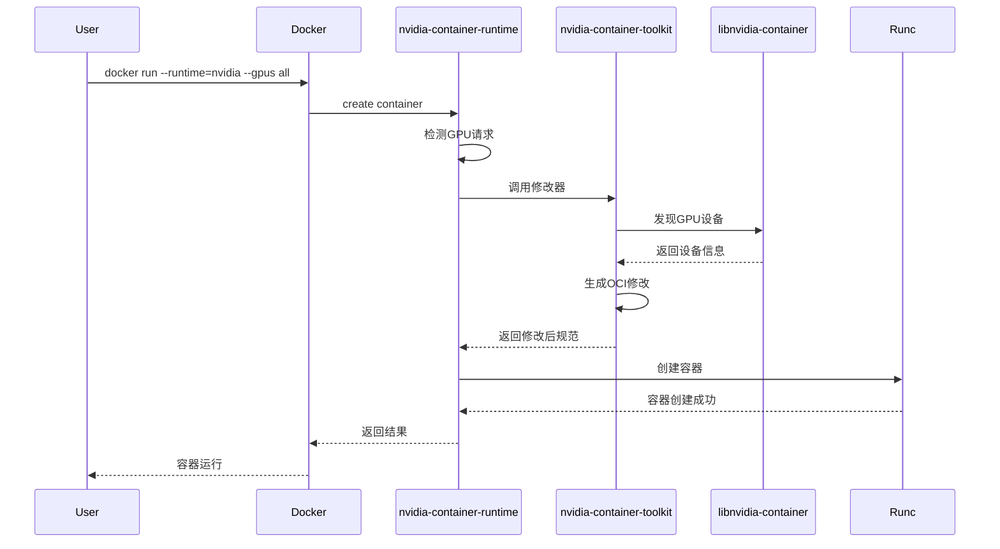

# NVIDIA Container Toolkit 原理分析与代码深度解析

> 代码地址：<https://github.com/NVIDIA/nvidia-container-toolkit>
>
> 官方文档地址：<https://docs.nvidia.com/datacenter/cloud-native/container-toolkit/latest/index.html>
>
> 本文地址：<https://github.com/ForceInjection/AI-fundermentals/blob/main/gpu_manager/Nvidia%20Container%20Toolkit%20%E5%8E%9F%E7%90%86%E5%88%86%E6%9E%90.md>

## 1. 引言与背景

### 1.1 容器化技术与GPU计算的融合

随着人工智能、机器学习和高性能计算的快速发展，`GPU`计算已成为现代计算基础设施的重要组成部分。从深度学习训练到科学计算，从图形渲染到加密货币挖矿，`GPU`的并行计算能力为各种计算密集型任务提供了强大的支持。

然而，传统的容器技术在设计之初并未考虑`GPU`等专用硬件的支持。容器技术的核心理念是通过`Linux`命名空间（`namespaces`）和控制组（`cgroups`）实现进程隔离和资源限制，但这些机制主要针对`CPU`、内存、网络等通用资源，对于`GPU`这类特殊硬件设备的管理存在天然的局限性。

### 1.2 GPU容器化面临的技术挑战

在容器环境中使用`GPU`主要面临以下技术挑战：

#### 1.2.1 设备隔离与访问控制

**挑战描述**：容器需要安全地访问`GPU`设备，同时保持与宿主机和其他容器的隔离性。

**技术难点**：

- **`GPU`设备文件（如`/dev/nvidia0`）的安全挂载**：确保容器只能访问其分配的`GPU`设备，防止恶意容器访问宿主机的`GPU`资源。
- **设备权限的精确控制**：通过`Linux`的权限机制（如`chmod`、`chown`）精确控制对`GPU`设备文件的访问权限。
- **多容器间的`GPU`资源隔离**：通过`cgroups`等机制，确保每个容器只能访问其分配的`GPU`资源，防止资源冲突。

#### 1.2.2 驱动程序依赖

**挑战描述**：`GPU`应用需要特定版本的驱动程序和运行时库，这些组件通常安装在宿主机上。

**技术难点**：

- **驱动程序版本兼容性管理**：确保不同容器运行的应用程序与宿主机上安装的驱动程序版本兼容，避免版本冲突导致的运行时错误。
- **运行时库的动态链接**：容器内的应用程序需要能够动态链接宿主机上的运行时库，确保在容器环境中正常运行。
- **不同`CUDA`版本的共存问题**：在同一个宿主机上安装多个不同版本的`CUDA`驱动程序时，需要解决版本冲突和兼容性问题。

#### 1.2.3 资源管理与调度

**挑战描述**：多个容器之间的`GPU`资源分配和调度需要精确的管理机制。

**技术难点**：

- **`GPU`内存的分配与回收**：每个容器只能访问其分配的`GPU`内存，防止资源冲突。
- **计算资源的公平调度**：确保所有容器都能获得公平的`GPU`资源分配，避免资源浪费。
- **`GPU`利用率的监控与优化**：实时监控`GPU`利用率，动态调整资源分配，提高资源利用率。

#### 1.2.4 兼容性问题

**挑战描述**：不同容器运行时和编排系统对`GPU`支持的差异性。

**技术难点**：

- **`Docker`、`containerd`、`CRI-O`等运行时的适配**：确保`NVIDIA Container Toolkit`能够与不同的容器运行时（如`Docker`、`containerd`、`CRI-O`）无缝集成，提供一致的`GPU`支持。
- **`Kubernetes` 等编排系统的集成**：通过`CDI`（Container Device Interface）规范，实现与不同编排系统（如`Kubernetes`）的深度集成，确保容器能够正确发现和使用`GPU`设备。
- **`OCI`规范的扩展与兼容**：符合`OCI`（`Open Container Initiative`）规范，确保容器镜像的可移植性和兼容性，避免因规范不兼容导致的运行时错误。
- **`CDI`规范的实现**：`NVIDIA Container Toolkit`采用`CDI`规范，与`Kubernetes`等编排系统无缝集成，提供一致的`GPU`支持。
- **`MIG`（Multi-Instance GPU）支持**：`NVIDIA Container Toolkit`支持`MIG`设备，实现多实例`GPU`的容器化部署。

#### 1.2.5 性能开销

**挑战描述**：容器化可能引入的性能损失需要最小化。

**技术难点**：

- **`GPU`设备访问的延迟优化**：通过`PCIe`直接访问`GPU`，减少`CPU`到`GPU`的通信延迟。
- **内存拷贝开销的减少**：利用`GPU`的内存复制引擎，减少数据在`CPU`和`GPU`之间的拷贝开销。
- **系统调用的优化**：通过`NVIDIA Container Toolkit`提供的`OCI`运行时 Shim，减少容器启动时的系统调用次数。

### 1.3 NVIDIA Container Toolkit的诞生

#### 1.3.1 发展历程

`NVIDIA Container Toolkit`的发展经历了多个阶段：

1. **nvidia-docker v1 (2016)**：最初的解决方案，通过包装`Docker`命令实现`GPU`支持
2. **nvidia-docker v2 (2018)**：引入`nvidia-container-runtime`，实现了与`Docker`的深度集成
3. **NVIDIA Container Toolkit (2019-至今)**：统一的工具集，支持多种容器运行时和编排系统

#### 1.3.2 设计理念

`NVIDIA Container Toolkit`采用以下设计理念：

**标准化**：基于`OCI`（Open Container Initiative）规范，确保与各种容器运行时的兼容性。

**模块化**：采用分层架构，各组件职责明确，便于维护和扩展。

**透明性**：对用户和应用程序透明，无需修改现有代码即可在容器中使用`GPU`。

**安全性**：严格的权限控制和设备隔离，确保容器安全。

#### 1.3.3 核心价值

`NVIDIA Container Toolkit`为容器化`GPU`计算提供了以下核心价值：

1. **简化部署**：一键式安装和配置，降低部署复杂度
2. **提高可移植性**：容器镜像可在不同环境间无缝迁移
3. **增强安全性**：细粒度的权限控制和资源隔离
4. **优化性能**：接近原生的`GPU`性能表现
5. **生态兼容**：与主流容器技术栈的深度集成

### 1.4 技术架构预览

`NVIDIA Container Toolkit`采用分层架构设计，从底层到上层包括：

- **硬件抽象层**：`libnvidia-container`提供底层`GPU`设备管理
- **运行时集成层**：`nvidia-container-runtime`实现与`OCI`运行时的集成
- **工具链层**：`nvidia-ctk`等工具提供配置管理和设备发现功能
- **接口标准层**：支持`CDI`等标准化设备接口

这种架构设计确保了系统的可扩展性、可维护性和跨平台兼容性，为容器化`GPU`计算提供了坚实的技术基础。

---

## 2. NVIDIA Container Toolkit架构概览

### 2.1 整体架构设计

NVIDIA Container Toolkit采用分层架构设计，主要包含以下核心组件：

```text
┌─────────────────────────────────────────────────────────────┐
│                    Container Runtime                        │
│                   (Docker/containerd)                      │
├─────────────────────────────────────────────────────────────┤
│                nvidia-container-runtime                    │
│                    (OCI Runtime Shim)                      │
├─────────────────────────────────────────────────────────────┤
│                nvidia-container-toolkit                    │
│                    (Hook & Modifier)                       │
├─────────────────────────────────────────────────────────────┤
│                  libnvidia-container                       │
│                   (Core Library)                           │
├─────────────────────────────────────────────────────────────┤
│                    GPU Hardware                            │
└─────────────────────────────────────────────────────────────┘
```

### 2.2 核心组件功能概述

根据官方文档和代码结构，NVIDIA Container Toolkit包含以下核心组件：

1. **nvidia-container-runtime**：`OCI` 兼容的运行时 `shim`，负责拦截和修改容器创建请求
2. **nvidia-ctk** (v1.4.0+)：NVIDIA Container Toolkit CLI，提供配置管理和CDI规范生成功能
3. **nvidia-cdi-hook**：CDI钩子程序，处理CDI规范的运行时钩子操作
4. **nvidia-container-runtime-hook**：传统运行时钩子，用于Legacy模式的容器修改
5. **nvidia-container-cli**：容器CLI工具，由libnvidia-container提供
6. **libnvidia-container1**：底层 `C` 库，负责 `GPU` 设备的发现和管理

> **组件说明**：
>
> - **nvidia-container-toolkit**：这是整个工具包的名称，而非单独的可执行文件
> - **nvidia-ctk**：实际的命令行工具可执行文件
> - **nvidia-cdi-hook**：专门处理CDI规范的钩子程序
> - **nvidia-container-runtime-hook**：传统的运行时钩子程序
>
> **版本演进**：
>
> - **v1.4.0+**：引入nvidia-ctk命令行工具
> - **v1.8.0+**：增加CDI规范生成功能
> - **v1.11.0+**：添加运行时配置管理功能
> - **v1.13.0+**：完善系统设备节点创建和配置验证功能

### 2.3 包管理与依赖关系

#### 2.3.1 主要软件包

根据代码中的包管理配置，`NVIDIA Container Toolkit`主要包含以下软件包：

- **nvidia-container-toolkit**：主包，包含所有核心功能和可执行文件
- **nvidia-container-toolkit-base**：基础包，包含运行时和CLI工具的最小集合
- **nvidia-container-toolkit-operator-extensions**：操作员扩展包（通常不发布）
- **libnvidia-container-tools**：工具包，包含`nvidia-container-cli`
- **libnvidia-container1**：核心库包，提供底层C库

#### 2.3.2 包依赖关系

```text
├─ nvidia-container-toolkit (version)
│  ├─ libnvidia-container-tools (>= version)
│  └─ nvidia-container-toolkit-base (version)
│     ├─ libnvidia-container-tools (version)
│     └─ libnvidia-container1 (>= version)
└─ libnvidia-container1 (version)
```

**依赖关系说明**：

- **nvidia-container-toolkit**：完整安装包，适用于所有使用场景
- **nvidia-container-toolkit-base**：最小安装包，适用于仅使用CDI的环境
- **libnvidia-container-tools**：提供`nvidia-container-cli`命令行工具
- **libnvidia-container1**：核心库，所有其他组件的基础依赖

#### 2.3.3 废弃包说明

> **重要提示**：以下包已被废弃，功能已合并到`nvidia-container-toolkit`包中：
>
> - **nvidia-docker2**：已废弃，功能合并到主包
> - **nvidia-container-runtime**：作为独立包已废弃，现在是`nvidia-container-toolkit`的一部分
> - **nvidia-container-runtime-hook**：作为独立包已废弃，现在包含在主包中
>
> 这些包可能仍然可用以确保向后兼容性，但建议使用`nvidia-container-toolkit`包。
>
> **注意**：`nvidia-container-runtime`和`nvidia-container-runtime-hook`仍然作为可执行文件存在于`nvidia-container-toolkit`包中。

#### 2.3.4 安装建议

**推荐安装方式**：

```bash
# 完整安装（推荐）
sudo apt-get install nvidia-container-toolkit

# 最小安装（仅CDI场景）
sudo apt-get install nvidia-container-toolkit-base
```

**包选择指南**：

- **完整功能需求**：安装`nvidia-container-toolkit`
- **仅CDI使用**：安装`nvidia-container-toolkit-base`
- **开发调试**：安装`libnvidia-container-tools`
wen d

### 2.4 工作流程概述

当容器运行时创建一个需要GPU访问的容器时，`NVIDIA Container Toolkit`的工作流程如下：

1. **容器运行时调用**：容器引擎（Docker/containerd）调用 `nvidia-container-runtime`
2. **请求拦截与分析**：`nvidia-container-runtime` 检测到容器创建请求，解析GPU需求
3. **设备发现**：通过 `libnvidia-container` 和 NVML 接口发现可用的 `GPU` 设备
4. **资源收集**：收集必要的设备文件、库文件和驱动程序依赖
5. **OCI规范修改**：生成相应的 `OCI` 规范修改，包括设备挂载、环境变量等
6. **运行时传递**：将修改后的规范传递给底层运行时（如 `runc`）

```text
Docker/containerd → nvidia-container-runtime → nvidia-container-toolkit
                                                        ↓
                    runc ← OCI Spec (Modified) ← libnvidia-container
```

> **详细执行流程**：第四章提供了完整的 `docker run --runtime=nvidia --gpus all` 执行示例，包含7个详细步骤的源码分析和组件交互时序图。

---

## 3. 核心组件深度解析

### 3.1 libnvidia-container1：底层设备管理

#### 3.1.1 架构设计与职责

`libnvidia-container1`（库包名）是整个工具链的基础组件，采用C语言实现，提供了`GPU`**设备发现**、**驱动程序管理**和**容器环境配置**的核心功能。该库通过`libnvidia-container-tools`包提供`nvidia-container-cli`命令行工具。

#### 3.1.2 设备发现机制

`libnvidia-container`通过以下方式发现`GPU`设备：

1. **NVML接口调用**：使用 `NVIDIA Management Library` 获取 `GPU` 信息
2. **设备文件扫描**：扫描 `/dev` 目录下的 `GPU` 设备文件
3. **驱动程序检测**：检测已安装的 `NVIDIA` 驱动程序版本

#### 3.1.3 关键数据结构

```c
struct nvc_context {
    struct error err;
    struct nvc_config cfg;
    struct nvc_driver_info drv;
    struct nvc_device_info dev;
};

struct nvc_container {
    char *rootfs;
    char *bins_dir;
    char *libs_dir;
    uid_t uid;
    gid_t gid;
};
```

### 3.2 nvidia-container-runtime：OCI运行时集成

#### 3.2.1 OCI规范兼容性

`nvidia-container-runtime`作为`OCI`兼容的运行时`shim`，实现了完整的`OCI Runtime Specification`。其核心代码结构如下：

```go
// internal/oci/runtime.go
type Runtime interface {
    Exec([]string) error
    String() string
}

type modifyingRuntimeWrapper struct {
    logger   logger.Interface
    runtime  Runtime
    modifier oci.SpecModifier
}
```

#### 3.2.2 运行时修改机制

当检测到容器创建请求时，`nvidia-container-runtime`会执行以下操作：

```go
// internal/oci/runtime_modifier.go
func (r modifyingRuntimeWrapper) Exec(args []string) error {
    if len(args) == 0 {
        return fmt.Errorf("no arguments specified")
    }

    // 检测是否为create命令
    if args[0] == "create" {
        return r.modifyAndExec(args)
    }

    // 其他命令直接传递给底层运行时
    return r.runtime.Exec(args)
}
```

#### 3.2.3 配置管理

`nvidia-container-runtime`通过配置文件`/etc/nvidia-container-runtime/config.toml`进行配置管理：

```go
// internal/config/config.go
type Config struct {
    DisableRequire                 bool   `toml:"disable-require"`
    SwarmResource                  string `toml:"swarm-resource"`
    AcceptEnvvarUnprivileged       bool   `toml:"accept-nvidia-visible-devices-envvar-when-unprivileged"`
    AcceptDeviceListAsVolumeMounts bool   `toml:"accept-nvidia-visible-devices-as-volume-mounts"`
    SupportedDriverCapabilities    string `toml:"supported-driver-capabilities"`

    NVIDIAContainerCLIConfig         ContainerCLIConfig `toml:"nvidia-container-cli"`
    NVIDIACTKConfig                  CTKConfig          `toml:"nvidia-ctk"`
    NVIDIAContainerRuntimeConfig     RuntimeConfig      `toml:"nvidia-container-runtime"`
    NVIDIAContainerRuntimeHookConfig RuntimeHookConfig  `toml:"nvidia-container-runtime-hook"`
}
```

### 3.3 Container Device Interface (CDI) 实现

#### 3.3.1 CDI规范概述

`Container Device Interface` (`CDI`) 是一个标准化的接口规范，用于在容器运行时中管理设备访问。`NVIDIA Container Toolkit`通过 `CDI` 规范提供了标准化的 `GPU` 设备管理。

#### 3.3.2 CDI修改器实现

```go
// internal/modifier/cdi.go
func NewCDIModifier(logger logger.Interface, cfg *config.Config, ociSpec oci.Spec) (oci.SpecModifier, error) {
    devices := getRequestedDevices(ociSpec)
    
    if len(devices) == 0 {
        return modifier.NewNullModifier(), nil
    }

    registry := cdi.GetRegistry(
        cdi.WithSpecDirs(cfg.NVIDIAContainerRuntimeConfig.Modes.CDI.SpecDirs...),
    )

    return cdi.NewModifier(
        cdi.WithLogger(logger),
        cdi.WithRegistry(registry),
        cdi.WithDevices(devices...),
    ), nil
}
```

#### 3.3.3 CDI规范生成

`nvidia-ctk`工具提供了`CDI`规范生成功能：

```go
// cmd/nvidia-ctk/cdi/cdi.go
func (m command) build() *cli.Command {
    return &cli.Command{
        Name:  "cdi",
        Usage: "Provide tools for interacting with Container Device Interface specifications",
        Subcommands: []*cli.Command{
            m.generateCommand(),
            m.listCommand(),
            m.transformCommand(),
        },
    }
}
```

### 3.4 设备发现与编辑器系统

#### 3.4.1 发现器接口设计

`NVIDIA Container Toolkit`采用了灵活的发现器模式，通过统一的接口发现各种类型的资源：

```go
// internal/discover/discover.go
type Discover interface {
    Devices() ([]Device, error)
    Mounts() ([]Mount, error)
    Hooks() ([]Hook, error)
    EnvVars() ([]EnvVar, error)
}
```

#### 3.4.2 复合发现器实现

```go
// internal/discover/list.go
type list []Discover

func Merge(discoverers ...Discover) Discover {
    var l list
    for _, d := range discoverers {
        if d == nil {
            continue
        }
        l = append(l, d)
    }
    return l
}

func (d list) Devices() ([]Device, error) {
    var allDevices []Device
    for i, di := range d {
        devices, err := di.Devices()
        if err != nil {
            return nil, fmt.Errorf("error discovering devices for discoverer %v: %v", i, err)
        }
        allDevices = append(allDevices, devices...)
    }
    return allDevices, nil
}
```

#### 3.4.3 编辑器系统

编辑器系统负责将发现的资源转换为OCI规范修改：

```go
// internal/edits/edits.go
func FromDiscoverer(d discover.Discover) (*cdi.ContainerEdits, error) {
    devices, err := d.Devices()
    if err != nil {
        return nil, fmt.Errorf("failed to discover devices: %v", err)
    }

    envs, err := d.EnvVars()
    if err != nil {
        return nil, fmt.Errorf("failed to discover environment variables: %w", err)
    }

    mounts, err := d.Mounts()
    if err != nil {
        return nil, fmt.Errorf("failed to discover mounts: %v", err)
    }

    hooks, err := d.Hooks()
    if err != nil {
        return nil, fmt.Errorf("failed to discover hooks: %v", err)
    }

    c := NewContainerEdits()
    // 处理各种资源类型...
    return c, nil
}
```

---

## 4. 工作流程详细分析

### 4.1 完整执行流程示例

为了更好地理解`NVIDIA Container Toolkit`的工作原理，我们通过一个完整的`docker run`例子来阐述整个执行过程。

#### 4.1.1 示例命令

```bash
docker run --runtime=nvidia --gpus all -e NVIDIA_VISIBLE_DEVICES=0,1 \
  nvidia/cuda:11.8-runtime-ubuntu20.04 nvidia-smi
```

#### 4.1.2 执行流程详细分析

**步骤1：Docker守护进程接收请求**:

当用户执行上述命令时，`Docker`守护进程首先解析命令参数：

- `--runtime=nvidia`：指定使用`nvidia`容器运行时
- `--gpus all`：请求所有可用`GPU`（`Docker` 19.03+语法）
- `-e NVIDIA_VISIBLE_DEVICES=0,1`：环境变量指定使用`GPU 0`和`1`

**步骤2：调用nvidia-container-runtime**:

`Docker`守护进程调用`nvidia-container-runtime`而不是默认的`runc`：

```go
// cmd/nvidia-container-runtime/main.go
func main() {
    logger := logrus.New()
    
    // 创建运行时包装器
    runtime, err := oci.NewModifyingRuntimeWrapper(
        logger,
        cfg,
        argv,
    )
    if err != nil {
        logger.Errorf("Failed to create runtime wrapper: %v", err)
        os.Exit(1)
    }
    
    // 执行运行时命令
    err = runtime.Exec(argv)
    if err != nil {
        logger.Errorf("Runtime execution failed: %v", err)
        os.Exit(1)
    }
}
```

**步骤3：OCI规范修改**:

`nvidia-container-runtime`检测到这是一个`create`命令，开始修改`OCI`规范：

```go
// internal/oci/runtime_modifier.go
func (r modifyingRuntimeWrapper) modifyAndExec(args []string) error {
    // 解析OCI规范
    spec, err := r.loadSpec(bundlePath)
    if err != nil {
        return fmt.Errorf("failed to load OCI spec: %v", err)
    }
    
    // 应用修改器
    err = r.modifier.Modify(spec)
    if err != nil {
        return fmt.Errorf("failed to modify OCI spec: %v", err)
    }
    
    // 保存修改后的规范
    err = r.saveSpec(bundlePath, spec)
    if err != nil {
        return fmt.Errorf("failed to save modified spec: %v", err)
    }
    
    // 调用底层运行时
    return r.runtime.Exec(args)
}
```

**步骤4：设备发现与资源收集**:

系统通过`libnvidia-container`发现`GPU`设备和相关资源：

```go
// internal/discover/devices.go
func (d *gpuDeviceDiscoverer) Devices() ([]Device, error) {
    // 使用NVML库发现GPU设备
    nvmlLib := nvml.New()
    if ret := nvmlLib.Init(); ret != nvml.SUCCESS {
        return nil, fmt.Errorf("failed to initialize NVML: %v", ret)
    }
    defer nvmlLib.Shutdown()
    
    // 获取GPU数量
    count, ret := nvmlLib.DeviceGetCount()
    if ret != nvml.SUCCESS {
        return nil, fmt.Errorf("failed to get device count: %v", ret)
    }
    
    var devices []Device
    for i := 0; i < count; i++ {
        device, ret := nvmlLib.DeviceGetHandleByIndex(i)
        if ret != nvml.SUCCESS {
            continue
        }
        
        // 创建设备条目
        deviceNode := fmt.Sprintf("/dev/nvidia%d", i)
        devices = append(devices, Device{
            HostPath:      deviceNode,
            ContainerPath: deviceNode,
            Permissions:   "rwm",
        })
    }
    
    return devices, nil
}
```

**步骤5：库文件和依赖发现**:

系统发现并收集必要的库文件：

```go
// internal/discover/libraries.go
func (d *libraryDiscoverer) Mounts() ([]Mount, error) {
    // 发现CUDA运行时库
    libraries := []string{
        "libcuda.so.1",
        "libnvidia-ml.so.1", 
        "libcudart.so.11.0",
        "libcublas.so.11",
        // ... 更多库文件
    }
    
    var mounts []Mount
    for _, lib := range libraries {
        hostPath, err := d.locateLibrary(lib)
        if err != nil {
            continue
        }
        
        mounts = append(mounts, Mount{
            HostPath:      hostPath,
            ContainerPath: hostPath,
            Options:       []string{"ro", "nosuid", "nodev", "bind"},
        })
    }
    
    return mounts, nil
}
```

**步骤6：OCI规范更新**:

收集到的资源被添加到`OCI`规范中：

```json
{
  "ociVersion": "1.0.2",
  "process": {
    "env": [
      "NVIDIA_VISIBLE_DEVICES=0,1",
      "NVIDIA_DRIVER_CAPABILITIES=compute,utility"
    ]
  },
  "linux": {
    "devices": [
      {
        "path": "/dev/nvidia0",
        "type": "c",
        "major": 195,
        "minor": 0,
        "fileMode": 438,
        "uid": 0,
        "gid": 0
      },
      {
        "path": "/dev/nvidia1", 
        "type": "c",
        "major": 195,
        "minor": 1,
        "fileMode": 438,
        "uid": 0,
        "gid": 0
      },
      {
        "path": "/dev/nvidiactl",
        "type": "c", 
        "major": 195,
        "minor": 255,
        "fileMode": 438,
        "uid": 0,
        "gid": 0
      }
    ],
    "mounts": [
      {
        "destination": "/usr/lib/x86_64-linux-gnu/libcuda.so.1",
        "source": "/usr/lib/x86_64-linux-gnu/libcuda.so.1",
        "type": "bind",
        "options": ["ro", "nosuid", "nodev", "bind"]
      }
    ]
  }
}
```

**步骤7：容器创建与启动**:

修改后的OCI规范被传递给底层运行时（`runc`），容器被创建并启动。容器内的`nvidia-smi`命令可以正常访问`GPU`设备。

#### 4.1.3 执行时序图



### 4.2 容器启动流程

#### 4.1.1 环境变量检测

当容器启动时，`nvidia-container-runtime`首先检查环境变量`NVIDIA_VISIBLE_DEVICES`：

```bash
# 指定特定GPU
NVIDIA_VISIBLE_DEVICES=0,1

# 使用所有GPU
NVIDIA_VISIBLE_DEVICES=all

# 禁用GPU
NVIDIA_VISIBLE_DEVICES=void
```

#### 4.1.2 OCI规范修改流程

1. **规范解析**：解析原始`OCI`规范
2. **设备发现**：通过`libnvidia-container`发现可用`GPU`设备
3. **权限检查**：验证容器是否有权限访问指定设备
4. **规范修改**：添加设备挂载、环境变量和钩子
5. **规范验证**：确保修改后的规范符合`OCI标准

#### 4.1.3 设备挂载策略

```bash
# internal/discover/devices.go - 设备文件挂载映射
/dev/nvidia0 -> /dev/nvidia0
/dev/nvidiactl -> /dev/nvidiactl
/dev/nvidia-uvm -> /dev/nvidia-uvm

# internal/discover/libraries.go - 库文件挂载映射
/usr/lib/x86_64-linux-gnu/libcuda.so.1 -> /usr/lib/x86_64-linux-gnu/libcuda.so.1
/usr/lib/x86_64-linux-gnu/libnvidia-ml.so.1 -> /usr/lib/x86_64-linux-gnu/libnvidia-ml.so.1
```

### 4.2 运行时模式深度分析

`NVIDIA Container Toolkit`支持多种运行时模式，每种模式针对不同的使用场景和硬件平台进行了优化。

#### 4.2.1 Legacy模式 (v1.0.0+)

**概述**：`Legacy`模式是传统的`GPU`容器化方式，基于`nvidia-docker v1`的设计理念，通过`nvidia-container-runtime-hook`实现`GPU`资源的注入。

> **版本演进**：
>
> - **v1.0.0+**：引入基础Legacy模式，兼容nvidia-docker v1架构
> - **v1.2.0+**：增强环境变量处理和错误恢复机制
> - **v1.4.0+**：优化Hook执行性能和设备发现逻辑
> - **v1.6.0+**：改进CUDA兼容性处理和库文件管理

**配置方式**：

```toml
[nvidia-container-runtime]
mode = "legacy"

[nvidia-container-runtime.modes.legacy]
cuda-compat-mode = "auto"
```

**工作原理**：

1. **环境变量驱动**：主要依赖`NVIDIA_VISIBLE_DEVICES`等环境变量
2. **运行时钩子**：通过`OCI`运行时钩子在容器启动时注入`GPU`资源
3. **动态发现**：使用`NVML`库动态发现和管理`GPU`设备

**核心实现**：

```go
// Legacy模式的设备发现
func (l *legacyRuntime) discoverDevices() error {
    devices := os.Getenv("NVIDIA_VISIBLE_DEVICES")
    if devices == "" || devices == "void" {
        return nil
    }
    
    // 通过NVML发现GPU设备
    return l.nvmlLib.Init()
}
```

**适用场景**：

- 传统的`Docker`环境
- 需要与`nvidia-docker v1`兼容的场景
- 简单的`GPU`容器化需求

#### 4.2.2 CDI模式 (v1.12.0+)

**概述**：`CDI`（`Container Device Interface`）模式是基于`CNCF`标准的现代化设备管理方式，提供了标准化、可扩展的设备接口。

> **版本要求**：NVIDIA Container Toolkit v1.12.0+ 开始支持CDI规范生成

**容器运行时支持版本**：

*Docker支持情况：*

- **开始支持版本：** Docker 25.0.0
- **默认启用版本：** Docker 28.2.0
- **手动启用配置（25.0.0-28.1.1）：**

  ```json
  {
    "features": {
      "cdi": true
    }
  }
  ```

*containerd支持情况：*

- 通过CRI插件配置支持CDI
- **containerd 1.x配置：**

  ```toml
  version = 2
  [plugins."io.containerd.grpc.v1.cri"]
    enable_cdi = true
    cdi_spec_dirs = ["/etc/cdi", "/var/run/cdi"]
  ```

- **containerd 2.x配置：**

  ```toml
  version = 3
  [plugins.'io.containerd.cri.v1.runtime']
    enable_cdi = true
    cdi_spec_dirs = ["/etc/cdi", "/var/run/cdi"]
  ```

*其他运行时：*

- **CRI-O：** 默认启用CDI支持
- **Podman：** v4.1.0+完整支持，无需特殊配置

**NVIDIA Container Toolkit配置**：

```toml
[nvidia-container-runtime]
mode = "cdi"

[nvidia-container-runtime.modes.cdi]
default-kind = "nvidia.com/gpu"
annotation-prefixes = ["cdi.k8s.io/"]
spec-dirs = ["/etc/cdi", "/var/run/cdi"]
```

**CDI规范生成与配置**：

**1. 生成CDI规范文件**：

```bash
# 基础生成命令
sudo nvidia-ctk cdi generate --output=/etc/cdi/nvidia.yaml

# 指定设备命名策略
sudo nvidia-ctk cdi generate \
  --device-name-strategy=index,uuid \
  --output=/etc/cdi/nvidia.yaml

# 自动检测模式（推荐）
sudo nvidia-ctk cdi generate \
  --mode=auto \
  --output=/etc/cdi/nvidia.yaml

# 指定库搜索路径
sudo nvidia-ctk cdi generate \
  --library-search-paths=/usr/lib/x86_64-linux-gnu \
  --output=/etc/cdi/nvidia.yaml
```

**2. 查看可用CDI设备**：

```bash
# 列出所有CDI设备
nvidia-ctk cdi list

# 输出示例：
# nvidia.com/gpu=0
# nvidia.com/gpu=1
# nvidia.com/gpu=all
```

**3. 配置容器运行时启用CDI**：

```bash
# Docker配置
sudo nvidia-ctk runtime configure --runtime=docker --cdi.enabled

# containerd配置
sudo nvidia-ctk runtime configure --runtime=containerd --cdi.enabled

# 重启服务
sudo systemctl restart docker
sudo systemctl restart containerd
```

**4. 使用CDI运行容器**：

```bash
# Docker (25.0.0+)
docker run --rm --device=nvidia.com/gpu=0 ubuntu nvidia-smi

# Podman
podman run --rm --device=nvidia.com/gpu=0 ubuntu nvidia-smi

# 使用所有GPU
docker run --rm --device=nvidia.com/gpu=all ubuntu nvidia-smi
```

**5. 高级配置选项**：

```bash
# 指定vendor和class
sudo nvidia-ctk cdi generate \
  --vendor=nvidia.com \
  --class=gpu \
  --output=/etc/cdi/nvidia.yaml

# 指定配置搜索路径
sudo nvidia-ctk cdi generate \
  --config-search-path=/etc/nvidia-container-runtime \
  --output=/etc/cdi/nvidia.yaml

# CSV模式下的CDI生成
sudo nvidia-ctk cdi generate \
  --mode=csv \
  --csv.mount-spec-path=/etc/nvidia-container-runtime/host-files-for-container.d \
  --output=/etc/cdi/nvidia.yaml
```

**6. 自动刷新CDI规范**：

```bash
# 启用systemd服务自动刷新
sudo systemctl enable nvidia-cdi-refresh.service
sudo systemctl start nvidia-cdi-refresh.service

# 手动刷新
sudo systemctl restart nvidia-cdi-refresh.service
```

**工作原理**：

1. **规范化接口**：使用标准的`CDI`规范定义设备信息
2. **声明式配置**：通过`YAML/JSON`文件声明设备规范
3. **运行时无关**：与具体的容器运行时解耦

**CDI规范示例**：

```yaml
cdiVersion: "0.5.0"
kind: "nvidia.com/gpu"
devices:
  - name: "0"
    containerEdits:
      deviceNodes:
        - path: "/dev/nvidia0"
          type: "c"
          major: 195
          minor: 0
      mounts:
        - hostPath: "/usr/lib/x86_64-linux-gnu/libcuda.so.1"
          containerPath: "/usr/lib/x86_64-linux-gnu/libcuda.so.1"
      env:
        - "NVIDIA_VISIBLE_DEVICES=0"
```

**核心实现**：

```go
// CDI模式的修改器创建
func NewCDIModifier(logger logger.Interface, cfg *config.Config, ociSpec oci.Spec) (oci.SpecModifier, error) {
    devices := getRequestedDevices(ociSpec)
    
    registry := cdi.GetRegistry(
        cdi.WithSpecDirs(cfg.NVIDIAContainerRuntimeConfig.Modes.CDI.SpecDirs...),
    )

    return cdi.NewModifier(
        cdi.WithLogger(logger),
        cdi.WithRegistry(registry),
        cdi.WithDevices(devices...),
    ), nil
}
```

**适用场景**：

- `Kubernetes`等现代容器编排系统
- 需要标准化设备管理的环境
- 多厂商设备混合部署
- 云原生应用

#### 4.2.3 CSV模式 (v1.0.0+)

**概述**：`CSV`（`Comma-Separated Values`）模式专为`Tegra/Jetson`等嵌入式`GPU`系统设计，通过`CSV`文件静态定义设备挂载规范。

**版本演进：**

- **v1.0.0+**: 引入基础CSV文件解析和挂载功能
- **v1.3.0+**: 增强CSV文件格式支持和错误处理
- **v1.6.0+**: 优化Tegra平台兼容性和性能
- **v1.10.0+**: 支持自定义CSV文件路径和动态加载

**配置方式**：

```toml
[nvidia-container-runtime]
mode = "csv"

[nvidia-container-runtime.modes.csv]
mount-spec-path = "/etc/nvidia-container-runtime/host-files-for-container.d"
```

**工作原理**：

1. **静态配置**：通过`CSV`文件预定义设备和库文件挂载
2. **文件驱动**：解析`CSV`文件生成挂载规范
3. **平台特化**：针对`Tegra`平台的特殊需求优化

**CSV文件格式**：

```csv
# 设备类型, 路径
dev, nvidiactl
dev, nvhost-gpu
dev, nvhost-ctrl
dev, nvmap
dir, /usr/lib/aarch64-linux-gnu/tegra-egl
dir, /usr/local/cuda
lib, /usr/lib/aarch64-linux-gnu/tegra/libnvidia-eglcore.so.32.1.0
lib, /usr/lib/aarch64-linux-gnu/tegra/libnvrm.so
sym, /usr/lib/aarch64-linux-gnu/libcuda.so
```

**支持的挂载类型**：

- **`dev`**: 字符设备文件（如`/dev/nvidia0`）
- **`lib`**: 库文件或常规文件
- **`dir`**: 目录挂载
- **`sym`**: 符号链接

**核心实现**：

```go
// CSV模式的挂载规范解析
func NewMountSpecFromLine(line string) (*MountSpec, error) {
    parts := strings.SplitN(strings.TrimSpace(line), ",", 2)
    if len(parts) < 2 {
        return nil, fmt.Errorf("failed to parse line: %v", line)
    }
    
    mountType := strings.TrimSpace(parts[0])
    path := strings.TrimSpace(parts[1])
    
    return NewMountSpec(mountType, path)
}
```

**默认CSV文件**：

- **`devices.csv`**: 包含`GPU`设备节点定义
- **`drivers.csv`**: 驱动程序相关文件
- **`l4t.csv`**: `Linux for Tegra`组件

**环境变量控制**：

```bash
# 加载所有CSV文件
NVIDIA_REQUIRE_JETPACK=csv-mounts=all

# 默认只加载基础文件
# devices.csv, drivers.csv, l4t.csv
```

**适用场景**：

- `Tegra/Jetson`嵌入式设备
- 无`NVML`支持的`ARM`平台
- 边缘计算和`IoT`应用
- 资源受限的嵌入式环境

### 4.3 运行时模式对比分析

#### 4.3.1 功能特性对比

| 特性 | Legacy模式 | CDI模式 | CSV模式 |
|------|------------|---------|---------|
| **设备发现方式** | 动态`NVML`查询 | 动态`CDI`规范 | 静态`CSV`文件 |
| **配置方式** | 环境变量 | `CDI`规范文件 | `CSV`文件 |
| **平台支持** | `x86_64` `GPU` | 通用平台 | `Tegra/ARM` |
| **标准化程度** | 低（`NVIDIA`专有） | 高（`CNCF`标准） | 中等（文件格式标准） |
| **运行时依赖** | `NVML`库 | `CDI`运行时 | 文件系统 |
| **动态性** | 高 | 高 | 低（静态配置） |
| **复杂度** | 中等 | 高 | 低 |
| **性能开销** | 中等 | 低 | 最低 |

#### 4.3.2 适用场景分析

**Legacy模式适用场景**：

- **传统Docker环境**：已有的`nvidia-docker`部署
- **简单GPU应用**：单机`GPU`容器化需求
- **快速迁移**：从`nvidia-docker` v1升级
- **开发测试**：本地开发环境

**CDI模式适用场景**：

- **Kubernetes集群**：云原生`GPU`工作负载
- **多厂商环境**：混合`GPU/加速器`部署
- **标准化需求**：需要符合`CNCF`标准
- **大规模部署**：企业级容器平台
- **设备管理复杂**：需要精细的设备控制

**CSV模式适用场景**：

- **嵌入式系统**：`Tegra/Jetson`等`ARM`设备
- **边缘计算**：资源受限环境
- **离线部署**：无网络连接的环境
- **静态配置**：设备配置固定的场景
- **IoT应用**：物联网`GPU`应用

#### 4.3.3 性能与资源消耗对比

```text
资源消耗（从低到高）：
CSV模式 < CDI模式 < Legacy模式

启动速度（从快到慢）：
CSV模式 > CDI模式 > Legacy模式

灵活性（从低到高）：
CSV模式 < Legacy模式 < CDI模式

标准化程度（从低到高）：
Legacy模式 < CSV模式 < CDI模式
```

#### 4.3.4 模式选择建议

**选择Legacy模式的情况**：

- 现有`nvidia-docker`部署需要平滑升级
- 简单的单机`GPU`容器化需求
- 对标准化要求不高的场景

**选择CDI模式的情况**：

- 新建的`Kubernetes GPU`集群
- 需要与其他厂商设备集成
- 要求符合`CNCF`标准
- 大规模生产环境部署

**选择CSV模式的情况**：

- `Tegra/Jetson`等`ARM`嵌入式设备
- 边缘计算和`IoT`应用
- 资源受限的环境
- 静态设备配置场景

**Auto模式（自动选择）(v1.8.0+)**：

```toml
[nvidia-container-runtime]
mode = "auto"
```

> **版本演进**：
>
> - **v1.8.0+**：引入Auto模式自动选择机制
> - **v1.10.0+**：增强平台检测和模式选择逻辑
> - **v1.12.0+**：优化CDI规范文件检测和验证
> - **v1.15.0+**：改进Tegra平台识别和兼容性处理

`Auto`模式会根据系统环境自动选择最适合的模式：

- 检测到`Tegra`系统且无`NVML` → `CSV`模式
- 检测到`CDI`规范文件 → `CDI`模式  
- 其他情况 → `Legacy`模式

### 4.4 错误处理与日志记录

#### 4.4.1 错误处理机制

```go
// internal/oci/runtime_modifier.go
type RuntimeError struct {
    Code    int
    Message string
    Cause   error
}

func (e *RuntimeError) Error() string {
    if e.Cause != nil {
        return fmt.Sprintf("%s: %v", e.Message, e.Cause)
    }
    return e.Message
}
```

#### 4.4.2 日志记录策略

```go
// internal/logger/logger.go
type Interface interface {
    Debugf(string, ...interface{})
    Infof(string, ...interface{})
    Warnf(string, ...interface{})
    Errorf(string, ...interface{})
}
```

---

## 5. OCI Hooks 机制与生命周期管理

### 5.1 OCI Hooks 概述

`OCI`（`Open Container Initiative`）`Hooks` 是容器运行时规范中定义的扩展机制，允许在容器生命周期的特定阶段执行自定义操作。`NVIDIA Container Toolkit` 广泛使用 `Hooks` 机制来实现 `GPU` 设备的动态注入和配置。

> **版本演进**：
>
> - **v1.0.0+**：引入基础Hook机制支持
> - **v1.4.0+**：增强Hook错误处理和日志记录
> - **v1.13.0+**：引入`nvidia-cdi-hook`独立程序
> - **v1.14.0+**：优化Hook执行性能和稳定性

#### 5.1.1 Hook 类型与执行时机

根据 `OCI` 规范，`Hooks` 分为以下几种类型：

1. **prestart**：在容器进程启动前执行，但在用户指定的进程启动后
2. **createRuntime**：在容器运行时创建后立即执行
3. **createContainer**：在容器创建后但在用户进程启动前执行
4. **startContainer**：在用户进程启动后执行
5. **poststart**：在容器启动后执行
6. **poststop**：在容器停止后执行

```go
// pkg/config/ocihook/hooks.go
type specHook struct {
    Path    string   `json:"path"`
    Args    []string `json:"args,omitempty"`
    Env     []string `json:"env,omitempty"`
    Timeout *int     `json:"timeout,omitempty"`
}
```

#### 5.1.2 NVIDIA Container Toolkit 中的 Hook 使用

`NVIDIA Container Toolkit` 主要使用以下 `Hooks`：

- **prestart hook**：用于 `Legacy` 模式下的设备注入
- **createContainer hook**：用于 `CDI` 模式下的设备配置
- **createRuntime hook**：用于 `Legacy` 模式下的运行时环境准备

### 5.2 Hook 实现机制

#### 5.2.1 Hook 创建与注册

```go
// internal/discover/hooks.go
type cdiHookCreator struct {
    logger              logger.Interface
    nvidiaCDIHookPath   string
    requiredArgs        []string
    debugLogging        bool
    disabledHooks       map[HookName]bool
}

// Create creates a new hook with the given name and arguments.
func (c cdiHookCreator) Create(name HookName, args ...string) *Hook {
    if c.isDisabled(name, args...) {
        return nil
    }

    return &Hook{
        Lifecycle: cdi.CreateContainerHook,
        Path:      c.nvidiaCDIHookPath,
        Args:      append(c.requiredArgs(name), c.transformArgs(name, args...)...),
        Env:       []string{fmt.Sprintf("NVIDIA_CTK_DEBUG=%v", c.debugLogging)},
    }
}
```

#### 5.2.2 Hook 执行流程

```go
// internal/modifier/stable.go
type stableRuntimeModifier struct {
    logger                         logger.Interface
    nvidiaContainerRuntimeHookPath string
}

func (m stableRuntimeModifier) Modify(spec *specs.Spec) error {
    // 检查是否已存在 NVIDIA hook
    for _, hook := range spec.Hooks.Prestart {
        if isNVIDIAContainerRuntimeHook(&hook) {
            m.logger.Info("Existing nvidia-container-runtime hook found in OCI spec")
            return nil
        }
    }

    // 添加 prestart hook
    spec.Hooks.Prestart = append(spec.Hooks.Prestart, specs.Hook{
        Path: m.nvidiaContainerRuntimeHookPath,
        Args: []string{m.nvidiaContainerRuntimeHookPath, "prestart"},
        Env:  os.Environ(),
    })

    return nil
}
```

### 5.3 nvidia-cdi-hook 实现

#### 5.3.1 CDI Hook 架构

`nvidia-cdi-hook` 是专门为 `CDI` 模式设计的 `Hook` 程序，负责在容器创建阶段执行设备相关的配置操作。

```go
// cmd/nvidia-cdi-hook/main.go
func main() {
    logger := logrus.New()
    
    // 解析命令行参数
    var hookName string
    var containerID string
    var bundlePath string
    
    // 根据 hook 类型执行相应操作
    switch hookName {
    case "createContainer":
        err = handleCreateContainer(logger, containerID, bundlePath)
    case "startContainer":
        err = handleStartContainer(logger, containerID, bundlePath)
    default:
        err = fmt.Errorf("unsupported hook: %s", hookName)
    }
    
    if err != nil {
        logger.Fatalf("Hook execution failed: %v", err)
    }
}
```

#### 5.3.2 符号链接创建

`nvidia-cdi-hook` 的一个重要功能是创建必要的符号链接，确保容器内的应用程序能够正确访问 `GPU` 设备和库文件。

```go
// internal/discover/symlinks.go
type symlinkHook struct {
    logger      logger.Interface
    targets     []string
    links       []string
}

func (h symlinkHook) createSymlinks() error {
    for i, target := range h.targets {
        link := h.links[i]
        
        // 检查目标文件是否存在
        if _, err := os.Stat(target); os.IsNotExist(err) {
            h.logger.Warnf("Target file %s does not exist, skipping symlink creation", target)
            continue
        }
        
        // 创建符号链接
        if err := os.Symlink(target, link); err != nil {
            if !os.IsExist(err) {
                return fmt.Errorf("failed to create symlink %s -> %s: %v", link, target, err)
            }
        }
        
        h.logger.Debugf("Created symlink: %s -> %s", link, target)
    }
    
    return nil
}
```

### 5.4 设备发现与管理机制

#### 5.4.1 NVML集成与GPU设备发现

`NVIDIA Container Toolkit`通过`NVIDIA Management Library (NVML)`实现`GPU`设备的发现和管理：

```go
// pkg/nvcdi/lib-nvml.go
func (l *nvmllib) GetAllDeviceSpecs() ([]specs.Device, error) {
    nvmlLib := l.nvmllib
    if ret := nvmlLib.Init(); ret != nvml.SUCCESS {
        return nil, fmt.Errorf("failed to initialize NVML: %v", ret)
    }
    defer nvmlLib.Shutdown()

    // 获取GPU设备数量
    count, ret := nvmlLib.DeviceGetCount()
    if ret != nvml.SUCCESS {
        return nil, fmt.Errorf("failed to get device count: %v", ret)
    }

    var deviceSpecs []specs.Device
    for i := 0; i < count; i++ {
        device, ret := nvmlLib.DeviceGetHandleByIndex(i)
        if ret != nvml.SUCCESS {
            l.logger.Warnf("Failed to get device handle for index %d: %v", i, ret)
            continue
        }

        // 获取设备UUID
        uuid, ret := device.GetUUID()
        if ret != nvml.SUCCESS {
            l.logger.Warnf("Failed to get UUID for device %d: %v", i, ret)
            continue
        }

        // 获取设备名称
        name, ret := device.GetName()
        if ret != nvml.SUCCESS {
            l.logger.Warnf("Failed to get name for device %d: %v", i, ret)
            continue
        }

        deviceSpecs = append(deviceSpecs, specs.Device{
            Name:           fmt.Sprintf("gpu%d", i),
            ContainerEdits: l.getContainerEditsForDevice(device, i),
        })
    }

    return deviceSpecs, nil
}
```

#### 5.4.2 MIG (Multi-Instance GPU) 支持 (v1.5.0+)

`MIG`技术允许将单个GPU分割为多个独立的GPU实例，`NVIDIA Container Toolkit`自v1.5.0版本开始提供完整的MIG支持：

**版本演进：**

- **v1.5.0+**: 引入基础MIG设备发现和CDI规范生成
- **v1.8.0+**: 增强MIG设备命名策略和UUID支持
- **v1.12.0+**: 完善MIG设备的CDI集成和自动发现
- **v1.15.0+**: 优化MIG设备性能和资源管理

```go
// pkg/nvcdi/lib-nvml.go
func (l *nvmllib) getMIGDeviceSpecs() ([]specs.Device, error) {
    var migDevices []specs.Device
    
    // 遍历所有GPU设备
    for i := 0; i < l.deviceCount; i++ {
        device, ret := l.nvmllib.DeviceGetHandleByIndex(i)
        if ret != nvml.SUCCESS {
            continue
        }

        // 检查是否启用了MIG模式
        migMode, _, ret := device.GetMigMode()
        if ret != nvml.SUCCESS || migMode != nvml.DEVICE_MIG_ENABLE {
            continue
        }

        // 获取MIG设备实例
        migDeviceCount, ret := device.GetMaxMigDeviceCount()
        if ret != nvml.SUCCESS {
            continue
        }

        for j := 0; j < migDeviceCount; j++ {
            migDevice, ret := device.GetMigDeviceHandleByIndex(j)
            if ret != nvml.SUCCESS {
                continue
            }

            // 获取MIG设备UUID
            migUUID, ret := migDevice.GetUUID()
            if ret != nvml.SUCCESS {
                continue
            }

            // 创建MIG设备规范
            migDevices = append(migDevices, specs.Device{
                Name: fmt.Sprintf("mig%d-%d", i, j),
                ContainerEdits: l.getContainerEditsForMIGDevice(migDevice, i, j),
            })
        }
    }

    return migDevices, nil
}
```

#### 5.4.3 设备命名策略与标识

`NVIDIA Container Toolkit`采用统一的设备命名策略：

```go
// pkg/nvcdi/namer.go
type DeviceNamer interface {
    GetDeviceName(index int, uuid string) (string, error)
    GetMIGDeviceName(parentIndex int, migIndex int, migUUID string) (string, error)
}

type deviceNamer struct {
    strategy string
}

func (d *deviceNamer) GetDeviceName(index int, uuid string) (string, error) {
    switch d.strategy {
    case "index":
        return fmt.Sprintf("gpu%d", index), nil
    case "uuid":
        return uuid, nil
    case "type-index":
        return fmt.Sprintf("nvidia.com/gpu=%d", index), nil
    default:
        return fmt.Sprintf("gpu%d", index), nil
    }
}

func (d *deviceNamer) GetMIGDeviceName(parentIndex int, migIndex int, migUUID string) (string, error) {
    switch d.strategy {
    case "index":
        return fmt.Sprintf("mig%d-%d", parentIndex, migIndex), nil
    case "uuid":
        return migUUID, nil
    case "type-index":
        return fmt.Sprintf("nvidia.com/mig=%d-%d", parentIndex, migIndex), nil
    default:
        return fmt.Sprintf("mig%d-%d", parentIndex, migIndex), nil
    }
}
```

### 5.5 Hook 错误处理与恢复

#### 5.5.1 Hook 执行失败处理

```go
// internal/modifier/hook_remover.go
type nvidiaContainerRuntimeHookRemover struct {
    logger logger.Interface
}

// isNVIDIAContainerRuntimeHook checks if the provided hook is an nvidia-container-runtime-hook
func isNVIDIAContainerRuntimeHook(hook *specs.Hook) bool {
    bins := map[string]struct{}{
        config.NVIDIAContainerRuntimeHookExecutable: {},
        config.NVIDIAContainerToolkitExecutable:    {},
    }
    
    return bins[filepath.Base(hook.Path)] != nil
}

// Modify removes any existing NVIDIA Container Runtime hooks from the spec
func (m nvidiaContainerRuntimeHookRemover) Modify(spec *specs.Spec) error {
    if spec.Hooks == nil {
        return nil
    }
    
    // 移除失效的 NVIDIA hooks
    spec.Hooks.Prestart = removeNVIDIAHooks(m.logger, spec.Hooks.Prestart)
    spec.Hooks.CreateRuntime = removeNVIDIAHooks(m.logger, spec.Hooks.CreateRuntime)
    spec.Hooks.CreateContainer = removeNVIDIAHooks(m.logger, spec.Hooks.CreateContainer)
    
    return nil
}
```

#### 5.5.2 Hook 超时处理

```go
// pkg/config/ocihook/oci-hook.go
func CreateHook(hookFilePath string, nvidiaContainerRuntimeHookExecutablePath string) error {
    hook := specHook{
        Path: nvidiaContainerRuntimeHookExecutablePath,
        Args: []string{nvidiaContainerRuntimeHookExecutablePath, "prestart"},
        Env:  []string{"PATH=/usr/local/sbin:/usr/local/bin:/usr/sbin:/usr/bin:/sbin:/bin"},
        Timeout: &[]int{30}[0], // 30秒超时
    }
    
    // 序列化并写入文件
    hookJSON, err := json.MarshalIndent(hook, "", "  ")
    if err != nil {
        return fmt.Errorf("error marshaling hook to JSON: %v", err)
    }
    
    return writeHookFile(hookFilePath, hookJSON)
}
```

### 5.5 Hook 性能优化

#### 5.5.1 Hook 执行优化

为了减少 `nvidia-cdi-hook` 执行对容器启动时间的影响，`NVIDIA Container Toolkit` 采用了以下优化策略：

1. **并行执行**：在安全的情况下并行执行多个 `Hook` 操作
2. **缓存机制**：缓存设备发现和配置结果
3. **延迟初始化**：只在必要时才执行耗时操作

```go
// internal/discover/cache.go
type deviceCache struct {
    mu      sync.RWMutex
    devices map[string][]device.Device
    ttl     time.Duration
    lastUpdate time.Time
}

func (c *deviceCache) getDevices(key string) ([]device.Device, bool) {
    c.mu.RLock()
    defer c.mu.RUnlock()
    
    if time.Since(c.lastUpdate) > c.ttl {
        return nil, false
    }
    
    devices, exists := c.devices[key]
    return devices, exists
}
```

#### 5.5.2 Hook 资源管理

```go
// internal/runtime/runtime_factory.go
func newNVIDIAContainerRuntime(logger logger.Interface, cfg *config.Config, argv []string, driver *root.Driver) (oci.Runtime, error) {
    lowLevelRuntime, err := oci.NewLowLevelRuntime(logger, cfg.NVIDIAContainerRuntimeConfig.Runtimes)
    if err != nil {
        return nil, fmt.Errorf("error constructing low-level runtime: %v", err)
    }

    // 检查是否为 create 子命令，避免不必要的 Hook 执行
    if !oci.HasCreateSubcommand(argv) {
        logger.Tracef("Skipping modifier for non-create subcommand")
        return lowLevelRuntime, nil
    }

    // 创建运行时修改器
    modifier, err := newSpecModifier(logger, cfg, driver)
    if err != nil {
        return nil, fmt.Errorf("error constructing OCI spec modifier: %v", err)
    }

    return oci.NewModifyingRuntimeWrapper(logger, lowLevelRuntime, modifier)
}
```

### 5.6 Hook 调试与监控

#### 5.6.1 Hook 执行日志

```go
// cmd/nvidia-ctk/hook/hook.go
type hookCommand struct {
    logger logger.Interface
}

func (m hookCommand) run(c *cli.Context) error {
    m.logger.Infof("Starting hook execution: %s", c.Args().First())
    
    defer func() {
        if r := recover(); r != nil {
            m.logger.Errorf("Hook execution panicked: %v", r)
        }
    }()
    
    // 记录执行时间
    start := time.Now()
    defer func() {
        m.logger.Infof("Hook execution completed in %v", time.Since(start))
    }()
    
    return m.executeHook(c)
}
```

#### 5.6.2 Hook 状态监控

```go
// internal/config/hook.go
type HookConfig struct {
    Path            string        `toml:"path"`
    Args            []string      `toml:"args"`
    Env             []string      `toml:"env"`
    Timeout         time.Duration `toml:"timeout"`
    SkipModeDetection bool        `toml:"skip-mode-detection"`
}

func (h *HookConfig) validate() error {
    if h.Path == "" {
        return fmt.Errorf("hook path cannot be empty")
    }
    
    if h.Timeout <= 0 {
        h.Timeout = 30 * time.Second // 默认超时时间
    }
    
    return nil
}
```

---

## 6. 配置管理与自定义

### 6.1 配置文件结构

#### 6.1.1 主配置文件

`NVIDIA Container Toolkit`的主配置文件位于`/etc/nvidia-container-runtime/config.toml`：

```toml
# 全局配置
disable-require = false
swarm-resource = "DOCKER_RESOURCE_GPU"
accept-nvidia-visible-devices-envvar-when-unprivileged = true
accept-nvidia-visible-devices-as-volume-mounts = false
supported-driver-capabilities = "compat32,compute,display,graphics,utility,video"

# nvidia-container-cli配置
[nvidia-container-cli]
root = "/run/nvidia/driver"
path = "/usr/bin/nvidia-container-cli"
environment = []
debug = "/var/log/nvidia-container-toolkit.log"
ldcache = "/sbin/ldconfig"
load-kmods = true
no-cgroups = false
user = "root:video"

# nvidia-ctk配置
[nvidia-ctk]
path = "/usr/bin/nvidia-ctk"

# nvidia-container-runtime配置
[nvidia-container-runtime]
debug = "/var/log/nvidia-container-runtime.log"
log-level = "info"
runtimes = ["runc", "crun"]
mode = "auto"
```

#### 6.1.2 运行时模式配置

```toml
[nvidia-container-runtime.modes]

[nvidia-container-runtime.modes.csv]
mount-spec-path = "/etc/nvidia-container-runtime/host-files-for-container.d"

[nvidia-container-runtime.modes.cdi]
default-kind = "nvidia.com/gpu"
annotation-prefixes = ["cdi.k8s.io/"]
spec-dirs = ["/etc/cdi", "/var/run/cdi"]

[nvidia-container-runtime.modes.legacy]
cuda-compat-mode = "auto"
```

### 6.2 配置加载机制

#### 6.2.1 配置文件查找

```go
// internal/config/config.go
func GetConfigFilePath() string {
    if configFilePathOverride := os.Getenv(FilePathOverrideEnvVar); configFilePathOverride != "" {
        return configFilePathOverride
    }
    configRoot := "/etc"
    if XDGConfigDir := os.Getenv(configRootOverride); len(XDGConfigDir) != 0 {
        configRoot = XDGConfigDir
    }
    return filepath.Join(configRoot, RelativeFilePath)
}
```

#### 6.2.2 配置验证

```go
// pkg/config/config.go
func (c *Config) assertValid() error {
    err := c.NVIDIAContainerCLIConfig.Ldconfig.assertValid(c.Features.AllowLDConfigFromContainer.IsEnabled())
    if err != nil {
        return errors.Join(err, errInvalidConfig)
    }
    return nil
}
```

### 6.3 环境变量配置

#### 6.3.1 核心环境变量

```bash
# 指定可见的GPU设备
NVIDIA_VISIBLE_DEVICES=0,1,GPU-uuid

# 指定驱动程序能力
NVIDIA_DRIVER_CAPABILITIES=compute,utility

# 禁用特定功能
NVIDIA_DISABLE_REQUIRE=true

# 指定CUDA版本要求
NVIDIA_REQUIRE_CUDA="cuda>=11.0"
```

#### 6.3.2 环境变量处理

```go
// internal/config/image/capabilities.go
func (c Capabilities) String() string {
    var capabilities []string
    for capability := range c {
        capabilities = append(capabilities, string(capability))
    }
    sort.Strings(capabilities)
    return strings.Join(capabilities, ",")
}
```

---

## 7. 性能优化与最佳实践

### 7.1 性能优化策略

#### 7.1.1 设备发现优化

为了提高设备发现的性能，`NVIDIA Container Toolkit`采用了以下优化策略：

1. **缓存机制**：缓存设备发现结果，避免重复扫描
2. **延迟加载**：只在需要时才进行设备发现
3. **并行处理**：并行处理多个`GPU`设备的发现

```go
// pkg/nvcdi/lib.go
type nvcdilib struct {
    logger             logger.Interface
    nvmllib            nvml.Interface
    nvsandboxutilslib  nvsandboxutils.Interface
    mode               Mode
    devicelib          device.Interface
    deviceNamers       DeviceNamers
    driverRoot         string
    devRoot            string
    // 缓存相关字段
    cachedDevices      []device.Device
    cacheValid         bool
}
```

#### 7.1.2 内存使用优化

```go
// internal/oci/spec_modifier.go
// 使用对象池减少内存分配
var specPool = sync.Pool{
    New: func() interface{} {
        return &specs.Spec{}
    },
}

func getSpec() *specs.Spec {
    return specPool.Get().(*specs.Spec)
}

func putSpec(spec *specs.Spec) {
    // 重置spec状态
    *spec = specs.Spec{}
    specPool.Put(spec)
}
```

### 7.2 最佳实践指南

#### 7.2.1 容器镜像优化

1. **多阶段构建**：使用多阶段构建减少镜像大小
2. **基础镜像选择**：选择合适的`CUDA`基础镜像
3. **层缓存优化**：合理安排`Dockerfile`指令顺序

```dockerfile
# 多阶段构建示例
FROM nvidia/cuda:11.8-devel-ubuntu20.04 AS builder
WORKDIR /app
COPY requirements.txt .
RUN pip install --no-cache-dir -r requirements.txt

FROM nvidia/cuda:11.8-runtime-ubuntu20.04
WORKDIR /app
COPY --from=builder /usr/local/lib/python3.8/site-packages /usr/local/lib/python3.8/site-packages
COPY . .
CMD ["python", "app.py"]
```

#### 7.2.2 资源管理最佳实践

```yaml
# Kubernetes资源限制示例
apiVersion: v1
kind: Pod
spec:
  containers:
  - name: gpu-container
    image: nvidia/cuda:11.8-runtime-ubuntu20.04
    resources:
      limits:
        nvidia.com/gpu: 1
      requests:
        nvidia.com/gpu: 1
    env:
    - name: NVIDIA_VISIBLE_DEVICES
      value: "0"
    - name: NVIDIA_DRIVER_CAPABILITIES
      value: "compute,utility"
```

#### 7.2.3 监控和调试

```bash
# 检查GPU状态
nvidia-smi

# 查看容器GPU使用情况
docker exec <container_id> nvidia-smi

# 检查CDI规范
nvidia-ctk cdi list

# 生成CDI规范
nvidia-ctk cdi generate --output=/etc/cdi/nvidia.yaml
```

### 7.3 故障排除指南

#### 7.3.1 常见问题诊断

1. **设备不可见**：检查`NVIDIA_VISIBLE_DEVICES`环境变量
2. **驱动程序不匹配**：验证主机和容器的驱动程序版本
3. **权限问题**：检查容器的设备访问权限

#### 7.3.2 日志分析

```bash
# 查看nvidia-container-runtime日志
journalctl -u nvidia-container-runtime

# 查看详细调试信息
export NVIDIA_CONTAINER_RUNTIME_DEBUG=/tmp/nvidia-debug.log
docker run --runtime=nvidia nvidia/cuda:11.8-runtime-ubuntu20.04 nvidia-smi
```

---

## 8. 容器编排系统集成要点

### 8.1 运行时集成机制

#### 8.1.1 Docker 运行时集成

**基础配置**：

```json
// /etc/docker/daemon.json
{
  "default-runtime": "nvidia",
  "runtimes": {
    "nvidia": {
      "path": "nvidia-container-runtime",
      "runtimeArgs": []
    },
    "nvidia-cdi": {
      "path": "nvidia-container-runtime.cdi",
      "runtimeArgs": []
    },
    "nvidia-legacy": {
      "path": "nvidia-container-runtime.legacy",
      "runtimeArgs": []
    }
  },
  "features": {
    "cdi": true
  }
}
```

**Docker 配置要点**：

- **运行时注册**：将 nvidia-container-runtime 注册为可用运行时
- **CDI 支持**：启用 Container Device Interface 功能
- **默认运行时**：可选择设置为默认 GPU 运行时

#### 8.1.2 containerd 运行时集成

**配置版本支持**：

- **v2 配置**：推荐的现代配置格式，支持完整的 CRI 功能
- **v1 配置**：Legacy 兼容模式，用于旧版本 containerd

**containerd v2 配置**：

```toml
# /etc/containerd/config.toml
version = 2

[plugins."io.containerd.grpc.v1.cri"]
  [plugins."io.containerd.grpc.v1.cri".containerd]
    [plugins."io.containerd.grpc.v1.cri".containerd.runtimes]
      [plugins."io.containerd.grpc.v1.cri".containerd.runtimes.nvidia]
        runtime_type = "io.containerd.runc.v2"
        [plugins."io.containerd.grpc.v1.cri".containerd.runtimes.nvidia.options]
          BinaryName = "nvidia-container-runtime"
          SystemdCgroup = true
      
      [plugins."io.containerd.grpc.v1.cri".containerd.runtimes.nvidia-cdi]
        runtime_type = "io.containerd.runc.v2"
        [plugins."io.containerd.grpc.v1.cri".containerd.runtimes.nvidia-cdi.options]
          BinaryName = "nvidia-container-runtime.cdi"
          SystemdCgroup = true
```

**containerd v1 配置（Legacy）**：

```toml
# containerd v1.x 配置
version = 1

[plugins.cri]
  [plugins.cri.containerd]
    [plugins.cri.containerd.runtimes]
      [plugins.cri.containerd.runtimes.nvidia]
        runtime_type = "io.containerd.runtime.v1.linux"
        runtime_engine = "/usr/bin/nvidia-container-runtime"
        runtime_root = ""
```

**配置版本检测与适配**：

NVIDIA Container Toolkit 自动检测 containerd 配置版本并适配相应的配置格式，确保与不同版本的 containerd 兼容。

#### 8.1.3 CRI-O 运行时集成

**CRI-O 配置**：

```toml
# /etc/crio/crio.conf
[crio.runtime]
default_runtime = "nvidia"

[crio.runtime.runtimes.nvidia]
runtime_path = "/usr/bin/nvidia-container-runtime"
runtime_type = "oci"
runtime_root = "/run/nvidia"
allowed_annotations = [
    "io.kubernetes.cri-o.Devices",
    "io.kubernetes.cri-o.ShmSize",
    "io.kubernetes.cri-o.UsernsModeHost",
]
```

### 8.2 Kubernetes 集成架构

#### 8.2.1 与 Device Plugin 的协作

NVIDIA Container Toolkit 与 Kubernetes 的集成主要通过以下方式实现：

1. **Device Plugin 负责资源管理**：NVIDIA Device Plugin 负责向 Kubernetes 报告 GPU 资源并处理资源分配
2. **Container Toolkit 负责运行时配置**：当 Pod 被调度到节点后，Container Toolkit 负责配置容器运行时以访问 GPU 设备
3. **协作流程**：Device Plugin 设置环境变量（如 `NVIDIA_VISIBLE_DEVICES`），Container Toolkit 根据这些环境变量配置容器的 GPU 访问权限

#### 8.2.2 RuntimeClass 配置

**RuntimeClass 资源定义**：

```yaml
# nvidia-runtimeclass.yaml
apiVersion: node.k8s.io/v1
kind: RuntimeClass
metadata:
  name: nvidia
handler: nvidia
overhead:
  podFixed:
    memory: "12Mi"
    cpu: "100m"
scheduling:
  nodeClassification:
    tolerations:
    - effect: NoSchedule
      key: nvidia.com/gpu
      operator: Exists
  runtimeHandler: nvidia
```

**Pod 中使用 RuntimeClass**：

```yaml
# gpu-pod-with-runtimeclass.yaml
apiVersion: v1
kind: Pod
metadata:
  name: gpu-pod
spec:
  runtimeClassName: nvidia
  containers:
  - name: gpu-container
    image: nvidia/cuda:11.8-runtime-ubuntu20.04
    resources:
      limits:
        nvidia.com/gpu: 1
    command: ["nvidia-smi"]
```

#### 8.2.3 CDI 集成模式

**CDI 规范生成**：

```bash
# 生成 CDI 规范
nvidia-ctk cdi generate \
    --output=/etc/cdi/nvidia.yaml \
    --format=yaml \
    --device-name-strategy=uuid
```

**生成的 CDI 规范示例**：

```yaml
# /etc/cdi/nvidia.yaml
cdiVersion: "0.5.0"
kind: "nvidia.com/gpu"
devices:
- name: "0"
  containerEdits:
    deviceNodes:
    - path: "/dev/nvidia0"
      type: "c"
      major: 195
      minor: 0
    - path: "/dev/nvidiactl"
      type: "c"
      major: 195
      minor: 255
    - path: "/dev/nvidia-uvm"
      type: "c"
      major: 510
      minor: 0
    mounts:
    - hostPath: "/usr/lib/x86_64-linux-gnu/libnvidia-ml.so.1"
      containerPath: "/usr/lib/x86_64-linux-gnu/libnvidia-ml.so.1"
      options: ["ro", "nosuid", "nodev", "bind"]
    env:
    - "NVIDIA_VISIBLE_DEVICES=0"
    - "NVIDIA_DRIVER_CAPABILITIES=compute,utility"
```

**Kubernetes 中使用 CDI**：

```yaml
# cdi-gpu-pod.yaml
apiVersion: v1
kind: Pod
metadata:
  name: cdi-gpu-pod
  annotations:
    cdi.k8s.io/nvidia-gpu: "nvidia.com/gpu=0"
spec:
  containers:
  - name: gpu-container
    image: nvidia/cuda:11.8-runtime-ubuntu20.04
    command: ["nvidia-smi"]
```

### 8.3 容器编排系统配置管理

#### 8.3.1 自动化配置工具

**nvidia-ctk 配置命令**：

```bash
# Docker 配置
nvidia-ctk runtime configure --runtime=docker \
    --config=/etc/docker/daemon.json \
    --set-as-default

# containerd 配置
nvidia-ctk runtime configure --runtime=containerd \
    --config=/etc/containerd/config.toml \
    --set-as-default

# CRI-O 配置
nvidia-ctk runtime configure --runtime=crio \
    --config=/etc/crio/crio.conf \
    --set-as-default
```

**配置验证**：

```bash
# 验证 Docker 配置
docker info | grep -i runtime

# 验证 containerd 配置
ctr version

# 验证 CRI-O 配置
crictl info
```

#### 8.3.2 多运行时环境管理

**运行时选择策略**：

```go
// internal/config/runtime.go
type RuntimeConfig struct {
    Mode            string `toml:"mode"`
    RuntimeType     string `toml:"runtime-type"`
    ConfigFilePath  string `toml:"config-file-path"`
    SocketPath      string `toml:"socket-path"`
}

func (r *RuntimeConfig) SelectRuntime() (string, error) {
    switch r.Mode {
    case "auto":
        return r.autoDetectRuntime()
    case "docker":
        return "docker", nil
    case "containerd":
        return "containerd", nil
    case "crio":
        return "crio", nil
    default:
        return "", fmt.Errorf("unsupported runtime mode: %s", r.Mode)
    }
}

func (r *RuntimeConfig) autoDetectRuntime() (string, error) {
    // 检测 Docker
    if _, err := os.Stat("/var/run/docker.sock"); err == nil {
        return "docker", nil
    }
    
    // 检测 containerd
    if _, err := os.Stat("/run/containerd/containerd.sock"); err == nil {
        return "containerd", nil
    }
    
    // 检测 CRI-O
    if _, err := os.Stat("/var/run/crio/crio.sock"); err == nil {
        return "crio", nil
    }
    
    return "", fmt.Errorf("no supported container runtime detected")
}
```

### 8.4 高可用性与故障恢复

#### 8.4.1 运行时健康检查

NVIDIA Container Toolkit 提供基本的运行时健康检查功能，确保底层容器运行时正常工作：

- **检查机制**：通过检测容器运行时的socket文件和基本连接状态
- **支持的运行时**：Docker、containerd、CRI-O
- **故障检测**：检测运行时服务是否可用，为故障恢复提供基础

#### 8.4.2 配置备份与恢复

**配置备份策略**：

```bash
#!/bin/bash
# backup-runtime-config.sh

BACKUP_DIR="/etc/nvidia-container-toolkit/backup"
TIMESTAMP=$(date +%Y%m%d_%H%M%S)

# 创建备份目录
mkdir -p "$BACKUP_DIR"

# 备份 Docker 配置
if [ -f "/etc/docker/daemon.json" ]; then
    cp "/etc/docker/daemon.json" "$BACKUP_DIR/docker_daemon_${TIMESTAMP}.json"
fi

# 备份 containerd 配置
if [ -f "/etc/containerd/config.toml" ]; then
    cp "/etc/containerd/config.toml" "$BACKUP_DIR/containerd_config_${TIMESTAMP}.toml"
fi

# 备份 CRI-O 配置
if [ -f "/etc/crio/crio.conf" ]; then
    cp "/etc/crio/crio.conf" "$BACKUP_DIR/crio_config_${TIMESTAMP}.conf"
fi

echo "Configuration backup completed: $BACKUP_DIR"
```

### 8.5 性能监控与调优

#### 8.5.1 运行时性能指标

**关键性能指标监控**：

```go
// internal/metrics/runtime.go
type RuntimeMetrics struct {
    ContainerStartTime    time.Duration `json:"container_start_time"`
    DeviceAllocationTime  time.Duration `json:"device_allocation_time"`
    HookExecutionTime     time.Duration `json:"hook_execution_time"`
    CDIProcessingTime     time.Duration `json:"cdi_processing_time"`
}

func (m *RuntimeMetrics) CollectMetrics() error {
    start := time.Now()
    
    // 测量设备分配时间
    allocStart := time.Now()
    if err := m.allocateDevices(); err != nil {
        return err
    }
    m.DeviceAllocationTime = time.Since(allocStart)
    
    // 测量 Hook 执行时间
    hookStart := time.Now()
    if err := m.executeHooks(); err != nil {
        return err
    }
    m.HookExecutionTime = time.Since(hookStart)
    
    m.ContainerStartTime = time.Since(start)
    return nil
}
```

#### 8.5.2 调优建议

**容器启动优化**：

```yaml
# 优化的 Kubernetes Deployment
apiVersion: apps/v1
kind: Deployment
metadata:
  name: gpu-workload
spec:
  replicas: 3
  selector:
    matchLabels:
      app: gpu-workload
  template:
    metadata:
      labels:
        app: gpu-workload
    spec:
      runtimeClassName: nvidia
      nodeSelector:
        accelerator: nvidia-tesla-v100
      tolerations:
      - key: nvidia.com/gpu
        operator: Exists
        effect: NoSchedule
      containers:
      - name: gpu-container
        image: nvidia/cuda:11.8-runtime-ubuntu20.04
        resources:
          limits:
            nvidia.com/gpu: 1
            memory: "4Gi"
            cpu: "2"
          requests:
            nvidia.com/gpu: 1
            memory: "2Gi"
            cpu: "1"
        env:
        - name: NVIDIA_VISIBLE_DEVICES
          value: "all"
        - name: NVIDIA_DRIVER_CAPABILITIES
          value: "compute,utility"
        # 优化容器启动
        readinessProbe:
          exec:
            command: ["nvidia-smi"]
          initialDelaySeconds: 5
          periodSeconds: 10
```

---

## 9. 安全机制与权限控制

### 9.1 权限验证机制

#### 9.1.1 环境变量权限检查

```go
// internal/modifier/modifier.go
func (m *modifier) validatePermissions(spec *specs.Spec) error {
    if !m.config.AcceptEnvvarUnprivileged {
        if spec.Process.User.UID != 0 {
            return fmt.Errorf("NVIDIA_VISIBLE_DEVICES not allowed for unprivileged containers")
        }
    }
    return nil
}
```

#### 9.1.2 设备访问控制

```go
// internal/discover/devices.go
func (d *deviceDiscoverer) validateDeviceAccess(devicePath string) error {
    info, err := os.Stat(devicePath)
    if err != nil {
        return fmt.Errorf("failed to stat device %s: %v", devicePath, err)
    }
    
    if info.Mode()&os.ModeDevice == 0 {
        return fmt.Errorf("%s is not a device file", devicePath)
    }
    
    return nil
}
```

### 9.2 安全配置选项

```toml
[nvidia-container-cli]
user = "root:video"
no-cgroups = true

[nvidia-container-runtime]
accept-nvidia-visible-devices-envvar-when-unprivileged = false
```

---

## 10. 总结

`NVIDIA Container Toolkit`通过分层架构设计，实现了以下核心特性：

1. **模块化设计**：各组件职责清晰，接口标准化
2. **多模式支持**：`Legacy`、`CDI`、`CSV`三种运行时模式适应不同场景
3. **标准化集成**：遵循OCI规范，与主流容器运行时无缝集成
4. **安全可控**：完善的权限验证和设备访问控制机制

`NVIDIA Container Toolkit`在技术实现上的主要创新包括：

1. **CDI规范实现**：率先实现了`Container Device Interface`规范，为容器设备接入提供了标准化方案
2. **Hook机制设计**：通过OCI Hook机制实现了运行时的动态设备配置，避免了对容器引擎的侵入性修改
3. **多模式兼容**：同时支持`Legacy`、`CSV`、`CDI`三种运行时模式，确保了向后兼容性和平滑迁移
4. **设备发现抽象**：通过统一的设备发现接口，支持多种GPU设备类型和配置方式
5. **MIG支持**：完整支持`Multi-Instance GPU`技术，实现GPU资源的细粒度分割和管理

`NVIDIA Container Toolkit`作为`GPU`容器化的重要基础设施，其架构设计和实现方式为其他专用硬件的容器化提供了重要参考，推动了整个容器生态系统向更加标准化、安全化的方向发展。

---

*本文基于`NVIDIA Container Toolkit`的开源代码进行深入分析，通过理论分析与代码解读相结合的方式，全面解析了其架构设计、核心组件、工作流程和技术实现，为读者提供了完整的技术参考。*
