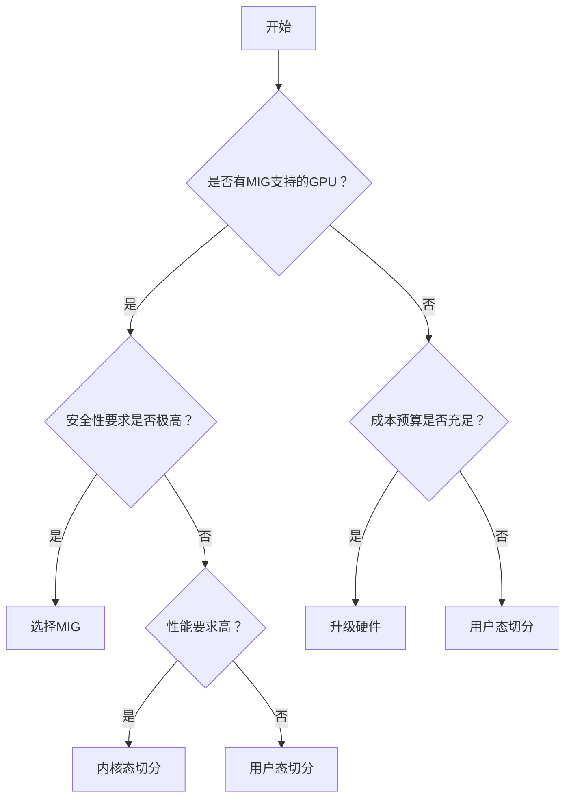
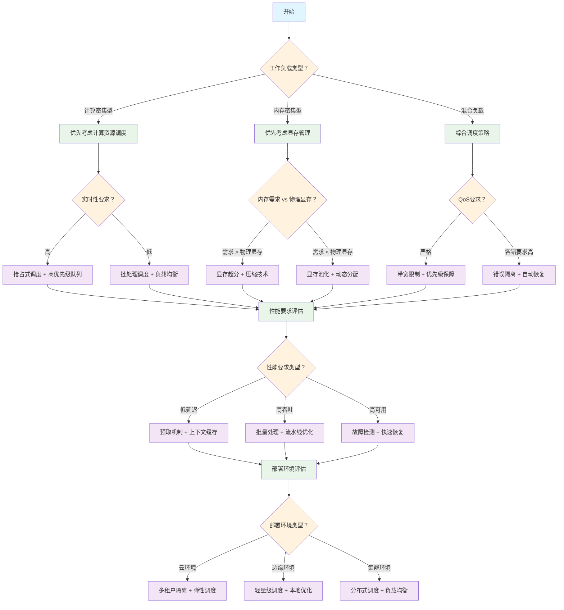

# GPU 虚拟化与资源管理技术深度解析 - 第三部分：资源管理与优化篇

本篇主要介绍GPU资源管理与优化技术，包括GPU切分技术、CUDA流和MPS技术、GPU资源管理核心技术与算法等。

## 目录

- [GPU 虚拟化与资源管理技术深度解析 - 第三部分：资源管理与优化篇](#gpu-虚拟化与资源管理技术深度解析---第三部分资源管理与优化篇)
  - [目录](#目录)
  - [8. GPU 切分技术深度解析](#8-gpu-切分技术深度解析)
    - [8.1 HAMi结合硬件级GPU切分技术](#81-hami结合硬件级gpu切分技术)
      - [8.1.1 HAMi与MIG技术的集成架构](#811-hami与mig技术的集成架构)
      - [8.1.2 HAMi MIG Device Plugin实现](#812-hami-mig-device-plugin实现)
      - [8.1.3 HAMi调度器的MIG感知调度](#813-hami调度器的mig感知调度)
      - [8.1.4 HAMi动态MIG切片插件](#814-hami动态mig切片插件)
      - [8.1.5 HAMi-MIG集成的优势](#815-hami-mig集成的优势)
    - [8.2 HAMi GPU切分实践应用](#82-hami-gpu切分实践应用)
      - [8.2.1 HAMi在Kubernetes环境下的GPU切分架构](#821-hami在kubernetes环境下的gpu切分架构)
      - [8.2.2 上层应用如何使用HAMi GPU切分服务](#822-上层应用如何使用hami-gpu切分服务)
        - [8.2.2.1 AI训练任务的GPU切分使用](#8221-ai训练任务的gpu切分使用)
        - [8.2.2.2 推理服务的GPU切分部署](#8222-推理服务的gpu切分部署)
      - [8.2.3 HAMi与虚拟化技术的结合实现](#823-hami与虚拟化技术的结合实现)
        - [8.2.3.1 HAMi-core虚拟化层集成](#8231-hami-core虚拟化层集成)
        - [8.2.3.2 混合切分策略实现](#8232-混合切分策略实现)
        - [8.2.3.3 智能资源弹性伸缩](#8233-智能资源弹性伸缩)
        - [8.2.3.4 动态切分性能优化](#8234-动态切分性能优化)
    - [8.3 切分技术选型指南](#83-切分技术选型指南)
      - [8.3.1 技术方案对比](#831-技术方案对比)
      - [8.3.2 应用场景选择](#832-应用场景选择)
      - [8.3.3 部署决策流程](#833-部署决策流程)
      - [8.3.4 性能调优建议](#834-性能调优建议)
    - [8.4 与虚拟化技术的关联](#84-与虚拟化技术的关联)
  - [9. GPU资源管理核心技术与算法](#9-gpu资源管理核心技术与算法)
    - [9.1 显存管理技术](#91-显存管理技术)
      - [9.1.1 显存池化和动态分配](#911-显存池化和动态分配)
      - [9.1.2 统一内存（Unified Memory）](#912-统一内存unified-memory)
      - [9.1.3 显存超分（Overcommit）](#913-显存超分overcommit)
    - [9.2 计算资源调度技术](#92-计算资源调度技术)
      - [9.2.1 GPU 核心的时间片分配](#921-gpu-核心的时间片分配)
      - [9.2.2 多任务并发执行策略](#922-多任务并发执行策略)
      - [9.2.3 优先级调度和抢占机制](#923-优先级调度和抢占机制)
    - [9.3 性能隔离机制](#93-性能隔离机制)
      - [9.3.1 带宽限制和 QoS 保障](#931-带宽限制和-qos-保障)
      - [9.3.2 错误隔离和故障恢复](#932-错误隔离和故障恢复)
      - [9.3.3 监控和性能分析工具](#933-监控和性能分析工具)
    - [9.4 GPU资源管理核心算法](#94-gpu资源管理核心算法)
      - [9.4.1 显存管理算法](#941-显存管理算法)
        - [9.4.1.1 显存池化管理](#9411-显存池化管理)
        - [9.4.1.2 显存超分技术](#9412-显存超分技术)
        - [9.4.1.3 统一内存管理](#9413-统一内存管理)
      - [9.4.2 计算资源调度算法](#942-计算资源调度算法)
        - [9.4.2.1 多级队列调度器](#9421-多级队列调度器)
        - [9.4.2.2 时间片分配算法](#9422-时间片分配算法)
        - [9.4.2.3 负载均衡算法](#9423-负载均衡算法)
      - [9.4.3 性能隔离算法](#943-性能隔离算法)
        - [9.4.3.1 带宽限制算法](#9431-带宽限制算法)
        - [9.4.3.2 错误隔离机制](#9432-错误隔离机制)
      - [9.4.4 监控与性能分析算法](#944-监控与性能分析算法)
        - [9.4.4.1 实时性能监控](#9441-实时性能监控)
        - [9.4.4.2 性能预测算法](#9442-性能预测算法)
        - [9.4.4.3 自适应优化算法](#9443-自适应优化算法)
      - [9.4.5 算法性能评估](#945-算法性能评估)
        - [9.4.5.1 基准测试框架](#9451-基准测试框架)
        - [9.4.5.2 算法复杂度分析](#9452-算法复杂度分析)
        - [9.4.5.3 算法性能对比](#9453-算法性能对比)
        - [9.4.5.4 最佳实践](#9454-最佳实践)
    - [9.5 AI大模型训练场景GPU资源管理优化](#95-ai大模型训练场景gpu资源管理优化)
      - [9.5.1 大模型训练的GPU资源需求特征](#951-大模型训练的gpu资源需求特征)
      - [9.5.2 动态资源调度优化](#952-动态资源调度优化)
      - [9.5.3 内存优化策略](#953-内存优化策略)
    - [9.6 技术选型决策树](#96-技术选型决策树)
  - [10. CUDA流和MPS技术](#10-cuda流和mps技术)
    - [10.1 CUDA流技术原理](#101-cuda流技术原理)
      - [10.1.1 CUDA流基础概念](#1011-cuda流基础概念)
      - [10.1.2 并发执行模型](#1012-并发执行模型)
      - [10.1.3 流调度机制](#1013-流调度机制)
    - [10.2 CUDA多进程服务（MPS）](#102-cuda多进程服务mps)
      - [10.2.1 MPS架构原理](#1021-mps架构原理)
      - [10.2.2 资源隔离机制](#1022-资源隔离机制)
      - [10.2.3 性能隔离策略](#1023-性能隔离策略)
    - [10.3 技术对比与选择](#103-技术对比与选择)
      - [10.3.1 CUDA流 vs MPS技术对比](#1031-cuda流-vs-mps技术对比)
      - [10.3.2 与虚拟化技术的协同](#1032-与虚拟化技术的协同)
    - [10.4 性能优化实践](#104-性能优化实践)
      - [10.4.1 CUDA流优化策略](#1041-cuda流优化策略)
      - [10.4.2 MPS性能调优](#1042-mps性能调优)
    - [10.5 应用场景与最佳实践](#105-应用场景与最佳实践)
      - [10.5.1 深度学习训练优化](#1051-深度学习训练优化)
      - [10.5.2 推理服务优化](#1052-推理服务优化)
    - [10.6 监控与调试](#106-监控与调试)
      - [10.6.1 CUDA流性能分析](#1061-cuda流性能分析)
      - [10.6.2 MPS监控工具](#1062-mps监控工具)
    - [10.7 故障排查指南](#107-故障排查指南)
      - [10.7.1 常见CUDA流问题](#1071-常见cuda流问题)
      - [10.7.2 MPS故障排查](#1072-mps故障排查)
  - [11. GPU 远程调用技术](#11-gpu-远程调用技术)
    - [11.1 远程 GPU 调用的基本原理](#111-远程-gpu-调用的基本原理)
      - [11.1.1 网络透明的 GPU 访问机制](#1111-网络透明的-gpu-访问机制)
      - [11.1.2 客户端-服务器架构设计](#1112-客户端-服务器架构设计)
      - [11.1.3 网络通信协议](#1113-网络通信协议)
    - [11.2 性能优化策略](#112-性能优化策略)
      - [11.2.1 延迟优化](#1121-延迟优化)
      - [11.2.2 带宽优化](#1122-带宽优化)
    - [11.3 缓存优化](#113-缓存优化)
      - [11.3.1 结果缓存机制](#1131-结果缓存机制)
      - [11.3.2 智能预取策略](#1132-智能预取策略)
    - [11.4 容错与可靠性](#114-容错与可靠性)
      - [11.4.1 故障检测机制](#1141-故障检测机制)
      - [11.4.2 故障恢复策略](#1142-故障恢复策略)
      - [11.4.3 高可用性架构](#1143-高可用性架构)
    - [11.5 安全性保障机制](#115-安全性保障机制)
      - [11.5.1 身份认证与授权](#1151-身份认证与授权)
      - [11.5.2 数据加密传输](#1152-数据加密传输)
      - [11.5.3 访问控制策略](#1153-访问控制策略)
      - [11.5.4 安全审计日志](#1154-安全审计日志)
    - [11.6 错误处理和异常管理](#116-错误处理和异常管理)
      - [11.6.1 错误分类体系](#1161-错误分类体系)
      - [11.6.2 异常恢复策略](#1162-异常恢复策略)
      - [11.6.3 错误传播机制](#1163-错误传播机制)
      - [11.6.4 降级与熔断机制](#1164-降级与熔断机制)
    - [11.7 性能监控和诊断](#117-性能监控和诊断)
      - [11.7.1 性能指标体系](#1171-性能指标体系)
      - [11.7.2 监控告警机制](#1172-监控告警机制)
      - [11.7.3 诊断工具与方法](#1173-诊断工具与方法)
    - [11.8 安全配置最佳实践](#118-安全配置最佳实践)
      - [11.8.1 网络安全配置](#1181-网络安全配置)
      - [11.8.2 数据保护策略](#1182-数据保护策略)
      - [11.8.3 合规性要求](#1183-合规性要求)
  - [第三部分总结](#第三部分总结)

---

## 8. GPU 切分技术深度解析

**本章概览：**
本章将深入探讨GPU切分技术的实现原理，重点以HAMi为例说明软件级GPU切分在Kubernetes环境下的实际应用。关于GPU切分技术的基本定义和分类，请参考[2.3.2节 GPU切分技术](第一部分：基础理论篇.md#232-gpu切分技术)。

**学习目标：**

- 掌握NVIDIA MIG技术的工作原理和配置方法
- 理解HAMi在Kubernetes环境下的GPU切分实现
- 了解上层应用如何使用GPU切分服务
- 掌握切分技术与虚拟化技术的结合应用

### 8.1 HAMi结合硬件级GPU切分技术

#### 8.1.1 HAMi与MIG技术的集成架构

HAMi通过与NVIDIA MIG技术的深度集成，为Kubernetes环境提供了硬件级GPU切分能力。这种集成架构结合了MIG的硬件级隔离优势（详见 @ref 4.2.1 "NVIDIA MIG技术深度解析"）和HAMi的容器化管理能力，为云原生AI应用提供了高性能、高隔离的GPU资源服务。

**集成优势：**

- **硬件级隔离**：利用MIG的物理隔离能力，确保容器间完全独立
- **自动化管理**：HAMi自动发现和管理MIG实例，简化运维复杂度
- **统一调度**：通过Kubernetes原生接口提供MIG资源的统一调度

**HAMi-MIG集成架构：**

```text
┌─────────────────────────────────────────────────────────────┐
│                    Kubernetes集群                           │
├─────────────────────────────────────────────────────────────┤
│  HAMi调度器扩展  │  HAMi Device Plugin  │  HAMi-core      │
├─────────────────────────────────────────────────────────────┤
│                    容器运行时层                              │
├─────────────────┬─────────────────┬─────────────────────────┤
│   MIG Instance  │   MIG Instance  │     MIG Instance        │
│      1g.5gb     │      2g.10gb    │        4g.20gb          │
│   (Pod A)       │   (Pod B)       │      (Pod C)            │
├─────────────────┼─────────────────┼─────────────────────────┤
│ HAMi-core       │ HAMi-core       │    HAMi-core            │
│ 资源控制        │ 资源控制        │    资源控制             │
└─────────────────┴─────────────────┴─────────────────────────┘
```

#### 8.1.2 HAMi MIG Device Plugin实现

HAMi通过扩展的Device Plugin来管理MIG实例，实现MIG资源的自动发现、分配和监控。

**核心组件：**

- **MIGDevicePlugin**：实现Kubernetes Device Plugin接口，管理MIG资源
- **MIGManager**：负责MIG实例的生命周期管理
- **MIGInstance**：封装单个MIG实例的完整状态信息

**主要功能：**

- **ListAndWatch**：实现设备发现和监控，持续监控MIG实例状态变化
- **Allocate**：实现设备分配，设置MIG相关环境变量和设备文件

**关键实现逻辑**：

```go
// MIGDevicePlugin HAMi MIG设备插件
type MIGDevicePlugin struct {
    resourceName string                       // 资源名称
    socket       string                       // Unix socket路径
    server       *grpc.Server                 // gRPC服务器
    devices      map[string]*pluginapi.Device // 设备映射表
    migManager   *MIGManager                  // MIG实例管理器
}

// ListAndWatch 实现设备发现和监控
func (m *MIGDevicePlugin) ListAndWatch(e *pluginapi.Empty,
    s pluginapi.DevicePlugin_ListAndWatchServer) error {
    // 初始设备列表发送
    devices := make([]*pluginapi.Device, 0)
    for _, instance := range m.migManager.instances {
        if instance.Available {
            devices = append(devices, &pluginapi.Device{
                ID:     instance.ID,
                Health: pluginapi.Healthy,
            })
        }
    }
    // 持续监控设备状态变化...
}

// Allocate 实现设备分配
func (m *MIGDevicePlugin) Allocate(ctx context.Context,
    reqs *pluginapi.AllocateRequest) (*pluginapi.AllocateResponse, error) {
    // 设置MIG相关环境变量
    response.Envs["CUDA_VISIBLE_DEVICES"] = fmt.Sprintf("MIG-%s", instance.ID)
    response.Envs["NVIDIA_MIG_CONFIG_DEVICES"] = instance.ID
    response.Envs["HAMI_MIG_PROFILE"] = instance.Profile
    // 添加设备文件和挂载HAMi-core库...
}
```

> **完整实现**：详见 [mig_device_plugin.go](code/hami/mig_device_plugin.go)

#### 8.1.3 HAMi调度器的MIG感知调度

HAMi调度器扩展了Kubernetes的调度能力，实现了MIG感知的智能调度。

**核心组件：**

- **MIGAwarePlugin**：实现HAMi MIG感知调度插件，提供MIG资源的过滤和评分功能
- **Filter方法**：检查节点是否满足Pod的MIG资源需求
- **Score方法**：根据MIG资源匹配度为节点打分
- **资源解析**：解析Pod中的MIG资源请求，支持多种MIG配置

**关键实现逻辑**：

```go
// MIGAwarePlugin 实现HAMi MIG感知调度插件
type MIGAwarePlugin struct {
    handle framework.Handle // Kubernetes调度框架句柄
}

// Filter 实现节点过滤逻辑
func (p *MIGAwarePlugin) Filter(ctx context.Context,
    state *framework.CycleState, pod *v1.Pod,
    nodeInfo *framework.NodeInfo) *framework.Status {
    // 检查Pod是否请求HAMi MIG资源
    migRequest := getMIGResourceRequest(pod)
    if migRequest == nil {
        return framework.NewStatus(framework.Success, "")
    }
    // 检查节点是否有足够的MIG资源
    availableMIG := getAvailableMIGResources(nodeInfo.Node())
    if !canSatisfyMIGRequest(migRequest, availableMIG) {
        return framework.NewStatus(framework.Unschedulable, "节点MIG资源不足")
    }
    return framework.NewStatus(framework.Success, "")
}

// getMIGResourceRequest 解析Pod中的MIG资源请求
func getMIGResourceRequest(pod *v1.Pod) *MIGResourceRequest {
    for _, container := range pod.Spec.Containers {
        if migProfile, exists := container.Resources.Requests["hami.io/mig-1g.5gb"]; exists {
            return &MIGResourceRequest{
                Profile: "1g.5gb",
                Count:   int(migProfile.Value()),
            }
        }
        // 支持其他MIG配置：2g.10gb, 3g.20gb, 7g.40gb等
    }
    return nil
}
```

> **完整实现**：详见 [mig_scheduler.go](code/hami/mig_scheduler.go)

#### 8.1.4 HAMi动态MIG切片插件

HAMi动态MIG切片插件扩展了静态MIG配置（参见 @ref 4.2.1.2 "GPU实例的创建和管理"），实现了按需创建和自动管理MIG实例的能力。

**核心特性：**

- **按需创建**：根据Pod资源请求动态创建MIG实例
- **统一接口**：为HAMi-core和MIG提供一致的vGPU API
- **智能选择**：自动选择最优的虚拟化方式（MIG或HAMi-core）
- **混合调度**：支持同一节点上MIG和HAMi-core并存

> **详细文档**：完整的动态切片实现见 [NVIDIA GPU MPS 和 MIG 动态切片插件](https://project-hami.io/zh/docs/developers/dynamic-mig/)

**配置特性：**

- **MIG几何配置**：支持A100等GPU的多种MIG实例规格（1g.5gb、2g.10gb、3g.20gb、7g.40gb）
- **节点配置**：支持按节点配置操作模式（hami-core或mig）
- **自动选择**：根据资源需求自动选择最优虚拟化方式
- **强制模式**：支持通过注解强制使用特定虚拟化技术

**配置示例**：

```yaml
# hami-scheduler-device-configMap
apiVersion: v1
data:
  device-config.yaml: |
    nvidia:
      resourceCountName: nvidia.com/gpu
      resourceMemoryName: nvidia.com/gpumem
      resourceCoreName: nvidia.com/gpucores
      knownMigGeometries:
      - models: [ "A100-SXM4-40GB", "A100-40GB-PCIe" ]
        allowedGeometries:
          - 
            - name: 1g.5gb
              memory: 5120
              count: 7
          - 
            - name: 2g.10gb
              memory: 10240
              count: 3
      nodeconfig:
        - name: nodeA
          operatingmode: hami-core
        - name: nodeB
          operatingmode: mig
```

> **完整配置**：详见 [hami-device-config.yaml](code/examples/hami-device-config.yaml)

#### 8.1.5 HAMi-MIG集成的优势

**技术优势：**

- **硬件级隔离**：利用MIG的硬件级隔离能力，确保容器间完全独立
- **云原生集成**：与Kubernetes深度集成，提供原生的容器化GPU服务
- **自动化管理**：自动发现和管理MIG实例，简化运维复杂度
- **灵活调度**：支持多种MIG配置的混合调度，优化资源利用率
- **统一接口**：为不同虚拟化技术提供统一的vGPU池管理

**调度策略：**

- **Binpack调度**：优先填满节点资源，提高资源利用率
- **Spread调度**：分散部署任务，提高可用性和负载均衡
- **混合调度**：结合CPU、内存、GPU内存的综合调度决策

**应用场景：**

- **企业级AI训练**：为大规模深度学习训练提供高性能、高隔离的GPU资源
- **多租户推理服务**：为不同租户提供独立的GPU实例，确保服务质量
- **混合工作负载**：同时支持训练和推理任务的混合部署
- **资源池化**：实现GPU资源的统一管理和动态分配
- **开发测试环境**：为开发团队提供灵活的GPU资源分配

### 8.2 HAMi GPU切分实践应用

#### 8.2.1 HAMi在Kubernetes环境下的GPU切分架构

**HAMi GPU切分的整体架构：**

HAMi通过结合Kubernetes原生调度机制和底层虚拟化技术，实现了完整的GPU切分解决方案。其架构分为三个层次：

1. **Kubernetes集群层**：调度器扩展、设备插件、Webhook
2. **节点管理层**：设备发现、资源分配、监控服务
3. **容器运行层**：HAMi-core虚拟化库、API拦截、资源控制

**HAMi GPU切分的工作流程：**

```yaml
# 1. 用户提交GPU切分请求
apiVersion: v1
kind: Pod
metadata:
  name: ai-training-job
spec:
  containers:
  - name: pytorch-container
    image: pytorch/pytorch:1.12.0-cuda11.3-cudnn8-runtime
    resources:
      limits:
        nvidia.com/gpu: "2"        # 请求2个vGPU实例
        nvidia.com/gpumem: "4000"   # 每个vGPU分配4GB内存
        nvidia.com/gpucores: "50"   # 每个vGPU使用50%计算资源
    command: ["python", "train.py"]
```

**HAMi调度决策过程：**

核心调度逻辑包括：

- **资源解析**：解析Pod的GPU资源请求（内存、计算核心、数量）
- **节点过滤**：检查节点是否有足够的GPU资源满足请求
- **可用性检查**：验证GPU内存和计算资源的可用性
- **调度决策**：返回满足条件的可调度节点列表

**关键实现逻辑**：

```go
type GPUScheduler struct {
    deviceManager *DeviceManager
    nodeResources map[string]*NodeGPUResources
}

type GPURequest struct {
    MemoryMB       int64
    CorePercentage int
    Count          int
}

// GPU资源调度决策
func (s *GPUScheduler) Filter(pod *v1.Pod, nodes []*v1.Node) []*v1.Node {
    var feasibleNodes []*v1.Node
    // 解析Pod的GPU资源请求
    gpuRequest := parseGPURequest(pod)
    for _, node := range nodes {
        nodeResource := s.nodeResources[node.Name]
        // 检查节点是否有足够的GPU资源
        if canSchedule := s.checkGPUAvailability(nodeResource, gpuRequest); canSchedule {
            feasibleNodes = append(feasibleNodes, node)
        }
    }
    return feasibleNodes
}

// 检查GPU资源可用性
func (s *GPUScheduler) checkGPUAvailability(nodeRes *NodeGPUResources, req *GPURequest) bool {
    for _, gpu := range nodeRes.GPUs {
        if gpu.AvailableMemory >= req.MemoryMB && gpu.AvailableCores >= req.CorePercentage {
            return true
        }
    }
    return false
}
```

> **完整实现**：详见 [gpu_scheduler.go](code/hami/gpu_scheduler.go)

#### 8.2.2 上层应用如何使用HAMi GPU切分服务

##### 8.2.2.1 AI训练任务的GPU切分使用

**PyTorch分布式训练示例：**

关键特性：

- **资源规格**：每个worker使用1个vGPU，分配6GB显存，使用75%计算资源
- **分布式配置**：支持4个并行训练任务，自动配置分布式环境
- **透明集成**：应用程序代码无需修改，HAMi自动进行资源控制和调度
- **环境变量**：自动设置MASTER_ADDR、MASTER_PORT、WORLD_SIZE等分布式参数

**配置示例**：

```yaml
# pytorch-distributed-training.yaml
apiVersion: batch/v1
kind: Job
metadata:
  name: pytorch-distributed-training
spec:
  parallelism: 4  # 4个并行训练任务
  template:
    spec:
      containers:
      - name: pytorch-worker
        image: pytorch/pytorch:1.12.0-cuda11.3-cudnn8-runtime
        resources:
          limits:
            nvidia.com/gpu: "1"        # 每个worker使用1个vGPU
            nvidia.com/gpumem: "6000"   # 分配6GB显存
            nvidia.com/gpucores: "75"   # 使用75%计算资源
        env:
        - name: MASTER_ADDR
          value: "pytorch-master"
        - name: WORLD_SIZE
          value: "4"
        command: ["python", "-m", "torch.distributed.launch", "train_distributed.py"]
```

> **完整配置**：详见 [pytorch-distributed-training.yaml](code/examples/pytorch-distributed-training.yaml)
> **训练代码**：详见 [train_distributed.py](code/examples/train_distributed.py)

##### 8.2.2.2 推理服务的GPU切分部署

**多模型推理服务示例：**

关键特性：

- **高密度部署**：8个推理实例，每个使用1个vGPU、2GB显存、25%计算资源
- **服务发现**：通过Kubernetes Service提供HTTP和gRPC接口
- **负载均衡**：自动分发推理请求到不同实例
- **透明调度**：HAMi自动进行资源调度，客户端无感知

> **部署配置**：详见 [model-serving-deployment.yaml](code/examples/model-serving-deployment.yaml)
> **客户端代码**：详见 [inference_client.py](code/examples/inference_client.py)

#### 8.2.3 HAMi与虚拟化技术的结合实现

HAMi通过将用户态虚拟化技术与Kubernetes调度器深度集成，实现了透明、高效的GPU切分服务。本节详细说明HAMi如何结合虚拟化技术为上层应用提供GPU切分能力。

##### 8.2.3.1 HAMi-core虚拟化层集成

HAMi通过HAMi-core实现了用户态GPU虚拟化，与Kubernetes调度器紧密集成：

**HAMi架构中的虚拟化层：**

```go
// pkg/scheduler/scheduler.go - HAMi调度器扩展
package scheduler

import (
    "context"
    "fmt"
    v1 "k8s.io/api/core/v1"
    "k8s.io/apimachinery/pkg/runtime"
    "k8s.io/kubernetes/pkg/scheduler/framework"
)

// HAMiSchedulerExtender HAMi调度器扩展
type HAMiSchedulerExtender struct {
    handle framework.Handle
}

// Filter 实现GPU资源过滤
func (h *HAMiSchedulerExtender) Filter(ctx context.Context, state *framework.CycleState, pod *v1.Pod, nodeInfo *framework.NodeInfo) *framework.Status {
    // 检查节点GPU资源可用性
    gpuRequest := getGPUResourceRequest(pod)
    if gpuRequest == nil {
        return nil // 不需要GPU资源
    }
    
    // 获取节点GPU资源状态
    nodeGPUStatus := h.getNodeGPUStatus(nodeInfo.Node())
    
    // 检查显存资源
    if gpuRequest.Memory > nodeGPUStatus.AvailableMemory {
        return framework.NewStatus(framework.Unschedulable, 
            fmt.Sprintf("insufficient GPU memory: requested %d, available %d", 
                gpuRequest.Memory, nodeGPUStatus.AvailableMemory))
    }
    
    // 检查计算资源
    if gpuRequest.Cores > nodeGPUStatus.AvailableCores {
        return framework.NewStatus(framework.Unschedulable, 
            fmt.Sprintf("insufficient GPU cores: requested %d, available %d", 
                gpuRequest.Cores, nodeGPUStatus.AvailableCores))
    }
    
    return nil
}

type GPUResourceRequest struct {
    Memory int64  // 显存需求（MB）
    Cores  int64  // 计算核心需求（百分比）
}

type NodeGPUStatus struct {
    TotalMemory     int64
    AvailableMemory int64
    TotalCores      int64
    AvailableCores  int64
    GPUCount        int
}
```

**2. 自适应调整算法：**

基于机器学习的自适应调整算法：

```c
// 动态调整决策算法
int adaptive_slicing_decision(dynamic_slicing_engine_t *engine) {
    workload_metrics_t *metrics = &engine->current_metrics;
    
    // === 第一步：负载模式识别 ===
    workload_pattern_t pattern = classify_workload_pattern(metrics);
    
    switch (pattern) {
    case PATTERN_COMPUTE_INTENSIVE:
        // 计算密集型：增加时间切分，减少空间切分
        return adjust_for_compute_intensive(engine);
        
    case PATTERN_MEMORY_INTENSIVE:
        // 内存密集型：增加空间切分，优化内存分配
        return adjust_for_memory_intensive(engine);
        
    case PATTERN_MIXED_WORKLOAD:
        // 混合负载：采用混合切分策略
        return adjust_for_mixed_workload(engine);
        
    case PATTERN_BURSTY_TRAFFIC:
        // 突发流量：启用弹性扩缩容
        return adjust_for_bursty_traffic(engine);
        
    default:
        return maintain_current_configuration(engine);
    }
}

// 计算密集型负载调整策略
static int adjust_for_compute_intensive(dynamic_slicing_engine_t *engine) {
    // 减少分区数，增加每个分区的计算资源
    if (engine->current_partition_count > MIN_PARTITIONS) {
        engine->target_partition_count = 
            max(MIN_PARTITIONS, engine->current_partition_count - 1);
        
        // 同时减少时间片长度，提高响应性
        adjust_time_slice_duration(0.8); // 减少20%
        
        return schedule_partition_adjustment(engine);
    }
    return 0;
}

// 内存密集型负载调整策略
static int adjust_for_memory_intensive(dynamic_slicing_engine_t *engine) {
    // 增加分区数，提供更细粒度的内存隔离
    if (engine->current_partition_count < MAX_PARTITIONS) {
        engine->target_partition_count = 
            min(MAX_PARTITIONS, engine->current_partition_count + 1);
        
        // 启用内存压缩和超分技术
        enable_memory_overcommit(1.5); // 1.5倍超分
        
        return schedule_partition_adjustment(engine);
    }
    return 0;
}
```

**3. 预测性资源调度：**

基于历史数据和机器学习的预测性调度：

```c
// 负载预测模型
typedef struct {
    float feature_weights[FEATURE_COUNT];   // 特征权重
    float bias;                             // 偏置项
    float learning_rate;                    // 学习率
    int training_samples;                   // 训练样本数
} prediction_model_t;

// 负载预测算法
float predict_future_load(prediction_model_t *model, 
                         workload_metrics_t *current_metrics) {
    float features[FEATURE_COUNT] = {
        current_metrics->gpu_utilization,
        current_metrics->memory_utilization,
        current_metrics->average_latency_ms / 1000.0f, // 归一化
        (float)current_metrics->active_tasks / MAX_TASKS,
        get_time_of_day_factor(),  // 时间因子
        get_day_of_week_factor()   // 周期因子
    };
    
    float prediction = model->bias;
    for (int i = 0; i < FEATURE_COUNT; i++) {
        prediction += features[i] * model->feature_weights[i];
    }
    
    // 应用激活函数（sigmoid）
    return 1.0f / (1.0f + expf(-prediction));
}

// 预测性资源预分配
int predictive_resource_allocation(dynamic_slicing_engine_t *engine) {
    // 预测未来5分钟的负载
    float predicted_load = predict_future_load(&engine->prediction_model, 
                                              &engine->current_metrics);
    
    // 基于预测结果提前调整资源
    if (predicted_load > LOAD_THRESHOLD_HIGH) {
        // 预期高负载：提前增加资源
        return preemptive_scale_up(engine);
    } else if (predicted_load < LOAD_THRESHOLD_LOW) {
        // 预期低负载：提前释放资源
        return preemptive_scale_down(engine);
    }
    
    return 0; // 无需调整
}
```

##### 8.2.3.2 混合切分策略实现

混合切分策略结合时间切分和空间切分的优势，实现更灵活的资源管理：

**关键实现逻辑**：

```c
// 混合调度条目结构
typedef struct {
    int partition_id;        // 空间分区ID
    int time_slice_id;       // 时间片ID
    int priority;            // 优先级
    uint64_t start_time;     // 开始时间(微秒)
    uint64_t duration;       // 持续时间(微秒)
} hybrid_schedule_entry_t;

// 混合切分任务调度算法
int schedule_hybrid_task(gpu_task_t *task) {
    // === 第一阶段：空间分区分配 ===
    // 根据任务的内存需求分配独立的GPU分区
    int partition = allocate_spatial_partition(task->memory_requirement);
    if (partition < 0) {
        printf("Failed to allocate spatial partition\n");
        return -1;
    }
    
    // === 第二阶段：时间片分配 ===
    // 在分配的分区内进行时间调度
    int time_slot = allocate_time_slot(partition, task->estimated_duration);
    if (time_slot < 0) {
        release_spatial_partition(partition, task->memory_requirement);
        return -1;
    }
    
    // === 第三阶段：任务执行 ===
    hybrid_schedule_entry_t entry = {
        .partition_id = partition,
        .time_slice_id = time_slot,
        .priority = task->priority
    };
    
    return execute_hybrid_task(task, &entry);
}
```

> **完整实现**：详见 [hybrid_slicing.c](code/partitioning/hybrid_slicing.c)

**1. 二维资源调度矩阵：**

```c
// 二维调度矩阵
typedef struct {
    int spatial_partition;      // 空间分区ID
    int temporal_slot;          // 时间片ID
    task_priority_t priority;   // 任务优先级
    resource_quota_t quota;     // 资源配额
    bool is_occupied;          // 占用状态
    uint64_t allocation_time;   // 分配时间
} schedule_cell_t;

typedef struct {
    schedule_cell_t cells[MAX_SPATIAL_PARTITIONS][MAX_TEMPORAL_SLOTS];
    int active_spatial_partitions;
    int active_temporal_slots;
    pthread_mutex_t matrix_lock;
} scheduling_matrix_t;

// 混合调度算法
int hybrid_schedule_task(gpu_task_t *task, scheduling_matrix_t *matrix) {
    pthread_mutex_lock(&matrix->matrix_lock);
    
    // === 第一阶段：空间维度优化分配 ===
    int best_spatial = find_optimal_spatial_partition(task, matrix);
    if (best_spatial < 0) {
        pthread_mutex_unlock(&matrix->matrix_lock);
        return -ENOMEM; // 空间资源不足
    }
    
    // === 第二阶段：时间维度优化分配 ===
    int best_temporal = find_optimal_temporal_slot(task, matrix, best_spatial);
    if (best_temporal < 0) {
        pthread_mutex_unlock(&matrix->matrix_lock);
        return -EBUSY; // 时间资源不足
    }
    
    // === 第三阶段：资源预留和配置 ===
    schedule_cell_t *cell = &matrix->cells[best_spatial][best_temporal];
    cell->is_occupied = true;
    cell->priority = task->priority;
    cell->allocation_time = get_current_time_us();
    
    // 配置资源配额
    configure_resource_quota(cell, task);
    
    pthread_mutex_unlock(&matrix->matrix_lock);
    
    printf("Task %d scheduled: spatial=%d, temporal=%d\n", 
           task->task_id, best_spatial, best_temporal);
    
    return 0;
}
```

**2. 动态负载均衡算法：**

```c
// 负载均衡器
typedef struct {
    float partition_loads[MAX_PARTITIONS];  // 各分区负载
    float target_load_per_partition;        // 目标负载
    int rebalance_threshold_percent;        // 重平衡阈值
    uint64_t last_rebalance_time;          // 上次重平衡时间
} load_balancer_t;

// 动态负载重平衡
int dynamic_load_rebalancing(load_balancer_t *balancer, 
                            scheduling_matrix_t *matrix) {
    // 计算负载不平衡程度
    float load_variance = calculate_load_variance(balancer);
    
    if (load_variance > balancer->rebalance_threshold_percent / 100.0f) {
        // 执行负载重平衡
        return execute_load_migration(balancer, matrix);
    }
    
    return 0; // 负载平衡，无需调整
}

// 任务迁移算法
static int execute_load_migration(load_balancer_t *balancer,
                                 scheduling_matrix_t *matrix) {
    // 找到负载最高和最低的分区
    int overloaded_partition = find_max_load_partition(balancer);
    int underloaded_partition = find_min_load_partition(balancer);
    
    if (overloaded_partition < 0 || underloaded_partition < 0) {
        return -1;
    }
    
    // 选择合适的任务进行迁移
    gpu_task_t *migration_task = select_migration_candidate(
        matrix, overloaded_partition);
    
    if (migration_task) {
        // 执行任务迁移
        return migrate_task(migration_task, overloaded_partition, 
                           underloaded_partition, matrix);
    }
    
    return 0;
}
```

##### 8.2.3.3 智能资源弹性伸缩

**1. 弹性伸缩触发机制：**

```c
// 弹性伸缩配置
typedef struct {
    float scale_up_threshold;       // 扩容阈值
    float scale_down_threshold;     // 缩容阈值
    int scale_up_cooldown_sec;      // 扩容冷却时间
    int scale_down_cooldown_sec;    // 缩容冷却时间
    int min_partitions;             // 最小分区数
    int max_partitions;             // 最大分区数
    bool auto_scaling_enabled;      // 自动伸缩开关
} elastic_scaling_config_t;

// 弹性伸缩决策引擎
int elastic_scaling_decision(dynamic_slicing_engine_t *engine,
                            elastic_scaling_config_t *config) {
    if (!config->auto_scaling_enabled) {
        return 0;
    }
    
    float current_utilization = engine->current_metrics.gpu_utilization;
    uint64_t current_time = get_current_time_us();
    
    // === 扩容决策 ===
    if (current_utilization > config->scale_up_threshold) {
        if (is_cooldown_expired(engine->last_scale_up_time, 
                               config->scale_up_cooldown_sec)) {
            return execute_scale_up(engine, config);
        }
    }
    
    // === 缩容决策 ===
    if (current_utilization < config->scale_down_threshold) {
        if (is_cooldown_expired(engine->last_scale_down_time,
                               config->scale_down_cooldown_sec)) {
            return execute_scale_down(engine, config);
        }
    }
    
    return 0;
}

// 智能扩容算法
static int execute_scale_up(dynamic_slicing_engine_t *engine,
                           elastic_scaling_config_t *config) {
    if (engine->current_partition_count >= config->max_partitions) {
        return -ENOSPC; // 已达最大分区数
    }
    
    // 计算最优扩容数量
    int scale_amount = calculate_optimal_scale_amount(engine, true);
    int new_partition_count = min(config->max_partitions,
                                 engine->current_partition_count + scale_amount);
    
    // 执行分区扩容
    for (int i = engine->current_partition_count; i < new_partition_count; i++) {
        if (create_new_partition(i) != 0) {
            break; // 创建失败，停止扩容
        }
    }
    
    engine->current_partition_count = new_partition_count;
    engine->last_scale_up_time = get_current_time_us();
    
    printf("Scaled up to %d partitions\n", new_partition_count);
    return 0;
}
```

**2. 渐进式资源调整：**

```c
// 渐进式调整策略
typedef struct {
    float adjustment_step_size;     // 调整步长
    int max_adjustment_steps;       // 最大调整步数
    int current_step;              // 当前步数
    float target_utilization;      // 目标利用率
    bool adjustment_active;         // 调整激活状态
} gradual_adjustment_t;

// 渐进式资源调整算法
int gradual_resource_adjustment(dynamic_slicing_engine_t *engine,
                               gradual_adjustment_t *adjustment) {
    if (!adjustment->adjustment_active) {
        return 0;
    }
    
    float current_util = engine->current_metrics.gpu_utilization;
    float util_diff = adjustment->target_utilization - current_util;
    
    // 计算本次调整量
    float adjustment_amount = util_diff * adjustment->adjustment_step_size;
    
    // 应用调整
    if (fabs(adjustment_amount) > 0.01f) { // 1%阈值
        apply_utilization_adjustment(engine, adjustment_amount);
        adjustment->current_step++;
        
        // 检查是否完成调整
        if (adjustment->current_step >= adjustment->max_adjustment_steps ||
            fabs(util_diff) < 0.02f) { // 2%容差
            adjustment->adjustment_active = false;
            adjustment->current_step = 0;
            printf("渐进式调整完成\n");
        }
    }
    
    return 0;
}
```

##### 8.2.3.4 动态切分性能优化

**1. 切分开销最小化：**

```c
// 切分开销监控
typedef struct {
    uint64_t context_switch_time_us;    // 上下文切换时间
    uint64_t memory_migration_time_us;  // 内存迁移时间
    uint64_t scheduling_overhead_us;    // 调度开销
    float overhead_percentage;          // 开销百分比
} slicing_overhead_metrics_t;

// 开销优化算法
int optimize_slicing_overhead(dynamic_slicing_engine_t *engine) {
    slicing_overhead_metrics_t overhead;
    measure_slicing_overhead(&overhead);
    
    // 如果开销超过5%，启用优化
    if (overhead.overhead_percentage > 0.05f) {
        // 减少切分频率
        increase_time_slice_duration(1.2f); // 增加20%
        
        // 启用上下文缓存
        enable_context_caching(true);
        
        // 优化内存迁移策略
        optimize_memory_migration_strategy();
        
        printf("切分开销已优化: %.2f%% -> 目标 <5%%\n",
               overhead.overhead_percentage * 100);
    }
    
    return 0;
}
```

**2. 自适应调度算法：**

```c
// 自适应调度器
typedef struct {
    scheduling_algorithm_t current_algorithm;  // 当前算法
    float algorithm_performance[ALGORITHM_COUNT]; // 算法性能
    int algorithm_usage_count[ALGORITHM_COUNT];   // 使用计数
    uint64_t last_algorithm_switch_time;          // 上次切换时间
} adaptive_scheduler_t;

// 调度算法自适应选择
int adaptive_algorithm_selection(adaptive_scheduler_t *scheduler,
                                workload_metrics_t *metrics) {
    // 评估当前算法性能
    float current_performance = evaluate_algorithm_performance(
        scheduler->current_algorithm, metrics);
    
    // 更新性能统计
    scheduler->algorithm_performance[scheduler->current_algorithm] = 
        (scheduler->algorithm_performance[scheduler->current_algorithm] * 0.9f) +
        (current_performance * 0.1f); // 指数移动平均
    
    // 寻找更优算法
    scheduling_algorithm_t best_algorithm = find_best_algorithm(scheduler);
    
    // 如果找到更优算法且性能提升超过10%，则切换
    if (best_algorithm != scheduler->current_algorithm) {
        float improvement = scheduler->algorithm_performance[best_algorithm] -
                           scheduler->algorithm_performance[scheduler->current_algorithm];
        
        if (improvement > 0.1f) {
            return switch_scheduling_algorithm(scheduler, best_algorithm);
        }
    }
    
    return 0;
}
```

### 8.3 切分技术选型指南

GPU切分技术的选型决策需要基于多维度的技术评估和业务需求分析，本节提供系统化的技术选型决策框架和实践指导原则。

#### 8.3.1 技术方案对比

| 对比维度 | 硬件级切分（MIG） | 软件级切分（用户态） | 软件级切分（内核态） |
|---------|------------------|-------------------|-------------------|
| **隔离程度** | 完全硬件隔离 | API级别隔离 | 系统调用级隔离 |
| **性能开销** | 无额外开销 | 5-15% | 2-8% |
| **资源粒度** | 固定配置 | 灵活配置 | 灵活配置 |
| **硬件要求** | A100/H100等 | 通用GPU | 通用GPU |
| **部署复杂度** | 中等 | 简单 | 复杂 |
| **故障隔离** | 完全隔离 | 部分隔离 | 较好隔离 |
| **成本** | 高 | 低 | 中等 |

#### 8.3.2 应用场景选择

**1. 高安全性要求场景：**

- **推荐方案**：硬件级切分（MIG）
- **适用场景**：金融、医疗、政府等对安全性要求极高的行业
- **关键优势**：硬件级隔离，完全避免数据泄露风险

**2. 成本敏感场景：**

- **推荐方案**：软件级切分（用户态）
- **适用场景**：中小企业、开发测试环境、教育机构
- **关键优势**：部署简单，成本低，适用于现有GPU硬件

**3. 高性能要求场景：**

- **推荐方案**：硬件级切分（MIG）或内核态切分
- **适用场景**：AI训练、高性能计算、实时推理
- **关键优势**：性能开销最小，资源保障性强

**4. 灵活性要求场景：**

- **推荐方案**：软件级切分（内核态）
- **适用场景**：云服务提供商、多租户平台
- **关键优势**：动态资源调整，支持复杂的资源管理策略

#### 8.3.3 部署决策流程



#### 8.3.4 性能调优建议

**硬件级切分优化：**

- 合理规划实例配置，避免资源碎片化
- 根据工作负载特性选择合适的实例大小
- 定期监控实例利用率，及时调整配置

**软件级切分优化：**

- 优化API拦截路径，减少函数调用开销
- 实现智能缓存机制，减少重复计算
- 采用异步处理，提高并发性能

**通用优化策略：**

- 实施负载均衡，避免热点问题
- 建立监控体系，及时发现性能瓶颈
- 定期进行性能基准测试，验证优化效果

### 8.4 与虚拟化技术的关联

本章介绍的GPU切分技术是第三章GPU虚拟化技术的具体实现和深化。两者在技术实现上存在密切关联：

**技术层次对应关系：**

- **硬件级切分（MIG）** ↔ **硬件层虚拟化**：MIG技术是硬件层虚拟化的典型实现
- **软件级切分** ↔ **内核态/用户态虚拟化**：通过API拦截和系统调用拦截实现资源切分
- **容错与可靠性** ↔ **多租户安全性**：确保切分后的资源隔离和安全保障

**实现机制互补：**

- 虚拟化技术提供了理论基础和架构框架
- 切分技术提供了具体的实现方案和算法细节
- 两者结合实现了完整的GPU资源管理解决方案

接下来的章节将进一步深入探讨GPU资源管理的核心技术实现。

---

## 9. GPU资源管理核心技术与算法

**本章概览：**
本章将深入探讨GPU资源管理的核心技术，包括显存管理、计算资源调度等关键技术的实现原理。

**学习目标：**

- 掌握显存池化和动态分配的实现机制
- 理解统一内存技术的工作原理和应用场景
- 学习显存超分技术的风险控制策略
- 了解计算资源调度的优化方法

### 9.1 显存管理技术

显存管理技术是实现GPU资源高效利用的核心技术，包括显存池化、动态分配、统一内存等。

#### 9.1.1 显存池化和动态分配

显存池化是提高 GPU 资源利用率的关键技术，它通过将多个GPU卡的显存合并为一个显存池，实现显存的动态分配和管理。

参考实现：[hybrid_slicing.c](code/partitioning/hybrid_slicing.c)

1. **全局显存池**：

    全局显存池管理实现了动态分配和红黑树优化，支持高效的内存分配和回收。

2. **内存碎片整理**：

   内存碎片整理算法包括标记、压缩和指针更新三个阶段，详细可以参考：[CUDA Memory Management](https://docs.nvidia.com/cuda/cuda-memory-management.html)

#### 9.1.2 统一内存（Unified Memory）

统一内存技术允许 CPU 和 GPU 共享同一地址空间，详细可以参考：[CUDA Unified Memory](https://docs.nvidia.com/cuda/cuda-c-programming-guide/index.html#unified-memory)。

统一内存管理的核心功能包括：

1. **统一内存分配**：

    统一内存的动态分配实现了虚拟地址到物理地址的映射，支持CPU和GPU的透明访问。

2. **页面迁移机制**：

    统一内存页面迁移机制支持异步和同步迁移，根据访问模式自动优化数据位置。

#### 9.1.3 显存超分（Overcommit）

显存超分允许分配超过物理显存大小的虚拟显存，通过智能的内存管理策略提高GPU资源利用率。

架构图可以参考:[GPU 显存超分技术架构](images/memory_overcommit_architecture.svg)。

参考实现：[memory_overcommit.c](code/partitioning/memory_overcommit.c)。

**1. 超分配策略**：

- **按需分页（Demand Paging）**：
  - 只有在实际访问时才分配物理显存
  - 使用页表管理虚拟到物理地址的映射
  - 支持写时复制（Copy-on-Write）机制
  - 延迟分配策略减少内存浪费

- **内存压缩技术**：
  - 对不常用的显存页面进行实时压缩
  - 使用LZ4、ZSTD等高效压缩算法
  - 压缩比通常可达2-4倍
  - 解压缩延迟控制在微秒级别

- **分层存储策略**：
  - **热数据**：保留在GPU显存中
  - **温数据**：压缩存储在显存中
  - **冷数据**：迁移到系统内存或NVMe存储
  - 基于访问频率和时间局部性进行分层

- **智能预测算法**：
  - 基于历史访问模式预测内存需求
  - 机器学习模型预测页面访问概率
  - 提前进行内存迁移和预加载
  - 减少缺页中断的性能影响

**2. 风险控制机制**：

- **内存压力监控**：
  - 实时监控显存使用率和碎片化程度
  - 设置多级告警阈值（75%、85%、95%）
  - 动态调整超分比例（1.2x - 3.0x）
  - 预测性告警机制防止OOM

- **优雅降级策略**：
  - **轻度压力**：启用内存压缩和页面换出
  - **中度压力**：限制新的内存分配请求
  - **重度压力**：强制回收长时间未使用的内存
  - **极限压力**：终止低优先级任务释放内存

- **QoS保障机制**：
  - 为不同优先级任务预留专用内存
  - 高优先级任务享有内存分配优先权
  - 实施内存配额和速率限制
  - 防止单个任务耗尽所有显存资源

- **故障恢复机制**：
  - **检查点机制**：定期保存任务状态
  - **快速重启**：OOM后快速恢复任务执行
  - **内存泄漏检测**：自动检测和回收泄漏内存
  - **降级执行**：在内存不足时降低精度或批大小

**3. 性能优化策略**：

- **预取机制**：
  - 基于访问模式预取可能需要的数据
  - 利用GPU空闲时间进行后台预取
  - 减少缺页中断对性能的影响

- **批量操作**：
  - 批量处理内存分配和释放请求
  - 减少系统调用开销
  - 提高内存管理效率

- **NUMA感知**：
  - 考虑NUMA拓扑进行内存分配
  - 优先使用本地内存节点
  - 减少跨节点内存访问延迟

**4. 监控和调试工具**：

- **内存使用可视化**：
  - 实时显示物理和虚拟内存使用情况
  - 内存分配热力图和时间线
  - 碎片化程度和压缩效率统计

- **性能分析工具**：
  - 缺页中断频率和处理时间统计
  - 内存迁移和压缩性能分析
  - 超分效果和风险评估报告

**5. 最佳实践建议**：

- **合理设置超分比例**：根据工作负载特征设置1.5-2.5倍超分
- **监控关键指标**：重点关注缺页率、压缩比、迁移延迟
- **定期调优**：根据实际使用情况调整策略参数
- **应急预案**：制定内存不足时的应急处理流程

### 9.2 计算资源调度技术

#### 9.2.1 GPU 核心的时间片分配

基于多级队列调度器，支持5个优先级等级，实现高优先级任务优先执行，同优先级任务公平共享时间片。

架构图可以参考：[GPU 时间片调度机制](images/time_slicing_mechanism.svg)。

参考实现：[gpu_scheduler.c](code/scheduling/gpu_scheduler.c)。

**调度器核心数据结构**：

```c
// GPU任务结构
struct gpu_task {
    struct list_head list;
    int task_id;
    int priority;
    void *data;
    size_t data_size;
    struct completion completion;
    int (*execute)(struct gpu_task *task);
    int assigned_unit_id;        // 分配的执行单元ID
    uint64_t start_time;         // 任务开始时间戳
};

// 优先级定义
enum task_priority {
    PRIORITY_REALTIME = 0,   // 实时任务
    PRIORITY_HIGH = 1,       // 高优先级
    PRIORITY_NORMAL = 2,     // 普通优先级
    PRIORITY_LOW = 3,        // 低优先级
    PRIORITY_IDLE = 4,       // 空闲任务
    NUM_PRIORITIES
};

// 多级队列调度器
typedef struct {
    struct list_head priority_queues[NUM_PRIORITIES];
    int queue_weights[NUM_PRIORITIES];  // 队列权重
    int current_priority;               // 当前调度优先级
    spinlock_t scheduler_lock;          // 调度器锁
} priority_scheduler_t;
```

关键组件包括：

- `gpu_task` 结构：封装任务信息、优先级和执行函数指针
- `priority_scheduler_t`：实现多级优先级队列，支持5个优先级等级
- 原子操作和自旋锁确保多线程安全

完整实现参见：[priority_scheduler.c](code/scheduling/priority_scheduler.c)

**时间片分配算法**：

核心调度逻辑：

- 优先级抢占式调度：高优先级任务优先执行
- 时间片轮转：同优先级任务公平共享时间片
- 原子操作保证调度器状态一致性

关键函数 `schedule_time_slice()` 实现了从高到低遍历优先级队列的调度算法。

**上下文切换优化**：

GPU设备管理接口支持多厂商GPU的抽象化操作。

#### 9.2.2 多任务并发执行策略

现代 GPU 支持多任务并发执行，需要合理的调度策略：

参考实现：[gpu_scheduler.c](code/scheduling/gpu_scheduler.c)

**并发执行器结构**：

```c
// 并发执行器
typedef struct {
    spinlock_t queue_lock;           // 队列锁
    int max_concurrent_tasks;        // 最大并发任务数
    int active_task_count;           // 当前活跃任务数
    struct list_head task_queue;     // 任务队列
    sem_t concurrency_sem;           // 并发信号量
} concurrent_executor_t;

// 任务提交
int submit_concurrent_task(struct gpu_task *task) {
    // 等待并发槽位
    if (down_interruptible(&executor.concurrency_sem)) {
        return -ERESTARTSYS;
    }
    
    // 添加到执行队列
    spin_lock(&executor.queue_lock);
    list_add_tail(&task->list, &executor.task_queue);
    executor.active_task_count++;
    spin_unlock(&executor.queue_lock);
    
    // 启动任务执行
    schedule_task_execution(task);
    
    return 0;
}
```

关键组件设计：

- `concurrent_executor_t`：通过信号量控制最大并发数，防止资源过载
- `load_balancer_t`：实现多GPU负载均衡，支持轮询和最小负载算法
- 活跃任务列表管理当前执行状态

**并发任务管理**：

核心管理机制：

- **任务提交**：`submit_concurrent_task()` 通过信号量控制并发度，防止系统过载
- **负载均衡**：`select_gpu_for_task()` 实现最小负载优先的GPU选择算法
- **异步执行**：利用工作队列机制实现任务的异步调度和执行
- **状态同步**：通过互斥锁和自旋锁保证多线程环境下的数据一致性

#### 9.2.3 优先级调度和抢占机制

优先级调度确保重要任务能够及时得到执行：

参考实现：[priority_scheduler.c](code/scheduling/priority_scheduler.c)

**1. 多级优先级队列**：

关键设计要点：

- **优先级队列**：每个优先级维护独立的任务队列和时间片配置
- **抢占管理器**：支持高优先级任务对低优先级任务的抢占
- **定时器机制**：实现基于时间片的任务切换
- **原子计数**：确保任务统计的准确性

**2. 抢占机制实现**：

核心抢占流程：

- **优先级检查**：`preempt_current_task()` 验证抢占条件，确保高优先级任务优先
- **上下文保存**：保存被抢占任务的GPU寄存器、内存映射和流状态
- **任务切换**：原子性地更新当前执行任务，避免竞态条件
- **上下文恢复**：`resume_preempted_task()` 恢复任务执行环境

抢占机制确保实时任务能够及时响应，同时保证被抢占任务能够正确恢复执行。

**3. 上下文保存与恢复**：

上下文管理的关键技术：

- **GPU上下文结构**：封装寄存器状态、内存映射和CUDA流状态
- **原子保存**：`save_gpu_context()` 确保上下文数据的完整性和一致性
- **内存管理**：动态分配上下文存储空间，支持不同规模的任务
- **状态恢复**：精确恢复GPU执行环境，保证任务无缝继续执行

上下文切换是抢占式调度的核心，直接影响系统的响应性能和任务执行正确性。

### 9.3 性能隔离机制

性能隔离机制确保不同优先级任务在资源上公平竞争，提供一致的性能保证。

#### 9.3.1 带宽限制和 QoS 保障

内存带宽是 GPU 性能的关键因素，需要实现有效的带宽管理：

参考实现：[qos_manager.c](code/scheduling/qos_manager.c)

**1. 带宽监控和限制**：

带宽管理核心组件：

- **带宽控制器**：实时监控和限制GPU内存带宽使用，支持原子操作统计
- **QoS策略**：为不同优先级任务定义带宽保证、突发限制和延迟阈值
- **请求队列**：管理带宽分配请求，支持异步分配和完成通知

完整实现参见：[qos_manager.c](code/scheduling/qos_manager.c)

**2. 带宽分配算法**：

核心分配策略：

- **即时分配**：当可用带宽充足时，`allocate_bandwidth()` 立即分配资源
- **队列等待**：资源不足时加入等待队列，支持优先级调度
- **原子统计**：使用原子操作维护带宽使用统计，避免竞态条件
- **完成通知**：通过completion机制实现异步分配结果通知

算法确保高优先级任务优先获得带宽资源，同时避免系统过载。

**3. QoS 保障机制**：

QoS监控和保障的核心机制：

- **QoS管理器**：维护各优先级的QoS策略，支持定时监控和违规统计
- **违规检测**：`qos_violation_check()` 实时监控延迟和带宽保证违规
- **自动恢复**：检测到违规时自动触发资源重新分配和优先级调整
- **统计分析**：记录违规次数，为系统调优提供数据支持

QoS机制确保关键任务的服务质量，防止资源竞争导致的性能下降。

#### 9.3.2 错误隔离和故障恢复

错误隔离确保一个任务的故障不会影响其他任务：

参考实现：[error_handler.c](code/scheduling/error_handler.c)

**1. 错误检测和隔离**：

错误处理核心组件：

- **错误隔离器**：维护被隔离任务列表，支持定时检查和工作队列恢复
- **错误类型分类**：涵盖内存故障、计算超时、硬件故障、驱动崩溃等6种错误类型
- **错误信息记录**：详细记录错误类型、时间、上下文，便于故障分析

完整实现参见：[error_handler.c](code/scheduling/error_handler.c)

**2. 错误检测机制**：

多层次错误检测策略：

- **主动检测**：`detect_gpu_error()` 定期检查内存损坏、计算超时和硬件状态
- **即时隔离**：`isolate_faulty_task()` 立即停止故障任务，清理GPU资源
- **状态管理**：原子性地更新任务状态，避免错误传播
- **通知机制**：及时通知其他组件，确保系统稳定性

检测机制采用分层设计，从硬件层到应用层全面监控GPU运行状态。

**3. 故障恢复机制**：

智能故障恢复策略：

- **故障恢复管理器**：支持延迟工作队列、重试计数和恢复队列管理
- **自动恢复**：`auto_fault_recovery()` 根据错误类型选择恢复策略，支持最大重试限制
- **分类恢复**：`attempt_task_recovery()` 针对不同错误类型实施专门的恢复算法
- **状态清理**：恢复成功后自动清除错误状态，重新调度任务

恢复机制确保系统在面临故障时能够自动恢复，最大化系统可用性。

#### 9.3.3 监控和性能分析工具

全面的监控和分析工具是性能优化的基础：

参考实现：[performance_monitor.c](code/monitoring/performance_monitor.c)

**1. 性能指标收集**：

```c
// 性能监控结构
typedef struct {
    atomic64_t memory_usage;            // 内存使用量
    atomic64_t bandwidth_usage;         // 带宽使用量
    atomic_t active_tasks;              // 活跃任务数
    atomic_t error_count;               // 错误计数
    u64 total_execution_time;           // 总执行时间
    u64 average_latency;                // 平均延迟
    struct timer_list metrics_timer;    // 指标收集定时器
    spinlock_t metrics_lock;            // 指标锁
} performance_metrics_t;

// 性能指标收集实现 - 核心监控算法
// 该函数负责收集GPU任务的实时性能数据，包括延迟、吞吐量等关键指标
void collect_performance_metrics(void) {
    struct gpu_task *task;
    u64 total_latency = 0;      // 累计延迟时间，用于计算平均值
    int task_count = 0;         // 活跃任务计数器
    unsigned long flags;        // 中断标志，用于保存/恢复中断状态
    
    // === 第一步：获取自旋锁并禁用中断 ===
    // 使用spin_lock_irqsave确保在多核环境下的原子性操作
    // 同时禁用本地中断，防止中断处理程序干扰数据收集过程
    spin_lock_irqsave(&perf_metrics.metrics_lock, flags);
    
    // === 第二步：遍历活跃任务列表，收集性能数据 ===
    // 使用Linux内核的list_for_each_entry宏遍历链表
    // 这是一个高效的链表遍历方式，避免了手动指针操作
    list_for_each_entry(task, &active_tasks, list) {
        // 累加每个任务的执行时间，用于后续计算平均延迟
        total_latency += task->execution_time;
        task_count++;           // 统计活跃任务数量
        
        // 更新单个任务的特定性能指标
        // 包括内存使用量、GPU利用率、错误计数等
        update_task_metrics(task);
    }
    
    // === 第三步：计算平均延迟 ===
    // 防止除零错误，只有在有活跃任务时才计算平均值
    if (task_count > 0) {
        // 计算所有任务的平均执行延迟
        // 这是系统性能的关键指标，用于性能分析和调优
        perf_metrics.average_latency = total_latency / task_count;
    }
    
    // === 第四步：原子更新全局指标 ===
    // 使用原子操作更新活跃任务数，确保多线程环境下的数据一致性
    atomic_set(&perf_metrics.active_tasks, task_count);
    
    // === 第五步：释放锁并恢复中断 ===
    // 恢复之前保存的中断状态，释放自旋锁
    spin_unlock_irqrestore(&perf_metrics.metrics_lock, flags);
    
    // === 第六步：持久化历史数据 ===
    // 将当前收集的指标数据记录到历史数据库中
    // 用于长期趋势分析、性能基线建立和异常检测
    record_historical_metrics();
}
```

**2. 实时监控系统**：

```c
// 监控事件类型
enum monitor_event_type {
    MONITOR_TASK_START,
    MONITOR_TASK_COMPLETE,
    MONITOR_TASK_ERROR,
    MONITOR_MEMORY_PRESSURE,
    MONITOR_BANDWIDTH_LIMIT,
    MONITOR_QOS_VIOLATION
};

// 监控事件结构
struct monitor_event {
    enum monitor_event_type type;
    struct gpu_task *task;
    unsigned long timestamp;
    union {
        struct {
            u64 memory_usage;
            u64 memory_limit;
        } memory_event;
        struct {
            u64 bandwidth_usage;
            u64 bandwidth_limit;
        } bandwidth_event;
        struct {
            int violation_type;
            u64 threshold;
            u64 actual_value;
        } qos_event;
    } data;
};

// 实时监控系统主循环 - 多维度系统健康检查算法
// 该函数实现了GPU系统的实时监控，采用事件驱动模式检测各种异常情况
void real_time_monitor(void) {
    struct monitor_event event;  // 监控事件结构体，用于传递事件详细信息
    
    // === 第一层监控：内存压力检测 ===
    // 检查GPU显存使用率、内存碎片化程度、分配失败率等指标
    // 当内存使用率超过阈值(通常85%)或出现大量分配失败时触发
    if (check_memory_pressure(&event)) {
        // 处理内存压力事件：启动内存回收、降低分配速率、触发告警等
        handle_memory_pressure_event(&event);
    }
    
    // === 第二层监控：带宽限制检测 ===
    // 监控GPU内存带宽使用情况，检测是否超过QoS配置的带宽限制
    // 包括PCIe带宽、HBM带宽、NVLink带宽等多种带宽类型
    if (check_bandwidth_limits(&event)) {
        // 处理带宽限制事件：调整任务优先级、限流、负载重分配等
        handle_bandwidth_limit_event(&event);
    }
    
    // === 第三层监控：服务质量(QoS)违规检测 ===
    // 检查各租户/任务的SLA指标：响应时间、吞吐量、可用性等
    // 当实际性能低于承诺的服务水平时触发违规事件
    if (check_qos_violations(&event)) {
        // 处理QoS违规事件：资源重新分配、优先级提升、补偿机制等
        handle_qos_violation_event(&event);
    }
    
    // === 第四步：更新监控仪表板 ===
    // 将最新的监控数据推送到可视化仪表板
    // 包括实时图表更新、告警状态刷新、趋势分析等
    update_monitoring_dashboard();
}
```

**3. 性能分析和报告**：

**GPU资源管理性能报告生成**：

| 性能指标 | 数据源 | 计算方式 | 输出格式 | 说明 |
|---------|--------|----------|----------|------|
| **内存使用率** | `perf_metrics.memory_usage` | `atomic64_read()` 读取，转换为MB，计算百分比 | `内存使用率: %llu/%llu MB (%.1f%%)` | 显示当前内存使用量/总内存容量及使用率 |
| **带宽使用率** | `perf_metrics.bandwidth_usage` | `atomic64_read()` 读取，与最大带宽比较 | `带宽使用率: %llu/%llu MB/s (%.1f%%)` | 显示当前带宽使用量/最大带宽及使用率 |
| **活跃任务数** | `perf_metrics.active_tasks` | `atomic_read()` 原子读取 | `活跃任务数: %d` | 当前正在执行的GPU任务数量 |
| **平均延迟** | `perf_metrics.average_latency` | 直接读取统计值 | `平均延迟: %llu μs` | GPU任务执行的平均延迟时间 |
| **错误计数** | `perf_metrics.error_count` | `atomic_read()` 原子读取 | `错误计数: %d` | 累计的错误发生次数 |

**函数实现特点**：

- 使用 `snprintf()` 安全格式化输出，防止缓冲区溢出
- 采用原子操作确保多线程环境下数据读取的一致性
- 动态计算缓冲区偏移量，支持连续追加输出
- 提供完整的性能监控数据，便于系统调优和故障诊断

### 9.4 GPU资源管理核心算法

本节深入探讨GPU资源管理的核心算法实现，包括显存管理、计算资源调度、性能隔离和监控分析等关键技术的算法设计与优化策略。

#### 9.4.1 显存管理算法

##### 9.4.1.1 显存池化管理

**显存池架构设计：**

显存池化管理通过预分配大块显存并进行细粒度管理，实现高效的内存分配和回收。核心包括池结构设计、块管理算法、最佳适应分配策略和内存碎片整理机制。

完整的显存池化管理实现请参考：[memory_pool.c](code/memory/memory_pool.c)。

**动态内存分配算法：**

```c
// 最佳适应算法实现
void* allocate_gpu_memory(gpu_memory_pool_t *pool, size_t size) {
    pthread_mutex_lock(&pool->pool_mutex);
    
    int best_fit_index = -1;
    size_t best_fit_size = SIZE_MAX;
    
    // 寻找最佳适应块
    for (int i = 0; i < pool->total_blocks; i++) {
        if (pool->block_status[i] == 0 && // 空闲块
            pool->block_sizes[i] >= size && // 大小足够
            pool->block_sizes[i] < best_fit_size) { // 更优选择
            best_fit_index = i;
            best_fit_size = pool->block_sizes[i];
        }
    }
    
    void *allocated_ptr = NULL;
    if (best_fit_index != -1) {
        // 标记为占用
        pool->block_status[best_fit_index] = 1;
        allocated_ptr = pool->memory_blocks[best_fit_index];
        
        // 如果块过大，进行分割
        if (pool->block_sizes[best_fit_index] > size + MIN_BLOCK_SIZE) {
            split_memory_block(pool, best_fit_index, size);
        }
    }
    
    pthread_mutex_unlock(&pool->pool_mutex);
    return allocated_ptr;
}
```

##### 9.4.1.2 显存超分技术

**超分管理框架：**

```c
// 显存超分管理器
typedef struct {
    size_t physical_memory;     // 物理显存大小
    size_t virtual_memory;      // 虚拟显存大小
    float overcommit_ratio;     // 超分比例
    void **swap_buffers;        // 交换缓冲区
    int *page_table;            // 页表
    int *access_history;        // 访问历史
} gpu_overcommit_manager_t;

// LRU页面替换算法
int lru_page_replacement(gpu_overcommit_manager_t *manager, int new_page) {
    int lru_page = 0;
    int min_access_time = manager->access_history[0];
    
    // 找到最久未使用的页面
    for (int i = 1; i < manager->virtual_memory / PAGE_SIZE; i++) {
        if (manager->access_history[i] < min_access_time) {
            min_access_time = manager->access_history[i];
            lru_page = i;
        }
    }
    
    // 执行页面交换
    swap_pages(manager, lru_page, new_page);
    
    return lru_page;
}
```

##### 9.4.1.3 统一内存管理

**统一内存分配器：**

核心组件：

- **统一内存管理器**：管理GPU和CPU之间的统一内存池
- **访问模式分析**：基于频率和局部性分析数据访问模式
- **智能迁移策略**：高频数据立即迁移，高局部性数据预取，低频数据延迟迁移
- **自适应优化**：根据运行时访问模式动态调整迁移策略

> **完整实现**：详见 [unified_memory_manager.c](code/memory/unified_memory_manager.c)

#### 9.4.2 计算资源调度算法

##### 9.4.2.1 多级队列调度器

**调度器架构：**

多级队列调度器支持不同优先级任务的差异化调度，包括优先级队列管理、任务选择算法、动态优先级调整和抢占式调度机制。

完整的多级队列调度器实现请参考：[multi_queue_scheduler.c](code/scheduler/multi_queue_scheduler.c)

##### 9.4.2.2 时间片分配算法

**自适应时间片算法：**

核心特性：

- **多因子调整**：基于任务类型、GPU利用率、历史性能和优先级动态计算时间片
- **负载感知**：根据系统负载自动调整时间片长度
- **性能反馈**：基于任务执行历史优化时间片分配
- **范围限制**：确保时间片在合理范围内，避免极端值

> **完整实现**：详见 [adaptive_timeslice.c](code/scheduling/adaptive_timeslice.c)

##### 9.4.2.3 负载均衡算法

**多GPU负载均衡：**

支持算法：

- **最小负载优先**：选择当前负载最低的兼容GPU
- **轮询调度**：按顺序分配任务到可用GPU
- **加权轮询**：基于GPU性能权重进行轮询分配
- **最少连接**：选择活跃任务数最少的GPU
- **资源感知**：综合考虑内存、计算能力和负载的智能分配

> **完整实现**：详见 [load_balancer.c](code/scheduling/load_balancer.c)

#### 9.4.3 性能隔离算法

##### 9.4.3.1 带宽限制算法

**QoS带宽控制：**

核心机制：

- **令牌桶算法**：基于令牌桶实现精确的带宽限制和突发控制
- **多租户QoS**：支持不同租户的带宽保证和优先级管理
- **动态分配**：根据实时需求和优先级动态调整带宽分配
- **自适应调整**：基于违规统计自动调整租户优先级和配额

> **完整实现**：详见 [qos_bandwidth_controller.c](code/optimization/qos_bandwidth_controller.c)

##### 9.4.3.2 错误隔离机制

**故障检测与隔离：**

核心功能：

- **多维度检测**：基于错误类型、频率、严重程度和连续性进行故障检测
- **分级隔离**：支持警告、限制、暂停、终止等多级隔离策略
- **自动恢复**：基于错误率下降和隔离时长自动尝试租户恢复
- **资源清理**：故障隔离时自动清理租户GPU资源和上下文

> **完整实现**：详见 [fault_detector.c](code/optimization/fault_detector.c)

#### 9.4.4 监控与性能分析算法

##### 9.4.4.1 实时性能监控

**性能指标收集器：**

```c
// 性能监控器
typedef struct {
    metric_buffer_t *metric_buffers;
    int buffer_count;
    sampling_config_t sampling_config;
    alert_rule_t *alert_rules;
    int rule_count;
    pthread_t monitoring_thread;
} performance_monitor_t;

// 性能数据采样算法 - 多缓冲区滑动窗口监控系统
// 该函数实现了高效的GPU性能指标采样，支持异常检测和实时告警
int sample_performance_metrics(performance_monitor_t *monitor) {
    // === 遍历所有监控缓冲区 ===
    // 每个缓冲区对应不同的GPU或不同类型的性能指标
    for (int i = 0; i < monitor->buffer_count; i++) {
        metric_buffer_t *buffer = &monitor->metric_buffers[i];
        
        // === 第一步：采样当前GPU性能指标 ===
        // 收集GPU利用率、内存使用率、温度、功耗等关键指标
        // 这是一个低开销的操作，通常通过NVML API实现
        gpu_metrics_t current_metrics;
        collect_gpu_metrics(&current_metrics);
        
        // === 第二步：更新滑动窗口缓冲区 ===
        // 使用滑动窗口算法维护最近N个时间点的性能数据
        // 这样可以平滑瞬时波动，提供更稳定的性能趋势分析
        update_sliding_window(buffer, &current_metrics);
        
        // === 第三步：基于历史数据进行异常检测 ===
        // 使用统计学方法（如3-sigma规则）或机器学习算法检测异常
        // 异常包括：性能突然下降、资源使用率异常飙升、温度过高等
        if (detect_anomaly(buffer, &current_metrics)) {
            // 触发告警机制：发送通知、记录日志、启动自动恢复流程
            trigger_alert(monitor, i, &current_metrics);
        }
    }
    
    return 0;  // 成功完成所有缓冲区的采样和分析
}
```

##### 9.4.4.2 性能预测算法

**机器学习性能预测：**

```c
// 性能预测器
typedef struct {
    float *feature_weights;     // 特征权重
    int feature_count;
    float *historical_data;     // 历史数据
    int data_points;
    prediction_model_t model;   // 预测模型
} performance_predictor_t;

// 线性回归性能预测算法 - 基于机器学习的GPU性能预测系统
// 该函数使用训练好的线性回归模型预测GPU任务的性能表现
float predict_performance(performance_predictor_t *predictor, 
                         float *input_features) {
    float prediction = 0.0;  // 初始化预测值
    
    // === 第一步：计算特征的线性组合 ===
    // 实现线性回归的核心公式：y = w1*x1 + w2*x2 + ... + wn*xn
    // 其中wi是特征权重，xi是输入特征值
    for (int i = 0; i < predictor->feature_count; i++) {
        // 每个特征值乘以对应的权重，累加到预测结果中
        // 特征可能包括：任务大小、GPU型号、内存使用量、并发任务数等
        prediction += input_features[i] * predictor->feature_weights[i];
    }
    
    // === 第二步：应用非线性激活函数 ===
    // 激活函数可以是sigmoid、ReLU、tanh等，用于引入非线性特性
    // 这使得模型能够捕捉更复杂的性能模式和关系
    prediction = apply_activation_function(prediction);
    
    // === 第三步：计算预测置信度 ===
    // 基于输入特征与训练数据的相似度计算预测的可信程度
    // 置信度低的预测可能需要更保守的资源分配策略
    float confidence = calculate_prediction_confidence(predictor, input_features);
    
    // === 第四步：返回最终预测结果 ===
    // 预测值通常表示任务执行时间、资源需求量或性能得分
    return prediction;
}
```

##### 9.4.4.3 自适应优化算法

**自动调优框架：**

```c
// 自适应优化器
typedef struct {
    optimization_target_t targets[MAX_TARGETS];
    int target_count;
    parameter_space_t param_space;
    optimization_history_t history;
    int optimization_algorithm;
} adaptive_optimizer_t;

// 遗传算法优化 - 自适应GPU参数调优的进化算法
// 该函数使用遗传算法自动寻找GPU系统的最优配置参数
int genetic_algorithm_optimize(adaptive_optimizer_t *optimizer) {
    population_t population;  // 种群：包含多个候选参数配置的集合
    
    // === 第一步：初始化种群 ===
    // 在参数空间中随机生成初始种群，每个个体代表一组GPU配置参数
    // 参数可能包括：内存池大小、调度时间片、缓存策略等
    initialize_population(&population, optimizer->param_space);
    
    // === 主进化循环：模拟自然选择过程 ===
    for (int generation = 0; generation < MAX_GENERATIONS; generation++) {
        // === 第二步：评估每个个体的适应度 ===
        // 运行GPU基准测试，评估每组参数配置的性能表现
        // 适应度函数综合考虑吞吐量、延迟、资源利用率等多个目标
        evaluate_fitness(&population, optimizer->targets);
        
        // === 第三步：选择操作（适者生存）===
        // 使用轮盘赌选择、锦标赛选择等方法选出优秀个体
        // 适应度高的个体有更大概率被选中进入下一代
        population_t selected = selection(&population);
        
        // === 第四步：交叉操作（基因重组）===
        // 将选中的个体进行配对，交换部分参数生成新的后代
        // 这模拟了生物学中的基因重组过程，产生新的参数组合
        population_t offspring = crossover(&selected);
        
        // === 第五步：变异操作（引入随机性）===
        // 以一定概率随机修改个体的部分参数，防止算法陷入局部最优
        // 变异率通常设置为1%-5%，平衡探索和利用
        mutation(&offspring, MUTATION_RATE);
        
        // === 第六步：更新种群 ===
        // 用新生成的后代替换当前种群，进入下一代进化
        population = offspring;
        
        // === 第七步：检查收敛条件 ===
        // 如果种群适应度不再显著提升，或达到预设精度，则停止进化
        if (check_convergence(&population)) {
            break;  // 提前终止，避免无效计算
        }
    }
    
    // === 第八步：应用最优参数配置 ===
    // 将进化得到的最优参数配置应用到实际的GPU系统中
    apply_optimal_parameters(optimizer, &population);
    
    return 0;  // 优化成功完成
}
```

#### 9.4.5 算法性能评估

##### 9.4.5.1 基准测试框架

**性能基准测试：**

```c
// 基准测试套件
typedef struct {
    benchmark_case_t *test_cases;
    int case_count;
    result_collector_t collector;
    comparison_baseline_t baseline;
} benchmark_suite_t;

// 执行基准测试 - 高精度GPU性能基准测试框架
// 该函数实现了科学严谨的GPU性能测试，确保结果的准确性和可重复性
int run_benchmark_suite(benchmark_suite_t *suite) {
    // === 遍历所有测试用例 ===
    // 每个测试用例针对不同的GPU工作负载模式（计算密集、内存密集等）
    for (int i = 0; i < suite->case_count; i++) {
        benchmark_case_t *test_case = &suite->test_cases[i];
        
        // === 第一步：GPU预热阶段 ===
        // 预热是基准测试的关键步骤，用于：
        // 1. 激活GPU的动态频率调节，使其达到稳定的工作状态
        // 2. 预加载必要的数据到GPU缓存中
        // 3. 消除冷启动对测试结果的影响
        warmup_gpu(test_case->warmup_iterations);
        
        // === 第二步：正式性能测试 ===
        benchmark_result_t result;  // 存储测试结果的数据结构
        
        // 执行多次迭代测试以获得统计学上有意义的结果
        for (int j = 0; j < test_case->iterations; j++) {
            struct timespec start, end;  // 高精度时间戳结构
            
            // === 记录测试开始时间 ===
            // 使用CLOCK_MONOTONIC确保时间测量不受系统时间调整影响
            // 这是一个单调递增的时钟，适合性能测量
            clock_gettime(CLOCK_MONOTONIC, &start);
            
            // === 执行实际的GPU测试负载 ===
            // 这里运行具体的GPU计算任务（矩阵乘法、卷积、内存拷贝等）
            execute_test_workload(test_case);
            
            // === 记录测试结束时间 ===
            clock_gettime(CLOCK_MONOTONIC, &end);
            
            // === 计算精确的执行时间 ===
            // 将纳秒精度的时间差转换为浮点秒数
            // 这种计算方式可以达到纳秒级的时间测量精度
            double elapsed = (end.tv_sec - start.tv_sec) +
                           (end.tv_nsec - start.tv_nsec) / 1e9;
            
            // === 记录单次测试结果 ===
            // 将执行时间添加到结果集合中，用于后续统计分析
            record_measurement(&result, elapsed);
        }
        
        // === 第三步：统计分析和结果处理 ===
        // 计算平均值、标准差、置信区间等统计指标
        // 识别和处理异常值，生成性能报告
        analyze_benchmark_result(&result, &suite->collector);
    }
    
    return 0;  // 所有测试用例执行完成
}
```

##### 9.4.5.2 算法复杂度分析

**复杂度评估工具：**

```c
// 复杂度分析器
typedef struct {
    algorithm_profile_t *profiles;
    int profile_count;
    complexity_model_t models[COMPLEXITY_TYPES];
} complexity_analyzer_t;

// 时间复杂度分析
complexity_result_t analyze_time_complexity(complexity_analyzer_t *analyzer,
                                           algorithm_profile_t *profile) {
    complexity_result_t result = {0};
    
    // 拟合不同复杂度模型
    for (int i = 0; i < COMPLEXITY_TYPES; i++) {
        complexity_model_t *model = &analyzer->models[i];
        
        // 计算拟合度
        float fitness = calculate_model_fitness(model, profile->measurements);
        
        if (fitness > result.best_fitness) {
            result.best_fitness = fitness;
            result.complexity_type = i;
            result.model_parameters = model->parameters;
        }
    }
    
    return result;
}
```

##### 9.4.5.3 算法性能对比

下表总结了不同GPU资源管理算法的性能特征：

| 算法类别 | 算法名称 | 延迟 | 吞吐量 | 内存效率 | 适用场景 |
|---------|---------|------|--------|----------|----------|
| 显存管理 | 显存池化 | 低 | 高 | 高 | 频繁分配/释放 |
| 显存管理 | 统一内存 | 中 | 中 | 中 | 大数据处理 |
| 显存管理 | 显存超分 | 高 | 低 | 极高 | 内存受限场景 |
| 任务调度 | 多级队列 | 低 | 高 | 中 | 混合工作负载 |
| 任务调度 | 时间片轮转 | 中 | 中 | 低 | 公平调度 |
| 任务调度 | 负载均衡 | 中 | 高 | 中 | 多GPU环境 |
| 性能隔离 | 带宽限制 | 低 | 中 | 低 | QoS保证 |
| 性能隔离 | 错误隔离 | 高 | 低 | 低 | 高可靠性 |

##### 9.4.5.4 最佳实践

**算法选择指南：**

1. **高频内存操作场景**：优先选择显存池化管理，配合最佳适应算法
2. **大模型训练场景**：结合统一内存管理和显存超分技术
3. **多租户环境**：采用多级队列调度器配合带宽限制算法
4. **实时推理场景**：使用时间片分配算法确保低延迟
5. **容错要求高的场景**：启用错误隔离机制和健康检查

**性能调优建议：**

- **内存池大小**：根据工作负载特征动态调整池大小
- **调度时间片**：平衡响应时间和上下文切换开销
- **预取策略**：基于访问模式选择合适的预取算法
- **监控粒度**：在性能开销和监控精度之间找到平衡点

### 9.5 AI大模型训练场景GPU资源管理优化

#### 9.5.1 大模型训练的GPU资源需求特征

**资源需求模式分析：**

- **显存密集型**：大模型参数和中间激活值需要大量显存
- **计算密集型**：矩阵乘法和注意力计算需要高算力
- **通信密集型**：多GPU训练需要高带宽的GPU间通信
- **动态资源需求**：不同训练阶段的资源需求差异巨大

**大模型训练资源管理策略：**

```c
// 大模型训练资源配置
typedef struct {
    uint64_t model_parameters;         // 模型参数数量
    uint64_t sequence_length;          // 序列长度
    uint32_t batch_size;               // 批次大小
    uint32_t gradient_accumulation;    // 梯度累积步数
    enum precision_type precision;     // 精度类型（FP16/BF16/FP32）
    bool use_gradient_checkpointing;   // 是否使用梯度检查点
    bool use_zero_optimizer;           // 是否使用ZeRO优化器
} llm_training_config_t;

// 大模型训练资源估算 - 精确的LLM训练资源需求计算算法
// 该函数基于模型配置精确估算大语言模型训练所需的GPU资源
struct resource_estimate estimate_llm_resources(llm_training_config_t *config) {
    struct resource_estimate est = {0};  // 初始化资源估算结果
    
    // === 第一部分：模型参数显存需求计算 ===
    // 计算存储模型权重所需的显存大小
    // 不同精度类型占用的字节数：FP32=4字节，FP16/BF16=2字节，INT8=1字节
    uint64_t param_memory = config->model_parameters * 
                           get_precision_bytes(config->precision);
    
    // === 第二部分：优化器状态显存需求计算 ===
    // Adam优化器需要存储每个参数的一阶矩估计(momentum)和二阶矩估计(variance)
    // 因此需要2倍于参数量的额外显存空间
    uint64_t optimizer_memory = param_memory * 2;
    
    // === 第三部分：梯度显存需求计算 ===
    // 反向传播过程中需要存储每个参数的梯度
    // 梯度的显存需求与参数显存需求相等
    uint64_t gradient_memory = param_memory;
    
    // === 第四部分：激活值显存需求计算 ===
    // 前向传播过程中的中间激活值需要保存用于反向传播
    // 激活值大小与序列长度、批次大小、模型大小密切相关
    // 这里使用简化的线性估算公式（实际情况更复杂）
    uint64_t activation_memory = config->sequence_length * 
                                config->batch_size * 
                                config->model_parameters / 1000; // 简化估算
    
    // === 第五部分：应用内存优化策略 ===
    
    // 梯度检查点优化：重计算激活值以节省内存
    // 通过牺牲计算时间来大幅减少激活值的内存占用
    if (config->use_gradient_checkpointing) {
        activation_memory /= 4; // 梯度检查点可减少75%激活值内存
    }
    
    // ZeRO优化器状态分片：将优化器状态分布到多个GPU
    // ZeRO-3可以将优化器状态、梯度、甚至参数都进行分片
    if (config->use_zero_optimizer) {
        optimizer_memory /= 8; // ZeRO-3可将优化器状态分片到8个GPU
    }
    
    // === 第六部分：汇总总内存需求 ===
    // 将所有组件的内存需求相加得到总的显存需求
    est.memory_required = param_memory + optimizer_memory + 
                         gradient_memory + activation_memory;
    
    // === 第七部分：计算所需计算量 ===
    // 估算训练过程中的浮点运算次数（FLOPs）
    // 大致为：6倍参数量 × 序列长度 × 批次大小
    // 这个公式考虑了前向传播(2倍)和反向传播(4倍)的计算开销
    est.compute_required = config->model_parameters * 
                          config->sequence_length * 
                          config->batch_size * 6; // 6倍参数量的计算
    
    return est;  // 返回完整的资源估算结果
}
```

#### 9.5.2 动态资源调度优化

**训练阶段感知的资源调度：**

- **预训练阶段**：高计算需求，相对稳定的资源使用
- **微调阶段**：较低资源需求，支持多任务并行
- **推理验证阶段**：低延迟需求，可与训练任务共享资源
- **检查点保存阶段**：高I/O需求，可临时释放计算资源

**训练阶段感知调度：**

核心特性：

- **阶段检测**：自动识别预训练、微调、推理、检查点等训练阶段
- **差异化调度**：根据不同阶段的资源需求特点采用不同调度策略
- **动态优先级**：基于训练阶段动态调整任务优先级和资源权重
- **智能暂停**：在检查点保存期间智能暂停计算任务

> **完整实现**：详见 [llm_resource_optimizer.c](code/optimization/llm_resource_optimizer.c)

#### 9.5.3 内存优化策略

**大模型显存优化技术：**

- **模型并行**：将模型参数分布到多个GPU
- **数据并行**：将批次数据分布到多个GPU
- **流水线并行**：将模型层级分布到多个GPU
- **混合精度训练**：使用FP16/BF16降低内存需求
- **梯度检查点**：重计算激活值以节省内存
- **CPU卸载**：将部分数据卸载到CPU内存

**自适应内存优化：**

优化策略：

- **混合精度训练**：自动选择FP16/BF16精度以减少内存占用
- **梯度检查点**：重计算激活值以节省内存，支持可配置的检查点间隔
- **CPU卸载**：智能卸载优化器状态、梯度等到CPU内存
- **模型并行**：自动分析模型结构并选择最优的并行策略
- **动态调整**：基于实时内存使用情况动态启用/禁用优化策略

> **完整实现**：详见 [llm_resource_optimizer.c](code/optimization/llm_resource_optimizer.c)

### 9.6 技术选型决策树

**GPU资源管理技术选型指南**：



---

## 10. CUDA流和MPS技术

**本章概览：**
本章将详细介绍CUDA流（CUDA Streams）和CUDA多进程服务（MPS）技术的实现原理、应用场景和性能优化策略。这些技术作为应用层的并发优化机制，与前面章节介绍的虚拟化技术形成互补，共同构建完整的GPU资源管理体系。

### 10.1 CUDA流技术原理

#### 10.1.1 CUDA流基础概念

CUDA流是NVIDIA GPU并行计算架构中的核心概念，它提供了一种在GPU上实现异步并发执行的机制。

**CUDA流的定义：**

- **流（Stream）**：一个按顺序执行的CUDA操作序列
- **默认流（Default Stream）**：隐式创建的流，所有未指定流的操作都在此执行
- **非默认流（Non-default Stream）**：显式创建的流，可以与其他流并发执行

```c
// CUDA流的基本操作
cudaStream_t stream1, stream2;

// 创建流
cudaStreamCreate(&stream1);
cudaStreamCreate(&stream2);

// 异步内存复制
cudaMemcpyAsync(d_data1, h_data1, size, cudaMemcpyHostToDevice, stream1);
cudaMemcpyAsync(d_data2, h_data2, size, cudaMemcpyHostToDevice, stream2);

// 在指定流中启动内核
kernel1<<<grid, block, 0, stream1>>>(d_data1);
kernel2<<<grid, block, 0, stream2>>>(d_data2);

// 同步流
cudaStreamSynchronize(stream1);
cudaStreamSynchronize(stream2);

// 销毁流
cudaStreamDestroy(stream1);
cudaStreamDestroy(stream2);
```

#### 10.1.2 并发执行模型

**串行模型 vs 并发模型：**

```c
// 串行执行模型
void serial_execution() {
    // 内存传输和计算串行执行
    cudaMemcpy(d_data, h_data, size, cudaMemcpyHostToDevice);
    kernel<<<grid, block>>>(d_data);
    cudaMemcpy(h_result, d_result, size, cudaMemcpyDeviceToHost);
}

// 并发执行模型
void concurrent_execution() {
    cudaStream_t stream1, stream2;
    cudaStreamCreate(&stream1);
    cudaStreamCreate(&stream2);
    
    // 重叠内存传输和计算
    cudaMemcpyAsync(d_data1, h_data1, size, cudaMemcpyHostToDevice, stream1);
    kernel1<<<grid, block, 0, stream1>>>(d_data1);
    
    cudaMemcpyAsync(d_data2, h_data2, size, cudaMemcpyHostToDevice, stream2);
    kernel2<<<grid, block, 0, stream2>>>(d_data2);
    
    cudaStreamSynchronize(stream1);
    cudaStreamSynchronize(stream2);
}
```

#### 10.1.3 流调度机制

**硬件层面的流调度：**

- **复制引擎（Copy Engine）**：专门处理内存传输操作
- **计算引擎（Compute Engine）**：执行CUDA内核
- **流多处理器（SM）调度**：在SM级别进行任务调度

```c
// 流优先级设置
int priority_high, priority_low;
cudaDeviceGetStreamPriorityRange(&priority_low, &priority_high);

cudaStream_t high_priority_stream, low_priority_stream;
cudaStreamCreateWithPriority(&high_priority_stream, cudaStreamNonBlocking, priority_high);
cudaStreamCreateWithPriority(&low_priority_stream, cudaStreamNonBlocking, priority_low);
```

### 10.2 CUDA多进程服务（MPS）

#### 10.2.1 MPS架构原理

CUDA多进程服务（Multi-Process Service）是NVIDIA提供的一种GPU共享机制，允许多个CUDA应用程序并发访问同一个GPU。

**MPS架构组件：**

- **MPS控制守护进程**：管理客户端连接和资源分配
- **MPS服务器**：处理CUDA API调用和内核执行
- **客户端进程**：实际的CUDA应用程序

```bash
# MPS服务启动和配置
# 启动MPS控制守护进程
nvidia-cuda-mps-control -d

# 设置MPS服务器
echo "start_server -uid $USER" | nvidia-cuda-mps-control

# 设置客户端限制
echo "set_default_device_pinned_mem_limit 0 2G" | nvidia-cuda-mps-control
echo "set_default_active_thread_percentage 0 50" | nvidia-cuda-mps-control

# 停止MPS服务
echo "quit" | nvidia-cuda-mps-control
```

#### 10.2.2 资源隔离机制

**MPS资源管理特性：**

```c
// MPS客户端资源限制配置
struct mps_client_config {
    uint32_t active_thread_percentage;  // 活跃线程百分比限制
    size_t pinned_memory_limit;         // 固定内存限制
    uint32_t compute_mode;              // 计算模式设置
    uint32_t memory_protection;         // 内存保护级别
};

// 设置客户端资源限制
int configure_mps_client(int client_id, struct mps_client_config *config) {
    // 设置活跃线程百分比
    if (config->active_thread_percentage > 0) {
        set_active_thread_percentage(client_id, config->active_thread_percentage);
    }
    
    // 设置内存限制
    if (config->pinned_memory_limit > 0) {
        set_pinned_memory_limit(client_id, config->pinned_memory_limit);
    }
    
    return 0;
}
```

#### 10.2.3 性能隔离策略

**时间分片与空间分片结合：**

```c
// MPS性能隔离实现
struct mps_isolation_policy {
    enum {
        ISOLATION_TIME_SLICING,     // 时间分片隔离
        ISOLATION_SPACE_PARTITION,  // 空间分区隔离
        ISOLATION_HYBRID           // 混合隔离
    } isolation_type;
    
    uint32_t time_slice_ms;        // 时间片长度（毫秒）
    uint32_t sm_partition_mask;    // SM分区掩码
    uint32_t memory_partition_id;  // 内存分区ID
};

// 应用隔离策略
int apply_isolation_policy(int client_id, struct mps_isolation_policy *policy) {
    switch (policy->isolation_type) {
        case ISOLATION_TIME_SLICING:
            return configure_time_slicing(client_id, policy->time_slice_ms);
        case ISOLATION_SPACE_PARTITION:
            return configure_space_partition(client_id, policy->sm_partition_mask);
        case ISOLATION_HYBRID:
            configure_time_slicing(client_id, policy->time_slice_ms);
            return configure_space_partition(client_id, policy->sm_partition_mask);
        default:
            return -EINVAL;
    }
}
```

### 10.3 技术对比与选择

#### 10.3.1 CUDA流 vs MPS技术对比

| 特性 | CUDA流 | MPS |
|------|--------|-----|
| **应用场景** | 单进程内并发 | 多进程间共享 |
| **隔离级别** | 任务级隔离 | 进程级隔离 |
| **资源管理** | 应用程序控制 | 系统级管理 |
| **性能开销** | 低 | 中等 |
| **配置复杂度** | 简单 | 复杂 |
| **适用GPU** | 所有CUDA GPU | Volta及以上架构 |

#### 10.3.2 与虚拟化技术的协同

**技术栈层次关系：**

```text
应用层优化技术
├── CUDA流（单进程内并发）
└── MPS（多进程共享）
    ↓
虚拟化层技术
├── 用户态虚拟化（HAMi、vCUDA）
├── 内核态虚拟化（GPU Passthrough）
└── 硬件级虚拟化（MIG、SR-IOV）
    ↓
硬件资源层
└── 物理GPU硬件
```

**协同优化策略：**

```c
// 虚拟化环境中的CUDA流优化
struct virtualized_stream_config {
    // 虚拟化层配置
    uint32_t vgpu_instance_id;      // vGPU实例ID
    uint32_t allocated_sm_count;    // 分配的SM数量
    size_t allocated_memory;        // 分配的显存大小
    
    // CUDA流配置
    uint32_t stream_count;          // 流数量
    int stream_priority;            // 流优先级
    uint32_t concurrent_kernels;    // 并发内核数
};

// 在虚拟化环境中优化CUDA流配置
int optimize_streams_for_vgpu(struct virtualized_stream_config *config) {
    // 根据分配的SM数量调整并发流数量
    uint32_t optimal_streams = min(config->stream_count, 
                                  config->allocated_sm_count / 2);
    
    // 根据内存限制调整缓冲区大小
    size_t buffer_size = config->allocated_memory / optimal_streams / 4;
    
    // 创建优化的流配置
    for (uint32_t i = 0; i < optimal_streams; i++) {
        cudaStream_t stream;
        cudaStreamCreateWithPriority(&stream, cudaStreamNonBlocking, 
                                    config->stream_priority);
        // 配置流特定的内存池
        configure_stream_memory_pool(stream, buffer_size);
    }
    
    return 0;
}
```

### 10.4 性能优化实践

#### 10.4.1 CUDA流优化策略

**内存传输与计算重叠：**

```c
// 高效的流水线执行模式
void optimized_pipeline_execution(float *h_data, float *d_data, 
                                 int total_size, int chunk_size) {
    const int num_streams = 4;
    cudaStream_t streams[num_streams];
    
    // 创建多个流
    for (int i = 0; i < num_streams; i++) {
        cudaStreamCreate(&streams[i]);
    }
    
    // 流水线执行
    for (int offset = 0; offset < total_size; offset += chunk_size) {
        int stream_id = (offset / chunk_size) % num_streams;
        int current_chunk = min(chunk_size, total_size - offset);
        
        // 异步内存传输
        cudaMemcpyAsync(&d_data[offset], &h_data[offset], 
                       current_chunk * sizeof(float),
                       cudaMemcpyHostToDevice, streams[stream_id]);
        
        // 在同一流中启动计算内核
        process_chunk<<<(current_chunk + 255) / 256, 256, 0, streams[stream_id]>>>
                     (&d_data[offset], current_chunk);
        
        // 异步结果传输
        cudaMemcpyAsync(&h_data[offset], &d_data[offset],
                       current_chunk * sizeof(float),
                       cudaMemcpyDeviceToHost, streams[stream_id]);
    }
    
    // 同步所有流
    for (int i = 0; i < num_streams; i++) {
        cudaStreamSynchronize(streams[i]);
        cudaStreamDestroy(streams[i]);
    }
}
```

#### 10.4.2 MPS性能调优

**动态资源分配策略：**

```c
// MPS动态资源管理
struct mps_resource_monitor {
    uint32_t active_clients;           // 活跃客户端数量
    uint32_t total_sm_utilization;     // 总SM利用率
    size_t total_memory_usage;         // 总内存使用量
    uint64_t last_update_time;         // 最后更新时间
};

// 动态调整客户端资源分配 - MPS智能资源调度算法
// 该函数实现了基于负载感知的动态资源分配，优化多客户端GPU资源利用率
int dynamic_resource_adjustment(struct mps_resource_monitor *monitor) {
    // === 第一步：计算基础资源分配比例 ===
    // 采用公平分配策略，将GPU资源平均分配给所有活跃客户端
    // 这是资源分配的起始点，后续会根据实际负载进行动态调整
    uint32_t base_thread_percentage = 100 / monitor->active_clients;
    
    // === 第二步：基于SM利用率的负载感知调整 ===
    // 根据当前GPU流式多处理器(SM)的整体利用率动态调整资源分配策略
    
    if (monitor->total_sm_utilization < 70) {
        // === 低负载场景优化 ===
        // 当SM利用率低于70%时，说明GPU资源充足，可以允许客户端使用更多资源
        // 这样可以提高单个任务的执行效率，减少任务完成时间
        base_thread_percentage = min(base_thread_percentage * 1.5, 100);
    } else if (monitor->total_sm_utilization > 90) {
        // === 高负载场景优化 ===
        // 当SM利用率超过90%时，说明GPU资源紧张，需要限制单个客户端的资源使用
        // 防止资源竞争导致的性能下降，确保所有客户端都能获得基本的执行资源
        base_thread_percentage = max(base_thread_percentage * 0.8, 10);
    }
    // 中等负载(70%-90%)时保持基础分配不变，维持系统稳定性
    
    // === 第三步：应用新的资源分配策略 ===
    // 遍历所有活跃的MPS客户端，为每个客户端设置新的线程百分比
    for (uint32_t client_id = 0; client_id < monitor->active_clients; client_id++) {
        // 调用MPS API设置客户端的活跃线程百分比
        // 这个设置会立即生效，影响客户端后续的kernel启动
        set_active_thread_percentage(client_id, base_thread_percentage);
    }
    
    return 0;  // 资源调整成功完成
}
```

### 10.5 应用场景与最佳实践

#### 10.5.1 深度学习训练优化

**多模型并行训练：**

```python
# 使用CUDA流进行多模型训练
import torch
import torch.cuda as cuda

class MultiModelTrainer:
    def __init__(self, models, num_streams=4):
        self.models = models
        self.streams = [cuda.Stream() for _ in range(num_streams)]
        self.num_streams = num_streams
    
    def parallel_training_step(self, data_batches):
        """并行训练多个模型"""
        for i, (model, data) in enumerate(zip(self.models, data_batches)):
            stream_id = i % self.num_streams
            
            with cuda.stream(self.streams[stream_id]):
                # 数据传输到GPU
                data = data.cuda(non_blocking=True)
                
                # 前向传播
                output = model(data)
                
                # 计算损失
                loss = compute_loss(output, targets)
                
                # 反向传播
                loss.backward()
        
        # 同步所有流
        for stream in self.streams:
            stream.synchronize()
```

#### 10.5.2 推理服务优化

**MPS在推理服务中的应用：**

```bash
#!/bin/bash
# 推理服务MPS配置脚本

# 启动MPS服务
nvidia-cuda-mps-control -d
echo "start_server -uid $(id -u)" | nvidia-cuda-mps-control

# 为不同优先级的推理服务配置资源
# 高优先级服务（实时推理）
echo "set_active_thread_percentage 0 60" | nvidia-cuda-mps-control
echo "set_pinned_mem_limit 0 4G" | nvidia-cuda-mps-control

# 中优先级服务（批量推理）
echo "set_active_thread_percentage 1 30" | nvidia-cuda-mps-control
echo "set_pinned_mem_limit 1 2G" | nvidia-cuda-mps-control

# 低优先级服务（后台任务）
echo "set_active_thread_percentage 2 10" | nvidia-cuda-mps-control
echo "set_pinned_mem_limit 2 1G" | nvidia-cuda-mps-control
```

### 10.6 监控与调试

#### 10.6.1 CUDA流性能分析

**使用NVIDIA Nsight进行流分析：**

```c
// CUDA流性能监控 - 高精度GPU kernel执行时间测量系统
// 该函数实现了基于CUDA事件的精确性能分析，支持流级别的性能监控
#include <cuda_profiler_api.h>

void profile_stream_performance() {
    // === 第一步：启动CUDA性能分析器 ===
    // 激活NVIDIA性能分析工具，开始收集详细的GPU执行数据
    // 这将启用时间线跟踪、内存使用分析等高级性能监控功能
    cudaProfilerStart();
    
    // === 第二步：创建CUDA事件对象 ===
    // CUDA事件是GPU端的时间戳，提供比CPU时间测量更精确的性能数据
    cudaEvent_t start, stop;
    cudaEventCreate(&start);  // 创建开始时间事件
    cudaEventCreate(&stop);   // 创建结束时间事件
    
    // === 第三步：记录kernel执行开始时间 ===
    // 在指定的CUDA流中插入开始时间戳事件
    // 这个事件会在GPU执行到此点时被记录，确保时间测量的准确性
    cudaEventRecord(start, stream);
    
    // === 第四步：执行待测量的CUDA操作 ===
    // 在同一个流中启动GPU kernel，所有操作都在GPU端异步执行
    // grid和block参数定义了kernel的并行执行配置
    kernel<<<grid, block, 0, stream>>>(data);
    
    // === 第五步：记录kernel执行结束时间 ===
    // 在kernel执行完成后插入结束时间戳事件
    cudaEventRecord(stop, stream);
    
    // === 第六步：等待GPU执行完成 ===
    // 同步等待stop事件完成，确保所有GPU操作都已执行完毕
    // 这是一个阻塞调用，会等待直到GPU端的所有操作完成
    cudaEventSynchronize(stop);
    
    // === 第七步：计算精确的执行时间 ===
    // 使用CUDA事件API计算两个事件之间的时间差
    // 这种方法比CPU端时间测量更准确，因为它完全在GPU端进行
    float milliseconds = 0;
    cudaEventElapsedTime(&milliseconds, start, stop);
    
    // === 第八步：输出性能测量结果 ===
    printf("Stream execution time: %.2f ms\n", milliseconds);
    
    // === 第九步：停止性能分析器 ===
    // 停止CUDA性能分析器，完成性能数据收集
    // 分析结果可以通过NVIDIA Nsight等工具进行详细查看
    cudaProfilerStop();
}
```

#### 10.6.2 MPS监控工具

**MPS状态监控脚本：**

```bash
#!/bin/bash
# MPS监控脚本

monitor_mps_status() {
    echo "=== MPS Status Monitor ==="
    
    # 检查MPS服务状态
    if pgrep -f nvidia-cuda-mps-server > /dev/null; then
        echo "MPS Server: Running"
    else
        echo "MPS Server: Stopped"
        return 1
    fi
    
    # 显示客户端信息
    echo "Active Clients:"
    echo "get_server_list" | nvidia-cuda-mps-control
    
    # 显示资源使用情况
    echo "Resource Usage:"
    nvidia-smi --query-gpu=utilization.gpu,memory.used,memory.total --format=csv,noheader,nounits
    
    # 显示MPS配置
    echo "MPS Configuration:"
    echo "get_default_active_thread_percentage" | nvidia-cuda-mps-control
    echo "get_default_device_pinned_mem_limit 0" | nvidia-cuda-mps-control
}

# 定期监控
while true; do
    monitor_mps_status
    echo "---"
    sleep 10
done
```

### 10.7 故障排查指南

#### 10.7.1 常见CUDA流问题

**流同步问题诊断：**

```c
// CUDA流调试工具
void debug_stream_synchronization() {
    cudaError_t error;
    
    // 检查流状态
    error = cudaStreamQuery(stream);
    if (error == cudaSuccess) {
        printf("Stream completed\n");
    } else if (error == cudaErrorNotReady) {
        printf("Stream still running\n");
    } else {
        printf("Stream error: %s\n", cudaGetErrorString(error));
    }
    
    // 强制同步并检查错误
    error = cudaStreamSynchronize(stream);
    if (error != cudaSuccess) {
        printf("Synchronization failed: %s\n", cudaGetErrorString(error));
    }
}
```

#### 10.7.2 MPS故障排查

**MPS服务诊断流程：**

```bash
#!/bin/bash
# MPS故障诊断脚本

diagnose_mps_issues() {
    echo "=== MPS Diagnostic Report ==="
    
    # 1. 检查CUDA驱动版本
    echo "CUDA Driver Version:"
    nvidia-smi --query-gpu=driver_version --format=csv,noheader
    
    # 2. 检查MPS进程状态
    echo "\nMPS Processes:"
    ps aux | grep -E "(mps-control|mps-server)"
    
    # 3. 检查MPS日志
    echo "\nMPS Logs:"
    if [ -f "/tmp/nvidia-mps/log" ]; then
        tail -20 /tmp/nvidia-mps/log
    fi
    
    # 4. 检查GPU状态
    echo "\nGPU Status:"
    nvidia-smi
    
    # 5. 测试MPS连接
    echo "\nTesting MPS Connection:"
    echo "get_server_list" | nvidia-cuda-mps-control
}

# 自动修复常见问题
fix_common_mps_issues() {
    echo "Attempting to fix common MPS issues..."
    
    # 停止现有MPS服务
    echo "quit" | nvidia-cuda-mps-control 2>/dev/null
    
    # 清理MPS临时文件
    rm -rf /tmp/nvidia-mps/
    
    # 重启MPS服务
    nvidia-cuda-mps-control -d
    echo "start_server -uid $(id -u)" | nvidia-cuda-mps-control
    
    echo "MPS service restarted"
}
```

---

## 11. GPU 远程调用技术

**本章概览：**
本章将详细介绍GPU远程调用技术的实现原理、架构设计、性能优化策略、安全性保障和错误处理机制。关于GPU远程调用技术的基本定义和分类，请参考[2.3.3节 GPU远程调用技术](/gpu_manager/2.3.3-gpu远程调用技术.md)。

**学习目标：**

- 理解远程GPU调用的基本原理和网络透明机制
- 掌握客户端-服务器架构的设计要点
- 学习性能优化的关键技术和最佳实践
- 掌握安全性保障机制和身份认证
- 了解错误处理和异常管理策略
- 学习性能监控和诊断技术
- 掌握安全配置最佳实践

### 11.1 远程 GPU 调用的基本原理

#### 11.1.1 网络透明的 GPU 访问机制

网络透明性是远程 GPU 调用的核心特性，使得应用程序可以像访问本地 GPU 一样访问远程 GPU。

**1. API 透明层实现**：

远程GPU调用通过API拦截机制实现透明性，主要包括：

- **透明拦截**：无缝替换本地CUDA调用（如 `cudaMalloc`、`cudaMemcpy` 等）
- **请求构建**：自动构建包含魔数、版本、消息类型的标准化远程请求
- **参数序列化**：将函数参数序列化为网络传输格式
- **响应处理**：解析远程服务器响应，转换为标准CUDA错误码
- **类型适配**：支持不同内存拷贝方向的自动路由

完整的API拦截器实现请参考：[remote_client.c](code/remote/remote_client.c)

**2. 透明的设备管理**：

设备管理器负责统一管理本地和远程GPU设备，提供透明的设备访问接口：

- **设备枚举**：自动发现并合并本地和远程GPU设备列表
- **设备选择**：根据设备类型自动选择本地或建立远程连接
- **属性查询**：提供统一的设备属性查询接口，包括网络延迟等远程特有属性
- **状态管理**：维护设备连接状态和资源使用情况

设备管理的完整实现请参考：[remote_client.c](code/remote/remote_client.c)

**3. 上下文管理**：

GPU上下文管理器负责维护本地和远程GPU的执行上下文：

- **上下文创建**：根据设备类型创建本地或远程GPU上下文
- **资源管理**：管理内存池和流资源，支持多流并发执行
- **状态同步**：维护上下文状态的一致性
- **生命周期管理**：自动处理上下文的创建、使用和销毁

上下文管理的详细实现请参考：[remote_client.c](code/remote/remote_client.c)

#### 11.1.2 客户端-服务器架构设计

远程GPU调用采用客户端-服务器架构，客户端负责API拦截和请求转发，服务器端负责实际的GPU操作执行。

**GPU远程调用架构图：**


如上图所示，整个架构分为三个主要部分：客户端、网络传输层和服务端，支持API代理模式、虚拟设备模式和分布式计算模式三种调用方式。

**1. 客户端架构**：

客户端主要负责：

- **连接管理**：维护与远程服务器的网络连接和状态
- **请求转发**：将本地GPU调用转换为远程请求
- **响应处理**：接收并解析服务器响应
- **缓存优化**：缓存频繁访问的响应数据
- **心跳监控**：维护连接活性检测

客户端的完整实现请参考：[remote_client.c](code/remote/remote_client.c)

**连接管理和请求处理**：

- **连接建立**：支持非阻塞连接，包含超时控制和错误处理
- **请求发送**：提供同步和异步两种请求发送模式
- **序列化**：自动处理请求参数的序列化和反序列化
- **状态管理**：维护连接状态机，支持重连和故障恢复
**2. 服务器端架构**：

服务器端主要负责：

- **连接接受**：监听客户端连接请求，支持多客户端并发
- **请求处理**：解析并执行远程GPU操作请求
- **资源管理**：管理GPU资源分配和上下文隔离
- **安全验证**：验证客户端身份和请求合法性
- **响应返回**：将执行结果返回给客户端

服务器端的详细实现请参考：[remote_gpu_protocol.c](code/remote/remote_gpu_protocol.c)

**3. 负载均衡和连接管理**：

负载均衡器支持多种策略：

- **轮询**：依次分配请求到各服务器
- **最少连接**：选择连接数最少的服务器
- **加权轮询**：根据服务器性能分配权重
- **GPU利用率**：根据GPU使用情况动态分配

连接池管理提供：

- **连接复用**：减少连接建立开销
- **并发控制**：限制同时连接数
- **超时处理**：避免长时间等待
- **故障恢复**：自动重连和故障转移

详细实现请参考：[connection_monitor.c](code/remote/connection_monitor.c)

#### 11.1.3 网络通信协议

远程GPU调用需要设计高效的网络通信协议来传输GPU操作请求和响应。协议设计包括：

- **消息类型**：定义各种GPU操作的消息类型（malloc、free、memcpy、kernel launch等）
- **消息头**：包含魔数、版本、类型、ID、时间戳、负载大小等元信息
- **请求消息**：封装GPU操作的参数和数据
- **响应消息**：返回操作结果和状态信息
- **批处理支持**：支持多个请求的批量处理

**关键协议结构：**

远程GPU调用协议定义了消息类型、消息头、请求消息和批处理请求等核心结构，支持各种GPU操作的远程调用和批量处理。

完整的远程调用协议实现请参考：[remote_call.c](code/remote/remote_call.c)。

该协议通过结构化的消息格式和批处理机制，实现了高效的远程GPU操作传输。

详细的协议实现请参考：[remote_gpu_protocol.c](code/remote/remote_gpu_protocol.c)。

### 11.2 性能优化策略

远程GPU调用的性能优化是确保系统实用性的关键，主要包括：

#### 11.2.1 延迟优化

| 优化技术 | 核心机制 | 技术实现 | 性能提升 |
|----------|----------|----------|----------|
| **请求批处理** | 请求合并 | 将多个小请求合并为一个大请求 | 减少网络往返次数 |
| | 动态控制 | 支持动态批处理大小和超时控制 | 平衡延迟与吞吐量 |
| **异步处理机制** | 非阻塞提交 | 非阻塞请求提交，避免线程阻塞 | 提高并发处理能力 |
| | 并发处理 | 同时处理多个请求，充分利用资源 | 提升整体吞吐量 |
| | 回调机制 | 异步回调处理结果，避免轮询 | 降低CPU开销 |
| **连接池优化** | 连接复用 | 复用网络连接，避免重复建立 | 减少连接建立开销 |
| | 预热保活 | 支持连接预热和保活机制 | 降低首次请求延迟 |

详细的优化实现请参考相关代码文件。

#### 11.2.2 带宽优化

网络带宽的有效利用对于大数据传输场景至关重要：

| 优化技术 | 核心特性 | 技术细节 | 性能收益 |
|----------|----------|----------|----------|
| **数据压缩** | 多算法支持 | LZ4、ZSTD、Snappy算法 | 减少传输数据量 |
| | 动态策略选择 | 根据数据特征自动选择最优算法 | 提升压缩效率 |
| | 智能阈值控制 | 自适应压缩阈值，避免过度压缩 | 平衡CPU开销与带宽节省 |
| **流水线传输** | 多阶段并行 | 读取→压缩→加密→传输并行处理 | 提高整体吞吐量 |
| | 数据分块传输 | 大数据分块并行传输 | 降低延迟，提升并发度 |
| | 重叠I/O操作 | 网络I/O与磁盘I/O重叠执行 | 隐藏I/O延迟 |
| **自适应传输** | 网络状况感知 | 实时监测带宽、延迟、丢包率 | 动态优化传输策略 |
| | 参数动态调整 | 自动调整窗口大小、重传超时等 | 适应网络变化 |
| | 拥塞控制机制 | TCP友好的拥塞控制算法 | 避免网络拥塞，保证公平性 |

### 11.3 缓存优化

智能缓存策略可以显著减少重复数据传输和计算：

#### 11.3.1 结果缓存机制

**缓存策略**：

- **LRU淘汰**：最近最少使用的条目优先淘汰
- **频率权重**：结合访问频率和时间进行淘汰决策
- **大小感知**：考虑缓存条目大小，优化内存利用率
- **预热机制**：预先加载常用的计算结果

#### 11.3.2 智能预取策略

**预取算法**：

- **序列预取**：检测连续访问模式，预取后续数据
- **关联预取**：基于历史关联性预测下一个访问地址
- **机器学习预取**：使用神经网络预测访问模式
- **自适应调整**：根据预取命中率动态调整策略

### 11.4 容错与可靠性

远程GPU调用系统需要具备强大的容错能力来应对网络故障、服务器宕机等异常情况：

#### 11.4.1 故障检测机制

**心跳监控**：

- 定期发送心跳包检测连接状态
- 自适应调整心跳间隔
- 支持多级超时检测
- 网络质量评估

**健康检查**：

- GPU设备状态监控
- 系统资源使用率检查
- 服务响应时间监控
- 异常模式识别

**关键实现代码：**

```c
// 心跳包结构
typedef struct {
    uint32_t magic;           // 魔数标识
    uint32_t sequence;        // 序列号
    uint64_t timestamp;       // 时间戳
    uint32_t payload_size;    // 负载大小
    char payload[HEARTBEAT_MAX_PAYLOAD];
} heartbeat_packet_t;

// 检查单个连接 - 智能心跳检测与故障诊断算法
// 该函数实现了基于时间窗口的连接健康状态监控，支持自适应故障检测
static void check_connection(connection_info_t *conn) {
    // === 第一步：获取当前精确时间戳 ===
    // 使用微秒级精度的时间戳，确保心跳间隔控制的准确性
    uint64_t now = gpu_get_timestamp_us();
    
    // === 第二步：计算距离上次心跳的时间间隔 ===
    // 通过时间差判断是否需要发送新的心跳包
    uint64_t time_since_last = now - conn->last_heartbeat_sent;
    
    // === 第三步：基于配置的心跳间隔判断是否需要发送心跳 ===
    // 将毫秒配置转换为微秒进行比较，确保时间单位一致性
    if (time_since_last >= g_monitor.config.heartbeat_interval_ms * 1000) {
        
        // === 第四步：发送心跳包到远程GPU服务器 ===
        // 心跳包包含时间戳、序列号等信息，用于检测网络延迟和连接状态
        monitor_result_t result = send_heartbeat(conn);
        
        // === 第五步：等待并接收心跳响应 ===
        // 只有在心跳发送成功的情况下才等待响应，避免无效等待
        if (result == MONITOR_SUCCESS) {
            // 在指定超时时间内等待服务器的心跳响应
            // 超时时间通常设置为心跳间隔的1/3到1/2
            result = receive_heartbeat_response(conn, g_monitor.config.heartbeat_timeout_ms);
        }
        
        // === 第六步：处理心跳失败情况 ===
        if (result != MONITOR_SUCCESS) {
            // 累计连续失败次数，用于判断连接是否彻底失效
            // 这种计数机制可以避免偶发网络抖动导致的误判
            conn->consecutive_failures++;
            
            // === 第七步：检查是否达到故障阈值 ===
            // 当连续失败次数超过配置的最大值时，判定连接失效
            // 这个阈值通常设置为3-5次，平衡故障检测速度和误判率
            if (conn->consecutive_failures >= g_monitor.config.max_failures) {
                // 标记连接状态为失败，触发后续的故障处理流程
                conn->status = CONNECTION_STATUS_FAILED;
                
                // === 第八步：触发故障回调处理 ===
                // 通知上层应用连接失败，启动故障恢复机制
                // 回调函数可能包括：重连、负载转移、告警通知等
                if (g_monitor.config.failure_callback) {
                    g_monitor.config.failure_callback(conn->connection_id, 
                                                     FAILURE_TYPE_HEARTBEAT_TIMEOUT);
                }
            }
        } else {
            // === 心跳成功时重置失败计数器 ===
            // 连接恢复正常时，清零失败计数，为下次检测做准备
            conn->consecutive_failures = 0;
            conn->last_successful_heartbeat = now;
        }
    }
}
```

该实现通过定期心跳检测和故障计数机制，实现了可靠的连接状态监控和故障检测。

详细实现请参考：[connection_monitor.c](code/remote/connection_monitor.c)

#### 11.4.2 故障恢复策略

**自动重连机制**：

- **指数退避**：连接失败后采用指数退避策略重试
- **连接池管理**：维护多个连接，自动替换失效连接
- **服务发现**：自动发现可用的GPU服务器
- **负载重分配**：将失效节点的任务重新分配到健康节点

**数据一致性保障**：

- **事务机制**：确保GPU操作的原子性
- **检查点机制**：定期保存计算状态，支持故障恢复
- **重复检测**：避免网络重传导致的重复操作
- **状态同步**：保持客户端和服务器状态一致

#### 11.4.3 高可用性架构

**主备切换**：

- **热备份**：备份服务器实时同步主服务器状态
- **故障检测**：快速检测主服务器故障
- **自动切换**：无缝切换到备份服务器
- **状态恢复**：恢复中断的计算任务

**集群容错**：

- **分布式部署**：GPU服务分布在多个节点上
- **冗余备份**：关键数据和服务多副本备份
- **故障隔离**：单节点故障不影响整体服务
- **弹性扩缩容**：根据负载和故障情况动态调整集群规模

### 11.5 安全性保障机制

远程GPU调用系统的安全性是企业级应用的关键要求，需要建立完整的安全保障体系。

#### 11.5.1 身份认证与授权

**多层次认证机制**：

| 认证类型 | 技术实现 | 安全等级 | 适用场景 |
|----------|----------|----------|----------|
| **基础认证** | 用户名/密码 | 低 | 开发测试环境 |
| **证书认证** | X.509数字证书 | 中 | 企业内网环境 |
| **双因子认证** | 证书+动态令牌 | 高 | 生产环境 |
| **零信任认证** | 持续验证+行为分析 | 最高 | 高安全要求场景 |

**授权控制策略**：

- **基于角色的访问控制（RBAC）**：定义用户角色和权限矩阵
- **基于属性的访问控制（ABAC）**：根据用户属性、资源属性和环境属性动态授权
- **最小权限原则**：用户仅获得完成任务所需的最小权限
- **权限审计**：定期审计和回收不必要的权限

#### 11.5.2 数据加密传输

**端到端加密方案**：

```c
// TLS配置示例
typedef struct {
    char* cert_file;           // 证书文件路径
    char* key_file;            // 私钥文件路径
    char* ca_file;             // CA证书文件路径
    int tls_version;           // TLS版本（1.2/1.3）
    char* cipher_suites;       // 加密套件
    bool mutual_auth;          // 是否启用双向认证
} tls_config_t;

// 安全连接建立
int establish_secure_connection(const char* server_addr, 
                               int port, 
                               tls_config_t* config) {
    // 1. 创建SSL上下文
    SSL_CTX* ctx = SSL_CTX_new(TLS_client_method());
    
    // 2. 配置证书和密钥
    SSL_CTX_use_certificate_file(ctx, config->cert_file, SSL_FILETYPE_PEM);
    SSL_CTX_use_PrivateKey_file(ctx, config->key_file, SSL_FILETYPE_PEM);
    
    // 3. 验证证书链
    SSL_CTX_load_verify_locations(ctx, config->ca_file, NULL);
    SSL_CTX_set_verify(ctx, SSL_VERIFY_PEER, NULL);
    
    // 4. 建立安全连接
    // ... 具体实现
    
    return 0;
}
```

**数据完整性保护**：

- **消息认证码（MAC）**：确保数据传输过程中未被篡改
- **数字签名**：验证数据来源的真实性
- **时间戳机制**：防止重放攻击
- **序列号验证**：确保消息顺序和完整性

#### 11.5.3 访问控制策略

**细粒度权限控制**：

```c
// 权限定义
typedef enum {
    PERM_GPU_READ = 0x01,      // GPU状态读取
    PERM_GPU_WRITE = 0x02,     // GPU配置修改
    PERM_MEMORY_ALLOC = 0x04,  // 内存分配
    PERM_KERNEL_LAUNCH = 0x08, // 内核启动
    PERM_ADMIN = 0xFF          // 管理员权限
} gpu_permission_t;

// 权限检查
bool check_permission(user_context_t* user, 
                     gpu_permission_t required_perm) {
    // 1. 验证用户身份
    if (!validate_user_token(user->token)) {
        log_security_event("Invalid user token", user->user_id);
        return false;
    }
    
    // 2. 检查权限
    if ((user->permissions & required_perm) != required_perm) {
        log_security_event("Permission denied", user->user_id);
        return false;
    }
    
    // 3. 检查资源配额
    if (!check_resource_quota(user)) {
        log_security_event("Resource quota exceeded", user->user_id);
        return false;
    }
    
    return true;
}
```

#### 11.5.4 安全审计日志

**审计事件分类**：

- **认证事件**：登录、登出、认证失败
- **授权事件**：权限检查、访问拒绝
- **资源操作**：GPU分配、内存操作、内核执行
- **配置变更**：系统配置修改、权限变更
- **安全事件**：攻击检测、异常行为

### 11.6 错误处理和异常管理

#### 11.6.1 错误分类体系

**分层错误码设计**：

```c
// 错误码定义
typedef enum {
    // 网络层错误 (1000-1999)
    ERR_NETWORK_TIMEOUT = 1001,
    ERR_CONNECTION_REFUSED = 1002,
    ERR_NETWORK_UNREACHABLE = 1003,
    
    // 协议层错误 (2000-2999)
    ERR_PROTOCOL_VERSION_MISMATCH = 2001,
    ERR_INVALID_MESSAGE_FORMAT = 2002,
    ERR_MESSAGE_TOO_LARGE = 2003,
    
    // 认证授权错误 (3000-3999)
    ERR_AUTHENTICATION_FAILED = 3001,
    ERR_AUTHORIZATION_DENIED = 3002,
    ERR_TOKEN_EXPIRED = 3003,
    
    // GPU操作错误 (4000-4999)
    ERR_GPU_OUT_OF_MEMORY = 4001,
    ERR_INVALID_DEVICE = 4002,
    ERR_KERNEL_LAUNCH_FAILED = 4003,
    
    // 系统错误 (5000-5999)
    ERR_SYSTEM_OVERLOAD = 5001,
    ERR_RESOURCE_EXHAUSTED = 5002,
    ERR_INTERNAL_ERROR = 5003
} remote_gpu_error_t;
```

#### 11.6.2 异常恢复策略

**分级恢复机制**：

| 错误级别 | 恢复策略 | 恢复时间 | 影响范围 |
|----------|----------|----------|----------|
| **轻微错误** | 自动重试 | 毫秒级 | 单个请求 |
| **中等错误** | 连接重建 | 秒级 | 单个连接 |
| **严重错误** | 服务切换 | 分钟级 | 单个服务器 |
| **灾难性错误** | 集群重建 | 小时级 | 整个集群 |

#### 11.6.3 错误传播机制

**错误上下文保持**：

```c
// 错误上下文结构
typedef struct {
    remote_gpu_error_t error_code;
    char error_message[256];
    char stack_trace[1024];
    uint64_t timestamp;
    char user_id[64];
    char operation[128];
    char additional_info[512];
} error_context_t;

// 错误传播函数 - 分布式系统错误追踪与上下文保持算法
// 该函数实现了错误在分布式GPU系统中的传播追踪，保持完整的错误上下文信息
void propagate_error(error_context_t* error_ctx, 
                    const char* component) {
    
    // === 第一步：记录错误传播路径 ===
    // 在现有的调用栈追踪信息后追加当前组件名称
    // 这样可以构建完整的错误传播链路：Client -> Network -> Server -> GPU
    snprintf(error_ctx->stack_trace + strlen(error_ctx->stack_trace),
             sizeof(error_ctx->stack_trace) - strlen(error_ctx->stack_trace),
             " -> %s", component);
    
    // === 第二步：更新错误发生时间戳 ===
    // 记录错误在当前组件中被处理的精确时间
    // 这有助于分析错误传播的时间特征和性能影响
    error_ctx->timestamp = get_current_timestamp();
    
    // === 第三步：持久化错误信息到日志系统 ===
    // 将完整的错误上下文写入结构化日志
    // 包括错误码、消息、调用栈、时间戳、用户信息等
    log_error(error_ctx);
    
    // === 第四步：智能告警触发机制 ===
    // 根据错误的严重程度和类型决定是否触发告警
    // 避免告警风暴，只对关键错误进行实时通知
    if (is_critical_error(error_ctx->error_code)) {
        // 触发多渠道告警：邮件、短信、钉钉、PagerDuty等
        // 告警内容包括错误详情、影响范围、建议处理方案
        trigger_alert(error_ctx);
    }
}
```

#### 11.6.4 降级与熔断机制

**熔断器模式实现**：

```c
// 熔断器状态
typedef enum {
    CIRCUIT_CLOSED,    // 正常状态
    CIRCUIT_OPEN,      // 熔断状态
    CIRCUIT_HALF_OPEN  // 半开状态
} circuit_state_t;

// 熔断器配置
typedef struct {
    int failure_threshold;     // 失败阈值
    int timeout_ms;           // 超时时间
    int recovery_timeout_ms;  // 恢复超时
    double failure_rate_threshold; // 失败率阈值
} circuit_breaker_config_t;
```

### 11.7 性能监控和诊断

#### 11.7.1 性能指标体系

**核心性能指标**：

| 指标类别 | 具体指标 | 监控频率 | 告警阈值 |
|----------|----------|----------|----------|
| **延迟指标** | 平均响应时间、P95/P99延迟 | 实时 | >100ms |
| **吞吐量指标** | QPS、带宽利用率 | 1分钟 | <80%基线 |
| **错误率指标** | 错误率、超时率 | 实时 | >1% |
| **资源指标** | CPU/内存/GPU利用率 | 30秒 | >90% |

#### 11.7.2 监控告警机制

**多级告警策略**：

- **预警级别**：指标接近阈值时发出预警
- **警告级别**：指标超过阈值但系统仍可用
- **严重级别**：系统功能受到影响
- **紧急级别**：系统不可用或数据丢失风险

#### 11.7.3 诊断工具与方法

**性能分析工具**：

```c
// 性能追踪结构
typedef struct {
    char trace_id[64];        // 追踪ID
    char span_id[64];         // 跨度ID
    uint64_t start_time;      // 开始时间
    uint64_t end_time;        // 结束时间
    char operation[128];      // 操作名称
    char component[64];       // 组件名称
    int status_code;          // 状态码
    char tags[512];           // 标签信息
} trace_span_t;

// 性能追踪函数 - 分布式链路追踪系统的核心实现
// 这些函数实现了类似Jaeger/Zipkin的分布式追踪功能，用于GPU远程调用的性能分析

// 开始性能追踪跨度 - 记录操作开始的时间点和上下文信息
void start_trace_span(trace_span_t* span, 
                     const char* operation,
                     const char* trace_id) {
    // === 第一步：设置追踪ID ===
    // 追踪ID在整个分布式调用链中保持不变，用于关联所有相关的操作
    // 这使得我们可以在复杂的分布式系统中追踪单个请求的完整执行路径
    strncpy(span->trace_id, trace_id, sizeof(span->trace_id));
    
    // === 第二步：生成唯一的跨度ID ===
    // 每个操作都有唯一的跨度ID，用于标识调用链中的特定操作
    // 跨度ID通常是64位的随机数或基于时间戳的唯一标识符
    generate_span_id(span->span_id);
    
    // === 第三步：记录操作名称 ===
    // 操作名称描述了当前跨度所代表的具体操作
    // 例如："gpu_malloc", "kernel_launch", "memory_copy"等
    strncpy(span->operation, operation, sizeof(span->operation));
    
    // === 第四步：记录高精度开始时间戳 ===
    // 使用纳秒级精度的时间戳，确保性能测量的准确性
    // 这对于分析微秒级的GPU操作延迟至关重要
    span->start_time = get_high_precision_timestamp();
}

// 结束性能追踪跨度 - 记录操作完成时间和状态，发送追踪数据
void end_trace_span(trace_span_t* span, int status_code) {
    // === 第一步：记录操作结束时间 ===
    // 捕获操作完成的精确时间点，用于计算总执行时间
    span->end_time = get_high_precision_timestamp();
    
    // === 第二步：设置操作状态码 ===
    // 状态码指示操作是否成功完成：0=成功，非0=各种错误类型
    // 这有助于在追踪数据中快速识别失败的操作
    span->status_code = status_code;
    
    // === 第三步：发送追踪数据到监控系统 ===
    // 将完整的跨度信息发送到分布式追踪后端（如Jaeger、Zipkin）
    // 数据包括：执行时间、状态、标签、上下文等，用于性能分析和故障诊断
    send_trace_data(span);
}
```

### 11.8 安全配置最佳实践

#### 11.8.1 网络安全配置

**网络隔离策略**：

- **VLAN隔离**：将GPU服务器部署在独立的VLAN中
- **防火墙规则**：严格控制入站和出站流量
- **VPN接入**：远程访问必须通过VPN
- **DDoS防护**：部署DDoS防护设备和服务

**网络配置示例**：

```bash
# 防火墙规则配置
# 允许特定端口的GPU服务
iptables -A INPUT -p tcp --dport 8080 -s 10.0.0.0/8 -j ACCEPT

# 拒绝其他所有入站连接
iptables -A INPUT -j DROP

# 启用连接跟踪
iptables -A INPUT -m state --state ESTABLISHED,RELATED -j ACCEPT
```

#### 11.8.2 数据保护策略

**数据分类与保护**：

| 数据类型 | 保护级别 | 加密要求 | 访问控制 |
|----------|----------|----------|----------|
| **公开数据** | 低 | 传输加密 | 基础认证 |
| **内部数据** | 中 | 传输+存储加密 | 角色控制 |
| **敏感数据** | 高 | 端到端加密 | 多因子认证 |
| **机密数据** | 最高 | 硬件加密 | 零信任架构 |

#### 11.8.3 合规性要求

**行业标准符合性**：

- **ISO 27001**：信息安全管理体系
- **SOC 2 Type II**：服务组织控制审计
- **GDPR**：通用数据保护条例
- **HIPAA**：健康保险可移植性和责任法案

**合规检查清单**：

- ✅ 数据加密：静态数据和传输数据加密
- ✅ 访问控制：基于角色的访问控制
- ✅ 审计日志：完整的操作审计记录
- ✅ 备份恢复：定期备份和恢复测试
- ✅ 漏洞管理：定期安全扫描和修复
- ✅ 事件响应：安全事件响应流程

---

## 第三部分总结

**核心内容回顾：**

本部分深入探讨了GPU资源管理与优化的四大核心技术领域：

**1. GPU切分技术深度解析：**

- HAMi与MIG集成的硬件级GPU切分方案
- 动态切片管理和云原生集成
- 混合调度策略优化资源利用率

**2. GPU资源管理核心技术与算法：**

- 显存管理：统一显存池、智能分配、超分优化
- 计算调度：时间片、抢占式、公平调度算法
- 性能隔离：硬件隔离、QoS保障、SLA管理

**3. CUDA流和MPS技术：**

- CUDA流并发：异步执行、多流管理
- MPS多进程服务：进程间GPU共享和隔离
- 性能调优和技术选型指导

**4. GPU远程调用技术：**

- 远程调用架构：API代理、虚拟设备
- 性能优化：网络传输、缓存机制
- 容错可靠性：故障检测、自动恢复

**技术特色：**

- **实用性**：提供完整的代码实现和配置示例
- **系统性**：覆盖从硬件到应用的完整技术栈
- **创新性**：结合最新GPU架构和云原生技术
- **可扩展性**：支持单GPU到大规模集群部署

**核心价值：**

- **技术实现**：完整的GPU资源管理解决方案
- **性能优化**：显著提升GPU资源利用效率
- **运维支持**：全面的监控调试和故障排查
- **成本控制**：通过智能调度降低使用成本

**下一步学习方向：**

在掌握了理论基础（第一部分）、虚拟化技术（第二部分）和资源管理优化技术（第三部分）后，[第四部分：实践应用篇](第四部分：实践应用篇.md)将重点关注部署指南、运维实践、性能调优和故障排查等实用内容，完成从理论到实践的完整技术体系。

---
