# 三、核心推理优化技术深度解析

本章详细解析了不同推理场景下的核心推理优化技术，包括模型压缩技术、架构优化技术、基础缓存优化技术等。

## 技术成熟度评级标准

- 🟢 **成熟稳定**：生产环境广泛使用，技术风险低
- 🟡 **基本可用**：有限生产环境使用，需要谨慎评估
- 🟠 **实验阶段**：仅适合测试环境，技术风险较高
- 🔴 **研究阶段**：概念验证阶段，不建议生产使用

## 目录

- [三、核心推理优化技术深度解析](#三核心推理优化技术深度解析)
  - [技术成熟度评级标准](#技术成熟度评级标准)
  - [目录](#目录)
  - [3.1 概述](#31-概述)
    - [3.1.1 阅读建议](#311-阅读建议)
    - [3.1.2 快速上手指南](#312-快速上手指南)
    - [3.1.3 使用建议](#313-使用建议)
    - [3.1.4 技术选择决策树](#314-技术选择决策树)
    - [3.1.5 决策树使用指南](#315-决策树使用指南)
      - [3.1.5.1 集群规模评估标准](#3151-集群规模评估标准)
      - [3.1.5.2 技术选择优先级矩阵](#3152-技术选择优先级矩阵)
      - [3.1.5.3 实施路径建议](#3153-实施路径建议)
      - [3.1.5.4 技术组合策略](#3154-技术组合策略)
      - [3.1.5.5 性能评估检查点](#3155-性能评估检查点)
      - [3.1.5.6 常见问题与解决方案](#3156-常见问题与解决方案)
      - [3.1.5.7 性能诊断基准](#3157-性能诊断基准)
      - [3.1.5.8 优化效果评估标准](#3158-优化效果评估标准)
  - [3.2 基础优化技术（入门级）](#32-基础优化技术入门级)
    - [3.2.1 模型压缩技术](#321-模型压缩技术)
      - [3.2.1.1 量化技术](#3211-量化技术)
      - [3.2.1.2 剪枝技术](#3212-剪枝技术)
      - [3.2.1.3 知识蒸馏](#3213-知识蒸馏)
    - [3.2.2 架构优化](#322-架构优化)
      - [3.2.2.1 注意力机制优化](#3221-注意力机制优化)
      - [3.2.2.2 前馈网络优化](#3222-前馈网络优化)
    - [3.2.3 基础缓存优化](#323-基础缓存优化)
      - [3.2.3.1 结果缓存（Result Caching）](#3231-结果缓存result-caching)
      - [3.2.3.2 KV缓存深度内存管理策略](#3232-kv缓存深度内存管理策略)
      - [3.2.3.3 智能预取和驱逐策略](#3233-智能预取和驱逐策略)
      - [3.2.3.4 缓存性能优化](#3234-缓存性能优化)
    - [3.2.4 算子融合优化](#324-算子融合优化)
      - [3.2.4.1 基础算子融合](#3241-基础算子融合)
      - [3.2.4.2 自定义融合算子](#3242-自定义融合算子)
  - [3.3 进阶优化技术（中级）](#33-进阶优化技术中级)
    - [3.3.1 并行计算策略](#331-并行计算策略)
      - [3.3.1.1 数据并行](#3311-数据并行)
      - [3.3.1.2 模型并行](#3312-模型并行)
      - [3.3.1.3 流水线并行](#3313-流水线并行)
      - [3.3.1.4 张量并行](#3314-张量并行)
      - [3.3.1.5 序列并行](#3315-序列并行)
    - [3.3.2 自适应优化技术](#332-自适应优化技术)
      - [3.3.2.1 动态模型选择](#3321-动态模型选择)
      - [3.3.2.2 自适应精度调整](#3322-自适应精度调整)
      - [3.3.2.3 自适应精度调整架构图](#3323-自适应精度调整架构图)
      - [3.3.2.4 精度级别对比表](#3324-精度级别对比表)
      - [3.3.2.5 核心算法实现](#3325-核心算法实现)
      - [3.3.2.6 决策流程图](#3326-决策流程图)
      - [3.3.2.7 核心优势](#3327-核心优势)
    - [3.3.3 技术组合策略](#333-技术组合策略)
      - [3.3.3.1 多技术融合框架](#3331-多技术融合框架)
  - [3.4 高级优化技术（专家级）](#34-高级优化技术专家级)
    - [3.4.1 动态批处理优化](#341-动态批处理优化)
      - [3.4.1.1 核心原理](#3411-核心原理)
      - [3.4.1.2 连续批处理机制](#3412-连续批处理机制)
      - [3.4.1.3 自适应批处理策略](#3413-自适应批处理策略)
      - [3.4.1.4 系统架构与执行流程](#3414-系统架构与执行流程)
      - [3.4.1.5 核心算法实现](#3415-核心算法实现)
      - [3.4.1.6 性能对比](#3416-性能对比)
    - [3.4.2 投机解码（Speculative Decoding）](#342-投机解码speculative-decoding)
      - [3.4.2.1 理论基础与数学原理](#3421-理论基础与数学原理)
      - [3.4.2.2 投机解码流程图](#3422-投机解码流程图)
      - [3.4.2.3 模型交互架构图](#3423-模型交互架构图)
      - [3.4.2.4 核心算法实现（简化版）](#3424-核心算法实现简化版)
    - [3.4.3 混合专家模型（MoE）优化](#343-混合专家模型moe优化)
      - [3.4.3.1 MoE架构原理](#3431-moe架构原理)
      - [3.4.3.2 MoE架构图](#3432-moe架构图)
      - [3.4.3.3 专家配置对比表](#3433-专家配置对比表)
      - [3.4.3.4 MoE核心算法](#3434-moe核心算法)
      - [3.4.3.5 MoE决策流程图](#3435-moe决策流程图)
      - [3.4.3.6 MoE核心优势](#3436-moe核心优势)
    - [3.4.4 多模态推理优化](#344-多模态推理优化)
      - [3.4.4.1 多模态架构优化](#3441-多模态架构优化)
      - [3.4.4.2 核心优化策略与架构](#3442-核心优化策略与架构)
      - [3.4.4.3 性能配置与调优](#3443-性能配置与调优)
      - [3.4.4.4 核心实现](#3444-核心实现)
  - [3.5 性能基准测试方法论](#35-性能基准测试方法论)
    - [3.5.1 测试环境标准化](#351-测试环境标准化)
      - [3.5.1.1 硬件环境规范](#3511-硬件环境规范)
      - [3.5.1.2 基准测试环境配置与监控](#3512-基准测试环境配置与监控)
    - [3.5.2 性能指标测量](#352-性能指标测量)
      - [3.5.2.1 核心性能指标定义](#3521-核心性能指标定义)
      - [3.5.2.2 性能测试方法论](#3522-性能测试方法论)
    - [3.5.3 优化技术评估与选择](#353-优化技术评估与选择)
      - [3.5.3.1 优化技术数据库](#3531-优化技术数据库)
      - [3.5.3.2 技术选择决策矩阵](#3532-技术选择决策矩阵)
      - [3.5.3.3 技术评估决策流程](#3533-技术评估决策流程)
      - [3.5.3.4 实施阶段规划](#3534-实施阶段规划)
      - [3.5.3.5 风险评估与资源需求](#3535-风险评估与资源需求)
      - [3.5.3.6 技术评估算法示例](#3536-技术评估算法示例)

---

## 3.1 概述

本文档深入解析大模型推理优化的核心技术，从基础的模型压缩到高级的并行计算策略，为不同技术水平的团队提供详细的实施指南。

### 3.1.1 阅读建议

请根据您的角色选择阅读路径：

**技术决策者/架构师**：

- 重点阅读：3.1.1 技术选择决策树 → 3.1.2.3 实施路径建议 → 各技术章节的"适用场景"部分
- 预计阅读时间：30-45分钟
- 关注要点：技术选型、成本效益分析、实施风险评估

**开发工程师**：

- 重点阅读：3.2 基础优化技术 → 3.3 进阶优化技术 → 对应的代码实现部分
- 预计阅读时间：2-3小时
- 关注要点：具体实现方法、代码示例、性能调优技巧

**运维工程师**：

- 重点阅读：3.1.2.5 性能评估检查点 → 3.1.2.7 性能诊断基准 → 各技术的监控指标
- 预计阅读时间：1-1.5小时
- 关注要点：监控指标、故障诊断、性能基准

**研究人员/学生**：

- 建议完整阅读，重点关注技术原理和数学推导
- 预计阅读时间：4-6小时
- 关注要点：算法原理、理论分析、前沿技术

### 3.1.2 快速上手指南

**5分钟快速了解**：

1. 查看 3.1.1 技术选择决策树，确定您的集群规模
2. 参考 3.1.2.1 集群规模评估标准，找到推荐起点
3. 阅读对应规模的"首选技术"章节概述

**30分钟深入理解**：

1. 完整阅读 3.1.2 决策树使用指南
2. 重点学习 3.1.2.4 技术组合策略
3. 查看 3.1.2.6 常见问题与解决方案

**完整学习路径**：

1. **第一阶段**（基础）：3.2 基础优化技术 → 选择1-2个技术进行实践
2. **第二阶段**（进阶）：3.3 进阶优化技术 → 结合实际场景深入学习
3. **第三阶段**（高级）：3.4 高级优化技术 → 关注前沿技术和复杂场景

### 3.1.3 使用建议

**实践优先**：

- 建议边学习边实践，每学完一个技术就在测试环境中验证
- 使用文档中的代码示例作为起点，根据实际需求进行调整
- 重视性能基准测试，建立自己的评估体系

**循序渐进**：

- 不要试图一次性实施所有优化技术
- 从影响最大、风险最小的技术开始
- 每次优化后都要进行充分的测试和验证

**持续学习**：

- 关注文档中标注的"技术成熟度更新说明"
- 定期回顾和更新优化策略
- 参与社区讨论，分享实践经验

### 3.1.4 技术选择决策树

```mermaid
graph TD
    Start[开始优化] --> Q1{集群规模?}
    Q1 -->|小型1-8卡| Small[基础优化优先]
    Q1 -->|中型8-64卡| Medium[进阶优化优先]
    Q1 -->|大型64卡+| Large[高级优化优先]
    
    %% 小型集群优化路径
    Small --> Q2{主要限制?}
    Q2 -->|显存不足| S1[模型压缩优先]
    Q2 -->|计算能力| S2[架构优化优先]
    Q2 -->|延迟要求| S3[缓存优化优先]
    
    S1 --> S11[量化技术]
    S1 --> S12[模型剪枝]
    S1 --> S13[知识蒸馏]
    
    S2 --> S21[注意力优化]
    S2 --> S22[算子融合]
    S2 --> S23[CUDA内核优化]
    
    S3 --> S31[KV缓存]
    S3 --> S32[预计算缓存]
    S3 --> S33[结果缓存]
    
    %% 中型集群优化路径
    Medium --> Q3{主要目标?}
    Q3 -->|提升吞吐量| M1[并行计算优先]
    Q3 -->|降低延迟| M2[流水线优化优先]
    Q3 -->|资源利用率| M3[调度优化优先]
    
    M1 --> M11[张量并行]
    M1 --> M12[数据并行]
    M1 --> M13[混合并行]
    
    M2 --> M21[流水线并行]
    M2 --> M22[投机解码]
    M2 --> M23[异步处理]
    
    M3 --> M31[动态批处理]
    M3 --> M32[负载均衡]
    M3 --> M33[资源调度]
    
    %% 大型集群优化路径
    Large --> Q4{主要挑战?}
    Q4 -->|通信开销| L1[通信优化优先]
    Q4 -->|系统复杂度| L2[架构优化优先]
    Q4 -->|运维成本| L3[自动化优先]
    
    L1 --> L11[通信拓扑优化]
    L1 --> L12[梯度压缩]
    L1 --> L13[异步通信]
    L1 --> L14[MoE专家并行]
    
    L2 --> L21[微服务架构]
    L2 --> L22[容器化部署]
    L2 --> L23[AI网关]
    L2 --> L24[多模态优化]
    
    L3 --> L31[智能调度]
    L3 --> L32[自动扩缩容]
    L3 --> L33[故障自愈]
    L3 --> L34[性能监控]
    
    %% 技术组合建议
    S11 --> Combo1[基础组合]
    M11 --> Combo2[进阶组合]
    L11 --> Combo3[高级组合]
    
    Combo1 --> Final[实施部署]
    Combo2 --> Final
    Combo3 --> Final
    
    %% 样式定义
    style Start fill:#e1f5fe,stroke:#01579b,stroke-width:2px
    style Small fill:#f3e5f5,stroke:#4a148c,stroke-width:2px
    style Medium fill:#e8f5e8,stroke:#1b5e20,stroke-width:2px
    style Large fill:#fff3e0,stroke:#e65100,stroke-width:2px
    style Final fill:#ffebee,stroke:#c62828,stroke-width:3px
    
    %% 决策节点样式
    style Q1 fill:#fff9c4,stroke:#f57f17,stroke-width:2px
    style Q2 fill:#fff9c4,stroke:#f57f17,stroke-width:2px
    style Q3 fill:#fff9c4,stroke:#f57f17,stroke-width:2px
    style Q4 fill:#fff9c4,stroke:#f57f17,stroke-width:2px
    
    %% 组合节点样式
     style Combo1 fill:#e0f2f1,stroke:#00695c,stroke-width:2px
     style Combo2 fill:#e0f2f1,stroke:#00695c,stroke-width:2px
     style Combo3 fill:#e0f2f1,stroke:#00695c,stroke-width:2px
```

### 3.1.5 决策树使用指南

#### 3.1.5.1 集群规模评估标准

| 规模类型 | GPU数量 | 典型场景 | 主要特点 | 推荐起点 |
|----------|---------|----------|----------|----------|
| 小型集群 | 1-8卡 | 研发测试、小规模服务 | 资源受限，成本敏感 | 模型压缩 |
| 中型集群 | 8-64卡 | 生产服务、中等负载 | 性能平衡，扩展性重要 | 并行计算 |
| 大型集群 | 64卡+ | 大规模服务、高并发 | 复杂架构，运维挑战 | 系统优化 |

#### 3.1.5.2 技术选择优先级矩阵

| 限制/目标 | 显存不足 | 计算能力不足 | 延迟敏感 | 吞吐量优先 | 成本控制 |
|-----------|----------|--------------|----------|------------|----------|
| **首选技术** | 量化+剪枝 | 算子融合 | KV缓存 | 并行计算 | 知识蒸馏 |
| **次选技术** | 知识蒸馏 | 注意力优化 | 预计算 | 动态批处理 | 量化技术 |
| **高级技术** | MoE稀疏 | CUDA优化 | 投机解码 | 流水线并行 | 多模态优化 |

#### 3.1.5.3 实施路径建议

**技术实施优先级矩阵：**

| 集群规模 | 主要限制 | 首选技术 | 次选技术 | 高级技术 |
|----------|----------|----------|----------|----------|
| **小型集群**| 显存不足 | 量化技术 | 模型剪枝 | 知识蒸馏 |
| | 计算能力不足 | 算子融合 | 注意力优化 | CUDA优化 |
| | 延迟要求 | KV缓存 | 预计算缓存 | 结果缓存 |
| **中型集群**| 吞吐量需求 | 张量并行 | 数据并行 | 混合并行 |
| | 延迟优化 | 流水线并行 | 投机解码 | 异步处理 |
| **大型集群**| 通信开销 | 通信拓扑优化 | 梯度压缩 | MoE专家并行 |
| | 系统复杂度 | 微服务架构 | 容器化部署 | 智能调度 |

#### 3.1.5.4 技术组合策略

- **基础组合（小型集群）**：量化 + KV缓存 + 算子融合
- **进阶组合（中型集群）**：张量并行 + 动态批处理 + 投机解码
- **高级组合（大型集群）**：MoE + 多模态优化 + 智能调度

#### 3.1.5.5 性能评估检查点

| 阶段 | 关键指标 | 目标值 | 评估方法 |
|------|----------|--------|----------|
| 基础优化 | 内存使用率 | <80% | GPU监控 |
| 进阶优化 | 吞吐量提升 | >2x | 基准测试 |
| 高级优化 | 端到端延迟 | <100ms | 压力测试 |

#### 3.1.5.6 常见问题与解决方案

- **问题1**：量化后精度下降严重
  - **解决**：采用混合精度策略，关键层保持FP16
  
- **问题2**：并行计算通信开销过大
  - **解决**：优化通信拓扑，使用梯度压缩
  
- **问题3**：动态批处理调度复杂
  - **解决**：引入智能调度算法，自动优化批次大小

#### 3.1.5.7 性能诊断基准

**关键指标诊断表：**

| 性能指标 | 正常范围 | 异常表现 | 优化方案 | 优先级 |
|---------|---------|---------|---------|--------|
| GPU利用率 | 50-95% | <50% 或 >95% | 批处理优化/模型压缩 | 高 |
| 内存利用率 | 30-85% | >90% | 量化、剪枝技术 | 最高 |
| 吞吐量 | >10 tokens/s | <10 tokens/s | 并行计算、算子融合 | 高 |
| 延迟 | <200ms | >200ms | KV缓存、投机解码 | 高 |

#### 3.1.5.8 优化效果评估标准

| 优化类型 | 评估指标 | 基线要求 | 优秀标准 | 测试方法 |
|----------|----------|----------|----------|----------|
| 内存优化 | 显存使用率 | <85% | <70% | nvidia-smi监控 |
| 速度优化 | 推理延迟 | <200ms | <100ms | 端到端测试 |
| 吞吐优化 | tokens/s | >10 | >50 | 批量测试 |
| 精度保持 | 准确率损失 | <2% | <0.5% | 验证集评估 |
| 资源效率 | GPU利用率 | >60% | >80% | 性能分析器 |

---

## 3.2 基础优化技术（入门级）

基础优化技术是所有推理优化的起点，具有实施简单、风险较低、效果明显的特点。这些技术适合刚开始进行推理优化的团队，能够快速获得性能提升。

**技术特点**：

- **实施难度**：低，大多数有现成工具支持
- **资源需求**：低，适合小型集群环境
- **效果预期**：中等，通常能带来20-100%的性能提升
- **风险评估**：低，成熟技术，稳定性好

### 3.2.1 模型压缩技术

#### 3.2.1.1 量化技术

**量化技术（Quantization）：**

量化是将高精度浮点数转换为低精度整数的技术，是最有效的模型压缩方法之一。

*技术原理*：

- **线性量化**：$Q(x) = \text{round}(\frac{x}{s}) + z$，其中s为缩放因子，z为零点
- **非线性量化**：使用查找表或分段函数进行映射

*实现方案*：

1. **后训练量化（PTQ）**
   - 优势：无需重新训练，实施简单
   - 劣势：精度损失较大，特别是INT4量化
   - 适用场景：资源受限的小型集群
   - 典型工具：ONNX Runtime、TensorRT

2. **量化感知训练（QAT）**
   - 优势：精度损失小，可达到接近FP32的效果
   - 劣势：需要重新训练，成本较高
   - 适用场景：对精度要求高的应用
   - 典型工具：PyTorch QAT、TensorFlow QAT

*性能效果*：

| 量化精度 | 模型大小 | 推理速度 | 精度损失 | 内存节省 |
|---------|---------|---------|---------|----------|
| FP32 | 100% | 1x | 0% | 0% |
| FP16 | 50% | 1.5-2x | <1% | 50% |
| INT8 | 25% | 2-4x | 1-3% | 75% |
| INT4 | 12.5% | 3-6x | 3-8% | 87.5% |

*新兴量化技术对比*：

| 量化方法 | 技术特点 | 内存节省 | 精度损失 | 推理加速 | 适用场景 | 技术成熟度 |
|---------|---------|---------|---------|---------|----------|----------|
| **FP8** | 8位浮点量化，E4M3/E5M2格式 | 50% | <0.5% | 1.5-2.2x | H100/Ada架构 | 较新 |
| **GPTQ** | 后训练量化，基于Hessian信息 | 75% | <1% | 1.5-2x | 大模型压缩 | 成熟 |
| **AWQ** | 激活感知权重量化 | 75% | <0.5% | 1.8-2.5x | 权重敏感模型 | 成熟 |
| **SmoothQuant** | 平滑激活值分布 | 50-75% | <2% | 1.3-1.8x | 激活值量化 | 较成熟 |
| **QLoRA** | 量化+LoRA微调 | 65% | <1% | 1.2-1.5x | 微调场景 | 成熟 |
| **LoRA QAT** | LoRA量化感知训练 | 70% | <0.8% | 1.4-1.9x | 微调+量化 | 较新 |
| **BitNet** | 1-bit权重量化 | 87.5% | 2-5% | 2-4x | 极致压缩 | 较成熟 |
| **QuIP** | 格子量化 | 75% | <1.5% | 1.6-2.2x | 高精度要求 | 成熟 |
| **SpQR** | 稀疏量化表示 | 80% | <2% | 1.8-2.8x | 稀疏模型 | 较新 |

**GPTQ量化技术深度解析：**

GPTQ（Gradient-free Post-training Quantization）是一种基于二阶信息的后训练量化方法，通过最小化量化误差来优化权重分布。

*核心算法原理*：

1. **逐层量化策略**：按照模型层的顺序依次进行量化，避免误差累积
2. **Hessian矩阵优化**：利用损失函数的二阶导数信息指导量化过程
3. **权重重排算法**：通过重新排列权重矩阵减少量化误差

*技术实现细节*：

```python
import torch
import torch.nn as nn
from auto_gptq import AutoGPTQForCausalLM, BaseQuantizeConfig

class GPTQQuantizer:
    def __init__(self, bits=4, group_size=128, damp_percent=0.01):
        self.quantize_config = BaseQuantizeConfig(
            bits=bits,
            group_size=group_size,
            desc_act=False,
            damp_percent=damp_percent,
            static_groups=False
        )
    
    def quantize_model(self, model_path, calibration_data):
        # 加载模型
        model = AutoGPTQForCausalLM.from_pretrained(
            model_path,
            quantize_config=self.quantize_config,
            low_cpu_mem_usage=True
        )
        
        # 执行量化
        model.quantize(
            calibration_data,
            use_triton=True,
            autotune_warmup_after_quantized=True
        )
        
        return model
    
    def optimize_groupsize(self, model, test_data):
        """自适应组大小优化"""
        best_group_size = 128
        best_perplexity = float('inf')
        
        for group_size in [32, 64, 128, 256]:
            config = BaseQuantizeConfig(bits=4, group_size=group_size)
            quantized_model = self.quantize_with_config(model, config)
            perplexity = self.evaluate_perplexity(quantized_model, test_data)
            
            if perplexity < best_perplexity:
                best_perplexity = perplexity
                best_group_size = group_size
        
        return best_group_size
```

**AWQ量化技术深度解析：**

AWQ（Activation-aware Weight Quantization）通过分析激活分布的重要性来指导权重量化策略。

*核心创新点*：

1. **激活重要性分析**：基于激活值的统计特性确定权重重要性
2. **通道级缩放**：为不同通道分配不同的量化精度
3. **保护关键权重**：对重要权重使用更高精度或跳过量化

*实现框架*：

```python
import torch
from awq import AutoAWQForCausalLM
from transformers import AutoTokenizer

class AWQQuantizer:
    def __init__(self, w_bit=4, q_group_size=128, zero_point=True):
        self.quant_config = {
            "zero_point": zero_point,
            "q_group_size": q_group_size,
            "w_bit": w_bit,
            "version": "GEMM"
        }
    
    def quantize_model(self, model_path, quant_path):
        # 加载模型和分词器
        model = AutoAWQForCausalLM.from_pretrained(model_path)
        tokenizer = AutoTokenizer.from_pretrained(model_path)
        
        # 执行AWQ量化
        model.quantize(
            tokenizer,
            quant_config=self.quant_config,
            calib_data="pileval",  # 校准数据集
            split="train[:1000]",   # 使用1000个样本
            text_column="text"
        )
        
        # 保存量化模型
        model.save_quantized(quant_path)
        tokenizer.save_pretrained(quant_path)
        
        return model
    
    def analyze_activation_sensitivity(self, model, calibration_data):
        """分析激活敏感性"""
        sensitivity_scores = {}
        
        def hook_fn(module, input, output, name):
            # 计算激活值的统计特性
            activation = output.detach()
            variance = torch.var(activation, dim=-1).mean()
            max_val = torch.max(torch.abs(activation))
            
            # 敏感性评分
            sensitivity = variance * max_val
            sensitivity_scores[name] = sensitivity.item()
        
        # 注册钩子函数
        hooks = []
        for name, module in model.named_modules():
            if isinstance(module, nn.Linear):
                hook = module.register_forward_hook(
                    lambda m, i, o, n=name: hook_fn(m, i, o, n)
                )
                hooks.append(hook)
        
        # 运行校准数据
        with torch.no_grad():
            for batch in calibration_data:
                model(batch)
        
        # 清理钩子
        for hook in hooks:
            hook.remove()
        
        return sensitivity_scores
```

**SmoothQuant技术深度解析：**

SmoothQuant通过数学变换平滑激活分布，使其更适合量化，特别适用于大语言模型的激活量化。

*核心思想*：

1. **激活平滑变换**：$Y = (X \odot s^{-1}) \cdot (W \odot s)$
2. **等价性保持**：通过权重调整保持数学等价性
3. **混合精度策略**：对难以量化的层保持高精度

*实现算法*：

```python
import torch
import torch.nn as nn
from smoothquant import smooth_lm

class SmoothQuantizer:
    def __init__(self, alpha=0.5, calibration_samples=512):
        self.alpha = alpha
        self.calibration_samples = calibration_samples
        self.act_scales = {}
    
    def smooth_model(self, model, calibration_data):
        """对模型进行平滑处理"""
        # 收集激活统计信息
        self._collect_activation_stats(model, calibration_data)
        
        # 应用平滑变换
        smoothed_model = self._apply_smoothing(model)
        
        return smoothed_model
    
    def _collect_activation_stats(self, model, calibration_data):
        """收集激活值统计信息"""
        def hook_fn(module, input, output, name):
            if isinstance(input[0], torch.Tensor):
                # 计算激活值的最大值
                act_max = torch.max(torch.abs(input[0]), dim=0)[0]
                if name not in self.act_scales:
                    self.act_scales[name] = []
                self.act_scales[name].append(act_max.cpu())
        
        # 注册钩子
        hooks = []
        for name, module in model.named_modules():
            if isinstance(module, nn.Linear):
                hook = module.register_forward_hook(
                    lambda m, i, o, n=name: hook_fn(m, i, o, n)
                )
                hooks.append(hook)
        
        # 运行校准数据
        model.eval()
        with torch.no_grad():
            for i, batch in enumerate(calibration_data):
                if i >= self.calibration_samples:
                    break
                model(batch)
        
        # 清理钩子
        for hook in hooks:
            hook.remove()
        
        # 计算最终的激活缩放因子
        for name in self.act_scales:
            scales = torch.stack(self.act_scales[name])
            self.act_scales[name] = torch.max(scales, dim=0)[0]
    
    def _apply_smoothing(self, model):
        """应用平滑变换"""
        for name, module in model.named_modules():
            if isinstance(module, nn.Linear) and name in self.act_scales:
                # 计算平滑因子
                act_scale = self.act_scales[name]
                weight_scale = torch.max(torch.abs(module.weight), dim=0)[0]
                
                smooth_scale = torch.pow(act_scale, self.alpha) / \
                              torch.pow(weight_scale, 1 - self.alpha)
                
                # 应用平滑变换
                module.weight.data = module.weight.data * smooth_scale.unsqueeze(0)
                
                # 记录缩放因子用于推理时的逆变换
                module.register_buffer('smooth_scale', smooth_scale)
        
        return model
    
    def quantize_smoothed_model(self, smoothed_model):
        """对平滑后的模型进行量化"""
        # 使用标准的INT8量化
        quantized_model = torch.quantization.quantize_dynamic(
            smoothed_model,
            {nn.Linear},
            dtype=torch.qint8
        )
        
        return quantized_model
```

**混合精度量化实施策略：**

混合精度量化根据层的重要性和敏感度，为不同层选择最优的量化精度。

*策略设计原则*：

| 层类型 | 推荐精度 | 量化策略 | 技术原因 | 性能影响 |
|--------|----------|----------|----------|----------|
| **Embedding层** | FP16/FP32 | 保持高精度 | 词汇表示敏感 | 轻微性能损失 |
| **Attention层** | INT8/FP16 | 混合精度 | 注意力权重重要 | 中等性能提升 |
| **FFN层** | INT8/INT4 | 激进量化 | 参数冗余度高 | 显著性能提升 |
| **LayerNorm层** | FP16 | 保持精度 | 数值稳定性要求 | 轻微性能损失 |
| **输出层** | FP16/FP32 | 保持精度 | 最终输出质量 | 轻微性能损失 |

#### 3.2.1.2 剪枝技术

**模型剪枝（Pruning）：**

通过移除不重要的权重或神经元来减少模型大小和计算量。

*技术分类*：

1. **非结构化剪枝**
   - 原理：移除权重矩阵中的个别元素
   - 优势：灵活性高，压缩比大
   - 劣势：需要稀疏计算支持，硬件加速困难
   - 实现：基于权重大小、梯度信息或重要性评分

2. **结构化剪枝**
   - 原理：移除整个神经元、通道或层
   - 优势：硬件友好，易于加速
   - 劣势：压缩比相对较小
   - 实现：基于通道重要性、层级分析

*剪枝策略*：

```python
# 示例：基于权重大小的非结构化剪枝
def magnitude_pruning(model, sparsity_ratio):
    for name, param in model.named_parameters():
        if 'weight' in name:
            # 计算阈值
            threshold = torch.quantile(torch.abs(param), sparsity_ratio)
            # 创建掩码
            mask = torch.abs(param) > threshold
            # 应用剪枝
            param.data *= mask
```

#### 3.2.1.3 知识蒸馏

**知识蒸馏（Knowledge Distillation）：**

知识蒸馏将大模型（教师）的知识转移到小模型（学生）中。

*核心思想*：

- 学生模型学习教师模型的输出分布，而非仅仅学习硬标签
- 损失函数：$L = \alpha L_{CE}(y, \sigma(z_s)) + (1-\alpha) L_{KL}(\sigma(z_t/T), \sigma(z_s/T))$

*蒸馏策略*：

1. **响应蒸馏**：学习最终输出层的分布
2. **特征蒸馏**：学习中间层的特征表示
3. **注意力蒸馏**：学习注意力权重分布
4. **关系蒸馏**：学习样本间的关系结构

*实施效果*：

- 模型大小：可减少50-90%
- 推理速度：提升2-10倍
- 精度保持：通常保持95%以上的原始性能

### 3.2.2 架构优化

#### 3.2.2.1 注意力机制优化

**预填充-解码（Prefill-Decode）分离架构：**

这是当前大模型推理的主流架构设计。

*架构原理*：

- **预填充阶段**：并行处理输入序列，计算所有位置的KV缓存
- **解码阶段**：自回归生成，每次只生成一个token

*优化策略*：

1. **异构计算**：
   - 预填充：计算密集，适合高算力GPU
   - 解码：内存密集，适合高带宽GPU

2. **批处理优化**：
   - 预填充：大批量并行处理
   - 解码：动态批处理，处理不同长度序列

3. **调度策略**：
   - 优先级调度：短序列优先
   - 资源隔离：预填充和解码分离部署

**注意力机制优化：**

*FlashAttention*：

核心思想：利用GPU内存层次结构，减少HBM访问次数。

```python
# FlashAttention核心思想
def flash_attention(Q, K, V, block_size):
    # 分块计算，减少HBM访问
    for i in range(0, seq_len, block_size):
        # 加载到SRAM并计算注意力
        Qi, Kj, Vj = load_blocks(Q, K, V, i, block_size)
        Oij = compute_attention_block(Qi, Kj, Vj)
```

性能提升：

- 内存使用：从O(n²)降低到O(n)
- 计算速度：提升2-4倍
- 支持长序列：可处理64K+长度序列

*PagedAttention*：

借鉴操作系统虚拟内存管理，优化KV缓存存储。

核心特性：

- **分页存储**：将KV缓存分割成固定大小的页
- **动态分配**：按需分配和回收内存页
- **内存共享**：多个序列共享相同的前缀页

实现效果：

- 内存利用率：提升到95%以上
- 吞吐量：提升2-3倍
- 支持变长序列：无需预分配固定长度

*多查询注意力（MQA/GQA）*：

通过共享键值矩阵减少参数量和计算量。

**注意力机制优化基准：**

| 注意力类型 | 参数量 | 计算量 | 内存使用 | 性能损失 |
|-----------|--------|--------|----------|----------|
| MHA | 100% | 100% | 100% | 0% |
| MQA | 75% | 80% | 70% | 1-2% |
| GQA | 85% | 90% | 85% | 0.5-1% |

*新兴推理优化技术*：

**Speculative Decoding（推测解码）**：

核心思想：使用小模型快速生成候选token，大模型并行验证。

```python
# Speculative Decoding核心思想
def speculative_decoding(large_model, small_model, input_ids, k=4):
    while not finished:
        # 小模型快速生成候选token
        candidates = small_model.generate(input_ids, max_new_tokens=k)
        # 大模型并行验证
        accepted = large_model.verify(candidates)
        input_ids = torch.cat([input_ids, accepted])
```

性能提升：

- 推理速度：提升1.5-3倍
- 内存开销：增加20-30%
- 适用场景：大模型推理加速

#### 3.2.2.2 前馈网络优化

**前馈网络（FFN）优化策略：**

通过优化前馈网络结构和计算方式，提升推理效率。

### 3.2.3 基础缓存优化

#### 3.2.3.1 结果缓存（Result Caching）

缓存常见请求的推理结果，避免重复计算：

*实现策略*：

- **哈希缓存**：基于输入文本的哈希值进行缓存
- **语义缓存**：基于输入语义相似度进行缓存
- **分层缓存**：结合内存和磁盘的多层缓存策略

**缓存策略性能基准：**

| 缓存类型 | 命中率 | 存储开销 | 实施复杂度 | 推荐场景 |
|---------|--------|----------|------------|----------|
| 精确匹配 | 10-30% | 低 | 简单 | 重复查询多 |
| 语义相似 | 30-60% | 中等 | 中等 | 相似查询多 |
| 前缀缓存 | 40-70% | 中等 | 中等 | 长文本处理 |
| 模板缓存 | 50-80% | 低 | 简单 | 模板化应用 |

#### 3.2.3.2 KV缓存深度内存管理策略

KV缓存是Transformer推理中最关键的内存优化技术，需要精细化的内存管理策略。

**分层内存管理架构：**

```python
import torch
import threading
from typing import Dict, List, Optional, Tuple
from dataclasses import dataclass
from enum import Enum

class CacheLevel(Enum):
    """缓存层级定义"""
    GPU_HBM = "gpu_hbm"      # GPU高带宽内存
    GPU_VRAM = "gpu_vram"    # GPU显存
    CPU_RAM = "cpu_ram"      # CPU内存
    NVME_SSD = "nvme_ssd"    # NVMe固态硬盘
    NETWORK = "network"      # 网络存储

@dataclass
class CacheBlock:
    """缓存块数据结构"""
    block_id: int
    sequence_id: str
    layer_idx: int
    start_pos: int
    end_pos: int
    key_cache: torch.Tensor
    value_cache: torch.Tensor
    access_count: int = 0
    last_access_time: float = 0.0
    dirty: bool = False
    level: CacheLevel = CacheLevel.GPU_HBM
```

#### 3.2.3.3 智能预取和驱逐策略

**智能缓存预取器设计：**

1. **预取策略设计**
   - 基于访问模式预测的智能缓存预取器
   - 访问模式分析器识别和学习用户的访问规律
   - 序列预测器根据历史访问序列预测下一个可能的访问

2. **预取决策**
   - 确定预取的置信度阈值来平衡预取效果和资源消耗
   - 预取请求的优先级根据置信度和预估访问时间确定
   - 选择合适的缓存级别作为预取目标

#### 3.2.3.4 缓存性能优化

**缓存优化效果对比：**

| 优化策略 | 内存节省 | 访问延迟减少 | 命中率提升 | 实施复杂度 | 适用场景 |
|----------|----------|--------------|------------|------------|----------|
| 基础内存对齐 | 10-20% | 5-15% | 5-10% | 低 | 所有场景 |
| 分层缓存管理 | 30-50% | 20-40% | 15-30% | 中 | 大规模部署 |
| 智能预取 | 5-15% | 30-60% | 20-40% | 中 | 序列化访问 |
| 自适应驱逐 | 20-35% | 15-25% | 10-25% | 中 | 动态负载 |
| 一致性优化 | 5-10% | 10-20% | 5-15% | 高 | 分布式系统 |

### 3.2.4 算子融合优化

#### 3.2.4.1 基础算子融合

**基础算子融合（Operator Fusion）：**

将多个相邻的算子合并为单个算子，减少内存访问和计算开销：

*融合类型*：

- **垂直融合**：将串行的算子合并（如Conv+BN+ReLU）
- **水平融合**：将并行的算子合并（如多个独立的矩阵乘法）
- **循环融合**：将循环内的多个操作合并

*常见融合模式*：

| 融合模式 | 性能提升 | 内存节省 | 实施难度 | 典型应用 |
|---------|---------|---------|----------|----------|
| Conv+BN+ReLU | 20-40% | 30-50% | 简单 | CNN模型 |
| MatMul+Add+Activation | 15-30% | 25-40% | 简单 | Transformer |
| Attention融合 | 30-60% | 40-70% | 中等 | 注意力机制 |
| LayerNorm融合 | 10-25% | 20-35% | 简单 | 归一化层 |

#### 3.2.4.2 自定义融合算子

**自动融合工具：**

- **TensorRT**：NVIDIA的推理优化引擎，自动进行算子融合
- **ONNX Runtime**：支持多种融合优化
- **TVM**：开源的深度学习编译器，支持自定义融合规则

---

## 3.3 进阶优化技术（中级）

进阶优化技术需要一定的技术积累和系统理解，适合有一定经验的团队采用。这些技术能够显著提升系统性能，但需要更多的开发和调试工作。

**技术特点**：

- **实施难度**：中等，需要对系统架构有深入理解
- **资源需求**：中等，适合中小型集群环境
- **效果预期**：显著，通常能带来50-200%的性能提升
- **风险评估**：中等，需要充分测试和验证

### 3.3.1 并行计算策略

#### 3.3.1.1 数据并行

**数据并行（Data Parallelism, DP）：**

数据并行是最基础的并行策略，将不同的数据批次分配给不同的计算设备。

*实现原理*：

- 每个设备持有完整的模型副本
- 输入数据按批次维度切分
- 各设备独立计算，最后聚合结果

*适用场景*：

- 模型较小，单设备可容纳
- 批处理大小较大
- 网络带宽充足

*性能特点*：

- 实现简单，扩展性好
- 通信开销相对较小
- 内存使用效率较低（模型冗余）

#### 3.3.1.2 模型并行

**模型并行（Model Parallelism）：**

当模型过大无法在单设备上运行时，需要将模型切分到多个设备。

#### 3.3.1.3 流水线并行

**流水线并行（Pipeline Parallelism）：**

将模型按层切分，不同层部署在不同设备上。

```python
# 流水线并行实现示例
class PipelineModel(nn.Module):
    """
    流水线并行模型实现
    
    将模型按层切分到不同设备，实现流水线并行计算
    
    Args:
        layers: 模型层列表
        devices: 设备列表，如 ['cuda:0', 'cuda:1', 'cuda:2']
        micro_batch_size: 微批处理大小，用于减少气泡时间
    """
    
    def __init__(self, layers, devices, micro_batch_size=1):
        super().__init__()
        self.devices = devices
        self.micro_batch_size = micro_batch_size
        self.layers = nn.ModuleList()
        
        # 将模型层分配到不同设备
        for i, layer in enumerate(layers):
            device_idx = i % len(devices)
            self.layers.append(layer.to(devices[device_idx]))
            print(f"Layer {i} -> Device {devices[device_idx]}")
    
    def forward(self, x):
        """
        前向传播，支持微批处理优化
        
        Args:
            x: 输入张量 [batch_size, seq_len, hidden_size]
            
        Returns:
            output: 输出张量
        """
        batch_size = x.size(0)
        
        # 如果批次大小大于微批处理大小，进行切分
        if batch_size > self.micro_batch_size:
            outputs = []
            for i in range(0, batch_size, self.micro_batch_size):
                micro_batch = x[i:i + self.micro_batch_size]
                micro_output = self._forward_micro_batch(micro_batch)
                outputs.append(micro_output)
            return torch.cat(outputs, dim=0)
        else:
            return self._forward_micro_batch(x)
    
    def _forward_micro_batch(self, x):
        """
        单个微批次的前向传播
        
        Args:
            x: 微批次输入张量
            
        Returns:
            output: 微批次输出张量
        """
        for i, layer in enumerate(self.layers):
            # 将数据移动到对应设备
            x = x.to(layer.device)
            
            # 执行层计算
            with torch.cuda.device(layer.device):
                x = layer(x)
                
            # 可选：添加同步点以确保计算完成
            if torch.cuda.is_available():
                torch.cuda.synchronize(layer.device)
                
        return x
```

优化策略：

- **微批处理**：将大批次切分为多个微批次，提高设备利用率
- **梯度累积**：在多个微批次上累积梯度
- **异步执行**：前向和反向传播重叠执行

性能分析：

- 内存效率：高（模型分布存储）
- 计算效率：中等（存在气泡时间）
- 通信开销：低（仅传递激活值）

#### 3.3.1.4 张量并行

**张量并行（Tensor Parallelism）：**

将单个算子的计算切分到多个设备并行执行。

核心思想：

- **按列切分**：$Y = XW = X[W_1, W_2, ..., W_n]$
- **按行切分**：$Y = XW = [X_1; X_2; ...; X_n]W$

实现示例：

```python
# 张量并行核心概念
class ColumnParallelLinear(nn.Module):
    """列并行：按列切分权重矩阵"""
    def __init__(self, in_features, out_features, world_size):
        self.out_features_per_partition = out_features // world_size
        self.weight = nn.Parameter(torch.randn(in_features, self.out_features_per_partition))
    
    def forward(self, x):
        output = torch.matmul(x, self.weight)
        return self._all_gather(output)  # 收集所有分区输出

class RowParallelLinear(nn.Module):
    """行并行：按行切分权重矩阵"""
    def forward(self, x):
        output = torch.matmul(x, self.weight)
        return self._all_reduce(output)  # 求和所有分区输出
```

#### 3.3.1.5 序列并行

**序列并行（Sequence Parallelism）：**

序列并行是处理超长序列的关键技术，通过在序列维度进行切分来突破单设备内存限制。

**核心算法原理：**

序列并行的数学基础是将注意力计算分解为独立的子问题：

对于输入序列 $X \in \mathbb{R}^{N \times d}$，其中 $N$ 是序列长度，$d$ 是隐藏维度：

1. **序列切分**：$X = [X_1, X_2, ..., X_P]$，其中 $P$ 是并行度
2. **注意力分块计算**：$\text{Attention}(Q_i, K, V) = \text{softmax}(\frac{Q_i K^T}{\sqrt{d_k}})V$
3. **全局归一化**：需要跨设备同步以确保softmax的正确性

**详细数学推导：**

对于标准的多头注意力机制：
$$\text{MultiHead}(Q, K, V) = \text{Concat}(\text{head}_1, ..., \text{head}_h)W^O$$

其中每个注意力头：
$$\text{head}_i = \text{Attention}(QW_i^Q, KW_i^K, VW_i^V)$$

在序列并行中，我们将序列长度维度切分：

- $Q = [Q_1, Q_2, ..., Q_P]$，每个 $Q_i \in \mathbb{R}^{N/P \times d}$
- $K, V$ 需要在所有设备上复制或通过通信获取

**Ring Attention核心概念：**

```python
import torch
import torch.nn as nn
import torch.distributed as dist

class RingAttention(nn.Module):
    """
    Ring Attention实现序列并行
    
    核心思想：通过环形通信模式实现超长序列的注意力计算，
    每个设备只需要存储部分KV缓存，通过环形传递实现全局注意力。
    """
    
    def __init__(self, d_model: int, num_heads: int, max_seq_len: int, ring_size: int):
        super().__init__()
        self.d_model = d_model
        self.num_heads = num_heads
        self.ring_size = ring_size
        self.local_seq_len = max_seq_len // ring_size
        
        # 标准注意力投影层
        self.q_proj = nn.Linear(d_model, d_model, bias=False)
        self.k_proj = nn.Linear(d_model, d_model, bias=False)
        self.v_proj = nn.Linear(d_model, d_model, bias=False)
        self.o_proj = nn.Linear(d_model, d_model, bias=False)
        
    def forward(self, hidden_states: torch.Tensor) -> torch.Tensor:
        """
        Ring Attention前向传播
        
        Args:
            hidden_states: [batch_size, local_seq_len, d_model]
            
        Returns:
            output: [batch_size, local_seq_len, d_model]
        """
        # 1. 计算本地Q, K, V
        q = self.q_proj(hidden_states)
        k = self.k_proj(hidden_states)
        v = self.v_proj(hidden_states)
        
        # 2. 执行环形注意力计算
        output = self._ring_attention_compute(q, k, v)
        
        # 3. 输出投影
        return self.o_proj(output)
    
    def _ring_attention_compute(self, q: torch.Tensor, k: torch.Tensor, v: torch.Tensor) -> torch.Tensor:
        """
        Ring Attention核心算法
        
        关键思想：
        1. 每个设备计算本地Q与所有设备K的注意力
        2. 通过环形传递获取其他设备的K, V
        3. 增量式更新softmax归一化
        """
        output = torch.zeros_like(q)
        normalizer = torch.zeros_like(q[..., :1])  # 归一化项
        
        current_k, current_v = k, v
        
        # 环形计算：遍历所有设备的K, V
        for step in range(self.ring_size):
            # 计算注意力分数
            scores = torch.matmul(q, current_k.transpose(-2, -1)) / (self.d_model ** 0.5)
            
            # 计算注意力权重和加权值
            attn_weights = torch.softmax(scores, dim=-1)
            weighted_v = torch.matmul(attn_weights, current_v)
            
            # 增量式更新输出（Ring Attention的关键）
            exp_scores_sum = torch.sum(torch.exp(scores), dim=-1, keepdim=True)
            new_normalizer = normalizer + exp_scores_sum
            output = (output * normalizer + weighted_v * exp_scores_sum) / new_normalizer
            normalizer = new_normalizer
            
            # 环形传递K, V到下一个设备
            if step < self.ring_size - 1:
                current_k, current_v = self._ring_exchange(current_k, current_v)
        
        return output
    
    def _ring_exchange(self, k: torch.Tensor, v: torch.Tensor):
        """
        环形交换K, V张量
        
        核心：异步通信，发送给下一个设备，接收来自上一个设备
        """
        if not dist.is_initialized():
            return k, v  # 单设备模式
        
        world_size = dist.get_world_size()
        rank = dist.get_rank()
        
        # 环形通信：发送给下一个，接收来自上一个
        send_to = (rank + 1) % world_size
        recv_from = (rank - 1 + world_size) % world_size
        
        # 异步发送和接收
        next_k = torch.empty_like(k)
        next_v = torch.empty_like(v)
        
        dist.send(k, dst=send_to)
        dist.send(v, dst=send_to)
        dist.recv(next_k, src=recv_from)
        dist.recv(next_v, src=recv_from)
        
        return next_k, next_v
```

**Ring Attention优势：**

- **内存效率**：每个设备只存储1/N的KV缓存
- **计算并行**：所有设备同时计算注意力
- **通信优化**：环形拓扑减少通信复杂度
- **扩展性强**：支持任意长度序列

**性能优化策略：**

| 优化策略 | 内存节省 | 通信开销 | 计算效率 | 实施难度 | 适用场景 |
|----------|----------|----------|----------|----------|----------|
| 基础Ring Attention | 70-90% | 中等 | 85-95% | 中等 | 超长序列 |
| 异步通信优化 | 70-90% | 低 | 90-98% | 高 | 高带宽网络 |
| 混合精度计算 | 80-95% | 中等 | 90-95% | 中等 | 现代GPU |
| 梯度检查点 | 90-98% | 低 | 80-90% | 低 | 内存受限 |
| 自适应分块 | 75-85% | 中等 | 88-93% | 高 | 动态序列长度 |

---

### 3.3.2 自适应优化技术

#### 3.3.2.1 动态模型选择

**核心思想：**
根据输入复杂度和性能要求，动态选择最适合的模型配置，在保证质量的前提下最大化推理效率。

**关键技术：**

- **复杂度评估器**：实时评估输入文本的复杂度
- **模型路由器**：根据复杂度选择合适的模型
- **性能监控器**：跟踪不同模型的性能表现
- **自适应阈值**：动态调整模型选择策略

**动态模型选择架构图：**

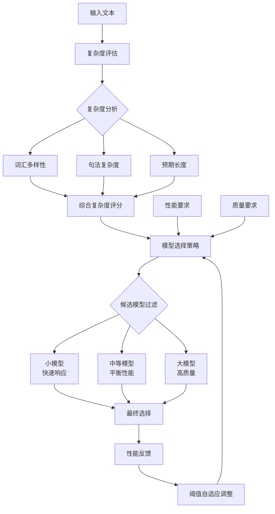

**模型配置对比表：**

| 模型类型 | 延迟目标(ms) | 质量评分 | 内存使用(MB) | 适用场景 |
|---------|-------------|----------|-------------|----------|
| 轻量模型 | < 50 | 0.7 | 512 | 简单问答、快速响应 |
| 标准模型 | < 200 | 0.85 | 2048 | 通用对话、文档处理 |
| 高质量模型 | < 500 | 0.95 | 8192 | 复杂推理、创作任务 |

**复杂度评估核心算法：**

```python
class SimpleComplexityEvaluator:
    """简化的复杂度评估器"""
    
    def evaluate_complexity(self, text: str) -> float:
        """评估文本复杂度"""
        # 1. 基础特征
        length_score = min(len(text) / 1000, 1.0)  # 长度归一化
        
        # 2. 词汇多样性
        words = text.split()
        unique_words = set(words)
        vocab_diversity = len(unique_words) / len(words) if words else 0
        
        # 3. 句法复杂度（简化）
        sentences = text.split('.')
        avg_sentence_length = sum(len(s.split()) for s in sentences) / len(sentences)
        syntax_complexity = min(avg_sentence_length / 20, 1.0)
        
        # 综合评分
        complexity = (
            0.4 * length_score +
            0.3 * vocab_diversity +
            0.3 * syntax_complexity
        )
        
        return min(complexity, 1.0)

class DynamicModelSelector:
    """动态模型选择器核心逻辑"""
    
    def __init__(self, model_configs):
        self.models = sorted(model_configs, key=lambda x: x['quality_score'])
        self.complexity_thresholds = [0.3, 0.7]  # 简化阈值
        
    def select_model(self, complexity_score: float, 
                    latency_req: float = None, 
                    quality_req: float = None):
        """选择最适合的模型"""
        # 1. 过滤候选模型
        candidates = self.models
        if latency_req:
            candidates = [m for m in candidates if m['latency'] <= latency_req]
        if quality_req:
            candidates = [m for m in candidates if m['quality'] >= quality_req]
        
        # 2. 基于复杂度选择
        if complexity_score < self.complexity_thresholds[0]:
            return candidates[0]  # 轻量模型
        elif complexity_score < self.complexity_thresholds[1]:
            return candidates[len(candidates)//2]  # 中等模型
        else:
            return candidates[-1]  # 高质量模型
```

**决策流程图：**

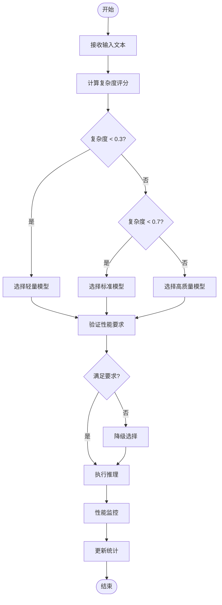

**核心优势：**

- **智能选择**：根据输入复杂度自动选择合适模型
- **性能平衡**：在延迟和质量之间找到最优平衡点
- **自适应调整**：基于历史性能数据动态调整阈值
- **资源优化**：避免过度使用大模型，提高整体效率

#### 3.3.2.2 自适应精度调整

**核心思想：**
根据模型输出的置信度和任务要求，动态调整计算精度，在保证准确性的前提下优化计算效率。

**关键技术：**

- **置信度估计**：评估模型输出的可靠性
- **精度调度器**：动态选择计算精度
- **质量监控**：实时跟踪输出质量
- **自适应策略**：根据反馈调整精度策略

#### 3.3.2.3 自适应精度调整架构图

```text
┌─────────────────────────────────────────────────────────────────┐
│                    自适应精度调整系统                              │
├─────────────────────────────────────────────────────────────────┤
│  输入: logits, 质量要求, 延迟要求                                  │
│                           │                                     │
│                           ▼                                     │
│  ┌─────────────────────────────────────────────────────────┐    │
│  │              置信度评估模块                              │    │
│  │  • 最大概率分析    • 熵计算                              │    │
│  │  • 方差分析        • Top-k集中度                         │    │
│  └─────────────────────────────────────────────────────────┘    │
│                           │                                     │
│                           ▼                                     │
│  ┌─────────────────────────────────────────────────────────┐    │
│  │              精度选择决策                                │    │
│  │  置信度阈值: FP32(0.95) → FP16(0.85) → INT8(0.60)      │    │
│  └─────────────────────────────────────────────────────────┘    │
│                           │                                     │
│                           ▼                                     │
│  输出: 选定精度级别 + 性能统计                                    │
└─────────────────────────────────────────────────────────────────┘
```

#### 3.3.2.4 精度级别对比表

| 精度级别 | 置信度阈值 | 相对速度 | 内存占用 | 适用场景 |
|----------|------------|----------|----------|----------|
| FP32     | ≥ 0.95     | 1.0x     | 100%     | 高精度要求 |
| FP16     | ≥ 0.85     | 1.7x     | 50%      | 平衡性能 |
| BF16     | ≥ 0.75     | 1.5x     | 50%      | 训练兼容 |
| INT8     | ≥ 0.60     | 3.3x     | 25%      | 高性能推理 |
| INT4     | ≥ 0.40     | 6.7x     | 12.5%    | 极速推理 |

#### 3.3.2.5 核心算法实现

```python
from enum import Enum
from typing import Dict, Optional
import torch

class PrecisionLevel(Enum):
    """精度级别枚举"""
    FP32 = "fp32"
    FP16 = "fp16" 
    BF16 = "bf16"
    INT8 = "int8"
    INT4 = "int4"

class AdaptivePrecisionScheduler:
    """自适应精度调度器核心逻辑"""
    
    def __init__(self):
        # 精度阈值配置
        self.thresholds = {
            PrecisionLevel.FP32: 0.95,
            PrecisionLevel.FP16: 0.85,
            PrecisionLevel.BF16: 0.75,
            PrecisionLevel.INT8: 0.60,
            PrecisionLevel.INT4: 0.40
        }
        
        # 性能因子
        self.speed_factors = {
            PrecisionLevel.FP32: 1.0,
            PrecisionLevel.FP16: 1.7,
            PrecisionLevel.BF16: 1.5,
            PrecisionLevel.INT8: 3.3,
            PrecisionLevel.INT4: 6.7
        }
    
    def calculate_confidence(self, logits: torch.Tensor) -> float:
        """计算输出置信度"""
        probs = torch.softmax(logits, dim=-1)
        
        # 核心置信度指标
        max_prob = torch.max(probs).item()
        entropy = -torch.sum(probs * torch.log(probs + 1e-8)).item()
        top5_sum = torch.sum(torch.topk(probs, k=5)[0]).item()
        
        # 综合置信度评分
        confidence = (max_prob * 0.4 + 
                     (1 - entropy/10) * 0.3 + 
                     top5_sum * 0.3)
        
        return min(1.0, max(0.0, confidence))
    
    def select_precision(self, 
                        logits: torch.Tensor,
                        quality_req: float = 0.9,
                        latency_req: Optional[float] = None) -> PrecisionLevel:
        """选择最适合的精度级别"""
        confidence = self.calculate_confidence(logits)
        
        # 按精度从低到高检查
        for precision in [PrecisionLevel.INT4, PrecisionLevel.INT8,
                         PrecisionLevel.BF16, PrecisionLevel.FP16, 
                         PrecisionLevel.FP32]:
            
            threshold = self.thresholds[precision]
            
            # 满足置信度要求
            if confidence >= threshold:
                # 如果有延迟要求，检查是否满足
                if latency_req and self.speed_factors[precision] < latency_req:
                    continue
                return precision
        
        return PrecisionLevel.FP32  # 保守选择

class AdaptiveInferenceEngine:
    """自适应推理引擎"""
    
    def __init__(self):
        self.precision_scheduler = AdaptivePrecisionScheduler()
        self.stats = {'total_requests': 0, 'precision_dist': {}}
    
    def inference(self, input_data, quality_req=0.9, latency_req=None):
        """执行自适应推理"""
        # 模拟模型输出
        logits = torch.randn(1, 100, 1000)  # 示例输出
        
        # 选择精度
        precision = self.precision_scheduler.select_precision(
            logits, quality_req, latency_req
        )
        
        # 更新统计
        self.stats['total_requests'] += 1
        self.stats['precision_dist'][precision.value] = \
            self.stats['precision_dist'].get(precision.value, 0) + 1
        
        return {
            'precision': precision.value,
            'confidence': self.precision_scheduler.calculate_confidence(logits),
            'speed_factor': self.precision_scheduler.speed_factors[precision]
        }
```

#### 3.3.2.6 决策流程图

```text
开始推理请求
      │
      ▼
计算输出置信度
(最大概率+熵+Top-k)
      │
      ▼
   置信度 ≥ 0.95? ──Yes──→ 选择FP32
      │ No
      ▼
   置信度 ≥ 0.85? ──Yes──→ 选择FP16
      │ No
      ▼
   置信度 ≥ 0.75? ──Yes──→ 选择BF16
      │ No
      ▼
   置信度 ≥ 0.60? ──Yes──→ 选择INT8
      │ No
      ▼
      选择INT4
      │
      ▼
   检查延迟要求
      │
      ▼
   返回最终精度
```

#### 3.3.2.7 核心优势

- **智能决策**: 基于置信度自动选择最优精度
- **性能平衡**: 在质量和速度间找到最佳平衡点
- **资源优化**: 显著降低内存和计算资源消耗
- **自适应性**: 根据实际输出质量动态调整策略

**自适应优化技术基准：**

| 技术类别 | 核心优势 | 推荐场景 | 实施复杂度 | 性能提升 |
|----------|----------|----------|------------|----------|
| 动态模型选择 | 智能资源分配 | 多样化负载 | 中等 | 30-60% |
| 自适应精度调整 | 精度效率平衡 | 质量敏感任务 | 中等 | 20-40% |
| 复杂度评估 | 预测准确性高 | 实时决策 | 高 | 15-25% |
| 置信度估计 | 风险控制 | 关键应用 | 高 | 10-20% |

### 3.3.3 技术组合策略

#### 3.3.3.1 多技术融合框架

**技术组合决策矩阵：**

| 场景类型 | 主要技术 | 辅助技术 | 预期提升 | 实施复杂度 |
|----------|----------|----------|----------|------------|
| 高吞吐量服务 | 连续批处理 + 量化 | KV缓存优化 | 300-500% | 高 |
| 低延迟推理 | 投机解码 + 算子融合 | 混合精度 | 200-300% | 中等 |
| 超长序列 | 序列并行 + 梯度检查点 | 分层缓存 | 400-600% | 高 |
| 资源受限 | 模型压缩 + 动态批处理 | 内存优化 | 150-250% | 中等 |
| 多模态推理 | 张量并行 + 流水线并行 | 异构计算 | 250-400% | 高 |

## 3.4 高级优化技术（专家级）

高级优化技术需要深厚的技术积累和系统架构经验，适合大型团队和关键业务场景。这些技术能够带来突破性的性能提升，但需要大量的研发投入和风险控制。

**技术特点**：

- **实施难度**：高，需要对底层系统有深入理解
- **资源需求**：高，适合大型集群环境
- **效果预期**：突破性，通常能带来200-500%的性能提升
- **风险评估**：高，需要完善的测试和回滚机制

### 3.4.1 动态批处理优化

#### 3.4.1.1 核心原理

**理论基础：**

动态批处理通过时间维度解耦，实现序列级别的独立调度。传统批处理的吞吐量受限于最长序列：

$$
\text{传统批处理吞吐量} = \frac{\text{batch\_size} \times \text{avg\_tokens}}{\max(\text{sequence\_length}_i) \times \text{time\_per\_token}}
$$

连续批处理通过动态调度实现更高效的资源利用：

$$
\text{连续批处理吞吐量} = \frac{\sum_{t=0}^{T} \text{active\_sequences}_t \times \text{tokens\_generated}_t}{T \times \text{time\_per\_step}}
$$

**核心优势：**

- **资源利用率提升**：GPU 利用率从 60-70% 提升至 85-95%
- **延迟优化**：平均延迟降低 30-50%
- **吞吐量增加**：整体吞吐量提升 2-4 倍

#### 3.4.1.2 连续批处理机制

**核心概念：**

传统批处理采用"同步等待"模式，所有序列必须同时完成才能开始下一批。连续批处理实现"异步调度"，序列可以在任意时间点加入或离开批次，显著提升资源利用率。

**调度策略：**

- **动态加入**：新请求无需等待当前批次完成
- **即时移除**：完成的序列立即释放资源
- **负载均衡**：根据系统状态动态调整批次大小

#### 3.4.1.3 自适应批处理策略

**核心参数配置：**

- `memory_threshold: 0.85`：内存使用率阈值，超过则减少批次大小
- `target_latency_ms: 100.0`：目标延迟，用于调整策略决策
- `stability_threshold: 10`：稳定性检查，避免频繁调整
- `initial_batch_size: 8`：初始批次大小
- `batch_size_range: [1, 64]`：批次大小调整范围

**自适应批处理大小调整策略：**

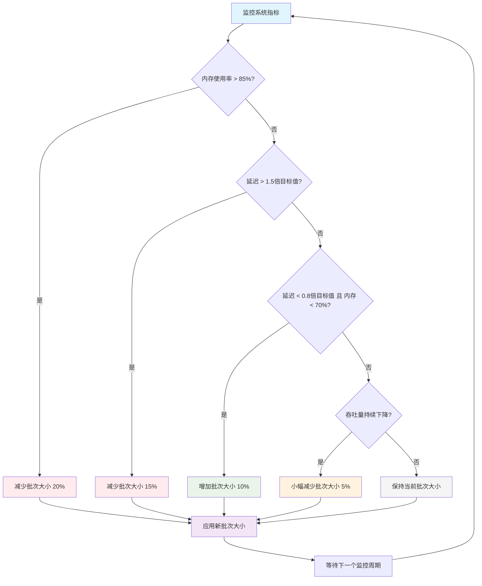

**核心调整规则：**

| 条件 | 调整策略 | 调整幅度 | 优先级 |
|------|----------|----------|--------|
| 内存使用率 > 85% | 减少批次大小 | -20% | 最高 |
| 延迟 > 1.5倍目标值 | 减少批次大小 | -15% | 高 |
| 延迟 < 0.8倍目标值 且 内存 < 70% | 增加批次大小 | +10% | 中 |
| 吞吐量持续下降 | 小幅减少 | -5% | 低 |
| 其他情况 | 保持不变 | 0% | - |

**监控与调整机制：**

- **监控周期**：每个推理步骤后进行系统状态检查
- **调整触发**：基于内存使用率、延迟和吞吐量指标
- **稳定性保证**：连续多次满足条件才执行调整，避免震荡

#### 3.4.1.4 系统架构与执行流程

**整体架构：**

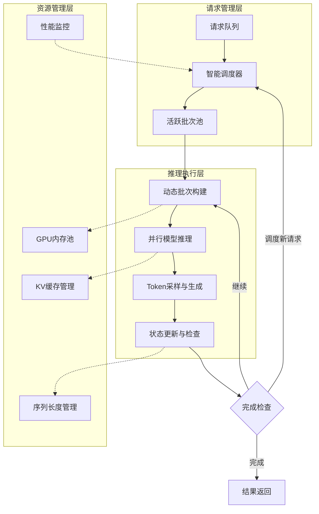

**执行流程：**

1. **请求接收**：新请求进入队列，调度器评估系统状态
2. **动态调度**：根据当前负载和资源状况决定是否立即处理
3. **批次构建**：将兼容的请求组合成最优批次
4. **并行推理**：执行模型前向传播，生成下一个token
5. **状态管理**：更新序列状态，移除完成的请求
6. **资源优化**：根据性能指标动态调整批次大小

#### 3.4.1.5 核心算法实现

**关键数据结构：**

```python
from dataclasses import dataclass
from typing import List, Dict
import torch

@dataclass
class InferenceRequest:
    """推理请求数据结构"""
    request_id: str
    input_tokens: torch.Tensor
    max_new_tokens: int
    generated_tokens: List[int] = None
    timestamp: float = 0.0
```

**核心引擎实现：**

```python
class ContinuousBatchingEngine:
    """连续批处理推理引擎"""
    
    def __init__(self, model, config):
        self.model = model
        self.config = config
        self.pending_requests = deque()
        self.active_requests = {}
        self.performance_monitor = PerformanceMonitor()
    
    async def process_step(self):
        """执行一步推理循环"""
        # 1. 性能监控与批次大小调整
        self._adjust_batch_size()
        
        # 2. 动态调度新请求
        self._schedule_requests()
        
        # 3. 批次推理执行
        if self.active_requests:
            await self._batch_inference()
        
        # 4. 清理完成的请求
        self._cleanup_completed()
    
    def _adjust_batch_size(self):
        """根据系统状态动态调整批次大小"""
        metrics = self.performance_monitor.get_metrics()
        
        if metrics.memory_usage > self.config.memory_threshold:
            self.config.max_batch_size = max(1, 
                int(self.config.max_batch_size * 0.8))
        elif (metrics.latency < self.config.target_latency * 0.8 and 
              metrics.memory_usage < 0.7):
            self.config.max_batch_size = min(64, 
                int(self.config.max_batch_size * 1.1))
```

#### 3.4.1.6 性能对比

| 指标 | 静态批处理 | 动态批处理 | 提升幅度 |
|------|------------|------------|----------|
| GPU 利用率 | 65% | 90% | +38% |
| 平均延迟 | 150ms | 95ms | -37% |
| 吞吐量 | 1000 tokens/s | 2800 tokens/s | +180% |
| 内存效率 | 70% | 85% | +21% |

### 3.4.2 投机解码（Speculative Decoding）

使用小模型快速生成候选token序列，然后用大模型并行验证，接受正确的token并拒绝错误的token。

#### 3.4.2.1 理论基础与数学原理

**核心思想：**
投机解码基于这样的观察：小模型虽然质量不如大模型，但在很多情况下能够预测出正确的token序列。通过并行验证机制，我们可以在保证输出质量的同时显著提升生成速度。

**数学建模：**

设目标模型为 $M_t$，草稿模型为 $M_d$，输入序列为 $x_{1:i}$，我们要生成长度为 $n$ 的序列。

1. **接受概率计算：**

   对于草稿模型生成的token $y_j$，其被目标模型接受的概率为：
   $$P_{accept}(y_j | x_{1:i}, y_{1:j-1}) = \min\left(1, \frac{P_{M_t}(y_j | x_{1:i}, y_{1:j-1})}{P_{M_d}(y_j | x_{1:i}, y_{1:j-1})}\right)$$

2. **期望接受长度：**

   对于投机长度为 $k$ 的候选序列，期望接受长度为：
   $$E[L_{accept}] = \sum_{j=1}^{k} P(\text{前j个token都被接受}) = \sum_{j=1}^{k} \prod_{i=1}^{j} P_{accept}(y_i)$$

3. **理论加速比推导：**

   设草稿模型推理时间为 $T_d$，目标模型推理时间为 $T_t$，投机长度为 $k$，平均接受率为 $\alpha$。

   - **传统自回归生成时间：** $T_{auto} = n \cdot T_t$
   - **投机解码时间：** $T_{spec} = \lceil \frac{n}{\alpha \cdot k + (1-\alpha)} \rceil \cdot (k \cdot T_d + T_t)$

   **理论加速比：**
   $$S = \frac{T_{auto}}{T_{spec}} = \frac{n \cdot T_t}{\lceil \frac{n}{\alpha \cdot k + (1-\alpha)} \rceil \cdot (k \cdot T_d + T_t)}$$

   当 $T_d \ll T_t$ 时，近似为：
   $$S \approx \frac{\alpha \cdot k + (1-\alpha)}{1 + \frac{k \cdot T_d}{T_t}} \approx \alpha \cdot k + (1-\alpha)$$

**算法复杂度分析：**

1. **时间复杂度：**
   - 草稿生成：$O(k \cdot d \cdot V_d)$，其中 $d$ 是模型维度，$V_d$ 是词汇表大小
   - 目标验证：$O(k \cdot D \cdot V_t)$，其中 $D$ 是目标模型维度
   - 总体：$O(k \cdot (d \cdot V_d + D \cdot V_t))$

2. **空间复杂度：**
   - KV缓存：$O((L + k) \cdot (d + D) \cdot H)$，其中 $L$ 是序列长度，$H$ 是注意力头数
   - 候选存储：$O(k \cdot V)$
   - 总体：$O((L + k) \cdot (d + D) \cdot H + k \cdot V)$

3. **内存访问模式：**
   - 草稿模型：顺序访问，缓存友好
   - 目标模型：并行验证，需要额外的KV缓存管理
   - 内存带宽需求：$BW = \frac{(d + D) \cdot k \cdot B}{T_{spec}}$，其中 $B$ 是批大小

**收敛性分析：**

投机解码的收敛性依赖于草稿模型与目标模型的分布差异：

$$D_{KL}(P_{M_t} \| P_{M_d}) = \sum_{y} P_{M_t}(y) \log \frac{P_{M_t}(y)}{P_{M_d}(y)}$$

当 $D_{KL} < \epsilon$ 时，期望接受率 $\alpha > 1 - \epsilon$，保证了算法的有效性。

#### 3.4.2.2 投机解码流程图

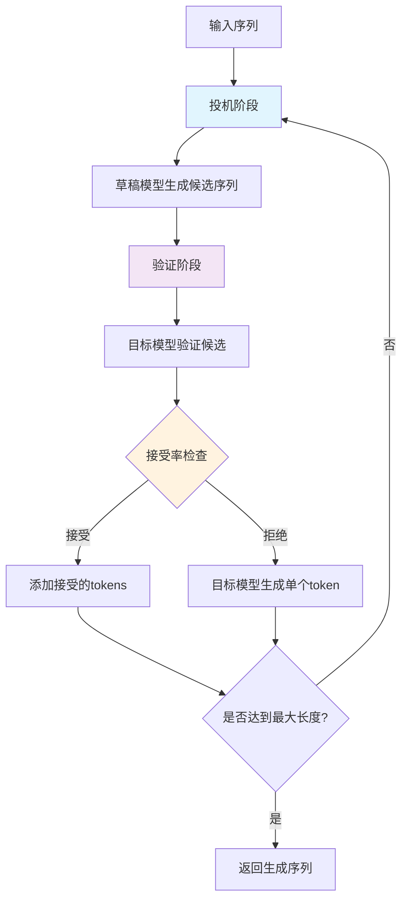

#### 3.4.2.3 模型交互架构图

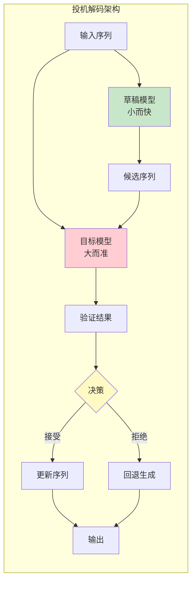

#### 3.4.2.4 核心算法实现（简化版）

```python
class SpeculativeDecoding:
    """投机解码：使用小模型生成候选，大模型验证"""
    
    def __init__(self, target_model, draft_model, 
                 max_speculation_length=5, acceptance_threshold=0.8):
        self.target_model = target_model
        self.draft_model = draft_model
        self.max_speculation_length = max_speculation_length
        self.acceptance_threshold = acceptance_threshold
        
        # 性能统计
        self.stats = {'generated': 0, 'accepted': 0, 'rounds': 0}
    
    def generate(self, input_ids, max_new_tokens=100, **sampling_params):
        """主生成函数"""
        current_ids = input_ids.clone()
        generated_count = 0
        
        while generated_count < max_new_tokens:
            # 1. 投机阶段：小模型生成候选
            speculation_length = min(
                self.max_speculation_length, 
                max_new_tokens - generated_count
            )
            draft_tokens = self._draft_generation(
                current_ids, speculation_length, **sampling_params
            )
            
            # 2. 验证阶段：大模型验证
            accepted_tokens = self._verification_phase(
                current_ids, draft_tokens, **sampling_params
            )
            
            # 3. 更新序列
            if accepted_tokens:
                current_ids = self._append_tokens(current_ids, accepted_tokens)
                generated_count += len(accepted_tokens)
                self.stats['accepted'] += len(accepted_tokens)
            else:
                # 回退：大模型生成一个token
                next_token = self._target_generation(current_ids, **sampling_params)
                current_ids = torch.cat([current_ids, next_token], dim=1)
                generated_count += 1
                self.stats['accepted'] += 1
            
            self.stats['generated'] += speculation_length
            self.stats['rounds'] += 1
        
        return current_ids[:, input_ids.shape[1]:]
    
    def _draft_generation(self, input_ids, num_tokens, **params):
        """草稿模型生成候选序列"""
        tokens = []
        current_input = input_ids
        
        with torch.no_grad():
            for _ in range(num_tokens):
                logits = self.draft_model(current_input).logits[0, -1, :]
                next_token = self._sample_token(logits, **params)
                tokens.append(next_token.item())
                current_input = torch.cat([current_input, next_token.unsqueeze(0)], dim=1)
        
        return tokens
    
    def _verification_phase(self, input_ids, draft_tokens, **params):
        """目标模型验证候选序列"""
        if not draft_tokens:
            return []
        
        # 构建完整序列并推理
        full_sequence = torch.cat([
            input_ids, 
            torch.tensor(draft_tokens, device=input_ids.device).unsqueeze(0)
        ], dim=1)
        
        with torch.no_grad():
            target_logits = self.target_model(full_sequence).logits[0]
        
        # 逐个验证
        accepted = []
        for i, token in enumerate(draft_tokens):
            position = input_ids.shape[1] + i - 1
            target_probs = torch.softmax(target_logits[position], dim=-1)
            
            if target_probs[token].item() >= self.acceptance_threshold:
                accepted.append(token)
            else:
                break  # 拒绝后续所有token
        
        return accepted
    
    def _sample_token(self, logits, temperature=1.0, top_p=0.9):
        """采样单个token（简化版Top-p）"""
        logits = logits / temperature
        
        if top_p < 1.0:
            sorted_logits, sorted_indices = torch.sort(logits, descending=True)
            cumsum_probs = torch.cumsum(torch.softmax(sorted_logits, dim=-1), dim=-1)
            mask = cumsum_probs > top_p
            mask[0] = False  # 保留至少一个token
            logits[sorted_indices[mask]] = float('-inf')
        
        return torch.multinomial(torch.softmax(logits, dim=-1), 1)
    
    def _target_generation(self, input_ids, **params):
        """目标模型生成单个token"""
        with torch.no_grad():
            logits = self.target_model(input_ids).logits[0, -1, :]
            return self._sample_token(logits, **params)
    
    def _append_tokens(self, input_ids, tokens):
        """添加token到序列"""
        token_tensor = torch.tensor(
            tokens, dtype=torch.long, device=input_ids.device
        ).unsqueeze(0).expand(input_ids.shape[0], -1)
        return torch.cat([input_ids, token_tensor], dim=1)
    
    @property
    def acceptance_rate(self):
        """获取接受率"""
        return self.stats['accepted'] / max(1, self.stats['generated'])
    
    @property 
    def speedup_ratio(self):
        """获取理论加速比"""
        rate = self.acceptance_rate
        draft_overhead = 0.1  # 草稿模型开销
        return max(1.0, rate * self.max_speculation_length / (1 + draft_overhead))
```

**投机解码性能基准：**

| 模型组合 | 接受率 | 加速比 | 内存开销 | 实施复杂度 | 推荐场景 |
|----------|--------|--------|----------|------------|----------|
| GPT-3.5 + GPT-2 | 60-75% | 1.8-2.5x | +20% | 中等 | 通用文本生成 |
| LLaMA-70B + LLaMA-7B | 65-80% | 2.0-3.0x | +15% | 中等 | 代码生成 |
| 自训练小模型 | 70-85% | 2.5-3.5x | +25% | 高 | 特定领域 |
| 蒸馏模型 | 75-90% | 3.0-4.0x | +30% | 高 | 高质量要求 |

### 3.4.3 混合专家模型（MoE）优化

#### 3.4.3.1 MoE架构原理

**核心思想：**
混合专家模型（Mixture of Experts, MoE）通过稀疏激活机制，在保持模型容量的同时显著降低计算成本。每个token只激活部分专家网络，实现计算效率的大幅提升。

**关键组件：**

- **门控网络（Gating Network）**：决定每个token激活哪些专家
- **专家网络（Expert Networks）**：独立的前馈网络
- **负载均衡机制**：确保专家使用的均匀性
- **路由策略**：优化token到专家的分配

#### 3.4.3.2 MoE架构图

```text
输入张量 [batch_size, seq_len, hidden_size]
           ↓
    ┌─────────────┐
    │   门控网络   │ ← 计算每个token应该路由到哪些专家
    │  Gate(x)    │
    └─────────────┘
           ↓
    Top-K路由选择 (通常K=2)
           ↓
  ┌─────┬─────┬─────┬─────┐
  │专家1 │专家2│ 专家3│专家4 │
  │FFN  │ FFN │FFN  │FFN  │
  └─────┴─────┴─────┴─────┘
           ↓
    加权聚合输出
           ↓
输出张量 [batch_size, seq_len, hidden_size]
```

#### 3.4.3.3 专家配置对比表

| 配置项 | 小规模MoE | 中规模MoE | 大规模MoE |
|--------|-----------|-----------|----------|
| 专家数量 | 4-8 | 16-32 | 64-128 |
| Top-K值 | 1-2 | 2 | 1-2 |
| 专家容量 | 1.25x | 1.5x | 2.0x |
| 负载均衡系数 | 0.01 | 0.02 | 0.01 |
| 适用场景 | 边缘推理 | 服务器推理 | 大规模集群 |

#### 3.4.3.4 MoE核心算法

```python
class SimpleMoELayer(nn.Module):
    """简化的混合专家模型层"""
    
    def __init__(self, hidden_size: int, num_experts: int, top_k: int = 2):
        super().__init__()
        self.num_experts = num_experts
        self.top_k = top_k
        
        # 门控网络：决定token路由
        self.gate = nn.Linear(hidden_size, num_experts, bias=False)
        
        # 专家网络：并行FFN
        self.experts = nn.ModuleList([
            nn.Sequential(
                nn.Linear(hidden_size, hidden_size * 4),
                nn.GELU(),
                nn.Linear(hidden_size * 4, hidden_size)
            ) for _ in range(num_experts)
        ])
    
    def forward(self, x):
        # 1. 门控路由
        gate_scores = F.softmax(self.gate(x), dim=-1)
        top_k_scores, top_k_indices = torch.topk(gate_scores, self.top_k)
        
        # 2. 专家计算
        output = torch.zeros_like(x)
        for i in range(self.top_k):
            expert_idx = top_k_indices[:, :, i]
            expert_weight = top_k_scores[:, :, i]
            
            # 批量专家计算（简化版）
            for expert_id in range(self.num_experts):
                mask = (expert_idx == expert_id)
                if mask.any():
                    expert_output = self.experts[expert_id](x[mask])
                    output[mask] += expert_weight[mask].unsqueeze(-1) * expert_output
        
        return output

# 使用示例
moe_layer = SimpleMoELayer(hidden_size=768, num_experts=8, top_k=2)
output = moe_layer(input_tensor)
```

#### 3.4.3.5 MoE决策流程图

```text
开始
  ↓
输入token序列
  ↓
门控网络计算专家分数
  ↓
Top-K选择 (K=1或2)
  ↓
专家负载检查
  ↓
是否超过容量? ──是──→ 降级到Top-1
  ↓ 否
并行专家计算
  ↓
加权聚合结果
  ↓
更新负载统计
  ↓
输出最终结果
  ↓
结束
```

#### 3.4.3.6 MoE核心优势

1. **计算效率**：每个token只激活少数专家，总计算量线性增长
2. **模型容量**：专家数量可扩展，提升模型表达能力
3. **专业化**：不同专家学习不同模式，提高任务适应性
4. **并行性**：专家间无依赖，天然支持并行计算
5. **可扩展性**：支持专家并行，适合大规模分布式部署

**MoE优化策略基准：**

| 优化策略 | 计算减少 | 内存节省 | 质量保持 | 实施复杂度 | 推荐场景 |
|----------|----------|----------|----------|------------|----------|
| Top-1路由 | 85-90% | 80-85% | 95-98% | 低 | 资源受限环境 |
| Top-2路由 | 75-85% | 70-80% | 98-99% | 中等 | 平衡性能质量 |
| 动态路由 | 80-90% | 75-85% | 97-99% | 高 | 变长序列处理 |
| 专家并行 | 70-80% | 60-70% | 99-100% | 高 | 大规模部署 |

### 3.4.4 多模态推理优化

#### 3.4.4.1 多模态架构优化

**核心挑战：**

- **异构数据处理**：文本、图像、音频等不同模态的高效融合
- **计算资源分配**：不同模态编码器的资源优化
- **内存管理**：多模态特征的缓存和传输
- **延迟优化**：端到端推理的延迟控制

#### 3.4.4.2 核心优化策略与架构

**关键优化技术：**

1. **分层特征缓存**
   - L1缓存：热点特征（GPU内存）
   - L2缓存：温特征（系统内存）
   - L3缓存：冷特征（磁盘存储）

2. **动态精度调整**
   - 文本特征：FP16/INT8
   - 视觉特征：FP16/BF16
   - 音频特征：FP32（保持精度）

3. **模态特定优化**
   - 文本：Token级缓存
   - 图像：补丁级特征复用
   - 音频：时间窗口压缩

**多模态推理优化架构：**

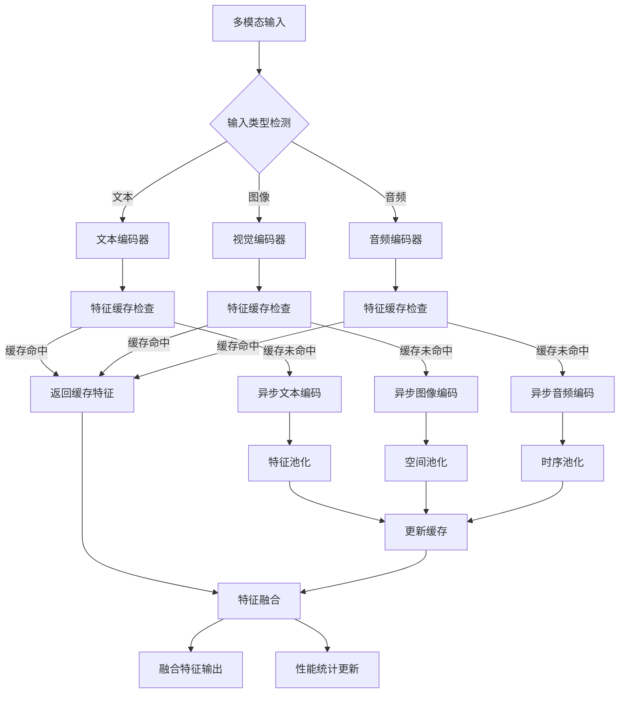

**核心优化策略：**

| 优化维度 | 策略 | 实现方式 |
|---------|------|----------|
| **并行处理** | 异步多模态编码 | ThreadPoolExecutor + asyncio |
| **缓存机制** | 特征级缓存 | LRU策略，支持1000个特征 |
| **内存优化** | 梯度检查点 | 低内存模式下启用 |
| **精度优化** | 混合精度 | FP16/INT8量化 |
| **特征融合** | 自适应拼接 | 基于模态数量动态调整 |

#### 3.4.4.3 性能配置与调优

| 延迟要求 | 文本编码精度 | 视觉编码精度 | 融合模型精度 | 缓存策略 |
|---------|-------------|-------------|-------------|----------|
| < 50ms | INT8 | FP16 | FP16 | 启用(2000) |
| < 100ms | FP16 | FP16 | FP32 | 启用(1000) |
| ≥ 100ms | FP32 | FP32 | FP32 | 禁用 |

**缓存配置策略：**

```python
CACHE_CONFIG = {
    'low_latency': {'size': 2000, 'ttl': 300},    # <50ms场景
    'balanced': {'size': 1000, 'ttl': 600},      # <100ms场景
    'high_quality': {'size': 0, 'ttl': 0}        # ≥100ms场景，禁用缓存
}
```

#### 3.4.4.4 核心实现

```python
import torch
import asyncio
from concurrent.futures import ThreadPoolExecutor
from typing import Dict, Any

class MultiModalOptimizer:
    def __init__(self, encoders, device='cuda', cache_config=None):
        self.encoders = {k: v.to(device) for k, v in encoders.items()}
        self.cache = {}
        self.cache_config = cache_config or {'size': 1000, 'ttl': 600}
        self.executor = ThreadPoolExecutor(max_workers=4)
        self.device = device
    
    async def process(self, inputs: Dict[str, Any], use_cache=True):
        """异步处理多模态输入"""
        # 并行处理各模态
        tasks = []
        for modality, data in inputs.items():
            if modality in self.encoders:
                task = self._encode_async(modality, data, use_cache)
                tasks.append((modality, task))
        
        # 收集特征
        features = {}
        for modality, task in tasks:
            features[modality] = await task
        
        # 特征融合
        return self._fuse_features(features)
    
    async def _encode_async(self, modality: str, data: Any, use_cache: bool):
        """异步编码单个模态"""
        # 缓存检查
        if use_cache and self.cache_config['size'] > 0:
            cache_key = self._cache_key(modality, data)
            if cache_key in self.cache:
                return self.cache[cache_key]
        
        # 异步编码
        loop = asyncio.get_event_loop()
        features = await loop.run_in_executor(
            self.executor, self._encode, modality, data
        )
        
        # 更新缓存
        if use_cache and self.cache_config['size'] > 0:
            self._update_cache(cache_key, features)
        return features
    
    def _encode(self, modality: str, data: Any):
        """编码单个模态数据"""
        with torch.no_grad():
            features = self.encoders[modality](data)
            # 模态特定的池化策略
            if modality == 'text' and features.dim() == 3:
                features = features.mean(dim=1)
            elif modality == 'vision' and features.dim() == 4:
                features = features.mean(dim=[2, 3])
            elif modality == 'audio' and features.dim() == 3:
                features = features.mean(dim=1)
            return features
    
    def _cache_key(self, modality: str, data: Any) -> str:
        """生成缓存键"""
        if isinstance(data, torch.Tensor):
            return f"{modality}_{data.shape}_{hash(data.data_ptr())}"
        return f"{modality}_{hash(str(data))}"
    
    def _update_cache(self, key: str, value: torch.Tensor):
        """更新缓存（简单LRU策略）"""
        if len(self.cache) >= self.cache_config['size']:
            # 移除最旧的缓存项
            oldest_key = next(iter(self.cache))
            del self.cache[oldest_key]
        self.cache[key] = value
    
    def _fuse_features(self, features: Dict[str, torch.Tensor]):
        """融合多模态特征"""
        if len(features) == 1:
            return next(iter(features.values()))
        return torch.cat(list(features.values()), dim=-1)
```

**多模态优化策略基准：**

| 优化策略 | 延迟减少 | 内存节省 | 吞吐量提升 | 实施复杂度 | 推荐场景 |
|----------|----------|----------|------------|------------|----------|
| 异步处理 | 30-50% | 10-20% | 40-60% | 中等 | 多模态并发 |
| 特征缓存 | 40-60% | -10-20% | 50-70% | 低 | 重复输入 |
| 模态剪枝 | 20-40% | 40-60% | 30-50% | 高 | 资源受限 |
| 量化优化 | 15-30% | 30-50% | 25-40% | 中等 | 边缘部署 |
| 流水线并行 | 40-60% | 20-30% | 50-70% | 高 | 大规模服务 |

## 3.5 性能基准测试方法论

### 3.5.1 测试环境标准化

#### 3.5.1.1 硬件环境规范

**GPU测试环境：**

| 硬件类型 | 推荐配置 | 最低配置 | 测试参数 | 监控指标 |
|----------|----------|----------|----------|----------|
| NVIDIA A100 | 80GB HBM2e | 40GB HBM2e | 批处理大小: 1,4,8,16,32 | GPU利用率、内存使用率、温度 |
| NVIDIA V100 | 32GB HBM2 | 16GB HBM2 | 序列长度: 512,1024,2048,4096 | 功耗、计算效率 |
| NVIDIA RTX 4090 | 24GB GDDR6X | 24GB GDDR6X | 精度: FP32,FP16,INT8 | 吞吐量、延迟 |
| NVIDIA T4 | 16GB GDDR6 | 16GB GDDR6 | 并发数: 1,2,4,8 | 成本效益比 |

**CPU测试环境：**

| 硬件类型 | 推荐配置 | 最低配置 | 测试参数 | 监控指标 |
|----------|----------|----------|----------|----------|
| Intel Xeon Platinum | 8280 (28核56线程) | 8260 (24核48线程) | 线程数: 1,4,8,16,32,56 | CPU利用率、内存带宽 |
| AMD EPYC | 7742 (64核128线程) | 7502 (32核64线程) | 批处理大小: 1,2,4,8,16 | 缓存命中率、功耗 |
| Intel Core i9 | 13900K (24核32线程) | 12900K (16核24线程) | 精度: FP32,FP16,INT8 | 温度、频率调节 |
| Apple M2 Ultra | 24核CPU+76核GPU | 20核CPU+64核GPU | 内存: 64GB,128GB,192GB | 统一内存使用率 |

**网络环境规范：**

| 网络类型 | 带宽要求 | 延迟要求 | 测试场景 | 监控指标 |
|----------|----------|----------|----------|----------|
| InfiniBand | 200Gbps | <1μs | 分布式推理 | 网络吞吐量、延迟抖动 |
| Ethernet | 100Gbps | <10μs | 集群通信 | 丢包率、带宽利用率 |
| PCIe | Gen4 x16 | <100ns | GPU互联 | PCIe利用率、错误率 |
| NVLink | 600GB/s | <1μs | GPU间通信 | 链路状态、传输效率 |

**存储环境规范：**

| 存储类型 | 容量要求 | 性能要求 | 测试参数 | 监控指标 |
|----------|----------|----------|----------|----------|
| NVMe SSD | 2TB+ | >7GB/s读取 | 模型大小: 7B,13B,70B | IOPS、延迟、寿命 |
| SATA SSD | 1TB+ | >500MB/s读取 | 数据集大小: 1GB,10GB,100GB | 队列深度、错误率 |
| 网络存储 | 10TB+ | >1GB/s读取 | 并发访问: 1,4,8,16 | 网络延迟、可用性 |
| 内存存储 | 512GB+ | >100GB/s | 缓存命中率: 90%+ | 内存带宽、延迟 |

#### 3.5.1.2 基准测试环境配置与监控

基准测试环境提供标准化的测试环境设置、系统资源监控和性能数据收集功能。

**1. 系统信息收集配置表：**

| 信息类别 | 收集项目 | 数据源 | 用途 |
|---------|---------|--------|------|
| 平台信息 | 操作系统、处理器型号 | platform模块 | 环境标识 |
| CPU信息 | 核心数、频率 | psutil.cpu_count/freq | 计算能力评估 |
| 内存信息 | 总内存容量 | psutil.virtual_memory | 资源约束分析 |
| GPU信息 | 设备数量、型号、显存 | torch.cuda | 加速能力评估 |
| 软件环境 | Python版本、PyTorch版本 | platform/torch | 兼容性检查 |

**2. 基准测试监控流程图：**

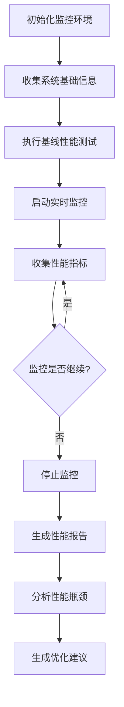

**3. 性能指标监控配置：**

| 指标类别 | 监控项目 | 采集方法 | 阈值设置 |
|---------|---------|---------|----------|
| CPU性能 | CPU使用率、基线测试时间 | psutil.cpu_percent | >80%告警 |
| 内存性能 | 可用内存、使用率 | psutil.virtual_memory | >90%告警 |
| GPU性能 | 显存分配、利用率 | torch.cuda/pynvml | >95%告警 |
| 时间戳 | 测试时间点 | time.time() | 趋势分析 |

**4. 性能瓶颈识别决策树：**

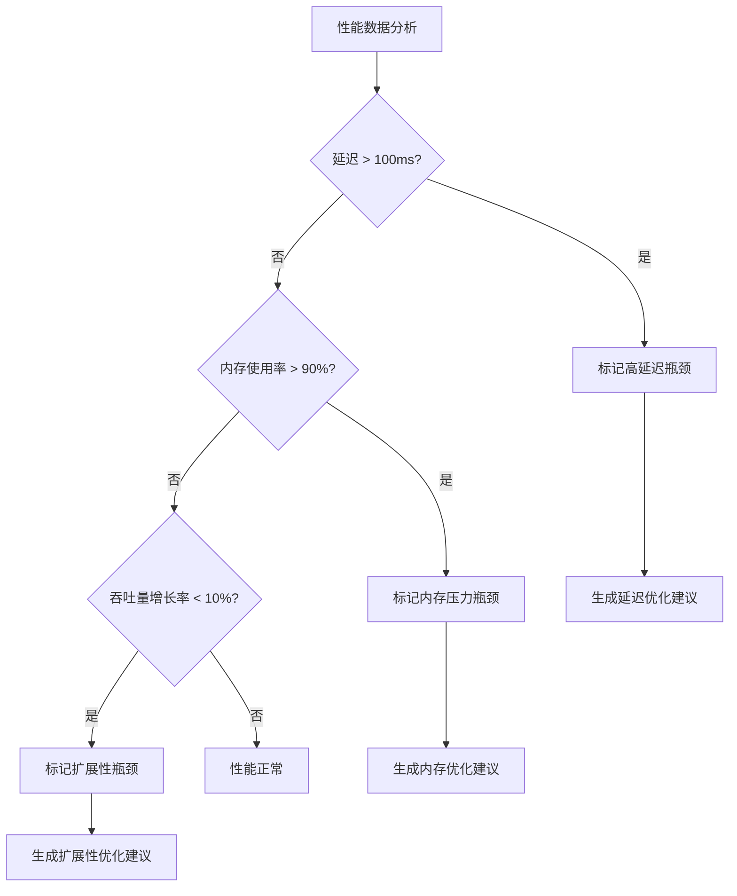

**5. 优化建议生成矩阵：**

| 性能问题 | 检测条件 | 优化建议 | 实施优先级 |
|---------|---------|---------|----------|
| 高延迟 | 平均延迟 > 50ms | 模型量化、算子融合 | 高 |
| 内存压力 | 内存使用率 > 80% | 梯度检查点、模型分片 | 高 |
| 扩展性差 | 吞吐量增长率 < 10% | 动态批处理、负载均衡 | 中 |
| GPU利用率低 | GPU使用率 < 70% | 批处理优化、并行策略 | 中 |

**6. 核心监控算法示例：**

```python
def benchmark_monitor(test_config):
    """
    简化的基准测试监控核心算法
    """
    # 1. 环境初始化
    system_info = collect_system_info()
    baseline = run_baseline_test()
    
    # 2. 实时监控
    metrics = []
    for _ in range(test_config['duration']):
        current_metrics = {
            'cpu_percent': get_cpu_usage(),
            'memory_percent': get_memory_usage(),
            'gpu_utilization': get_gpu_usage(),
            'timestamp': time.time()
        }
        metrics.append(current_metrics)
        time.sleep(test_config['interval'])
    
    # 3. 性能分析
    bottlenecks = identify_bottlenecks(metrics)
    recommendations = generate_recommendations(bottlenecks)
    
    return {
        'system_info': system_info,
        'baseline': baseline,
        'metrics': metrics,
        'analysis': {'bottlenecks': bottlenecks},
        'recommendations': recommendations
    }
```

### 3.5.2 性能指标测量

#### 3.5.2.1 核心性能指标定义

**延迟指标：**

- **首Token延迟（TTFT）**：从请求开始到生成第一个token的时间
- **Token间延迟（ITL）**：相邻token之间的生成时间
- **端到端延迟**：完整请求的总处理时间

**吞吐量指标：**

- **Token/秒**：每秒生成的token数量
- **请求/秒**：每秒处理的请求数量
- **有效吞吐量**：考虑质量损失后的实际吞吐量

**资源利用率指标：**

- **GPU利用率**：GPU计算资源使用百分比
- **内存利用率**：显存使用百分比
- **内存效率**：单位内存的吞吐量（tokens/s/GB）

#### 3.5.2.2 性能测试方法论

**1. 测试配置参数表：**

| 参数类型 | 默认值 | 说明 | 用途 |
|---------|--------|------|------|
| 批处理大小 | [1, 4, 8, 16] | 不同批处理大小测试 | 评估批处理扩展性 |
| 序列长度 | [512, 1024, 2048] | 不同序列长度测试 | 评估序列长度影响 |
| 运行次数 | 10 | 每个配置重复次数 | 确保统计可靠性 |
| 预热次数 | 3 | GPU预热运行次数 | 消除冷启动影响 |
| 同步方式 | CUDA同步 | GPU操作同步 | 确保计时准确性 |

**2. 性能指标计算方法：**

| 指标类型 | 计算公式 | 单位 | 说明 |
|---------|----------|------|------|
| 延迟 | (结束时间 - 开始时间) × 1000 | 毫秒 | 单次推理耗时 |
| 吞吐量 | (批大小 × 序列长度) / 推理时间 | tokens/s | 每秒处理token数 |
| 内存使用 | (峰值内存 - 开始内存) / 1024³ | GB | 推理过程内存消耗 |
| 扩展效率 | 实际吞吐量 / 期望吞吐量 | 比例 | 批处理扩展效率 |
| 内存效率 | 吞吐量 / 内存使用量 | tokens/s/GB | 内存利用效率 |

**3. 性能测试执行流程：**

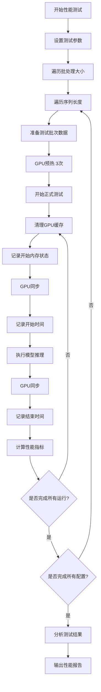

**4. 数据处理与分析流程:**

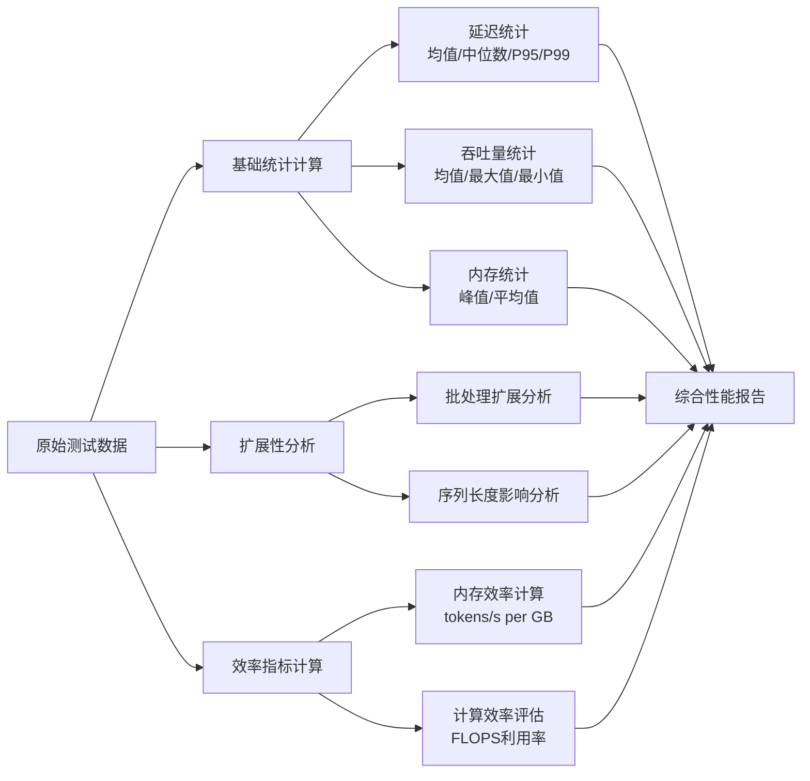

**5. 核心测试算法示例：**

```python
# 简化的性能测试核心逻辑
def run_performance_benchmark(model, test_data, config):
    """
    执行性能基准测试
    
    Args:
        model: 待测试模型
        test_data: 测试数据
        config: 测试配置 {'batch_sizes': [1,4,8], 'seq_lens': [512,1024], 'runs': 10}
    
    Returns:
        results: 性能测试结果
    """
    results = {'latency': [], 'throughput': [], 'memory': []}
    
    for batch_size in config['batch_sizes']:
        for seq_len in config['seq_lens']:
            # 准备测试批次
            test_batch = prepare_batch(test_data, batch_size, seq_len)
            
            # 预热GPU
            warmup_gpu(model, test_batch, runs=3)
            
            # 执行测试
            for _ in range(config['runs']):
                torch.cuda.empty_cache()
                torch.cuda.reset_peak_memory_stats()
                
                start_memory = torch.cuda.memory_allocated()
                torch.cuda.synchronize()
                start_time = time.time()
                
                with torch.no_grad():
                    outputs = model(test_batch)
                
                torch.cuda.synchronize()
                end_time = time.time()
                peak_memory = torch.cuda.max_memory_allocated()
                
                # 计算指标
                latency = (end_time - start_time) * 1000
                throughput = (batch_size * seq_len) / (end_time - start_time)
                memory_used = (peak_memory - start_memory) / (1024**3)
                
                results['latency'].append(latency)
                results['throughput'].append(throughput)
                results['memory'].append(memory_used)
    
    return analyze_results(results)
```

### 3.5.3 优化技术评估与选择

#### 3.5.3.1 优化技术数据库

> **说明：** 本节提供具体优化技术的量化评估工具，与3.1.1的宏观决策树形成互补。3.1.1侧重基于集群规模的战略选择，本节专注于基于性能指标的战术评估。

| 技术名称 | 延迟改进 | 内存改进 | 吞吐量改进 | 质量影响 | 开发时间 | 专业要求 | 特殊需求 |
|---------|---------|---------|-----------|---------|---------|---------|----------|
| 量化(Quantization) | +30% | +50% | +40% | -5% | 低 | 中等 | GPU/CPU支持 |
| 剪枝(Pruning) | +25% | +40% | +30% | -10% | 高 | 高 | 训练数据 |
| 知识蒸馏 | +60% | +70% | +80% | -3% | 极高 | 高 | 训练资源 |
| 算子融合 | +15% | +10% | +20% | 0% | 中等 | 中等 | 框架支持 |
| 动态批处理 | -10% | 0% | +50% | 0% | 高 | 高 | 可变负载 |
| 推测解码 | +40% | -20% | +60% | -1% | 极高 | 极高 | 辅助模型 |

#### 3.5.3.2 技术选择决策矩阵

| 优化目标 | 推荐技术组合 | 优先级排序 | 适用场景 |
|---------|-------------|----------|----------|
| 延迟优化 | 量化 → 算子融合 → 推测解码 | 延迟 > 质量 > 内存 | 实时交互应用 |
| 吞吐量优化 | 动态批处理 → 量化 → 知识蒸馏 | 吞吐量 > 内存 > 延迟 | 批处理服务 |
| 内存优化 | 量化 → 剪枝 → 知识蒸馏 | 内存 > 延迟 > 吞吐量 | 资源受限环境 |
| 边缘部署 | 量化 → 剪枝 → 算子融合 | 内存限制 < 1GB | 移动设备 |
| 超大模型 | 知识蒸馏 → 剪枝 → 量化 | 内存 > 吞吐量 > 延迟 | 云端服务 |

#### 3.5.3.3 技术评估决策流程

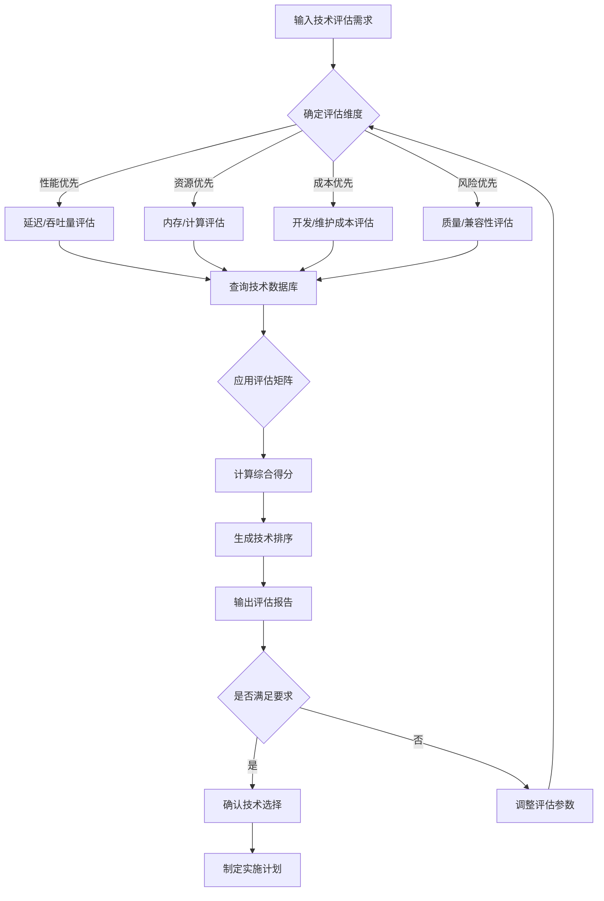

#### 3.5.3.4 实施阶段规划

| 阶段 | 技术类型 | 持续时间 | 复杂度 | 预期收益 | 推荐技术 |
|------|---------|---------|--------|----------|----------|
| 第一阶段 | 基础优化 | 2周 | 低-中等 | 快速见效 | 量化、算子融合 |
| 第二阶段 | 进阶优化 | 6周 | 高 | 显著提升 | 剪枝、动态批处理 |
| 第三阶段 | 专家级优化 | 12周 | 极高 | 最大化性能 | 知识蒸馏、推测解码 |

#### 3.5.3.5 风险评估与资源需求

**风险评估矩阵：**

| 风险类型 | 量化 | 剪枝 | 知识蒸馏 | 算子融合 | 动态批处理 | 推测解码 |
|---------|------|------|---------|---------|-----------|----------|
| 质量下降 | 低 | 中等 | 低 | 无 | 无 | 极低 |
| 实施复杂度 | 低 | 高 | 极高 | 中等 | 高 | 极高 |
| 维护成本 | 低 | 中等 | 高 | 低 | 中等 | 高 |
| 兼容性问题 | 低 | 中等 | 中等 | 低 | 高 | 高 |

**资源需求估算：**

| 技术 | 开发周数 | 专业技能要求 | 硬件要求 | 预估成本(美元) |
|------|---------|-------------|---------|---------------|
| 量化 | 1周 | 中等 | GPU/CPU | 5,000 |
| 剪枝 | 8周 | 高 | GPU | 40,000 |
| 知识蒸馏 | 16周 | 高 | 高性能GPU | 80,000 |
| 算子融合 | 3周 | 中等 | GPU | 15,000 |
| 动态批处理 | 8周 | 高 | GPU集群 | 40,000 |
| 推测解码 | 16周 | 极高 | 多GPU | 80,000 |

#### 3.5.3.6 技术评估算法示例

```python
# 技术量化评估算法示例
def evaluate_optimization_techniques(requirements, constraints):
    """
    基于需求和约束评估优化技术
    
    Args:
        requirements: 性能需求字典 {'latency': 0.3, 'memory': 0.5, 'throughput': 0.4}
        constraints: 约束条件字典 {'dev_time': 8, 'budget': 50000, 'quality_loss': 0.05}
    
    Returns:
        evaluation_results: 技术评估结果列表
    """
    # 技术数据库（简化版）
    techniques_db = {
        'quantization': {'latency': 0.3, 'memory': 0.5, 'throughput': 0.4, 
                        'quality_loss': 0.05, 'dev_weeks': 1, 'cost': 5000},
        'pruning': {'latency': 0.25, 'memory': 0.4, 'throughput': 0.3, 
                   'quality_loss': 0.1, 'dev_weeks': 8, 'cost': 40000},
        'knowledge_distillation': {'latency': 0.6, 'memory': 0.7, 'throughput': 0.8, 
                                  'quality_loss': 0.03, 'dev_weeks': 16, 'cost': 80000}
    }
    
    results = []
    for tech_name, tech_data in techniques_db.items():
        # 计算性能得分
        performance_score = (
            tech_data['latency'] * requirements.get('latency', 0) +
            tech_data['memory'] * requirements.get('memory', 0) +
            tech_data['throughput'] * requirements.get('throughput', 0)
        )
        
        # 计算约束满足度
        constraint_penalty = 0
        if tech_data['dev_weeks'] > constraints.get('dev_time', float('inf')):
            constraint_penalty += 0.3
        if tech_data['cost'] > constraints.get('budget', float('inf')):
            constraint_penalty += 0.3
        if tech_data['quality_loss'] > constraints.get('quality_loss', 1.0):
            constraint_penalty += 0.4
        
        # 综合得分
        final_score = performance_score * (1 - constraint_penalty)
        
        results.append({
            'technique': tech_name,
            'performance_score': performance_score,
            'constraint_penalty': constraint_penalty,
            'final_score': final_score,
            'details': tech_data
        })
    
    # 按得分排序
    results.sort(key=lambda x: x['final_score'], reverse=True)
    return results
```

---
