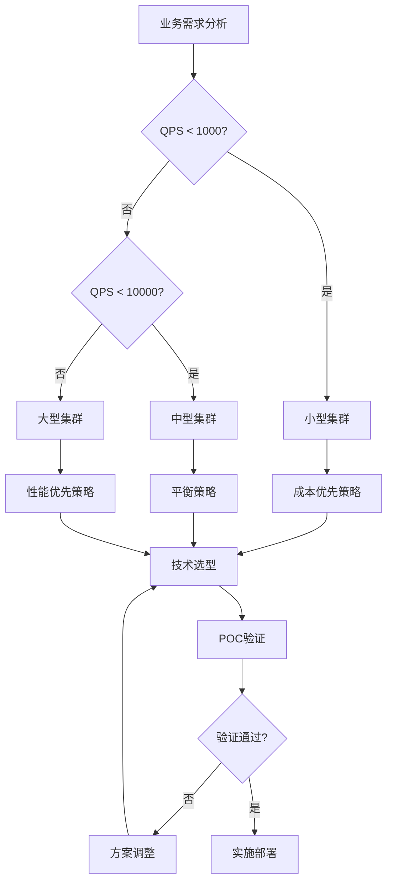
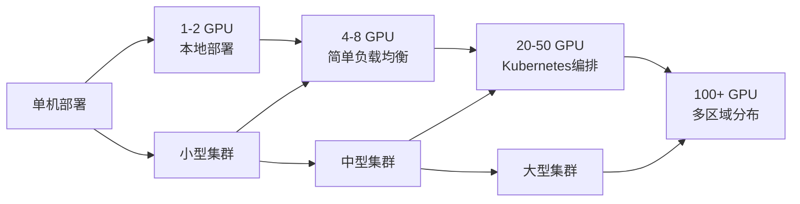

# 四、不同集群规模的技术选型策略

本章介绍了不同集群规模的技术选型策略，基于统一的集群分类标准：小型集群（1-8个GPU节点）、中型集群（8-50个GPU节点）、大型集群（50+个GPU节点）。

## 目录

- [四、不同集群规模的技术选型策略](#四不同集群规模的技术选型策略)
  - [目录](#目录)
  - [概述](#概述)
  - [4.1 小型集群（1-8个GPU节点）技术选型](#41-小型集群1-8个gpu节点技术选型)
    - [4.1.1 硬件配置建议](#411-硬件配置建议)
    - [4.1.2 技术栈选择](#412-技术栈选择)
      - [4.1.2.1 推理框架对比](#4121-推理框架对比)
      - [4.1.2.2 模型优化策略](#4122-模型优化策略)
      - [4.1.2.3 部署架构](#4123-部署架构)
      - [4.1.2.4 负载均衡](#4124-负载均衡)
    - [4.1.3 推理性能监控](#413-推理性能监控)
    - [4.1.4 成本优化策略](#414-成本优化策略)
    - [4.1.5 TCO分析（年度）](#415-tco分析年度)
    - [4.1.6 实施建议](#416-实施建议)
  - [4.2 中型集群（8-50个GPU节点）技术选型](#42-中型集群8-50个gpu节点技术选型)
    - [4.2.1 硬件配置建议](#421-硬件配置建议)
    - [4.2.2 技术栈选择](#422-技术栈选择)
      - [4.2.2.1 容器编排](#4221-容器编排)
      - [4.2.2.2 模型并行与优化策略](#4222-模型并行与优化策略)
      - [4.2.2.3 智能调度与资源管理](#4223-智能调度与资源管理)
      - [4.2.2.4 推理请求路由架构](#4224-推理请求路由架构)
    - [4.2.3 监控和运维](#423-监控和运维)
      - [4.2.3.1 全栈监控体系](#4231-全栈监控体系)
      - [4.2.3.2 自动化运维策略](#4232-自动化运维策略)
      - [4.2.3.3 GitOps工作流](#4233-gitops工作流)
    - [4.2.4 成本控制策略](#424-成本控制策略)
    - [4.2.5 TCO分析（年度）](#425-tco分析年度)
      - [4.2.5.1 成本优化建议](#4251-成本优化建议)
  - [4.3 大型集群（50+个GPU节点）技术选型](#43-大型集群50个gpu节点技术选型)
    - [4.3.1 硬件配置建议](#431-硬件配置建议)
    - [4.3.2 技术栈选择](#432-技术栈选择)
      - [4.3.2.1 云原生架构](#4321-云原生架构)
      - [4.3.2.2 AI驱动的调度系统](#4322-ai驱动的调度系统)
      - [4.3.2.3 多层次缓存系统](#4323-多层次缓存系统)
      - [4.3.2.4 智能运维系统（AIOps）](#4324-智能运维系统aiops)
    - [4.3.3 高可用性设计](#433-高可用性设计)
      - [4.3.3.1 多区域部署策略](#4331-多区域部署策略)
      - [4.3.3.2 容错与恢复机制](#4332-容错与恢复机制)
      - [4.3.3.3 故障演练计划](#4333-故障演练计划)
    - [4.3.4 性能优化](#434-性能优化)
      - [4.3.4.1 全栈优化策略](#4341-全栈优化策略)
      - [4.3.4.2 智能性能调优](#4342-智能性能调优)
    - [4.3.5 成本管理](#435-成本管理)
      - [4.3.5.1 成本优化策略](#4351-成本优化策略)
      - [4.3.5.2 TCO分析（年度）](#4352-tco分析年度)
      - [4.3.5.3 成本控制机制](#4353-成本控制机制)
  - [4.4 技术选型决策框架](#44-技术选型决策框架)
    - [4.4.1 决策矩阵模型](#441-决策矩阵模型)
    - [4.4.2 决策流程图](#442-决策流程图)
    - [4.4.3 关键决策因子](#443-关键决策因子)
  - [4.5 性能基准与测试](#45-性能基准与测试)
    - [4.5.1 基准测试框架](#451-基准测试框架)
    - [4.5.2 性能基准数据](#452-性能基准数据)
    - [4.5.3 测试配置模板](#453-测试配置模板)
  - [4.6 迁移与升级策略](#46-迁移与升级策略)
    - [4.6.1 迁移路径规划](#461-迁移路径规划)
    - [4.6.2 迁移检查清单](#462-迁移检查清单)
    - [4.6.3 升级策略对比](#463-升级策略对比)
    - [4.6.4 迁移工具推荐](#464-迁移工具推荐)

## 概述

本文档详细分析了不同集群规模下的技术选型策略，从小型集群的成本效益优先，到中型集群的性能与成本平衡，再到大型集群的极致性能追求。每种规模都有其特定的硬件配置、技术栈选择、部署架构和优化策略。

## 4.1 小型集群（1-8个GPU节点）技术选型

**核心原则**：成本效益优先，简化部署和维护
**适用范围**：1-64卡总规模

### 4.1.1 硬件配置建议

| 组件 | 配置规格 | 性能指标 | 成本范围 |
|------|----------|----------|----------|
| **GPU** | RTX 4090 (24GB) / A6000 (48GB) | 83/48 TFLOPS FP16 | $1,600-$4,500/卡 |
| **CPU** | Intel Xeon Gold 6448Y / AMD EPYC 9374F | 32-32核，2.1-3.7GHz | $1,200-$2,000 |
| **内存** | 128GB-256GB DDR4-3200 | 带宽：51.2GB/s | $400-$800 |
| **存储** | 2TB NVMe SSD (主) + 8TB HDD (备) | 读写：7000/6000 MB/s | $200-$300 |
| **网络** | 10GbE以太网 | 延迟：<1ms | $500-$1,000 |

### 4.1.2 技术栈选择

#### 4.1.2.1 推理框架对比

| 框架 | 优势 | 适用场景 | 性能提升 | 部署难度 |
|------|------|----------|----------|----------|
| **vLLM** | 高吞吐量，PagedAttention | 批量推理，API服务 | 2-4x | 低 |
| **TensorRT-LLM** | 极致优化，低延迟 | 实时推理，边缘部署 | 3-5x | 中 |
| **Text Generation Inference** | 易用性好，功能丰富 | 快速原型，小规模部署 | 1.5-2x | 低 |
| **Transformers + DeepSpeed** | 通用性强，社区支持 | 研发测试，兼容性要求高 | 1-1.5x | 中 |

#### 4.1.2.2 模型优化策略

| 优化技术 | 显存节省 | 性能影响 | 实施复杂度 | 适用模型 |
|----------|----------|----------|------------|----------|
| **INT8量化** | 50% | <5%精度损失 | 低 | Llama, ChatGLM |
| **INT4量化** | 75% | 5-10%精度损失 | 中 | 大模型(70B+) |
| **结构化剪枝** | 30-40% | 2-5%性能损失 | 高 | Transformer架构 |
| **知识蒸馏** | 60-80% | 10-15%精度损失 | 高 | 任务特定模型 |
| **动态量化** | 40% | <3%精度损失 | 低 | 推理时优化 |

#### 4.1.2.3 部署架构

**部署架构**：采用Docker Compose进行容器化部署，配置推理节点使用vLLM镜像，支持2卡张量并行，设置模型名称为llama-13b-chat，最大序列长度4096。负载均衡器使用Nginx Alpine镜像，监听80端口，通过配置文件实现请求分发。

```yaml
version: '3.8'
services:
  inference-node-1:
    image: vllm/vllm-openai:latest
    environment:
      - MODEL_NAME=llama-13b-chat
      - TENSOR_PARALLEL_SIZE=2
      - MAX_SEQ_LEN=4096
    ports:
      - "8000:8000"
    deploy:
      resources:
        reservations:
          devices:
            - driver: nvidia
              count: 2
              capabilities: [gpu]

  load-balancer:
    image: nginx:alpine
    ports:
      - "80:80"
    volumes:
      - ./nginx.conf:/etc/nginx/nginx.conf
    depends_on:
      - inference-node-1
      - inference-node-2
      - inference-node-3
```

#### 4.1.2.4 负载均衡

**负载均衡配置**：使用Nginx实现最少连接数调度算法，配置三个推理节点（8000端口），权重均等。服务器监听80端口，代理转发请求到后端服务，并设置Host和真实IP头部信息。

```nginx
upstream inference_backend {
    least_conn;
    server inference-node-1:8000 weight=1;
    server inference-node-2:8000 weight=1;
    server inference-node-3:8000 weight=1;
}

server {
    listen 80;
    location / {
        proxy_pass http://inference_backend;
        proxy_set_header Host $host;
        proxy_set_header X-Real-IP $remote_addr;
    }
}
```

### 4.1.3 推理性能监控

| 监控维度 | 关键指标 | 优化目标 | 告警阈值 |
|----------|----------|----------|----------|
| **推理延迟** | 首Token延迟、平均延迟 | <100ms首Token, <50ms平均 | >200ms |
| **推理吞吐** | Token/s、请求/s | 最大化吞吐量 | 下降>20% |
| **GPU效率** | 计算利用率、显存利用率 | >80%计算, >70%显存 | <60% |
| **KV缓存** | 缓存命中率、缓存利用率 | >90%命中率 | <80% |

### 4.1.4 成本优化策略

| 策略 | 节省比例 | 实施难度 | 风险评估 |
|------|----------|----------|----------|
| **多模型复用** | 30-50% | 低 | 低 - 可能影响响应时间 |
| **动态调度** | 20-30% | 中 | 中 - 冷启动延迟 |
| **预留实例** | 40-60% | 低 | 低 - 需要长期承诺 |
| **Spot实例** | 60-80% | 高 | 高 - 可能被中断 |
| **智能缓存** | 15-25% | 中 | 低 - 缓存命中率依赖 |

### 4.1.5 TCO分析（年度）

- 硬件成本：$50,000-$80,000
- 电力成本：$8,000-$12,000
- 人力成本：$60,000-$100,000
- 总成本：$118,000-$192,000

### 4.1.6 实施建议

1. **起步阶段**：单节点多卡部署，验证模型效果
2. **扩展阶段**：增加节点，实现简单负载均衡
3. **优化阶段**：引入模型优化技术，提升性能

## 4.2 中型集群（8-50个GPU节点）技术选型

**适用范围**：64-400卡总规模

**核心原则**：性能与成本平衡，注重可扩展性和自动化

### 4.2.1 硬件配置建议

| 组件 | 配置规格 | 性能指标 | 成本范围 |
|------|----------|----------|----------|
| **GPU** | A100 (80GB) / H100 (80GB) | 312/989 TFLOPS FP16 | $10,000-$30,000/卡 |
| **CPU** | Intel Xeon Platinum 8592+ / AMD EPYC 9754 | 64-128核，1.9-3.9GHz | $4,000-$9,000 |
| **内存** | 512GB-1TB DDR4-3200/DDR5-4800 | 带宽：204.8/307.2GB/s | $2,000-$8,000 |
| **存储** | 分布式NVMe (Ceph/GlusterFS) | 聚合带宽：>50GB/s | $5,000-$15,000 |
| **网络** | 100GbE/200GbE InfiniBand | 延迟：<0.5μs | $10,000-$25,000 |

### 4.2.2 技术栈选择

#### 4.2.2.1 容器编排

**Kubernetes部署配置**：创建20副本的推理集群部署，采用滚动更新策略（最大增加5个、最大不可用2个）。Pod选择A100 GPU节点，每个容器分配4张GPU、200-400GB内存、32-64核CPU资源。使用vLLM v0.2.0镜像进行推理服务。

```yaml
apiVersion: apps/v1
kind: Deployment
metadata:
  name: llm-inference-cluster
spec:
  replicas: 20
  strategy:
    type: RollingUpdate
    rollingUpdate:
      maxSurge: 5
      maxUnavailable: 2
  selector:
    matchLabels:
      app: llm-inference
  template:
    metadata:
      labels:
        app: llm-inference
    spec:
      nodeSelector:
        gpu-type: "a100"
      containers:
      - name: inference
        image: vllm/vllm-openai:v0.2.0
        resources:
          requests:
            nvidia.com/gpu: 4
            memory: "200Gi"
            cpu: "32"
          limits:
            nvidia.com/gpu: 4
            memory: "400Gi"
            cpu: "64"
```

#### 4.2.2.2 模型并行与优化策略

| 模型规模 | 张量并行 | 流水线并行 | 批处理大小 | 预期吞吐量 |
|----------|----------|------------|------------|------------|
| **7B-13B** | 2 | 1 | 32-64 | 1000-2000 tokens/s |
| **30B-70B** | 4 | 2 | 16-32 | 500-1000 tokens/s |
| **100B+** | 8 | 4 | 8-16 | 200-500 tokens/s |

**关键优化技术**：

| 技术 | 性能提升 | 显存节省 | 实施复杂度 |
|------|----------|----------|------------|
| **推测解码** | 2-3x | 0% | 中 |
| **连续批处理** | 3-5x | 0% | 低 |
| **KV缓存优化** | 1.5-2x | 30-50% | 中 |
| **Flash Attention** | 2-4x | 20-30% | 低 |
| **混合精度推理** | 1.5-2x | 50% | 低 |

#### 4.2.2.3 智能调度与资源管理

**调度策略对比**：

| 调度算法 | 适用场景 | 延迟优化 | 吞吐量优化 | 资源利用率 |
|----------|----------|----------|------------|------------|
| **轮询调度** | 均匀负载 | 中 | 中 | 80-85% |
| **最少连接** | 不均匀负载 | 高 | 中 | 85-90% |
| **加权轮询** | 异构硬件 | 中 | 高 | 90-95% |
| **智能预测** | 复杂场景 | 高 | 高 | 95%+ |

**自动扩缩容配置**：

```yaml
apiVersion: autoscaling/v2
kind: HorizontalPodAutoscaler
metadata:
  name: llm-inference-hpa
spec:
  scaleTargetRef:
    apiVersion: apps/v1
    kind: Deployment
    name: llm-inference-cluster
  minReplicas: 5
  maxReplicas: 50
  metrics:
  - type: Resource
    resource:
      name: nvidia.com/gpu
      target:
        type: Utilization
        averageUtilization: 70
  - type: Pods
    pods:
      metric:
        name: requests_per_second
      target:
        type: AverageValue
        averageValue: "100"
```

#### 4.2.2.4 推理请求路由架构

```python
class IntelligentRouter:
    def __init__(self):
        self.model_instances = {
            "llama-7b": ["instance-1", "instance-2"],
            "llama-70b": ["instance-3", "instance-4"]
        }
        self.load_balancer = LoadBalancer()
    
    def route_request(self, request):
        model_type = request.model
        priority = request.priority
        estimated_tokens = self.estimate_tokens(request.prompt)
        
        # 选择最优实例
        instance = self.select_optimal_instance(
            model_type, priority, estimated_tokens
        )
        
        return self.load_balancer.forward(request, instance)
```

### 4.2.3 监控和运维

#### 4.2.3.1 全栈监控体系

| 监控层级 | 关键指标 | 监控工具 | 告警阈值 | 响应时间 |
|----------|----------|----------|----------|----------|
| **基础设施** | GPU利用率、显存使用率 | DCGM, Prometheus | >85% | <5分钟 |
| **应用层** | QPS、延迟、错误率 | 自定义metrics | 延迟>1s | <2分钟 |
| **业务层** | 成本效率、用户满意度 | 业务监控系统 | 成本超预算10% | <30分钟 |
| **安全层** | 访问异常、资源滥用 | 安全监控工具 | 异常访问 | <1分钟 |

**推理性能监控实现**：

```python
class InferencePerformanceMonitor:
    def __init__(self):
        self.metrics = {
            'latency': [],
            'throughput': [],
            'gpu_utilization': [],
            'kv_cache_hit_rate': []
        }
    
    def record_inference(self, start_time, end_time, tokens_generated):
        latency = end_time - start_time
        throughput = tokens_generated / latency
        
        self.metrics['latency'].append(latency)
        self.metrics['throughput'].append(throughput)
        
        # 记录GPU利用率
        gpu_util = self.get_gpu_utilization()
        self.metrics['gpu_utilization'].append(gpu_util)
        
        # 记录KV缓存命中率
        cache_hit_rate = self.get_kv_cache_hit_rate()
        self.metrics['kv_cache_hit_rate'].append(cache_hit_rate)
```

#### 4.2.3.2 自动化运维策略

| 运维任务 | 自动化程度 | 工具选择 | 实施难度 | 风险等级 |
|----------|------------|----------|----------|----------|
| **模型部署** | 95% | ArgoCD + Helm | 中 | 低 |
| **配置管理** | 90% | Helm + Kustomize | 低 | 低 |
| **故障恢复** | 80% | Kubernetes + 自定义控制器 | 高 | 中 |
| **性能调优** | 70% | 基于ML的参数优化 | 高 | 中 |
| **安全更新** | 85% | 自动化安全扫描 | 中 | 低 |

#### 4.2.3.3 GitOps工作流

```yaml
apiVersion: argoproj.io/v1alpha1
kind: Application
metadata:
  name: llm-inference-platform
spec:
  project: default
  source:
    repoURL: https://github.com/company/llm-infrastructure
    targetRevision: HEAD
    path: kubernetes/production
  destination:
    server: https://kubernetes.default.svc
    namespace: llm-production
  syncPolicy:
    automated:
      prune: true
      selfHeal: true
    syncOptions:
    - CreateNamespace=true
```

### 4.2.4 成本控制策略

| 策略 | 成本节省 | 实施复杂度 | 风险评估 | 适用场景 |
|------|----------|------------|----------|----------|
| **混合云部署** | 25-40% | 高 | 中 | 弹性需求 |
| **Spot实例** | 50-70% | 中 | 高 | 非关键任务 |
| **资源池化** | 30-50% | 中 | 低 | 多租户环境 |
| **智能调度** | 20-35% | 高 | 低 | 复杂工作负载 |
| **预留实例** | 40-60% | 低 | 低 | 稳定需求 |

### 4.2.5 TCO分析（年度）

- 硬件成本：$500,000-$1,200,000
- 云服务成本：$200,000-$500,000
- 电力与冷却：$80,000-$150,000
- 人力成本：$300,000-$600,000
- 软件许可：$50,000-$100,000
- **总成本**：$1,130,000-$2,550,000

#### 4.2.5.1 成本优化建议

- 使用混合云策略可节省25-30%成本
- 实施智能调度可提升资源利用率至90%+
- 采用分层存储可降低存储成本40%

## 4.3 大型集群（50+个GPU节点）技术选型

**适用范围**：400卡以上总规模

**核心原则**：极致性能、高可用性、智能化运维

### 4.3.1 硬件配置建议

| 组件 | 配置规格 | 性能指标 | 成本范围 |
|------|----------|----------|----------|
| **GPU** | H100 (80GB) / H200 (141GB) | 989/1979 TFLOPS FP16 | $25,000-$40,000/卡 |
| **CPU** | Intel Xeon Max 9480 / AMD EPYC 9965 | 56-192核，1.9-3.7GHz | $12,000-$18,000 |
| **内存** | 1TB-2TB DDR5-5600/HBM3 | 带宽：448/3000GB/s | $15,000-$50,000 |
| **存储** | 全闪存分布式存储 (Lustre/GPFS) | 聚合带宽：>200GB/s | $50,000-$200,000 |
| **网络** | 400GbE/800GbE InfiniBand | 延迟：<0.1μs | $100,000-$500,000 |

### 4.3.2 技术栈选择

#### 4.3.2.1 云原生架构

```yaml
apiVersion: argoproj.io/v1alpha1
kind: Application
metadata:
  name: enterprise-llm-platform
spec:
  project: enterprise
  source:
    repoURL: https://github.com/enterprise/llm-platform
    targetRevision: main
    path: manifests/production
  destination:
    server: https://prod-cluster.company.com
    namespace: llm-platform
  syncPolicy:
    automated:
      prune: true
      selfHeal: true
```

#### 4.3.2.2 AI驱动的调度系统

**智能调度技术对比**：

| 调度技术 | 性能提升 | 资源利用率 | 实施复杂度 | 适用规模 |
|----------|----------|------------|------------|----------|
| **传统调度** | 基线 | 70-80% | 低 | <100节点 |
| **机器学习预测** | 20-30% | 85-90% | 中 | 100-500节点 |
| **强化学习优化** | 40-60% | 90-95% | 高 | 500+节点 |
| **图神经网络** | 50-80% | 95%+ | 高 | 1000+节点 |

**调度系统架构**：

```yaml
ai_scheduler:
  algorithm: "reinforcement_learning"
  prediction_window: "5m"
  optimization_interval: "30s"
  features:
    - gpu_utilization
    - memory_usage
    - network_bandwidth
    - request_patterns
  models:
    predictor:
      type: "lstm_attention"
      input_size: 128
      hidden_size: 256
    optimizer:
      type: "ppo_agent"
      learning_rate: 0.0003
```

#### 4.3.2.3 多层次缓存系统

**缓存层级设计**：

| 缓存层级 | 容量 | 延迟 | 带宽 | 命中率目标 | 成本/GB |
|----------|------|------|------|------------|----------|
| **L1 - GPU HBM** | 80-141GB | <1ns | 3TB/s | 90%+ | $300-500 |
| **L2 - CPU内存** | 1-2TB | 100ns | 400GB/s | 85%+ | $5-10 |
| **L3 - NVMe SSD** | 10-50TB | 100μs | 50GB/s | 80%+ | $0.1-0.5 |
| **L4 - 网络缓存** | 100TB+ | 1ms | 10GB/s | 70%+ | $0.01-0.05 |

**缓存策略配置**：

```yaml
cache_config:
  l1_gpu:
    size: "80GB"
    policy: "lru_frequency"
    prefetch: true
    compression: false
  l2_cpu:
    size: "1TB"
    policy: "arc"
    prefetch: true
    compression: true
  l3_nvme:
    size: "10TB"
    policy: "lfu"
    prefetch: false
    compression: true
```

#### 4.3.2.4 智能运维系统（AIOps）

**AIOps能力矩阵**：

| 功能模块 | 自动化程度 | 准确率 | 响应时间 | 实施难度 |
|----------|------------|--------|----------|----------|
| **异常检测** | 95% | 90%+ | <30s | 中 |
| **根因分析** | 80% | 85%+ | <2min | 高 |
| **自动修复** | 70% | 95%+ | <5min | 高 |
| **容量规划** | 90% | 90%+ | 实时 | 中 |
| **性能优化** | 85% | 88%+ | <1min | 高 |

**AIOps配置示例**：

```yaml
aiops_config:
  anomaly_detection:
    algorithms: ["isolation_forest", "lstm_autoencoder"]
    sensitivity: 0.95
    window_size: "5m"
  root_cause_analysis:
    correlation_threshold: 0.8
    causal_inference: true
    knowledge_graph: true
  auto_remediation:
    confidence_threshold: 0.85
    rollback_enabled: true
    human_approval: false
```

### 4.3.3 高可用性设计

#### 4.3.3.1 多区域部署策略

| 部署模式 | 可用性 | RTO | RPO | 成本增加 | 复杂度 |
|----------|--------|-----|-----|----------|--------|
| **单区域多AZ** | 99.9% | 5min | 1min | +20% | 低 |
| **双区域主备** | 99.95% | 2min | 30s | +50% | 中 |
| **多区域主主** | 99.99% | 30s | 10s | +100% | 高 |
| **全球分布式** | 99.999% | 10s | 5s | +200% | 极高 |

**灾难恢复配置**：

```yaml
disaster_recovery:
  strategy: "multi_region_active_active"
  regions:
    primary:
      name: "us-west-1"
      capacity_percentage: 60
      availability_zones: 3
    secondary:
      name: "us-east-1"
      capacity_percentage: 40
      availability_zones: 3
  failover:
    automatic: true
    health_check_interval: "10s"
    failure_threshold: 3
    rto: "30s"
    rpo: "5s"
```

#### 4.3.3.2 容错与恢复机制

| 故障类型 | 检测时间 | 恢复时间 | 恢复策略 | 数据丢失 |
|----------|----------|----------|----------|----------|
| **节点故障** | <10s | <30s | 自动重调度 | 无 |
| **网络分区** | <30s | <60s | 流量重路由 | 无 |
| **存储故障** | <60s | <5min | 副本切换 | 无 |
| **区域故障** | <2min | <10min | 跨区域切换 | <5s |
| **全局故障** | <5min | <30min | 灾备中心启动 | <30s |

#### 4.3.3.3 故障演练计划

- **Chaos Engineering**：每周随机故障注入
- **区域切换演练**：每月一次
- **全链路压测**：每季度一次
- **灾难恢复演练**：每年两次

### 4.3.4 性能优化

#### 4.3.4.1 全栈优化策略

| 优化层级 | 优化技术 | 性能提升 | 实施成本 | 维护复杂度 |
|----------|----------|----------|----------|------------|
| **硬件层** | 定制GPU、高速互联 | 50-100% | 极高 | 低 |
| **系统层** | 内核调优、NUMA优化 | 20-40% | 中 | 中 |
| **网络层** | RDMA、GPUDirect | 30-60% | 高 | 中 |
| **应用层** | 算法优化、并行化 | 100-300% | 中 | 高 |
| **模型层** | 量化、剪枝、蒸馏 | 200-500% | 低 | 中 |

#### 4.3.4.2 智能性能调优

```yaml
performance_tuning:
  auto_optimization: true
  algorithms: ["bayesian_optimization", "genetic_algorithm"]
  parameters:
    - batch_size
    - learning_rate
    - memory_allocation
    - thread_count
  metrics:
    - throughput
    - latency
    - gpu_utilization
  optimization_interval: "5m"
  collection_interval: "1s"
```

### 4.3.5 成本管理

#### 4.3.5.1 成本优化策略

| 策略 | 成本节省 | 实施复杂度 | 风险等级 | ROI周期 |
|------|----------|------------|----------|----------|
| **智能调度优化** | 30-50% | 高 | 低 | 3-6个月 |
| **多云套利** | 20-40% | 高 | 中 | 6-12个月 |
| **预留实例组合** | 40-70% | 低 | 低 | 1-3个月 |
| **Spot实例策略** | 60-90% | 中 | 高 | 1个月 |
| **资源右配** | 25-45% | 中 | 低 | 2-4个月 |

#### 4.3.5.2 TCO分析（年度）

- **硬件投资**：$5,000,000-$15,000,000
- **云服务成本**：$2,000,000-$8,000,000
- **电力与冷却**：$800,000-$2,000,000
- **人力成本**：$1,500,000-$3,000,000
- **软件许可**：$500,000-$1,000,000
- **运维成本**：$300,000-$800,000
- **总成本**：$10,100,000-$29,800,000

#### 4.3.5.3 成本控制机制

```yaml
cost_control:
  budget:
    monthly_limit: "$2,500,000"
    alert_thresholds: [70, 85, 95]  # 百分比
  optimization:
    auto_scaling: true
    cost_aware_scheduling: true
    instance_recommendations: true
  reporting:
    granularity: "hourly"
    cost_allocation:
      by_team: true
      by_project: true
```

## 4.4 技术选型决策框架

### 4.4.1 决策矩阵模型

| 评估维度 | 权重 | 小型集群 | 中型集群 | 大型集群 | 评分标准 |
|----------|------|----------|----------|----------|----------|
| **性能要求** | 25% | 6/10 | 8/10 | 10/10 | 延迟<2s(6分), <1s(8分), <0.5s(10分) |
| **成本控制** | 20% | 9/10 | 7/10 | 5/10 | 预算<$200K(9分), <$2M(7分), >$10M(5分) |
| **可扩展性** | 20% | 5/10 | 8/10 | 10/10 | 支持10x扩展(5分), 50x(8分), 100x+(10分) |
| **技术复杂度** | 15% | 9/10 | 6/10 | 3/10 | 简单部署(9分), 中等(6分), 复杂(3分) |
| **运维成本** | 10% | 8/10 | 6/10 | 4/10 | 1人维护(8分), 3-5人(6分), 10+人(4分) |
| **可用性要求** | 10% | 6/10 | 8/10 | 10/10 | 99%(6分), 99.9%(8分), 99.99%(10分) |

### 4.4.2 决策流程图



### 4.4.3 关键决策因子

| 因子 | 小型集群阈值 | 中型集群阈值 | 大型集群阈值 |
|------|-------------|-------------|-------------|
| **并发用户数** | <1,000 | 1,000-50,000 | >50,000 |
| **日请求量** | <100万 | 100万-1亿 | >1亿 |
| **模型参数量** | <30B | 30B-100B | >100B |
| **延迟要求** | <2秒 | <1秒 | <500ms |
| **可用性要求** | 99% | 99.9% | 99.99% |
| **预算范围** | <$200K | $200K-$2M | >$2M |

## 4.5 性能基准与测试

### 4.5.1 基准测试框架

| 测试类型 | 测试工具 | 关键指标 | 测试场景 |
|----------|----------|----------|----------|
| **吞吐量测试** | Apache Bench, wrk | QPS, TPS | 持续负载 |
| **延迟测试** | 自定义工具 | P50, P95, P99延迟 | 不同负载下 |
| **并发测试** | JMeter, Locust | 并发用户数 | 峰值负载 |
| **稳定性测试** | 长时间运行 | 错误率, 内存泄漏 | 7x24小时 |
| **故障恢复测试** | Chaos Monkey | 恢复时间 | 故障注入 |

### 4.5.2 性能基准数据

**LLM推理引擎性能对比 (Llama 3 8B, A100 80GB)：**

| 推理引擎 | 吞吐量(tokens/s) | TTFT(ms) | Token生成速率 | 内存使用(GB) | 并发支持 |
|----------|------------------|----------|---------------|-------------|----------|
| **LMDeploy** | 2,847 | 45 | 最高 | 18.5 | 优秀 |
| **TensorRT-LLM** | 2,756 | 52 | 高 | 16.2 | 良好 |
| **vLLM** | 2,332 | 38 | 中等 | 20.1 | 优秀 |
| **MLC-LLM** | 1,985 | 41 | 中等 | 19.8 | 中等 |
| **Hugging Face TGI** | 1,756 | 48 | 中等 | 22.3 | 良好 |

**集群规模性能基准：**

| 集群规模 | 模型规模 | 吞吐量(tokens/s) | P95延迟(ms) | GPU利用率 | 成本效率 |
|----------|----------|------------------|-------------|-----------|----------|
| **小型** | 7B | 500-1,000 | 1,500-2,000 | 70-80% | $0.01/1K tokens |
| **小型** | 13B | 200-500 | 2,000-3,000 | 80-85% | $0.02/1K tokens |
| **中型** | 30B | 1,000-2,000 | 800-1,200 | 85-90% | $0.015/1K tokens |
| **中型** | 70B | 500-1,000 | 1,200-1,800 | 90-95% | $0.025/1K tokens |
| **大型** | 100B+ | 2,000-5,000 | 300-600 | 95%+ | $0.02/1K tokens |

### 4.5.3 测试配置模板

```yaml
performance_test:
  scenarios:
    - name: "baseline_load"
      duration: "10m"
      users: 100
      ramp_up: "2m"
      requests_per_second: 50
    - name: "peak_load"
      duration: "5m"
      users: 1000
      ramp_up: "1m"
      requests_per_second: 500
    - name: "stress_test"
      duration: "30m"
      users: 2000
      ramp_up: "5m"
      requests_per_second: 1000
  metrics:
    - response_time
    - throughput
    - error_rate
    - resource_utilization
```

## 4.6 迁移与升级策略

### 4.6.1 迁移路径规划



### 4.6.2 迁移检查清单

| 迁移阶段 | 关键任务 | 验证标准 | 回滚计划 |
|----------|----------|----------|----------|
| **准备阶段** | 环境搭建、数据备份 | 环境可用性测试 | 保留原环境 |
| **试点迁移** | 10%流量切换 | 性能指标正常 | 立即切回 |
| **灰度发布** | 50%流量切换 | 错误率<1% | 5分钟内切回 |
| **全量迁移** | 100%流量切换 | 所有指标正常 | 30分钟内切回 |
| **清理阶段** | 旧环境下线 | 新环境稳定运行7天 | 数据恢复计划 |

### 4.6.3 升级策略对比

| 升级策略 | 停机时间 | 风险等级 | 资源需求 | 适用场景 |
|----------|----------|----------|----------|----------|
| **蓝绿部署** | 0 | 低 | 2倍资源 | 生产环境 |
| **滚动更新** | 0 | 中 | 1.2倍资源 | 中等规模 |
| **金丝雀发布** | 0 | 低 | 1.1倍资源 | 风险敏感 |
| **停机维护** | 2-4小时 | 高 | 1倍资源 | 小规模测试 |

### 4.6.4 迁移工具推荐

```yaml
migration_tools:
  data_migration:
    - name: "Velero"
      purpose: "Kubernetes备份恢复"
      complexity: "中"
    - name: "Rclone"
      purpose: "云存储同步"
      complexity: "低"
  traffic_management:
    - name: "AI网关"
      purpose: "智能路由"
      complexity: "中"
    - name: "NGINX"
      purpose: "负载均衡"
      complexity: "低"
  monitoring:
    - name: "Prometheus"
      purpose: "指标监控"
      complexity: "中"
    - name: "Grafana"
      purpose: "可视化"
      complexity: "低"
```

---
