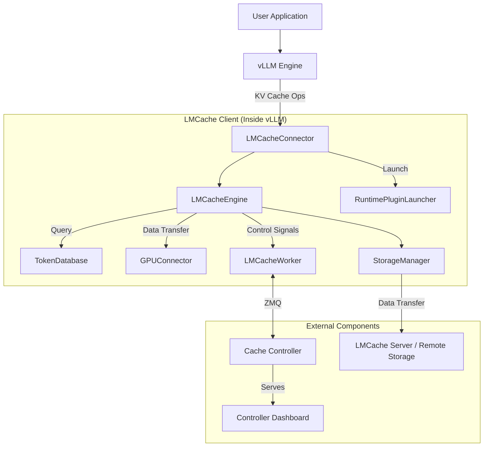

# LMCache 架构概览

**LMCache** 是一个专为大语言模型（LLM）服务引擎设计的 KV Cache 管理系统，旨在通过高效的缓存机制降低 **Time-To-First-Token** (TTFT) 并提高系统吞吐量，特别是在**长上下文 (Long-Context)** 场景下表现优异。

它通过将 KV Cache 存储在**多种介质**（GPU 显存、CPU 内存、本地磁盘、远程存储）中，实现了跨推理实例的 KV Cache 重用。LMCache 不仅支持前缀缓存 (Prefix Caching)，还支持任意文本片段的复用，从而显著节省 GPU 计算资源并降低用户响应延迟。在**多轮对话**和**检索增强生成**等场景中，LMCache 能够带来 `3-10` 倍的性能提升。

## 1. 概述

LMCache 通过扩展 LLM 推理引擎（如 vLLM），构建了一个跨越 GPU 显存、CPU 内存以及磁盘/远程后端的**多层级 KV Cache 存储系统 (Multi-Tier Storage Architecture)**。

### 1.1 多层级存储

LMCache 将存储介质划分为四个层级 (L1-L4)，实现了从本地内存到远程服务的全方位覆盖：

- **L1: 极速内存层 (Memory Tier)**:
  - **GPU Memory**: 保存当前正在使用的活跃 KV Cache 工作集。
  - **LocalCPUBackend**: 基于本地 CPU 内存，速度极快。兼任**内存分配器 (Allocator)**。
  - **PDBackend**: (可选) 专为 **Prefill-Decode 分离**场景设计的特殊后端。
- **L2: 弹性互联层 (P2P Tier)**:
  - **P2PBackend**: (可选) 基于点对点通信，优先从其他节点的内存中拉取数据，速度通常快于本地磁盘。
- **L3: 本地持久层 (Disk Tier)**:
  - **LocalDiskBackend**: (可选) 基于本地磁盘 (NVMe SSD)，利用 `O_DIRECT` 和异步 I/O 作为后备缓存。
- **L4: 远程共享层 (Remote/Shared Tier)**:
  - **RemoteBackend**: (可选) 基于中心化存储服务 (LMCache Server, Redis, Mooncake)，用于跨实例持久化共享。

### 1.2 核心能力范式

LMCache 支持三种核心能力范式，覆盖了从单机加速到大规模分布式集群的多样化需求：

1. **本地复用 (Local Reuse)**:

   - **核心价值**: **扩展显存，以空间换时间**。利用本地 CPU 内存和磁盘作为二级缓存，突破 GPU 显存容量限制。
   - **关键机制**: 异步卸载 (Offload) 与 预取 (Prefetch)。
   - **典型场景**: 单实例长文档推理、本地多轮对话历史复用。

2. **集群共享 (Cluster Sharing)**:

   - **核心价值**: **一次计算，全局可用**。在多个推理实例间共享 KV Cache，避免重复计算，提升集群整体吞吐量。
   - **关键机制**:
     - **集中式**: 基于共享存储 (Remote Backend) 的 Hub-and-Spoke 模式。
     - **去中心化**: 基于 P2P (P2P Backend) 的 Mesh 互联模式。
   - **典型场景**: 跨实例负载均衡、上下文迁移 (Context Migration)、多实例共享 System Prompt。

3. **流水线传输 (Pipeline Transmission)**:
   - **核心价值**: **计算解耦，极致延迟**。专为 Prefill-Decode 分离架构设计，实现 KV Cache 的定向、低延迟流转。
   - **关键机制**: Push-based 的内存直传 (PD Backend)。
   - **典型场景**: 高性能 PD 分离推理、异构集群部署。

---

## 2. 组件架构图

下图展示了 LMCache 的总体架构设计，描绘了嵌入在推理引擎内部的客户端组件 (Client) 如何与外部的控制平面 (Controller) 和数据平面 (Storage Server) 进行交互。

---

## 3. 主要组件说明

本节详细介绍了 LMCache 的核心架构组件，涵盖了运行于推理引擎进程内的拦截、存储与管理模块（如 LMCacheConnector, StorageManager），以及负责全局协调与服务的独立进程组件（如 Cache Controller, LMCache Server）。

### 3.1 推理引擎进程内组件

这些组件直接运行在推理引擎（如 vLLM）的进程空间内，与推理引擎共享内存和资源。

#### 3.1.1 LMCacheConnector

`LMCacheConnector` 是 LMCache 与推理引擎（如 vLLM）之间的桥梁。它作为 vLLM 的一个插件运行，拦截 KV Cache 的相关操作。

**角色**：连接器 / 适配器
**代码位置**：[`lmcache/integration/vllm/lmcache_connector_v1.py`](../lmcache/integration/vllm/lmcache_connector_v1.py)
**功能**：

- **拦截**：拦截 vLLM 的 KV Cache 生成和读取请求。
- **转换**：将 vLLM 的内部 KV Cache 格式（如 PagedMemory）转换为 LMCache 的通用格式。
- **转发**：将请求转发给核心的 `LMCacheEngine` 处理。

> 深入分析可参考：[LMCacheConnector 源码分析](./LMCacheConnector_Code_Analysis.md)

#### 3.1.2 LMCacheEngine

`LMCacheEngine` 是 LMCache 的中央控制器，负责协调生命周期管理、I/O 操作和缓存策略执行。

**角色**：核心引擎
**代码位置**：[`lmcache/v1/cache_engine.py`](../lmcache/v1/cache_engine.py)
**功能**：

- **生命周期管理**：管理 KV Cache 的存储、检索和预取。
- **GPU 交互**：通过 `GPUConnector` 高效地在 GPU 和 CPU 之间传输数据。
- **事件管理**：处理异步 I/O 事件。

> 深入分析可参考：[LMCacheEngine 源码分析](./LMCacheEngine_Code_Analysis.md)

#### 3.1.3 TokenDatabase

`TokenDatabase` 维护了 Token 序列与 KV Cache Key 之间的映射关系，是实现缓存查找的关键组件。

**角色**：元数据索引
**代码位置**：[`lmcache/v1/token_database.py`](../lmcache/v1/token_database.py)
**功能**：

- **索引**：根据输入的 Token 序列（Prompt）计算并查找对应的 Cache Key。
- **树状存储**：通常采用 Radix Tree 等数据结构高效存储 Token 前缀。

#### 3.1.4 GPUConnector

`GPUConnector` 负责处理不同推理引擎（如 vLLM）特有的显存格式（如 PagedAttention）与 LMCache 通用内存格式之间的转换与传输。

**角色**：显存适配器
**代码位置**：[`lmcache/v1/gpu_connector.py`](../lmcache/v1/gpu_connector.py)
**功能**：

- **格式转换**：将非连续的 Paged Memory 转换为连续的内存块（或反之）。
- **数据传输**：执行 GPU <-> CPU 之间的高效内存拷贝（D2H / H2D）。

#### 3.1.5 StorageManager

`StorageManager` 实现了分层存储架构，统一管理从内存到远程存储的多级后端，并执行数据读写策略。

**角色**：存储管理
**代码位置**：[`lmcache/v1/storage_backend/storage_manager.py`](../lmcache/v1/storage_backend/storage_manager.py)
**功能**：

- **分层管理**: 统一管理 L1 (Memory), L2 (P2P), L3 (Disk), L4 (Remote) 多级后端。
- **策略执行**: 实现了 **Write-All (全写模式)** 确保数据多级持久化，以及 **Waterfall (瀑布式检索)** 确保优先访问最快层级。同时支持 **LRU/LFU** 等缓存逐出策略。
- **内存分配**: 负责 CPU 内存缓冲区的分配和回收 (通过 Allocator Backend)。
- **后端抽象**: 通过统一的接口与不同的存储后端交互。

> 深入分析可参考：[LMCache 分层存储架构与调度机制详解](./Hierarchical_Storage.md)

#### 3.1.6 LMCacheWorker

`LMCacheWorker` 运行在推理引擎进程内部（作为 `LMCacheEngine` 的一部分），是 `Cache Controller` 在本地的代理。

**角色**：控制代理
**代码位置**：[`lmcache/v1/cache_controller/worker.py`](../lmcache/v1/cache_controller/worker.py)
**功能**：

- **通信**：通过 ZMQ 与远端的 `Cache Controller` 保持长连接。
- **执行**：接收并执行来自 Controller 的指令（例如，将某段 KV Cache 从本地发送到另一个实例）。
- **上报**：向 Controller 上报本地的缓存状态和心跳。

#### 3.1.7 RuntimePluginLauncher

`RuntimePluginLauncher` 负责在 LMCache 生命周期中加载和管理外部插件，允许用户通过自定义脚本扩展系统功能。

**角色**：插件启动器
**代码位置**：[`lmcache/v1/plugin/runtime_plugin_launcher.py`](../lmcache/v1/plugin/runtime_plugin_launcher.py)
**功能**：

- **插件加载**：根据配置扫描并启动指定目录下的 Python 或 Shell 插件脚本。
- **生命周期管理**：确保插件进程随主进程启动和退出。
- **环境注入**：向插件注入当前 Worker ID、Role 等上下文信息。

### 3.2 独立服务进程

这些组件作为独立的操作系统进程运行，通常部署在单独的容器或节点上，为多个推理实例提供服务。

#### 3.2.1 Cache Controller (lmcache_controller)

`Cache Controller` 是一个独立的进程，负责管理整个 LMCache 集群的元数据和控制流。

**角色**：控制平面（Control Plane）
**代码位置**：[`lmcache/v1/cache_controller/`](../lmcache/v1/cache_controller/)
**功能**：

- **全局视图**：维护集群中所有 KV Cache 的位置信息。
- **指令下发**：向各推理实例的 `LMCacheWorker` 发送指令（如 `lookup`, `pin`, `move`, `clear`）。
- **负载均衡**：在多实例部署中调度 KV Cache 的迁移和复用（目前主要提供 move/pin/clear 等底层接口，自动化调度策略需外部实现）。
- **接口暴露**：提供 RESTful API 或 gRPC 接口供外部系统调用。

#### 3.2.2 LMCache Server (lmcache_server)

`LMCache Server` 是 LMCache 自带的一种轻量级远程存储服务，用于跨机共享 KV Cache。它在架构上与 Mooncake Store、Redis 等第三方存储后端处于同一层级。

**角色**：数据平面（Data Plane） - 默认远程存储后端
**代码位置**：[`lmcache/v1/server/__main__.py`](../lmcache/v1/server/__main__.py)
**核心功能与架构**：

- **远程存储后端**：为 `StorageManager` 提供标准的远程存储接口，负责接收并存储来自推理实例的 KV Cache 数据，以及响应读取请求。
- **单点内存架构**：目前采用**单进程、全内存**的存储模型（未来计划支持磁盘持久化）。作为中心化节点，它**不支持**分布式特性（如自动分片 Sharding、多副本 Replication 或共识算法）。
- **高效通信协议**：基于 TCP 实现自定义二进制协议，针对 KV Cache 的传输特征进行了优化，提供比通用 HTTP/RPC 更低的延迟。

**适用场景与选型建议**：

- **推荐场景**：
  - **开发与验证**：无需部署复杂的外部存储组件，快速搭建环境。
  - **小规模部署**：节点数量较少，吞吐量和高可用要求不苛刻的场景。
  - **低运维成本**：开箱即用，无外部依赖。
- **生产环境对比**：对于追求**高可用 (HA)**、**大规模并发**或**数据持久化**的生产环境，建议使用 `Redis` (支持集群模式) 或 `Mooncake Store` (高性能分布式存储) 替代。

#### 3.2.3 Controller Dashboard

`Controller Dashboard` 是一个基于 Web 的可视化界面，用于监控 LMCache 集群的实时状态。

**角色**：可视化监控看板
**代码位置**：[`lmcache/v1/cache_controller/frontend/`](../lmcache/v1/cache_controller/frontend/)
**功能**：

- **集群监控**：展示所有连接的 LMCache 实例及其状态（CPU/GPU 缓存使用率）。
- **Worker 管理**：查看各 Worker 的详细信息和连接状态。
- **实时指标**：提供系统核心指标（如 QPS、命中率等）的图表展示。
- **访问方式**：通常通过 Controller 启动时的监控端口（如 9001）访问。

---

## 4. 共享模式

LMCache 支持三种主要的 KV Cache 共享模式，用户可以根据基础设施条件灵活选择。

### 4.1 集中式共享

在此模式下，所有推理实例都连接到一个统一的共享存储后端（Shared Storage Backend），形成 **Hub-and-Spoke**（星型）架构。

- **核心机制**：**数据中心化存储**。所有的 KV Cache 数据写入和读取都必须经过中心存储节点。
- **后端选项**：
  - `LMCache Server`：LMCache 自带的轻量级存储服务器，支持 TCP/RDMA。
  - `Redis`：通用的内存数据库，适合小规模或测试环境。
  - `Mooncake Store`：高性能分布式存储，支持大规模集群。
- **工作流程**：
  1. **写入**：实例 A 生成 KV Cache 后，将其推送到中心存储后端。
  2. **存储**：中心存储后端持久化或在内存中保存该数据。
  3. **读取**：实例 B 需要该数据时，从中心存储后端拉取。
- **优势**：
  - **架构简单**：易于部署和理解。
  - **数据持久化**：中心存储通常具备更好的持久化能力，实例宕机不影响数据可用性。
  - **解耦**：生成者和消费者不需要同时在线。
- **劣势**：中心存储节点容易成为**网络带宽瓶颈**，且存在单点故障风险。
- **适用场景**：
  - **多轮对话上下文共享**：用户在不同时间发起的请求被路由到不同实例。
  - **跨实例复用公共前缀**：如共享 System Prompt 或长文档背景。
  - **非实时共享**：对延迟要求不极端的场景。

### 4.2 点对点共享

在此模式下，推理实例之间直接进行 KV Cache 数据的传输，无需经过中心化的存储后端。

- **核心机制**：采用**控制面与数据面分离**的设计。
  - **控制面**：`Cache Controller` 仅负责维护全局元数据（即 KV Cache 的 Key 与存储位置的映射关系），充当“目录服务”，**不存储实际数据**。
  - **数据面**：实际的 KV Cache 数据由 `LMCacheWorker` 在推理实例之间通过网络直接传输。
- **关键组件**：
  - `P2PBackend`: 负责与 `Cache Controller` 交互并处理数据传输。
  - `Cache Controller`：负责元数据管理和节点发现。
  - `LMCacheWorker`：负责实例间的连接建立和数据传输。
- **工作流程 (Multi-Tier Lookup)**：
  1. **注册 (Register)**：实例 A 生成 KV Cache 后，通过 `P2PBackend` 异步向 `Cache Controller` 发送 `ADMIT` 消息，注册 KV Cache 的位置信息。
  2. **Tier 1: 本地查找 (Local Lookup)**: (开发中) 实例 B 尝试在本地维护的元数据缓存中查找，如果命中则直接发起连接。
  3. **Tier 2: 控制面查找 (Controller Lookup)**: 实例 B 向 `Cache Controller` 发送批量查找请求 (`BatchedP2PLookupMsg`)。Controller 返回持有数据的 Peer 节点地址 (如 Instance A)。
  4. **Tier 3: 确认与传输 (Transfer)**:
     - 实例 B 通过 **NIXL 传输通道** (支持 RDMA/TCP) 与实例 A 建立连接。
     - 在建立连接并请求数据时，隐式地确认数据是否存在。
     - 利用零拷贝技术，将数据从 Instance A 的内存直接传输到 Instance B。
- **注意 (P2P 局限性)**: 当前 P2P 实现仅支持共享**内存 (LocalCPUBackend)** 中的数据。若 Instance A 的数据已被逐出至磁盘，Instance B 无法通过 P2P 拉取 (将视为 Cache Miss)。
- **优势**：消除了中心化存储的带宽瓶颈，充分利用集群内部的高速网络（如 RDMA），适合大规模分布式推理场景。
- **注意**：此模式无需部署 `LMCache Server`，但必须部署 `Cache Controller`。
- **适用场景**：
  - **跨实例上下文迁移 (Context Migration)**：在负载均衡或故障恢复时，将活跃的 KV Cache 从一个实例“流转”到另一个实例。
  - **大规模集群内数据路由**：避免单一中心节点成为瓶颈。

### 4.3 预填充-解码分离 (PD 分离) 模式

在此模式下，系统被明确划分为 **Prefill (预填充)** 实例和 **Decode (解码)** 实例。KV Cache 从 Prefill 实例单向流转到 Decode 实例。

- **核心机制**: **Push-based 流水线**。Prefill 实例作为生产者，主动将生成的 KV Cache 推送给 Decode 实例（消费者）。
- **关键组件**:
  - `PDBackend`: 专用的后端，替代 `LocalCPUBackend` 作为内存分配器。它负责协调 KV Cache 的发送和接收。
  - `Global Proxy`: 全局代理，负责调度和协调 Prefill 和 Decode 实例。
- **工作流程**:
  1. **Prefill**: Prefill 实例计算完成后，`PDBackend` 并不将数据存入常规的 LRU 缓存，而是直接通过底层传输通道 (如 TCP/RDMA) 推送到指定的 Decode 实例。
  2. **Wait**: Decode 实例在需要特定 KV Cache 时，会进入阻塞等待状态，直到数据从 Prefill 实例到达。
  3. **Decode**: 数据到达后，Decode 实例直接使用该数据进行后续的 Token 生成。
- **区别于 P2P**:
  - **主动性**: PD 模式通常是 Push (推) 或特定的 Pipeline 调度，而 P2P 是 Pull (拉) 且基于查找。
  - **角色**: PD 模式中节点角色固定 (Prefill vs Decode)，P2P 模式中节点是对等的。
  - **延迟**: PD 模式针对首字延迟 (TTFT) 进行了极致优化，通常配合全局调度器使用。
- **适用场景**:
  - **高性能推理服务**: 追求极致的 TTFT 和吞吐量。
  - **异构集群**: Prefill 节点使用高算力 GPU (如 H100)，Decode 节点使用低显存带宽 GPU (如 A10/L40)。

---

## 5. 典型工作流

本节以数据的**写入 (Offload)** 和**读取 (Reuse)** 为主线，串联各组件，展示 KV Cache 在系统中的完整流转过程。

### 5.1 Offload (写入流程)

当推理实例（如 vLLM）完成 Prefill 阶段或进行 KV Cache 驱逐时，LMCache 执行以下流程将数据持久化并共享：

1. **捕获 (Capture)**

   - **核心逻辑**: `LMCacheConnector` 作为 vLLM 的插件，在 `wait_for_save` 阶段拦截 KV Cache 保存请求。
   - **代码位置**: [`lmcache/integration/vllm/vllm_v1_adapter.py`](../lmcache/integration/vllm/vllm_v1_adapter.py)
   - **细节**: 连接器根据已保存的 token 数量 (`skip_leading_tokens`) 计算本次增量保存的 Token 范围，生成 `store_mask`，并调用核心引擎接口 `store(...)`。

2. **传输 (Transfer)**

   - **核心逻辑**: `LMCacheEngine` 协调资源，将数据从 GPU 显存高效传输到 CPU 内存。
   - **代码位置**: [`lmcache/v1/cache_engine.py`](../lmcache/v1/cache_engine.py)
   - **细节**:
     - 首先调用 `TokenDatabase` 根据 Token 序列计算 Chunk Hash Key。
     - 调用 `StorageManager` 申请 CPU 内存 (`MemoryObj`)。
     - 利用 `GPUConnector` 执行 D2H (Device-to-Host) 拷贝。注意：此步骤通常会同步等待数据完全拷贝到 CPU 内存（除非使用特殊优化的异步流且目标也是 GPU），以确保后续存储操作能读取到有效数据。

3. **存储 (Storage)**

   - **核心逻辑**: `StorageManager` 将数据分发到配置的存储后端（分层存储）。
   - **代码位置**: [`lmcache/v1/storage_backend/storage_manager.py`](../lmcache/v1/storage_backend/storage_manager.py)
   - **细节**: `StorageManager` 按照初始化的优先级顺序，遍历所有激活的存储后端并提交任务。
     - **必要性说明**: **LocalCPUBackend** (或 `PDBackend`) 是**必须启用**的，因为它不仅作为一级缓存，还承担了**内存分配器 (Allocator)** 的角色。
     - **注**: `PDBackend` (Prefill-Decode Backend) 专用于 **Prefill-Decode 分离架构**。在此模式下，它默认替代 `LocalCPUBackend` 作为内存分配器，负责在 Prefill 和 Decode 实例间直接传输 KV Cache。
   - **后端优先级** (初始化与调用顺序):
     1. **PDBackend**: (仅在 PD 模式启用) 优先级最高，作为 Allocator。
     2. **LocalCPUBackend**: (默认) 核心内存后端。若启用 PD 模式且未显式配置 `local_cpu=True`，则会被跳过。
     3. **P2PBackend**: (仅在 P2P 模式启用) 优先级高于磁盘/远程。**注意**: P2P 模式依赖 LocalCPUBackend 存在。
     4. **LocalDiskBackend**: 若配置了本地磁盘路径。
     5. **GdsBackend**: 若启用 GPUDirect Storage。
     6. **RemoteBackend**: 远程后端 (Redis/Mooncake/LMCache Server)。
     7. **PluginBackend**: 自定义插件后端。
   - **并发写入**: `batched_put` 会向所有激活的后端并发提交任务。例如，数据会同时被写入本地内存（同步更新索引）、提交给磁盘写入线程（异步）以及发送给远程服务器（异步）。

4. **发布 (Publish)** (仅 P2P 模式)
   - **核心逻辑**: 本地存储完成后，异步通知 Cache Controller 更新元数据。
   - **代码位置**: [`lmcache/v1/storage_backend/local_cpu_backend.py`](../lmcache/v1/storage_backend/local_cpu_backend.py)
   - **细节**: 当数据成功存入 `LocalCPUBackend` 后，其内部会通过 `BatchedMessageSender` 构造 `ADMIT` 消息，并经由长连接异步发送给 `Cache Controller`。Controller 收到后更新全局路由表，使其他实例能感知到该数据的存在。

### 5.2 Reuse (读取流程)

当新请求到达推理实例时：

1. **哈希 (Hashing)**: `LMCacheConnector` 根据 Prompt 的 **Token IDs** 计算 KV Cache 的 Key (Hash)（注意：LMCache 接收的是分词后的 Token 序列，而非原始文本）。
2. **查找 (Lookup)**: `LMCacheEngine` 向 `StorageManager` 查询数据位置：
   - **本地查找**: 检查本地内存或磁盘。
   - **远程/P2P 查找**: 若本地未命中，通过 `P2PBackend` 查询 `Cache Controller` (获取持有该数据的对端地址) 或查询 `RemoteBackend`。
3. **拉取 (Retrieval)**:
   - **命中本地**: 直接从内存/磁盘读取。
   - **命中远程**: 从 `LMCache Server` (或 Redis/Mooncake) 下载。
   - **命中 P2P**: `P2PBackend` 通过底层传输通道 (如 TCP/RDMA) 与持有数据的对端实例建立连接，直接拉取数据。
4. **加载 (Load)**: 数据被加载回 CPU，再通过 `LMCacheEngine` 传输回 GPU 显存。
5. **解码 (Decode)**: vLLM 引擎复用 KV Cache，跳过 Prefill 计算，直接开始 Decode 阶段。

---
