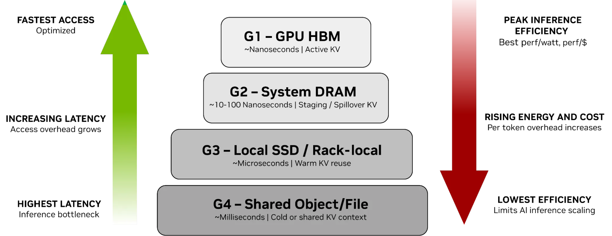

# NVIDIA Inference Context Memory Storage：为长上下文与 agentic AI 推理打造的 G3.5 上下文存储层

**NVIDIA Inference Context Memory Storage** (ICMS) 是 **NVIDIA Rubin** 平台面向推理场景引入的一类上下文存储基础设施，旨在将推理上下文（Key-Value, KV cache）作为一种 AI 原生数据类别进行高效复用与共享。其核心思路是在 GPU HBM 与通用共享存储之间建立面向 KV cache 的 **G3.5** 层（以太网连接的闪存层），并结合 **BlueField-4** 数据处理器与 **Spectrum-X** 以太网 RDMA 互联，为延迟敏感且可重建的 KV 数据提供更高吞吐、更优能效与更稳定的低抖动访问路径。

---

## 要点总结

- **ICMS** 在 **Rubin** 平台引入 **pod** 级的**推理上下文存储层**（**G3.5 层**），以太网连接闪存用于承载可复用的 KV cache。
- **BlueField-4** 作为数据处理器，为 KV I/O 提供加速能力，包括线速加密与 CRC 保护，并可终止 NVMe-oF 与对象 / RDMA 等协议。
- **Spectrum-X** 以太网提供 RDMA 互联，为共享 KV cache 提供可预期的低延迟、低抖动与高带宽访问路径。
- **Dynamo / NIXL / DOCA** 等软件组件协同进行上下文放置、KV block 管理与预置（prestage），降低 decode 阶段 stall 并提升复用效率。
- 在长上下文与 agentic 推理场景中，官方给出的对比结果为：最高可达 5× 持续 TPS 提升与 5× 能效提升，并改善大规模部署的 TCO。

> 注：本文所称 **GPU pod** 对应原文的 **Compute pod** 概念，是由多机架 GPU、Spectrum-X 以太网与存储组成的伸缩单元；原文使用 “petabytes” 的量级表述描述其容量目标，并未在该处给出精确的上限数值。

---

## 一、问题背景：推理上下文 (KV Cache) 的存储挑战

现代大规模 AI 推理（尤其是 agentic 和长上下文推理）对 **Key-Value (KV) cache** 的需求激增：

- **KV Cache** 相当于推理过程中模型的“短期与长期记忆”，避免重复计算历史信息。
- 随着上下文窗口扩展至百万级令牌，传统内存层（GPU HBM、系统内存）容量受限，通用存储层（对象/文件存储）虽然容量大，但访问延迟高，效率低。
- 当前层级（G1–G4）从 HBM 到共享存储之间存在明显的延迟、带宽与能效断层：

  - **G1**：GPU HBM（纳秒级访问，最高效率）
  - **G2**：主机内存（十到百纳秒）
  - **G3**：本地 SSD（微秒级）
  - **G4**：共享存储（毫秒级）

这些层级在规模扩展时对实时、可复用的推理上下文支持不足。

> 注：上述延迟量级用于帮助理解 G1–G4 的相对层级差异；原文主要强调不同层级在推理场景中的职责分工与效率差异，并未在该处给出统一的端到端延迟测量数据。



---

## 二、ICMS 的核心定位与架构层次

### 引入 G3.5 层：面向 KV cache 的上下文存储层

ICMS 引入了一个新的层级 **G3.5**，作为以太网连接的闪存层，用于在高性能 GPU 内存与可扩展共享存储之间提供面向 KV cache 的上下文存储能力：

- **用途**：专门存放可复用的、延迟敏感的 KV cache 数据；
- **特性**：

  - 高带宽、低延迟访问；
  - 大规模共享上下文存储（每个 **GPU pod** 可提供 petabytes 级共享容量）；
  - 延长 GPU 内存层（HBM & DRAM）的有效容量边界；
  - 支持跨节点 KV cache 共享，提高资源复用率。

该层利用高速闪存（flash）和 RDMA 网络能力改善访问延迟并提升能效表现。

---

## 三、ICMS 的系统架构构成

从整体架构看，ICMS 作为 Rubin 平台的 pod 级上下文存储层（G3.5），位于推理编排层与计算节点之间：上层由 **NVIDIA Dynamo**、**NIXL** 等推理框架协调 prefill / decode 与 KV cache 访问，并通过 KV block 管理机制将需要的上下文从 ICMS 预置回主机内存或 GPU HBM；下层由 **Spectrum-X** 以太网 RDMA 互联将 Rubin 计算节点连接到基于闪存的 ICMS 目标节点，提供可预期的低延迟与低抖动数据路径；在数据平面上，**BlueField-4** 负责 KV I/O 相关加速与协议终止（如 NVMe-oF 与对象 / RDMA），从而降低主机 CPU 负载并提升上下文共享效率。

> 注：原文语境中关于 “共享” 与 “跨节点” 的讨论主要指 **同一 GPU pod 内** 的多节点共享与复用（跨节点但不必跨 pod）。


### 3.1 BlueField-4 DPU 作为架构核心

ICMS 的控制与数据平面由 **NVIDIA BlueField-4 数据处理单元 (DPU)** 驱动：

- 提供 **800 Gb/s** 连接能力；
- 内置 64-核 NVIDIA Grace CPU 和高带宽 LPDDR；
- 提供线速加密与 CRC 数据保护，用于 KV 数据路径的安全与完整性校验；
- 可高效终止 NVMe-oF 与对象 / RDMA 协议，减少主机 CPU 负载。

---

### 3.2 Spectrum-X 以太网与 RDMA 网络

ICMS 依托 **Spectrum-X 以太网** 提供低延迟、高带宽的 RDMA 网络：

- 保证 pod 内计算节点与 ICMS 层之间的高效数据交互；
- 实现跨节点的 KV cache 共享和快速预取；
- 支持标准 RoCE 等协议，保证网络可扩展性与互操作性。

---

### 3.3 软件与控制层协同

ICMS 的运作离不开 NVIDIA 的软件生态协同：

| 组件                                         | 作用                                                                   |
| -------------------------------------------- | ---------------------------------------------------------------------- |
| **NVIDIA Dynamo**                            | 作为推理编排与框架之一，参与上下文放置、KV block 管理与调度协同        |
| **NVIDIA Inference Transfer Library (NIXL)** | 配合 Dynamo 等框架进行 KV block 的迁移与预置（prestage）               |
| **NVIDIA DOCA 框架**                         | 提供 KV 通信与存储层能力，将上下文缓存作为一等资源用于管理、共享与放置 |

这些组件用于协调上下文在各层记忆之间的放置与迁移（G1 → G2 → G3 → G3.5 → G4，以及从 G3.5 预置回 G2 / G1），以减少 decode 阶段 stall 并降低 GPU 空转。

---

## 四、ICMS 在推理数据路径中的定位

整体推理内存/存储层次示意：

```text
G1: GPU HBM         ← 热上下文、低延迟访问
G2: 主机内存 DRAM    ← 热/暖上下文缓冲
G3: 本地 SSD         ← 暖上下文存储
G3.5: ICMS (flash + RDMA) ← 共享、高带宽 KV cache
G4: 共享对象/文件存储 ← 冷数据与日志等持久数据
```

- **G3.5 (ICMS)** 弥补了 G3 与 G4 之间的性能/容量鸿沟；
- 支持针对推理任务的高吞吐、低延迟访问；
- 重用 KV cache 而无需在每个节点上单独生成与存储。

> 注：“弥补鸿沟”为对原文中 “ICMS fills the missing KV capacity between G1–G3 and G4” 的概括性表述，强调其作为上下文存储层在容量与效率之间的定位。

---

## 五、设计目标与优势

| 目标                 | 优势                                                           |
| -------------------- | -------------------------------------------------------------- |
| **提升吞吐与响应性** | 最高可达 5× 更高持续 TPS（tokens/s），降低推理停顿             |
| **提高能效**         | 相比传统通用存储，最高可达 5× 能效提升（power efficiency）     |
| **扩展上下文规模**   | 每个 GPU pod 可提供 petabytes 级共享容量，使长上下文推理更经济 |
| **跨节点共享**       | 支持多节点间上下文复用，适合 agentic AI 架构                   |

这种设计优化了从 GPU 到闪存再到共享存储的整个数据路径，使得可复用上下文数据不必反复计算。

---

## 六、参考文献

- NVIDIA Corporation. "Introducing NVIDIA BlueField-4-Powered Inference Context Memory Storage Platform for the Next Frontier of AI." NVIDIA Technical Blog. 2026-01-06. 访问日期: 2026-01-07. [Online]. Available: https://developer.nvidia.com/blog/introducing-nvidia-bluefield-4-powered-inference-context-memory-storage-platform-for-the-next-frontier-of-ai/
