# JuiceFS 文件修改时 chunk/slice/block 更新机制分析

## 1. 概述

JuiceFS 采用分层存储架构，将文件数据分解为 Chunk、Slice 和 Block 三个层次。当对文件进行修改时（无论是前部、中间还是尾部），这些存储单元会发生相应的变化。本文详细分析这些变化机制。

---

## 2. 存储架构基础

JuiceFS 采用了独特的三层存储架构来实现高效的文件存储和管理。这种架构将传统的文件系统概念与现代对象存储的特性相结合，通过 Chunk、Slice 和 Block 三个层次来组织数据，既保证了存储的灵活性，又优化了读写性能。

### 2.1 数据流向概览

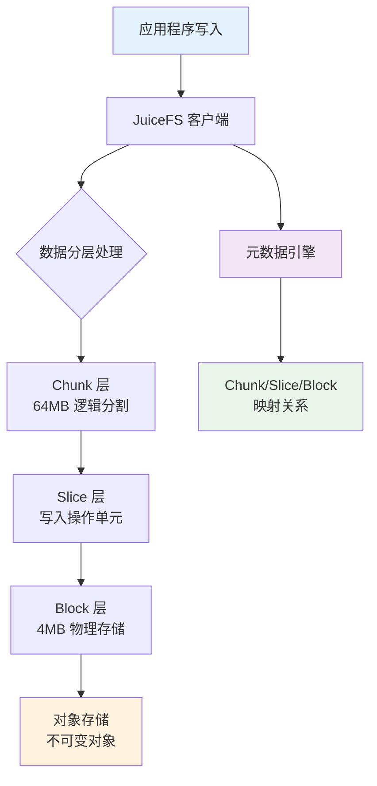

#### 2.1.1 数据流向详细说明

当应用程序向 JuiceFS 写入数据时，数据会经历以下处理流程：

1. **应用层写入**：应用程序通过标准的文件系统接口（如 POSIX）向 JuiceFS 发起写入请求
2. **客户端接收**：JuiceFS 客户端接收写入请求，开始进行数据分层处理
3. **三层分割处理**：
   - **Chunk 层**：根据文件偏移量，将数据按 64MB 边界进行逻辑分割
   - **Slice 层**：将每次写入操作封装为一个 Slice，记录写入的时间和范围
   - **Block 层**：将 Slice 中的数据按 4MB 大小分割为多个 Block
4. **对象存储**：将 Block 作为不可变对象上传到对象存储系统
5. **元数据管理**：在元数据引擎中记录 Chunk、Slice、Block 之间的映射关系

这种分层架构的优势在于：

- **解耦存储和计算**：数据存储在对象存储中，元数据单独管理
- **支持并发写入**：不同的 Slice 可以并行处理
- **优化存储效率**：通过 Block 级别的去重和压缩
- **简化数据管理**：清晰的层次结构便于理解和维护

### 2.2 三层存储结构详解

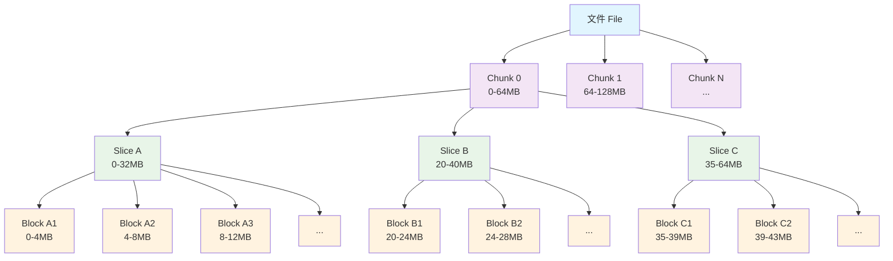

#### 2.2.1 Chunk 层：逻辑分割的基础

**Chunk（块）** 是 JuiceFS 存储架构的第一层，负责将文件按固定大小进行逻辑分割。

**核心特性**：

- **固定大小**：每个 Chunk 固定为 64MB，这个大小经过优化，既能保证合理的元数据开销，又能支持高效的并行处理
- **边界对齐**：Chunk 边界严格按照文件偏移量的 64MB 倍数进行划分，例如：
  - Chunk 0：0-64MB
  - Chunk 1：64MB-128MB
  - Chunk 2：128MB-192MB
- **完全隔离**：不同 Chunk 之间在逻辑上完全独立，一个 Chunk 的修改不会影响其他 Chunk
- **稳定性**：只要文件的总长度不变，Chunk 的划分就保持固定，这为缓存和预读提供了稳定的基础

**实际应用场景**：

```text
示例：一个 200MB 的文件会被分割为：
- Chunk 0: 0-64MB     (完整的 64MB)
- Chunk 1: 64-128MB   (完整的 64MB)  
- Chunk 2: 128-192MB  (完整的 64MB)
- Chunk 3: 192-200MB  (部分的 8MB)
```

#### 2.2.2 Slice 层：写入操作的记录单元

**Slice（片）** 是 JuiceFS 存储架构的第二层，代表一次完整的写入操作。

**核心特性**：

- **操作单元**：每个 Slice 对应一次连续的写入操作，记录了写入的时间、范围和数据
- **大小限制**：单个 Slice 最大不超过 64MB，确保不会跨越 Chunk 边界
- **时间戳**：每个 Slice 都有创建时间戳，用于处理重叠写入时的优先级判断
- **灵活排列**：同一个 Chunk 内的多个 Slice 可以：
  - **重叠**：新的 Slice 覆盖旧的 Slice 的部分或全部范围
  - **间隔**：Slice 之间存在空隙，形成稀疏文件
  - **连续**：Slice 首尾相接，形成连续的数据流

**写时复制机制**：

- JuiceFS 采用写时复制（Copy-on-Write）策略，每次写入都会创建新的 Slice
- 原有的 Slice 不会被修改或删除，而是通过时间戳来确定读取优先级
- 这种机制支持快照、版本控制等高级功能

**实际应用场景**：

```text
示例：对一个文件进行多次写入操作
1. 初始写入：创建 Slice A (0-32MB, T1)
2. 部分覆盖：创建 Slice B (20-40MB, T2) - 覆盖 Slice A 的 20-32MB 部分
3. 尾部追加：创建 Slice C (35-64MB, T3) - 覆盖 Slice B 的 35-40MB 部分

最终读取逻辑：
- 0-20MB: 从 Slice A 读取
- 20-35MB: 从 Slice B 读取  
- 35-64MB: 从 Slice C 读取
```

#### 2.2.3 Block 层：物理存储的实现单元

**Block（块）** 是 JuiceFS 存储架构的第三层，是实际存储在对象存储中的物理单元。

**核心特性**：

- **固定大小**：默认最大 4MB，这个大小在存储效率和网络传输之间取得了平衡
- **不可变性**：Block 一旦创建就不能修改，这简化了并发控制和一致性保证
- **独立存储**：每个 Block 在对象存储中都是一个独立的对象，支持并行上传和下载
- **压缩和加密**：Block 级别可以应用压缩和加密算法，优化存储空间和安全性

**存储优化**：

- **去重**：相同内容的 Block 只存储一份，通过哈希值进行识别
- **压缩**：支持多种压缩算法（LZ4、ZSTD 等），在 Block 级别进行压缩
- **分层存储**：可以根据访问频率将 Block 存储在不同的存储层级

**实际应用场景**：

```text
示例：一个 10MB 的 Slice 会被分割为：
- Block 1: 0-4MB    (完整的 4MB Block)
- Block 2: 4-8MB    (完整的 4MB Block)  
- Block 3: 8-10MB   (部分的 2MB Block)

每个 Block 在对象存储中都有唯一的标识符，例如：
- Block 1: juicefs-block-abc123def456...
- Block 2: juicefs-block-def456ghi789...
- Block 3: juicefs-block-ghi789jkl012...
```

#### 2.2.4 三层架构的协同工作

三层存储架构通过精密的协同工作来实现高效的文件存储：

1. **写入流程**：

   ```text
   应用写入 → Chunk 定位 → Slice 创建 → Block 分割 → 对象存储上传 → 元数据更新
   ```

2. **读取流程**：

   ```text
   读取请求 → Chunk 定位 → Slice 合并视图 → Block 定位 → 对象存储下载 → 数据合并返回
   ```

3. **优势总结**：
   - **高并发**：不同层级可以并行处理
   - **高可靠**：不可变的 Block 和分布式元数据
   - **高性能**：缓存友好的分层结构
   - **高扩展**：支持 PB 级别的文件系统

4. **Chunk（块）**：逻辑分割单元，固定 64MB 大小
   - 根据文件偏移量按 64MB 边界划分
   - 不同 Chunk 之间完全隔离
   - 只要文件总长度不变，Chunk 切分保持固定

5. **Slice（片）**：写入操作单元，最大 64MB
   - 代表一次连续写入操作
   - 隶属于某个 Chunk，不能跨越 Chunk 边界
   - 可以重叠、间隔或连续排列

6. **Block（块）**：物理存储单元，默认最大 4MB
   - 对象存储中的实际存储形式
   - 不可变对象，不支持就地修改
   - 是对象存储和磁盘缓存的最小单元

---

## 3. 文件修改场景分析

### 3.1 文件前部修改

#### 3.1.1 场景描述

文件前部修改是指对文件开头部分数据进行覆盖写入的操作。这种修改模式在日志文件头部信息更新、配置文件前缀修改等场景中较为常见。以一个 64MB 的文件为例，假设我们需要修改文件的前 1MB 内容。

在 JuiceFS 的存储架构中，这种修改会触发写时复制（Copy-on-Write）机制。系统不会直接修改原有的 Block，而是创建新的 Slice 和 Block 来存储修改后的数据，然后通过元数据更新来建立新的映射关系。

#### 3.1.2 写入前状态

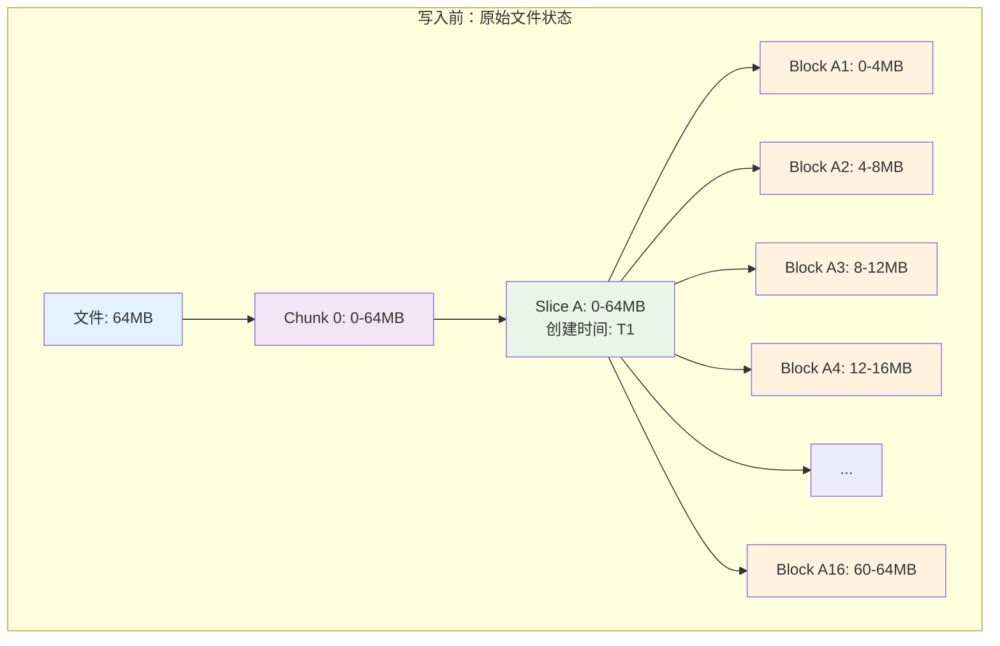

在写入前，文件具有简单的存储结构：

- **文件层面**：一个 64MB 的完整文件
- **Chunk 层面**：由于文件大小为 64MB，恰好对应一个 Chunk（Chunk 0）
- **Slice 层面**：包含一个完整的 Slice A，覆盖整个 Chunk 的 0-64MB 范围
- **Block 层面**：Slice A 被分割为 16 个 Block（A1-A16），每个 Block 4MB

#### 3.1.3 写入操作过程

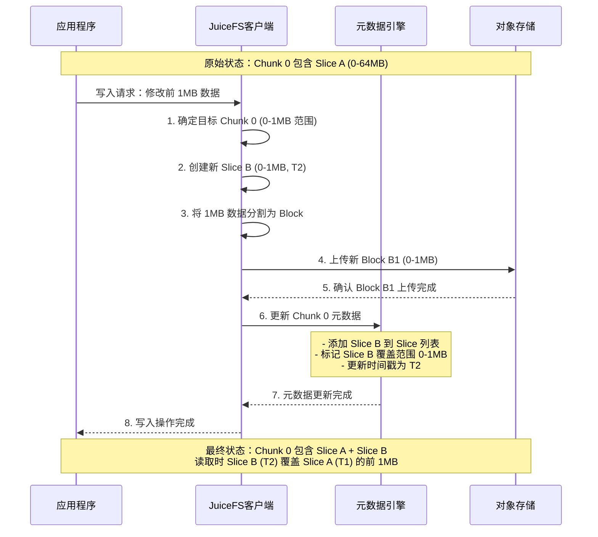

写入操作的详细步骤说明：

1. **请求解析**：JuiceFS 客户端接收到修改前 1MB 的写入请求
2. **Chunk 定位**：确定修改范围（0-1MB）属于 Chunk 0
3. **Slice 创建**：创建新的 Slice B，范围为 0-1MB，时间戳为 T2
4. **数据分块**：将 1MB 数据按照 Block 大小进行分割（本例中小于 4MB，形成一个 Block）
5. **对象上传**：将新 Block B1 上传到对象存储
6. **元数据更新**：在元数据引擎中更新 Chunk 0 的 Slice 列表，添加 Slice B
7. **完成确认**：向应用程序返回写入完成的确认

#### 3.1.4 写入后状态

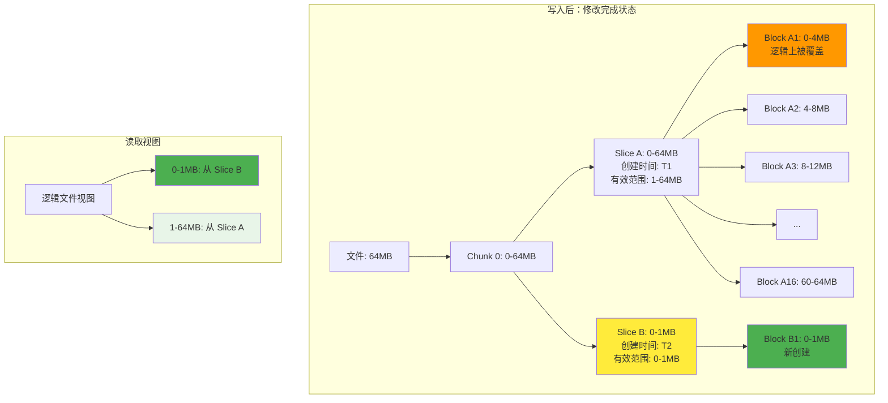

写入完成后的存储状态变化：

**Slice 层面的变化**：

- **Slice A**：原有 Slice 保持不变，但其有效数据范围在逻辑上调整为 1-64MB
- **Slice B**：新创建的 Slice，覆盖 0-1MB 范围，时间戳更新（T2 > T1）

**Block 层面的变化**：

- **Block A1**：物理上仍然存在于对象存储中，但在逻辑读取时被 Block B1 覆盖
- **Block A2-A16**：保持不变，继续提供 1-64MB 范围的数据
- **Block B1**：新创建的 Block，存储修改后的前 1MB 数据

**读取逻辑**：

- 当应用程序读取文件时，JuiceFS 会根据 Slice 的时间戳确定数据的有效性
- 0-1MB 范围：读取 Slice B 的 Block B1（时间戳 T2）
- 1-64MB 范围：读取 Slice A 的 Block A2-A16（时间戳 T1）

**存储开销分析**：

- **新增存储**：1MB 的新 Block B1
- **冗余存储**：Block A1 的前 1MB 部分成为冗余数据
- **元数据开销**：增加一个 Slice B 的元数据记录

1. **Slice 层面**：
   - 在 Chunk 0 中创建新的 Slice B（0-1MB）
   - 原有 Slice A 保持不变
   - 新 Slice B 覆盖 Slice A 的前 1MB 部分

2. **Block 层面**：
   - 创建新的 Block B1 存储修改的 1MB 数据
   - 原有 Block A1、A2 等保持不变（但逻辑上被部分覆盖）
   - 对象存储中增加一个新的 4MB 以下的对象

3. **元数据更新**：
   - 更新 Chunk 0 的 Slice 列表，添加 Slice B
   - 标记 Slice B 的有效数据范围为 0-1MB
   - 标记 Slice A 的有效数据范围调整为 1MB-64MB

### 3.2 文件中间修改

#### 3.2.1 场景描述

文件中间修改是 JuiceFS 中最复杂的写入场景，也是最容易导致存储碎片化的操作类型。这种修改模式常见于数据库文件的页面更新、大文件的局部内容修改等场景。以一个 64MB 的文件为例，假设我们需要修改文件第 30-35MB 的内容（共 5MB）。

中间修改的复杂性在于它会在现有 Slice 的中间位置创建新的覆盖层，导致读取时需要从多个不同时间创建的 Slice 中合并数据。这种操作对读取性能的影响最为显著，因为需要进行复杂的 Slice 合并计算。

#### 3.2.2 写入前状态

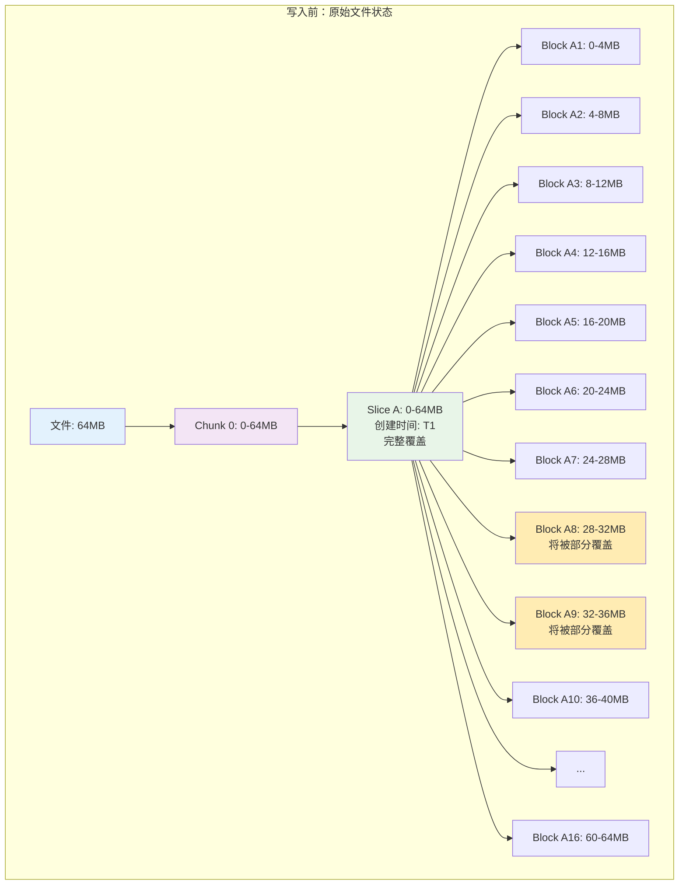

写入前的状态分析：

- **目标修改范围**：30-35MB，跨越了 Block A8 的后 2MB 和 Block A9 的前 3MB
- **影响的 Block**：Block A8（28-32MB）和 Block A9（32-36MB）将被部分覆盖
- **完整的存储结构**：单一 Slice A 提供完整的文件视图，读取路径简单直接

#### 3.2.3 写入操作过程

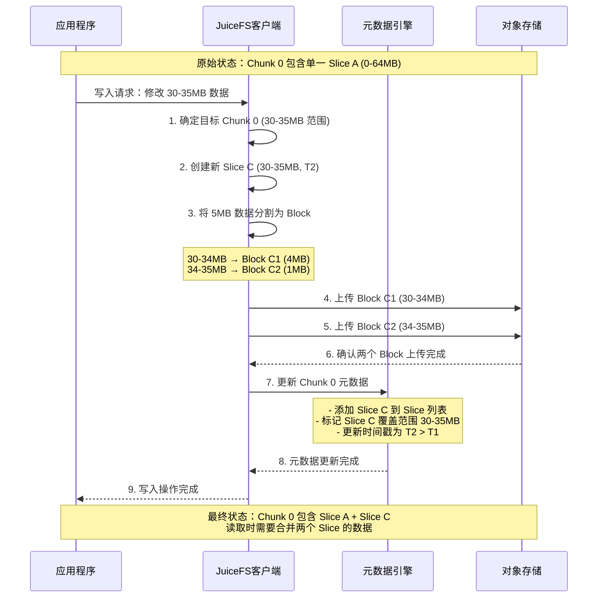

写入操作的关键特点：

1. **跨 Block 修改**：5MB 的修改范围跨越了两个原有 Block 的边界
2. **Block 分割策略**：新数据被分割为 Block C1（4MB）和 Block C2（1MB）
3. **部分覆盖**：原有的 Block A8 和 A9 只有部分数据被逻辑覆盖
4. **元数据复杂化**：Chunk 0 现在包含两个重叠的 Slice

#### 3.2.4 写入后状态

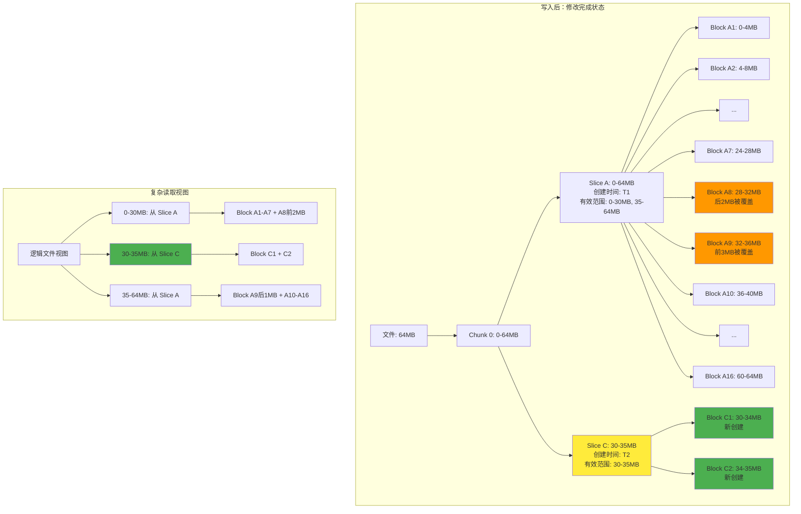

#### 3.2.5 读取逻辑详解

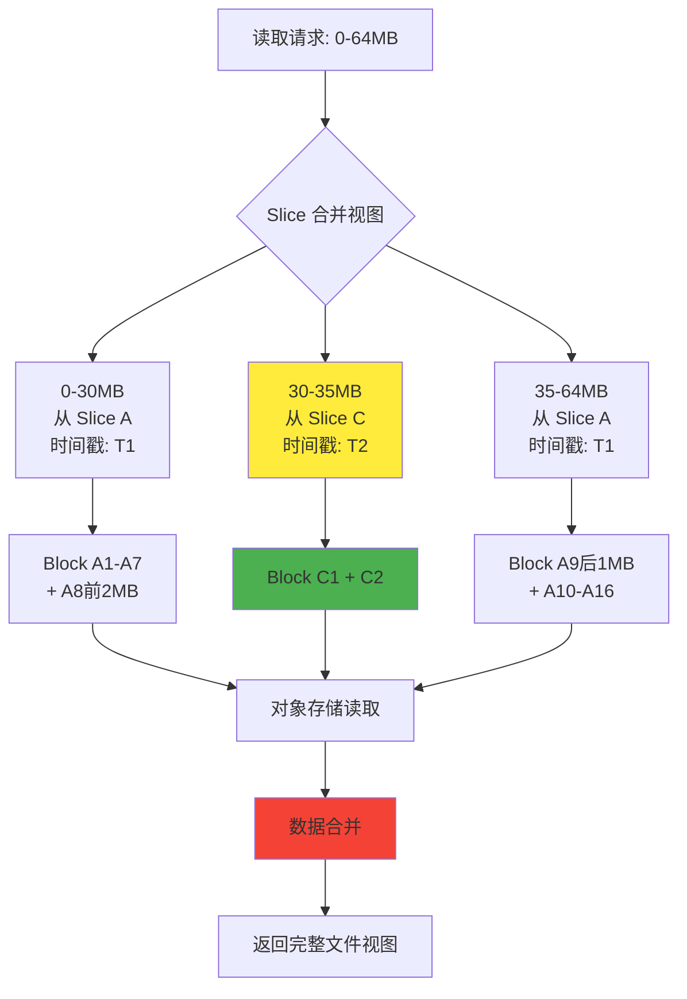

写入完成后的复杂性分析：

**Slice 层面的变化**：

- **Slice A**：原有 Slice 保持物理存在，但逻辑有效范围被分割为两段：0-30MB 和 35-64MB
- **Slice C**：新创建的 Slice，精确覆盖 30-35MB 范围，具有更新的时间戳

**Block 层面的变化**：

- **Block A1-A7**：完全有效，提供 0-28MB 的数据
- **Block A8**：部分有效，只有前 2MB（28-30MB）仍然有效
- **Block A9**：部分有效，只有后 1MB（35-36MB）仍然有效
- **Block A10-A16**：完全有效，提供 36-64MB 的数据
- **Block C1, C2**：新创建的 Block，提供 30-35MB 的修改后数据

**读取性能影响**：

- **Slice 查找复杂度**：读取任何范围都需要检查多个 Slice 的覆盖关系
- **Block 合并开销**：需要从不同 Slice 读取并合并数据
- **缓存效率下降**：原有的缓存策略可能失效，需要重新缓存合并后的数据

**存储开销分析**：

- **新增存储**：5MB 的新 Block（C1 + C2）
- **冗余存储**：Block A8 的后 2MB 和 Block A9 的前 3MB 成为冗余数据
- **元数据开销**：增加 Slice C 的元数据，以及复杂的覆盖关系记录
- **碎片化程度**：高，单个 Chunk 内存在多个重叠 Slice

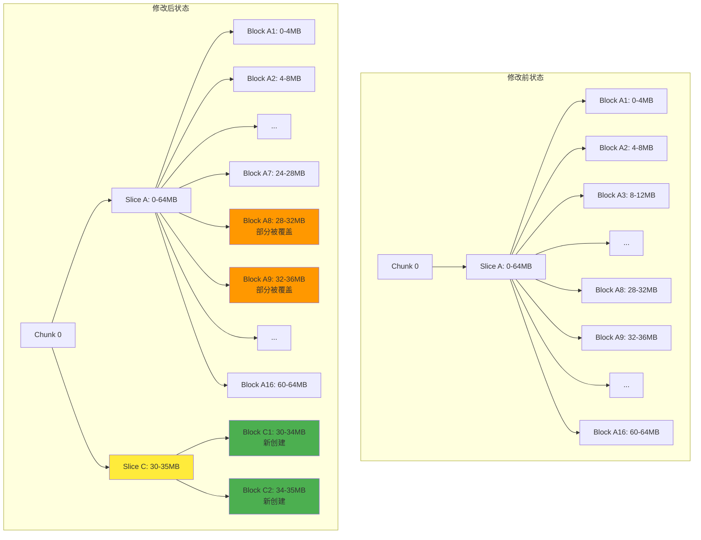

```text
原始状态：
Chunk 0: [Slice A: 0-64MB] → [Block A1-A16: 每个4MB]

修改 30-35MB 后：
Chunk 0: [Slice A: 0-64MB, Slice C: 30-35MB] → [原有 Blocks + Block C1: 30-34MB, Block C2: 34-35MB]
```

**具体变化：**

1. **Slice 层面**：
   - 在 Chunk 0 中创建新的 Slice C（30-35MB）
   - 原有 Slice A 保持不变
   - Slice C 覆盖 Slice A 的 30-35MB 部分

2. **Block 层面**：
   - 创建新的 Block C1（4MB）和 Block C2（1MB）
   - 原有相关 Block（A8、A9 部分）逻辑上被覆盖但物理保留
   - 对象存储中增加 2 个新对象

3. **读取逻辑**：
   - 0-30MB：读取 Slice A 对应的 Block A1-A7 和 A8 的前 2MB
   - 30-35MB：读取 Slice C 对应的 Block C1-C2
   - 35-64MB：读取 Slice A 对应的 A9 的后 1MB 和 A10-A16

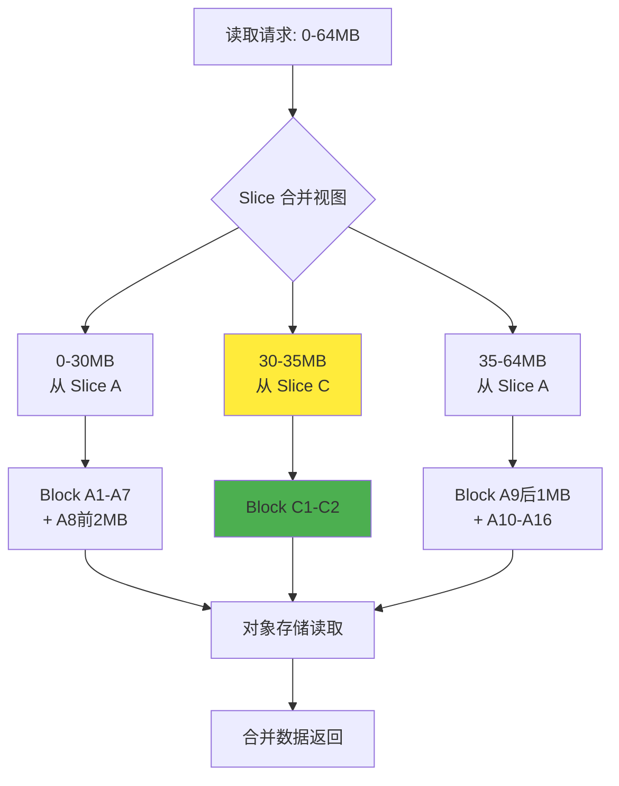

### 3.3 文件尾部修改

#### 3.3.1 场景描述

文件尾部修改是相对简单且性能影响较小的写入场景，常见于日志文件的追加写入、数据文件的末尾更新等操作。这种修改模式的特点是只影响文件的末尾部分，不会在文件中间创建复杂的覆盖关系。

以一个 100MB 的文件为例，该文件跨越两个 Chunk（Chunk 0: 0-64MB，Chunk 1: 64-100MB），假设我们需要修改文件的最后 5MB 内容（95-100MB）。这种修改只会影响 Chunk 1，且主要集中在文件的尾部区域。

#### 3.3.2 写入前状态

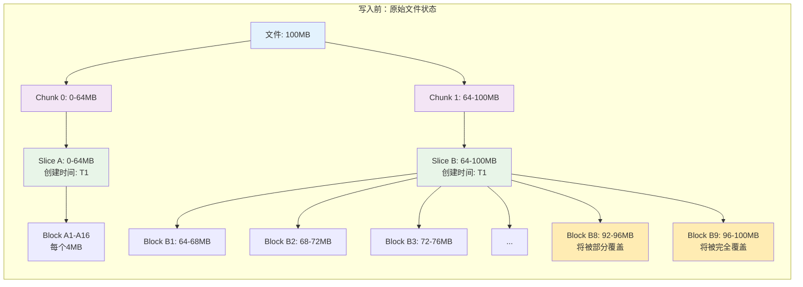

写入前的状态特点：

- **跨 Chunk 文件**：100MB 文件分布在两个 Chunk 中
- **目标修改范围**：95-100MB，位于 Chunk 1 的尾部
- **影响范围有限**：只影响 Chunk 1，Chunk 0 完全不受影响
- **Block 影响分析**：Block B8 的最后 1MB 和 Block B9 的全部 4MB 将被覆盖

#### 3.3.3 写入操作过程

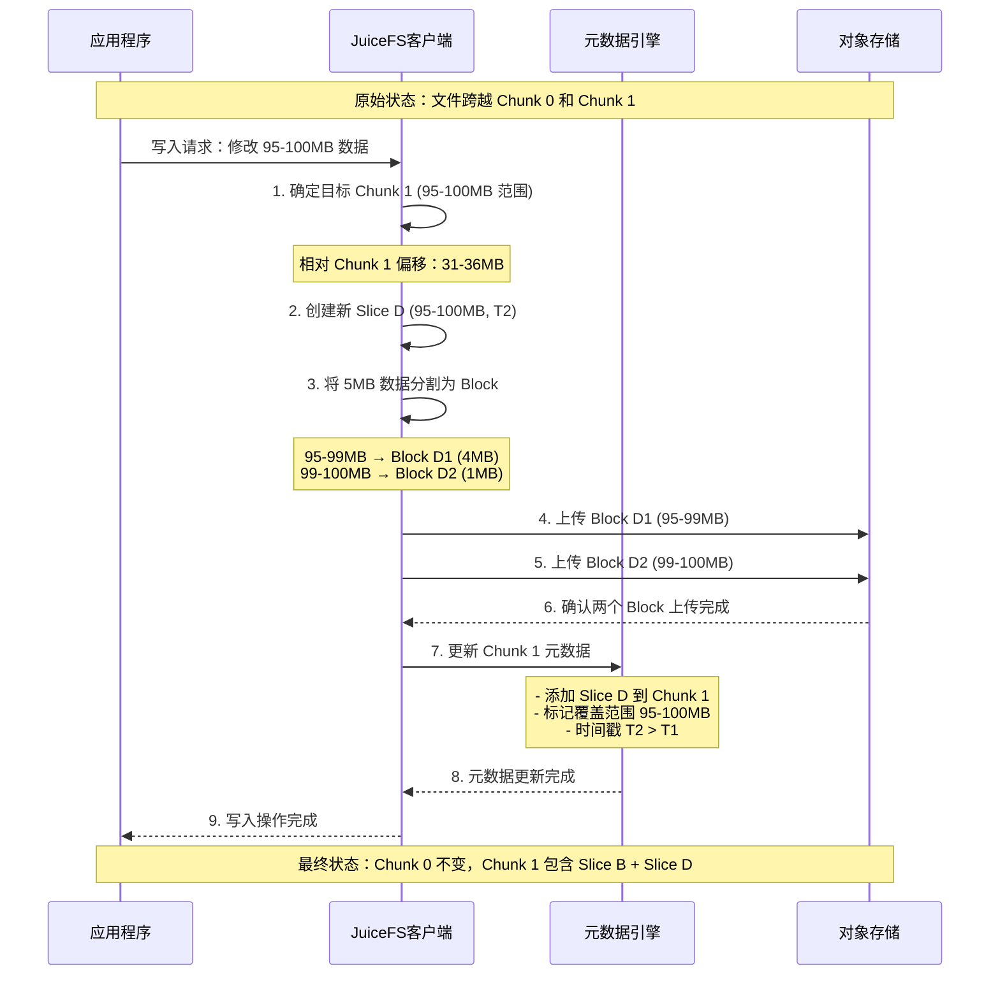

写入操作的特点：

1. **局部影响**：只影响 Chunk 1，Chunk 0 保持完全不变
2. **相对简单**：虽然创建了新 Slice，但覆盖关系相对简单
3. **尾部优化**：由于是尾部修改，对整体文件结构影响最小
4. **跨 Block 处理**：需要处理 Block B8 的部分覆盖和 Block B9 的完全覆盖

#### 3.3.4 写入后状态

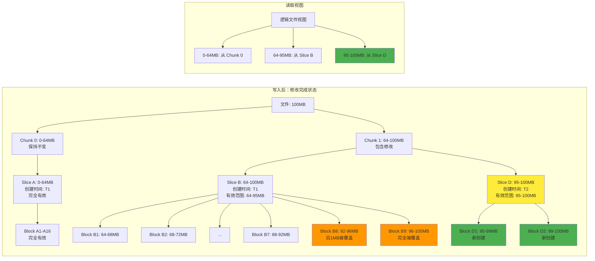

#### 3.3.5 尾部修改的优势分析

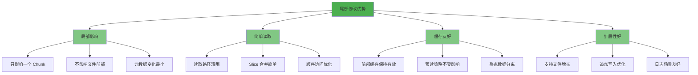

写入完成后的状态分析：

**Chunk 层面的影响**：

- **Chunk 0**：完全不受影响，保持原有的简单结构
- **Chunk 1**：增加了一个新的 Slice D，但结构相对简单

**Slice 层面的变化**：

- **Slice A**：完全不变，继续提供 0-64MB 的数据
- **Slice B**：逻辑有效范围调整为 64-95MB
- **Slice D**：新创建的 Slice，覆盖 95-100MB 范围

**Block 层面的变化**：

- **Block A1-A16**：完全不受影响
- **Block B1-B7**：完全有效，提供 64-92MB 的数据
- **Block B8**：部分有效，只有前 3MB（92-95MB）仍然有效
- **Block B9**：完全被覆盖，成为冗余数据
- **Block D1, D2**：新创建的 Block，提供 95-100MB 的修改后数据

**性能优势**：

- **读取性能**：对于文件前 95% 的内容，读取性能完全不受影响
- **缓存效率**：文件前部的缓存数据保持有效
- **扩展性**：如果是文件增长而非覆盖，性能会更好

**存储开销分析**：

- **新增存储**：5MB 的新 Block（D1 + D2）
- **冗余存储**：Block B8 的后 1MB 和 Block B9 的 4MB 成为冗余数据
- **元数据开销**：相对较小，只在 Chunk 1 中增加一个 Slice
- **碎片化程度**：低，只有一个 Chunk 受到影响

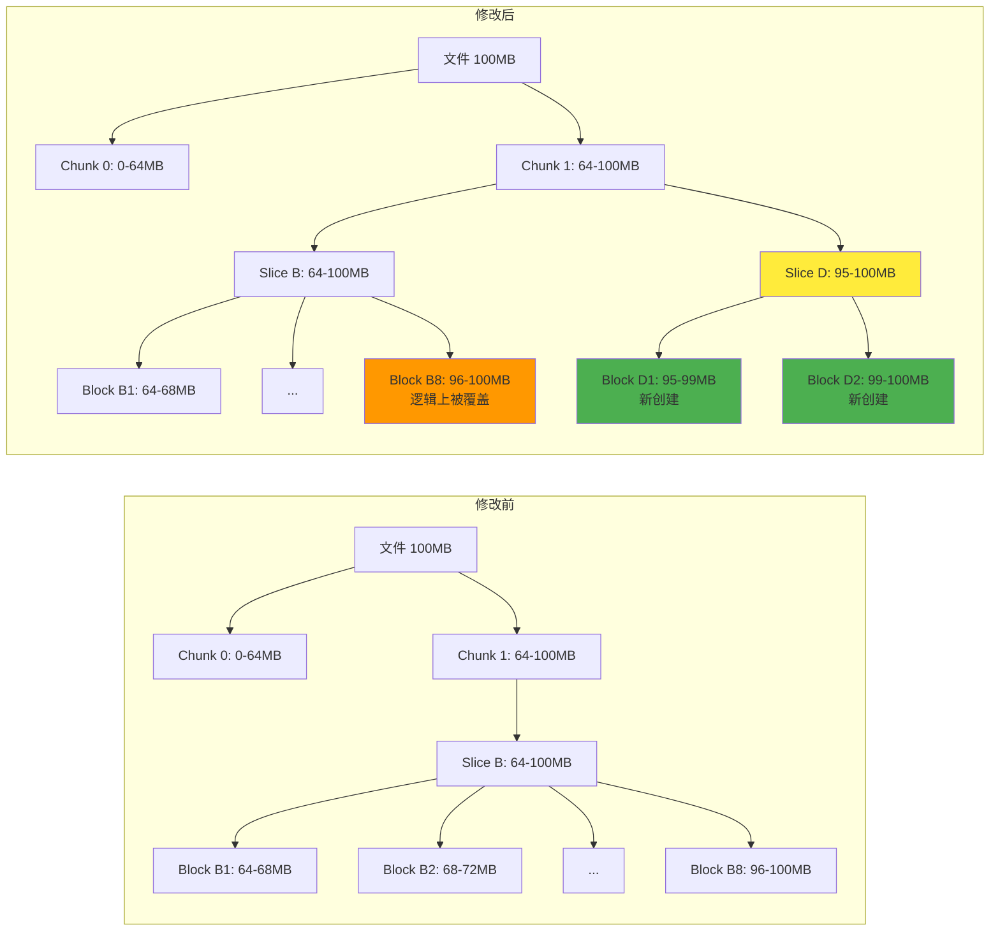

```text
原始状态：
Chunk 0: [Slice A: 0-64MB] → [Block A1-A16]
Chunk 1: [Slice B: 64-100MB] → [Block B1-B9]

修改 95-100MB 后：
Chunk 1: [Slice B: 64-100MB, Slice D: 95-100MB] → [原有 Blocks + Block D1: 95-99MB, Block D2: 99-100MB]
```

**具体变化：**

1. **Slice 层面**：
   - 在 Chunk 1 中创建新的 Slice D（95-100MB，相对 Chunk 偏移 31-36MB）
   - 原有 Slice B 保持不变

2. **Block 层面**：
   - 创建新的 Block D1（4MB）和 Block D2（1MB）
   - 原有 Block B8、B9 逻辑上被部分覆盖

---

## 4. 性能影响分析

### 4.1 写入性能影响

**前部修改**：

- 影响相对较小，只涉及第一个 Chunk
- 需要创建新的 Slice 和 Block
- 元数据更新开销较小

**中间修改**：

- 性能影响最大，可能导致严重的碎片化
- 每次修改都创建新的 Slice，增加元数据复杂度
- 读取时需要合并多个 Slice 的视图

**尾部修改**：

- 影响相对较小，类似追加写入
- 如果是扩展文件，性能较好
- 如果是覆盖写入，会产生新的 Slice

### 4.2 读取性能影响

**碎片化程度**：

- 前部修改：轻微碎片化
- 中间修改：严重碎片化，需要查找多个 Slice
- 尾部修改：轻微碎片化

**缓存效率**：

- 修改会使相关的缓存失效
- 新创建的 Block 需要重新缓存
- 小的修改可能导致整个 Block 缓存失效

---

## 5. 优化机制

### 5.1 碎片整理（Compaction）

当 Chunk 内 Slice 过多时，JuiceFS 会自动触发碎片整理：

```go
// 来源：pkg/vfs/writer.go
func (c *chunkWriter) findWritableSlice(pos uint32, size uint32) *sliceWriter {
    // 当 Slice 数量过多时，冻结旧的 Slice
    if i > 3 {
        s.freezed = true
        go s.flushData()
    }
}
```

**整理过程**：

1. 合并同一 Chunk 内的所有 Slice
2. 创建新的连续 Block 序列
3. 更新元数据，删除旧的 Slice 引用
4. 异步清理无用的 Block

### 5.2 写入优化策略

**Slice 复用**：

```go
// 查找可写入的 Slice
func (c *chunkWriter) findWritableSlice(pos uint32, size uint32) *sliceWriter {
    for i := range c.slices {
        s := c.slices[len(c.slices)-1-i]
        if !s.freezed {
            flushoff := s.slen / blockSize * blockSize
            if pos >= s.off+flushoff && pos <= s.off+s.slen {
                return s  // 复用现有 Slice
            }
        }
    }
    return nil  // 需要创建新 Slice
}
```

**缓冲区管理**：

- 写入先进入内存缓冲区
- 达到阈值或超时后才 flush 到对象存储
- 通过 `--buffer-size` 参数调节缓冲区大小

### 5.3 读取优化

**预读机制**：

- 顺序读取时预读整个 Block
- 随机读取时可通过 `--prefetch=0` 禁用预读
- 智能缓存策略减少读放大

**Slice 合并视图**：

- 读取时动态合并多个 Slice 的数据
- 按时间顺序确定数据的有效性
- 缓存合并后的结果提升后续读取性能

---

## 6. 最佳实践建议

### 6.1 写入模式优化

**顺序写入**：

- 尽量采用顺序写入模式
- 避免频繁的随机小块修改
- 批量修改后统一 flush

**大块写入**：

- 单次写入尽量达到 Block 大小（4MB）
- 减少小块写入导致的碎片化
- 合理设置缓冲区大小

### 6.2 应用层优化

**文件修改策略**：

- 前部修改：影响相对较小，可正常使用
- 中间修改：尽量避免频繁修改，考虑重写整个文件
- 尾部修改：优先选择追加而非覆盖

**缓存配置**：

- 根据修改模式调整缓存大小
- 随机修改场景考虑禁用预读
- 设置合适的缓冲区大小

### 6.3 监控和维护

**性能监控**：

- 使用 `juicefs stats` 监控读写性能
- 关注 Slice 数量和碎片化程度
- 监控缓冲区使用情况

**定期维护**：

- 定期运行 `juicefs gc` 进行碎片整理
- 监控对象存储的空间使用
- 清理无用的 Block 对象

---

## 7. 总结

JuiceFS 的 Block/Chunk 变化机制体现了其灵活的存储架构设计：

1. **分层设计**：Chunk、Slice、Block 三层结构提供了良好的抽象和性能平衡
2. **写时复制**：通过创建新 Slice 而非修改现有 Block 来处理文件修改
3. **智能优化**：自动碎片整理和缓存机制保证长期性能
4. **灵活配置**：丰富的参数选项适应不同的使用场景

理解这些机制有助于在实际使用中做出更好的架构决策和性能优化。
