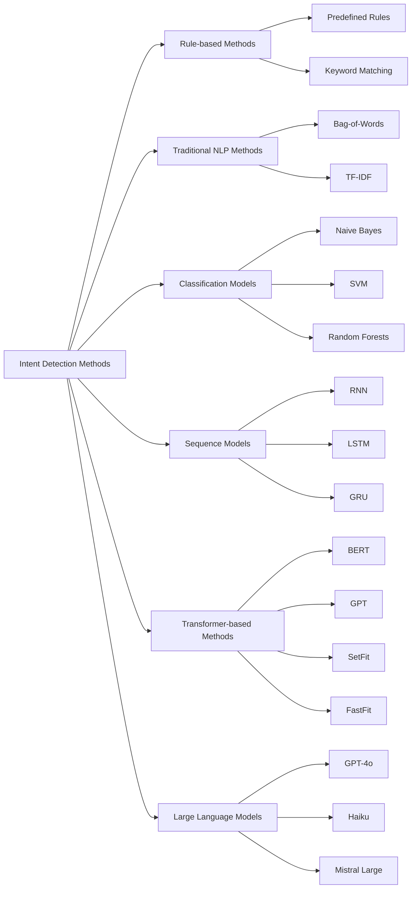

# 基于大型语言模型的意图检测

> 作者：Marcus Elwin @MarqKwesi <br>
> 地址：https://dswithmac.com/posts/intent-detection/

在当今数字化环境中，产品团队正日益整合由 _大型语言模型_ 驱动的`AI`功能。这些先进技术显著提升了包括搜索系统、问答模块以及数据提取组件在内的多种系统功能。

然而，要在恰当时机提供精准功能，关键在于准确 _路由_ 和解析用户 _行为_ 。因此，用户意图的理解已成为任何基于`LLM`和检索增强生成（`RAG`）技术解决方案成功的核心要素。

本文中，我们将深入解析如何运用`LLMs` 🤖从多样化的用户查询中有效检测并解读其潜在意图。

## 意图检测的定义与核心价值

**意图检测**（亦称 _意图识别_ ）作为**自然语言处理**技术，专注于解析用户查询背后的核心诉求。该分类方法在搜索与推荐系统领域具有重要历史地位 [1]。

意图检测的核心要素包括：

*   **自然语言理解**：即解析用户话语中隐含的 _语义_ 。
*   **上下文分析**：需结合用户查询的上下文环境（如文档、文档片段或聊天记录）来精准识别意图。
*   **分类**：将预定义标签或类别分配给用户输入及其预测意图。

显然，这对采用 `RAG` 等技术的 `LLM` 系统至关重要，主要原因如下：

*   **优化用户体验**：通过深度理解用户需求，可 _定制_ 个性化响应与操作，同时提升应答效率和相关性。
*   **自动化执行**：基于意图识别结果，系统可自动触发与用户查询匹配的预定义流程或任务。
*   **功能路由**：根据预测意图将用户 _定向_ 至系统对应模块，结合 _上下文_ 实现高效应答。

您可能了解过 _语义路由_[2]这一关联概念。简言之：通过意图检测将用户引导至系统相关功能模块，从而提供精准及时的个性化体验。

## 意图检测方法

在明确意图检测的定义、应用价值及其重要性的基础上，接下来我们将系统解析多种意图检测方法：



这些方法的初步分类如下：

*   **基于规则的方法**
*   **传统自然语言处理方法**
*   **分类模型**
*   **序列模型**
*   **`Transformer` 架构模型**
*   **大型语言模型**

我们不会逐一详述这些方法的细节。如需深入了解，针对文中所提及的各类方法/算法，互联网上已有大量优质学习资源可供参考。

以下是这些不同方法的优缺点对比表：

| **方法** | **优点**| **缺点** |
|------------------------------|--------------------------------|------------------------|
| 基于规则的方法 | - 简单易实现和解释  - 对于少量规则易于维护 | - 灵活性和可扩展性有限<br>- 需要手动更新新意图和词汇                                                                 |
| 传统 `NLP` 方法（词袋模型、`TF-IDF`） | - 对于基本文本分类简单有效<br>- 快速且计算成本低 | - 忽略词序和上下文<br>- 可能导致意义丢失 |
| 分类模型（朴素贝叶斯、`SVM`、随机森林） | - 通常比基于规则的系统更准确<br>- 可以处理多种输入 | - 需要特征工程<br>- 可能无法捕捉复杂的语言细微差别 |
| 序列模型（`RNN`、`LSTM`、`GRU`） | - 在捕捉上下文和处理长序列方面有效<br>- 善于建模文本中的时间依赖关系 | - 计算成本高<br>- 需要大型数据集 |
| 基于 `Transformer` 的方法（`BERT`、`GPT`、`SetFit`、`FastFit`） | - 在许多 `NLP` 任务中具有最先进的性能<br>- 能够理解复杂的上下文和细微差别 | - 需要大量的计算能力<br>- 需要大量的训练数据 |
| 大型语言模型（`GPT-4`、`Haiku`、`Mistral Large`） | - 在各种应用中具有高准确性和通用性<br>- 在无需大量重新训练的情况下能够处理广泛的任务 | - 计算成本非常高<br>- 可能存在偏见和可解释性问题 |


## 基于`LLM`的意图检测

在明确`意图检测`的定义与价值后，我们将通过一个 _真实案例_ 演示如何运用`LLM`实现意图`检测`。

本案例将构建一个虚拟的食谱咨询聊天机器人，用户可通过问答形式获取食谱指导及推荐。该系统的终端用户既可围绕特定`食谱`展开对话，也可在更广义的`问答`场景中进行交流。

这意味着根据用户操作行为，我们需要区分两种不同的 `FoodContextTypes`：

1.  `RECIPE`：食谱上下文中的相关查询
2.  `GENERAL`：与具体食谱无直接关联的通用性查询

经过与产品团队及部分客户沟通，我们明确初始阶段需要支持检测以下 `FoodIntentTypes`：

1.  `RECIPE_QA`：针对食谱的问答交互
2.  `RECIPE_SUGGEST`：食谱改进建议或调整需求
3.  `方案转换协议`：对食谱整体或部分内容进行形式转换
4.  `RECIPE_EXPLAIN`：食谱深度解析（如菜系分类等属性说明）
5.  `GENERAL_QA`：通用型聊天机器人问答
6.  `GENREAL_RECOMMENDATION`：与食谱推荐相关的查询请求

为提升示例趣味性 🔥，本项目将采用 `TypeScript`——主要基于笔者当前工作中对 `TS` 和 `JS` 的深度使用经验。

我们将要使用的程序库包括：

*   `@langchain/openai`
*   `@langchain/core`
*   `zod`

首先，我们需要明确待处理的`entities`类型。在`TypeScript`（`TS`）中，我们使用`enums`枚举类型进行定义：

```TypeScript
/* Enum for chat context */
export enum FoodContextType {
    RECIPE = "RECIPE"
    GENERAL = "GENERAL"
}

/* Enum for chat intent */
export enum FoodIntentType {
    RECIPE_QA = "RECIPE_QA"
    RECIPE_SUGGEST = "RECIPE_SUGGEST"
    RECIPE_TRANSLATE = "RECIPE_TRANSLATE"
    RECIPE_EXPLAIN = "RECIPE_EXPLAIN"
    GENERAL_QA = "GENERAL_QA"
    GENERAL_RECOMMENDATION = "GENERAL_RECOMMENDATION"
}
```

由于**意图检测**（`intentDetection`）本质上属于分类问题，我们将基于以下要素使用`LLM`预测用户意图：

*   `context`：用户当前的上下文环境
*   `userQuery`：用户实际提出的问题或查询内容

意图（`Intent`）可能具有多重含义，仅允许或推导单一意图可能导致误判。以下列查询为例：

**“请推荐一份包含法语操作指南的法式烹饪方案”**

根据上述查询，可推导出以下两种意图：

1.  `GENERAL_RECOMMENDATION`：用户希望获得法式（🇫🇷）烹饪推荐
2.  `RECIPE_TRANSLATE`：用户需要法语（🇫🇷）版本的法式烹饪指导方案

为实现此功能，我们采用`zod`库[3]进行模式验证。值得庆幸的是，大多数LLM具备优秀的`functionCalling`能力，能够根据既定模式提取结构化输出（`structuredOutput`）

针对当前任务的`zod`对象示例如下：

```TypeScript
import { z } from 'zod';

const zDetectFoodIntentResponse = z.object({
    foodIntent: z
      .array(
        z.object({
            foodContextType: z.nativeEnum(FoodContextType))
            .describe('Type of context the user is in'),
            foodIntentType: z.nativeEnum(FoodIntentType))
            .describe('Predict food related intent'),
            reasoning: z.string()
            .describe('Reasoning around the predicted intent')
        })
      )
});

/* Infer type */
type FoodIntentDetectionResponse = z.infer<typeof zDetectFoodIntentResponse>;

```

现代多数大型语言模型已原生支持工具调用与结构化输出，通过`langchain`等编排框架能快速实现相关功能。`Langchain`最新发布了跨多个LLM服务商的结构化输出提取和函数调用方案，具体可参阅[此技术博客](https://blog.langchain.dev/tool-calling-with-langchain/  ) 。

后续步骤需构建提示模板（`prompt`）并设计由单次或多次`LLM`调用组成的处理链（`chain`）。如需了解数据提取任务中多重`LLM`调用的优化技巧，请参阅我的[数据工程博客](https://dswithmac.com/posts/prompt-eng-ner/  ) ；若对`DSPy`框架感兴趣，推荐阅读我的[另一篇技术解析](https://dswithmac.com/posts/ner-dspy/  ) 。

以下是提示工程（prompt engineering）的初始模板参考：

```text
export const FoodIntentDetectionPromptTemplate = `
You are an expert restauranteur and online TV chef.
Based on the provided 'context' and 'userQuery', predict the users 'intent'.
Make sure to follow the instructions.

# Instructions
1. Only use the 'foodContextTypes' specified in the schema.
2. Use the 'foodContextType' to determine what type of 'context' the user is in.
3. Based on the 'foodContextType' and 'userQuery' predict the 'foodIntentType'.
4. If the 'userQuery' is uncertain, unclear, or irrelevant use 'GENERAL_QA' as the default intent.

# Food Context Input Type
{foodContextType}

# User Context
{context}

# User Query
{userQuery}
`
```
鉴于提示工程目前仍更偏艺术性而非科学性（若不使用`DSPy`等框架），您可能需要针对具体用例优化上述提示模板。不过在本示例中，当前版本已足够适用，让我们继续构建任务链。

首先，我们定义一个辅助类来跟踪聊天消息记录：

```typescript
import { ChatPromptTemplate } from '@langchain/core/prompts'
import { ChatOpenAI } from '@langchain/openai'

/* MessageRole enum */
export enum MessageRole {
    ASSISTANT = 'ASSISTANT'
    SYSTEM = 'SYSTEM'
    USER = 'USER'
}

/* Messages object */
export class Messages {
    id: string;
    content: string
    recipe: string
    role: MessageRole
}
}
```

接下来构建我们的意图预测函数`predictIntent`：

```typescript
async predictIntent(messages: Messages)
: Promise<FoodIntentDetectionResponse> {
    // unpack message
    const { content, recipe, role } = message;

    // get userContext
    const userContext = (content == null && recipe != null): recipe ? content; 

    // deduce foodContextType from message
    const foodContextType = !recipe ? FoodContextType.GENERAL : FoodContextType.RECIPE ;

    // get user question
    const userQuery = ...;

    // build chain
    const llm = new ChatOpenAI({
        temperature: 0,
        modelName: 'gpt-4o',
        openAIApiKey: process.env.apiKey

    });

    const = chain = ChatPromptTemplate
    .fromTemplate(FoodIntentDetectionPromptTemplate)
    .pipe(llm.withStructuredOutput(zDetectFoodIntentResponse));

    // invoke chain and parse response
    const response = await chain.invoke(({
        context: userContext ?? '',
        foodContextType,
        userQuery: userquery ?? '' 

    }));

    const parsedResponse = zDetectFoodIntentResponse.safeParse(response);

    if (!parsedResponse.success) {
        throw new Error('Failed to parse response...');
    }

    return parsedResponse.data;


}
```

操作并不复杂，对吧？使用该函数处理不同查询时，我们可能获得如下输出结果：

**查询示例1**：

_「能否推荐一份快捷简便的优质晚餐方案，最好是日式料理？」_

**输出结果1**：

```text
{
    "foodIntent": [
        {
            "foodContextType": "GENERAL",
            "foodIntentType": "GENERAL_RECOMMENDATION",
            "reasoning": "The user is asking for a recommendation of Japanese food that is easy and quick. Due to this, the predicted intent is GENERAL_RECOMMENDATION."
        }
    ]
}
```

**查询示例2**：

_「这个食谱很棒，但我想制作素食版本，并将食材计量单位从公制改为英制」_

**输出结果2**：

```text
{
    "foodIntent": [
        {
            "foodContextType": "RECIPE",
            "foodIntentType": "RECIPE_QA",
            "reasoning": "The user ..."
        },
        {
            "foodContextType": "RECIPE",
            "foodIntentType": "RECIPE_TRANSLATE",
            "reasoning": "The user ..."
        },
    ]
}
```
## 总结

本文深入探讨了 _意图检测_ 的技术细节及其在`AI`/`LLM`驱动系统中的重要性，核心目标在于提升问答/搜索系统中用户查询的精准度和场景适配性。

我们通过示例展示了如何运用诸如`gpt-4o`等大型语言模型在虚构问答系统中实现 _意图检测_ 。意图检测不仅是技术实现的基础要求，更是构建智能化、以用户为中心的`LLM`驱动系统的重要战略优势。

虽然本例采用`gpt-4o`进行演示，但实际应用中存在诸多低延迟替代方案，例如`Anthropic`公司开发的`haiku`。当样本量达到数百个时，基于`Transformer`架构的其他方法如`FastFit`或`SetFit`同样具有应用价值。感谢您的阅读，我们下期再会👋！

## 参考

* [1] **Papers With Code, Intent Detection**: `https://paperswithcode.com/task/intent-detection  `
* [2] **Langchain, Route Logic Based on Input**: `https://python.langchain.com/v0.1/docs/expression_language/how_to/routing/  `
* [3] **This is somewhat similar to `Pydantic` in Python.**