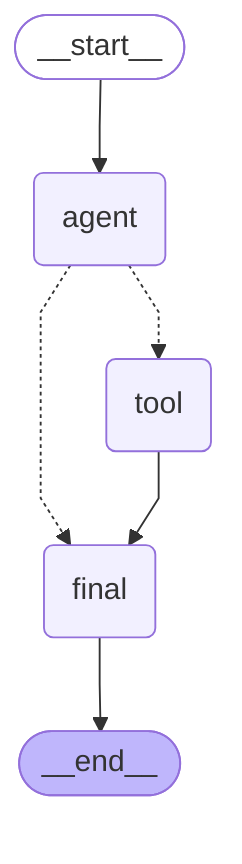

# LangGraph 实战：用 Python 打造有状态智能体

**LangGraph** 是一个专为构建**有状态**、**多节点执行流程**的 `AI` 智能体系统设计的 `Python` 框架，它将状态机（`State Machine`）与图结构（`Graph`）相结合，使得开发者能够直观地用"节点+边"来描述执行逻辑和状态转移。下文首先概述 **LangGraph** 的核心特点及设计理念，然后以"**智能客服**"场景为例，演示其基本用法和典型代码。

## 摘要

* **状态驱动与有向图**：LangGraph 通过 `State`（通常用 `TypedDict` 定义）贯穿整个执行流程，所有节点读取并更新状态局部；有向图（Graph）则定义了节点之间的控制流 ([LangChain AI][1])。
* **节点与边**：每个 **Node** 表示一个执行单元（如 LLM 调用、工具函数、决策逻辑），**Edge** 则可携带条件实现分支或循环，使流程更灵活可控 ([DEV Community][2])。
* **可循环的工作流**：区别于传统的 DAG（有向无环图），LangGraph 支持**循环**结构（cycles），更适合实现多轮决策与重试机制 ([Medium][3])。
* **与 LangChain 深度集成**：所有 LangChain 的 `Runnable`（例如 `Chain`、`Tool`、LLM 模型）都可直接作为节点使用，复用生态组件，增强扩展性 ([LangChain AI][1])。
* **持久化与可视化**：可接入 LangSmith 进行调用跟踪与日志记录，也可通过 `graph.get_graph().draw()` 利用 NetworkX 和 matplotlib 输出流程图，便于调试与监控 ([LangChain][4])。

---

## 一、为何需要 LangGraph？

1. **复杂流程可视化**：对话、任务执行、工具调用等往往需要多步交互和条件判断，传统端到端调用缺乏透明度和可控性；LangGraph 用图结构清晰呈现每一步逻辑 ([Medium][5])。
2. **有状态管理**：在多轮对话或长流程中，维护上下文与中间结果至关重要；LangGraph 将所有上下文统一存放在 `State`，节点只需专注局部更新，简化状态传递 ([LangChain AI][1])。
3. **支持循环与分支**：企业级智能体常常需要重试、分支判断或任务迭代，LangGraph 原生支持带条件的循环边（cycles）和分支边（conditional edges），实现更强的流程控制 ([Medium][3])。
4. **生态复用**：构建在 LangChain 之上，可复用其丰富的模型、检索、工具等组件，更快上手并保持一致的开发体验 ([LangChain AI][1])。

---

## 二、核心概念

| **概念** | **说明** |
| ----------- | -------------------------------------------------------- |
| **State**   | 全局状态，由 `TypedDict` 定义，包含历史消息、中间结果等；每个节点接收并返回部分状态更新。 |
| **Node**    | 执行单元，可以是调用 `LLM`、执行函数、判断逻辑等；输入当前 `State`，输出新的状态片段。 |
| **Edge**    | 状态转移路径，可添加条件函数，实现 `if/else` 分支或循环控制。 |
| **Graph**   | 有向图结构，将多个节点和边连接成完整工作流，编译后产生可执行 `graph.invoke(state)` 方法。 |

> **工作原理**：`LangGraph` 会根据图的拓扑与边的判断函数，自动执行对应节点，并将各节点的状态更新按定义合并到全局 `State` 中，直至到达指定的终点（`Finish Point`） ([DEV Community][2])。

---

## 三、示例：智能客服 Agent

下面以"智能客服"为例，展示如何用 LangGraph 构建一个能够判断是否调用外部"工具"并返回结果的简单对话流程。

### 3.1 环境依赖

```bash
pip install langchain_core langgraph dotenv langchain langchain_community openai langchain-openai
```

`.env` 文件中：

```env
OPENAI_API_BASE=https://api.deepseek.com/v1
OPENAI_API_KEY=sk-xxxxxx

LANGSMITH_TRACING=true
LANGSMITH_ENDPOINT="https://api.smith.langchain.com"
LANGSMITH_API_KEY="lsv2_pt_xxxxx"
LANGSMITH_PROJECT="pr-gripping-yak-45"
```

### 3.2 定义状态

```python
from typing import TypedDict, List
from langchain_core.messages import BaseMessage

#%% 3. 定义对话状态结构
class AgentState(TypedDict):
    messages: List[BaseMessage] # 对话历史
    agent_outcome: str # 下一步决策：tool 或 final
    tool_response: str # 工具调用结果
```

### 3.3 定义节点

```python
#%% 4. 初始化大模型
llm = ChatOpenAI(model_name="deepseek-chat", verbose=True)

#%% 5. 节点函数定义
def agent_decision_node(state: AgentState) -> dict:
    last_message = state["messages"][-1].content
    prompt = ChatPromptTemplate.from_template(
        "请判断用户的意图：\n"
        "用户输入：{input}\n\n"
        "如果需要调用工具，请回答 tool；否则回答 final。"
    )
    decision = llm.invoke(prompt.format_messages(input=last_message)).content.strip().lower()
    print(f"\n[Agent Decision] outcome = {decision}")
    return {"agent_outcome": decision if decision in ("tool", "final") else "final"}

def tool_node(_: AgentState) -> dict:
    return {"tool_response": "明天晴，气温25°C，适合出行。"}

def final_node(state: AgentState) -> dict:
    # 获取工具的响应，或者默认消息
    reply = state.get("tool_response", "很高兴为您服务！")
    
    # 获取当前时间戳，作为元数据
    timestamp = datetime.now().strftime("%Y-%m-%d %H:%M:%S")
    
    # 可以添加额外的元数据，例如，用户的原始输入
    user_input = state["messages"][-1].content
    
    # 打印出回复信息及其附加内容
    print(f"回复: {reply}, 时间: {timestamp}, 用户输入: {user_input}")
    
    # 返回包含原始消息和回复的消息记录
    return {
        "messages": state["messages"] + [AIMessage(content=reply)],
        "metadata": {
            "timestamp": timestamp,
            "user_input": user_input,
            "reply_length": len(reply),
        }
    }
```

### 3.4 构建并编译图

```python
#%% 6. 构建 LangGraph 工作流
def build_graph():
    workflow = StateGraph(AgentState)
    workflow.add_node("agent", agent_decision_node)
    workflow.add_node("tool", tool_node)
    workflow.add_node("final", final_node)
    workflow.set_entry_point("agent")
    workflow.set_finish_point("final")
    workflow.add_conditional_edges("agent", lambda st: st["agent_outcome"], {"tool": "tool", "final": "final"})
    workflow.add_edge("tool", "final")
    return workflow.compile()

# 编译一次，供全局使用
graph = build_graph()
```

### 3.5 调用测试

```python
#%% 7. 运行测试
def test_run():
    init_state = {"messages": [HumanMessage(content="请问明天天气如何？")]}
    result = graph.invoke(init_state)
    print("\n对话记录:")
    for msg in result["messages"]:
        print(f"[{msg.type}]: {msg.content}")
```

通过修改判断逻辑、替换工具节点为真实 API、或在 `State` 中增加更多字段（如意图、对话轮次等），即可快速扩展为更复杂的客服或业务流程 ([LangChain AI][1], [Medium][5])。

---

## 四、可视化与调试

`LangGraph` 支持将工作流导出为 `NetworkX` 图结构，便于通过 `matplotlib` 进行流程图可视化，同时也支持生成 `Mermaid` 或 `PNG` 格式的图示。此外，`LangGraph` 可无缝集成 `LangSmith`，实现对智能体执行过程的可视化调试与追踪。

### 4.1 流程图生成

```python
#%% 8. 使用 Mermaid 可视化工作流
def visualize_workflow_with_mermaid(graph):
    mermaid_code = graph.get_graph().draw_mermaid()  # 获取 Mermaid 格式代码
    
    # 通过 IPython 显示 Mermaid 图
    display(Markdown(f"```mermaid\n{mermaid_code}\n```"))
```

输出结果：



### 4.2 LangSmith 集成调试

通过 LangSmith 记录执行过程：

```python
#%% 9. LangSmith 追踪（可选）
def run_with_langsmith(input_state):
    if "LANGSMITH_API_KEY" in os.environ:
    
        @traceable
        def traced_fn(state):
            return graph.invoke(state)

        result = traced_fn(input_state)
        print("\n[Traced] 对话记录:")
        for msg in result["messages"]:
            print(f"[{msg.type}]: {msg.content}")
    else:
        print("\n跳过 LangSmith 集成：未设置 LANGSMITH_API_KEY")
        
#%% 10. 主入口
if __name__ == "__main__":
    visualize_workflow_with_mermaid(graph)
    # test_run()
    run_with_langsmith({"messages": [HumanMessage(content="北京天气怎么样？")]})
```

在 `LangSmith` 控制台中可查看：

1. 各节点执行耗时
2. 状态变更历史
3. 条件边判断结果

---

## 五、拓展与实践建议

1. **高级决策**：将 `agent_decision_node` 替换成 OpenAI Functions，实现更丰富的意图识别与工具选择 ([LinkedIn][6])。
2. **多工具调用**：在 `State` 中维护工具队列，实现同时调用多个服务（搜索、计算、翻译等）。
3. **持久化存储**：集成数据库或持久化层（如 Redis、Postgres），保存长期会话或任务进度。
4. **监控与回溯**：接入 LangSmith，开启 Trace 跟踪，实时查看节点执行时间及状态变更 ([LangChain][4])。
5. **多 Agent 协作**：构建多角色智能体（如 Planner、Executor、Evaluator），通过图的形式串联，形成协作式智能系统 ([arXiv][7])。

---

## 六、小结

本文通过智能客服示例，演示了 `LangGraph` 的基本使用流程：

* 定义全局 `State`，存放上下文与中间结果
* 编写节点（`Node`）实现决策、工具调用、回复生成
* 用有向图（`Graph`）组织节点与条件边
* 编译并调用流程，结合 `NetworkX` 可视化

`LangGraph` 使得复杂、有状态的 `AI` 智能体开发变得模块化、可视化且易于维护，是构建企业级对话系统和多智能体工作流的利器。

## 七、参考

[1]: https://langchain-ai.github.io/langgraph/tutorials/introduction "LangGraph Quickstart - GitHub Pages"  
[2]: https://dev.to/sreeni5018/langgraph-uncovered-building-stateful-multi-agent-applications-with-llms-part-i-p86 "LangGraph Uncovered: Building Stateful Multi-Agent Applications ..."  
[3]: https://medium.com/%40lorevanoudenhove/how-to-build-ai-agents-with-langgraph-a-step-by-step-guide-5d84d9c7e832 "How to Build AI Agents with LangGraph: A Step-by-Step Guide"  
[4]: https://www.langchain.com/langgraph "LangGraph - LangChain"  
[5]: https://medium.com/%40kevinnjagi83/langgraph-building-stateful-multi-ai-agents-b8427238da91 "LangGraph: Building Stateful AI Agents | by Kevinnjagi | Medium"  
[6]: https://www.linkedin.com/pulse/building-stateful-ai-agents-langgraph-short-tutorial-mukherjee-lf0me "Building Stateful AI Agents with LangGraph: A Short Tutorial with ..."  
[7]: https://arxiv.org/abs/2412.03801 "Agent AI with LangGraph: A Modular Framework for Enhancing Machine Translation Using Large Language Models"