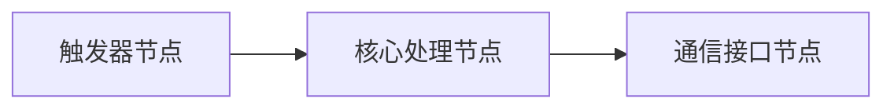
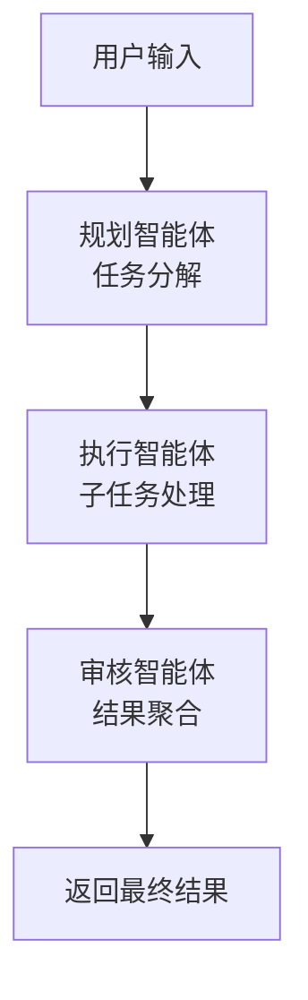
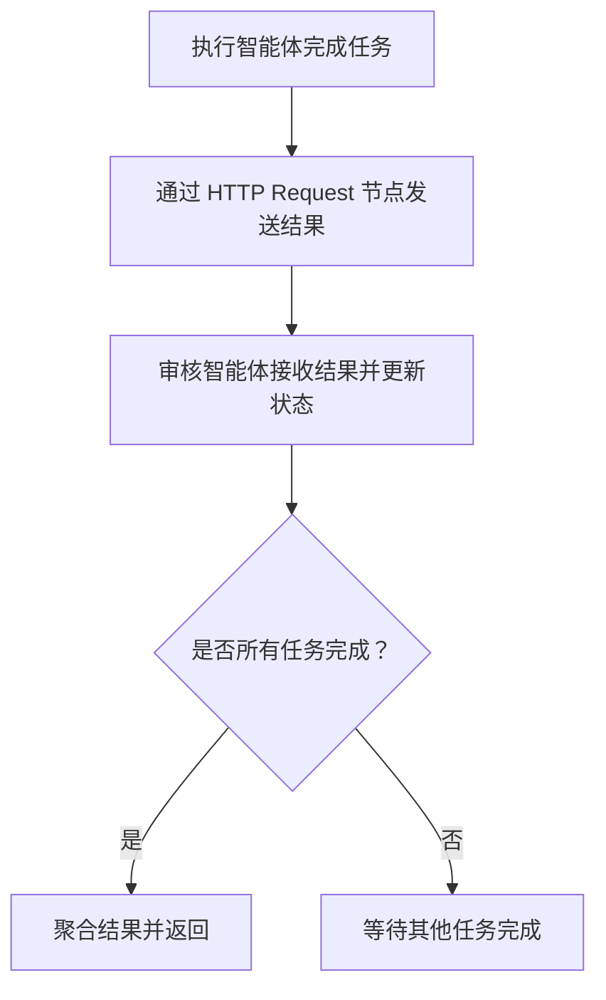
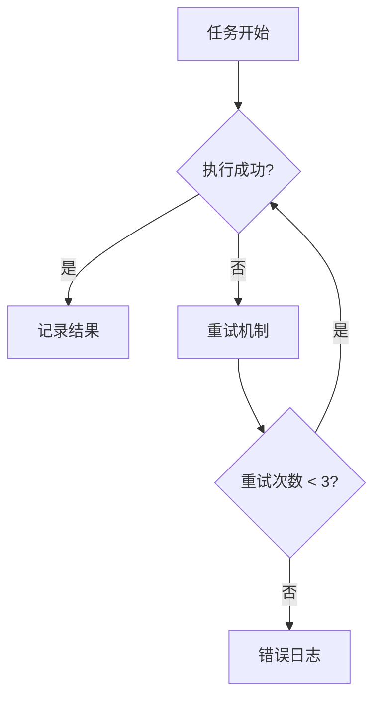
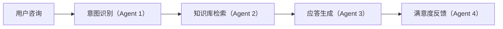
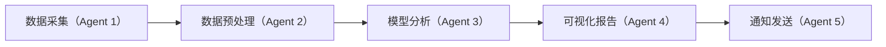
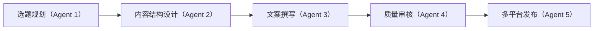

# 使用 n8n 构建多智能体系统的实践指南
## 1. 引言

多智能体系统（`MAS`, `Multi-Agent System`）是一种由多个相互协作的智能体（`Agent`）组成的系统结构。这些智能体具备自主性、交互性、协作性等特征，能够共同完成复杂任务。随着大语言模型（LLM）和自动化工具的发展，MAS 越来越多地被用于构建复杂的智能应用，例如多轮问答、自动化客服、内容生成等。

`n8n` 是一个可视化、开源的自动化工作流工具，支持编排各类 `API`、逻辑与 `AI` 服务。借助其强大的可扩展能力，我们可以快速构建模拟多智能体行为的系统，测试智能体之间的交互逻辑。

本指南将系统介绍如何使用 `n8n` 构建可运行的 `MAS`，从原理讲解到具体实现，适合开发者、研究者和对多智能体系统感兴趣的技术人员参考和实践。

## 2. 核心概念：n8n 中的多智能体系统架构
### 2.1 多智能体系统定义

`MAS` 是指由多个可以独立运行但又具备协作能力的智能体所组成的系统。类比来看，可以将每个智能体看作一个“**虚拟员工**”，各自拥有特定职责，通过消息传递和共享资源协同完成复杂任务。

这些智能体具有以下特点：

- **自主性**：能独立感知、决策与行动；
- **协作性**：智能体之间能够分工合作以完成更大目标；
- **通信能力**：通过共享内存、消息队列、`HTTP` 通信等机制进行信息交互；
- **异步性**：智能体彼此并不阻塞，可以并行工作。

### 2.2 在 n8n 中的实现方式

在 `n8n` 平台上，我们将每个**智能体**抽象为一个**工作流**，每个工作流负责特定的任务处理流程：

- **智能体工作流**：封装某一角色的行为逻辑；
- **通信机制**：通过 `Webhook`、`HTTP Request`、数据库中间表实现信息交换；
- **逻辑控制**：结合 `LLM` 节点、条件分支、函数节点等，构建智能响应链。

## 3. 环境准备：搭建开发环境
### 3.1 安装 n8n（推荐 Docker 部署）

```bash
docker run -it --rm \
  -p 5678:5678 \
  -v ~/.n8n:/home/node/.n8n \
  n8nio/n8n
```

命令说明：

* `-it`：以交互模式运行容器，便于查看日志和调试。
* `--rm`：容器停止后自动删除，适用于临时测试。
* `-p 5678:5678`：将主机的 `5678` 端口映射到容器的 `5678` 端口，`n8n` 默认使用此端口。
* `-v ~/.n8n:/home/node/.n8n`：将主机的 `~/.n8n` 目录挂载到容器内，确保数据持久化。

访问 `http://localhost:5678` 进入 `n8n` 控制台界面。

> 更多信息请参考：`https://docs.n8n.io/hosting/installation/docker/`

### 3.2 准备工作

1. 注册并获取 `DeepSeek` 的 `API Key`(`https://platform.deepseek.com/api_keys`)；
2. 安装 `API` 测试工具（如 `Postman` 或 `curl`）用于测试接口；
3. 可选组件（用于高级功能）：
   - `Redis`：实现状态追踪和共享；
   - `PostgreSQL`：持久化记录任务状态或日志。

## 4. 智能体设计原理
### 4.1 智能体工作流结构

在 `n8n` 中构建智能体，我们遵循统一的三段式结构：



这种结构保证每个智能体具有清晰的输入、内部处理与输出接口。

### 4.2 常用节点说明

1.  触发器节点（`Trigger Node`）：触发器节点负责启动工作流，常见的触发方式包括：
	* `Webhook Trigger`：监听外部 HTTP 请求，适用于接收外部系统的调用。
	* `Schedule Trigger`：定时触发工作流，适用于周期性任务。
	* `Manual Trigger`：手动启动工作流，适用于测试和调试。
	* 更多关于触发器节点的信息，请参考官方文档：
		* [n8n Trigger Node Documentation](https://docs.n8n.io/integrations/builtin/core-nodes/n8n-nodes-base.n8ntrigger/)
		* [Manual Trigger Node Documentation](https://docs.n8n.io/integrations/builtin/core-nodes/n8n-nodes-base.manualworkflowtrigger/)
2. 核心处理节点（`Core Processing Node`）：核心处理节点负责执行智能体的主要逻辑，包括：
	* `Function Node`：编写自定义 `JavaScript` 代码，处理数据和实现逻辑。
	* `LLM Integration Node`：集成大语言模型（如 `OpenAI`、`DeepSeek`）进行自然语言处理。
	* `If Node`：根据条件判断执行不同的路径。
	* `Set Node`：设置或修改数据字段。 
	* 这些节点的组合使用，可以实现复杂的业务逻辑和数据处理。
3. 通信接口节点（`Communication Interface Node`）：通信接口节点用于智能体之间或与外部系统的数据交互，常见的节点包括：
	* `HTTP Request Node`：发送 `HTTP` 请求，与外部 `API` 或其他智能体通信。
	* `Execute Workflow Node`：调用其他工作流，实现模块化和复用。
	* `Redis Node`：读写 `Redis` 数据库，进行状态管理和数据共享。

### 4.3 常用节点功能小结

| **节点类型** | **功能说明** | **官方文档链接**|
| ---------------- | -----------------------| ----------------------- | 
| **Webhook**      | 接收外部 `HTTP` 请求以触发工作流，支持多种 `HTTP` 方法（`GET`、`POST` 等），可配置响应方式（立即响应、等待工作流完成等）。 | [Webhook 节点文档](https://docs.n8n.io/integrations/builtin/core-nodes/n8n-nodes-base.webhook/) |
| **HTTP Request** | 向其他智能体或外部 `API` 主动发起 `HTTP` 请求，支持多种请求方法，适用于数据获取、任务下发等场景。                | [HTTP Request 节点文档](https://docs.n8n.io/integrations/builtin/core-nodes/n8n-nodes-base.httprequest/) |
| **LLM 节点**       | 集成大语言模型（如 `OpenAI`、`DeepSeek`）处理自然语言任务，实现文本生成、意图识别等功能。                  | [OpenAI Functions Agent 节点文档](https://docs.n8n.io/integrations/builtin/cluster-nodes/root-nodes/n8n-nodes-langchain.agent/openai-functions-agent/) |
| **Function**     | 编写自定义 `JavaScript` 代码，处理数据转换、逻辑判断等，增强工作流的灵活性。                         | [Function 节点文档](https://docs.n8n.io/integrations/builtin/core-nodes/n8n-nodes-base.code/) |
| **Redis**        | 与 Redis 数据库交互，实现状态追踪、结果存储、消息发布等功能，适用于缓存和快速数据访问。                     | [Redis 节点文档](https://docs.n8n.io/integrations/builtin/app-nodes/n8n-nodes-base.redis/) |
| **Postgres**     | 与 `PostgreSQL` 数据库交互，支持执行查询、插入、更新等操作，适用于持久化存储和复杂数据管理。                 | [Postgres 节点文档](https://docs.n8n.io/integrations/builtin/app-nodes/n8n-nodes-base.postgres/) |

## 5. 实战：构建三智能体协作系统

### 5.1 系统目标与流程

本系统模拟一个自动化任务处理流程，包含三个智能体，分别负责任务规划、执行和审核。



该流程展示了多智能体系统中任务分解、并发执行与结果汇总的协作机制。

### 5.2 规划智能体工作流实现

#### 功能流程：
1. `Webhook` 节点接收用户输入的任务；
2. 调用 `DeepSeek API` 对任务进行分析与拆解；
3. `Function` 节点解析响应结果，批量发送子任务至执行智能体。

#### 输入提取节点（Function）：

```javascript
return [{
  json: {
    user_input: $json.body.text
  }
}];
```

#### LLM 提示词设置（Prompt）：

```text
你作为任务规划专家，请将以下任务拆分为3个子任务：
{{ $json["user_input"] }}
按JSON数组格式返回，字段为task。
```


### 5.3 执行智能体工作流实现

#### 执行逻辑：
1. `Webhook` 节点接收子任务；
2. 模拟任务执行过程（可替换为实际逻辑）；
3. 通过 HTTP Request 节点将结果发送至审核智能体。

#### 模拟执行节点（Function）：

```javascript
const task = $json.task;
return [{ 
  json: { 
    result: `任务【${task}】执行完成，耗时 ${Math.random().toFixed(2)} 秒`
  } 
}];
```

### 5.4 审核智能体工作流实现

#### 审核逻辑：
1. 每个子任务结果存入 `Redis`（或内存）；
2. 检查是否收到全部 3 个子任务结果；
3. 聚合结果后返回至用户。

#### 状态判断逻辑（Function）：

```javascript
const completedTasks = $input.all().map(item => item.json);
if(completedTasks.length === 3) {
  return [{ json: { final_report: completedTasks } }];
} else {
  return [];
}
```

通过上述步骤，我们可以在 `n8n` 中构建一个多智能体协作系统，实现任务的自动化处理。

## 6. 进阶功能：状态管理与协作控制

### 6.1 状态跟踪方案对比

在多智能体系统中，状态管理是确保各智能体协同工作的关键。`n8n` 提供了多种方式来实现状态的跟踪和管理，适用于不同的应用场景。

| **方案类型** | **实现方式** | **适用场景** |
|------------------|------------------------------|------------------------------|
| 上下文变量       | 使用 `Set` / `Get` 节点          | 简单、短期状态管理           |
| `Redis Hash` 存储  | 利用 `Redis` 节点存储任务状态  | 并发任务、临时状态           |
| `PostgreSQL`       | 通过表结构建模持久化存储任务信息 | 复杂流程、长期状态管理       |

**说明：**

- **上下文变量**：适用于单次执行中需要传递的简单状态信息，如计数器、标志位等。
- **Redis Hash 存储**：适用于需要快速读写的并发任务状态管理，如任务队列、临时缓存等。
- **PostgreSQL**：适用于需要持久化存储的复杂流程，如任务历史记录、用户会话信息等。

### 6.2 异步控制策略

在多智能体系统中，异步控制策略有助于提高系统的响应性和资源利用率。以下是常见的异步控制策略：

1. **回调机制**：执行智能体在完成任务后，主动通过 `HTTP Request` 节点将结果发送给审核智能体，实现非阻塞的任务处理。
2. **轮询机制**：审核智能体使用定时触发器（如 `Cron` 节点）定期检查任务状态，适用于无法使用回调的场景。
3. **事件驱动**：集成消息队列（如 `NATS`、`Kafka`）实现事件驱动的工作流触发，适用于高并发、复杂的系统架构。



通过上述策略，`n8n` 能够灵活地处理多智能体系统中的异步任务，确保各智能体之间的高效协作。

## 7. 调试与优化实践

### 7.1 调试技巧

* **逐节点验证流程**：右键点击节点，选择「执行此节点」，可单独验证节点逻辑，便于定位问题。
* **使用 `console.log()` 输出调试信息**：在 `Function` 或 `Code` 节点中添加 `console.log()` 语句，调试信息将显示在浏览器控制台中，便于观察变量值和流程状态。
* **利用版本控制管理测试方案**：合理使用 `n8n` 的「版本控制」功能，记录和管理不同的测试方案，便于回溯和比较。
* **重现历史执行数据**：通过「执行记录」面板，选择失败的执行记录，点击「在编辑器中调试」，可加载历史数据进行调试，提升问题定位效率。

### 7.2 错误处理机制示意图



在 `n8n` 中，可通过以下方式实现上述错误处理机制：

* **启用节点的「失败重试」选项**：在支持的节点设置中，启用「失败重试」功能，配置重试次数和间隔时间，以应对临时性错误。
* **使用错误分支处理失败情况**：在节点设置中，将「错误处理」设置为「继续（使用错误输出）」，可在错误分支中添加 `Wait` 节点实现延迟重试。
* **配置全局错误工作流**：创建一个以「错误触发器」为起点的工作流，并在主工作流的设置中指定该错误工作流，实现统一的错误通知和处理机制。

### 7.3 性能优化建议

* **子任务并发处理**：利用 `n8n` 的并行处理能力，批量处理子任务，避免串行执行造成的性能瓶颈。
* **使用缓存机制减少数据库访问**：在高频访问的场景中，使用 `Redis` 或内存缓存存储中间结果，减少对数据库的访问次数，提高响应速度。
* **复用子工作流（Subworkflow）**：将重复使用的逻辑封装为子工作流，主工作流通过「执行工作流」节点调用，提高模块化程度，便于维护和复用。
* **优化节点配置**：在 `HTTP Request` 等节点中，合理配置超时时间和并发限制，避免因外部服务响应慢导致的阻塞。
* **监控和日志分析**：启用 `n8n` 的日志功能，定期分析执行日志，识别性能瓶颈和异常情况，及时进行优化。

## 8. 典型应用场景

本节介绍 `3` 个适合使用 `n8n` 构建多智能体系统的典型应用场景，每个场景都体现了“任务拆解—角色协作—结果回传”的 MAS 核心思想。

### 8.1 智能客服系统

#### 场景说明

企业在客服接待中面临大量重复问题、复杂业务咨询与多轮对话需求。通过构建智能客服系统，可自动应答、筛选问题并收集用户反馈。

#### 多智能体流程



#### 关键智能体设计建议

| **智能体**| **功能说明** | **n8n 实现建议** |
|------------------|---------------------------|-------------------|
| **意图识别 Agent** | 调用 `NLP` 模型识别用户问题类型 | `LLM` 节点 + 条件路由 |
| **知识库检索 Agent** | 根据识别结果匹配 FAQ 或调用向量数据库 | `HTTP Request` + `Qdrant`/`Weaviate` 节点 |
| **应答生成 Agent** | 使用 `Prompt Template` 生成多轮回答内容 | `LLM` 节点 + 模板填充 |
| **满意度反馈 Agent** | 收集用户评价用于后续优化 | 表单 `Webhook` + 数据存储 |

### 8.2 自动化数据分析系统

#### 场景说明

适用于定期或触发式的数据处理任务，如销售日报、舆情分析或实时报警系统，要求自动采集、处理和分析，并通知相关人员。

#### 多智能体流程



#### 关键智能体设计建议

| **智能体** | **功能说明** | **n8n 实现建议** |
|--------------------|--------------------------------------------------|-------------------------------------------|
| **数据采集 Agent** | 定时抓取数据来源（`API`、`RSS`、数据库等） | `Cron` 节点 + `HTTP Request` / `Query` 节点 |
| **预处理 Agent** | 数据清洗、格式化、缺失处理 | `Function` 节点 + `Set` 节点 |
| **模型分析 Agent** | 调用外部 ML 服务进行聚类/分类/预测分析 | `HTTP Request` 节点 + `Python` 后端服务 |
| **可视化报告 Agent** | 生成图表、表格或自然语言分析总结 | `Chart API` 调用或 `Markdown` 汇总            |
| **通知发送 Agent** | 发送到 `Email`、`Slack`、飞书或生成日报 `PDF` 存档  | `Email` 节点 / `Webhook` / `Telegram` 节点等 |

### 8.3 内容生成流水线

#### 场景说明

适用于媒体、教育、营销等行业的内容自动化生产链，包括从创意生成、内容撰写到多平台发布。

#### 多智能体流程



#### 关键智能体设计建议

| **智能体** | **功能说明** | **n8n 实现建议** |
|----------------------|-----------------------------------------------|----------------------------------------------|
| **选题规划 Agent** | 调用 `LLM` 生成内容主题，结合关键词/热点 | `LLM` 节点 + `Google Trends API` / `RSS Feed` |
| **结构设计 Agent** | 输出标题、副标题、段落结构草稿 | `LLM` 节点 + `Prompt` 结构模板 |
| **文案撰写 Agent** | 按结构生成文章主体内容 | `LLM` 节点 + 语气/风格控制 `Prompt`|
| **质量审核 Agent** | 调用 `LLM` 评估逻辑完整性、可读性与语法问题 | `LLM` 节点 + 多轮交互 / 规则检查 `Function` 节点 |
| **多平台发布 Agent** | 将内容同步发布至微信公众号、`WordPress`、知乎等 | `HTTP Request` + 第三方平台 `API` 节点 |

## 9. 小结

通过 `n8n` 与 `LLM` 的组合，我们可以低门槛构建具备 **多智能体系统（MAS）特征** 的自动化工作流程。系统具备以下核心能力：

* **任务智能拆解**：借助 `LLM` 理解并分解用户请求；
* **并发任务执行**：多个智能体可独立并行处理子任务；
* **流程可扩展与组合**：通过节点封装与子工作流重用，实现复杂逻辑的组合构建；
* **审阅与反馈闭环**：支持对任务结果的审核、聚合与用户反馈，形成闭环。

### 未来可扩展方向

为了实现更复杂、更智能的多智能体协作系统，可逐步引入以下能力：

| **方向** | **说明** |
| ------- | ----------------------------------------------------- |
| **向量数据库集成** | 使用如 `Weaviate`、`Qdrant` 提供知识检索支持，提升智能体记忆力与语义推理能力      |
| **智能体协商机制** | 引入规则引擎或强化学习，实现智能体之间的任务分配、冲突处理与协商能力 |
| **可观测性支持** | 接入 `Prometheus` + `Grafana`，实现运行状态监控、性能瓶颈分析与智能体健康状态追踪 |
| **安全控制机制** | 加入身份验证、接口权限控制和数据脱敏机制，确保多智能体系统可控可信 |
| **自适应能力提升** | 利用 `Prompt` 优化与模型微调，让智能体具备环境感知与策略自适应能力 |

