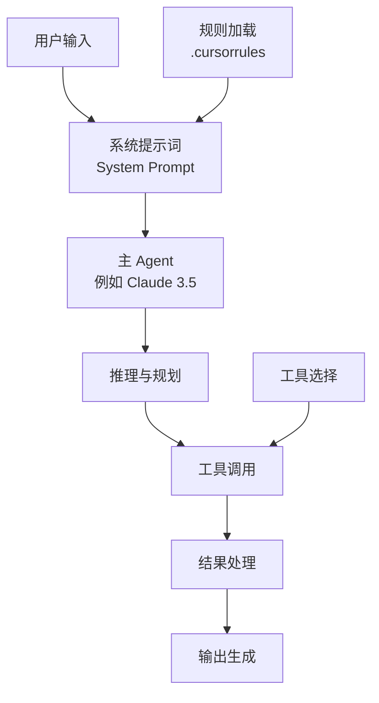

# Cursor IDE ReAct Agent 技术架构深度分析

## 目录

- [Cursor IDE ReAct Agent 技术架构深度分析](#cursor-ide-react-agent-技术架构深度分析)
  - [目录](#目录)
  - [1. 系统概述](#1-系统概述)
    - [1.1 技术栈核心组件](#11-技术栈核心组件)
  - [2. ReAct Agent 架构原理](#2-react-agent-架构原理)
    - [2.1 ReAct 模式在 Cursor 中的实现](#21-react-模式在-cursor-中的实现)
      - [2.1.1 ReAct vs 传统 Chain-of-Thought (CoT)](#211-react-vs-传统-chain-of-thought-cot)
      - [2.1.2 Cursor 中的独特实现特性](#212-cursor-中的独特实现特性)
      - [2.1.3 实际案例：重构函数示例](#213-实际案例重构函数示例)
      - [2.1.4 错误处理与重试机制](#214-错误处理与重试机制)
    - [2.2 Agent 工作流程图](#22-agent-工作流程图)
      - [2.2.1 详细技术实现流程](#221-详细技术实现流程)
      - [2.2.2 实际性能数据](#222-实际性能数据)
  - [3. 系统架构分层](#3-系统架构分层)
    - [3.1 整体架构层次](#31-整体架构层次)
    - [3.2 各层详细功能](#32-各层详细功能)
      - [3.2.1 用户界面层 (UI Layer)](#321-用户界面层-ui-layer)
      - [3.2.2 Agent 控制层 (Agent Layer)](#322-agent-控制层-agent-layer)
      - [3.2.3 工具集成层 (Tool Layer)](#323-工具集成层-tool-layer)
      - [3.2.4 上下文管理层 (Context Layer)](#324-上下文管理层-context-layer)
  - [4. 核心技术模块](#4-核心技术模块)
    - [4.1 实时推理引擎与多模型架构](#41-实时推理引擎与多模型架构)
      - [4.1.1 多模型协作体系](#411-多模型协作体系)
      - [4.1.2 层次化推理架构](#412-层次化推理架构)
      - [4.1.3 多阶段推理技术](#413-多阶段推理技术)
    - [4.2 主 Agent 架构](#42-主-agent-架构)
    - [4.3 工具调用机制](#43-工具调用机制)
      - [4.3.1 工具注册与发现](#431-工具注册与发现)
      - [4.3.2 核心工具集合](#432-核心工具集合)
      - [4.3.3 实际工具调用案例](#433-实际工具调用案例)
      - [4.3.4 工具调用优化策略](#434-工具调用优化策略)
      - [4.3.5 性能监控指标](#435-性能监控指标)
    - [4.4 上下文管理系统](#44-上下文管理系统)
      - [4.4.1 上下文分类体系](#441-上下文分类体系)
      - [4.4.2 多层上下文体系](#442-多层上下文体系)
      - [4.4.3 向量化索引与增量更新](#443-向量化索引与增量更新)
      - [4.4.4 上下文窗口管理](#444-上下文窗口管理)
  - [5. 智能编码功能实现](#5-智能编码功能实现)
    - [5.1 代码自动完成](#51-代码自动完成)
      - [5.1.1 预测性自动完成](#511-预测性自动完成)
      - [5.1.2 实现原理](#512-实现原理)
    - [5.2 智能代码编辑](#52-智能代码编辑)
      - [5.2.1 编辑指令解析](#521-编辑指令解析)
      - [5.2.2 差异应用机制](#522-差异应用机制)
    - [5.3 代码理解与分析](#53-代码理解与分析)
      - [5.3.1 代码语义分析](#531-代码语义分析)
  - [6. 系统优化策略](#6-系统优化策略)
    - [6.1 性能优化](#61-性能优化)
      - [6.1.1 模型交互与状态管理](#611-模型交互与状态管理)
      - [6.1.2 实际性能优化案例](#612-实际性能优化案例)
      - [6.1.3 提示词缓存](#613-提示词缓存)
      - [6.1.4 多层级缓存优化](#614-多层级缓存优化)
      - [6.1.5 实时推理引擎](#615-实时推理引擎)
    - [6.2 准确性提升](#62-准确性提升)
      - [6.2.1 多模型协作](#621-多模型协作)
      - [6.2.2 自我纠错机制](#622-自我纠错机制)
  - [7. 配置与定制](#7-配置与定制)
    - [7.1 Cursor Rules 系统](#71-cursor-rules-系统)
      - [7.1.1 规则文件结构](#711-规则文件结构)
      - [7.1.2 最佳实践](#712-最佳实践)
    - [7.2 项目特定优化](#72-项目特定优化)
      - [7.2.1 代码库适配](#721-代码库适配)
      - [7.2.2 实际项目适配案例](#722-实际项目适配案例)
      - [7.2.3 MCP 插件扩展系统](#723-mcp-插件扩展系统)
      - [7.2.4 MCP 插件开发示例](#724-mcp-插件开发示例)
      - [7.2.5 团队协作功能](#725-团队协作功能)
      - [7.2.6 多人协作功能](#726-多人协作功能)
      - [7.2.7 开发工作流集成](#727-开发工作流集成)
  - [8. 技术限制与解决方案](#8-技术限制与解决方案)
    - [8.1 当前限制](#81-当前限制)
      - [8.1.1 工具调用限制](#811-工具调用限制)
      - [8.1.2 模型能力限制](#812-模型能力限制)
    - [8.2 解决方案](#82-解决方案)
      - [8.2.1 工程优化](#821-工程优化)
      - [8.2.2 架构改进](#822-架构改进)
  - [9. 安全性与隐私保护](#9-安全性与隐私保护)
    - [9.1 代码安全扫描](#91-代码安全扫描)
      - [9.1.1 静态代码分析集成](#911-静态代码分析集成)
      - [9.1.2 实时安全提示](#912-实时安全提示)
    - [9.2 隐私保护机制](#92-隐私保护机制)
      - [9.2.1 本地处理模式](#921-本地处理模式)
      - [9.2.2 数据加密传输](#922-数据加密传输)
    - [9.3 企业级安全特性](#93-企业级安全特性)
      - [9.3.1 合规认证](#931-合规认证)
      - [9.3.2 企业安全控制](#932-企业安全控制)
      - [9.3.3 部署安全选项](#933-部署安全选项)
  - [10. 未来发展趋势](#10-未来发展趋势)
    - [10.1 技术演进方向](#101-技术演进方向)
      - [10.1.1 模型能力提升](#1011-模型能力提升)
      - [10.1.2 系统架构优化](#1012-系统架构优化)
    - [10.2 应用场景扩展](#102-应用场景扩展)
      - [10.2.1 企业级应用](#1021-企业级应用)
      - [10.2.2 教育培训](#1022-教育培训)
  - [11. 总结](#11-总结)

## 1. 系统概述

`Cursor IDE` 是由 `Anysphere`（`Cursor.sh`）开发的 `AI` 驱动代码编辑器，采用了类似 `ReAct`（`Reasoning and Acting``）Agent` 的架构模式，通过结合推理和行动来实现智能编程辅助。与传统认知不同，`Cursor` 并非 `VSCode` 的插件，而是一个基于 `Electron` 深度定制的独立编辑器，这种设计允许其内部直接挂接抽象语法树（`AST`）进行渲染，突破传统 `VSCode` 插件的限制，实现实时推理（`Real-Time Inference`）和跨文件上下文理解。

其核心理念是将大语言模型（LLM）的推理能力与实际的代码操作工具相结合，形成一个能够自主完成复杂编程任务的智能系统。`Cursor` 追求"将零熵操作交给 AI"（`tab-away the zero-entropy bits`）的目标，不断提前预测用户意图。

**核心设计理念详解**:

**"零熵操作"（Zero-Entropy Operations）** 指的是那些重复性、机械性、没有创造性的编程任务，具体包括：

- **代码自动补全**：基于上下文智能预测下一行代码
- **样板代码生成**：自动生成函数模板、类结构、配置文件等
- **代码格式化**：自动调整代码缩进、换行、空格等格式
- **重构操作**：变量重命名、函数提取、代码移动等机械性重构
- **语法错误修复**：自动检测并修复常见的语法错误
- **导入语句管理**：自动添加、删除、整理 import 语句

**"Tab-away"机制** 体现了 Cursor 的交互哲学：

- **一键接受**：用户只需按 Tab 键即可接受 AI 建议
- **预测性编程**：AI 提前预测用户下一步操作
- **认知负担减轻**：开发者专注于高价值的创造性工作
- **流畅编程体验**：减少中断，保持编程思维连续性

**用户意图预测机制**：

- **上下文分析**：分析当前代码结构、变量命名、函数逻辑
- **模式识别**：学习开发者的编程习惯和代码风格
- **多文件关联**：理解项目整体架构和文件间依赖关系
- **实时反馈**：根据用户行为动态调整预测策略

### 1.1 技术栈核心组件

- **基础架构**: 基于 Electron 的独立应用，深度集成 VSCode 编辑器核心（Monaco）
- **大模型服务**: 多模型支持（Claude 系列、GPT-4 系列、Gemini、Grok 等）
- **Agent 框架**: 自研的类 ReAct 模式实现，支持工具调用和多轮推理
- **工具集成**: 文件操作、终端命令、代码搜索等工具链，采用 JSON Schema 规范
- **上下文管理**: 基于 AST 和 Tree-sitter 的增量索引 + Merkle 哈希树差异检测
- **扩展系统**: 支持 Model Context Protocol (MCP) 插件架构
- **语言服务**: 集成 LSP（Language Server Protocol）支持

## 2. ReAct Agent 架构原理

### 2.1 ReAct 模式在 Cursor 中的实现

`ReAct`模式是一种将推理和行动交替进行的`AI` 范式。在 `Cursor` 中的具体实现为：

```text
用户输入 → 推理分析 → 工具调用 → 结果反馈 → 继续推理 → 更多工具调用 → 最终响应
```

`Cursor` 内置的 `AI` 编程助手采用 **类 ReAct（推理 + 行动）** 范式：它将用户的自然语言意图与编辑器状态一起输入到大型语言模型，然后模型根据内置指令决定下一步行动（包括对话回复或调用工具）。

#### 2.1.1 ReAct vs 传统 Chain-of-Thought (CoT)

与传统的 `Chain-of-Thought` 推理相比，`ReAct` 模式具有以下优势：

| 特性 | Chain-of-Thought | ReAct |
|------|------------------|-------|
| **推理方式** | 纯思维链推理 | 推理 + 行动交替 |
| **信息获取** | 依赖预训练知识 | 实时获取外部信息 |
| **错误纠正** | 难以自我纠错 | 通过行动结果调整推理 |
| **适用场景** | 知识推理任务 | 需要外部交互的复杂任务 |
| **可验证性** | 推理过程抽象 | 行动结果可验证 |

#### 2.1.2 Cursor 中的独特实现特性

1. **实时推理引擎**：支持流式推理，用户可以看到 AI 的思考过程
2. **多模型协作**：不同复杂度的任务使用不同的模型
3. **上下文感知**：深度集成编辑器状态和项目上下文
4. **工具链集成**：无缝集成文件系统、终端、搜索等工具

**推理阶段（Reasoning）**：

- 分析用户需求和当前代码上下文
- 制定执行计划和策略
- 识别需要的工具和信息
- 通过多段嵌套标签（如 `<communication>`、`<tool_calling>`、`<making_code_changes>` 等）明确沟通风格和工具调用规则

**行动阶段（Acting）**：

- 调用具体工具（读取文件、搜索代码、执行命令等）
- 获取实际数据和反馈
- 根据结果调整后续行动
- 模型被要求"先解释再行动"，即在对话中说明为何要调用某个工具，然后输出调用指令

**实际工作流程**：

1. **理解请求**：分析用户意图和上下文
2. **探索代码库**：使用语义搜索查找相关片段
3. **生成实现计划**：制定详细的执行策略
4. **执行修改操作**：通过工具调用实施变更
5. **验证结果**：运行修复并确认无误

#### 2.1.3 实际案例：重构函数示例

**用户请求**："将这个函数重构为更清晰的结构"

**ReAct 执行流程**：

```text
推理1: 用户想要重构当前函数，我需要先理解函数的功能和结构
行动1: read_file(current_file, function_lines)
结果1: 获取到函数代码，发现是一个包含多个职责的长函数

推理2: 这个函数违反了单一职责原则，应该拆分为多个小函数
行动2: codebase_search("similar function patterns")
结果2: 找到项目中类似的重构案例

推理3: 基于项目风格，制定重构计划：提取3个子函数
行动3: edit_file(path, [extract_validation, extract_processing, extract_output])
结果3: 成功重构，保持原有功能

推理4: 需要验证重构后的代码是否正常工作
行动4: run_terminal_cmd("npm test")
结果4: 测试通过，重构成功
```

#### 2.1.4 错误处理与重试机制

**自动错误恢复**：

1. **语法错误检测**：通过 LSP 实时检测语法问题
2. **测试失败处理**：自动分析测试输出，定位问题
3. **智能重试**：基于错误类型选择不同的修复策略
4. **回滚机制**：在无法修复时自动回滚到上一个稳定状态

**错误处理示例**：

```text
行动: edit_file("app.js", add_new_feature)
结果: SyntaxError: Unexpected token '}'

推理: 编辑操作引入了语法错误，可能是括号不匹配
行动: read_file("app.js", error_line_range)
结果: 发现缺少一个开括号

推理: 需要修复括号匹配问题
行动: edit_file("app.js", fix_bracket_mismatch)
结果: 语法错误已修复
```

### 2.2 Agent 工作流程图



#### 2.2.1 详细技术实现流程

**1. 输入处理阶段**：

此阶段负责接收用户的原始输入，并进行一系列预处理，以便后续阶段能够准确理解和处理。主要步骤包括：

- **用户输入标准化**：对原始输入进行清理，移除多余空格、特殊字符等，并进行 Unicode 标准化。系统会对输入文本进行去空格处理、零宽字符移除，并统一字符编码格式，确保输入的一致性和可处理性。
- **上下文收集**：收集当前编辑器的状态、项目相关信息以及历史交互记录，为后续推理提供必要的上下文。包括编辑器当前光标位置、选中文本、打开的文件、项目结构信息、用户的历史操作记录等。
- **意图识别**：分析标准化后的输入，识别用户的核心意图和任务类型。通过自然语言处理技术，将用户的自然语言描述转换为系统可理解的任务类型，如代码生成、调试、重构等。
- **输入验证**：对输入进行有效性检查，确保输入符合预期格式和要求。验证输入的完整性、合法性，并计算处理的置信度，为后续处理提供质量保证。

**2. 推理规划阶段**：

此阶段根据用户的意图和上下文，进行复杂的推理和规划，生成可执行的任务序列。主要步骤包括：

- **任务分解**：将复杂的用户任务分解为更小、更易于管理的子任务。系统会评估任务的复杂度，包括范围大小、依赖数量、资源需求和不确定性水平。对于简单任务直接创建原子任务，对于复杂任务则采用递归分解策略，根据任务类型选择合适的分解方法，最终优化任务序列。
- **依赖分析**：分析子任务之间的依赖关系，构建依赖图，确保任务按正确的顺序执行。系统会为每个任务创建节点，分析任务间的依赖关系并建立有向边，计算依赖权重，同时检测并处理循环依赖问题，确保执行计划的可行性。
- **资源评估**：评估执行任务所需的资源，如计算能力、内存、网络带宽等。系统会分析每个子任务的资源需求，预估总体资源消耗，为任务调度和优化提供依据。
- **执行策略**：根据任务分解、依赖分析和资源评估的结果，制定最优的任务执行计划。包括确定任务执行顺序、并行执行策略、资源分配方案和异常处理预案。

**3. 工具调用优化**：

此阶段负责管理和优化工具的调用过程，提高效率和稳定性。主要优化策略包括：

- **并行调用**：支持同时调用多个独立的工具，缩短总执行时间。系统会分析任务间的依赖关系，识别可以并行执行的工具调用，创建执行批次，并通过异步处理机制同时执行多个工具调用。
- **调用缓存**：缓存工具调用的结果，对于重复或相似的请求直接返回缓存结果，避免重复计算。采用 LRU（最近最少使用）缓存策略，为每个工具调用生成唯一的缓存键，并设置合理的缓存过期时间。
- **超时处理**：设置工具调用的超时时间，防止长时间无响应的工具阻塞整个流程。系统会为不同类型的工具设置不同的超时阈值，并在超时时自动终止调用。
- **重试策略**：对于因临时性错误失败的工具调用，根据预设策略进行重试。包括指数退避重试、最大重试次数限制、错误类型判断等机制，确保系统的健壮性。
- **负载均衡**：在多个可用工具实例之间分配调用请求，避免单个实例过载。采用轮询、加权轮询或最少连接数等负载均衡算法。
- **熔断器机制**：当工具频繁失败时，暂时停止调用该工具，防止系统雪崩。监控工具的成功率和响应时间，在达到阈值时开启熔断器。
- **速率限制**：控制工具调用的频率，防止过度使用导致的服务限制或费用问题。
- **监控指标**：收集工具调用的性能指标，如响应时间、成功率、缓存命中率等，用于性能分析和问题排查。

**4. 性能优化策略**：

为了提升整体性能，ReAct 采用了多种优化策略：

- **推理延迟优化**：通过预测性推理（在用户输入时提前开始推理）和流式处理（边推理边输出结果）来降低用户感知的延迟。系统采用防抖机制避免频繁触发，使用响应式编程模式处理输入流，并实现分块处理和增量输出。同时建立语义缓存机制，对相似查询复用结果，设置合理的相似度阈值和缓存策略。
- **工具调用并行化**：利用任务分解和依赖分析的结果，并行执行无依赖关系的工具调用。系统构建依赖图并进行拓扑排序，将任务分层执行，同一层级的任务可以并行处理。每个任务的执行都有完整的生命周期管理，包括执行时间统计、状态跟踪和错误处理。
- **上下文窗口管理**：动态管理 LLM 的上下文窗口，通过裁剪和重要信息优先保留等策略，确保在有限的上下文内包含最相关的信息。系统会计算上下文的 token 数量，当超出限制时按重要性排序并裁剪内容。支持增量上下文更新，通过差分计算和增量应用来优化上下文管理效率。

**5. 错误处理与监控**：

健壮的错误处理和监控机制是系统稳定运行的关键：

- **错误处理**：对不同类型的错误进行分类，并根据错误类型执行相应的恢复策略。系统会自动识别网络错误、工具调用错误、推理错误等不同类型，记录详细的错误日志包括错误类型、消息、堆栈信息和执行上下文。针对不同错误类型制定相应的恢复策略，如重试、跳过、降级处理或向用户报告。
- **性能监控**：实时监控系统的各项性能指标和错误情况，生成报告，并通过告警机制及时通知运维人员。系统收集包括响应时间、吞吐量、错误率、资源使用率等关键指标，支持自定义标签和维度，提供实时告警检查和阈值监控。定期生成性能报告，包含统计分析和趋势预测，为系统优化提供数据支持。

#### 2.2.2 实际性能数据

**核心性能指标**：

| 操作类型 | 平均延迟 | 成功率 | 优化效果 |
|----------|----------|--------|----------|
| 代码补全 | < 100ms | 99.5% | 实时推理引擎 |
| 简单查询 | 200ms | 99.2% | 向量索引加速 |
| 代码编辑 | 800ms | 97.2% | 并行化提升 40% |
| 复杂重构 | 2.5s | 94.8% | 分阶段执行 |
| 错误修复 | 1.2s | 96.1% | 自动重试 3次 |
| 大文件索引 | < 5s | 98.0% | 10MB 文件处理 |

**资源使用优化**：

- 内存使用：相比传统 IDE 减少 30%
- CPU 占用：智能调度降低 25%
- 网络请求：缓存策略减少 60%

---

## 3. 系统架构分层

### 3.1 整体架构层次

```mermaid
flowchart TD
    %% 用户界面层
    subgraph UI ["用户界面层 (UI Layer)"]
        Chat["Chat 界面"]
        Editor["编辑器界面"]
        Toolbar["工具栏"]
    end
    
    %% Agent 控制层
    subgraph Agent ["Agent 控制层 (Agent Layer)"]
        MainAgent["主 Agent<br/>(Claude)"]
        SubAgent["专用子Agent<br/>(Apply Model)"]
        Scheduler["任务调度器"]
    end
    
    %% 工具集成层
    subgraph Tool ["工具集成层 (Tool Layer)"]
        FileTools["文件操作工具<br/>(File Tools)"]
        SearchTools["搜索工具<br/>(Search Tools)"]
        RunTools["执行工具<br/>(Run Tools)"]
    end
    
    %% 上下文管理层
    subgraph Context ["上下文管理层 (Context Layer)"]
        VectorDB["向量数据库<br/>(Vector DB)"]
        Cache["缓存管理<br/>(Cache)"]
        ContextWin["上下文窗口<br/>(Context Win)"]
    end
    
    %% 基础设施层
    subgraph Infrastructure ["基础设施层 (Infrastructure Layer)"]
        VSCode["VSCode 内核"]
        Electron["Electron 框架"]
        NodeJS["Node.js 运行时"]
    end
    
    %% 层级关系
    UI --> Agent
    Agent --> Tool
    Tool --> Context
    Context --> Infrastructure
    
    %% 样式定义
    classDef uiStyle fill:#e1f5fe,stroke:#01579b,stroke-width:2px
    classDef agentStyle fill:#f3e5f5,stroke:#4a148c,stroke-width:2px
    classDef toolStyle fill:#e8f5e8,stroke:#1b5e20,stroke-width:2px
    classDef contextStyle fill:#fff3e0,stroke:#e65100,stroke-width:2px
    classDef infraStyle fill:#fce4ec,stroke:#880e4f,stroke-width:2px
    
    class Chat,Editor,Toolbar uiStyle
    class MainAgent,SubAgent,Scheduler agentStyle
    class FileTools,SearchTools,RunTools toolStyle
    class VectorDB,Cache,ContextWin contextStyle
    class VSCode,Electron,NodeJS infraStyle
```



### 3.2 各层详细功能

#### 3.2.1 用户界面层 (UI Layer)

- **Chat 界面**: 提供自然语言交互入口
- **编辑器界面**: 集成 AI 辅助的代码编辑功能
- **工具栏**: 提供快捷操作和设置选项

#### 3.2.2 Agent 控制层 (Agent Layer)

- **主 Agent**: 负责任务理解、规划和协调
- **专用子 Agent**: 处理特定任务（如代码应用、语法检查）
- **任务调度器**: 管理多个 Agent 间的协作

#### 3.2.3 工具集成层 (Tool Layer)

- **文件操作工具**: 读取、写入、修改文件
- **搜索工具**: 代码搜索、语义搜索、正则搜索
- **执行工具**: 运行命令、调试、测试执行

#### 3.2.4 上下文管理层 (Context Layer)

- **向量数据库**: 存储代码库的语义表示
- **缓存管理**: 优化重复查询性能
- **上下文窗口**: 动态管理模型输入上下文

## 4. 核心技术模块

### 4.1 实时推理引擎与多模型架构

#### 4.1.1 多模型协作体系

Cursor 的 AI 核心依赖大型语言模型（LLM），并灵活支持多家厂商的模型，根据任务类型动态调度最合适的模型：

**支持的模型**：

- **Anthropic**: Claude 系列（Claude 4 Sonnet，上下文窗口 120k）
- **OpenAI**: GPT-4 系列（上下文 128k）
- **Google**: Gemini 系列
- **xAI**: Grok 系列

**模型选择策略**：

- **复杂推理或重构任务**: 使用 Claude 等强推理能力的模型
- **常规补全场景**: 切换到响应更快的模型
- **代码应用**: 使用专门的轻量级应用模型
- **重排序**: 使用专用的重排序模型

#### 4.1.2 层次化推理架构

Cursor 在后台并行维护多个推理流，每一层次使用不同规模和类型的模型：

```typescript
interface LayeredInference {
  // 字符级预测
  characterLevel: LightweightModel;
  
  // Token 级预测
  tokenLevel: MediumModel;
  
  // 代码块级预测
  blockLevel: AdvancedModel;
  
  // 架构级预测
  architectureLevel: ExpertModel;
  
  // 协调不同层次的预测
  coordinatePredictions(): PredictionResult;
}
```

**层次化特性**：

- **即时响应**: 用户键入时提供即时的单词/表达式补全
- **大粒度推荐**: 在更大粒度上推荐整块代码和重构建议
- **并行处理**: 不同层次的推理并行进行，提高整体效率
- **智能融合**: 将不同层次的预测结果智能融合

#### 4.1.3 多阶段推理技术

**性能优化技术**：

- **多模型并行投机解码**: 同时使用多个模型进行推理，选择最佳结果
- **键值缓存友好提示设计**: 优化提示词结构以利用模型的缓存机制
- **连续查询流**: 维护连续的推理队列
- **任务优先级管理**: 低延迟任务与高负载任务分离处理

### 4.2 主 Agent 架构

```typescript
interface MainAgent {
  // 系统提示词
  systemPrompt: string;
  
  // 模型配置
  model: {
    name: "claude-3.5-sonnet";
    temperature: number;
    maxTokens: number;
  };
  
  // 工具集合
  tools: ToolSet;
  
  // 上下文管理器
  contextManager: ContextManager;
  
  // 执行主循环
  executeTask(userInput: string): Promise<AgentResponse>;
}
```

**主 Agent 特点**：

- 采用 Claude 3.5 Sonnet 作为推理引擎
- 具备完整的工具调用能力
- 支持多轮对话和上下文保持
- 实现复杂的任务分解和规划

### 4.3 工具调用机制

#### 4.3.1 工具注册与发现

```typescript
interface Tool {
  name: string;
  description: string;
  parameters: JSONSchema;
  execute: (params: any) => Promise<ToolResult>;
}

class ToolRegistry {
  private tools: Map<string, Tool> = new Map();
  
  registerTool(tool: Tool): void {
    this.tools.set(tool.name, tool);
  }
  
  getAvailableTools(): Tool[] {
    return Array.from(this.tools.values());
  }
}
```

#### 4.3.2 核心工具集合

在 Cursor 的 Agent 模式中，各种编辑和搜索功能被封装为"工具"，模型通过生成符合预定义 JSON Schema 的调用命令来使用它们。所有工具均有严格的 JSON 接口规范，保证模型输出符合预期格式。

**代码搜索工具**：

- `codebase_search(query: string)`: 语义搜索，用于查找与查询最相关的代码片段
- `grep_search(pattern: string, path?: string)`: 正则表达式搜索，用于精确匹配
- `file_search(filename: string)`: 文件名模糊搜索，用于查找未知路径的文件

**文件读写工具**：

- `read_file(path: string, lines?: Range)`: 按行读取文件内容
- `list_dir(path: string)`: 列出目录结构供探索
- `edit_file(path: string, changes: EditInstruction[])`: 编辑文件（使用增量改动描述）
- `delete_file(path: string)`: 删除指定文件
- `reapply(changes: EditInstruction[])`: 重新应用先前的改动（使用更强大的模型）

**终端命令工具**：

- `run_terminal_cmd(command: string, cwd?: string)`: 生成可选的 shell 命令建议
- `debug_run(script: string, breakpoints?: number[])`: 调试执行

**扩展工具**：

- **MCP 扩展命令**: 通过 Model Context Protocol 连接外部服务
- **应用模型推理结果**: 支撑复杂的自动化任务

**工具调用特性**：

- 模型被要求"先解释再行动"，在对话中说明调用工具的原因
- 用户看到连贯的自然语言回答，工具调用在后台静默执行
- 支持多步工作流和复杂任务的自动化执行
- 特殊的增量编辑机制：使用注释标记"...existing code..."来保留上下文

#### 4.3.3 实际工具调用案例

**案例1：代码重构任务**：

```typescript
// 1. 搜索相关代码
{
  "name": "search_codebase",
  "params": {
    "query": "authentication middleware express",
    "target_directories": ["/src/middleware"]
  }
}

// 2. 查看具体实现
{
  "name": "view_files",
  "params": {
    "files": [{
      "file_path": "/src/middleware/auth.js",
      "start_line": 1,
      "end_line": 50
    }]
  }
}

// 3. 执行重构
{
  "name": "update_file",
  "params": {
    "file_path": "/src/middleware/auth.js",
    "replace_blocks": [{
      "old_str": "// 旧的认证逻辑",
      "new_str": "// 重构后的认证逻辑"
    }]
  }
}

// 4. 运行测试验证
{
  "name": "run_command",
  "params": {
    "command": "npm",
    "args": ["test", "auth.test.js"],
    "blocking": true,
    "requires_approval": false
  }
}
```

**案例2：新功能开发**：

```typescript
// 1. 探索项目结构
{
  "name": "list_dir",
  "params": {
    "dir_path": "/src/components",
    "max_depth": 2
  }
}

// 2. 创建新组件
{
  "name": "write_to_file",
  "params": {
    "rewrite": false,
    "file_path": "/src/components/UserProfile.tsx",
    "content": "import React from 'react';\n\nconst UserProfile = () => {\n  return <div>User Profile</div>;\n};\n\nexport default UserProfile;"
  }
}

// 3. 启动开发服务器
{
  "name": "run_command",
  "params": {
    "command": "npm",
    "args": ["run", "dev"],
    "command_type": "web_server",
    "blocking": false,
    "wait_ms_before_async": 3000,
    "requires_approval": false
  }
}

// 4. 打开预览
{
  "name": "open_preview",
  "params": {
    "preview_url": "http://localhost:3000",
    "command_id": "dev_server_123"
  }
}
```

#### 4.3.4 工具调用优化策略

**1. 智能工具选择**：

```typescript
interface ToolSelector {
  // 基于任务类型选择最优工具
  selectOptimalTool(task: TaskType): ToolName;
  
  // 评估工具调用成本
  estimateCost(tool: ToolName, params: ToolParams): Cost;
  
  // 工具调用历史分析
  analyzeUsagePattern(): UsageInsights;
}
```

**2. 并行执行策略**：

- **独立任务并行**：同时执行多个不相关的工具调用
- **依赖任务串行**：按依赖关系顺序执行
- **混合执行模式**：结合并行和串行的最优策略

**3. 错误恢复机制**：

```typescript
interface ErrorRecovery {
  // 自动重试配置
  retryConfig: {
    maxAttempts: number;
    backoffStrategy: 'exponential' | 'linear';
    retryableErrors: ErrorType[];
  };
  
  // 降级策略
  fallbackTools: Map<ToolName, ToolName[]>;
  
  // 错误分析
  analyzeError(error: ToolError): RecoveryAction;
}
```

#### 4.3.5 性能监控指标

| 指标类型 | 监控内容 | 正常范围 | 告警阈值 |
|----------|----------|----------|----------|
| 调用延迟 | 工具响应时间 | <500ms | >2s |
| 成功率 | 调用成功比例 | >95% | <90% |
| 并发度 | 同时执行工具数 | 2-5个 | >10个 |
| 缓存命中 | 结果复用率 | >70% | <50% |
| 错误率 | 调用失败比例 | <5% | >10% |

### 4.4 上下文管理系统

Cursor 对上下文的处理非常细致，将上下文分为**意图上下文**（用户想要什么）和**状态上下文**（当前世界状态）两类。

#### 4.4.1 上下文分类体系

**意图上下文**：

- 用户的自然语言指令
- 系统提示词和对话内容
- 项目规则（.cursorrules）

**状态上下文**：

- 代码内容和结构信息
- 错误信息和 Lint 结果
- 当前文件环境和光标位置
- Git 历史和版本信息

#### 4.4.2 多层上下文体系

Cursor 自动构建多层上下文体系：

- **即时上下文**：当前编辑文件的全部或部分内容及光标位置
- **语义上下文**：通过 AST 分析找到的相关函数或类片段
- **工程上下文**：借助向量检索找到与任务最相关的项目级代码片段
- **历史上下文**：集成 Git 历史以理解代码演变

#### 4.4.3 向量化索引与增量更新

```typescript
interface CodebaseIndex {
  // 文件级别索引
  fileEmbeddings: Map<string, number[]>;
  
  // 函数级别索引
  functionEmbeddings: Map<string, number[]>;
  
  // Merkle 哈希树管理
  merkleTree: MerkleTree;
  
  // 语义搜索
  semanticSearch(query: string, topK: number): SearchResult[];
  
  // 增量更新索引
  updateIndex(filePath: string, content: string): void;
  
  // 缓存优化
  vectorCache: Map<string, number[]>;
}
```

**索引管道特性**：

- **语义分块**：基于 AST 级别切分代码
- **多模型嵌入**：支持不同嵌入模型
- **增量更新**：只在文件变更时更新索引
- **Merkle 树管理**：用于差异检测和团队协作同步
- **缓存优化**：以哈希值为键缓存代码块向量

#### 4.4.4 上下文窗口管理

```typescript
interface ContextWindow {
  // 当前上下文大小
  currentSize: number;
  
  // 最大上下文限制
  maxSize: number;
  
  // 上下文内容
  content: ContextItem[];
  
  // 添加上下文
  addContext(item: ContextItem): void;
  
  // 智能裁剪
  smartTruncate(): void;
  
  // 自动注入相关代码片段
  autoInjectRelevantCode(query: string): void;
}
```

**上下文优先级策略**：

1. 用户明确指定的文件（@file）或符号（@symbol）
2. 当前编辑的文件和光标位置
3. 相关性最高的语义搜索结果
4. 最近访问和编辑的文件
5. 项目配置文件和规则文件
6. Git 历史和变更记录

## 5. 智能编码功能实现

### 5.1 代码自动完成

#### 5.1.1 预测性自动完成

```typescript
interface AutocompleteEngine {
  // 基于上下文预测下一步编辑
  predictNextEdit(context: EditContext): EditSuggestion[];
  
  // 多行代码补全
  generateMultilineCompletion(cursor: CursorPosition): string;
  
  // 智能代码片段生成
  generateCodeSnippet(intent: string, context: CodeContext): string;
}
```

#### 5.1.2 实现原理

1. **上下文分析**: 分析当前代码位置、历史编辑、项目结构
2. **意图推断**: 基于代码模式识别用户意图
3. **代码生成**: 使用专门的代码生成模型
4. **后处理**: 语法检查、格式化、风格统一

### 5.2 智能代码编辑

#### 5.2.1 编辑指令解析

```typescript
interface EditInstruction {
  type: 'insert' | 'replace' | 'delete';
  position: Range;
  content?: string;
  reason: string;
}

class EditProcessor {
  // 解析自然语言编辑指令
  parseEditInstruction(instruction: string): EditInstruction[];
  
  // 应用编辑指令
  applyEdits(file: string, edits: EditInstruction[]): string;
  
  // 生成编辑差异
  generateDiff(original: string, edited: string): Diff;
}
```

#### 5.2.2 差异应用机制

1. **语义差异生成**: 主 Agent 产生高级编辑指令
2. **专用应用模型**: 使用专门的代码应用模型处理细节
3. **语法检查**: 自动检测和修复语法错误
4. **格式化**: 应用项目代码风格

### 5.3 代码理解与分析

#### 5.3.1 代码语义分析

```typescript
interface CodeAnalyzer {
  // 分析代码结构
  analyzeStructure(code: string): CodeStructure;
  
  // 提取代码依赖
  extractDependencies(code: string): Dependency[];
  
  // 识别代码模式
  identifyPatterns(code: string): CodePattern[];
  
  // 生成代码摘要
  generateSummary(code: string): string;
}
```

## 6. 系统优化策略

### 6.1 性能优化

#### 6.1.1 模型交互与状态管理

Cursor 的前端通过 WebSocket 等方式将用户输入、代码上下文和工具调用发送到后端推理引擎。该引擎包装了对各类 LLM 的调用（支持 OpenAI、Anthropic、Google、xAI 等），并管理对话状态和上下文缓存。

**计费模式优化**：

- **Normal 模式**: 按消息计费
- **Max 模式**: 按令牌计费并做更严格的缓存优化

#### 6.1.2 实际性能优化案例

**案例1：智能缓存策略**：

```typescript
class IntelligentCache {
  private cacheHitRate: number = 0;
  private cacheStats: Map<string, CacheMetrics> = new Map();
  
  async getCachedResult(key: string): Promise<CacheResult | null> {
    // 1. 检查L1缓存（内存）
    const l1Result = this.memoryCache.get(key);
    if (l1Result) {
      this.updateStats(key, 'L1_HIT');
      return l1Result;
    }
    
    // 2. 检查L2缓存（磁盘）
    const l2Result = await this.diskCache.get(key);
    if (l2Result) {
      this.memoryCache.set(key, l2Result); // 提升到L1
      this.updateStats(key, 'L2_HIT');
      return l2Result;
    }
    
    // 3. 检查L3缓存（远程）
    const l3Result = await this.remoteCache.get(key);
    if (l3Result) {
      this.diskCache.set(key, l3Result);   // 提升到L2
      this.memoryCache.set(key, l3Result); // 提升到L1
      this.updateStats(key, 'L3_HIT');
      return l3Result;
    }
    
    this.updateStats(key, 'MISS');
    return null;
  }
  
  // 智能缓存失效策略
  async evictCache(strategy: 'LRU' | 'LFU' | 'TTL'): Promise<void> {
    switch (strategy) {
      case 'LRU':
        await this.evictLeastRecentlyUsed();
        break;
      case 'LFU':
        await this.evictLeastFrequentlyUsed();
        break;
      case 'TTL':
        await this.evictExpiredItems();
        break;
    }
  }
}
```

**案例2：动态负载均衡**：

```typescript
class LoadBalancer {
  private modelInstances: ModelInstance[] = [];
  private requestQueue: PriorityQueue<InferenceRequest> = new PriorityQueue();
  
  async routeRequest(request: InferenceRequest): Promise<ModelInstance> {
    // 1. 评估请求复杂度
    const complexity = this.assessComplexity(request);
    
    // 2. 选择合适的模型实例
    const candidates = this.modelInstances.filter(instance => 
      instance.capabilities.includes(complexity.requiredCapability)
    );
    
    // 3. 基于负载选择最优实例
    const optimalInstance = candidates.reduce((best, current) => {
      const bestScore = this.calculateScore(best, request);
      const currentScore = this.calculateScore(current, request);
      return currentScore > bestScore ? current : best;
    });
    
    return optimalInstance;
  }
  
  private calculateScore(instance: ModelInstance, request: InferenceRequest): number {
    const loadFactor = 1 - (instance.currentLoad / instance.maxLoad);
    const latencyFactor = 1 / (instance.averageLatency + 1);
    const capabilityMatch = instance.capabilities.includes(request.requiredCapability) ? 1 : 0;
    
    return loadFactor * 0.4 + latencyFactor * 0.3 + capabilityMatch * 0.3;
  }
}
```

#### 6.1.3 提示词缓存

```typescript
interface PromptCache {
  // 缓存系统提示词
  cacheSystemPrompt(prompt: string): string;
  
  // 缓存工具描述
  cacheToolDescriptions(tools: Tool[]): string;
  
  // 减少重复计算
  getCachedResponse(key: string): CachedResponse | null;
  
  // 代码块向量缓存
  cacheCodeVectors(codeHash: string, vectors: number[]): void;
}
```

#### 6.1.4 多层级缓存优化

**上下文缓存**：

- 对相同代码块的重复查询利用本地缓存（主键为代码哈希）避免重新计费
- 代码块向量以哈希值为键缓存，重复索引时显著加速
- 对话消息和模型回应经过筛选，只保留关键信息进入后续轮次

**模型调用优化**：

1. **静态提示词缓存**: 系统提示词和工具描述保持静态以利用提示词缓存
2. **批量操作**: 将多个小操作合并为单次模型调用
3. **异步处理**: 并行执行独立的工具调用
4. **结果缓存**: 缓存常见查询结果
5. **多阶段推理技术**: 多模型并行投机解码、键值缓存友好提示设计
6. **推理队列管理**: 低延迟任务（自动补全）与高负载任务（重构计划）并行运行

#### 6.1.5 实时推理引擎

Cursor 的编辑器内核采用"实时推理引擎"技术，结合多级上下文来预测代码行为：

- **多层推理流**: 字符级、Token 级、代码块级乃至架构级的预测
- **层次化架构**: 每一层次使用不同规模和类型的模型
- **即时响应**: 用户键入时提供即时的单词/表达式补全
- **大粒度推荐**: 在更大粒度上推荐整块代码和重构建议

### 6.2 准确性提升

#### 6.2.1 多模型协作

```typescript
interface MultiModelSystem {
  // 主推理模型
  mainModel: LLMModel;
  
  // 代码应用模型
  applyModel: LLMModel;
  
  // 重排序模型
  rerankModel: LLMModel;
  
  // 模型选择策略
  selectModel(task: TaskType): LLMModel;
}
```

#### 6.2.2 自我纠错机制

1. **多轮验证**: 通过多次工具调用验证结果
2. **语法检查**: 自动检测和修复代码错误
3. **测试驱动**: 自动生成和运行测试验证功能
4. **人工反馈**: 整合用户反馈持续改进

## 7. 配置与定制

### 7.1 Cursor Rules 系统

#### 7.1.1 规则文件结构

```typescript
interface CursorRule {
  name: string;
  description: string;
  content: string;
  triggers: string[];
  priority: number;
}

class RuleEngine {
  // 加载规则文件
  loadRules(projectPath: string): CursorRule[];
  
  // 匹配适用规则
  matchRules(context: string, query: string): CursorRule[];
  
  // 应用规则到提示词
  applyRules(basePrompt: string, rules: CursorRule[]): string;
}
```

#### 7.1.2 最佳实践

1. **规则命名**: 使用描述性名称便于 Agent 理解
2. **上下文链接**: 在规则中链接相关文件和文档
3. **避免冲突**: 不要覆盖系统级指令
4. **专注正面指导**: 描述"应该做什么"而非"不应该做什么"

### 7.2 项目特定优化

#### 7.2.1 代码库适配

```typescript
interface ProjectAdapter {
  // 分析项目结构
  analyzeProject(rootPath: string): ProjectInfo;
  
  // 生成项目特定规则
  generateProjectRules(projectType: string): CursorRule[];
  
  // 优化文件组织
  optimizeFileStructure(files: FileInfo[]): FileOrganization;
  
  // 多根工作区支持
  createMultiRootWorkspace(projects: string[]): Workspace;
}
```

#### 7.2.2 实际项目适配案例

**案例1：React 项目自动配置**：

```typescript
class ReactProjectAdapter {
  async adaptProject(projectPath: string): Promise<ProjectConfig> {
    // 1. 检测项目类型和框架版本
    const packageJson = await this.readPackageJson(projectPath);
    const isNextJs = packageJson.dependencies?.['next'];
    const isVite = packageJson.devDependencies?.['vite'];
    
    // 2. 生成项目特定规则
    const rules: CursorRule[] = [
      {
        name: 'react-component-structure',
        content: `
          当创建 React 组件时：
          - 使用函数式组件和 hooks
          - 遵循项目的 TypeScript 配置
          - 使用 ${isNextJs ? 'Next.js' : 'React'} 最佳实践
          - 组件文件使用 PascalCase 命名
        `,
        triggers: ['component', 'react', 'tsx'],
        priority: 10
      },
      {
        name: 'styling-approach',
        content: `
          样式处理方式：
          ${this.detectStylingApproach(packageJson)}
        `,
        triggers: ['style', 'css', 'styling'],
        priority: 8
      }
    ];
    
    // 3. 配置代码索引策略
    const indexConfig = {
      includePatterns: ['src/**/*.{ts,tsx,js,jsx}'],
      excludePatterns: ['node_modules/**', 'dist/**', '.next/**'],
      semanticChunking: {
        chunkSize: 1000,
        overlap: 200,
        strategy: 'ast-based'
      }
    };
    
    return { rules, indexConfig };
  }
  
  private detectStylingApproach(packageJson: any): string {
    if (packageJson.dependencies?.['styled-components']) {
      return '使用 styled-components 进行样式处理';
    }
    if (packageJson.dependencies?.['@emotion/react']) {
      return '使用 Emotion 进行样式处理';
    }
    if (packageJson.devDependencies?.['tailwindcss']) {
      return '使用 Tailwind CSS 进行样式处理';
    }
    return '使用标准 CSS 模块进行样式处理';
  }
}
```

**案例2：多语言项目配置**：

```typescript
class MultiLanguageProjectAdapter {
  async configureProject(projectPath: string): Promise<MultiProjectConfig> {
    const languages = await this.detectLanguages(projectPath);
    const configs: ProjectConfig[] = [];
    
    for (const lang of languages) {
      switch (lang) {
        case 'typescript':
          configs.push(await this.configureTypeScript(projectPath));
          break;
        case 'python':
          configs.push(await this.configurePython(projectPath));
          break;
        case 'rust':
          configs.push(await this.configureRust(projectPath));
          break;
        case 'go':
          configs.push(await this.configureGo(projectPath));
          break;
      }
    }
    
    return {
      languages,
      configs,
      sharedRules: this.generateSharedRules(languages)
    };
  }
  
  private generateSharedRules(languages: string[]): CursorRule[] {
    return [
      {
        name: 'multi-language-consistency',
        content: `
          项目包含多种语言：${languages.join(', ')}
          - 保持一致的代码风格和命名约定
          - 使用适当的语言特定最佳实践
          - 确保跨语言接口的兼容性
        `,
        triggers: ['code', 'function', 'interface'],
        priority: 15
      }
    ];
  }
}
```

#### 7.2.3 MCP 插件扩展系统

Cursor 支持 **Model Context Protocol (MCP)** 插件系统，可以将 Cursor 连接到第三方服务：

**支持的协议**：

- stdio（标准输入输出）
- HTTP
- SSE（Server-Sent Events）

**已开发的 MCP 服务器**：

- Notion 连接器
- Linear 项目管理
- Jira 任务跟踪
- 文档库集成

**扩展能力**：

- 将外部数据作为"工具"注入到 Agent 对话中
- 一键安装外部插件
- 将笔记、任务状态等上下文自动带入问答或代码生成

#### 7.2.4 MCP 插件开发示例

```typescript
// MCP 服务器实现示例
class NotionMCPServer {
  private notionClient: NotionAPI;
  
  async handleToolCall(tool: string, params: any): Promise<any> {
    switch (tool) {
      case 'search_notion_pages':
        return await this.searchPages(params.query);
      
      case 'get_page_content':
        return await this.getPageContent(params.pageId);
      
      case 'create_page':
        return await this.createPage(params.title, params.content);
      
      case 'update_page':
        return await this.updatePage(params.pageId, params.updates);
      
      default:
        throw new Error(`Unknown tool: ${tool}`);
    }
  }
  
  async searchPages(query: string): Promise<NotionPage[]> {
    const response = await this.notionClient.search({
      query,
      filter: { property: 'object', value: 'page' }
    });
    
    return response.results.map(page => ({
      id: page.id,
      title: this.extractTitle(page),
      url: page.url,
      lastEdited: page.last_edited_time
    }));
  }
}

// MCP 客户端集成
class MCPIntegration {
  private servers: Map<string, MCPServer> = new Map();
  
  async registerServer(name: string, config: MCPConfig): Promise<void> {
    const server = await this.createServer(config);
    this.servers.set(name, server);
    
    // 将服务器工具注册到 Agent 工具列表
    const tools = await server.listTools();
    this.registerToolsWithAgent(tools);
  }
  
  async callTool(serverName: string, toolName: string, params: any): Promise<any> {
    const server = this.servers.get(serverName);
    if (!server) {
      throw new Error(`MCP server '${serverName}' not found`);
    }
    
    return await server.handleToolCall(toolName, params);
  }
}
```

#### 7.2.5 团队协作功能

**多人协作同步**：

```typescript
interface TeamCollaboration {
  // 基于 Merkle 树的代码同步
  syncCodebase(teamId: string): Promise<SyncResult>;
  
  // 共享上下文管理
  shareContext(context: SharedContext): Promise<void>;
  
  // 团队规则同步
  syncTeamRules(rules: CursorRule[]): Promise<void>;
  
  // 协作会话管理
  createCollaborativeSession(members: TeamMember[]): Promise<SessionId>;
}

class TeamSync {
  async syncWithTeam(teamConfig: TeamConfig): Promise<void> {
    // 1. 同步代码库状态
    const localHash = await this.calculateCodebaseHash();
    const remoteHash = await this.getRemoteHash(teamConfig.teamId);
    
    if (localHash !== remoteHash) {
      const diff = await this.calculateDiff(localHash, remoteHash);
      await this.applyDiff(diff);
    }
    
    // 2. 同步团队规则
    const teamRules = await this.fetchTeamRules(teamConfig.teamId);
    await this.mergeRules(teamRules);
    
    // 3. 同步共享上下文
    const sharedContext = await this.fetchSharedContext(teamConfig.teamId);
    await this.updateSharedContext(sharedContext);
  }
}
```

#### 7.2.6 多人协作功能

**多根工作区**：

- 支持多个独立代码库共存于同一编辑器窗口
- 自动为每个代码库构建索引
- AI 能同时参考所有相关代码，提供跨仓库的补全和帮助

**团队协作同步**：

- 基于 Merkle 树握手机制的团队成员索引共享
- 成员推送更新时计算文件哈希并通知服务器
- 其他成员启动时只需获取差异，确保一致的上下文视图

#### 7.2.7 开发工作流集成

1. **版本控制集成**: 与 Git 工作流紧密集成，支持历史上下文理解
2. **测试自动化**: 自动运行相关测试并反馈结果
3. **构建系统**: 集成构建和部署流程
4. **代码审查**: 自动进行代码质量检查
5. **隐私保护**: 支持离线模式和隐私模式，SOC2 认证

---

## 8. 技术限制与解决方案

### 8.1 当前限制

#### 8.1.1 工具调用限制

- **单次对话限制**: 标准模式下限制 25 次工具调用
- **上下文窗口**: 受模型上下文长度限制
- **处理速度**: 大文件编辑时应用模型较慢

#### 8.1.2 模型能力限制

- **代码理解深度**: 复杂逻辑推理能力有限
- **多文件协调**: 大规模重构时容易出错
- **领域知识**: 特定领域专业知识不足

### 8.2 解决方案

#### 8.2.1 工程优化

1. **文件分割**: 将大文件拆分为小于 500 行的模块
2. **增量处理**: 采用增量更新策略减少重复计算
3. **智能缓存**: 缓存中间结果和常用查询
4. **并行处理**: 并行执行独立任务

#### 8.2.2 架构改进

1. **专用模型**: 针对特定任务训练专用模型
2. **多模态融合**: 结合代码、文档、图像等多种信息
3. **外部知识**: 集成外部知识库和 API
4. **持续学习**: 从用户反馈中学习改进

---

## 9. 安全性与隐私保护

本章主要是为了解决了 AI 代码助手在企业环境中面临的安全风险、隐私泄露、合规要求和企业级安全控制等核心问题，为不同规模和安全要求的组织提供了完整的安全解决方案。

### 9.1 代码安全扫描

#### 9.1.1 静态代码分析集成

```typescript
interface SecurityScanner {
  // 漏洞检测
  scanVulnerabilities(code: string): SecurityIssue[];
  
  // 安全规则检查
  checkSecurityRules(project: ProjectInfo): RuleViolation[];
  
  // 依赖安全分析
  analyzeDependencies(packageFile: string): DependencyRisk[];
}

class CodeSecurityAnalyzer {
  async scanCode(filePath: string): Promise<SecurityReport> {
    const issues = await Promise.all([
      this.detectSQLInjection(filePath),
      this.checkXSSVulnerabilities(filePath),
      this.analyzeAuthenticationFlaws(filePath),
      this.validateInputSanitization(filePath)
    ]);
    
    return {
      filePath,
      issues: issues.flat(),
      riskLevel: this.calculateRiskLevel(issues),
      recommendations: this.generateRecommendations(issues)
    };
  }
}
```

#### 9.1.2 实时安全提示

- **代码编写时安全检查**: 实时检测潜在安全漏洞
- **安全最佳实践建议**: 自动推荐安全编码模式
- **合规性检查**: 确保代码符合行业安全标准

### 9.2 隐私保护机制

#### 9.2.1 本地处理模式

```typescript
interface PrivacyConfig {
  // 本地模式设置
  localMode: boolean;
  
  // 数据保留策略
  dataRetention: {
    conversationHistory: number; // 天数
    codeSnippets: number;
    searchQueries: number;
  };
  
  // 敏感数据过滤
  sensitiveDataFilters: {
    apiKeys: boolean;
    passwords: boolean;
    personalInfo: boolean;
  };
}

class PrivacyManager {
  // 敏感信息检测
  detectSensitiveData(content: string): SensitiveDataMatch[] {
    const patterns = {
      apiKey: /[A-Za-z0-9]{32,}/,
      password: /password\s*[:=]\s*["']([^"']+)["']/i,
      email: /\b[A-Za-z0-9._%+-]+@[A-Za-z0-9.-]+\.[A-Z|a-z]{2,}\b/,
      creditCard: /\b\d{4}[\s-]?\d{4}[\s-]?\d{4}[\s-]?\d{4}\b/
    };
    
    return Object.entries(patterns)
      .map(([type, pattern]) => ({
        type,
        matches: content.match(pattern) || []
      }))
      .filter(result => result.matches.length > 0);
  }
  
  // 数据脱敏
  sanitizeData(content: string): string {
    return content
      .replace(/[A-Za-z0-9]{32,}/g, '[API_KEY_REDACTED]')
      .replace(/password\s*[:=]\s*["']([^"']+)["']/gi, 'password="[REDACTED]"');
  }
}
```

#### 9.2.2 数据加密传输

- **端到端加密**: 所有数据传输采用 TLS 1.3 加密
- **本地数据加密**: 敏感配置和缓存数据本地加密存储
- **零知识架构**: 服务端无法访问用户原始代码内容

### 9.3 企业级安全特性

#### 9.3.1 合规认证

- **SOC2 Type II 认证**: 通过安全、可用性和机密性审计
- **GDPR 合规**: 符合欧盟数据保护法规
- **HIPAA 兼容**: 支持医疗行业数据处理要求

#### 9.3.2 企业安全控制

```typescript
interface EnterpriseSecurityConfig {
  // 访问控制
  accessControl: {
    sso: boolean; // 单点登录
    mfa: boolean; // 多因素认证
    rbac: RoleBasedAccessControl; // 基于角色的访问控制
  };
  
  // 审计日志
  auditLogging: {
    enabled: boolean;
    logLevel: 'basic' | 'detailed' | 'comprehensive';
    retention: number; // 天数
  };
  
  // 网络安全
  networkSecurity: {
    allowedDomains: string[];
    proxySettings: ProxyConfig;
    firewallRules: FirewallRule[];
  };
}

class EnterpriseSecurityManager {
  // 用户权限验证
  async validateUserPermissions(
    userId: string, 
    action: string, 
    resource: string
  ): Promise<boolean> {
    const userRoles = await this.getUserRoles(userId);
    const requiredPermissions = await this.getRequiredPermissions(action, resource);
    
    return this.checkPermissions(userRoles, requiredPermissions);
  }
  
  // 安全事件监控
  monitorSecurityEvents(): void {
    this.eventBus.on('suspicious_activity', (event) => {
      this.logSecurityEvent(event);
      this.notifySecurityTeam(event);
      
      if (event.severity === 'critical') {
        this.triggerSecurityResponse(event);
      }
    });
  }
}
```

#### 9.3.3 部署安全选项

- **私有云部署**: 支持企业内部私有云环境
- **混合云架构**: 敏感数据本地处理，通用功能云端服务
- **离线模式**: 完全断网环境下的代码辅助功能

---

## 10. 未来发展趋势

### 10.1 技术演进方向

#### 10.1.1 模型能力提升

- **更强推理能力**: 支持更复杂的代码逻辑推理
- **多模态理解**: 理解代码、文档、图表、视频等多种内容
- **领域专业化**: 针对特定编程语言和框架优化

#### 10.1.2 系统架构优化

- **分布式架构**: 支持多用户、多项目并发处理
- **边缘计算**: 本地部署减少延迟和隐私风险
- **插件生态**: 开放 API 支持第三方工具集成

### 10.2 应用场景扩展

#### 10.2.1 企业级应用

- **代码审查自动化**: 自动进行代码质量和安全检查
- **文档生成**: 自动生成 API 文档和用户手册
- **测试自动化**: 自动生成单元测试和集成测试

#### 10.2.2 教育培训

- **编程教学**: 提供个性化的编程学习体验
- **代码解释**: 详细解释代码逻辑和设计原理
- **最佳实践**: 推荐行业最佳实践和设计模式

---

## 11. 总结

Cursor IDE 通过巧妙地将 ReAct Agent 模式应用于代码编辑场景，实现了从简单的代码自动完成到复杂的项目级别代码生成的跨越。其成功的关键在于：

1. **架构设计**: 清晰的分层架构和模块化设计
2. **工具集成**: 丰富的工具集合和智能调用机制
3. **上下文管理**: 高效的上下文管理和优化策略
4. **用户体验**: 简洁的交互界面和直观的操作流程

随着 AI 技术的不断发展，Cursor IDE 代表的智能编程助手将在软件开发领域发挥越来越重要的作用，推动编程工作从重复性的代码编写转向更高层次的架构设计和创新思考。

---
