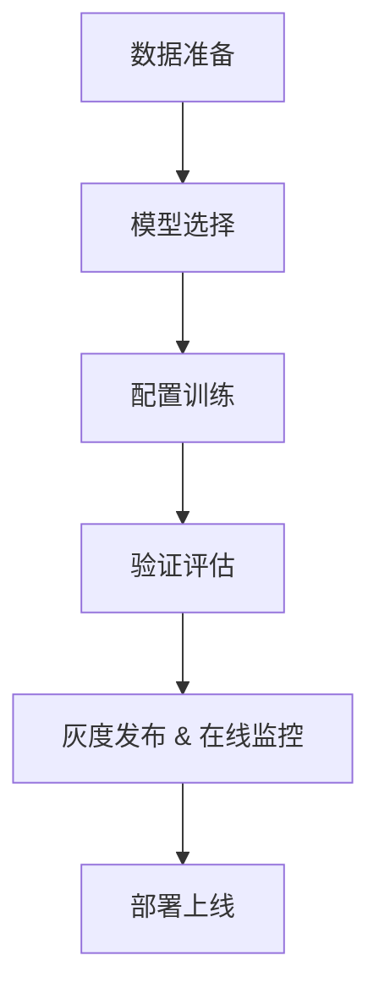

# 一文入门垂域模型 SFT 微调  

**（以金融领域“企业年报分析助手”为案例）**  

## 1. 引言：为什么需要垂域微调？

随着通用大模型（如 `deepseek`、`Qwen`、`Baichuan`）的发展，语言理解和生成的能力大幅提升。但在金融、医疗、法律等专业场景中，直接使用通用模型往往效果不佳。常见问题包括：

- **理解专业术语不到位**  
  - 例如将 `EBITDA` 误判为“营业收入”或与“净利润”混淆。  
  - 建议在数据预处理阶段做同义词标准化，以统一术语描述。

- **生成内容存在事实性错误**  
  - 如误报企业财务数据或法规条款；  
  - 可通过“自动 redact（脱敏）敏感信息”模块，确保不泄露或误报关键数据。

- **无法满足行业合规性要求**  
  - 生成的表述可能不符合金融披露规范，或遗漏必要的风险提示。

究其原因，通用大模型虽然掌握了大量公共知识，但缺乏对特定领域细粒度知识的深入建模。因此，需要通过**监督式微调（SFT, Supervised Fine-Tuning）**，在小规模、专业化的数据上进一步优化模型，使其在特定任务和领域表现更好。  

> **SFT 相比从零训练大模型，成本更低（通常仅需 10%–20% 预训练全量算力）、周期更短。**  
> 例如对一个 `7B` 模型在 `8 × A100`（`80 GB`）上做 `SFT`，通常仅需 `4–12` 小时即可完成。  
> 同时，对金融场景，实务中常从 **1 万–5 万** 条高质量标注样本开始，便可看到显著性能提升。

## 2. 大模型训练体系简述：SFT 在哪里？

从整体训练流程看，大模型的发展经历了五个关键阶段：

| **阶段** | **目标** | **数据规模** | **典型耗时** | **典型硬件** |
|-----------------------------------|-----------------------------------|-------------------------|---------------------|---------------------------|
| **预训练（Pre-training）** | 获取通用语言知识 | `TB` 级无标注文本 | 几周至数月          | 多机千卡级（如 `64 × A100`） |
| **监督微调（SFT/Instruction Tuning）** | 适配具体任务和指令理解 | `10⁴–10⁵` 条标注样本      | 数小时至数天 | 单机 `4–8 × A100/H100` |
| **强化学习（RLHF）** | 优化人类偏好对齐（安全性、友好性）| 千级人类反馈排序数据 | 数天至数周 | 单机多卡+奖励模型 |
| **安全审计（Safety Check）**       | 检测偏差与违规输出 | 多源监控与规则库 | 持续在线 | `Kubernetes` + `MLOps` 工具   |
| **部署与监控（Online Monitoring）** | 灰度发布、实时偏差/延迟监控 | 日志与指标流水线         | 持续在线 | `Prometheus`、`Grafana` |

### 2.1 SFT 的定位

- **承上启下**：衔接“通用语言能力”与“人类偏好对齐”前的最后一步人工标注对齐  
- **核心作用**：让模型学会解析任务指令，并在垂直领域输出专业、准确的响应  

### 2.2 SFT 与预训练、RLHF 的区别

| **维度** | **预训练** | **SFT** | **RLHF** |
|----------------|---------------------------|--------------------------------|----------------------------|
| **目标**       | 学习语言统计规律 | 适配特定任务指令 | 对齐人类偏好 |
| **数据需求**   | 海量无标注文本 | 少量高质量 Prompt–Response 对 | 人类偏好排序/对比数据 |
| **训练复杂度** | 极高（千卡级集群） | 中等（单机多卡） | 高（需奖励模型 + 人类评审） |

## 3. SFT 原理与工作机制

本质上，SFT 属于典型的监督学习：

- **输入（Prompt）**：用户的指令或问题（如“请分析华为2023年营收增长率”）  
- **输出（Response）**：期望模型生成的规范答案（如“华为2023年营收为 6423 亿元，同比增长 9%”）  
- **优化目标**：最小化模型输出与标准答案的交叉熵损失（Cross-Entropy Loss）  

$$
\mathcal{L} = -\sum_{t=1}^{T} \log P(y_t \mid x, y_{<t})
$$

- **$\;x$**：输入 Prompt 的 token 序列  
- **$\;y$**：目标输出的 token 序列  
- **$\;T$**：输出序列长度  

### 3.1 关键技术点

1. **Teacher Forcing**  
   - 训练时将前一步的真实 `token` 作为输入，促使模型快速收敛。  
2. **Label Smoothing**  
   - 在标签上加小噪声，防止模型过度自信，从而提升泛化能力。  
3. **批量梯度 vs. 在线学习**  
   - 对大规模数据可采用小批次（`batch`）训练；对新鲜反馈可通过在线微调快速落地。  

## 4. 工程实践：SFT 微调流程总览



### 4.1 关键环节说明

| **环节** | **输入** | **输出** | **常见工具** |
|----------------|------------------------------|-----------------------------|---------------------------------------------------|
| **数据准备**   | 年报 PDF、原始领域文档 | 清洗并格式化的 SFT 数据集 | Apache Tika / PDFPlumber、OCR 清洗、Label Studio |
| **模型选择**   | 场景需求 & 资源预算 | 基础模型（如 Qwen-7B、Baichuan-13B、LLaMA2-7B） | Hugging Face Model Hub                           |
| **配置训练**   | 数据集 + 基础模型 | 微调后的领域适配模型 | PyTorch、DeepSpeed、PEFT                         |
| **验证评估**   | 测试集 + 自动化评测用例 | 模型性能报告 | OpenAI Evals、EleutherAI Evals、MLflow |
| **灰度发布 & 在线监控** | 服务请求日志、监控指标 | 实时偏差与延迟报警 | Prometheus、Grafana、Sentry |
| **部署上线**   | 训练好的模型 | API 服务或应用 | vLLM、Triton Inference |

## 5. 金融案例实践：打造“企业年报分析助手”

### 5.1 任务设定

<table border="1" cellpadding="5" cellspacing="0" data-bbox="0 0 1269 638" style="border-collapse: collapse;"><tr><td><strong>用户提问</strong></td><td><strong>理想回答</strong></td></tr><tr><td>华为 2023 年的研发投入占比是多少？</td><td>根据华为 2023 年年报（财年基准，非日历年），研发支出 1 647 亿元，总收入 6 423 亿元，研发投入占比 = (1 647 ÷ 6 423) × 100% ≈ 25.65%。<br>（保留两位小数，注意财年/日历年差异）</td></tr><tr><td>对比腾讯和阿里过去三年的净利润增长率</td><td>示例表格模板（数据来源：各公司年报原文，第 4 页）<br>  <table border="1" cellpadding="5" cellspacing="0" data-bbox="0 0 1269 638" style="border-collapse: collapse;"><tr><td>年份</td><td>腾讯 YoY</td><td>阿里 YoY</td></tr><tr><td>2021</td><td>… %</td><td>… %</td></tr><tr><td>2022</td><td>… %</td><td>… %</td></tr><tr><td>2023</td><td>… %</td><td>… %</td></tr></table></td></tr></table>

- **性能要求**  
  - **准确率 > 95%**：关键数字必须零误差（Exact Match）。  
  - **合规性**：避免主观臆断，全程引用年报原文。

### 5.2 数据准备


- **OCR 清洗**：纠正识别错误，去除页眉/页脚冗余  
- **自动生成 + 人工校对**：先用 `LLM` 生成 `Prompt–Response` 对，再严格人工审核  

### 5.3 数据增强技巧

- **同义改写**：自动工具＋人工扩写，保证问法多样性  
- **负样本注入**：插入 `5%–10%` 的错误答案，帮助模型学会甄别  
- **推理链引导（CoT）**：示例 Prompt：  
  > “请先列出计算公式，再计算华为研发投入占比，并说明每一步的依据。”  
- **上下文扩展**：对涉及多段信息的问题，提供完整上下文片段  

### 5.4 模型与框架选择

| **方法** | **显存占用** | **训练速度** | **适用场景** |
|---------------------|--------------|--------------|--------------------|
| 全参数微调 | 高 | 慢 | 数据量充足时 |
| LoRA | 中 | 快 | 常规资源受限场景 |
| QLoRA | 低 | 中等 | 超大模型微调 |
| Prefix-Tuning | 低 | 快 | 轻量化、快速实验 |
| Adapter-Tuning | 中 | 快 | 插件式微调 |

```python
# LoRA 典型参数（7B 模型）
from peft import LoraConfig

lora_config = LoraConfig(
    r=8,
    lora_alpha=32,
    target_modules=["q_proj", "v_proj"],
    lora_dropout=0.05,
    task_type="CAUSAL_LM"
)
```

### 5.5 训练实操（代码优化建议）

- **混合精度训练**  
  - 常用 `fp16（AMP）`；若使用 `bfloat16`，则需 `H100` 或 `Google A2 GPU` 支持。  
- **梯度检查点**  
  - `gradient_checkpointing=True`，显存节省 `30%–40%`。  
- **学习率策略**  
  - 基础 `lr 1e-4 → 1e-5`，余弦退火（`cosine`），`warmup 3%–5%`。  

### 5.6 验证与评估

- **自动化评测框架**：`OpenAI Evals`、`EleutherAI Evals` 示例用例  
- **常见指标**：

  | **指标** | **含义** | **适用场景** |
  |-------------------------------|----------------------------------------------------|------------------------|
  | **准确率（Exact Match）** | 生成内容与标准答案的精确匹配率 | 数值、短文本回答 |
  | **推理步骤一致率（CoT 质量）** | 连锁推理中，过程逻辑与标准步骤的匹配度 | 多步推理、解释型任务    |
  | **召回率 / 漏答率** | 模型是否遗漏所有隐含子问题或关键点 | 综合型复杂问题 |
  | **困惑度（Perplexity）** | 语言模型对数据集的预测难度 | 模型整体生成质量评估 |
  | **延迟（Latency）** | 端到端响应时延 | 在线服务场景 |
  | **Token 利用率** | 截断或填充导致的有效信息比率 | 长文本生成或复杂查询 |

```python
def evaluate_accuracy(test_set, model):
    correct = 0
    for sample in test_set:
        pred = generate(sample["instruction"], model)
        if exact_match(pred, sample["output"]):
            correct += 1
    return correct / len(test_set)
```

> **示例 Evals 用例**：对“华为研发投入占比”任务，采用 `evals.record_playground_eval` 自动化验证脚本。

---

## 6. 常见问题与最佳实践

### Q：如何缓解灾难性遗忘？  

- 混合训练：保留 `10%–20%` 通用指令数据  
- 分层学习率：底层参数更小 `lr`  
- **EWC（弹性权重巩固）**、`L2` 正则化  

### Q：数据标注成本高怎么办？  

- 主动学习：优先标注置信度低样本  
- 自训练（`Self-training`）＋半监督学习  
- 知识蒸馏：大模型生成初步标注，再人工校正  

---

## 7. 结束语

在垂直领域应用中，`SFT` 是快速将大模型专业化、工程化落地的重要手段。通过合理设计数据、优化训练过程、强化安全与监控，哪怕资源有限，也能打造出高质量的领域智能助手。希望本文能为你搭建清晰可行的 `SFT` 实践路线。
