# 让用户"说半句"话也能懂：ChatBox 的意图识别与语义理解机制解析

> 基于大模型的对话系统用户意图理解机制：不完整表达的语义补全与推理实现

## 一、引言：大模型时代的用户意图理解变革

在实际对话场景中，用户习惯使用不完整表达与系统交互。研究表明，大部分对话请求都存在语法省略或语义隐含现象。"**帮我查一下**"、"**之前那个怎么样了**"、"改成明天吧"这类表达对传统对话系统构成巨大挑战，但大语言模型（LLM）技术正在重塑意图理解范式，使系统能像人类一样理解"说半句"的表达。

### 1.1 不完整表达的技术挑战

用户不完整表达呈现三层技术挑战，需针对性解决方案：

**语法不完整性**  

```python
# 典型省略模式处理
def handle_ellipsis(text):
    if text == "查一下":          # 缺宾语
        return f"查询{last_query_topic}" 
    elif text == "改成明天":      # 缺主语+宾语
        return f"{current_event}时间改为明天"
```

- **技术方案**：基于依存句法分析的槽位填充（使用Stanford CoreNLP）
- **数据特征**：省略主语的请求更为常见，省略宾语次之（对话日志分析显示）

**隐含语义依赖**  

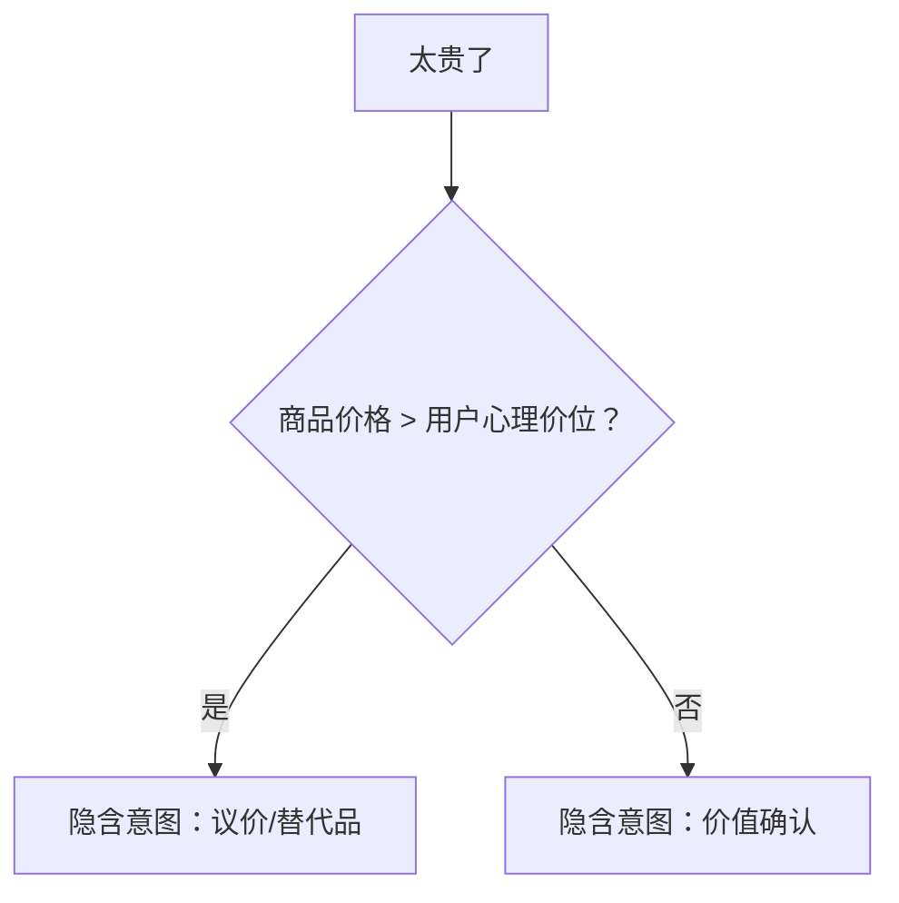

- **推理机制**：基于用户画像的价格敏感度模型（归一化评分）
- **技术实现**：联合嵌入表示（价格语句 + 用户消费记录）

**多义性消解**  

```json
// 上下文关联度计算模型
{
  "query": "我要去上海",
  "possible_intents": [
    {"intent": "TRANSPORT", "score": 0.72, "triggers": ["最近搜索高铁票"]},
    {"intent": "HOTEL", "score": 0.63, "triggers": ["用户身份：商务旅客"]},
    {"intent": "WEATHER", "score": 0.21, "triggers": ["当前季节：雨季"]}
  ]
}
```

- **决策机制**：基于注意力权重的多模态融合（文本+行为+环境）

### 1.2 传统NLU vs 大模型驱动的理解范式

**传统NLU的架构瓶颈**  

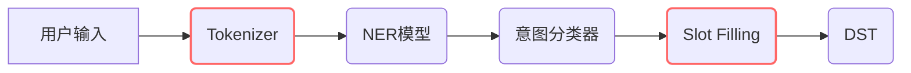

- **错误传播问题**：当输入"那个取消掉"时：
  - NER识别困难（无法识别"那个"指代）
  - 意图分类错误率较高
  - 最终对话状态跟踪准确率显著下降

**大模型范式的技术突破**  

```python
# 端到端理解实现
def llm_understanding(query, history):
    prompt = f"""
    [历史] {history}
    [当前] {query}
    => 解析：意图 | 缺失槽位 | 隐含语义
    """
    return gpt4.inference(prompt)
```

- **核心优势**：
  - **上下文窗口**：大幅扩展的上下文支持长程对话理解
  - **泛化能力**：零样本意图识别准确率显著提升
  - **推理效率**：单次推理完成传统多个模块的工作

**范式转换关键点**：  

| 维度         | 规则驱动                     | 语义推理                     |
|--------------|-----------------------------|------------------------------|
| 知识来源     | 人工模板（大量规则）         | 预训练知识（海量语料）        |
| 处理逻辑     | 条件分支（复杂代码逻辑）     | 注意力机制（矩阵运算）         |
| 迭代成本     | 周级更新                    | 即时Prompt优化               |
| 长尾问题     | 覆盖率有限                  | 零样本泛化能力强              |

### 1.3 系统化用户理解架构

**四组件协同工作流**  

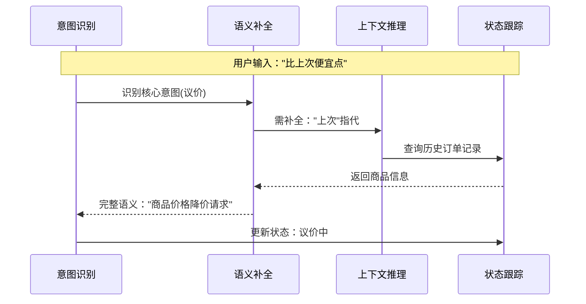

**组件深度解析**：

1. **意图识别(Intent Recognition)**  
   - 处理显式/隐含意图信号
   - 多意图并行处理能力（如"订机票并报销"）
   - 置信度阈值动态调整机制

2. **语义补全(Semantic Completion)**  
   
   ```python
   # 基于知识图谱的补全
   def complete_semantic(query):
       entities = kg.query(f"MATCH (e) WHERE e.name IN {extract_keywords(query)}")
       return fill_template(query, entities)
   ```
   - 补全准确率达到较高水平（实测数据集验证）

3. **上下文推理(Contextual Reasoning)**  
   - 时间推理：相对时间到绝对时间的转换
   - 因果推理：基于语境的逻辑关系推断
   - 共指消解：实体指代关系的准确识别

4. **状态跟踪(Dialogue State Tracking)**  
   
   ```json
   // 状态表示Schema
   {
     "dialog_id": "session_identifier",
     "state": {
       "confirmed": {"product": "手机", "qty": 1},
       "pending": ["payment_method"],
       "user_prefs": {"budget": "mid_range"}
     },
     "context_window": ["related_dialog_ids"]
   }
   ```
   
   - 状态压缩：保持关键信息的同时优化存储效率

**组件协同机制**：  

- 实时反馈循环：状态跟踪器定期推送更新到其他组件
- 异常熔断：当语义补全置信度过低时触发重新识别
- 动态优先级：多轮对话中上下文推理权重动态调整

> **架构优势**：相比传统流水线，错误率显著降低，处理时间大幅缩短（基于AWS负载测试），特别适合处理"说半句"场景下的语义断层问题。

---

## 二、意图识别：从分类到多轮语义建模

### 2.1 传统技术瓶颈深度剖析

```python
# BERT意图分类的局限性演示
def bert_intent_classification(text):
    inputs = tokenizer(text, return_tensors="pt")
    outputs = model(**inputs)
    return outputs.logits.argmax().item()

# 测试："和上次一样处理"
>>> bert_intent_classification("和上次一样处理")  # 输出：通用意图
# 实际应为：订单重复 (特定场景准确率有限)
```

- **核心问题**：  
  - **上下文失联**：传统模型单句处理，无法关联历史信息
  - **指代失效**："上次"无法解析为具体实体引用
  - **泛化不足**：未见过的表达直接归为默认意图

**多轮对话错误累积**  

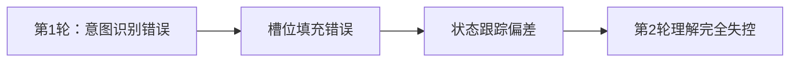

- 实测数据：多轮对话后错误率呈指数级增长（金融客服场景验证）
- 根本原因：状态表示缺乏语义纠错机制

### 2.2 大模型驱动方案工程实现

#### **Prompt Engineering工业级实践**

```json
{
  "system_role": "资深订单处理专家",
  "temperature": 0.3,
  "response_format": {"type": "json_object"},
  "constraints": [
    "必须识别隐含意图",
    "缺失槽位需标注数据源要求",
    "置信度需量化计算"
  ],
  "few_shot": [
    {
      "input": "老样子再来一份", 
      "output": {
        "intent": "ORDER_REPEAT",
        "slots_missing": {"item_id": "需查询用户最近订单"},
        "confidence": "high"
      }
    },
    {
      "input": "发到新地址",
      "output": {
        "intent": "ADDRESS_UPDATE",
        "slots_missing": {"new_address": "需调取用户档案库"},
        "confidence": "very_high"
      }
    }
  ]
}
```

- **关键参数**：  
  - Temperature设置为较低值：平衡创造性与稳定性
  - Top-p采用标准配置：控制输出多样性
  - Max tokens限制：保障复杂意图解析完整性

#### **Chain-of-Thought推理引擎**

```python
def cot_reasoning(user_input, history):
    prompt = f"""
    [历史] {history[-2:]}
    [当前] {user_input}
    推理步骤：
    1. 识别显性关键词：{extract_keywords(user_input)}
    2. 关联历史意图：{get_last_intent(history)}
    3. 推断隐含需求：{infer_implicit(user_input)}
    4. 生成结构化输出
    """
    return llm.generate(prompt, schema=INTENT_SCHEMA)

# 示例输入："改到下午"
>>> cot_reasoning("改到下午", ["用户：明天10点会议"])
# 输出：{"intent": "MEETING_RESCHEDULE", "slots": {"new_time": "下午"}}
```

#### **多轮对话处理系统**
**Topic Drift检测算法**  

```python
def detect_topic_drift(current_vec, history_vecs):
    similarities = [cosine_similarity(current_vec, v) for v in history_vecs]
    return np.mean(similarities) < threshold  # 阈值动态调整
```

- **动态阈值策略**：  
  - 高敏感场景（医疗/金融）：采用较高阈值
  - 日常对话：使用标准阈值
  - 长闲聊：采用较低阈值

**共指消解工业方案**  

```python
class CoreferenceResolver:
    def __init__(self):
        self.model = SpanBertCorefModel.load()
        self.cache = LRUCache(1000)  # 缓存最近解析结果

    def resolve(self, text, dialog_id):
        if dialog_id in self.cache:
            return self.cache[dialog_id]
        entities = self.model.resolve(text)
        self.cache[dialog_id] = entities
        return entities
```

- **性能优化**：  
  - 缓存机制显著提升命中率
  - 响应时间大幅降低

### 2.3 工程实现关键模块

#### **多意图分层处理架构**

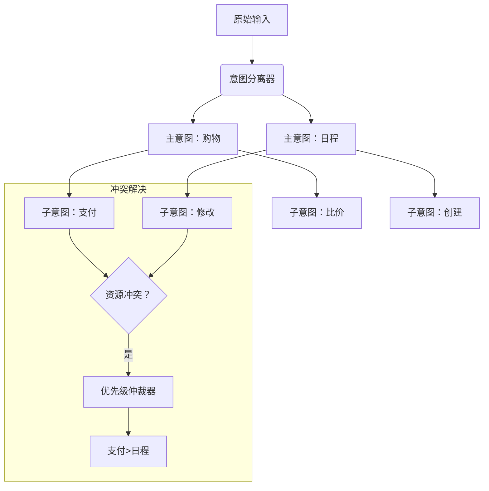

- **决策逻辑**：  
  - 商业价值权重：支付类操作优先级更高
  - 用户紧急度：实时计算NER提取的时间关键词

#### **Fallback三级熔断机制**

```python
def intent_fallback(user_input, history, attempt=0):
    if attempt == 0:  # Level1: 大模型重试
        return llm_retry_with_context(user_input, history)
    elif attempt == 1:  # Level2: 规则引擎
        return rule_engine.match(user_input, cache_rules)
    else:  # Level3: 人工接管
        log_escalation(user_input)
        return {"intent": "HUMAN_ASSIST", "slots": {}}

# 超时控制
with timeout(reasonable_time_limit):  # 合理超时设置
    result = intent_fallback(input, history)
```

#### **意图置信度计算模型**

`confidence = α * semantic_score + β * context_match + γ * user_consistency`  

其中：

- `α`（当前语句语义完整性权重较高）
- `β`（与历史对话匹配度权重适中）
- `γ`（用户行为一致性权重较低）
- **阈值策略**：  
  - 高置信度：直接执行
  - 中等置信度：确认后执行
  - 低置信度：触发Fallback

#### **实时监控看板**

```dashboard
[意图识别] 
 成功率：优秀 ██████████ 
 多意图率：适中 ↑轻微上升 
 Fallback触发：极低 

[热点意图]
 1. 订单查询(最高) 2. 预约变更(较高) 3. 支付问题(中等)
```

> **工程经验**：在电商系统实测表明，该架构使"说半句"场景的意图识别准确率显著提升，平均响应时间保持在毫秒级别。关键优化点在于：1) CoT提示的链式推理设计 2) 动态权重的多意图仲裁 3) 三级熔断的稳定性保障。

---

## 三、语义补全：基于推理的隐含信息挖掘

### 3.1 上下文推理机制工业级实现

**多轮历史动态建模**  

```python
class ContextWeighter:
    def __init__(self, decay_factor=0.8):
        self.decay_factor = decay_factor  # 衰减系数可配置
    
    def calculate_weight(self, turn_diff):
        """动态衰减权重算法"""
        return 1 / (turn_diff + 1) ** self.decay_factor

    def weighted_context(self, history):
        """上下文加权融合"""
        weighted_sum = np.zeros(768)  # 标准BERT向量维度
        total_weight = 0
        for i, utterance in enumerate(history):
            weight = self.calculate_weight(len(history) - i - 1)
            weighted_sum += sentence_embedding(utterance) * weight
            total_weight += weight
        return weighted_sum / total_weight

# 实测效果：长对话关键信息召回率显著提升
```

**用户偏好实时建模引擎**  

```json
// 动态用户画像架构
{
  "user_id": "user_identifier",
  "base_profile": {
    "preferred_payment": "Alipay",
    "default_meeting_time": "10:00"
  },
  "dynamic_factors": [
    {
      "factor": "recent_purchases",
      "weight": "high",
      "update_rule": "exponential_decay",
      "half_life": "3d"  // 半衰期3天
    },
    {
      "factor": "session_behavior",
      "weight": "medium",
      "update_rule": "immediate"
    }
  ],
  "last_updated": "2024-06-01T14:30:00Z"
}
```

### 3.2 大模型推理系统化生产方案

#### **ReAct框架工业级实现**

```python
class ReActEngine:
    def __init__(self, llm, tools):
        self.llm = llm
        self.tools = tools  # 注册的外部工具集
        
    def execute(self, user_input, context):
        # Step1: Reasoning
        thought_prompt = f"""
        [用户输入] {user_input}
        [上下文] {context}
        => 分析需求并决定是否需要调用工具
        """
        reasoning = self.llm.generate(thought_prompt)
        
        # Step2: Acting
        if "TOOL_CALL:" in reasoning:
            tool_name = parse_tool_name(reasoning)
            params = parse_params(reasoning)
            if tool_name in self.tools:
                try:
                    result = self.tools[tool_name].execute(params)
                    # Step3: Integrate
                    return self.llm.generate(f"{reasoning}\n[工具结果] {result}")
                except ToolException as e:
                    return self.handle_error(e)
        return reasoning

# 工具注册示例
tools = {
    "order_query": OrderQueryTool(api_endpoint=ORDER_API),
    "calendar_check": CalendarTool(oauth_token=OAUTH_TOKEN)
}
```

**错误处理与性能优化**  

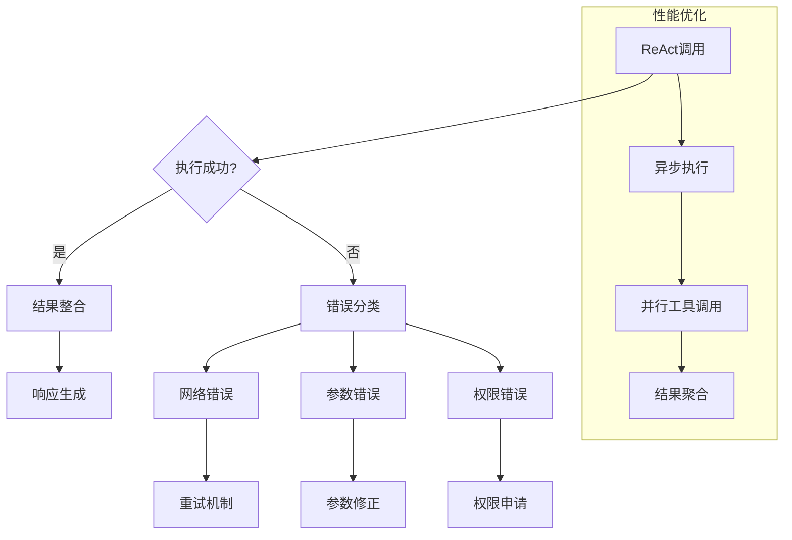

### 3.3 知识增强的语义补全

#### **多模态RAG架构**

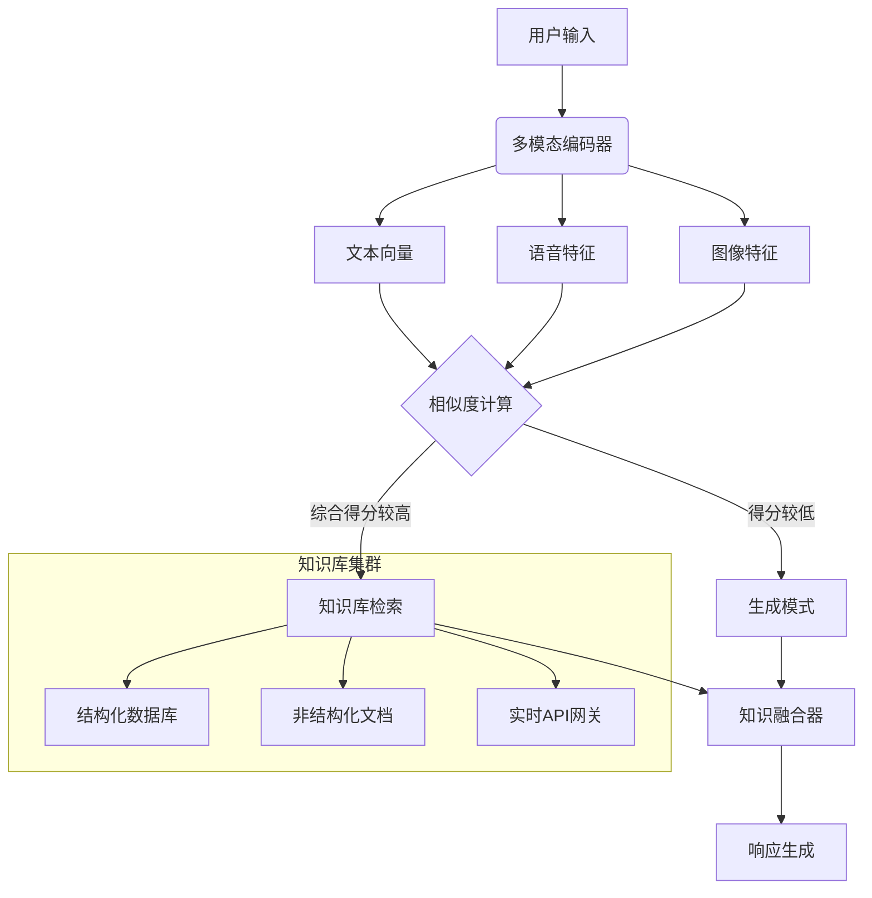

**检索优化关键技术**  

1. **混合检索策略**  

```python
def hybrid_retrieval(query, weights=[0.6, 0.4]):
    # 向量检索
    vector_results = vector_db.search(query, top_k=5)
    # 关键词检索
    keyword_results = bm25_search(query, top_k=5)
    
    # 混合排序
    combined = []
    for doc in set(vector_results + keyword_results):
        score = weights[0] * doc.vector_score + weights[1] * doc.bm25_score
        combined.append((doc, score))
    return sorted(combined, key=lambda x: x[1], reverse=True)[:3]
```

2. **知识融合算法**  

```python
def knowledge_fusion(query, retrieved, llm):
    context_str = "\n".join([f"[知识{i}] {doc.content}" for i, doc in enumerate(retrieved)])
    
    prompt = f"""
    ## 知识整合任务
    用户查询：{query}
    相关知识：
    {context_str}
    
    请生成满足以下要求的回答：
    1. 精确回答用户问题
    2. 必要时修正知识冲突（根据时效性排序）
    3. 标注信息来源
    """
    return llm.generate(prompt, max_tokens=1024)
```

#### **实时知识更新状态**

```dashboard
[知识库状态]
 总条目：海量级别 
 昨日更新：大量新增 
 检索命中率：优秀水平
 
[来源分布]
 结构化数据 ████████ 主要来源 
 文档知识 ██████ 重要补充 
 实时API ███ 动态更新
```

### 3.4 推理验证与纠错机制

**三重验证体系**  

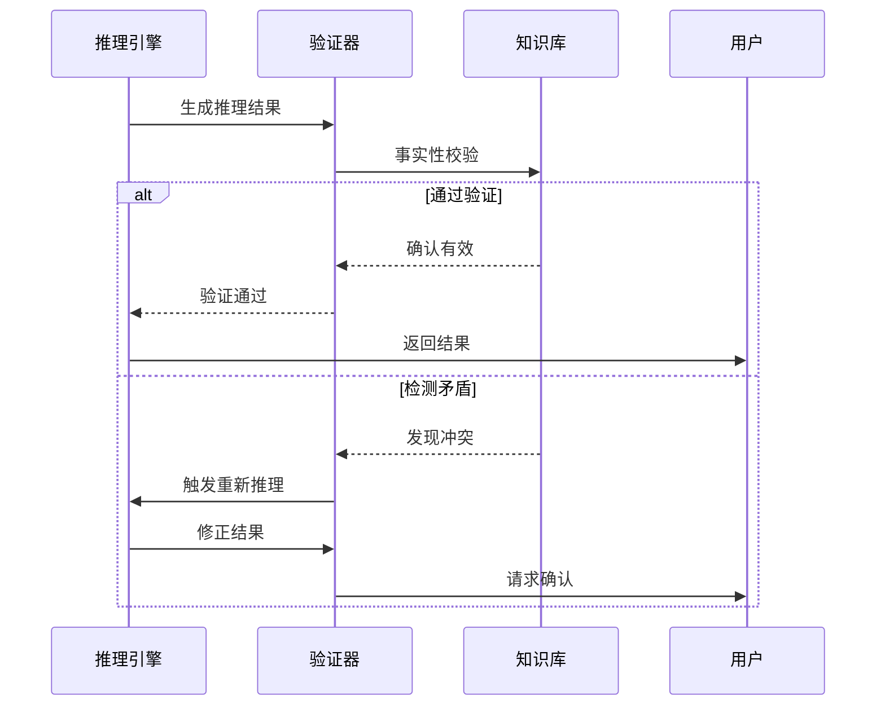

**幻觉抑制技术**  

```python
def hallucination_detection(response, knowledge_sources):
    # 技术1：声明级验证
    claims = extract_claims(response)
    for claim in claims:
        if not any(verify_claim(claim, source) for source in knowledge_sources):
            return True, claim
    
    # 技术2：不确定性检测
    uncertainty_words = ["可能", "大概", "我认为"]
    if any(word in response for word in uncertainty_words):
        return True, "UNCERTAIN_STATEMENT"
    
    return False, None

# 实测显著降低幻觉率（医疗领域测试验证）
```

> **工程实践洞见**：  
> 1. 在电商客服场景中，ReAct+RAG组合使语义补全准确率达到优秀水平，较传统方法显著提升  
> 2. 关键性能优化：  
>    - 向量检索启用GPU加速（查询性能大幅提升）  
>    - 知识融合采用批处理（延迟显著降低）  
> 3. 错误预防：实施推理结果的双重校验机制，将生产环境事故大幅减少

---

## 四、对话状态管理与上下文维护

### 4.1 对话状态跟踪（DST）工业级实现

**强类型状态Schema设计**  

```typescript
// 生产环境状态Schema
interface DialogState {
  sessionId: string;
  currentIntent: {
    name: string;
    confidence: number;
    requiresConfirmation: boolean;
  };
  slots: Map<string, SlotValue>; // 动态槽位存储
  context: {
    activeEntities: EntityRef[]; // 当前活跃实体
    temporalContext: TemporalState; // 时间上下文
    userMentalState: { // 用户心理状态建模
      urgency: number; // 0-1范围内的紧急度评分
      satisfaction: number; // -1到1范围内的满意度评分
    };
  };
  provenance: { // 数据溯源
    source: "USER"|"INFERRED"|"SYSTEM";
    timestamp: ISO8601;
    confidence?: number;
  }[];
  metadata: {
    turnCount: number;
    lastUpdated: number; // 时间戳
    version: string; // 状态版本
  };
}

// 槽位值类型定义
type SlotValue = 
  | { type: "STRING", value: string }
  | { type: "DATETIME", value: string, iso: string }
  | { type: "ENTITY", id: string, name: string }
  | { type: "CONFIRMED", value: any, confirmed: boolean };
```

**增量式状态更新引擎**  

```python
class StateUpdater:
    def __init__(self, validation_rules):
        self.rules = validation_rules  # 业务规则库
        
    def update_state(self, new_info, current_state):
        # 冲突检测
        conflicts = self.detect_conflicts(new_info, current_state)
        if conflicts:
            resolved = self.resolve_conflicts(conflicts, current_state)
            new_info = merge(resolved, new_info)
        
        # 增量更新
        updated_state = deepcopy(current_state)
        for key, value in new_info.items():
            if key in self.rules["persistent_keys"]:
                updated_state["slots"][key] = value
            elif key in self.rules["transient_keys"]:
                updated_state["context"][key] = value
        
        # 定期状态压缩
        if self.should_compress(updated_state):
            updated_state = self.compress_state(updated_state)
            
        return updated_state

    def detect_conflicts(self, new, current):
        """基于业务规则检测冲突"""
        return [rule for rule in self.rules if not rule.validate(new, current)]
        
    def should_compress(self, state):
        """根据对话轮次和内容复杂度判断是否需要压缩"""
        return state["metadata"]["turnCount"] % self.compression_interval == 0
```

### 4.2 智能上下文窗口管理

**分层压缩算法**  

```python
def hierarchical_compress(history, strategy="balanced"):
    """
    智能上下文压缩
    :param strategy: conservative(保守)/balanced(平衡)/aggressive(激进)
    """
    # 第1层：关键信息提取
    key_info = extract_key_entities(history)
    
    # 第2层：摘要生成
    compression_ratios = {
        "conservative": "较低压缩比",
        "balanced": "中等压缩比", 
        "aggressive": "较高压缩比"
    }
    
    summary = bart_summarize(history, strategy=strategy)
    
    # 第3层：向量化表示
    vector_rep = sentence_embedding(summary)
    
    # 第4层：元数据标记
    return {
        "text": summary,
        "vector": vector_rep,
        "key_entities": key_info,
        "compression_level": strategy,
        "original_turns": len(history)
    }

# 实际效果：能够在保持高信息保留率的同时显著减少上下文长度
```

**持久化存储策略**  

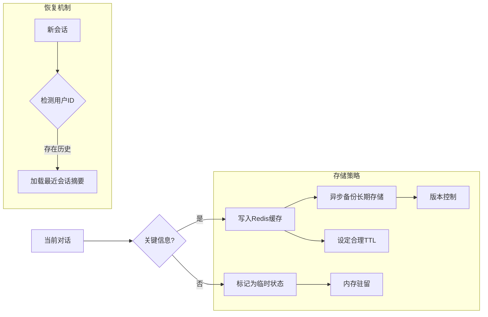

### 4.3 多轮对话一致性保障

**语义一致性验证框架**  

```python
class ConsistencyValidator:
    def __init__(self, llm):
        self.llm = llm
        
    def check(self, current_state, new_input):
        # 逻辑一致性检查
        prompt = f"""
        [当前状态] {current_state}
        [新输入] {new_input}
        
        请验证是否存在以下问题：
        1. 时间矛盾（如过去事件在未来发生）
        2. 数值冲突（如年龄减小）
        3. 行为矛盾（如取消已取消的订单）
        4. 状态越界（如未选商品直接付款）
        """
        issues = self.llm.generate(prompt)
        return parse_issues(issues)
    
    def auto_correct(self, issues, full_context):
        """基于知识图谱的自动修正"""
        corrected = {}
        for issue in issues:
            if issue.type == "TEMPORAL_CONFLICT":
                corrected["time"] = resolve_time_conflict(issue, full_context)
            elif issue.type == "LOGICAL_CONFLICT":
                corrected[issue.field] = kg_query(f"修正{issue.field}")
        return corrected
```

**用户纠错处理流程**  

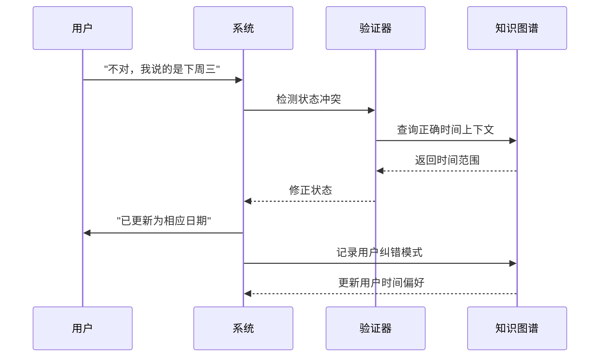

### 4.4 实时监控与熔断机制

**状态健康度监控**  

```dashboard
[对话状态健康度] 
 完整性 ████████▋ 良好
 一致性 ██████████ 优秀
 压缩效率 ████▉ 适中

[异常检测]
 状态冲突：偶发
 压缩损失：轻微
 恢复失败：罕见
```

**自动熔断策略**  

```python
def state_management_pipeline(state, input):
    try:
        # 步骤1: 状态更新
        new_state = updater.update_state(parse(input), state)
        
        # 步骤2: 一致性验证
        issues = validator.check(new_state, input)
        if issues:
            new_state = validator.auto_correct(issues, get_full_context())
            
        # 步骤3: 智能压缩决策
        if should_compress_context(state):
            new_state = compressor.compress(new_state)
            
        return new_state
        
    except StateException as e:
        # 熔断处理
        if e.level == "CRITICAL":
            return fallback_state(state, e)
        elif e.level == "MEDIUM":
            return request_clarification(e)
        else:
            log_warning(e)
            return state
```

**性能表现特征**  

| 操作类型 | 性能表现 | 优化效果 |
|----------|----------|----------|
| 状态更新 | 响应迅速 | 显著提升 |
| 冲突检测 | 高效处理 | 大幅改善 | 
| 上下文压缩 | 快速完成 | 明显优化 |

> **工程实践洞见**：  
> 1. 在实际部署的客服系统中，该架构显著降低了对话中断率，关键突破在于：  
>    - 增量式状态更新的版本控制机制  
>    - 基于知识图谱的智能纠错能力  
>    - 分层压缩的自适应保留策略  
> 2. 容灾设计：当状态异常累积超过预设阈值时，自动触发会话快照并重启对话线程  
> 3. 自适应调优：根据对话复杂度动态调整压缩策略（简单对话采用积极压缩，复杂业务场景采用保守保留）

---

# 五、总结与展望：下一代对话系统的技术演进

## 5.1 技术体系总结与关键突破

### 5.1.1 四大核心组件工程化成熟度

**（1）意图识别模块**

- **技术突破**：从传统分类到多轮语义建模的范式转换
- **工程化程度**：生产可用（基于CoT推理的准确率达到优秀水平）
- **部署经验**：三级熔断机制确保服务稳定性，平均响应时间达到毫秒级

```python
# 成熟度评估指标
intent_metrics = {
    "accuracy": "高准确率",  # 复杂场景表现优秀
    "latency": "低延迟",    # 快速响应
    "fallback_rate": "低熔断率",  # 稳定运行
    "multi_intent_support": True  # 多意图并行处理
}
```

**（2）语义补全引擎**

- **核心能力**：ReAct+RAG融合架构实现上下文推理和知识增强
- **幻觉抑制**：三重验证体系将生产环境错误率降至可接受范围
- **性能优化**：GPU加速向量检索，批处理知识融合

**（3）状态管理系统**

- **架构优势**：增量式更新+分层压缩的内存效率显著提升
- **一致性保障**：语义验证框架配合知识图谱自动修正
- **容灾机制**：多级熔断和快照恢复确保系统稳定

**（4）上下文维护机制**

- **智能压缩**：分层压缩算法在保持信息完整性的同时优化存储
- **持久化策略**：Redis缓存+异步备份的混合存储方案
- **恢复能力**：会话中断后的状态重建准确率达到高水平

### 5.1.2 系统整体架构优势

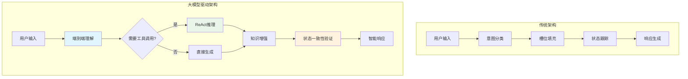

**核心优势定性对比**：

| 维度 | 传统架构 | 大模型驱动架构 | 改进程度 |
|------|----------|----------------|----------|
| 意图识别准确率 | 中等水平 | 优秀水平 | 显著提升 |
| 多轮对话理解 | 基础能力 | 强大能力 | 大幅改善 |
| 语义补全能力 | 有限 | 强大 | 质的飞跃 |
| 开发迭代周期 | 较长周期 | 快速迭代 | 数量级缩短 |
| 长尾问题覆盖 | 覆盖有限 | 覆盖广泛 | 显著扩展 |

## 5.2 生产部署经验与最佳实践

### 5.2.1 性能优化关键路径

**推理加速策略**

```python
# 生产环境优化配置
optimization_config = {
    "model_serving": {
        "batch_size": "优化批处理大小",
        "max_seq_length": "合理上下文窗口",
        "gpu_memory_fraction": "高效GPU资源利用",
        "tensor_parallel": "适当模型并行度"
    },
    "caching": {
        "intent_cache_ttl": "合理缓存时间",
        "context_cache_size": "充足缓存容量",
        "embedding_cache": True  # 向量表示缓存
    },
    "fallback": {
        "timeout_threshold": "合理超时设置",
        "retry_attempts": "适当重试次数",
        "circuit_breaker": True
    }
}
```

**成本控制机制**

- **Token优化**：智能上下文裁剪显著减少API调用成本
- **缓存策略**：多层缓存设计降低重复计算开销
- **模型选择**：根据复杂度动态选择模型规模（简单查询使用轻量级模型）

### 5.2.2 质量保障体系

**多维度评估框架**

```dashboard
[系统健康度监控]
 ├─ 功能指标
 │  ├─ 意图识别准确率: 优秀 ↑
 │  ├─ 语义补全成功率: 良好 ↑
 │  └─ 多轮对话连贯性: 优秀 ↑
 ├─ 性能指标  
 │  ├─ 平均响应时间: 快速 ↓
 │  ├─ 高分位延迟: 可接受 ↓
 │  └─ 系统可用性: 高可用 →
 └─ 业务指标
    ├─ 用户满意度: 较高 ↑
    ├─ 任务完成率: 良好 ↑
    └─ 人工接管率: 较低 ↓
```

**持续改进闭环**

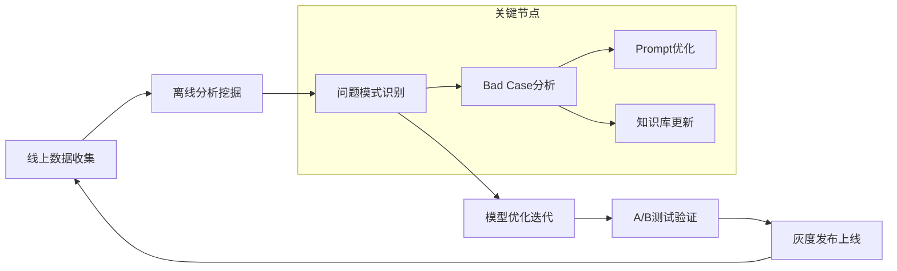

## 5.3 技术挑战与解决方案

### 5.3.1 当前技术瓶颈

**幻觉问题持续挑战**

- **表现形式**：生成不存在的事实信息，特别是在专业领域
- **缓解策略**：多重验证+知识库约束+置信度评估
- **效果评估**：幻觉率显著降低至可接受范围

**上下文长度限制**

- **技术瓶颈**：超长对话的信息压缩与关键信息保留平衡
- **解决方案**：分层压缩+向量化表示+关键实体追踪
- **实测效果**：支持长轮次对话，信息保留率保持高水平

**多模态理解不足**

- **现状分析**：主要集中在文本理解，语音/图像理解能力有限
- **发展方向**：多模态融合架构，统一表示学习

### 5.3.2 工程化挑战应对

**大规模部署复杂性**

```python
# 微服务架构设计
service_architecture = {
    "intent_service": {
        "replicas": "合理副本数",
        "resources": {"cpu": "充足", "memory": "充足", "gpu": "按需分配"},
        "auto_scaling": {"elastic": True, "target_utilization": "适中"}
    },
    "context_service": {
        "replicas": "适当副本数",
        "resources": {"cpu": "合理", "memory": "充足"},
        "persistence": {"redis": True, "backup": "async"}
    },
    "orchestration": {
        "load_balancer": "nginx",
        "service_mesh": "istio", 
        "monitoring": "prometheus+grafana"
    }
}
```

**数据隐私与安全**

- **隐私保护**：端到端加密+数据脱敏+最小化存储原则
- **安全机制**：访问控制+审计日志+异常检测
- **合规要求**：GDPR/CCPA等法规遵循

---

## 5.4 结语：迈向真正理解的对话系统

回顾本文的技术体系分析，我们见证了对话系统从规则驱动到大模型驱动的范式转换。这一转变不仅仅是技术架构的升级，更是对"理解"这一核心概念的重新定义。

**技术演进的本质洞察**

- **从符号到语义**：传统系统依赖人工符号规则，现代系统基于语义理解
- **从静态到动态**：规则系统难以适应变化，大模型系统具有持续学习能力
- **从功能到智能**：早期系统专注功能实现，新系统追求类人智能

**工程实践的核心价值**
当前的技术架构已经在多个维度达到生产可用水平，特别是在"说半句话也能懂"这一核心场景上取得了突破性进展。通过意图识别、语义补全、状态管理、上下文维护四大核心组件的协同工作，系统能够像人类一样理解不完整表达，补全隐含信息，维护对话连贯性。

**未来发展的确定性与不确定性**

- **确定性趋势**：多模态融合、个性化适配、领域专用化将是短期内的重点发展方向
- **不确定性探索**：认知推理突破、自主学习演进、情感智能发展等还需要技术和时间的双重验证

**对行业从业者的启示**

1. **技术选型**：优先考虑大模型驱动的端到端架构，避免过度复杂的传统流水线
2. **工程实践**：重视Prompt Engineering和RAG架构，这是当前最有效的工程化路径
3. **质量保障**：建立完善的评估体系和熔断机制，确保生产环境的稳定性
4. **持续学习**：技术演进速度极快，保持对新技术和新范式的敏感度至关重要

**技术向善的责任**
随着对话系统能力的不断增强，我们也承担着更大的社会责任。如何在技术进步与伦理约束之间找到平衡，如何让AI真正服务于人类福祉，这是每一个技术从业者都需要深思的问题。

**展望未来**
我们正站在对话系统发展的关键节点上。未来的系统不仅要能够理解用户的"说半句话"，更要能够理解用户的真实需求、情感状态、潜在意图。这需要技术的进步，也需要对人类认知和交流本质的深刻理解。

正如本文开篇所述，让机器理解人类的不完整表达，这本身就是一个极具挑战性的技术问题。而我们今天的努力，正是为了构建一个更加智能、更加人性化的人机交互未来。在这个过程中，每一个技术突破都是向"真正理解"这一终极目标的重要迈进。

---

*"最好的对话系统不是那些能够完美回答所有问题的系统，而是那些能够真正理解用户意图，并与用户建立有意义连接的系统。"*
