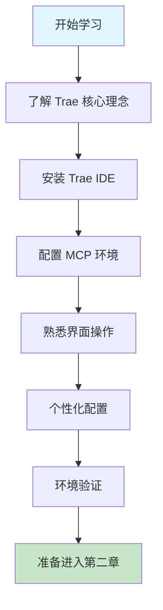

# 第一章 Trae 简介与环境配置

## 1. 学习目标

完成本节学习后，您将能够：

- 理解 Trae 的核心理念和技术优势
- 成功安装和配置 Trae 开发环境
- 熟悉 Trae 界面和基本操作
- 完成个性化配置设置

### 1.1 学习路径图



### 1.2 预期学习成果

完成本章后，您的开发环境将具备：

- ✅ 完整的 Trae IDE 安装
- ✅ AI 助手功能正常运行
- ✅ 至少一个 MCP Server 成功连接
- ✅ 个性化的开发界面配置
- ✅ 基本的 AI 协作工作流程

## 2. Trae 的核心理念和优势

### 2.1 什么是 Trae？

Trae 是新一代 AI 驱动的集成开发环境（IDE），它将人工智能深度集成到编程工作流中，为开发者提供智能化的编程体验。

### 2.2 核心理念

#### 2.2.1 AI-First 开发理念

- **自然语言编程**：使用自然语言描述需求，AI 自动生成代码
- **智能代码补全**：基于上下文的智能代码建议
- **实时代码优化**：AI 持续分析并建议代码改进

#### 2.2.2 协作式编程

- **人机协作**：开发者与 AI 助手紧密配合
- **知识共享**：AI 学习团队编码模式和最佳实践
- **持续学习**：AI 根据项目特点不断优化建议

#### 2.2.3 全栈开发支持

- **多语言支持**：Python、JavaScript、Java、Go、C++ 等
- **框架集成**：React、Vue、Django、Spring Boot 等主流框架
- **云原生开发**：Docker、Kubernetes、微服务架构支持

### 2.3 技术优势

#### 2.3.1 智能代码生成

- 自然语言转代码
- 代码模板自动生成
- 重复代码智能识别
- 设计模式自动应用

#### 2.3.2 实时错误检测

- 语法错误实时提示
- 逻辑错误智能分析
- 性能问题预警
- 安全漏洞检测

#### 2.3.3 智能重构

- 代码结构优化
- 变量命名建议
- 函数拆分重组
- 依赖关系优化

### 2.4 核心功能特性

#### 2.4.1 智能体（Agent）系统

智能体是 Trae 面向不同开发场景的[编程助手](https://docs.trae.cn/ide/agent)。具备以下核心能力：

- **自主运行**：独立探索代码库，识别相关文件并进行必要修改
- **完整工具访问权限**：使用所有可用工具进行搜索、编辑、创建文件及运行终端命令
- **上下文理解**：建立对项目结构和依赖关系的全面理解
- **多步骤规划**：将复杂任务拆分为可执行的步骤，并按顺序逐一处理

**内置智能体：**

- **Builder**：帮助从 0 到 1 开发完整项目
- **Builder with MCP**：在 Builder 基础上集成所有配置的 MCP Server

#### 2.4.2 模型上下文协议（MCP）

[模型上下文协议（Model Context Protocol，MCP）](https://docs.trae.cn/ide/model-context-protocol)允许将外部工具和服务连接至 Trae IDE。

**MCP 特性：**

- **协议标准**：允许大型语言模型访问自定义工具和服务
- **传输类型**：支持 stdio、SSE、Streamable HTTP 三种传输类型
- **扩展强劲**：可添加第三方 MCP Server 或自定义开发

**常用 MCP Server：**

- **Figma AI Bridge**：将 Figma 设计稿转换为前端代码
- **Playwright**：实现网页自动化测试
- **GitHub**：集成 GitHub 仓库管理功能

#### 2.4.3 多模型支持

Trae 预置了业内表现出色的模型，同时支持自定义[模型接入](https://docs.trae.cn/ide/models/)。

**预置模型：**

- 各种能力不同的 AI 模型
- 可根据任务需求切换使用
- 支持模型能力查看和比较

**自定义模型：**

- 支持 API 密钥接入
- 兼容多个服务商：Anthropic、DeepSeek、OpenRouter、火山引擎等
- 灵活的模型管理和配置

## 3. 安装和配置 Trae 开发环境

### 3.1 系统要求

#### 3.1.1 最低配置

> 📋 **数据来源**：基于 [Trae 官方系统要求](https://docs.trae.cn/ide/set-up-trae) (更新时间：2024年)

- **操作系统**：Windows 10/11, macOS 10.15+, Ubuntu 18.04+
- **内存**：8GB RAM（AI 功能需要足够内存支持）
- **存储**：10GB 可用空间（包含模型缓存和项目文件）
- **网络**：稳定的互联网连接（AI 服务需要）

#### 3.1.2 推荐配置

- **操作系统**：最新版本（获得最佳兼容性）
- **内存**：16GB+ RAM（大型项目和多模型切换）
- **存储**：SSD 硬盘，20GB+ 可用空间（提升响应速度）
- **处理器**：多核 CPU（并行处理和编译优化）

### 3.2 安装步骤

#### 3.2.1 下载 Trae

访问 [Trae 官网](https://trae.ai) 下载适合您操作系统的安装包。

#### 3.2.2 安装过程

**Windows 系统：**

```bash
# 下载 .exe 安装文件
# 双击运行安装程序
# 按照向导完成安装
```

**macOS 系统：**

```bash
# 下载 .dmg 文件
# 双击挂载磁盘映像
# 将 Trae 拖拽到 Applications 文件夹
```

**Linux 系统：**

```bash
# 下载 .deb 或 .rpm 包
sudo dpkg -i trae-latest.deb  # Debian/Ubuntu
sudo rpm -i trae-latest.rpm   # RedHat/CentOS

# 或使用 AppImage
chmod +x Trae-latest.AppImage
./Trae-latest.AppImage
```

#### 3.2.3 首次启动配置

启动 Trae 后，系统会引导您完成初始配置：

1. **创建账户或登录**
2. **选择主题和界面语言**
3. **配置代码风格偏好**
4. **设置快捷键**
5. **选择默认编程语言**

### 3.3 MCP 环境配置

为了使用模型上下文协议（MCP）功能，需要配置相应的[运行环境](https://docs.trae.cn/ide/model-context-protocol)。

#### 3.3.1 安装 Node.js 和 npx

> 📋 **版本要求**：Node.js 18+ (LTS 版本推荐)，基于 [MCP 官方要求](https://modelcontextprotocol.io)

```bash
# 安装 Node.js 18 或更高版本
# 访问 https://nodejs.org 下载安装包

# 验证安装
node -v  # 应显示 v18.x.x 或更高版本
npx -v   # 应显示对应的 npx 版本
```

#### 3.3.2 安装 Python 和 uvx

> 📋 **版本要求**：Python 3.8+ (推荐 3.10+)，基于 [MCP Python 要求](https://modelcontextprotocol.io)

```bash
# 安装 Python 3.8 或更高版本
# 访问 https://python.org 下载安装包

# 验证 Python 安装
python --version  # 应显示 Python 3.8.x 或更高版本

# 安装 uv（包含 uvx）
# macOS/Linux
curl -LsSf https://astral.sh/uv/install.sh | sh

# Windows (PowerShell)
powershell -ExecutionPolicy ByPass -c "irm https://astral.sh/uv/install.ps1 | iex"

# 验证 uvx 安装
uvx --version  # 应显示 uv 版本信息
```

#### 3.3.3 （可选）安装 Docker

某些 MCP Server（如 GitHub MCP Server）需要 Docker 支持：

```bash
# 下载并安装 Docker Desktop
# macOS: https://docs.docker.com/desktop/mac/
# Windows: https://docs.docker.com/desktop/windows/

# 验证安装
docker --version
docker info
```

### 3.4 环境验证

完成安装后，通过以下步骤验证环境：

```bash
# 检查 Trae 版本
trae --version

# 检查 AI 服务连接
trae check-connection

# 运行诊断工具
trae diagnose
```

## 4. 界面介绍和基本操作

### 4.1 主界面布局

```text
┌─────────────────────────────────────────────────────────┐
│                        菜单栏                          │
│  文件  编辑  查看  运行  终端  帮助    [AI助手] [设置]  │
├─────────────┬─────────────────────────┬─────────────────┤
│             │                         │                 │
│    文件     │                         │                 │
│   浏览器    │      主编辑区域         │   AI 助手面板   │
│             │                         │                 │
│  📁 项目    │  📄 代码编辑器          │  🤖 对话界面    │
│  🔍 搜索    │  🎨 语法高亮            │  💡 代码建议    │
│  📊 Git     │  ⚡ 智能补全            │  📚 文档生成    │
│             │                         │                 │
├─────────────┼─────────────────────────┼─────────────────┤
│    终端     │       调试控制台        │    输出面板     │
│  💻 命令行  │  🐛 断点调试            │  📋 日志输出    │
│  📦 包管理  │  🔍 变量监视            │  ⚠️ 错误信息    │
└─────────────┴─────────────────────────┴─────────────────┘
```

> 💡 **界面提示**：首次使用时，建议按 `F1` 键查看快捷键帮助，或点击右上角的 `?` 图标获取界面导览。

### 4.2 核心功能区域详解

#### 4.2.1 文件浏览器 📁

**主要功能：**

- **项目树**：显示项目文件结构，支持文件夹展开/折叠
- **快速搜索**：`Ctrl/Cmd + P` 快速定位文件
- **Git 集成**：文件状态显示（新增、修改、删除）
- **右键菜单**：创建、删除、重命名、复制文件

**实用技巧：**

```bash
# 快速操作
Ctrl/Cmd + N     # 新建文件
Ctrl/Cmd + Shift + N  # 新建文件夹
F2               # 重命名文件
Delete           # 删除文件（需确认）
```

#### 4.2.2 主编辑区域 📝

**核心特性：**

- **多标签页**：同时编辑多个文件，支持拖拽排序
- **语法高亮**：自动识别文件类型，提供语法着色
- **智能补全**：AI 驱动的代码建议和自动补全
- **实时错误提示**：红色波浪线标记语法错误，黄色标记警告

**编辑增强功能：**

```bash
# 代码编辑快捷键
Ctrl/Cmd + D     # 选择相同单词
Ctrl/Cmd + /     # 注释/取消注释
Alt + ↑/↓        # 移动行
Shift + Alt + ↑/↓ # 复制行
Ctrl/Cmd + [/]   # 缩进/取消缩进
```

#### 4.2.3 AI 助手面板 🤖

**交互界面组成：**

- **对话窗口**：与 AI 助手进行自然语言交流
- **模型选择器**：切换不同的 AI 模型（右下角下拉菜单）
- **智能体选择**：选择专用智能体（Builder、Builder with MCP 等）
- **历史记录**：查看之前的对话历史

**AI 功能面板：**

- **代码建议**：实时代码优化和改进建议
- **文档生成**：自动生成函数和类的文档
- **问题解答**：编程问题的智能解答和解决方案
- **代码解释**：复杂代码逻辑的详细说明

> 🎯 **使用建议**：初学者建议使用 "Builder" 智能体，它专门为项目开发优化，能提供更全面的帮助。

#### 4.2.4 终端集成 💻

**终端功能：**

- **内置终端**：无需切换到外部终端应用
- **多终端支持**：可同时运行多个终端会话
- **智能补全**：命令和路径的自动补全
- **历史记录**：上下箭头键浏览命令历史

**终端管理：**

```bash
# 终端操作
Ctrl/Cmd + `     # 打开/关闭终端
Ctrl/Cmd + Shift + ` # 新建终端
Ctrl/Cmd + 1/2/3 # 切换终端标签
```

### 4.3 基本操作与实战练习

#### 4.3.1 文件操作实战

**练习 1：创建项目结构：**

```bash
# 使用 AI 助手创建项目
"请帮我创建一个名为 'my-first-project' 的项目，包含以下结构：
- src/ 目录（源代码）
- docs/ 目录（文档）
- tests/ 目录（测试文件）
- README.md 文件
- .gitignore 文件"
```

**练习 2：文件快速操作：**

1. 按 `Ctrl/Cmd + P` 打开文件搜索
2. 输入文件名快速定位
3. 使用 `F2` 重命名文件
4. 右键文件查看上下文菜单

> 💡 **实用技巧**：使用 `Ctrl/Cmd + Shift + E` 快速聚焦到文件浏览器

#### 4.3.2 编辑操作进阶

**多光标编辑：**

```bash
# 多光标操作
Ctrl/Cmd + Click    # 添加光标
Ctrl/Cmd + D        # 选择下一个相同单词
Ctrl/Cmd + Shift + L # 选择所有相同单词
Alt + Click         # 列选择模式
```

**代码折叠与展开：**

```bash
# 代码折叠
Ctrl/Cmd + Shift + [  # 折叠代码块
Ctrl/Cmd + Shift + ]  # 展开代码块
Ctrl/Cmd + K, Ctrl/Cmd + 0  # 折叠所有
Ctrl/Cmd + K, Ctrl/Cmd + J  # 展开所有
```

**练习 3：智能编辑体验：**

1. 创建一个 Python 文件
2. 输入 `def hello` 并观察智能补全
3. 使用 `Tab` 键接受建议
4. 体验代码片段自动展开

#### 4.3.3 AI 助手交互实战

**基础对话练习：**

```text
练习对话 1：
用户："解释一下 Python 中的列表推导式"
观察 AI 的回答格式和代码示例

练习对话 2：
用户："帮我写一个计算斐波那契数列的函数"
观察 AI 如何生成代码并提供解释

练习对话 3：
用户："这段代码有什么问题？" + [粘贴错误代码]
观察 AI 如何分析和修复代码
```

**高级交互技巧：**

- **上下文引用**：选中代码后与 AI 对话，AI 会自动理解上下文
- **多轮对话**：基于之前的回答继续提问，深入探讨
- **代码优化**：请求 AI 优化现有代码的性能和可读性

> 🎯 **交互建议**：
>
> - 描述问题时要具体明确
> - 提供足够的上下文信息
> - 善用"请解释"、"请优化"、"请修复"等指令词

#### 4.3.4 终端操作实战

**基础命令练习：**

```bash
# 项目初始化
mkdir my-project && cd my-project
git init
touch README.md

# Python 项目
python -m venv venv
source venv/bin/activate  # macOS/Linux
# 或 venv\Scripts\activate  # Windows

# Node.js 项目
npm init -y
npm install express

# 查看项目状态
ls -la
git status
```

**终端与 AI 协作：**

1. 在终端遇到错误时，复制错误信息
2. 向 AI 助手询问："这个错误是什么意思？如何解决？"
3. 按照 AI 的建议执行修复命令
4. 验证问题是否解决

#### 4.3.5 综合操作流程

**完整工作流程练习：**

```text
场景：创建一个简单的 Web 应用

步骤 1：项目初始化
- 使用 AI 助手创建项目结构
- 在终端初始化 Git 仓库
- 创建虚拟环境（Python）或初始化包管理（Node.js）

步骤 2：代码开发
- 在编辑器中编写代码
- 使用 AI 助手获取代码建议
- 利用智能补全提高编码效率

步骤 3：测试与调试
- 在终端运行代码
- 使用 AI 助手分析错误
- 在编辑器中修复问题

步骤 4：文档与提交
- 请求 AI 生成代码文档
- 编写 README.md
- 提交代码到 Git
```

> 📝 **练习检查清单**：
>
> - [ ] 能够熟练使用文件浏览器
> - [ ] 掌握基本编辑快捷键
> - [ ] 能与 AI 助手有效交流
> - [ ] 熟悉终端基本操作
> - [ ] 理解完整开发流程

## 5. 账户设置和个性化配置

### 5.1 账户管理

#### 5.1.1 创建 Trae 账户

访问设置 → 账户，完成以下信息：

- **用户名**：唯一标识符
- **邮箱**：用于通知和找回密码
- **个人资料**：姓名、头像、简介
- **偏好设置**：编程语言、框架偏好

#### 5.1.2 订阅管理

> 📋 **数据来源**：基于 [Trae 官方定价页面](https://trae.ai/pricing) (更新时间：2024年)

| 功能项 | 免费版 | 专业版 | 企业版 |
|------------------|----------------|------------------|--------------------||
| AI 功能 | 基础 AI 功能 | 高级 AI 功能 | 定制化 AI 模型 |
| 请求次数 | 每月 100 次 AI 请求 | 无限 AI 请求 | 无限 AI 请求（可设限） |
| 技术支持 | 社区支持 | 优先技术支持 | 专属客户经理 |
| 协作能力 | — | 团队协作功能 | 团队协作功能（含管理权限） |
| 部署方式 | 云端共享 | 云端共享 | 私有部署 |
| 安全保障 | 基础安全保障 | 增强安全机制 | 企业级安全标准 |

> ⚠️ **注意**：具体功能和限制可能随版本更新而变化，请以官方最新信息为准。

### 5.2 个性化配置

#### 5.2.1 主题设置

```json
{
  "theme": {
    "mode": "dark",  // light, dark, auto
    "colorScheme": "monokai",
    "fontSize": 14,
    "fontFamily": "JetBrains Mono",
    "lineHeight": 1.5
  }
}
```

#### 5.2.2 编辑器配置

```json
{
  "editor": {
    "tabSize": 2,
    "insertSpaces": true,
    "wordWrap": "on",
    "minimap": true,
    "lineNumbers": "on",
    "autoSave": "afterDelay",
    "autoSaveDelay": 1000
  }
}
```

#### 5.2.3 AI 助手配置

```json
{
  "ai": {
    "autoComplete": true,
    "suggestionDelay": 300,
    "maxSuggestions": 5,
    "codeStyle": "google",  // google, airbnb, standard
    "language": "zh-CN",    // en, zh-CN, ja, ko
    "verbosity": "medium"   // low, medium, high
  }
}
```

#### 5.2.4 快捷键自定义

```json
{
  "keybindings": [
    {
      "key": "ctrl+shift+p",
      "command": "workbench.action.showCommands"
    },
    {
      "key": "ctrl+`",
      "command": "workbench.action.terminal.toggle"
    },
    {
      "key": "ctrl+shift+i",
      "command": "ai.assistant.toggle"
    }
  ]
}
```

### 5.3 智能体配置

#### 5.3.1 创建自定义智能体

通过 AI 对话窗口的设置 → 智能体，可以创建自定义智能体 [agent-docs](https://docs.trae.cn/ide/agent)。

**智能体配置项：**

- **头像**：上传自定义头像
- **名称**：设置智能体名称
- **提示词**：定义智能体的行为规范和工作流程
- **工具集**：配置可调用的工具和 MCP Server

#### 5.3.2 智能体工具配置

**内置工具：**

- **文件系统**：文件增删改查操作
- **终端**：运行命令并获取结果
- **联网搜索**：搜索相关网页内容
- **预览**：提供前端结果预览

**MCP Server：**

- 可添加一个或多个 MCP Server
- 扩展智能体的功能边界
- 支持第三方服务集成

### 5.4 MCP Server 配置

#### 5.4.1 从市场添加 MCP Server

在 AI 对话框设置 → MCP 中添加所需的 MCP Server

**热门 MCP Server：**

- **Figma AI Bridge**：设计稿转代码
- **Playwright**：网页自动化测试
- **GitHub**：代码仓库管理
- **Database**：数据库操作
- **API Testing**：接口测试

#### 5.4.2 手动配置 MCP Server

> 🔒 **安全提醒**：配置 API 密钥时请注意数据安全

```json
{
  "name": "custom-mcp-server",
  "command": "npx",
  "args": ["@your-org/mcp-server"],
  "env": {
    "API_KEY": "your-api-key",  // 🔒 请使用环境变量存储
    "BASE_URL": "https://api.example.com"
  }
}
```

**安全最佳实践：**

- 🔐 **API 密钥管理**：使用环境变量或密钥管理服务存储敏感信息
- 🚫 **避免硬编码**：不要在配置文件中直接写入 API 密钥
- 🔄 **定期轮换**：定期更新 API 密钥以提高安全性
- 📝 **权限最小化**：为 MCP Server 分配最小必要权限

### 5.5 模型配置

#### 5.5.1 切换预置模型

在 AI 对话输入框右下角可以切换不同的预置模型：

**模型能力对比：**

- **代码生成**：专注于代码编写和补全
- **文档生成**：擅长生成技术文档
- **问题解答**：适合技术问题咨询
- **代码审查**：专业的代码质量分析

#### 5.5.2 添加自定义模型

> 🔒 **安全提醒**：API 密钥配置安全指南

```json
{
  "provider": "OpenAI",
  "model": "gpt-4",
  "apiKey": "${OPENAI_API_KEY}",  // 🔒 使用环境变量
  "baseUrl": "https://api.openai.com/v1",
  "maxTokens": 4096,
  "timeout": 30000  // 30秒超时设置
}
```

**配置安全指南：**

1. **环境变量设置**：

   ```bash
   # macOS/Linux
   export OPENAI_API_KEY="your-actual-api-key"
   
   # Windows
   set OPENAI_API_KEY=your-actual-api-key
   ```

2. **密钥安全原则**：
   - 🔐 使用环境变量存储 API 密钥
   - 🚫 不要在代码或配置文件中硬编码密钥
   - 📝 为不同环境使用不同的密钥
   - 🔄 定期轮换和更新密钥

**支持的服务商：**

- Anthropic、DeepSeek、OpenRouter
- 火山引擎、硅基流动、阿里云
- 腾讯云、模力方舟、BytePlus、Gemini

## 6. 实践练习

### 6.1 练习 1：环境验证

1. 安装 Trae 并完成初始配置
2. 创建一个新的项目文件夹
3. 验证 AI 助手功能是否正常
4. 测试代码补全和错误检测

### 6.2 练习 2：界面定制

1. 切换到暗色主题
2. 调整字体大小为 16px
3. 设置自动保存间隔为 2 秒
4. 自定义一个快捷键组合

### 6.3 练习 3：基本操作

1. 创建一个 Python 文件
2. 使用 AI 助手生成一个简单函数
3. 运行代码并查看输出
4. 使用格式化功能整理代码

### 6.4 练习 4：智能体配置

1. 创建一个自定义智能体
2. 配置智能体的提示词和工具集
3. 使用智能体完成一个简单的编程任务
4. 测试智能体的响应效果

### 6.5 练习 5：MCP Server 集成

1. 从市场添加一个 MCP Server（如 Figma AI Bridge）
2. 配置必要的 API 密钥或访问令牌
3. 创建使用该 MCP Server 的智能体
4. 测试 MCP Server 的功能

### 6.6 练习 6：模型切换和配置

1. 尝试切换不同的预置模型
2. 比较不同模型的代码生成效果
3. 添加一个自定义模型（如果有 API 密钥）
4. 测试自定义模型的性能

---

## 7. 常见问题

### 7.1 Q1: Trae 无法连接到 AI 服务

**解决方案：**

1. 检查网络连接
2. 验证防火墙设置
3. 重新登录账户
4. 联系技术支持

### 7.2 Q2: 代码补全功能不工作

**解决方案：**

1. 检查 AI 助手是否启用
2. 验证项目语言设置
3. 重启 Trae 应用
4. 清除缓存并重新加载

### 7.3 Q3: 界面显示异常

**解决方案：**

1. 重置界面布局
2. 更新到最新版本
3. 检查系统兼容性
4. 重新安装应用

### 7.4 Q4: MCP Server 无法启动

**解决方案：**

1. **环境检查**：

   ```bash
   # 检查 Node.js 版本
   node -v  # 应该 >= 18.0.0
   
   # 检查 Python 版本
   python --version  # 应该 >= 3.8.0
   
   # 检查 npx 和 uvx
   npx --version
   uvx --version
   ```

2. **权限验证**：确认 API 密钥配置正确且有效
3. **网络连接**：检查防火墙和代理设置
4. **日志分析**：

   ```bash
   # 查看详细错误日志
   trae --verbose
   
   # 检查 MCP Server 日志
   tail -f ~/.trae/logs/mcp-server.log
   ```

5. **常见错误码**：
   - `ECONNREFUSED`：网络连接问题
   - `EACCES`：权限不足
   - `MODULE_NOT_FOUND`：依赖缺失

### 7.5 Q5: 智能体响应异常

**解决方案：**

1. 检查智能体的提示词配置
2. 验证工具集权限设置
3. 确认 MCP Server 连接状态
4. 重新创建智能体配置

### 7.6 Q6: 自定义模型连接失败

**解决方案：**

1. **API 密钥验证**：

   ```bash
   # 测试 API 密钥有效性
   curl -H "Authorization: Bearer $OPENAI_API_KEY" \
        https://api.openai.com/v1/models
   ```

2. **网络诊断**：

   ```bash
   # 检查网络连接
   ping api.openai.com
   
   # 检查端口连通性
   telnet api.openai.com 443
   ```

3. **配置验证**：确认服务商 API 地址和模型名称正确
4. **错误日志分析**：

   ```bash
   # 查看详细错误信息
   trae --debug --log-level=verbose
   ```

5. **常见问题排查**：
   - 检查 API 配额是否用完
   - 验证模型名称是否正确
   - 确认账户权限和地区限制

---

## 8. 小结

本节我们学习了：

1. **Trae 核心理念**：AI-First 开发、协作式编程、全栈支持
2. **核心功能特性**：智能体系统、MCP 协议、多模型支持
3. **环境配置**：系统要求、安装步骤、MCP 环境配置、环境验证
4. **界面操作**：布局介绍、基本操作、快捷键使用
5. **个性化设置**：账户管理、主题配置、AI 助手定制
6. **高级配置**：智能体配置、MCP Server 集成、模型管理

掌握这些基础知识后，您就可以开始使用 Trae 进行高效的 AI 辅助编程了。特别是智能体和 MCP 功能，将大大扩展您的开发能力边界。在下一节中，我们将学习如何与 AI 助手进行有效的交互。

---

## 9. 延伸阅读

### 9.1 官方文档

- [Trae 官方文档](https://docs.trae.cn)
- [什么是 Trae IDE？](https://docs.trae.cn/ide/what-is-trae?_lang=zh)
- [安装 Trae 并完成初始设置](https://docs.trae.cn/ide/set-up-trae)

### 9.2 核心功能文档

- [智能体（Agent）](https://docs.trae.cn/ide/agent)
- [模型上下文协议（MCP）](https://docs.trae.cn/ide/model-context-protocol)
- [模型配置和管理](https://docs.trae.cn/ide/models/)

### 9.3 实践教程

- [MCP 教程：将 Figma 设计稿转化为前端代码](https://docs.trae.cn/ide/tutorial-mcp-figma)
- [MCP 教程：实现网页自动化测试](https://docs.trae.cn/ide/tutorial-mcp-playwright)

### 9.4 社区资源

- [Trae 社区论坛](https://community.trae.cn)
- [MCP 官方文档](https://modelcontextprotocol.io)
- [AI 辅助编程最佳实践](https://docs.trae.cn/best-practices)
- [快捷键参考手册](https://docs.trae.cn/shortcuts)
